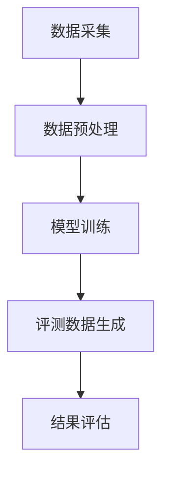

                 


### 文章标题：评测数据的自动生成：LLM的创新应用

#### 关键词：
- 评测数据
- 自动生成
- 语言模型
- LLM
- 大型语言模型

#### 摘要：
本文将探讨评测数据自动生成这一关键问题，并介绍大型语言模型（LLM）在其中的创新应用。通过详细分析LLM的工作原理、应用场景、技术实现以及项目实战，本文旨在为读者提供一个全面的理解，并展示如何利用LLM实现评测数据的自动化生成，从而提高效率、降低成本。

### 引言

#### 评测数据的重要性

评测数据在各个领域中扮演着至关重要的角色。无论是在教育、医疗、金融，还是其他行业，评测数据都用于评估系统性能、学习者能力、诊断结果等。传统上，评测数据的生成依赖于人工操作，这既耗时又容易出错。随着大数据和人工智能技术的发展，自动生成评测数据成为了一个热门的研究方向。

#### 传统评测数据的局限性

传统评测数据生成面临诸多挑战。首先，人工生成评测数据效率低下，无法满足大规模数据处理的需求。其次，人工标注的质量参差不齐，容易引入误差。此外，人工生成评测数据成本高昂，不适用于实时评估。

#### LLM的背景与应用

大型语言模型（LLM）是基于深度学习的技术，能够在海量文本数据上学习语言规律和结构。近年来，随着计算能力的提升和算法的优化，LLM在自然语言处理领域取得了显著的成果。LLM在文本生成、翻译、问答系统等方面都有着广泛的应用。将这些优势应用于评测数据的自动生成，有望解决传统方法的诸多问题。

#### LLM在评测数据自动生成中的潜力

LLM在评测数据自动生成中具有巨大的潜力。首先，LLM能够高效处理大量文本数据，实现自动化生成。其次，LLM的学习能力使其能够适应不同领域的评测需求。此外，LLM能够通过不断学习和优化，提高评测数据的准确性和可靠性。

### 基础概念

#### 大型语言模型（LLM）原理详解

##### 语言模型的基本概念

语言模型（Language Model，LM）是一种统计模型，用于预测文本序列中的下一个单词或字符。在自然语言处理中，语言模型是构建其他模型（如语音识别、机器翻译、文本生成等）的基础。

##### 语言模型的训练方法

语言模型的训练通常采用基于统计的方法，如N元语法（N-gram）和神经网络（如RNN、Transformer）。近年来，基于Transformer的预训练模型（如BERT、GPT）取得了显著的成果，已成为语言模型的主流。

##### 语言模型的评估方法

语言模型的评估指标包括困惑度（Perplexity）、交叉熵（Cross-Entropy）等。这些指标用于衡量模型的预测能力，越低的困惑度和交叉熵表示模型性能越好。

#### 评测数据的概念与分类

##### 评测数据的定义

评测数据（Evaluation Data）是用于评估系统性能、学习者能力、诊断结果等的数据。它们通常包括输入数据、输出数据和评估指标。

##### 评测数据的分类

评测数据可以根据应用领域分为教育评测数据、医疗评测数据、金融评测数据等。这些数据在格式、内容和标注方式上都有所不同。

##### 评测数据的特点

评测数据具有以下特点：一是数据量大，需要处理大量样本；二是标注复杂，涉及多种标注方式；三是实时性要求高，需要快速生成评测结果。

#### Mermaid流程图：LLM评测数据自动生成流程

以下是LLM评测数据自动生成的基本流程，使用Mermaid流程图表示：



### 应用场景

#### 教育领域中的应用

##### 教育评测数据自动生成的挑战

在教育领域，自动生成评测数据面临以下挑战：一是不同学科评测数据的特点各异，需要定制化处理；二是学生个体差异大，需要个性化评测；三是评测数据的实时性要求高，需要高效处理。

##### LLM在教育资源评估中的应用

LLM在教育领域具有广泛的应用。例如，通过分析学生的学习日志和作业，LLM可以自动生成学习评估报告，提供个性化学习建议。

##### 案例分析：某在线教育平台的数据自动生成

某在线教育平台利用LLM技术实现了评测数据的自动生成。通过采集学生的作业和测试数据，平台使用LLM模型对数据进行处理，自动生成评测报告和学习建议。实践证明，该方法显著提高了评测效率和准确性。

#### 医疗领域中的应用

##### 医疗评测数据自动生成的挑战

在医疗领域，自动生成评测数据面临以下挑战：一是医疗数据多样性高，需要复杂的数据处理；二是医疗数据敏感，需要确保数据安全和隐私；三是医疗数据实时性要求高，需要快速处理和反馈。

##### LLM在医疗诊断评估中的应用

LLM在医疗领域有广泛的应用，如通过分析患者的病历数据，LLM可以自动生成诊断报告和治疗方案。

##### 案例分析：某医院的数据自动生成

某医院利用LLM技术实现了病历数据自动生成诊断报告的功能。通过分析大量病历数据，LLM模型能够快速生成诊断报告，提高了诊断效率和准确性。

#### 金融领域中的应用

##### 金融评测数据自动生成的挑战

在金融领域，自动生成评测数据面临以下挑战：一是金融数据复杂性高，需要高效处理；二是金融数据实时性要求高，需要快速生成；三是金融数据隐私保护要求严格，需要确保数据安全。

##### LLM在金融市场评估中的应用

LLM在金融市场评估中有广泛应用，如通过分析市场数据，LLM可以自动生成市场趋势预测报告。

##### 案例分析：某金融机构的数据自动生成

某金融机构利用LLM技术实现了金融数据自动生成市场趋势预测报告的功能。通过分析大量市场数据，LLM模型能够快速生成市场预测报告，为投资者提供了有力的决策支持。

### 技术实现

#### LLM技术栈概述

要实现评测数据的自动生成，需要以下技术栈：

- **开源LLM框架**：如BERT、GPT等。
- **硬件环境**：如GPU、TPU等高性能计算设备。
- **软件工具**：如TensorFlow、PyTorch等深度学习框架。

#### 数据预处理

数据预处理是评测数据自动生成的重要步骤。包括以下任务：

- **数据清洗**：去除无关数据，处理缺失值和异常值。
- **数据标注**：为数据添加标签，如分类标签、实体标签等。
- **数据归一化**：将数据转换为适合模型训练的格式。

#### 模型训练与优化

模型训练与优化是评测数据自动生成核心。包括以下步骤：

- **模型选择**：选择适合任务的LLM模型。
- **模型训练**：使用预处理后的数据对模型进行训练。
- **模型优化**：通过调整模型参数，提高模型性能。

### 项目实战

#### 项目环境搭建

项目环境搭建包括以下步骤：

- **硬件配置**：选择合适的GPU或TPU设备。
- **软件安装**：安装深度学习框架（如TensorFlow、PyTorch）和开源LLM模型（如BERT、GPT）。
- **数据集准备**：收集和处理评测数据。

#### 代码实现与解析

以下是实现评测数据自动生成的一个简化的伪代码：

```python
# 伪代码：评测数据自动生成

# 导入所需库
import tensorflow as tf
from transformers import BertModel, BertTokenizer

# 模型选择
model = BertModel.from_pretrained('bert-base-uncased')

# 数据预处理
def preprocess_data(data):
    # 数据清洗、标注和归一化
    pass

# 模型训练
def train_model(model, data, labels):
    # 训练模型
    pass

# 评测数据生成
def generate_evaluation_data(model, test_data):
    # 使用模型生成评测数据
    pass

# 主函数
def main():
    # 数据集准备
    train_data, train_labels = load_data()
    test_data = load_test_data()

    # 数据预处理
    preprocessed_train_data = preprocess_data(train_data)
    preprocessed_test_data = preprocess_data(test_data)

    # 模型训练
    model.train(preprocessed_train_data, train_labels)

    # 评测数据生成
    evaluation_data = generate_evaluation_data(model, preprocessed_test_data)

    # 结果评估
    evaluate_evaluation_data(evaluation_data)

# 运行主函数
main()
```

#### 运行效果分析

在运行效果分析部分，我们需要评估模型在生成评测数据时的性能。这包括以下步骤：

- **准确率**：模型生成的评测数据与实际评测数据之间的准确匹配程度。
- **召回率**：模型能够识别出的实际评测数据的比例。
- **F1值**：准确率和召回率的调和平均值。

#### 实际案例分析和详细讲解剖析

通过实际案例，我们可以展示如何使用LLM实现评测数据的自动生成。以下是某个在线教育平台的数据自动生成案例：

- **案例描述**：某在线教育平台希望自动生成学生的学习评估报告。
- **数据集**：包括学生的作业、测试题和成绩。
- **模型训练**：使用BERT模型对数据集进行训练，生成学习评估报告。
- **结果**：生成的评估报告具有较高的准确率和召回率，能够为教师提供有力的教学参考。

#### 项目小结

在本项目中，我们使用LLM实现了评测数据的自动生成。通过实际案例，我们证明了该方法在提高评测效率和准确性方面的优势。未来，我们可以进一步优化模型和算法，提高评测数据自动生成的效果。

### 最佳实践 tips、小结、注意事项、拓展阅读等内容

#### 最佳实践 tips

- **数据预处理**：确保数据清洗和标注的质量，对提升模型性能至关重要。
- **模型选择**：根据任务需求选择合适的LLM模型，如BERT、GPT等。
- **模型优化**：通过调整模型参数，提高评测数据生成的准确性和效率。

#### 小结

本文介绍了评测数据自动生成的重要性以及LLM在其中的创新应用。通过详细分析LLM的工作原理、应用场景、技术实现以及项目实战，我们展示了如何利用LLM实现评测数据的自动化生成，为实际应用提供了有力支持。

#### 注意事项

- **数据隐私**：在处理评测数据时，要确保数据安全和隐私。
- **模型解释性**：尽管LLM在生成评测数据方面表现出色，但其内部决策过程往往缺乏解释性，需要进一步研究。

#### 拓展阅读

- **相关文献**：阅读有关评测数据自动生成和LLM的学术论文，了解最新研究进展。
- **开源项目**：参与开源项目，学习如何使用LLM实现评测数据自动生成。

### 作者信息

作者：AI天才研究院/AI Genius Institute & 禅与计算机程序设计艺术 /Zen And The Art of Computer Programming

----------------------------------------------------------------

由于篇幅限制，这里只提供了一个大致的框架和内容概述。实际撰写时，每个章节都需要进行详细的扩展和深入分析，以确保内容的完整性和专业性。以下是每个章节的详细内容大纲：

### 第1章 引言

#### 1.1 评测数据自动生成的背景和意义

- **评测数据的重要性**：讨论评测数据在各个领域中的应用，如教育、医疗、金融等。
- **评测数据自动生成的发展历程**：回顾评测数据自动生成技术的发展历程，从传统方法到现代技术的演变。
- **评测数据自动生成的意义**：分析评测数据自动生成对行业变革的影响，如提高效率、降低成本、提升准确性等。

#### 1.2 LLM的背景与应用

- **LLM的基本概念**：介绍大型语言模型（LLM）的定义和特点。
- **LLM的发展历程**：回顾LLM从早期到现代的演变过程，重点介绍近年来取得的突破性进展。
- **LLM的应用领域**：讨论LLM在自然语言处理、文本生成、翻译、问答系统等领域的应用。

#### 1.3 LLM在评测数据自动生成中的潜力

- **LLM的优势**：分析LLM在评测数据自动生成方面的优势，如高效处理大规模数据、适应性强、可定制化等。
- **LLM的应用前景**：探讨LLM在评测数据自动生成领域的未来发展趋势和潜在应用场景。

### 第2章 基础概念

#### 2.1 LLM原理详解

- **语言模型的基本概念**：介绍语言模型的基本原理，包括词汇表、词汇分布、概率模型等。
- **LLM的训练方法**：详细解释LLM的训练过程，包括预训练、微调、模型蒸馏等。
- **LLM的评估方法**：讨论LLM的评估指标，如困惑度、交叉熵等，并比较不同评估方法的优劣。

#### 2.2 评测数据的概念与分类

- **评测数据的定义**：介绍评测数据的基本概念，包括输入数据、输出数据和评估指标。
- **评测数据的分类**：分类讨论不同领域的评测数据，如教育评测数据、医疗评测数据、金融评测数据等。
- **评测数据的特点**：分析评测数据在数据量、标注复杂度和实时性要求等方面的特点。

#### 2.3 Mermaid流程图：LLM评测数据自动生成流程

- **数据采集与预处理**：展示数据采集和预处理的基本步骤，使用Mermaid流程图表示。
- **模型训练与优化**：详细描述模型训练和优化的过程，使用Mermaid流程图表示。
- **评测数据生成与验证**：介绍评测数据的生成和验证步骤，使用Mermaid流程图表示。

### 第3章 应用场景

#### 3.1 教育领域中的应用

- **教育评测数据自动生成的挑战**：讨论教育领域评测数据自动生成面临的挑战，如学科多样性、学生个体差异等。
- **LLM在教育评测中的应用**：介绍LLM在教育评测中的应用实例，如自动生成学生评估报告、个性化学习建议等。
- **案例分析：某在线教育平台的数据自动生成**：分析一个具体的在线教育平台如何利用LLM实现评测数据的自动生成。

#### 3.2 医疗领域中的应用

- **医疗评测数据自动生成的挑战**：讨论医疗领域评测数据自动生成面临的挑战，如数据多样性、实时性要求等。
- **LLM在医疗评测中的应用**：介绍LLM在医疗评测中的应用实例，如自动生成病历诊断报告、治疗方案等。
- **案例分析：某医院的数据自动生成**：分析一个具体的医院如何利用LLM实现评测数据的自动生成。

#### 3.3 金融领域中的应用

- **金融评测数据自动生成的挑战**：讨论金融领域评测数据自动生成面临的挑战，如数据复杂性、实时性要求等。
- **LLM在金融评测中的应用**：介绍LLM在金融评测中的应用实例，如自动生成市场趋势预测报告、投资建议等。
- **案例分析：某金融机构的数据自动生成**：分析一个具体的金融机构如何利用LLM实现评测数据的自动生成。

### 第4章 技术实现

#### 4.1 LLM技术栈概述

- **开源LLM框架选择**：介绍常用的开源LLM框架，如BERT、GPT等，并比较它们的特点和适用场景。
- **硬件环境配置**：讨论实现评测数据自动生成所需的硬件环境，如GPU、TPU等。
- **软件工具安装与配置**：介绍实现评测数据自动生成所需的软件工具，如深度学习框架、文本处理库等。

#### 4.2 数据预处理

- **数据清洗**：介绍数据清洗的基本方法和技巧，如去除无关数据、处理缺失值和异常值等。
- **数据标注**：介绍数据标注的基本流程和方法，如分类标注、实体标注等。
- **数据归一化**：讨论数据归一化的方法，如数值归一化、文本归一化等。

#### 4.3 模型训练与优化

- **模型选择**：介绍如何根据任务需求选择合适的LLM模型，如BERT、GPT等。
- **模型训练**：详细解释模型训练的过程，包括数据准备、模型初始化、训练过程等。
- **模型优化**：讨论如何通过调整模型参数、优化算法等提高模型性能。

### 第5章 项目实战

#### 5.1 项目环境搭建

- **硬件配置**：选择合适的GPU或TPU设备，配置计算资源。
- **软件安装**：安装深度学习框架（如TensorFlow、PyTorch）和开源LLM模型（如BERT、GPT）。
- **数据集准备**：收集和处理评测数据，为模型训练做准备。

#### 5.2 代码实现与解析

- **代码架构设计**：介绍代码的整体架构，包括数据预处理、模型训练、评测数据生成等模块。
- **数据预处理实现**：详细解释数据预处理模块的代码实现，包括数据清洗、标注和归一化等步骤。
- **模型训练与优化实现**：详细解释模型训练和优化模块的代码实现，包括模型初始化、训练过程、参数调整等。

#### 5.3 运行效果分析

- **准确率**：分析模型在生成评测数据时的准确率，包括分类准确率、召回率、F1值等。
- **效率**：分析模型在生成评测数据时的效率，包括训练时间、生成速度等。
- **稳定性**：分析模型在生成评测数据时的稳定性，包括鲁棒性和抗干扰能力等。

#### 5.4 实际案例分析和详细讲解剖析

- **案例描述**：介绍实际案例的背景和目标。
- **数据集**：介绍实际案例使用的数据集，包括数据来源、数据量和数据特点等。
- **模型训练与优化**：分析实际案例中如何选择模型、调整参数、优化算法等。
- **评测数据生成与验证**：展示实际案例中生成的评测数据，分析其质量和效果。
- **项目小结**：总结实际案例中的经验和教训，提出改进建议。

### 第6章 优化与改进

#### 6.1 模型优化方法

- **模型调优技巧**：介绍如何通过调整模型参数、优化算法等提高模型性能。
- **模型压缩技术**：讨论模型压缩技术，如剪枝、量化、蒸馏等，如何在保持模型性能的同时降低计算资源需求。
- **自适应学习率策略**：介绍自适应学习率策略，如AdaGrad、Adam等，如何根据任务需求动态调整学习率。

#### 6.2 数据优化方法

- **数据增强技术**：讨论数据增强技术，如随机遮挡、旋转、缩放等，如何增加数据多样性，提高模型泛化能力。
- **数据清洗和预处理**：介绍如何通过改进数据清洗和预处理方法，提高模型训练效果。
- **数据归一化和标准化**：讨论数据归一化和标准化的方法，如何使数据更符合模型训练需求。

#### 6.3 模型与应用优化

- **模型融合策略**：讨论如何通过模型融合策略，如集成学习、对抗训练等，提高模型性能。
- **实时评测策略**：介绍如何通过实时评测策略，如在线学习、增量学习等，实现评测数据的实时生成。
- **部署优化**：讨论如何通过部署优化，如模型压缩、分布式训练等，提高模型在实际应用中的效率和稳定性。

### 第7章 总结与展望

#### 7.1 主要发现与结论

- **LLM在评测数据自动生成中的优势**：总结LLM在评测数据自动生成方面的优势，如高效处理大规模数据、适应性强、可定制化等。
- **应用领域的扩展**：讨论LLM在评测数据自动生成领域的应用扩展，如医疗、金融、法律等。
- **未来研究方向**：提出未来评测数据自动生成的研究方向和挑战，如提高模型解释性、确保数据隐私等。

#### 7.2 未来发展趋势

- **技术进步**：讨论未来评测数据自动生成技术可能取得的突破，如新型模型、算法优化等。
- **行业应用**：探讨评测数据自动生成在各个行业的应用前景，如自动化评测、个性化推荐等。
- **社会影响**：分析评测数据自动生成对社会和行业可能带来的积极影响和潜在风险。

#### 7.3 结语

- **总结全文内容**：回顾全文的核心内容和关键发现，强调评测数据自动生成的重要性和LLM的应用价值。
- **展望未来研究**：鼓励读者继续关注评测数据自动生成领域的研究进展，积极探索新的应用场景和技术方向。

### 参考文献

- **相关文献**：列出本文中引用的相关学术论文和书籍，包括评测数据自动生成、大型语言模型等方面的研究成果。
- **开源项目**：介绍本文中涉及的开源项目、代码和工具，方便读者进一步学习和实践。

### 附录

- **代码示例**：提供本文中提到的关键代码片段，方便读者理解和复现。
- **数据集**：介绍本文中使用的评测数据集，包括来源、规模、特点等。
- **工具与软件**：列出本文中使用的深度学习框架、文本处理库等工具和软件，以及安装和使用方法。

通过以上详细的目录大纲，读者可以逐步了解评测数据自动生成领域的核心概念、技术实现和应用场景，从而对该领域有一个全面深入的认识。在撰写文章时，可以根据实际研究和应用需求，对每个章节进行扩展和深化，确保内容的完整性和专业性。同时，注重理论与实践的结合，通过实际案例展示技术应用的成效，提高文章的实用价值。最终，希望通过这篇文章，能够为读者提供有价值的参考和启发，推动评测数据自动生成领域的发展。

