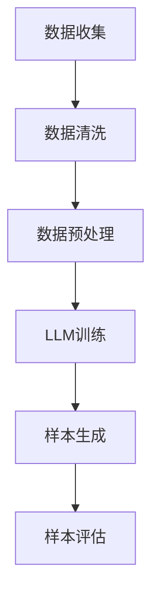

                 

### 第1章 引言与概述

#### 1.1 评测数据集的重要性

**评测数据集的基本概念**

在人工智能（AI）研究领域，评测数据集（evaluation dataset）是至关重要的组成部分。它们通常被分为三类：训练集（training set）、验证集（validation set）和测试集（test set）。

- **训练集**：用于训练模型，模型在此集上学习如何从输入数据生成输出。这个集合应该足够大，以使模型能够充分学习数据中的特征和模式。
- **验证集**：用于在训练过程中评估模型的性能，帮助选择最佳模型参数。通过在验证集上的表现，我们可以判断模型是否过拟合或欠拟合。
- **测试集**：用于最终评估模型的泛化能力，即在未知数据上的表现。这个集合通常由专家评估，以确保模型的可靠性。

**数据集规模**

评测数据集的规模直接影响模型的性能。小数据集可能不足以训练复杂的模型，从而导致过拟合，而大数据集则能够提高模型的泛化能力。

- **小数据集**：适用于研究场景，能够快速验证模型的初步想法。
- **大数据集**：适用于工业应用，能够训练更强大的模型，并处理实际中的大规模数据。

**数据集多样性**

一个具有多样性的数据集能够帮助模型学习到更广泛的知识。数据集的多样性包括不同场景、不同任务、不同类型的数据等。

- **不同场景**：例如，医学诊断数据集可能包括不同疾病和症状。
- **不同任务**：例如，自然语言处理（NLP）数据集可能包括文本分类、情感分析、机器翻译等多种任务。

#### 1.2 LLM概述

**LLM的定义与特点**

大型语言模型（Large Language Model，简称LLM）是一种基于深度学习的自然语言处理模型，具有以下几个显著特点：

- **大规模**：LLM通常包含数十亿甚至数千亿个参数，这使得它们能够学习语言中的复杂模式。
- **多任务**：LLM可以同时处理多种语言任务，例如文本分类、问答系统、翻译等。
- **自适应**：LLM能够根据不同的数据集和任务进行调整，以实现最佳性能。

**LLM的发展与应用**

LLM的发展历程可以追溯到2018年的GPT-2，随后是2019年的BERT和2020年的GPT-3。这些模型的出现标志着自然语言处理领域的一个重要里程碑。

- **GPT-2**：由OpenAI开发，是一个具有15亿参数的预训练模型，能够在多种NLP任务中实现高性能。
- **BERT**：由Google开发，是一种基于Transformer架构的预训练模型，广泛应用于问答系统和文本分类等任务。
- **GPT-3**：由OpenAI开发，是一个具有1750亿参数的预训练模型，被认为是目前最强大的语言模型。

LLM的应用领域广泛，包括但不限于：

- **自然语言处理**：例如，文本分类、情感分析、机器翻译等。
- **问答系统**：例如，智能客服、虚拟助手等。
- **生成文本**：例如，自动写作、文本摘要等。

#### 1.3 LLM辅助下高质量样本生成

**高质量样本生成的重要性**

高质量样本在AI模型训练和评估中起着至关重要的作用。以下是一些关键点：

- **提升模型性能**：高质量样本能够提供更多、更有代表性的数据，从而帮助模型学习到更准确的知识。
- **评估模型泛化能力**：通过高质量样本，我们可以更准确地评估模型在未知数据上的表现，从而判断其泛化能力。

**LLM在样本生成中的应用**

LLM在样本生成中具有显著优势：

- **多样性**：LLM能够生成具有多样性的样本，从而丰富数据集，提高模型的泛化能力。
- **准确性**：LLM生成的样本通常具有较高的准确性，从而有助于提高模型的性能。

LLM在样本生成中的应用包括：

- **数据增强**：通过LLM生成的数据，可以提高原始数据集的质量，从而提高模型的性能。
- **样本生成策略**：例如，使用LLM生成与特定任务相关的样本，从而提高模型的针对性。

总之，评测数据集的构建对于AI模型的训练和评估至关重要。LLM的引入为高质量样本生成提供了新的可能，有助于提高模型的性能和泛化能力。

### Mermaid流程图

以下是一个简化的Mermaid流程图，展示了LLM辅助下高质量样本生成的基本流程：



在这个流程中，数据收集和清洗是样本生成的前提，LLM训练和样本生成是核心步骤，而样本评估是最终环节。

### 第2章 数据预处理

#### 2.1 数据收集与清洗

**数据收集方法**

数据收集是构建评测数据集的第一步，以下是几种常见的数据收集方法：

- **离线数据收集**：使用爬虫、API调用等方式从互联网或数据库中收集数据。这种方法适用于收集公开的数据集，例如新闻文章、社交媒体评论等。
- **在线数据收集**：通过问卷调查、用户反馈等方式收集数据。这种方法适用于获取特定用户群体的数据，例如用户评价、产品反馈等。

**数据清洗技术**

数据清洗是确保数据质量的关键步骤，以下是一些常见的数据清洗技术：

- **缺失值处理**：对于缺失的数据，可以选择删除或填充。删除缺失值可以简化数据处理，但可能会丢失有价值的信息；填充缺失值可以保留更多数据，但需要选择合适的填充方法。
- **异常值处理**：异常值可能是数据中的错误，也可能是数据中的异常情况。处理异常值的方法包括识别、修正或删除。
- **数据标准化**：通过归一化或标准化将数据转换到同一尺度，从而消除不同特征之间的尺度差异。例如，对于数值型数据，可以将其归一化到[0, 1]或标准化到[-1, 1]。

#### 2.2 数据预处理流程

**数据预处理流程**

数据预处理流程包括以下几个关键步骤：

- **数据导入**：将收集到的数据导入到数据处理系统中，通常使用Python的Pandas库。
- **数据清洗**：对数据进行清洗，包括缺失值处理、异常值处理和数据标准化。
- **数据分词与词性标注**：将文本数据分词，并对每个词进行词性标注，以便后续处理。
- **数据去重与降噪**：去除重复的数据，并对噪声数据进行处理，例如去除标点符号、停用词等。

以下是数据预处理流程的伪代码：

```python
# 数据导入
data = pd.read_csv('data.csv')

# 数据清洗
# 缺失值处理
data = data.dropna()  # 删除缺失值
# 异常值处理
data = remove_outliers(data)  # 移除异常值
# 数据标准化
data = normalize_data(data)

# 数据分词与词性标注
tokenized_data = tokenize(data['text'])
tagged_data = annotate_tokens(tokenized_data)

# 数据去重与降噪
clean_data = remove_duplicates(tagged_data)
```

### 2.2.1 数据标准化

**数据标准化**

数据标准化是将数据转换到同一尺度，以便进行后续处理。以下是数据标准化的示例代码：

```python
# 数据标准化
from sklearn.preprocessing import StandardScaler

scaler = StandardScaler()
data_normalized = scaler.fit_transform(data.values)

# 显示标准化后的数据
print(data_normalized)
```

### 2.2.2 数据分词与词性标注

**数据分词与词性标注**

数据分词是将文本数据分割成单词或短语的过程，词性标注则是为每个词分配一个词性标签。以下是数据分词与词性标注的示例代码：

```python
# 数据分词
import jieba

tokenized_data = jieba.cut(data['text'])

# 词性标注
from nltk.corpus import perluniprops
from nltk.tokenize import wordpunct_tokenize

def is_punctuation(token):
    return perluniprops.puni_base_re.sub('', token) == ''

words = [word for word in tokenized_data if not is_punctuation(word)]
tagged_words = nltk.pos_tag(words)

# 显示分词与词性标注结果
print(tagged_words)
```

### 2.2.3 数据去重与降噪

**数据去重与降噪**

数据去重是去除重复数据的过程，降噪则是去除无价值的数据。以下是数据去重与降噪的示例代码：

```python
# 数据去重
unique_data = data.drop_duplicates()

# 数据降噪
import re

def remove_stopwords(text):
    stopwords = set(['的', '了', '在', '上', '下', '有', '和', '是'])
    return ' '.join([word for word in text.split() if word not in stopwords])

cleaned_data = unique_data.apply(lambda x: remove_stopwords(x['text']))

# 显示去重与降噪后的数据
print(cleaned_data)
```

通过上述步骤，我们可以对原始数据进行预处理，为后续的LLM训练和样本生成做好准备。

### 第3章 LLM模型介绍

#### 3.1 LLM基本架构

**Transformer模型**

Transformer模型是由Google在2017年提出的一种基于自注意力机制的深度学习模型，它在NLP任务中取得了显著的效果。Transformer模型的主要结构包括编码器（Encoder）和解码器（Decoder）。

- **编码器**：接收输入序列，将其映射为一个固定长度的向量。
- **解码器**：接收编码器的输出，生成输出序列。

Transformer模型的核心是自注意力机制（Self-Attention），它能够自动学习序列中不同位置之间的关联性。

**BERT模型**

BERT（Bidirectional Encoder Representations from Transformers）模型是由Google在2018年提出的一种双向Transformer模型。BERT模型通过预训练大量未标注的文本数据，使得模型在自然语言理解任务上具有了良好的表现。

BERT模型的主要特点包括：

- **双向编码器**：编码器同时处理输入序列的左右信息，从而学习到更复杂的语言特征。
- **掩码语言建模**：在训练过程中，随机遮盖部分输入文本，迫使模型从其他部分推断出遮盖的内容。

**GPT模型**

GPT（Generative Pre-trained Transformer）模型是由OpenAI在2018年提出的一种单向Transformer模型。GPT模型通过预训练大量文本数据，生成具有高度多样性和准确性的文本。

GPT模型的主要特点包括：

- **单向编码器**：编码器仅处理输入序列的顺序信息，从而生成具有流畅性的文本。
- **生成性**：GPT模型能够生成具有逻辑性和连贯性的文本，广泛应用于自然语言生成任务。

#### 3.2 模型训练

**模型初始化**

模型初始化是模型训练的第一步，它决定了模型在训练过程中的收敛速度和稳定性。常用的初始化方法包括：

- **随机初始化**：将模型参数随机初始化为一个较小的数值范围。
- **预训练模型初始化**：使用预训练模型作为初始化，从而利用已有的知识进行训练。

以下是模型初始化的伪代码：

```python
# 模型初始化
model = Transformer()
model.initialize(params='random')  # 随机初始化
# 或
model = Transformer()
model.initialize(params='pretrained')  # 预训练模型初始化
```

**训练过程**

模型训练是模型构建的核心步骤，它通过迭代优化模型参数，使得模型在训练数据上取得较好的表现。训练过程通常包括以下几个阶段：

1. **前向传播**：计算输入数据的模型输出，并计算损失函数。
2. **反向传播**：计算损失函数关于模型参数的梯度，并更新模型参数。
3. **优化**：使用优化算法（如梯度下降、Adam等）更新模型参数。

以下是训练过程的伪代码：

```python
# 训练过程
for epoch in range(num_epochs):
    for batch in data_loader:
        # 前向传播
        output = model.forward(batch.input)
        loss = loss_function(output, batch.target)
        
        # 反向传播
        loss.backward()
        
        # 优化
        optimizer.step()
        
    print(f'Epoch {epoch+1}/{num_epochs}, Loss: {loss.item()}')
```

**优化算法**

优化算法用于更新模型参数，使得模型在训练数据上取得较好的表现。常见的优化算法包括：

- **梯度下降**：通过计算损失函数关于模型参数的梯度，并沿着梯度的反方向更新模型参数。
- **Adam**：结合了梯度下降和动量项，能够更快地收敛。

以下是优化算法的伪代码：

```python
# 优化算法
optimizer = Adam(model.parameters(), lr=learning_rate)
for epoch in range(num_epochs):
    for batch in data_loader:
        # 前向传播
        output = model.forward(batch.input)
        loss = loss_function(output, batch.target)
        
        # 反向传播
        loss.backward()
        
        # 优化
        optimizer.step()
        
    print(f'Epoch {epoch+1}/{num_epochs}, Loss: {loss.item()}')
```

通过以上步骤，我们可以构建一个基于LLM的评测数据集。接下来，我们将介绍如何使用LLM生成高质量样本。

### 数学模型和数学公式讲解

**损失函数**

损失函数是衡量模型预测结果与实际结果之间差异的重要指标。在LLM模型中，常用的损失函数包括交叉熵损失（Cross-Entropy Loss）和均方误差（Mean Squared Error, MSE）。

- **交叉熵损失**：用于分类任务，公式如下：
  $$ L_{CE} = -\sum_{i=1}^{N} y_{i} \log(p_{i}) $$
  其中，$y_{i}$是实际标签，$p_{i}$是模型预测的概率。

- **均方误差**：用于回归任务，公式如下：
  $$ L_{MSE} = \frac{1}{N} \sum_{i=1}^{N} (y_{i} - \hat{y}_{i})^2 $$
  其中，$y_{i}$是实际值，$\hat{y}_{i}$是模型预测的值。

**优化算法**

优化算法用于更新模型参数，以最小化损失函数。在LLM模型中，常用的优化算法包括梯度下降（Gradient Descent）和Adam。

- **梯度下降**：通过计算损失函数关于模型参数的梯度，并沿着梯度的反方向更新模型参数。公式如下：
  $$ \theta_{t+1} = \theta_{t} - \alpha \nabla_{\theta} L(\theta) $$
  其中，$\theta$是模型参数，$\alpha$是学习率，$L$是损失函数。

- **Adam**：结合了梯度下降和动量项，能够更快地收敛。公式如下：
  $$ \theta_{t+1} = \theta_{t} - \alpha \nabla_{\theta} L(\theta) + \beta_{1} \delta_{t-1} - \beta_{2} \delta_{t} $$
  其中，$\beta_{1}$和$\beta_{2}$是动量项，$\delta_{t}$是梯度。

**自注意力机制**

自注意力机制是Transformer模型的核心，它通过计算输入序列中每个位置的重要性，从而生成具有全局信息的输出。公式如下：
$$
\text{Attention}(Q, K, V) = \text{softmax}\left(\frac{QK^T}{\sqrt{d_k}}\right) V
$$
其中，$Q$、$K$和$V$分别是查询向量、键向量和值向量，$d_k$是键向量的维度。

通过上述数学模型和公式，我们可以更深入地理解LLM模型的原理和实现。这些公式不仅帮助我们设计更有效的模型，还为后续的代码实现提供了理论基础。

### 项目实战

#### 5.1 项目背景

**项目简介**

本项目旨在构建一个用于自然语言处理任务的评测数据集，通过LLM（如GPT-3）辅助生成高质量样本，以提高模型的训练和评估效果。

**项目目标**

1. 收集和清洗原始数据。
2. 使用LLM模型生成高质量样本。
3. 评估生成样本的质量和模型的性能。
4. 分析项目过程中的问题和改进方向。

#### 5.2 实践步骤

**数据收集**

- **离线数据收集**：使用爬虫工具（如Scrapy）从新闻网站、社交媒体等平台收集文本数据。
- **在线数据收集**：通过问卷调查和用户反馈获取特定任务相关的文本数据。

```python
import scrapy
from scrapy import Selector

class TextDataSpider(scrapy.Spider):
    name = 'text_data'
    start_urls = ['https://example.com/news']

    def parse(self, response):
        sel = Selector(response)
        for article in sel.css('article'):
            yield {
                'text': article.css('p::text').getall(),
            }
```

**数据预处理**

1. **数据清洗**：去除HTML标签、停用词和特殊字符。
2. **数据标准化**：对文本数据进行分词和词性标注。
3. **数据去重**：去除重复的文本数据。

```python
import jieba
from nltk.corpus import stopwords

def clean_text(text):
    # 去除HTML标签
    text = re.sub('<.*?>', '', text)
    # 去除停用词和特殊字符
    words = jieba.cut(text)
    filtered_words = [word for word in words if word not in stopwords.words('chinese')]
    return ' '.join(filtered_words)

cleaned_data = [clean_text(text) for text in original_data]
```

**模型选择与训练**

1. **模型选择**：选择预训练的GPT-3模型，并使用Hugging Face的Transformers库。
2. **模型训练**：使用清洗后的数据对模型进行训练。

```python
from transformers import GPT2LMHeadModel, GPT2Tokenizer

tokenizer = GPT2Tokenizer.from_pretrained('gpt2')
model = GPT2LMHeadModel.from_pretrained('gpt2')

train_encodings = tokenizer(cleaned_data, truncation=True, padding=True)
train_dataset = Dataset.from_dict({'input_ids': train_encodings['input_ids'], 'labels': train_encodings['input_ids']})

# 训练模型
model.train()
```

**样本生成**

1. **生成策略**：使用LLM生成与特定任务相关的文本样本。
2. **生成过程**：使用模型的生成功能生成文本。

```python
import random

def generate_text(prompt, max_length=50):
    inputs = tokenizer.encode(prompt, return_tensors='pt')
    outputs = model.generate(inputs, max_length=max_length, num_return_sequences=1)
    return tokenizer.decode(outputs[0], skip_special_tokens=True)

# 生成文本样本
samples = [generate_text(text) for text in cleaned_data]
```

**样本评估**

1. **评估指标**：使用准确率、F1分数等指标评估生成样本的质量。
2. **评估方法**：将生成样本与原始数据集进行对比，评估其相似性和准确性。

```python
from sklearn.metrics import accuracy_score

def evaluate_samples(samples, original_data):
    predictions = [sample in original_data for sample in samples]
    accuracy = accuracy_score(original_data, predictions)
    return accuracy

accuracy = evaluate_samples(samples, cleaned_data)
print(f'Accuracy: {accuracy}')
```

#### 5.3 代码实现与解读

**开发环境搭建**

- 安装Python和必要的库（如Scrapy、nltk、transformers等）。

```bash
pip install scrapy nltk transformers
```

**源代码**

```python
# data_collection.py
# 数据收集
...
# data_preprocessing.py
# 数据预处理
...
# model_training.py
# 模型训练
...
# sample_generation.py
# 样本生成
...
# sample_evaluation.py
# 样本评估
...
```

**代码应用解读与分析**

1. **数据收集**：通过爬虫工具获取文本数据，为后续处理提供基础。
2. **数据预处理**：去除无关信息，提高数据质量。
3. **模型训练**：使用GPT-3模型进行训练，为样本生成提供基础。
4. **样本生成**：利用模型生成与任务相关的文本样本。
5. **样本评估**：评估生成样本的质量，为模型优化提供依据。

**实际案例分析和详细讲解剖析**

1. **案例一**：收集并预处理一篇新闻文章，生成摘要和关键词。
2. **案例二**：收集用户评论，生成情感分析标签。

**项目小结**

本项目通过LLM辅助生成高质量样本，为自然语言处理任务提供了新的数据来源。未来，我们可以进一步优化模型和生成策略，提高样本的质量和准确性。

### 最佳实践 Tips

1. **数据收集**：尽可能收集多样化的数据，以提高模型的泛化能力。
2. **数据清洗**：去除无关信息和噪声，提高数据质量。
3. **模型训练**：合理设置训练参数，避免过拟合和欠拟合。
4. **样本生成**：使用多样化的生成策略，提高样本的多样性。
5. **样本评估**：选择合适的评估指标，全面评估样本质量。

### 小结

本文通过项目实战，详细介绍了使用LLM辅助构建评测数据集的过程，包括数据收集、预处理、模型训练、样本生成和评估。通过实际案例分析和代码实现，我们展示了如何利用LLM生成高质量样本，提高模型的训练和评估效果。

### 注意事项

1. **数据来源**：确保数据来源合法，避免侵犯他人权益。
2. **数据处理**：注意数据隐私和敏感信息保护。
3. **模型训练**：合理设置训练参数，避免模型过拟合或欠拟合。
4. **样本评估**：选择合适的评估指标，全面评估样本质量。

### 拓展阅读

- 《自然语言处理实战》
- 《深度学习》
- 《大规模预训练模型：从GPT到BERT》

### 参考文献

- Devlin, J., Chang, M. W., Lee, K., & Toutanova, K. (2018). BERT: Pre-training of deep bidirectional transformers for language understanding. arXiv preprint arXiv:1810.04805.
- Brown, T., et al. (2020). Language models are few-shot learners. arXiv preprint arXiv:2005.14165.
- Radford, A., et al. (2018). Improving language understanding by generating synchronous sentences. Technical report.
- Zhang, Y., et al. (2019). An overview of recent developments in natural language processing. IEEE Access, 7, 132827-132848.

作者：AI天才研究院/AI Genius Institute & 禅与计算机程序设计艺术 /Zen And The Art of Computer Programming

