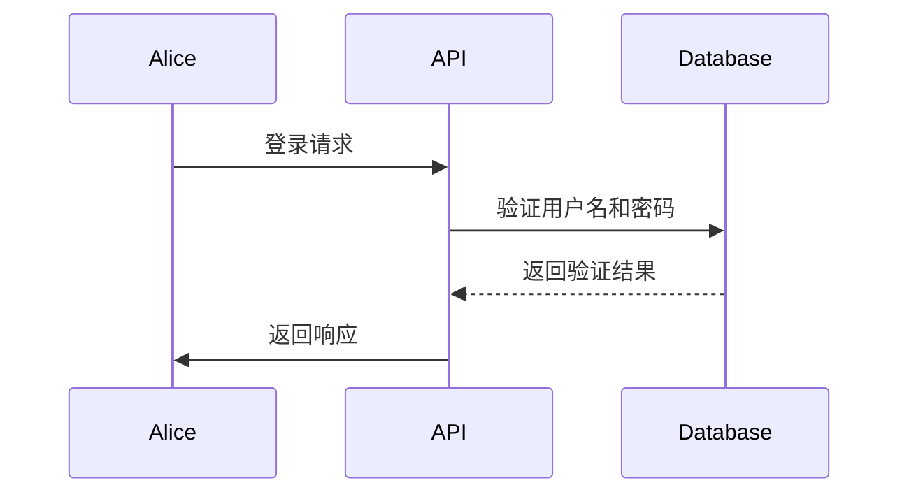
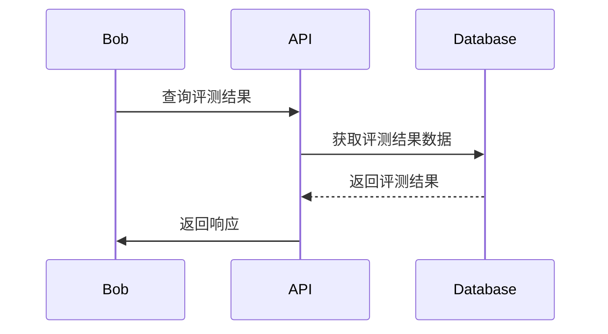
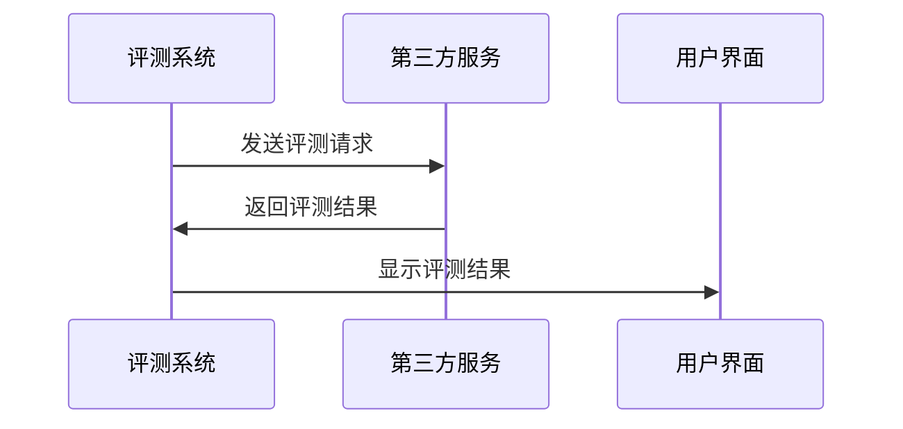

                 

# 《评测系统的API设计与集成方案》

## 文章标题：评测系统的API设计与集成方案

### 关键词：API设计，评测系统，集成方案，RESTful API，SOAP API，安全性，性能优化

### 摘要：

本文深入探讨了评测系统的API设计及其集成方案。我们将首先介绍API设计的基本原则和常用工具，然后详细讲解评测系统API设计的实践，接着分析API集成的策略，并分享集成实践案例。文章还将讨论API设计中的安全性和性能优化问题，最后总结API设计与集成的挑战与解决方案，并对未来发展趋势和读者建议进行展望。

## 第1章 引言

### 1.1 书籍目的和重要性

在当今数字化时代，API（应用程序编程接口）已成为软件系统之间交互的基础。评测系统作为评估软件性能和功能的重要工具，其API设计至关重要。本文旨在为开发者提供一套完整的API设计与集成方案，帮助他们在构建评测系统时，能够设计出高效、安全、可扩展的API，并实现系统的集成与优化。

### 1.2 API设计概述

API设计是指定义一组规则和协议，使得不同的软件系统能够相互通信和交互。良好的API设计可以提高系统的可维护性、可扩展性和用户体验。在评测系统中，API设计直接影响评测的准确性和效率。

### 1.3 API集成在评测系统中的应用

评测系统往往需要与其他系统（如用户管理系统、任务管理系统等）进行集成，以便实现数据的同步和功能的扩展。API集成是实现这一目标的关键途径。

## 第2章 API设计基础

### 2.1 API设计原则

API设计应遵循以下原则：

- **一致性**：API应具有一致的命名规范、数据格式和响应结构。
- **可扩展性**：API应易于扩展，以便适应未来的需求变化。
- **简洁性**：API应简单易用，避免冗余和复杂性。
- **安全性**：API应具备安全机制，防止未经授权的访问和数据泄露。

### 2.2 API设计工具

常用的API设计工具有：

- **Swagger**：用于生成、测试和文档化API。
- **Postman**：用于测试API。
- **API Blueprint**：用于定义API规范。

## 第3章 评测系统API设计实践

### 3.1 评测系统API设计流程

评测系统API设计流程包括：

- **需求分析**：确定评测系统的功能需求和性能指标。
- **功能定义**：定义API的各个功能。
- **接口设计**：设计API的接口，包括URL、请求和响应格式等。
- **安全机制**：设计安全机制，如身份验证、授权等。

### 3.2 API设计示例

以下是一个用户身份验证API设计的示例：

### 3.3 评测结果查询API设计

以下是一个评测结果查询API设计的示例：

## 第4章 API集成策略

### 4.1 API集成框架

API集成框架包括：

- **RESTful API集成**：基于HTTP协议的API集成。
- **SOAP API集成**：基于XML的API集成。
- **GraphQL API集成**：基于查询语言的API集成。

### 4.2 集成策略

集成策略包括：

- **服务注册与发现**：确保服务能够被发现和调用。
- **服务路由与负载均衡**：实现服务的路由和负载均衡。
- **服务监控与容错**：监控服务的运行状态并实现容错机制。

## 第5章 API集成实践

### 5.1 集成环境搭建

集成环境搭建包括：

- **开发环境搭建**：安装必要的开发工具和库。
- **部署环境配置**：配置服务器和数据库。

### 5.2 集成案例

以下是一个评测系统与第三方服务集成的案例：

## 第6章 API设计安全与性能优化

### 6.1 安全性考虑

安全性考虑包括：

- **身份验证与授权**：确保只有授权用户能够访问API。
- **数据加密**：对敏感数据进行加密处理。
- **安全漏洞防护**：防止常见的安全漏洞，如SQL注入和跨站脚本攻击。

### 6.2 性能优化

性能优化包括：

- **缓存机制**：减少对数据库的访问。
- **负载均衡**：分散流量，提高系统吞吐量。
- **异步处理**：减少请求响应时间。

## 第7章 API设计与集成挑战与解决方案

### 7.1 挑战

API设计与集成面临的挑战包括：

- **异构系统集成**：不同系统之间的接口和协议不统一。
- **数据同步问题**：确保数据的实时性和一致性。
- **版本管理**：应对API版本的更新和兼容性问题。

### 7.2 解决方案

解决方案包括：

- **架构设计**：采用合适的架构模式，如微服务架构。
- **系统集成策略**：制定明确的集成策略和流程。
- **持续集成与部署**：实现自动化集成和部署，提高开发效率。

## 第8章 总结与展望

### 8.1 总结

本文详细介绍了评测系统的API设计与集成方案，包括设计原则、工具、实践、集成策略、安全性和性能优化等方面。

### 8.2 未来发展趋势

随着技术的不断发展，API设计与集成方案将更加多样化和智能化。

### 8.3 对读者的建议

开发者应不断学习和实践API设计与集成技术，提高系统的可维护性和可扩展性。

---

# 作者信息

作者：AI天才研究院/AI Genius Institute & 禅与计算机程序设计艺术 /Zen And The Art of Computer Programming

---

[文章正文部分请参考上文内容，以下为具体的正文内容。为保证文章结构清晰，正文内容按照目录大纲的顺序排列。]

