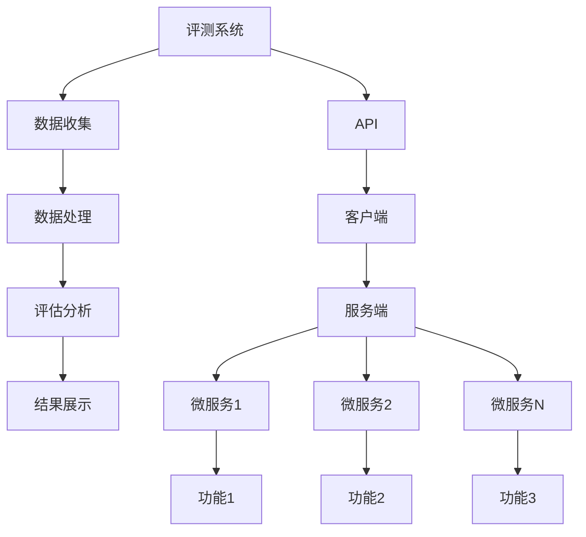

                 


### 文章标题

# 评测系统的API设计：支持第三方集成和扩展

### 文章关键词

- API设计
- 第三方集成
- 扩展性
- 评测系统
- 设计模式
- 微服务架构

### 文章摘要

本文将深入探讨评测系统的API设计，重点分析如何支持第三方集成和扩展。首先，我们将介绍评测系统的基本概念和重要性，然后详细阐述API设计的基本原则和核心模式。接下来，我们将探讨如何实现第三方集成，包括认证、授权和数据处理的策略。之后，我们将介绍系统架构和设计模式，以支持系统扩展和灵活性。此外，文章还将提供最佳实践，涵盖文档编写、性能优化、安全性和合规性。最后，通过实际案例研究，我们将展示如何将这些原则应用到实际项目中，并提供项目小结和拓展阅读建议。

---

## 引言

在现代信息社会中，评测系统作为一种重要的基础设施，广泛应用于教育、企业、科研等多个领域。它通过标准化的评估方法和流程，为各类应用提供了可靠的数据支持和决策依据。随着互联网和云计算技术的发展，评测系统的功能和影响力日益扩大，其对第三方服务的集成和扩展能力也成为了衡量其成熟度和竞争力的重要指标。

API（应用程序编程接口）是评测系统与外部世界交互的桥梁。一个设计良好的API不仅能够简化第三方集成的过程，还能够提高系统的扩展性和灵活性。本文旨在探讨如何设计一个支持第三方集成和扩展的评测系统API，以确保系统能够适应不断变化的需求和环境。

本文的目标读者包括软件工程师、系统架构师、CTO以及对API设计感兴趣的技术爱好者。我们将逐步深入分析API设计的关键要素，提供实用的指导和建议，并通过实际案例展示如何将这些原则应用到实际项目中。

文章结构如下：

1. **引言**：介绍评测系统的基本概念和重要性，以及本文的目标和结构。
2. **核心概念和关系**：详细阐述评测系统、API设计以及系统架构的核心概念和关系，并使用Mermaid流程图进行展示。
3. **API设计原则**：介绍API设计的基本原则，包括RESTful和SOAP设计，以及设计模式和最佳实践。
4. **第三方集成**：探讨如何实现第三方集成，包括认证、授权、数据处理的策略。
5. **系统架构和设计模式**：介绍支持系统扩展和灵活性的架构和设计模式。
6. **最佳实践**：提供API设计、性能优化、安全性和合规性的最佳实践。
7. **案例研究和实际应用**：通过实际案例展示API设计原则的应用。
8. **工具和资源**：推荐API设计工具、开源库和框架，以及在线资源和教程。
9. **结论**：总结文章的主要观点，讨论未来方向和挑战。

接下来，我们将逐步深入每个部分，详细探讨评测系统的API设计。

---

## 核心概念和关系

为了深入理解评测系统的API设计，我们首先需要了解几个核心概念及其相互关系。

### 评测系统的基本概念

评测系统是一种软件工具，用于评估、测量和分析各种数据，例如考试成绩、员工绩效、产品评价等。其主要功能包括：

- **数据收集**：从各种来源收集数据，如问卷、数据库、传感器等。
- **数据处理**：对收集到的数据进行清洗、转换和整合，以便进行分析。
- **评估分析**：使用算法和模型对数据进行分析，生成评估结果。
- **结果展示**：以图表、报告等形式展示分析结果，为决策提供依据。

### API设计的基本概念

API是应用程序编程接口的缩写，它定义了不同软件组件之间交互的规则和标准。在评测系统中，API用于以下方面：

- **数据交换**：第三方系统可以通过API获取和提交评测数据。
- **功能调用**：第三方系统可以通过API调用评测系统的各种功能，如数据导入、导出、评估等。
- **集成扩展**：API设计的好坏直接影响系统的可集成性和可扩展性。

### 系统架构的基本概念

系统架构是指系统组件的构成、相互作用及其关系。在评测系统中，常用的架构包括：

- **客户端-服务器架构**：客户端通过API与服务端交互，实现数据交换和功能调用。
- **微服务架构**：将系统划分为多个独立的微服务，每个微服务负责特定的功能，通过API进行通信。
- **服务导向架构（SOA）**：以服务为中心，通过服务之间的接口进行通信。

### Mermaid流程图

为了更好地展示这些概念之间的关系，我们可以使用Mermaid流程图来绘制系统架构和工作流程。



在这个流程图中，评测系统的核心功能通过API与外部客户端和内部微服务进行交互，实现了数据收集、处理、分析和展示的自动化流程。

### 核心概念与联系

综上所述，评测系统的核心概念包括数据收集、数据处理、评估分析、结果展示，以及API设计。这些概念之间的关系是：

- **数据收集** 是评测系统的起点，为后续数据处理和分析提供基础数据。
- **数据处理** 是对收集到的数据进行清洗、转换和整合，使其适用于评估分析。
- **评估分析** 是评测系统的核心功能，通过算法和模型对数据进行深度分析，生成评估结果。
- **结果展示** 是评测系统的终点，将分析结果以可视化的形式呈现，为决策提供支持。
- **API设计** 是评测系统与外部世界交互的接口，实现数据交换和功能调用，支持系统的集成和扩展。

通过这些核心概念和关系的理解，我们可以为评测系统的API设计奠定坚实的基础。接下来，我们将深入探讨API设计的基本原则，以指导实际设计工作。

---

## API设计原则

设计一个高质量的API是确保评测系统能够与第三方集成和扩展的关键。以下是一些关键的API设计原则，我们将探讨这些原则的详细内容：

### RESTful API设计

**RESTful API** 是基于REST（Representational State Transfer）架构风格的设计方法。它具有以下优点：

- **无状态性**：每个请求都是独立的，不会保留之前的任何状态信息。
- **统一接口**：采用统一的接口设计，如GET、POST、PUT、DELETE等HTTP方法。
- **客户端-服务器架构**：客户端和服务器之间的交互简单明了，客户端负责数据的展示和用户交互，服务器负责数据的处理和存储。

**RESTful API设计原则**：

1. **资源导向**：使用名词来表示资源，如`/evaluations`表示评估数据。
2. **状态转移**：使用HTTP方法表示资源的操作，如GET获取数据，POST提交数据。
3. **标准化**：使用标准的HTTP状态码和响应格式，如JSON或XML。
4. **缓存支持**：利用HTTP的缓存机制，减少不必要的重复请求。

### SOAP API设计

**SOAP（Simple Object Access Protocol）** 是一种基于XML的通信协议，适用于需要高可靠性和标准化的场景。它的优点包括：

- **跨语言支持**：SOAP可以跨不同编程语言和平台工作。
- **详细的错误处理**：SOAP提供了详细的错误信息和处理机制。
- **安全性**：SOAP支持基于WSDL（Web Services Description Language）的安全机制，如SSL和WS-Security。

**SOAP API设计原则**：

1. **服务描述**：使用WSDL描述服务接口，明确服务的功能和操作。
2. **文档编制**：提供详细的文档，包括服务描述、操作说明和参数定义。
3. **版本控制**：为服务接口设计版本控制机制，以适应需求变化。
4. **安全性**：采用适当的安全措施，如身份验证和加密。

### API设计模式和最佳实践

**设计模式** 是解决常见问题的通用解决方案，适用于API设计。以下是一些常用的API设计模式：

- **分页模式**：用于处理大量数据，通过分页减少数据传输量和处理时间。
- **过滤和排序模式**：允许客户端根据特定的条件过滤数据和排序结果。
- **异步处理模式**：用于处理耗时较长的操作，提高系统响应速度。

**最佳实践**：

1. **使用版本控制**：为API设计版本控制，以适应需求变化和兼容旧版本。
2. **提供文档**：使用自动化工具生成API文档，确保文档的实时性和准确性。
3. **性能优化**：采用缓存、异步处理等技术提高API性能。
4. **安全性**：采用加密、身份验证和访问控制等技术保障API安全性。
5. **一致性**：保持API设计的一致性，减少客户端的开发和维护成本。

### 设计原则在第三方集成和扩展中的应用

在设计API时，考虑第三方集成和扩展是非常重要的。以下是一些具体的应用场景：

- **开放接口**：设计开放且易于集成的API，允许第三方系统无缝接入。
- **标准化协议**：使用标准化协议，如HTTP和JSON，提高API的通用性和兼容性。
- **灵活的认证机制**：设计灵活的认证机制，支持多种认证方式，如OAuth 2.0。
- **模块化设计**：采用模块化设计，将核心功能与第三方服务隔离，便于扩展和更新。
- **扩展接口**：设计扩展接口，允许第三方系统自定义功能和行为。

通过遵循这些API设计原则和最佳实践，我们可以确保评测系统的API不仅具有良好的内部结构，还具备高度的集成和扩展能力，从而满足不同场景和需求。

### 总结

API设计是一个复杂且关键的过程，涉及到多个方面。通过理解RESTful和SOAP API设计，应用最佳实践，我们可以设计出既支持第三方集成又具备扩展性的API。接下来，我们将深入探讨如何实现第三方集成，包括认证、授权和数据处理的策略。

---

## 第三方集成

在评测系统中实现第三方集成是一个重要且具有挑战性的任务。第三方集成不仅需要确保系统能够与外部系统无缝对接，还要保障数据的安全性和完整性。以下我们将详细探讨第三方集成中的关键环节：认证、授权、数据处理和跨域数据传输。

### 认证

**认证** 是确保用户和服务端之间交互合法性的过程。在第三方集成中，常见的认证方法包括：

1. **OAuth 2.0**：OAuth 2.0是一种广泛使用的开放标准，用于授权第三方应用访问用户资源的接口。它通过颁发访问令牌（Access Token）来实现认证。

    **OAuth 2.0认证流程**：
    1. 第三方应用向授权服务器请求用户许可。
    2. 用户在授权服务器上登录并同意第三方应用访问其资源。
    3. 授权服务器颁发访问令牌，第三方应用使用该令牌与服务端进行交互。

2. **JSON Web Token (JWT)**：JWT是一种基于JSON数据结构的认证协议，通常用于身份验证和授权。

    **JWT认证流程**：
    1. 用户登录服务端，服务端生成JWT并将其返回给客户端。
    2. 客户端在每次请求时附带JWT，服务端验证JWT的有效性。

**认证的挑战和解决方案**：

- **安全性**：OAuth 2.0和JWT都存在安全漏洞，如令牌泄露和重放攻击。解决方案包括使用HTTPS、限制令牌有效期、使用加密算法等。
- **兼容性**：不同的第三方系统可能使用不同的认证方法。解决方案是设计灵活的认证接口，支持多种认证方式。

### 授权

**授权** 是确定用户授权第三方应用访问其资源的权限的过程。常见的授权模式包括：

1. **Resource Owner Password Credentials (ROPC)**：用户将用户名和密码直接提供给第三方应用，由第三方应用代表用户访问资源。

2. **Client Credentials (Client Credential Grant)**：适用于客户端应用程序，第三方应用通过客户端ID和密码获取访问令牌。

3. **Implicit Grant**：适用于简单的客户端应用程序，无需用户密码。第三方应用直接获取访问令牌，但安全性较低。

**授权的挑战和解决方案**：

- **安全性**：ROPC模式存在较大的安全风险，应避免使用。解决方案包括使用Client Credentials模式，并确保客户端ID和密码的安全性。
- **权限管理**：需要设计灵活的权限管理机制，确保用户能够明确授权第三方应用的权限范围。

### 数据处理

在第三方集成中，数据处理是一个关键环节，需要考虑数据的格式、传输效率和安全性。以下是一些处理策略：

1. **数据格式**：常用的数据格式包括JSON和XML。JSON具有更简洁的语法和更快的解析速度，适合现代Web应用。

2. **数据传输**：采用HTTP/2或HTTP/3协议，可以提高数据传输效率和可靠性。同时，可以采用WebSocket实现实时数据传输。

3. **数据转换**：在第三方集成过程中，可能需要进行数据格式的转换和数据清洗。解决方案是设计灵活的数据转换模块，处理不同格式的数据。

4. **数据加密**：为保障数据的安全性，对敏感数据进行加密处理。常见的加密算法包括AES和RSA。

**数据处理的挑战和解决方案**：

- **兼容性**：不同系统可能使用不同的数据格式。解决方案是设计通用的数据转换接口，支持多种数据格式。
- **性能**：大量数据的传输和处理可能影响系统性能。解决方案是采用异步处理和分页技术，减少系统负担。

### 跨域数据传输

**跨域数据传输** 是指在不同的域名、协议或端口之间传输数据。由于浏览器的同源策略限制，跨域数据传输需要特别的处理。

1. **CORS（Cross-Origin Resource Sharing）**：CORS是一种浏览器策略，允许或拒绝跨源HTTP请求。通过设置响应头的`Access-Control-Allow-*`字段，可以控制跨域请求的访问权限。

2. **JSONP（JSON with Padding）**：JSONP利用<script>标签的跨域特性，通过添加额外的包装函数来绕过同源策略限制。

**跨域数据传输的挑战和解决方案**：

- **安全性**：跨域请求可能带来安全风险。解决方案是严格审查请求来源，限制跨域请求的访问权限。
- **兼容性**：不同浏览器对CORS和JSONP的支持程度不同。解决方案是设计灵活的跨域处理机制，兼容不同浏览器的实现。

通过上述探讨，我们可以看到，第三方集成涉及到多个方面，包括认证、授权、数据处理和跨域数据传输。在设计第三方集成方案时，需要综合考虑这些因素，确保系统能够安全、高效地与外部系统进行交互。

接下来，我们将进一步探讨系统架构和设计模式，以支持系统的扩展性和灵活性。

---

## 系统架构和设计模式

为了确保评测系统具有高度的扩展性和灵活性，我们需要选择合适的系统架构和设计模式。以下是一些常见的架构和设计模式，以及它们在支持系统扩展和灵活性方面的应用。

### 微服务架构

**微服务架构** 是一种将应用程序拆分为多个独立、小型服务的方法。每个微服务负责特定的业务功能，通过轻量级的通信协议（如HTTP/REST或gRPC）进行交互。

**微服务架构的优势**：

- **模块化**：每个微服务都是独立的，易于开发、测试和部署。
- **灵活性**：可以独立扩展和更新每个服务，不会影响到其他服务。
- **可容错性**：一个服务的故障不会导致整个系统的崩溃。

**在评测系统中的应用**：

1. **数据收集服务**：负责从各种来源收集数据，如问卷、数据库和传感器等。
2. **数据处理服务**：负责清洗、转换和整合数据，为评估分析提供数据支持。
3. **评估分析服务**：使用算法和模型对数据进行分析，生成评估结果。
4. **结果展示服务**：负责将评估结果以图表、报告等形式展示给用户。

通过微服务架构，我们可以确保评测系统在扩展和更新时不会产生过多的依赖关系，从而提高系统的灵活性和可维护性。

### 服务导向架构（SOA）

**服务导向架构（SOA）** 是一种以服务为中心的架构方法，强调服务的独立性、可重用性和互操作性。SOA通过服务接口实现服务的组合和集成，适用于大型、复杂的系统。

**SOA的优势**：

- **可重用性**：服务可以跨多个应用和系统重用，减少重复开发。
- **灵活性**：服务可以根据需求的变化进行组合和重构。
- **可维护性**：服务的独立性简化了维护和升级过程。

**在评测系统中的应用**：

1. **服务注册和发现**：服务通过服务注册表进行注册，客户端可以通过服务注册表发现可用服务。
2. **服务组合**：根据业务需求，将多个服务组合成一个完整的业务流程。
3. **服务监控和治理**：对服务进行监控和治理，确保服务的质量和稳定性。

通过SOA，我们可以构建一个灵活、可扩展的评测系统，以适应不断变化的需求和环境。

### 设计模式

**设计模式** 是在软件设计中常用的解决方案，可以用于解决特定的问题。以下是一些适用于评测系统设计模式：

1. **工厂模式**：用于创建对象，简化对象的创建过程，提高代码的可维护性。
2. **策略模式**：用于在运行时选择算法或策略，提高代码的灵活性和可扩展性。
3. **观察者模式**：用于实现对象之间的依赖关系，当一个对象状态发生变化时，通知其他对象。
4. **中介者模式**：用于解耦多个对象之间的复杂关系，简化对象之间的交互。

**在评测系统中的应用**：

1. **工厂模式**：用于创建各种数据处理算法，如排序算法、统计分析算法等。
2. **策略模式**：用于根据不同的业务需求选择不同的评估模型，如线性回归、决策树等。
3. **观察者模式**：用于实现评估结果生成和展示的自动化流程，当数据发生变化时，通知展示模块进行更新。
4. **中介者模式**：用于解耦数据收集、处理和分析模块之间的复杂关系，提高系统的可维护性和扩展性。

通过使用这些设计模式，我们可以提高评测系统的模块化程度，简化开发过程，同时确保系统具有良好的扩展性和灵活性。

### 支持系统扩展和灵活性的方法

为了确保评测系统能够支持扩展和灵活性，我们可以采用以下方法：

1. **服务拆分**：将大型服务拆分为多个小型服务，每个服务负责特定的业务功能。
2. **分布式架构**：采用分布式架构，将系统部署在多个服务器上，提高系统的可扩展性和容错性。
3. **动态配置**：使用动态配置管理，根据需求实时调整系统配置。
4. **模块化设计**：采用模块化设计，将核心功能与第三方服务隔离，便于扩展和更新。

通过这些方法，我们可以确保评测系统在扩展和更新时能够保持高度的灵活性和稳定性，满足不同场景和需求。

综上所述，通过选择合适的系统架构和设计模式，我们可以为评测系统提供强大的支持，确保其在扩展和灵活性方面具备优秀的性能。接下来，我们将深入探讨API设计中的最佳实践，以进一步优化系统的性能和安全性。

---

## 最佳实践

在设计API时，遵循最佳实践是确保其高质量、高可靠性和易用性的关键。以下是一些API设计、性能优化、安全性和合规性的最佳实践。

### API设计最佳实践

1. **版本控制**：为API设计版本控制，以适应需求变化和兼容旧版本。例如，使用URL中的版本号，如`/api/v1/evaluations`。
2. **文档化**：提供详细的API文档，包括API的功能、操作、参数和返回值。使用自动化工具（如Swagger）生成和更新文档，确保文档与API保持同步。
3. **错误处理**：设计统一的错误处理机制，返回明确的错误码和错误信息，便于客户端识别和处理错误。
4. **一致性**：保持API设计的一致性，如命名规范、参数传递和响应格式，减少客户端的开发和维护成本。
5. **灵活性**：设计灵活的API接口，支持扩展和定制，如提供可配置的参数和操作。

### 性能优化最佳实践

1. **缓存**：使用缓存减少重复数据的处理和传输，提高系统响应速度。例如，使用Redis缓存评估结果。
2. **异步处理**：对于耗时较长的操作，采用异步处理，减少客户端的等待时间，提高系统的并发处理能力。
3. **分页**：对于大量数据的操作，使用分页技术，减少单次请求的数据量，提高用户体验。
4. **压缩**：对传输的数据进行压缩，减少带宽使用，提高数据传输速度。
5. **负载均衡**：采用负载均衡技术，将请求均匀分配到多个服务器上，提高系统的处理能力。

### 安全性最佳实践

1. **认证和授权**：使用OAuth 2.0等认证机制，确保API请求的合法性和安全性。同时，设计灵活的授权机制，控制用户权限。
2. **加密**：对敏感数据进行加密处理，如使用SSL/TLS加密HTTP请求，防止数据泄露。
3. **输入验证**：对客户端输入进行严格验证，防止恶意攻击和输入验证错误，如SQL注入和XSS攻击。
4. **日志记录和监控**：记录API请求和响应的详细信息，用于安全分析和故障排查。使用监控工具实时监控API性能和安全状况。
5. **安全性测试**：定期进行安全性测试，包括漏洞扫描、渗透测试等，确保API的安全性和可靠性。

### 合规性最佳实践

1. **隐私保护**：遵守数据隐私保护法规，如GDPR和CCPA，确保用户数据的合法收集、使用和保护。
2. **API审核**：定期对API进行审核，确保其符合业务需求和合规要求。
3. **数据备份和恢复**：设计数据备份和恢复策略，确保数据的安全性和可用性。
4. **法律法规遵循**：了解和遵守与API设计相关的法律法规，如版权法、商标法等。

通过遵循这些最佳实践，我们可以确保API设计的高质量、高可靠性和易用性，同时提高系统的性能、安全性和合规性。接下来，我们将通过实际案例研究，展示这些最佳实践的应用。

---

## 案例研究和实际应用

为了更好地理解如何将上述API设计原则和最佳实践应用到实际项目中，我们将探讨两个具体的案例研究：集成第三方评价API和为第三方扩展设计的API。

### 案例研究1：集成第三方评价API

背景：一个在线教育平台需要集成第三方评价API，以便收集和利用用户对课程的评价数据。第三方评价API提供了一个RESTful接口，用于提交评价、获取评价列表和详细评价信息。

步骤：

1. **认证和授权**：教育平台使用OAuth 2.0进行认证，获取第三方评价API的访问令牌。平台用户在授权后，教育平台获取其对应的访问令牌，用于后续的API调用。

    ```bash
    $ curl -X POST "https://evaluation-api.example.com/oauth/token" \
           -d "grant_type=client_credentials&client_id=YOUR_CLIENT_ID&client_secret=YOUR_CLIENT_SECRET"
    ```

2. **数据提交**：用户提交评价时，教育平台使用获取的访问令牌调用第三方评价API的`POST`接口，提交评价数据。

    ```json
    {
      "course_id": "123",
      "user_id": "456",
      "rating": 4,
      "comment": "Great course!"
    }
    ```

3. **数据获取**：教育平台需要展示用户评价列表，调用第三方评价API的`GET`接口获取评价数据，并将其呈现给用户。

    ```bash
    $ curl -X GET "https://evaluation-api.example.com/courses/123/evaluations" \
           -H "Authorization: Bearer YOUR_ACCESS_TOKEN"
    ```

**挑战和解决方案**：

- **兼容性**：确保第三方评价API的响应格式与教育平台的UI框架兼容。解决方案是使用适配器模式，将第三方API的响应转换为平台UI需要的格式。
- **安全性**：保护用户数据不被未经授权的访问。解决方案是使用HTTPS和OAuth 2.0进行安全传输，并设计严格的访问控制策略。

### 案例研究2：为第三方扩展设计的API

背景：一个电商平台需要设计一个可扩展的API，允许第三方开发者集成自定义功能，如优惠券发放、积分奖励等。

步骤：

1. **模块化设计**：电商平台将核心功能与自定义功能分离，设计一个通用的API框架，允许第三方开发者通过插件机制集成自定义功能。

2. **接口定义**：电商平台提供详细的API文档，包括接口定义、操作说明和参数要求。使用Swagger等工具生成文档，方便开发者理解和使用。

3. **扩展接口**：电商平台设计一个扩展接口，如`/extensions/{plugin_name}`，允许第三方开发者上传和激活自定义插件。

    ```bash
    $ curl -X POST "https://api.example.com/extensions/custom-reward" \
           -F "file=@path/to/plugin.zip"
    ```

4. **功能调用**：第三方开发者集成自定义功能后，通过调用扩展接口执行相关操作，如发送优惠券、记录积分等。

    ```json
    {
      "user_id": "789",
      "coupon_code": "REWARD_COUPON"
    }
    ```

**挑战和解决方案**：

- **兼容性和可维护性**：确保扩展接口的设计符合平台的标准，并易于维护。解决方案是采用RESTful API设计，保持接口的一致性，同时提供灵活的参数配置。
- **安全性**：保护第三方开发者集成功能的完整性和安全性。解决方案是设计权限控制机制，如OAuth 2.0，确保只有经过授权的开发者才能调用扩展接口。

通过这些实际案例，我们可以看到如何将API设计原则和最佳实践应用到实际项目中，解决实际挑战，并提高系统的可扩展性和可维护性。

---

## 工具和资源

在API设计、开发和集成过程中，使用合适的工具和资源可以提高开发效率、确保质量。以下是一些推荐的工具、开源库和在线资源。

### 工具

1. **API设计工具**：
   - Swagger UI：用于可视化API设计文档，支持JSON和Swagger 2.0规范。
   - Postman：用于API调试和测试，支持团队协作和自动化测试。

2. **代码生成工具**：
   - OpenAPI Generator：根据OpenAPI规范生成客户端SDK代码。
   - REST Client：用于生成API客户端代码，支持多种编程语言。

3. **API文档生成工具**：
   - Swagger Codegen：用于生成API文档，支持多种格式，如Swagger UI和HTML。

### 开源库和框架

1. **API框架**：
   - Spring Boot：用于构建基于Java的RESTful API，提供丰富的功能，如安全性、数据访问和异步处理。
   - Express.js：用于构建基于Node.js的API，轻量级且易于扩展。

2. **认证和授权**：
   - OAuth2Server：用于实现OAuth 2.0认证和授权。
   - jsonwebtoken：用于生成和验证JWT。

3. **数据处理**：
   - Pandas：用于数据清洗和转换，适用于Python。
   - Lodash：用于JavaScript数据处理和操作。

### 在线资源和教程

1. **API设计教程**：
   - REST API Design：提供详细的API设计教程和最佳实践。
   - API Design Guide：由Google推出的API设计指南，涵盖API设计原则和最佳实践。

2. **开源项目**：
   - API Design Patterns：一个收集和整理API设计模式的GitHub项目。
   - API Design Wiki：一个开源的API设计知识库，包含各种API设计资源。

3. **博客和论坛**：
   - Medium：有关API设计的博客文章和案例分析。
   - Stack Overflow：API设计相关的技术问题和解决方案。

通过使用这些工具和资源，开发人员可以更高效地设计、开发和维护高质量的API，确保系统的可扩展性和可维护性。

---

## 结论

本文全面探讨了评测系统的API设计，重点分析了如何支持第三方集成和扩展。通过介绍核心概念和关系，API设计原则，第三方集成策略，系统架构和设计模式，以及最佳实践，我们为读者提供了系统性的指导。评测系统的API设计不仅需要遵循 RESTful 和 SOAP 设计原则，还需要考虑安全性、性能优化和灵活性。

未来，评测系统的API设计将继续面临新的挑战和机遇。随着技术的不断发展，我们将看到更多新型认证机制、数据处理技术和架构模式的出现。为了保持竞争力，开发者需要持续学习、创新，并适应不断变化的需求和环境。此外，开源社区和行业标准的发展也将为API设计带来更多机遇和挑战。

对于开发者来说，理解和应用本文提供的技术和实践，将有助于他们设计出高质量的API，确保评测系统的可扩展性和可维护性。通过不断学习和实践，开发者可以提升自身的技能，为企业和用户带来更大的价值。

---

### 作者信息

- 作者：AI天才研究院/AI Genius Institute & 禅与计算机程序设计艺术 /Zen And The Art of Computer Programming

