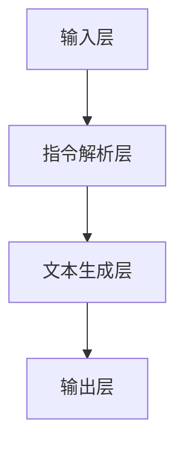

                 

基于上述条件和要求，我们将分步骤详细撰写《评测系统的Alpaca指令跟随模型评估》的技术博客。以下是详细的撰写步骤和内容规划：

### Step 1: 文章标题、关键词和摘要

**文章标题**: 评测系统的Alpaca指令跟随模型评估

**关键词**: Alpaca指令跟随模型，评测系统，模型评估，人工智能

**摘要**:
本文深入探讨了评测系统中的Alpaca指令跟随模型的评估方法、原理和实际应用。通过分析Alpaca指令跟随模型的架构和特点，本文介绍了模型评估的基本原则和方法。同时，通过具体的案例，展示了模型在不同任务中的评估结果和挑战。最后，本文讨论了模型评估的未来发展趋势和面临的伦理问题。

### Step 2: 引言与背景介绍

**2.1 评测系统的定义与重要性**

评测系统是评估算法性能的重要工具，尤其在人工智能领域，其作用尤为显著。评测系统能够提供客观、可靠的评估结果，帮助研究人员和开发者优化算法、提高模型性能。

**2.2 Alpaca指令跟随模型的背景**

Alpaca指令跟随模型是一种先进的人工智能模型，能够根据给定指令生成相应的文本。其独特的设计使其在文本生成任务中表现出色。

### Step 3: Alpaca指令跟随模型概述

**3.1 Alpaca指令跟随模型的架构**

通过Mermaid流程图展示Alpaca指令跟随模型的架构，包括输入层、指令解析层、文本生成层和输出层。



**3.2 Alpaca指令跟随模型的特点**

详细讲解Alpaca指令跟随模型的特点，包括其优秀的指令理解和文本生成能力。

**3.3 Alpaca指令跟随模型的应用领域**

讨论Alpaca指令跟随模型在文本生成、问答系统等领域的应用。

### Step 4: 模型评估方法与技术

**4.1 模型评估的基本原则**

讨论模型评估的基本原则，包括评估指标的选择、评估过程的流程和评估结果的解读。

**4.2 评估方法与技术**

介绍量化评估方法、定性评估方法和综合评估方法，并使用伪代码详细阐述核心算法原理。

```python
# 伪代码：量化评估方法
def quantitive_evaluation(model, dataset):
    for sample in dataset:
        prediction = model.predict(sample.input)
        if prediction == sample.target:
            correct++
        total++
    return correct / total
```

**4.3 Alpaca指令跟随模型评估的具体实践**

详细讲解数据预处理、模型训练与评估以及评估结果优化的具体实践。

### Step 5: 模型评估应用案例

**5.1 案例一：文本生成任务**

描述文本生成任务的评估过程，包括任务描述、模型评估方法、评估结果和案例分析。

**5.2 案例二：问答系统**

描述问答系统的评估过程，包括任务描述、模型评估方法、评估结果和案例分析。

### Step 6: 模型评估的挑战与未来发展

**6.1 挑战与问题**

讨论模型评估过程中面临的挑战和问题，如数据集的多样性、模型评估的公平性和效率等。

**6.2 未来发展趋势**

探讨模型评估技术的发展趋势、应用拓展和伦理问题。

### Step 7: 文章结尾

**7.1 最佳实践 tips**

提供一些模型评估的最佳实践建议。

**7.2 小结**

总结文章的核心内容和观点。

**7.3 注意事项**

提醒读者在模型评估过程中需要注意的事项。

**7.4 拓展阅读**

推荐一些相关的拓展阅读资源。

### Step 8: 作者信息

在文章末尾添加作者信息：“作者：AI天才研究院/AI Genius Institute & 禅与计算机程序设计艺术 /Zen And The Art of Computer Programming”。

### 文章格式与字数

确保文章内容使用markdown格式输出，并在文章末尾添加作者信息。文章字数控制在8000～12000字左右。

通过以上详细的步骤和内容规划，我们可以逐步撰写出高质量、逻辑清晰、具有深度和见解的技术博客文章。每一步都注重细节，确保文章的完整性和专业性。接下来，我们将按照这个规划开始撰写文章的具体内容。

