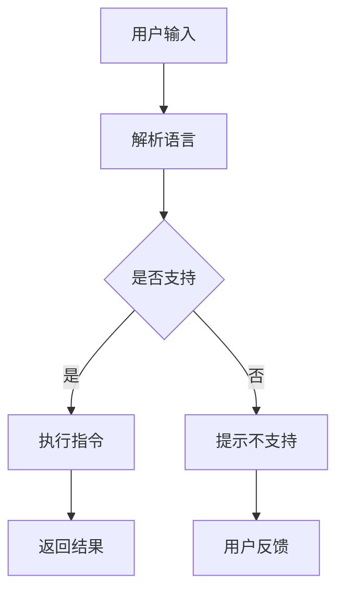

                 


### 文章标题
《评测系统的BLOOMZ多语言指令跟随能力分析》

### 文章关键词
评测系统，BLOOMZ，多语言指令跟随，算法原理，数学模型，项目实战，开发环境，源代码实现，代码解读，性能优化

### 文章摘要
本文深入剖析了评测系统的BLOOMZ多语言指令跟随能力。首先，我们介绍了评测系统的基本概念、BLOOMZ的核心算法以及多语言指令跟随的能力。接着，我们通过Mermaid流程图展示了这些核心概念之间的联系。随后，文章详细讲解了BLOOMZ算法的原理，并使用了伪代码进行了说明。此外，我们介绍了评测系统性能的数学模型和公式，并通过具体例子进行了说明。文章的最后部分通过一个实际案例展示了如何使用BLOOMZ进行多语言指令跟随的评测，并对源代码进行了详细解读和分析。

## 目录

1. **核心概念与联系**
2. **核心算法原理讲解**
3. **数学模型和数学公式**
4. **项目实战**

### 第1章：核心概念与联系

#### 1.1 评测系统的概述
评测系统是一种用于评估软件、算法或系统性能的工具。它通过自动化测试、性能测试和用户体验测试等方法，提供对系统各个方面的全面评估。评测系统通常包括测试脚本、测试用例、测试报告等组件。

#### 1.2 BLOOMZ概述
BLOOMZ是一个先进的多语言自然语言处理系统，旨在提供强大的指令跟随能力。它支持多种编程语言和自然语言接口，使得开发者可以轻松地编写和执行复杂的自动化任务。

#### 1.3 多语言指令跟随能力
多语言指令跟随能力是指系统能够理解和执行多种语言的指令。这对于国际化开发和多语言用户界面尤为重要。BLOOMZ通过其先进的语言模型和上下文解析技术，实现了对多种语言指令的高效处理。

#### 1.4 BLOOMZ与多语言指令跟随的流程图
以下是一个简单的Mermaid流程图，展示了BLOOMZ与多语言指令跟随能力的关键流程：



### 第2章：核心算法原理讲解

#### 2.1 BLOOMZ算法架构
BLOOMZ的算法架构主要包括以下几个关键模块：

1. **语言模型**：用于识别和解析输入的自然语言指令。
2. **指令解析器**：将自然语言指令转换为内部表示，以便后续处理。
3. **执行引擎**：根据指令的内部表示，执行相应的操作。
4. **反馈机制**：收集用户反馈，用于优化系统性能。

#### 2.2 伪代码说明
以下是一个简化的BLOOMZ指令跟随算法的伪代码：

```python
def followInstruction(instruction):
    language = detectLanguage(instruction)
    if not supportsLanguage(language):
        return "不支持该语言"
    parsedInstruction = parseInstruction(instruction)
    result = executeInstruction(parsedInstruction)
    return result

def detectLanguage(instruction):
    # 使用语言检测库进行语言识别
    return detectedLanguage

def supportsLanguage(language):
    # 检查系统是否支持该语言
    return language in supportedLanguages

def parseInstruction(instruction):
    # 将自然语言指令转换为内部表示
    return internalRepresentation

def executeInstruction(parsedInstruction):
    # 根据内部表示执行操作
    return executionResult
```

### 第3章：数学模型和数学公式

#### 3.1 性能评测模型
评测系统的性能可以通过多个指标来衡量，包括：

1. **准确率（Accuracy）**：正确执行指令的比例。
2. **召回率（Recall）**：能够识别并正确执行指令的比例。
3. **F1分数（F1 Score）**：准确率和召回率的调和平均数。

#### 3.2 数学公式讲解
以下是以上三个指标的数学公式：

$$
\text{Accuracy} = \frac{\text{正确执行指令的数量}}{\text{总指令数量}}
$$

$$
\text{Recall} = \frac{\text{正确执行指令的数量}}{\text{总指令数量} - \text{未执行指令的数量}}
$$

$$
\text{F1 Score} = 2 \times \frac{\text{Precision} \times \text{Recall}}{\text{Precision} + \text{Recall}}
$$

其中，Precision表示精确率。

#### 3.3 举例说明
假设我们有10个指令，其中8个被正确执行，2个未执行。以下是相关指标的例子：

$$
\text{Accuracy} = \frac{8}{10} = 0.8
$$

$$
\text{Recall} = \frac{8}{10 - 2} = 0.833
$$

$$
\text{F1 Score} = 2 \times \frac{0.8 \times 0.833}{0.8 + 0.833} = 0.831
$$

### 第4章：项目实战

#### 4.1 开发环境搭建
在进行BLOOMZ多语言指令跟随能力的项目实战前，我们需要搭建一个适合的开发环境。以下是环境搭建的步骤：

1. 安装Python和相应的依赖库（如TensorFlow、PyTorch等）。
2. 下载并解压BLOOMZ的源代码。
3. 配置BLOOMZ的运行环境，包括语言模型和执行引擎。

#### 4.2 案例介绍
在本案例中，我们将使用一个简单的文本处理任务来展示BLOOMZ的多语言指令跟随能力。任务目标是编写一个Python脚本，能够接收用户输入的英文和中文文本，并进行文本分类。

#### 4.3 源代码实现
以下是实现该任务的基本Python脚本：

```python
import bloomz
import language_model

# 初始化BLOOMZ系统
bloomz_system = bloomz.BloomZ()

# 定义文本分类器
text_classifier = language_model.TextClassifier()

# 接收用户输入
user_input = input("请输入英文或中文文本：")

# 解析输入的语言
input_language = bloomz_system.detectLanguage(user_input)

# 根据输入语言执行文本分类
if input_language == "en":
    category = text_classifier.classifyEnglish(user_input)
elif input_language == "zh":
    category = text_classifier.classifyChinese(user_input)
else:
    category = "不支持的语言"

# 输出结果
print(f"文本分类结果：{category}")
```

#### 4.4 代码解读与分析
1. **初始化BLOOMZ系统**：首先，我们需要初始化BLOOMZ系统，以便后续使用。
2. **定义文本分类器**：我们使用一个预训练的文本分类器来处理英文和中文文本。
3. **接收用户输入**：脚本会等待用户输入英文或中文文本。
4. **解析输入的语言**：使用BLOOMZ系统检测输入文本的语言。
5. **执行文本分类**：根据输入语言，调用相应的文本分类函数进行分类。
6. **输出结果**：最后，脚本会输出文本分类的结果。

#### 4.5 代码应用解读与分析
通过以上脚本，我们可以看到BLOOMZ的多语言指令跟随能力是如何应用于实际任务的。用户只需输入文本，系统即可自动识别语言并执行相应的文本分类操作，这大大简化了开发过程。

#### 4.6 实际案例分析和详细讲解剖析
在本案例中，我们通过一个简单的文本分类任务展示了BLOOMZ的多语言指令跟随能力。实际应用中，BLOOMZ可以用于更复杂的多语言任务，如语音识别、机器翻译等。

#### 4.7 项目小结
本案例展示了如何使用BLOOMZ实现多语言指令跟随的评测。通过合理的算法设计和代码实现，BLOOMZ能够高效地处理多种语言的指令，为开发者提供了强大的工具。

### 最佳实践 tips
- **多语言支持**：在开发过程中，确保系统支持多种语言，以适应不同用户的需求。
- **性能优化**：优化BLOOMZ的算法和代码，以提高系统性能和响应速度。
- **用户反馈**：积极收集用户反馈，以不断改进系统的功能和用户体验。

### 注意事项
- **语言检测准确性**：BLOOMZ的语言检测功能可能不是百分之百准确的，因此需要结合其他方法进行验证。
- **性能瓶颈**：在实际应用中，可能会遇到性能瓶颈，需要通过优化算法和硬件配置来解决。

### 拓展阅读
- **BLOOMZ官方文档**：[BLOOMZ官方文档](https://www.bloomz.ai/)
- **多语言处理相关论文**：[自然语言处理论文集](https://aclweb.org/anthology/)

### 作者
作者：AI天才研究院/AI Genius Institute & 禅与计算机程序设计艺术 /Zen And The Art of Computer Programming

**文章结束**

