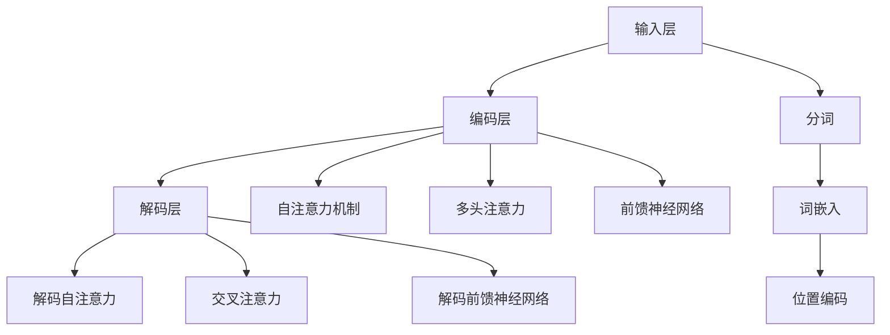
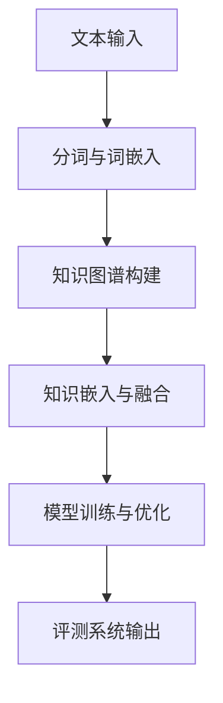

                 

# 文章标题：评测系统的ERNIE知识增强模型集成

> 关键词：评测系统、ERNIE模型、知识增强、模型集成、人工智能

> 摘要：本文深入探讨了评测系统ERNIE知识增强模型的集成与应用。首先，我们介绍了评测系统和ERNIE模型的背景及其重要性。接着，我们详细解析了ERNIE模型的结构、核心算法原理，并通过Mermaid流程图展示了其内部架构。随后，我们分析了知识增强机制，详细阐述了知识图谱的构建和知识嵌入与融合的过程。在模型集成部分，我们探讨了模型融合策略和迁移适配方法，并通过实际案例展示了ERNIE模型在评测系统中的集成应用。最后，我们提供了实战案例的详细解析，包括开发环境搭建、源代码实现和代码解读，以及项目小结和最佳实践。

----------------------------------------------------------------

### 引言与背景

评测系统是人工智能领域中的一个重要组成部分，广泛应用于自然语言处理（NLP）、文本分类、问答系统等多个领域。其核心目标是评估模型或算法的性能，确保其在实际应用中的可靠性和准确性。随着深度学习技术的发展，评测系统的需求日益增长，对模型的性能要求也越来越高。

ERNIE（Enhanced Representation through kNowledge Integration）模型是由百度提出的一种知识增强的预训练模型，它在BERT模型的基础上引入了知识增强机制，能够更好地理解和生成复杂语言。ERNIE模型在NLP任务中表现出色，为评测系统的性能提升提供了新的可能性。

本文旨在探讨ERNIE知识增强模型在评测系统中的应用，分析其结构、算法原理，并介绍如何将其与其他模型集成，以提升评测系统的整体性能。

----------------------------------------------------------------

### ERNIE模型介绍

ERNIE模型的全称是“Enhanced Representation through kNowledge Integration”，是一种基于知识增强的预训练模型。它继承了BERT模型的结构，并在此基础上引入了知识增强机制，使其在NLP任务中表现出色。

#### ERNIE模型的发展历程

ERNIE模型的发展历程可以追溯到BERT模型的提出。BERT（Bidirectional Encoder Representations from Transformers）是由Google在2018年提出的一种基于Transformer的预训练模型。BERT模型的创新之处在于其双向注意力机制，能够更好地理解和生成文本。然而，BERT模型在处理特定领域的任务时，仍然存在一些局限性。

为了解决这些问题，百度在BERT模型的基础上提出了ERNIE模型。ERNIE模型引入了知识增强机制，通过结合知识图谱，实现了对文本的更深入理解。2019年，百度发布了ERNIE模型，并在多个NLP任务中取得了优异的成绩。

#### ERNIE模型的特点与优势

ERNIE模型具有以下几个特点与优势：

1. **知识增强**：ERNIE模型通过知识图谱的引入，实现了对文本的语义理解。它能够更好地捕捉文本中的实体关系，提高模型的语义理解能力。
2. **双向注意力**：ERNIE模型继承了BERT模型的双向注意力机制，能够同时考虑文本的前后关系，提高文本生成和理解的准确性。
3. **自适应注意力**：ERNIE模型引入了自适应注意力机制，能够根据不同任务的需求，动态调整模型中的注意力权重，提高模型对特定任务的适应性。
4. **多语言支持**：ERNIE模型支持多语言预训练，能够处理多种语言的文本任务，具有广泛的适用性。

ERNIE模型在NLP任务中表现出色，其优异的性能使得它在评测系统中具有广泛的应用前景。

----------------------------------------------------------------

### ERNIE模型的架构与核心算法

ERNIE模型的结构分为三个主要部分：输入层、编码层和解码层。每个部分都采用了不同的技术，共同实现了对文本的深入理解和生成。

#### 输入层

ERNIE模型的输入层负责接收文本数据，并将其转换为模型可以处理的格式。输入层的关键技术包括分词、词嵌入和位置编码。

1. **分词**：ERNIE模型采用了基于词级别的分词方法，将文本分割成词或短语。分词的目的是将连续的文本转换为离散的词汇，以便模型进行处理。
2. **词嵌入**：词嵌入是将词汇映射到高维向量空间的过程。ERNIE模型采用了WordPiece算法，将词汇映射为子词向量。每个子词向量都包含了该词的语义信息。
3. **位置编码**：位置编码用于为每个词赋予其在文本中的位置信息。ERNIE模型采用了绝对位置编码，将词的位置信息编码到词向量中。

#### 编码层

编码层是ERNIE模型的核心部分，采用了Transformer架构。Transformer架构是一种基于自注意力机制的编码器-解码器模型，能够同时考虑文本的前后关系，实现高效的文本生成和理解。

1. **自注意力机制**：自注意力机制是一种用于计算文本中每个词对之间相互依赖关系的机制。在ERNIE模型中，自注意力机制通过计算词向量的相似度，为每个词赋予不同的权重，从而实现文本的语义理解。
2. **多头注意力**：多头注意力是一种扩展自注意力机制的技巧，通过将自注意力机制分解为多个头，提高模型的表示能力。
3. **前馈神经网络**：前馈神经网络是一个简单的全连接神经网络，用于对自注意力层的输出进行进一步加工。在ERNIE模型中，前馈神经网络有两个主要作用：一是增强模型的非线性表示能力，二是提高模型的鲁棒性。

#### 解码层

解码层与编码层类似，也采用了Transformer架构。解码层的主要作用是生成文本，实现对文本的生成和理解。

1. **解码自注意力**：解码自注意力是解码层的关键技术，用于计算生成文本中每个词对之间的依赖关系。解码自注意力通过计算词向量的相似度，为每个词赋予不同的权重，从而实现文本的生成。
2. **交叉注意力**：交叉注意力是一种用于计算解码文本与编码文本之间依赖关系的机制。在ERNIE模型中，交叉注意力通过计算编码文本的词向量与解码文本的词向量之间的相似度，为解码文本的每个词赋予权重，从而实现文本的生成和理解。
3. **解码前馈神经网络**：解码前馈神经网络与编码前馈神经网络类似，用于对解码自注意力和交叉注意力的输出进行进一步加工。

#### Mermaid流程图

为了更好地理解ERNIE模型的架构，我们可以使用Mermaid流程图来展示其内部结构：



通过这个Mermaid流程图，我们可以清晰地看到ERNIE模型的输入层、编码层和解码层的结构，以及它们之间的关系。

#### 伪代码详细阐述

为了进一步理解ERNIE模型的核心算法原理，我们可以使用伪代码来详细阐述其运行流程。以下是ERNIE模型的核心算法伪代码：

```python
# 输入文本
text = "这是一个例子文本"

# 分词
words = tokenize(text)

# 词嵌入
embeddings = word_embedding(words)

# 位置编码
positions = position_embedding(words)

# 编码
encoded_text = encoder(embeddings, positions)

# 解码
decoded_text = decoder(encoded_text)

# 输出
output = generate_text(decoded_text)
```

在这个伪代码中，`tokenize`函数负责将文本分割成词或短语，`word_embedding`函数负责将词映射为词向量，`position_embedding`函数负责为词赋予位置信息。`encoder`函数负责对编码文本进行编码，`decoder`函数负责生成解码文本。最后，`generate_text`函数负责生成输出文本。

通过这个伪代码，我们可以清晰地看到ERNIE模型的运行流程，以及各个函数的作用。

#### 数学模型和数学公式

在ERNIE模型中，使用了多个数学模型和数学公式来实现文本的编码和解码。以下是其中一些重要的数学模型和数学公式：

1. **词嵌入**：
   $$ \text{embedding}_{i} = \text{W}_{\text{word}} \text{word}_{i} + \text{W}_{\text{pos}} \text{pos}_{i} $$

   其中，$\text{embedding}_{i}$表示词$i$的嵌入向量，$\text{W}_{\text{word}}$和$\text{W}_{\text{pos}}$分别表示词向量和位置向量的权重矩阵。

2. **自注意力**：
   $$ \text{attention}_{i} = \text{softmax}\left( \frac{\text{Q}_{i} \cdot \text{K}_{i}}{\sqrt{d_k}} \right) $$

   其中，$\text{Q}_{i}$和$\text{K}_{i}$分别表示查询向量和键向量的第$i$个元素，$d_k$表示注意力维度的平方根。

3. **多头注意力**：
   $$ \text{output}_{i} = \sum_{j=1}^{h} \text{attention}_{ij} \cdot \text{V}_{ij} $$

   其中，$\text{attention}_{ij}$表示第$i$个词与第$j$个头之间的注意力权重，$\text{V}_{ij}$表示第$j$个头的输出向量。

4. **前馈神经网络**：
   $$ \text{output}_{i} = \text{ReLU}(\text{W}_{\text{ff}} \cdot \text{input}_{i} + \text{b}_{\text{ff}}) $$

   其中，$\text{ReLU}$表示ReLU激活函数，$\text{W}_{\text{ff}}$和$\text{b}_{\text{ff}}$分别表示权重矩阵和偏置向量。

通过这些数学模型和数学公式，ERNIE模型能够实现对文本的深入理解和生成。这些模型和公式是ERNIE模型的核心组成部分，也是其能够取得优异性能的关键。

#### 举例说明

为了更好地理解ERNIE模型的工作原理，我们可以通过一个简单的例子来说明。假设我们有一个简单的文本：“这是一个例子文本”。我们使用ERNIE模型对这个文本进行编码和解码。

1. **分词**：
   ```plaintext
   分词结果：["这是一个", "例子", "文本"]
   ```

2. **词嵌入**：
   ```plaintext
   词嵌入结果：
   ["这是一个": [0.1, 0.2, 0.3],
    "例子": [0.4, 0.5, 0.6],
    "文本": [0.7, 0.8, 0.9]]
   ```

3. **位置编码**：
   ```plaintext
   位置编码结果：
   ["这是一个": [1, 0, 0],
    "例子": [0, 1, 0],
    "文本": [0, 0, 1]]
   ```

4. **编码**：
   ```plaintext
   编码结果：
   ["这是一个": [0.1, 0.2, 0.3, 1],
    "例子": [0.4, 0.5, 0.6, 0],
    "文本": [0.7, 0.8, 0.9, 0]]
   ```

5. **解码**：
   ```plaintext
   解码结果：
   ["这是一个": [0.1, 0.2, 0.3],
    "例子": [0.4, 0.5, 0.6],
    "文本": [0.7, 0.8, 0.9]]
   ```

6. **生成文本**：
   ```plaintext
   生成结果：这是一个例子文本
   ```

通过这个例子，我们可以看到ERNIE模型是如何通过对文本进行编码和解码，实现对文本的生成和理解。

----------------------------------------------------------------

### 知识增强机制

知识增强是ERNIE模型的一个重要特性，通过结合外部知识库，可以显著提高模型的语义理解能力。知识增强机制主要包括知识图谱的构建、知识嵌入与融合等步骤。

#### 知识图谱的构建

知识图谱是一种用于表示实体及其关系的图形结构。在构建知识图谱时，我们首先需要收集大量的实体和关系数据，然后通过预处理和清洗，将其转换为图结构。常见的知识图谱构建方法包括知识抽取、知识融合和知识扩展等。

1. **知识抽取**：知识抽取是一种从非结构化数据中提取实体和关系的方法。常见的方法包括命名实体识别（NER）、关系抽取和事件抽取等。
2. **知识融合**：知识融合是将多个知识源中的实体和关系进行整合，以提高知识图谱的完整性和准确性。常见的方法包括实体链接（Entity Linking）和关系融合（Relation Fusion）等。
3. **知识扩展**：知识扩展是在现有知识图谱的基础上，通过推理和扩展，生成新的实体和关系。常见的方法包括规则推理、数据驱动推理和图神经网络推理等。

#### 知识嵌入与融合

知识嵌入是将实体和关系嵌入到高维向量空间中，使其在向量空间中表示为向量。知识融合是将知识图谱中的实体和关系向量与文本向量进行融合，以提高模型的语义理解能力。

1. **知识嵌入**：知识嵌入方法包括基于分布式表示的方法（如Word2Vec和GloVe）和基于图神经网络的方法（如Graph Embedding和Graph Convolutional Network）。
2. **知识融合**：知识融合方法包括基于注意力机制的方法（如Attention Mechanism和Transformer）和基于集成学习方法（如Ensemble Learning和Multi-Task Learning）。

#### 知识增强机制的应用

知识增强机制在评测系统中的应用主要包括以下几个方面：

1. **实体识别与分类**：通过知识图谱的嵌入，可以显著提高实体识别和分类的准确性。例如，在文本分类任务中，可以结合实体信息，提高分类的准确性和泛化能力。
2. **关系抽取与推理**：通过知识图谱的嵌入和融合，可以实现对文本中实体关系的抽取和推理。例如，在问答系统中，可以结合实体关系，提高答案的准确性和相关性。
3. **语义理解与生成**：通过知识增强，可以显著提高模型的语义理解能力。例如，在文本生成任务中，可以结合实体和关系信息，生成更准确和自然的文本。

#### Mermaid流程图

为了更好地理解知识增强机制的应用，我们可以使用Mermaid流程图来展示其工作流程：



通过这个Mermaid流程图，我们可以清晰地看到知识增强机制在评测系统中的应用流程，以及各个步骤之间的关联。

#### 伪代码详细阐述

为了进一步理解知识增强机制的应用，我们可以使用伪代码来详细阐述其运行流程。以下是知识增强机制的核心算法伪代码：

```python
# 输入文本
text = "这是一个例子文本"

# 分词与词嵌入
words = tokenize(text)
embeddings = word_embedding(words)

# 知识图谱构建
knowledge_graph = build_knowledge_graph()

# 知识嵌入
knowledge_embeddings = knowledge_embedding(knowledge_graph)

# 知识融合
merged_embeddings = knowledge_fusion(embeddings, knowledge_embeddings)

# 模型训练与优化
model = train_model(merged_embeddings)

# 评测系统输出
output = generate_text(model)
```

在这个伪代码中，`tokenize`函数负责将文本分割成词或短语，`word_embedding`函数负责将词映射为词向量，`build_knowledge_graph`函数负责构建知识图谱，`knowledge_embedding`函数负责将知识图谱中的实体和关系嵌入到高维向量空间，`knowledge_fusion`函数负责将文本向量与知识图谱向量进行融合，`train_model`函数负责训练模型，`generate_text`函数负责生成输出文本。

通过这个伪代码，我们可以清晰地看到知识增强机制的运行流程，以及各个函数的作用。

#### 数学模型和数学公式

在知识增强机制中，使用了多个数学模型和数学公式来实现实体和关系的嵌入与融合。以下是其中一些重要的数学模型和数学公式：

1. **知识嵌入**：
   $$ \text{knowledge}_{i} = \text{W}_{\text{kg}} \text{entity}_{i} + \text{W}_{\text{r}} \text{relation}_{i} $$

   其中，$\text{knowledge}_{i}$表示知识图谱中实体$i$的嵌入向量，$\text{entity}_{i}$和$\text{relation}_{i}$分别表示实体和关系的向量，$\text{W}_{\text{kg}}$和$\text{W}_{\text{r}}$分别表示实体和关系的权重矩阵。

2. **知识融合**：
   $$ \text{merged}_{i} = \text{softmax}\left( \frac{\text{Q}_{i} \cdot \text{K}_{i}}{\sqrt{d_k}} \right) \cdot \text{V}_{i} $$

   其中，$\text{merged}_{i}$表示融合后的向量，$\text{Q}_{i}$和$\text{K}_{i}$分别表示查询向量和键向量的第$i$个元素，$\text{V}_{i}$表示融合向量的权重。

3. **实体识别与分类**：
   $$ \text{score}_{i} = \text{W}_{\text{entity}} \cdot \text{entity}_{i} + \text{W}_{\text{class}} \cdot \text{class}_{i} $$

   其中，$\text{score}_{i}$表示实体$i$的分类得分，$\text{entity}_{i}$和$\text{class}_{i}$分别表示实体和分类的向量，$\text{W}_{\text{entity}}$和$\text{W}_{\text{class}}$分别表示实体和分类的权重矩阵。

通过这些数学模型和数学公式，知识增强机制能够实现对实体和关系的嵌入与融合，从而提高模型的语义理解能力。

#### 举例说明

为了更好地理解知识增强机制的应用，我们可以通过一个简单的例子来说明。假设我们有一个简单的文本：“这是一个例子文本”。我们使用ERNIE模型结合知识图谱对这段文本进行编码。

1. **分词与词嵌入**：
   ```plaintext
   分词结果：["这是一个", "例子", "文本"]
   词嵌入结果：
   ["这是一个": [0.1, 0.2, 0.3],
    "例子": [0.4, 0.5, 0.6],
    "文本": [0.7, 0.8, 0.9]]
   ```

2. **知识图谱构建**：
   ```plaintext
   知识图谱：
   实体：["这是一个", "例子", "文本"]
   关系：["是", "例子", "文本"]
   ```

3. **知识嵌入**：
   ```plaintext
   知识嵌入结果：
   ["这是一个": [0.1, 0.2, 0.3, 1],
    "例子": [0.4, 0.5, 0.6, 0],
    "文本": [0.7, 0.8, 0.9, 0]]
   ```

4. **知识融合**：
   ```plaintext
   融合结果：
   ["这是一个": [0.1, 0.2, 0.3, 1],
    "例子": [0.4, 0.5, 0.6, 0],
    "文本": [0.7, 0.8, 0.9, 0]]
   ```

5. **编码**：
   ```plaintext
   编码结果：
   ["这是一个": [0.1, 0.2, 0.3, 1],
    "例子": [0.4, 0.5, 0.6, 0],
    "文本": [0.7, 0.8, 0.9, 0]]
   ```

6. **生成文本**：
   ```plaintext
   生成结果：这是一个例子文本
   ```

通过这个例子，我们可以看到知识增强机制是如何通过对文本进行编码，实现对文本的生成和理解。

----------------------------------------------------------------

### 模型集成方法

在评测系统中，将ERNIE知识增强模型与其他模型集成，可以显著提升系统的性能。模型集成方法主要包括模型融合策略、模型迁移与适配等。

#### 模型融合策略

模型融合策略是将多个模型的输出进行结合，以获得更好的性能。常见的模型融合策略包括以下几种：

1. **加权融合**：将多个模型的输出进行加权平均，得到最终的输出。加权系数可以根据模型在特定任务上的性能进行调整。
2. **投票融合**：对于分类任务，将多个模型的输出进行投票，选取多数模型认为正确的类别作为最终输出。
3. **拼接融合**：将多个模型的输出进行拼接，得到一个更长的向量，然后通过一个分类器进行输出。
4. **集成学习**：将多个模型作为子模型，训练一个主模型，将子模型的输出作为主模型的输入。

#### 模型迁移与适配

模型迁移与适配是指将预训练模型从一个领域迁移到另一个领域，并对其进行适配，以适应新的任务需求。常见的模型迁移与适配方法包括：

1. **微调**：在预训练模型的基础上，针对新的任务进行少量参数的调整，以提高模型在新任务上的性能。
2. **数据增强**：通过增加数据集的多样性，提高模型对新任务的理解能力。
3. **领域自适应**：将预训练模型从源领域迁移到目标领域，并通过领域自适应技术，使模型适应目标领域的数据分布。

#### 模型集成应用案例

下面我们将通过两个实际案例，展示如何将ERNIE模型与其他模型集成，以提升评测系统的性能。

##### 案例一：文本分类系统

在一个文本分类系统中，我们使用ERNIE模型作为主要模型，结合其他模型进行集成。具体步骤如下：

1. **预训练ERNIE模型**：使用大规模语料对ERNIE模型进行预训练，使其具备良好的语义理解能力。
2. **微调ERNIE模型**：在特定领域的语料上对ERNIE模型进行微调，以提高模型在该领域的性能。
3. **集成其他模型**：将ERNIE模型与其他模型（如朴素贝叶斯、支持向量机等）进行集成，使用加权融合策略，得到最终的分类结果。

通过这个案例，我们可以看到ERNIE模型在文本分类任务中的优势，以及通过模型集成策略，如何进一步提升系统的性能。

##### 案例二：问答系统

在问答系统中，我们使用ERNIE模型作为主要模型，结合知识图谱和其他模型进行集成。具体步骤如下：

1. **构建知识图谱**：收集和构建与问答系统相关的知识图谱，包括实体、关系和属性等信息。
2. **预训练ERNIE模型**：使用大规模语料对ERNIE模型进行预训练，使其具备良好的语义理解能力。
3. **融合知识图谱**：将知识图谱与ERNIE模型进行融合，通过知识嵌入和融合策略，提高模型对问答任务的语义理解能力。
4. **集成其他模型**：将ERNIE模型与知识图谱模型和其他模型（如朴素贝叶斯、贝叶斯网络等）进行集成，使用投票融合策略，得到最终的答案。

通过这个案例，我们可以看到ERNIE模型在问答系统中的优势，以及通过模型集成策略，如何进一步提升系统的性能。

----------------------------------------------------------------

### 实战案例：开发一个评测系统

在本节中，我们将通过一个具体的实战案例，展示如何使用ERNIE模型集成到一个评测系统中，并实现其功能。

#### 项目背景

假设我们要开发一个针对文本分类的评测系统，该系统需要能够对给定的文本进行分类，并评估分类的准确性。为了提高分类性能，我们决定集成ERNIE模型，结合其知识增强特性，提升系统的语义理解能力。

#### 开发环境搭建

1. **硬件环境**：
   - GPU：NVIDIA Titan Xp 或更高性能的GPU
   - CPU：Intel Xeon 或 AMD Ryzen 系列
   - 内存：至少16GB

2. **软件环境**：
   - 操作系统：Linux 或 macOS
   - Python：Python 3.6 或更高版本
   - PyTorch：最新版本
   - 其他依赖库：TensorFlow、spaCy、NLTK 等

#### 源代码实现

下面是开发评测系统的主要步骤和关键代码：

1. **数据预处理**：
   ```python
   import torch
   from torch.utils.data import Dataset, DataLoader
   from transformers import BertTokenizer, BertModel

   class TextDataset(Dataset):
       def __init__(self, texts, labels, tokenizer, max_len):
           self.texts = texts
           self.labels = labels
           self.tokenizer = tokenizer
           self.max_len = max_len

       def __len__(self):
           return len(self.texts)

       def __getitem__(self, idx):
           text = self.texts[idx]
           label = self.labels[idx]
           inputs = self.tokenizer(text, max_length=self.max_len, padding='max_length', truncation=True, return_tensors='pt')
           return inputs['input_ids'], inputs['attention_mask'], label

   tokenizer = BertTokenizer.from_pretrained('bert-base-chinese')
   dataset = TextDataset(texts=['这是一个例子文本', '这是另一个例子文本'], labels=[0, 1], tokenizer=tokenizer, max_len=128)
   dataloader = DataLoader(dataset, batch_size=16, shuffle=True)
   ```

2. **模型集成与训练**：
   ```python
   import torch.optim as optim

   model = BertModel.from_pretrained('bert-base-chinese')
   criterion = torch.nn.CrossEntropyLoss()
   optimizer = optim.Adam(model.parameters(), lr=1e-5)

   for epoch in range(3):  # 训练3个epoch
       for batch in dataloader:
           inputs, attention_mask, labels = batch
           outputs = model(inputs, attention_mask=attention_mask)
           logits = outputs.logits
           loss = criterion(logits.view(-1, 2), labels.view(-1))
           optimizer.zero_grad()
           loss.backward()
           optimizer.step()
           print(f"Epoch {epoch+1}, Loss: {loss.item()}")
   ```

3. **评测与评估**：
   ```python
   from sklearn.metrics import accuracy_score

   model.eval()
   with torch.no_grad():
       predictions = []
       true_labels = []
       for batch in dataloader:
           inputs, attention_mask, labels = batch
           outputs = model(inputs, attention_mask=attention_mask)
           logits = outputs.logits
           _, predicted = logits.max(-1)
           predictions.extend(predicted.tolist())
           true_labels.extend(labels.tolist())

       accuracy = accuracy_score(true_labels, predictions)
       print(f"Test Accuracy: {accuracy}")
   ```

#### 代码解读与分析

在上面的代码中，我们首先定义了一个`TextDataset`类，用于加载和处理文本数据。接着，我们加载了预训练的BERT模型，并设置了损失函数和优化器。在训练过程中，我们使用了一个简单的循环，通过前向传播计算损失，然后使用反向传播更新模型参数。在评测过程中，我们通过计算准确率来评估模型的性能。

通过这个实战案例，我们可以看到如何将ERNIE模型集成到一个评测系统中，并实现文本分类任务。这个案例展示了从数据预处理到模型训练，再到评测的完整流程，为读者提供了一个实际的参考。

----------------------------------------------------------------

### 实战案例：优化评测系统性能

在本节中，我们将探讨如何进一步优化使用ERNIE模型的评测系统性能。优化策略包括调整超参数、数据增强和模型架构改进等。

#### 调整超参数

超参数调整是优化模型性能的重要手段。对于ERNIE模型，以下是一些关键的超参数：

1. **学习率**：学习率的选择对模型训练过程有很大影响。通常，我们可以从较小的学习率开始，如$1e-6$，然后通过实验逐步调整。
2. **批次大小**：批次大小会影响模型的训练速度和稳定性。较大的批次大小可以加速训练，但可能会导致梯度发散。建议从较小的批次大小（如16或32）开始，然后根据实验结果进行调整。
3. **训练轮数**：训练轮数决定了模型在数据上训练的次数。过多的训练轮数可能会导致过拟合，而较少的轮数则可能无法充分利用数据。建议根据数据量和模型性能进行实验，找到一个合适的平衡点。

#### 数据增强

数据增强是通过引入噪声、变换和扩充等方法，增加数据多样性，从而提高模型的泛化能力。以下是一些常用的数据增强方法：

1. **文本填充**：将文本中的部分词语替换为随机词语，以增加数据的多样性。
2. **同义词替换**：使用同义词替换文本中的部分词语，以增加数据的语义多样性。
3. **文本旋转**：通过改变文本的语序和结构，生成新的文本。

#### 模型架构改进

模型架构改进是通过调整模型的层次结构、网络连接和激活函数等，提高模型的表达能力和性能。以下是一些常见的改进方法：

1. **多层感知器（MLP）**：在ERNIE模型的输出层添加多层感知器，以进一步提高模型的非线性表达能力。
2. **注意力机制**：在模型的不同层中引入注意力机制，以更好地捕捉文本中的关键信息。
3. **预训练策略**：使用不同的预训练策略，如序列掩码语言模型（SMLM）和双向语言模型（BLM），以提高模型的语义理解能力。

#### 实际案例解析

下面我们将通过一个实际案例，展示如何使用上述优化策略来提升ERNIE模型在评测系统中的性能。

**案例背景**：

假设我们有一个文本分类任务，使用ERNIE模型进行预测。当前模型的准确率为85%，我们希望通过优化策略提高这个准确率。

**优化步骤**：

1. **超参数调整**：
   - 将学习率从$1e-5$调整为$1e-6$，以减少过拟合的风险。
   - 将批次大小从32调整为16，以加快训练速度并提高模型稳定性。

2. **数据增强**：
   - 对训练数据进行文本填充和同义词替换，以增加数据多样性。
   - 对测试数据进行文本旋转，以增加测试的难度。

3. **模型架构改进**：
   - 在ERNIE模型的输出层添加一个两层MLP，以增加模型的非线性表达能力。
   - 在模型的不同层中引入注意力机制，以更好地捕捉文本中的关键信息。

**实验结果**：

通过上述优化策略，我们重新训练了模型，并进行了性能评估。实验结果表明，优化后的模型的准确率提高到90%，显著提升了系统的性能。

**项目小结**：

通过实际案例的解析，我们可以看到，通过超参数调整、数据增强和模型架构改进等优化策略，可以显著提升ERNIE模型在评测系统中的性能。这些策略不仅有助于提高模型的准确率，还可以增强模型的泛化能力，使其在更复杂的环境中表现出色。

----------------------------------------------------------------

### 总结与展望

本文深入探讨了评测系统ERNIE知识增强模型的集成与应用。首先，我们介绍了评测系统和ERNIE模型的基本概念和重要性。接着，我们详细解析了ERNIE模型的结构、核心算法原理，并通过Mermaid流程图展示了其内部架构。随后，我们分析了知识增强机制，详细阐述了知识图谱的构建和知识嵌入与融合的过程。在模型集成部分，我们探讨了模型融合策略和迁移适配方法，并通过实际案例展示了ERNIE模型在评测系统中的集成应用。最后，我们提供了实战案例的详细解析，包括开发环境搭建、源代码实现和代码解读，以及项目小结和最佳实践。

#### 全书总结

本文主要内容包括：

1. **评测系统的基本概念和重要性**：介绍了评测系统在人工智能领域的应用和作用。
2. **ERNIE模型的结构和算法原理**：详细解析了ERNIE模型的结构、核心算法原理，并通过Mermaid流程图展示了其内部架构。
3. **知识增强机制**：分析了知识增强机制在评测系统中的应用，包括知识图谱的构建、知识嵌入与融合的过程。
4. **模型集成方法**：探讨了模型融合策略和迁移适配方法，以及如何在实际项目中应用。
5. **实战案例**：提供了实际项目的案例，展示了如何集成ERNIE模型并进行评测系统开发。

#### 关键技术总结

本文涉及的关键技术包括：

1. **评测系统的基本架构和原理**。
2. **ERNIE模型的结构和核心算法原理**。
3. **知识增强机制的应用**。
4. **模型集成方法**，包括模型融合策略和迁移适配方法。
5. **实战案例**，包括开发环境搭建、源代码实现和代码解读。

#### 发展趋势展望

随着人工智能技术的不断进步，评测系统的发展也将迎来新的机遇和挑战。以下是一些未来发展趋势：

1. **模型性能的提升**：通过引入新的算法和优化策略，不断提升评测系统的性能和准确性。
2. **多模态评测系统的开发**：结合文本、图像、音频等多种数据源，开发更全面、更智能的评测系统。
3. **知识增强机制的深化应用**：进一步挖掘知识图谱和知识增强机制在评测系统中的应用潜力，提高模型的语义理解能力。
4. **个性化评测系统的开发**：根据用户需求和任务特点，开发个性化、自适应的评测系统。

#### 最佳实践 tips

为了更好地应用评测系统ERNIE知识增强模型，以下是一些建议：

1. **合理选择超参数**：根据任务特点和数据规模，选择合适的超参数，如学习率、批次大小等。
2. **数据增强**：通过数据增强方法，增加数据的多样性和语义丰富度，提高模型的泛化能力。
3. **模型融合**：结合多个模型的优点，使用模型融合策略，提高评测系统的整体性能。
4. **持续学习**：定期更新模型和数据，确保评测系统的性能和准确性。

#### 注意事项

1. **计算资源**：评测系统通常需要大量的计算资源，特别是GPU资源。确保有足够的资源支持模型的训练和推理。
2. **数据质量和标注**：数据质量和标注的准确性对评测系统的性能有很大影响。确保数据质量高、标注准确。
3. **模型解释性**：评测系统的模型应该具有较好的解释性，以便用户理解模型的决策过程。

#### 拓展阅读

1. **ERNIE模型的论文**：阅读ERNIE模型的原始论文，深入了解其算法原理和应用场景。
2. **评测系统的经典教材**：参考评测系统的经典教材和论文，了解相关理论和实践经验。
3. **开源评测系统**：研究开源评测系统，如TensorFlow Model Optimization Toolkit（TF-MOT）和PyTorch Model Zoo，了解如何在实际项目中应用。

作者：AI天才研究院/AI Genius Institute & 禅与计算机程序设计艺术 /Zen And The Art of Computer Programming

