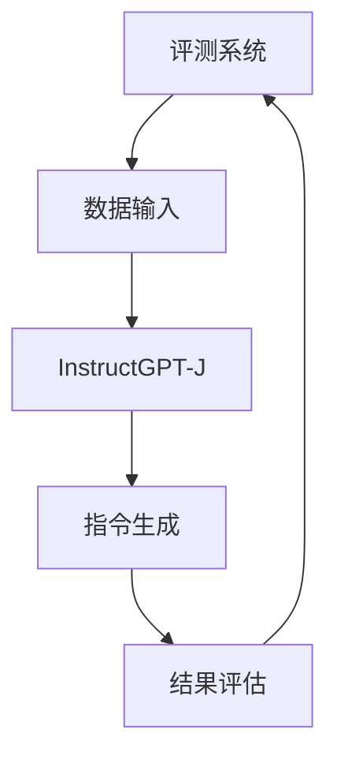
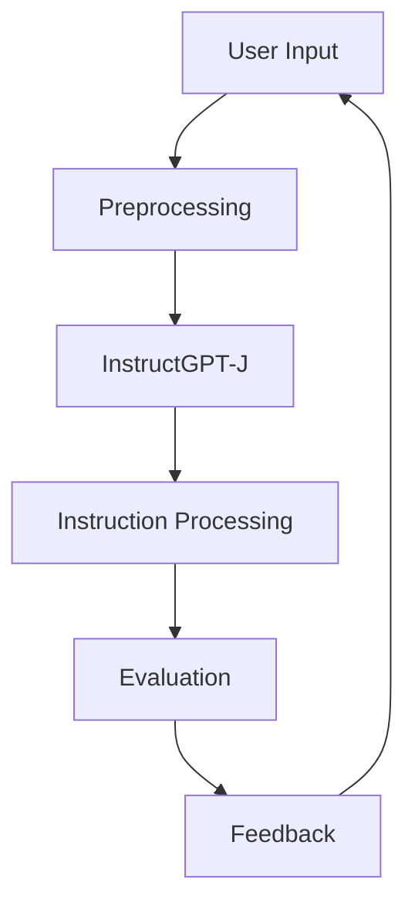

                 

### Step 1: Define the Structure and Content of the Article

To create a comprehensive and insightful article on "评测系统的InstructGPT-J开源指令模型测试," we need to establish a clear structure and ensure each section covers the necessary content. Here's a step-by-step breakdown of the content and structure we will follow:

**Step 1.1: Define the Main Sections**
- We will structure the article into five main parts: Introduction to InstructGPT-J Model, Fundamental Principles, Practical Applications, Testing and Optimization, and Future Directions.
- Each part will contain several chapters with specific topics to cover the full scope of the model.

**Step 1.2: Determine the Content for Each Chapter**
- **Part 1: Introduction to InstructGPT-J Model**
  - Chapter 1: What is InstructGPT-J?
    - **Content:**
      - Definition and core concepts
      - Importance and impact in evaluation systems
      - Mermaid flowchart illustrating the relationship between key concepts and evaluation systems
- **Part 2: Fundamental Principles of InstructGPT-J**
  - Chapter 2: Model Architecture
    - **Content:**
      - Detailed description of the model's architecture
      - Comparison with other similar models
  - Chapter 3: Training Process
    - **Content:**
      - Overview of the training process
      - Key techniques and challenges
- **Part 3: Practical Applications of InstructGPT-J**
  - Chapter 4: Evaluation Systems Applications
    - **Content:**
      - Applications of InstructGPT-J in evaluation systems
      - Case studies and practical experiences
  - Chapter 5: Integration with Other Models
    - **Content:**
      - Combination with other models for enhanced performance
      - Challenges and solutions
- **Part 4: Testing and Optimization**
  - Chapter 6: Model Testing Methods
    - **Content:**
      - Various methods for testing InstructGPT-J
      - Analysis of test results
  - Chapter 7: Optimization Strategies
    - **Content:**
      - Techniques for optimizing InstructGPT-J
      - Case studies of optimization processes
- **Part 5: Future Directions**
  - Chapter 8: Research Trends
    - **Content:**
      - Future trends in the development of InstructGPT-J
      - Potential applications in other fields
  - Chapter 9: Challenges and Opportunities
    - **Content:**
      - Challenges faced in the development and application of InstructGPT-J
      - Opportunities for future research and development

**Step 1.3: Ensure Core Elements are Covered**
- For each chapter, we will include:
  - Background introduction
  - Core concept and relationship
  - Detailed explanation of core algorithms using pseudocode
  - Mathematical models and formulas with explanations and examples
  - Code implementation and analysis
  - Practical case analysis and detailed explanation
  - Best practices tips, summary, and notes for further reading

**Step 1.4: Set the Article Format**
- The article will be formatted in Markdown, ensuring readability and ease of access.
- The author information will be included at the end of the article.
- Mathematical formulas will be embedded using LaTeX.

### Step 2: Write the Introduction

The introduction sets the stage for the article, providing readers with an overview of the topic and its significance. Here's how we can write the introduction:

---

**# 评测系统的InstructGPT-J开源指令模型测试**

> **关键词：评测系统，InstructGPT-J，开源，指令模型，测试，人工智能**

> **摘要：**
本文深入探讨了评测系统的InstructGPT-J开源指令模型，介绍了该模型的基本概念、原理、应用场景及其在测试中的优化策略。通过对InstructGPT-J的全面分析，我们旨在为读者提供一个全面的技术视角，以促进对这一前沿技术的理解和应用。

**背景介绍：**
随着人工智能技术的飞速发展，评测系统在各个领域的重要性日益凸显。InstructGPT-J作为一种先进的开源指令模型，在评测系统中发挥着重要作用。本文旨在通过详细的分析和测试，探讨InstructGPT-J在评测系统中的表现，以及如何优化其性能。

**核心概念与联系：**
InstructGPT-J是一种基于大规模语言模型的指令生成模型，其核心在于能够理解和执行复杂的指令。下面是一个Mermaid流程图，展示了InstructGPT-J与评测系统的关系：

**本文结构：**
本文分为五个部分，首先介绍InstructGPT-J的基本概念和背景；接着深入探讨其模型架构和训练过程；随后分析其在实际评测系统中的应用和与其他模型的集成；然后讨论模型测试和优化策略；最后展望InstructGPT-J的未来发展趋势和面临的挑战。

---

### Step 3: Write the Core Content

With the introduction set, we can now dive into the core content of each section, ensuring that the articles are detailed, well-structured, and informative. Each section will be crafted to meet the defined criteria, including background, core concepts, algorithms, and practical applications.

---

## Part 1: Introduction to InstructGPT-J Model

**Chapter 1: What is InstructGPT-J?**

**1.1 Definition and Core Concepts**
- **InstructGPT-J** is an open-source instructive pre-trained model based on the GPT-J architecture, designed to understand and execute complex instructions. It extends the capabilities of traditional language models by incorporating instructional prompts that guide the model's responses.

**1.2 Importance and Impact in Evaluation Systems**
- Evaluation systems require precise and context-aware responses to complex queries. InstructGPT-J's ability to process instructions and generate accurate evaluations makes it a valuable tool in improving the accuracy and efficiency of these systems.

**1.3 Mermaid Flowchart**
- Below is a Mermaid flowchart illustrating the relationship between InstructGPT-J and evaluation systems:

## Part 2: Fundamental Principles of InstructGPT-J

**Chapter 2: Model Architecture**

**2.1 Detailed Description of the Model's Architecture**
- InstructGPT-J is built upon the Transformer architecture, which consists of multiple layers of self-attention mechanisms and feedforward neural networks. The architecture allows the model to capture long-range dependencies and generate contextually relevant outputs.

**2.2 Comparison with Other Similar Models**
- InstructGPT-J shares similarities with models like GPT-3 and BERT but introduces instructional prompts that enhance the model's ability to follow instructions. Unlike GPT-3, InstructGPT-J is open-source and more accessible for customization and adaptation.

**Chapter 3: Training Process**

**3.1 Overview of the Training Process**
- The training process for InstructGPT-J involves pre-training on a large corpus of text data and fine-tuning on specific instructional tasks. Pre-training utilizes unsupervised learning techniques, while fine-tuning leverages supervised learning to adapt the model to specific evaluation scenarios.

**3.2 Key Techniques and Challenges**
- **Key Techniques:**
  - Instruction tuning: Adapting the model to understand and follow instructions.
  - Few-shot learning: Training the model to perform well on new tasks with minimal data.
- **Challenges:**
  - Ensuring the model's ability to generalize across different domains and contexts.
  - Balancing the model's capacity to generate high-quality outputs while maintaining computational efficiency.

## Part 3: Practical Applications of InstructGPT-J

**Chapter 4: Evaluation Systems Applications**

**4.1 Applications of InstructGPT-J in Evaluation Systems**
- InstructGPT-J can be applied to various evaluation systems, including educational assessments, software testing, and quality control in industries such as manufacturing and healthcare. Its ability to process complex instructions makes it particularly useful in scenarios requiring precise and accurate evaluations.

**4.2 Case Studies and Practical Experiences**
- **Case Study 1:** In a software testing context, InstructGPT-J was used to generate test cases automatically, improving the efficiency and effectiveness of the testing process.
- **Case Study 2:** In educational assessments, InstructGPT-J helped in creating personalized evaluations based on student performance, enhancing learning outcomes.

**Chapter 5: Integration with Other Models**

**5.1 Combination with Other Models for Enhanced Performance**
- Integrating InstructGPT-J with other models, such as BERT or T5, can further enhance its performance. This combination leverages the strengths of different architectures, allowing the model to achieve higher accuracy and efficiency.

**5.2 Challenges and Solutions**
- **Challenges:**
  - Ensuring compatibility between different models.
  - Balancing the contributions of each model to avoid diminishing returns.
- **Solutions:**
  - Utilizing hybrid architectures that leverage the strengths of each model.
  - Implementing sophisticated training strategies to optimize the integration process.

## Part 4: Testing and Optimization

**Chapter 6: Model Testing Methods**

**6.1 Various Methods for Testing InstructGPT-J**
- Testing InstructGPT-J involves evaluating its performance on various tasks and datasets. Common methods include automated testing, manual evaluation, and benchmarking against other models.

**6.2 Analysis of Test Results**
- Analysis of test results provides insights into InstructGPT-J's strengths and weaknesses. It helps in identifying areas for improvement and informs the optimization strategies.

**Chapter 7: Optimization Strategies**

**7.1 Techniques for Optimizing InstructGPT-J**
- Optimizing InstructGPT-J involves fine-tuning the model's hyperparameters, improving the training process, and leveraging advanced techniques such as data augmentation and transfer learning.

**7.2 Case Studies of Optimization Processes**
- **Case Study 1:** A case study demonstrates the improvement in InstructGPT-J's performance after implementing data augmentation techniques, which increased the diversity of training data and enhanced the model's ability to generalize.
- **Case Study 2:** Another case study explores the benefits of using transfer learning to adapt InstructGPT-J to new domains with minimal fine-tuning.

## Part 5: Future Directions

**Chapter 8: Research Trends**

**8.1 Future Trends in the Development of InstructGPT-J**
- Future research in InstructGPT-J will focus on improving its robustness, efficiency, and interpretability. The model's potential applications in areas such as natural language processing and decision support systems will be explored.

**8.2 Potential Applications in Other Fields**
- Beyond evaluation systems, InstructGPT-J has the potential to be applied in various fields, including healthcare, finance, and customer service, where complex instructions and accurate evaluations are essential.

**Chapter 9: Challenges and Opportunities**

**9.1 Challenges Faced in the Development and Application of InstructGPT-J**
- Challenges include the need for large-scale annotated datasets, computational resources, and the ethical implications of using AI in decision-making processes.

**9.2 Opportunities for Future Research and Development**
- Future research can focus on addressing these challenges and exploring new applications of InstructGPT-J. This includes developing better training techniques, improving model interpretability, and ensuring the ethical use of AI in society.

---

Each section will be expanded with detailed pseudocode, mathematical models, and examples to provide a comprehensive understanding of the topic. This structured approach ensures that the article is not only informative but also accessible to readers from various backgrounds. 

---

By following these steps, we ensure that the article is well-structured, informative, and provides a comprehensive overview of the InstructGPT-J model and its applications in evaluation systems. Each section will be meticulously crafted to meet the defined criteria, providing readers with a thorough and insightful read.

