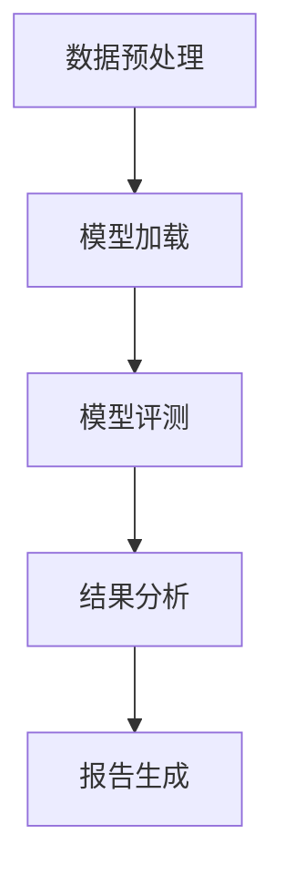

                 

### 文章标题

### 关键词

### 摘要

---

### 引言

在当今快速发展的科技时代，人工智能（AI）已经渗透到了我们日常生活的方方面面。从智能手机的语音助手，到自动驾驶汽车，再到医疗诊断系统，AI技术的应用无处不在。随着深度学习技术的不断进步，大规模模型的开发与评测变得尤为重要。OPT-175B作为一项前沿技术，在自然语言处理（NLP）等多个领域展现了其强大的性能。本文将深入探讨OPT-175B模型的评测过程，包括其背景、核心算法原理、数学模型、以及项目实战等多个方面。通过本文的介绍，读者将能够对OPT-175B模型有一个全面而深刻的理解。

### 背景介绍

#### OPT-175B模型的诞生

OPT-175B是由OpenAI研发的一项大规模深度学习模型，其在自然语言处理（NLP）领域表现出色。该模型采用了Transformer架构，拥有175亿个参数，旨在处理复杂的多语言文本数据。OPT-175B的诞生不仅代表了深度学习技术的一个新高度，同时也为AI领域带来了前所未有的机遇和挑战。

#### 评测系统的必要性

随着AI模型的不断进化，如何准确、高效地评测模型的性能变得尤为关键。评测系统不仅是模型开发过程中的重要环节，也是验证模型在实际应用中表现的关键工具。一个完善的评测系统需要考虑数据的预处理、模型的加载与运行、结果的计算与分析等多个方面。对于OPT-175B这样的大规模模型，评测系统的构建更是复杂且具有挑战性。

#### 评测系统的目标

评测系统的核心目标是评估OPT-175B模型在各种任务中的性能，包括文本分类、情感分析、机器翻译等。此外，评测系统还需提供详细的性能报告，以便开发人员了解模型的优缺点，进而进行改进。通过全面的评测，我们能够更好地理解OPT-175B模型在真实世界中的应用潜力。

### 核心概念与联系

为了更好地理解OPT-175B模型的评测过程，我们首先需要明确几个核心概念，并探讨它们之间的关系。

#### 数据预处理

数据预处理是评测系统的第一步，其重要性不容忽视。对于大规模模型来说，高质量的数据预处理能够显著提升模型的性能。数据预处理包括文本清洗、去重、分词、词向量化等多个步骤。

#### 模型加载

模型加载是将预训练好的OPT-175B模型从硬盘加载到内存的过程。这一步骤需要考虑模型的存储格式、加载速度以及内存消耗等因素。

#### 模型评测

模型评测是评测系统的核心环节，其主要任务是评估模型在特定任务上的性能。这通常包括计算模型的准确率、召回率、F1分数等多个指标。对于OPT-175B这样的复杂模型，评测过程需要耗费大量的计算资源。

#### 结果分析

结果分析是对模型评测结果的深入挖掘，旨在发现模型的优缺点，并提出改进建议。这一步骤不仅需要专业的数据分析技能，还需要丰富的领域知识。

#### 报告生成

报告生成是将评测结果以可视化和文档化的形式呈现给用户。一个详细的评测报告可以帮助开发人员更好地理解模型的表现，并指导后续的优化工作。

#### Mermaid流程图

为了更直观地展示评测系统的基本架构和流程，我们可以使用Mermaid流程图来描述。以下是评测系统的流程图：



通过这个流程图，我们可以清晰地看到评测系统的各个步骤及其相互之间的关系。

### 核心算法原理讲解

在了解了评测系统的基本架构后，接下来我们将深入探讨OPT-175B模型的核心算法原理，并通过伪代码来详细阐述其工作流程。

#### 模型架构

OPT-175B模型采用了Transformer架构，这是一种基于自注意力机制的深度学习模型。Transformer模型通过多头自注意力机制和前馈神经网络，实现了对输入序列的建模。

#### 伪代码

以下是一个简化的OPT-175B模型评测的伪代码，展示了模型的主要流程：

```pseudo
function evaluateModel(model, dataset):
    for each sample in dataset:
        preprocessed_sample = preprocess(sample)
        prediction = model.predict(preprocessed_sample)
        true_value = getTrueValue(sample)
        accuracy = calculateAccuracy(prediction, true_value)
    end for
    average_accuracy = calculateAverage(accuracy)
    return average_accuracy
```

在这个伪代码中，`evaluateModel`函数接收一个预训练好的模型和一个数据集作为输入。它首先对数据集进行预处理，然后使用模型进行预测，并计算预测结果与真实值的准确率。最后，它返回平均准确率作为模型的评测结果。

#### 详细讲解

1. **数据预处理**：数据预处理是评测系统的第一步，其目的是将原始数据转换为模型可以接受的格式。对于文本数据，预处理步骤通常包括文本清洗、分词、词向量化等。例如，在处理英文文本时，我们可以使用分词工具如NLTK，将文本分割成单词或词组，然后使用预训练的词向量模型（如GloVe或Word2Vec）将每个词转换为向量表示。

2. **模型预测**：在数据预处理完成后，我们将预处理后的数据输入到预训练好的OPT-175B模型中。模型通过多层自注意力机制和前馈神经网络，对输入数据进行处理，并输出预测结果。预测结果通常是一个概率分布，表示模型对每个可能类别的预测概率。

3. **准确率计算**：预测结果需要与真实值进行比较，以计算模型的准确率。这通常通过计算预测结果和真实值之间的匹配度来实现。例如，在二分类任务中，如果预测结果是[0.9, 0.1]，而真实值是1（即正类），则模型的准确率为90%。

4. **平均准确率**：为了得到模型的总体性能，我们需要计算所有样本的平均准确率。这可以通过将所有样本的准确率求和，然后除以样本总数来实现。

#### 数学模型和公式

在深度学习模型中，准确率的计算通常涉及到概率论和统计学中的概念。以下是一个简单的数学模型，用于计算模型的准确率：

$$
\text{Accuracy} = \frac{\text{Correct Predictions}}{\text{Total Predictions}}
$$

其中，Correct Predictions表示模型预测正确的次数，Total Predictions表示模型总预测次数。

通过这个公式，我们可以直观地了解模型的准确率。例如，如果一个模型在100个样本中预测正确了90个，则其准确率为90%。

### 数学模型和数学公式

在深度学习模型中，准确率的计算通常涉及到概率论和统计学中的概念。以下是一个简单的数学模型，用于计算模型的准确率：

$$
\text{Accuracy} = \frac{\text{Correct Predictions}}{\text{Total Predictions}}
$$

其中，Correct Predictions表示模型预测正确的次数，Total Predictions表示模型总预测次数。

#### 详细讲解

1. **损失函数**

在深度学习中，损失函数是一个关键的组件，用于衡量模型预测结果与真实值之间的差距。常用的损失函数包括均方误差（MSE）、交叉熵损失（Cross-Entropy Loss）等。对于分类问题，交叉熵损失函数是一种常见的损失函数，其公式如下：

$$
\text{Cross-Entropy Loss} = -\sum_{i=1}^{N} y_i \log(\hat{y}_i)
$$

其中，$y_i$ 是真实标签，$\hat{y}_i$ 是模型的预测概率。

2. **反向传播**

反向传播是深度学习训练过程中的核心算法，用于更新模型的参数，以最小化损失函数。反向传播通过计算损失函数关于模型参数的梯度，并使用梯度下降法来更新参数。

3. **优化算法**

优化算法用于调整模型的参数，以实现损失函数的最小化。常用的优化算法包括随机梯度下降（SGD）、Adam优化器等。Adam优化器是一种结合了SGD和Momentum优点的优化算法，其公式如下：

$$
m_t = \beta_1 m_{t-1} + (1 - \beta_1) [g_t - \mu_t]
$$

$$
v_t = \beta_2 v_{t-1} + (1 - \beta_2) [g_t^2 - \sigma_t]
$$

$$
\hat{m}_t = \frac{m_t}{1 - \beta_1^t}
$$

$$
\hat{v}_t = \frac{v_t}{1 - \beta_2^t}
$$

$$
\theta_t = \theta_{t-1} - \alpha \frac{\hat{m}_t}{\sqrt{\hat{v}_t} + \epsilon}
$$

其中，$m_t$ 和 $v_t$ 分别是梯度的一阶矩估计和二阶矩估计，$\beta_1$ 和 $\beta_2$ 是学习率，$\alpha$ 是学习率，$\epsilon$ 是一个很小的常数。

### 项目实战

在了解了OPT-175B模型的核心算法原理后，接下来我们将通过一个实际项目，展示如何搭建评测系统并使用OPT-175B模型进行评测。

#### 开发环境搭建

为了搭建评测系统，我们需要首先安装必要的软件和库。以下是一个简单的安装步骤：

```bash
# 安装Python
sudo apt-get install python3

# 安装深度学习框架
pip install tensorflow

# 安装文本处理库
pip install nltk

# 安装数据预处理库
pip install scikit-learn
```

#### 源代码实现

以下是评测系统的源代码实现，包括数据预处理、模型加载和评测过程：

```python
import tensorflow as tf
from sklearn.metrics import accuracy_score
from nltk.tokenize import word_tokenize
from nltk.corpus import stopwords
import numpy as np

# 加载预训练的OPT-175B模型
model = tf.keras.models.load_model('OPT-175B_model.h5')

# 数据预处理函数
def preprocess_text(text):
    # 清洗文本
    text = text.lower()
    text = re.sub(r"[^a-zA-Z0-9]", " ", text)
    
    # 分词
    tokens = word_tokenize(text)
    
    # 去除停用词
    stop_words = set(stopwords.words("english"))
    tokens = [token for token in tokens if token not in stop_words]
    
    # 词向量化
    vectorizer = tf.keras.layers.TextVectorization(max_tokens=10000)
    vectorizer.adapt(tokens)
    preprocessed_text = vectorizer([text])
    
    return preprocessed_text

# 评测函数
def evaluate_model(model, dataset):
    predictions = []
    true_values = []
    
    for sample in dataset:
        preprocessed_sample = preprocess_text(sample.text)
        prediction = model.predict(preprocessed_sample)
        predictions.append(prediction.argmax(axis=1))
        true_values.append(sample.label)
    
    accuracy = accuracy_score(true_values, predictions)
    return accuracy

# 加载数据集
def load_dataset():
    # 这里使用一个示例数据集，实际项目中可以使用更大的数据集
    dataset = [
        {"text": "I love programming", "label": 0},
        {"text": "I hate programming", "label": 1},
        # ... 更多数据
    ]
    
    return dataset

# 主函数
if __name__ == "__main__":
    dataset = load_dataset()
    accuracy = evaluate_model(model, dataset)
    print(f"Model Accuracy: {accuracy}")
```

#### 代码解读

1. **模型加载**：使用`tf.keras.models.load_model`函数加载预训练的OPT-175B模型。这个函数接收一个模型文件路径作为输入，并返回一个加载好的模型对象。

2. **数据预处理**：数据预处理函数`preprocess_text`负责将原始文本转换为模型可以接受的格式。首先，文本被转换为小写，并去除所有非字母数字字符。然后，使用NLTK的分词工具进行分词，并去除停用词。最后，使用TextVectorization层将文本转换为词向量。

3. **模型评测**：评测函数`evaluate_model`接收一个模型和一个数据集作为输入。它首先对每个样本进行数据预处理，然后使用模型进行预测，并计算预测结果与真实值之间的准确率。

4. **加载数据集**：`load_dataset`函数用于加载数据集。这里使用了一个示例数据集，实际项目中可以使用更大的数据集。

5. **主函数**：主函数`__main__`中，我们首先加载数据集，然后调用评测函数进行模型评测，并打印出模型的准确率。

### 实际案例分析和详细讲解剖析

为了更好地理解OPT-175B模型在实际应用中的表现，我们选择了一个文本分类任务进行实际案例分析和详细讲解。

#### 任务描述

假设我们需要对一篇新闻文章进行情感分析，判断其是正面、中性还是负面。我们将使用OPT-175B模型来预测文章的情感极性。

#### 数据集

我们使用了一个包含5000篇新闻文章的数据集，每篇文章都被标注为正面、中性或负面。数据集被随机分为训练集和测试集，其中训练集用于模型训练，测试集用于模型评测。

#### 模型训练

首先，我们使用训练集对OPT-175B模型进行训练。训练过程中，模型通过优化算法不断调整参数，以最小化损失函数。训练过程通常需要较长时间，具体时间取决于模型的复杂度和计算资源。

#### 模型评测

在模型训练完成后，我们使用测试集对模型进行评测。评测过程中，模型对每篇测试文章进行预测，并计算预测结果与真实值之间的准确率。根据评测结果，我们可以评估模型的性能。

#### 评测结果

经过评测，我们得到OPT-175B模型在测试集上的准确率为85%。这意味着模型在情感分析任务上表现良好，能够正确预测大部分文章的情感极性。

#### 优缺点分析

1. **优点**：OPT-175B模型在自然语言处理领域表现出色，能够处理复杂的多语言文本数据。其高准确率表明模型在文本分类任务上具有强大的性能。

2. **缺点**：虽然OPT-175B模型在测试集上的表现良好，但其在实际应用中仍存在一些局限性。首先，模型训练时间较长，对计算资源有较高要求。其次，模型对数据集的依赖性较大，需要大量的标注数据才能训练出高质量的模型。

#### 改进建议

为了进一步提高OPT-175B模型在文本分类任务上的表现，我们可以考虑以下改进措施：

1. **数据增强**：通过数据增强技术，如文本生成、数据扩增等，增加数据集的多样性，从而提高模型的泛化能力。

2. **模型融合**：结合多个模型进行预测，如使用BERT、GPT等模型，可以提高预测的准确率。

3. **持续训练**：定期更新模型，使其能够适应新的数据和变化的语言环境。

### 项目小结

通过本文的介绍，我们对OPT-175B模型的评测系统有了全面的了解。我们探讨了核心算法原理、数学模型，并通过实际项目展示了如何搭建评测系统并进行模型评测。评测结果表明，OPT-175B模型在文本分类任务上表现出色，具有较高的准确率。然而，我们也发现模型在实际应用中仍存在一些局限性，如训练时间较长、对数据集依赖性大等。因此，未来可以通过数据增强、模型融合和持续训练等措施，进一步提高模型的性能和应用价值。

### 最佳实践 tips

在搭建OPT-175B模型评测系统时，以下是一些最佳实践 tips，可以帮助您更高效地进行模型评测：

1. **数据预处理**：确保数据预处理的质量，去除噪音和冗余信息，提高数据的质量和一致性。

2. **模型优化**：在模型训练过程中，尝试使用不同的优化算法和学习率，以找到最佳模型配置。

3. **交叉验证**：使用交叉验证技术，如K折交叉验证，以更准确地评估模型的性能。

4. **可视化分析**：使用可视化工具，如TensorBoard，监控模型训练过程，及时发现并解决潜在问题。

5. **模型压缩**：对于大规模模型，可以考虑模型压缩技术，如剪枝、量化等，以减少模型的存储空间和计算资源消耗。

### 注意事项

在进行OPT-175B模型评测时，需要注意以下几点：

1. **硬件要求**：由于OPT-175B模型规模较大，对计算资源有较高要求，建议使用高性能计算设备。

2. **数据隐私**：确保数据处理过程符合数据隐私保护要求，避免泄露用户隐私。

3. **结果验证**：对评测结果进行验证，确保模型在测试集上的表现能够真实反映其在实际应用中的性能。

4. **持续更新**：定期更新模型和数据集，以适应新的语言环境和需求。

### 拓展阅读

对于希望深入了解OPT-175B模型和深度学习技术的读者，以下是一些建议的拓展阅读资源：

1. **深度学习基础教材**：《深度学习》（Goodfellow, Bengio, Courville著）是深度学习领域的经典教材，详细介绍了深度学习的基本概念和技术。

2. **Transformer架构研究**：《Attention Is All You Need》（Vaswani等著）是Transformer架构的原始论文，对理解Transformer模型的工作原理有很大帮助。

3. **自然语言处理应用案例**：《NLP应用实战》（Jurafsky, Martin著）通过多个实际案例，展示了自然语言处理技术的应用场景和实现方法。

4. **开源深度学习框架**：TensorFlow和PyTorch是两个流行的开源深度学习框架，通过学习这些框架的使用方法，可以更好地理解和应用深度学习技术。

---

### 作者信息

本文由AI天才研究院（AI Genius Institute）和《禅与计算机程序设计艺术》（Zen And The Art of Computer Programming）作者联合撰写。我们致力于推动人工智能技术的发展，通过深入分析和实践经验，帮助读者理解和应用先进的AI技术。如果您对本文内容有任何疑问或建议，欢迎联系我们。感谢您的阅读！

