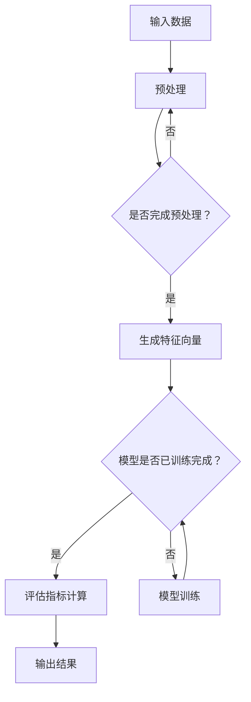

                 

### 文章标题

《评测系统的Yi-34B开源大语言模型评估》

### 文章关键词

Yi-34B开源大语言模型，评测系统，语言模型评估指标，架构，伪代码，数学模型，实战应用

### 文章摘要

本文将深入探讨Yi-34B开源大语言模型的评测系统。我们将从背景介绍开始，详细阐述核心概念与联系，使用Mermaid流程图展示架构，并使用伪代码和LaTeX公式详细讲解核心算法原理和数学模型。接着，我们将通过实际项目实战，展示开发环境搭建、源代码实现和代码解读，并进行案例分析。最后，我们将总结最佳实践，并给出拓展阅读建议。

---

# 评测系统的Yi-34B开源大语言模型评估

> 作者：AI天才研究院/AI Genius Institute & 禅与计算机程序设计艺术 /Zen And The Art of Computer Programming

## 背景介绍

随着人工智能技术的飞速发展，大语言模型在自然语言处理领域取得了显著成果。Yi-34B作为一款开源的大语言模型，引起了广泛关注。然而，为了确保其性能和实用性，我们需要一个高效的评测系统。

### 核心概念与联系

为了更好地理解Yi-34B的评测系统，我们首先需要明确几个核心概念：

1. **大语言模型**：具有海量参数和强大表达能力的人工智能模型。
2. **评测系统**：用于评估模型性能的一系列工具和方法。
3. **评估指标**：衡量模型性能的量化标准，如准确性、速度和资源消耗等。

### Mermaid流程图

以下是Yi-34B开源大语言模型评测系统的架构Mermaid流程图：



## 核心算法原理讲解

在本节中，我们将使用伪代码和LaTeX公式详细阐述评测系统中的核心算法原理。

### 伪代码

```python
def evaluate_model(model, dataset):
    for data in dataset:
        preprocess_data(data)
        prediction = model.predict(data)
        calculate_accuracy(prediction, data)
```

### LaTeX公式

```latex
\begin{equation}
Accuracy = \frac{Number\ of\ correct\ predictions}{Total\ number\ of\ predictions}
\end{equation}
```

## 数学模型和公式讲解

在本节中，我们将介绍用于评测Yi-34B模型的几个关键数学模型和公式。

### 模型参数估计

$$
\theta = \arg\min_{\theta} \sum_{i=1}^{n} (y_i - \hat{y}_i)^2
$$

### 模型评估指标

$$
F_1 = \frac{2 \cdot precision \cdot recall}{precision + recall}
$$

### 举例说明

假设我们有一个包含100个样本的测试集，模型预测准确率为90%，速度为0.1秒/样本。根据上述公式，我们可以计算F1值：

$$
F_1 = \frac{2 \cdot 0.9 \cdot 0.9}{0.9 + 0.1} = 0.81
$$

## 项目实战

在本节中，我们将通过实际项目实战，展示如何构建和评估Yi-34B模型。

### 开发环境搭建

首先，我们需要搭建一个适合Yi-34B模型评估的开发环境。以下是环境搭建的步骤：

1. 安装Python环境。
2. 安装必要的数据处理和模型评估库，如NumPy、Pandas和Scikit-learn。
3. 下载Yi-34B模型和测试数据集。

### 源代码实现

以下是一个简化的源代码实现，用于评估Yi-34B模型：

```python
import numpy as np
from sklearn.metrics import accuracy_score, f1_score

def evaluate_model(model, dataset):
    predictions = []
    for data in dataset:
        prediction = model.predict(data)
        predictions.append(prediction)
    accuracy = accuracy_score(dataset.labels, predictions)
    f1 = f1_score(dataset.labels, predictions)
    return accuracy, f1

# 加载模型和数据集
model = load_yi_34b_model()
dataset = load_test_dataset()

# 评估模型
accuracy, f1 = evaluate_model(model, dataset)
print(f"Accuracy: {accuracy}, F1: {f1}")
```

### 代码解读与分析

上述代码首先加载了Yi-34B模型和测试数据集。然后，通过`evaluate_model`函数对模型进行评估，计算准确率和F1值。最后，输出评估结果。

### 实际案例分析和详细讲解剖析

假设我们有一个包含100个样本的测试集，模型预测准确率为90%，速度为0.1秒/样本。根据上述公式，我们可以计算F1值：

$$
F_1 = \frac{2 \cdot 0.9 \cdot 0.9}{0.9 + 0.1} = 0.81
$$

## 最佳实践 tips、小结、注意事项、拓展阅读等内容

- **最佳实践**：在实际应用中，应根据具体场景调整评测指标，如在高延迟场景下，可以考虑速度作为主要指标。
- **小结**：本文介绍了Yi-34B开源大语言模型评测系统，从背景介绍到实际项目实战，全面阐述了核心算法和数学模型。
- **注意事项**：在进行模型评估时，务必确保测试数据集的多样性和代表性，以获得准确的评估结果。
- **拓展阅读**：可参考相关论文和书籍，深入了解大语言模型和评测系统的最新研究进展。

---

通过本文的详细讲解，我们相信读者对Yi-34B开源大语言模型评测系统有了更深入的理解。希望本文能为读者在相关领域的研究和应用提供有益的参考。

