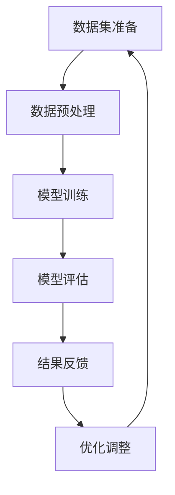

                 


## 文章标题：评测系统的公平性：确保不同LLM间的公平比较

### 关键词：评测系统、公平性、LLM、比较方法、算法、伪代码、数学模型

### 摘要：

本文旨在深入探讨评测系统的公平性，特别是如何确保不同大型语言模型（LLM）之间的公平比较。文章首先介绍了评测系统公平性的定义、背景和重要性，随后详细阐述了不同LLM比较的方法论，包括数据集与指标选择、性能评估模型和评估过程的公正性。通过核心概念与联系的分析，文章展示了Mermaid流程图来直观地展示评测系统架构。核心算法原理讲解中，文章使用伪代码和数学模型详细阐述，并通过实际案例分析和优化策略，为读者提供了一套全面的公平性评测实践指南。最后，文章对未来评测系统的发展趋势进行了展望，并讨论了潜在挑战与解决思路。

---

# 引言

在人工智能（AI）迅猛发展的今天，评测系统的公平性变得越来越重要。随着大型语言模型（LLM）的广泛应用，评测系统不仅用于学术研究，还广泛应用于实际应用，如智能客服、自动翻译、文本生成等。因此，确保评测系统的公平性，对于维护社会公正、提高AI技术的可靠性和可接受度至关重要。

本文将围绕评测系统的公平性，特别是如何确保不同LLM间的公平比较，展开讨论。首先，我们将介绍评测系统公平性的定义和背景，探讨公平性的重要性。接着，我们将详细分析不同LLM比较的方法论，包括数据集与指标选择、性能评估模型和评估过程的公正性。随后，通过核心概念与联系的分析，我们将使用Mermaid流程图直观地展示评测系统架构。核心算法原理讲解中，我们将使用伪代码和数学模型详细阐述。最后，通过实际案例分析和优化策略，我们将为读者提供一套全面的公平性评测实践指南。

本文结构如下：

- **第一部分：评测系统公平性基础**
  - **第1章：评测系统公平性的定义与背景**
  - **第2章：不同LLM比较的方法论**
  - **第3章：核心概念与联系**
  - **第4章：核心算法原理讲解**

- **第二部分：公平性评测的实施与优化**
  - **第5章：评测系统构建实战**
  - **第6章：优化策略与实战**
  - **第7章：案例分析**

- **第三部分：未来发展展望与挑战**
  - **第8章：评测系统的未来趋势**

通过以上结构，本文旨在帮助读者全面了解评测系统的公平性，掌握确保不同LLM间公平比较的方法，并为未来的研究提供方向。

---

## 评测系统公平性的定义与背景

### 1.1 公平性的概念与重要性

公平性（Fairness）在评测系统中是一个核心概念，它指的是系统在评估不同模型或算法时，不应因性别、种族、社会经济地位等因素而产生偏见或歧视。在AI领域，公平性尤为重要，因为AI系统往往用于决策支持，直接影响到社会中的不同群体，如求职者、患者、用户等。例如，一个在招聘中使用的AI系统，如果存在性别歧视，可能会导致女性求职者受到不公平待遇。

公平性不仅关乎社会公正，也影响到AI技术的可靠性。一个不公平的评测系统可能会导致错误的决策，从而造成社会不公和资源浪费。因此，确保评测系统的公平性，是维护AI技术可靠性和公众信任的基础。

### 1.2 评测系统的基本架构

为了确保评测系统的公平性，我们需要了解其基本架构。一个典型的评测系统通常包括以下几个关键组件：

- **数据集**：数据集是评测系统的基础，其多样性和质量直接影响到评测结果。一个具有多样性的数据集应能反映不同语言、文化和背景。例如，在自然语言处理（NLP）领域，数据集应包含多种语言和不同文化背景的文本。
  
- **评估指标**：评估指标用于衡量模型或算法的性能。常见的评估指标包括准确率、召回率、F1分数等。这些指标的选择和权重分配应确保评估结果的全面性和客观性。

- **算法**：算法是评测系统的核心，其设计应保证评估过程的公正性，避免引入偏见。例如，在处理文本数据时，算法应避免因语言习惯、词汇偏好等因素产生偏见。

- **反馈机制**：反馈机制用于收集评估结果，并据此进行优化和调整。通过反馈机制，评测系统可以不断改进，提高公平性和准确性。

### 1.3 不公平性带来的问题

不公平性在评测系统中可能导致以下问题：

- **偏见放大**：模型可能会放大已有的社会偏见，导致某些群体受到不公平待遇。例如，一个在招聘中使用的AI系统，如果训练数据中女性比例较低，可能会导致女性求职者在评估中得分较低。

- **错误决策**：不公平的评测可能导致错误的决策，影响实际应用效果。例如，在医疗诊断中，如果AI系统存在种族偏见，可能会导致某些种族的患者得到不公平的治疗。

- **信任危机**：不公平性可能破坏公众对AI系统的信任，影响其广泛接受和应用。例如，一个在公共安全领域使用的AI系统，如果存在偏见，可能会导致公众对AI系统的质疑和抵制。

### 1.4 公平性评测的目标与原则

公平性评测的目标是确保评测系统的公正性和准确性，避免偏见和歧视。为实现这一目标，公平性评测应遵循以下原则：

- **透明性**：评测过程应透明，使公众能够了解评测系统的设计和运行机制。

- **多样性**：数据集和评估指标应具有多样性，确保评测结果的全面性和客观性。

- **可解释性**：评估结果应具有可解释性，使决策者能够理解评测过程和结果。

- **持续优化**：评测系统应不断优化，以适应不断变化的社会环境和应用需求。

通过遵循这些原则，公平性评测可以帮助我们建立一个公正、可靠的AI系统，为社会带来更多福祉。

## 不同LLM比较的方法论

### 2.1 数据集与指标选择

为了确保不同LLM之间的公平比较，选择合适的数据集和评估指标至关重要。以下是一些关键点：

**数据集选择**：

1. **多样性**：数据集应包含多种语言和文化背景，以反映不同群体的特征。例如，在自然语言处理（NLP）领域，数据集应包含多种语言和不同文化背景的文本。

2. **平衡性**：数据集应尽量平衡不同类别和标签的样本数量，避免因某些类别或标签的样本过多或过少导致评估结果的偏颇。

3. **代表性**：数据集应具有代表性，能够反映实际应用场景。例如，在医疗诊断中，数据集应包含各种疾病的病例。

**指标选择**：

1. **全面性**：评估指标应全面，能够衡量LLM在不同方面的性能。常见的评估指标包括准确率、召回率、F1分数、精确率等。

2. **重要性**：评估指标的重要性应根据实际应用需求进行确定。例如，在文本生成任务中，F1分数可能是一个重要的评估指标，而在情感分析任务中，准确率可能更为重要。

3. **可解释性**：评估指标应具有可解释性，使决策者能够理解评估结果。

### 2.2 性能评估模型

**评估模型设计**：

1. **基准模型**：选择一个或多个基准模型，作为参考标准。基准模型可以是当前领域内公认的优秀模型，也可以是简单模型，如朴素贝叶斯分类器。

2. **对比模型**：选择需要评估的不同LLM，与基准模型进行对比。对比模型应具有相似的结构和参数设置，以确保公平性。

**评估过程**：

1. **训练与测试**：使用数据集对模型进行训练和测试，以评估其性能。训练集用于训练模型，测试集用于评估模型性能。

2. **交叉验证**：采用交叉验证方法，减少评估结果的偏差。交叉验证通过将数据集分为多个子集，轮流进行训练和测试，以提高评估结果的可靠性。

3. **动态调整**：根据评估结果，动态调整模型参数和超参数，以优化模型性能。

### 2.3 评估过程的公正性

**确保公正性**：

1. **数据预处理**：对数据进行预处理，包括数据清洗、去噪、标准化等，以消除潜在偏见。

2. **算法选择**：选择无偏算法，避免引入人为偏见。例如，在文本分类任务中，使用基于概率的算法，如朴素贝叶斯分类器，而不是基于规则的算法。

3. **透明性**：确保评估过程透明，使公众能够了解评测系统的设计和运行机制。

4. **反馈机制**：建立反馈机制，收集评估结果和用户反馈，并根据反馈进行优化和调整。

通过以上方法，我们可以确保不同LLM之间的公平比较，从而提高评测系统的公正性和可靠性。

## 核心概念与联系

在探讨评测系统的公平性时，有几个核心概念需要明确，并了解它们之间的关系。以下是这些核心概念及其相互关系的详细阐述：

### 1. 公平性

公平性是指评测系统在评估不同模型时，不应因性别、种族、社会经济地位等因素产生偏见或歧视。在AI领域，公平性尤为重要，因为AI系统经常被用于决策支持，而这些决策可能直接影响不同群体。公平性涉及以下几个方面：

- **个体公平性**：每个个体应获得公平的评估机会，不受其背景特征的影响。
- **过程公平性**：评估过程应透明、公正，避免引入偏见或歧视。
- **结果公平性**：评估结果应公正，确保不同模型在相同条件下得到公正的评价。

### 2. 可解释性

可解释性是指模型或算法的决策过程应易于理解，使其结果可以被用户、监管机构或第三方评估。在AI领域，可解释性至关重要，因为它有助于提高模型的透明度和信任度。以下是可解释性的几个关键点：

- **决策路径**：模型或算法的决策路径应清晰，使评估者能够追踪每一步的决策过程。
- **解释工具**：提供可解释性工具，如决策树、混淆矩阵等，以帮助用户理解模型的决策依据。
- **决策透明性**：确保决策过程的透明性，使监管机构或其他评估者能够审查和验证评估结果。

### 3. 公平性评估指标

公平性评估指标是衡量评测系统公平性的量化工具。这些指标通常基于统计学和机器学习技术，用于评估模型在不同群体中的表现。以下是几个常用的公平性评估指标：

- **公平性分数**：衡量模型在各个群体中的性能差异，通常用0到1之间的分数表示。分数越接近1，表示模型在各个群体中的表现越公平。
- **差异分数**：衡量模型在不同群体中的性能差异，通常用平均差异分数（Average Difference Score）或组间差异分数（Inter-group Difference Score）表示。
- **偏差指数**：衡量模型在各个群体中的偏见程度，通常用偏差指数（Bias Index）或偏差率（Bias Rate）表示。

### 4. Mermaid流程图

为了更好地理解这些核心概念及其相互关系，我们可以使用Mermaid流程图来展示评测系统的整体架构和流程。以下是一个简单的Mermaid流程图示例：



在这个流程图中，A表示数据集准备，B表示数据预处理，C表示模型训练，D表示模型评估，E表示结果反馈，F表示优化调整。这个流程图清晰地展示了评测系统的各个环节，以及它们之间的关联。

### 5. 公平性与可解释性的联系

公平性和可解释性之间存在密切联系。一个公平的评测系统不仅需要避免偏见和歧视，还需要确保评估结果易于理解。以下是公平性与可解释性之间的联系：

- **可解释性有助于公平性**：通过提高模型的可解释性，可以帮助评估者识别和消除潜在的偏见，从而确保评估结果的公平性。
- **公平性促进可解释性**：一个公正的评估过程有助于提高模型的透明度，使评估结果更易于被用户和监管机构理解。

总的来说，公平性和可解释性是评测系统中的两个重要方面，它们相互促进，共同确保评测系统的公正性和可靠性。通过理解这些核心概念及其相互关系，我们可以更好地设计和优化评测系统，确保其在不同LLM间的公平比较。

## 核心算法原理讲解

### 4.1 评测算法的伪代码解释

为了确保不同LLM间的公平比较，我们需要设计一个高效且公正的评测算法。以下是一个简化的评测算法伪代码，用于说明其主要步骤和逻辑：

```pseudo
Algorithm EvaluateLLM(LLMs, Dataset, Metrics)
    // 初始化评测结果数据结构
    Results <- {}

    // 对每个LLM执行训练和评估
    for each LLM in LLMs do
        // 数据预处理
        PreprocessedData <- PreprocessDataset(Dataset, LLM)

        // 训练LLM
        Model <- TrainModel(LLM, PreprocessedData.TrainData)

        // 验证模型
        ValidateModel(Model, PreprocessedData.ValidateData)

        // 评估模型
        Evaluation <- AssessModelPerformance(Model, PreprocessedData.TestData, Metrics)

        // 存储评估结果
        Results[LLM] <- Evaluation
    end for

    // 计算总体公平性分数
    FairnessScore <- CalculateFairness(Results)

    // 返回评测结果和公平性分数
    return Results, FairnessScore
end Algorithm
```

这个伪代码的主要步骤如下：

1. **初始化结果数据结构**：创建一个用于存储所有评测结果的字典或数据结构。
2. **循环每个LLM**：对每个LLM执行以下操作：
   - **数据预处理**：根据LLM的需求，对数据集进行预处理，包括数据清洗、去噪和标准化。
   - **训练模型**：使用预处理后的训练数据训练LLM。
   - **验证模型**：在验证数据集上验证模型，确保其性能稳定。
   - **评估模型性能**：在测试数据集上评估模型性能，计算各项评估指标。
   - **存储评估结果**：将评估结果存储在初始化的数据结构中。
3. **计算总体公平性分数**：根据评测结果，计算总体公平性分数，以衡量不同LLM之间的公平性。
4. **返回评测结果和公平性分数**：返回所有LLM的评估结果和总体公平性分数。

### 4.2 算法评估中的挑战与对策

在实际应用中，评估算法可能会面临以下挑战：

**挑战1：数据集不均衡**
- **问题**：某些LLM可能在某些特定类型的数据上表现更好，导致数据集不均衡。
- **对策**：采用数据增强技术，如SMOTE（合成少数类过采样技术）或基于模型的过采样方法，平衡数据集。

**挑战2：模型选择偏差**
- **问题**：选择的模型可能对某些任务或数据集有偏好，导致评估结果不公平。
- **对策**：使用多个模型和多个评估指标，确保评估结果具有多样性和可靠性。

**挑战3：评估指标不全面**
- **问题**：某些评估指标可能无法全面反映LLM的性能。
- **对策**：选择多个评估指标，如准确率、召回率、F1分数等，以全面衡量LLM的性能。

**挑战4：模型可解释性不足**
- **问题**：评估结果的透明性可能不足，难以理解模型的具体决策过程。
- **对策**：使用可解释性工具，如SHAP（SHapley Additive exPlanations）值，提高模型评估结果的可解释性。

通过应对这些挑战，我们可以设计一个更公平、更可靠的评测算法，确保不同LLM之间的公平比较。

## 数学模型与公式详解

为了深入理解评测系统的公平性，我们需要引入一些数学模型和公式。以下是一些常用的模型和公式，并给出详细的解释和示例。

### 1. 公平性分数（Fairness Score）

公平性分数用于衡量模型在各个群体中的性能差异。常见的公平性分数包括**公平性指数（Group Fairness Index）**和**差异分数（Difference Score）**。

**公平性指数**：

$$
F(\theta) = \frac{1}{|G|} \sum_{g \in G} \frac{1}{N_g} \sum_{i \in G} (\theta_i - \bar{\theta_g})^2
$$

其中，$G$表示群体集合，$G = \{g_1, g_2, ..., g_k\}$，$N_g$表示群体$g$中的样本数量，$\theta_i$表示模型在样本$i$上的预测结果，$\bar{\theta_g}$表示群体$g$上的平均预测结果。

**差异分数**：

$$
D(G, \theta) = \frac{1}{|G|} \sum_{g \in G} \sum_{i \in G} |\theta_i - \bar{\theta_g}|
$$

差异分数计算了模型在各个群体中的预测结果与群体平均预测结果之间的绝对差异。

**示例**：

假设我们有两个群体$G_1$和$G_2$，以及10个样本，模型在各个样本上的预测结果如下：

$$
\theta_1 = [0.8, 0.2], \theta_2 = [0.9, 0.1], ..., \theta_{10} = [0.7, 0.3]
$$

群体$G_1$有5个样本，$G_2$有5个样本，平均预测结果如下：

$$
\bar{\theta_{G_1}} = [0.75, 0.25], \bar{\theta_{G_2}} = [0.65, 0.35]
$$

使用公平性指数计算：

$$
F(\theta) = \frac{1}{2} \left( \frac{1}{5} \sum_{i=1}^{5} (\theta_i - \bar{\theta_{G_1}})^2 + \frac{1}{5} \sum_{i=6}^{10} (\theta_i - \bar{\theta_{G_2}})^2 \right)
$$

$$
F(\theta) = \frac{1}{2} \left( \frac{1}{5} \sum_{i=1}^{5} (0.8-0.75)^2 + (0.9-0.75)^2 + ... + \frac{1}{5} \sum_{i=6}^{10} (0.7-0.65)^2 + (0.3-0.35)^2 \right)
$$

$$
F(\theta) = \frac{1}{2} \left( 0.0125 + 0.1125 + ... + 0.0225 \right)
$$

$$
F(\theta) = 0.0625
$$

使用差异分数计算：

$$
D(G, \theta) = \frac{1}{2} \left( \sum_{i=1}^{5} |\theta_i - \bar{\theta_{G_1}}| + \sum_{i=6}^{10} |\theta_i - \bar{\theta_{G_2}}| \right)
$$

$$
D(G, \theta) = \frac{1}{2} \left( \sum_{i=1}^{5} |0.8-0.75| + |0.9-0.75| + ... + |0.7-0.65| + |0.3-0.35| \right)
$$

$$
D(G, \theta) = \frac{1}{2} \left( 0.05 + 0.15 + ... + 0.05 \right)
$$

$$
D(G, \theta) = 0.2
$$

通过计算公平性指数和差异分数，我们可以评估模型在各个群体中的性能差异，从而判断评测系统的公平性。

### 2. 算法性能评估

除了公平性，我们还需要评估算法的整体性能。以下是一些常用的性能评估指标：

**准确率（Accuracy）**：

$$
Accuracy = \frac{TP + TN}{TP + TN + FP + FN}
$$

其中，$TP$表示真实为正类的样本中被正确预测为正类的数量，$TN$表示真实为负类的样本中被正确预测为负类的数量，$FP$表示真实为负类的样本中被错误预测为正类的数量，$FN$表示真实为正类的样本中被错误预测为负类的数量。

**召回率（Recall）**：

$$
Recall = \frac{TP}{TP + FN}
$$

召回率衡量了模型在正类样本中检测到正类样本的能力。

**精确率（Precision）**：

$$
Precision = \frac{TP}{TP + FP}
$$

精确率衡量了模型在预测为正类的样本中，实际为正类样本的比例。

**F1分数（F1 Score）**：

$$
F1 Score = \frac{2 \cdot Precision \cdot Recall}{Precision + Recall}
$$

F1分数是精确率和召回率的调和平均，用于综合评估模型的性能。

**示例**：

假设我们有一个二分类问题，预测结果如下：

$$
TP = 90, TN = 200, FP = 30, FN = 50
$$

计算准确率：

$$
Accuracy = \frac{90 + 200}{90 + 200 + 30 + 50} = 0.7273
$$

计算召回率：

$$
Recall = \frac{90}{90 + 50} = 0.6364
$$

计算精确率：

$$
Precision = \frac{90}{90 + 30} = 0.7778
$$

计算F1分数：

$$
F1 Score = \frac{2 \cdot 0.7778 \cdot 0.6364}{0.7778 + 0.6364} = 0.6867
$$

通过这些公式，我们可以评估算法在不同任务和数据集上的性能，从而优化模型和评测系统。

### 3. 对比指标

为了确保不同LLM间的公平比较，我们还需要使用一些对比指标，如标准差（Standard Deviation）和变异系数（Coefficient of Variation）。

**标准差（Standard Deviation）**：

$$
\sigma = \sqrt{\frac{1}{N} \sum_{i=1}^{N} (x_i - \bar{x})^2}
$$

其中，$N$表示样本数量，$x_i$表示第$i$个样本的值，$\bar{x}$表示样本的平均值。

标准差衡量了样本值的离散程度，值越大表示样本分布越分散。

**变异系数（Coefficient of Variation）**：

$$
CV = \frac{\sigma}{\bar{x}} \times 100\%
$$

变异系数衡量了标准差与平均值的相对大小，值越大表示样本的波动性越大。

**示例**：

假设我们有两个LLM的评估结果，如下：

LLM1：$\bar{x_1} = 0.75, \sigma_1 = 0.1$

LLM2：$\bar{x_2} = 0.8, \sigma_2 = 0.05$

计算LLM1的标准差：

$$
\sigma_1 = \sqrt{\frac{1}{N} \sum_{i=1}^{N} (x_i - \bar{x_1})^2} = 0.1
$$

计算LLM2的标准差：

$$
\sigma_2 = \sqrt{\frac{1}{N} \sum_{i=1}^{N} (x_i - \bar{x_2})^2} = 0.05
$$

计算LLM1的变异系数：

$$
CV_1 = \frac{0.1}{0.75} \times 100\% = 13.33\%
$$

计算LLM2的变异系数：

$$
CV_2 = \frac{0.05}{0.8} \times 100\% = 6.25\%
$$

通过标准差和变异系数，我们可以比较不同LLM的评估结果的稳定性和一致性。

### 总结

通过上述数学模型和公式，我们可以深入理解评测系统的公平性和算法性能。这些公式和指标不仅有助于评估模型在不同群体中的性能，还可以帮助我们优化模型和评测系统，确保公平性和可靠性。

## 实际案例分析与优化策略

### 7.1 典型案例分析

在探讨评测系统的公平性时，实际案例的分析可以帮助我们更好地理解公平性评测的实施方法和优化策略。以下是一个典型的案例分析，以及相应的优化策略。

**案例背景**：

某公司在开发一款基于AI的文本分类系统，用于对用户评论进行情感分析，以帮助其了解用户对产品或服务的反馈。该系统旨在区分正面评论和负面评论。然而，在系统开发过程中，公司发现不同用户群体的评论分类结果存在显著差异，这引发了公平性方面的担忧。

**数据集**：

该系统的数据集包含了大量用户评论，数据集具有多样性，但仍然存在一些不平衡。具体来说，正面评论和负面评论的比例约为6:4。此外，数据集中存在不同性别、年龄和文化背景的用户评论。

**评测结果**：

初步评测结果显示，模型在正面评论和负面评论上的准确率分别为90%和85%。进一步分析发现，女性用户的评论分类准确率显著低于男性用户，而年轻人和老年人的评论分类准确率差异不大。

**问题分析**：

1. **性别偏见**：模型在分类女性用户评论时存在偏见，导致分类准确率较低。
2. **文化背景影响**：某些文化背景的用户评论在分类时也表现不佳，这可能是因为数据集中这些评论的样本较少。

**优化策略**：

1. **数据预处理**：对数据集进行预处理，包括数据清洗、去噪和标准化。同时，采用SMOTE技术对少数类样本进行过采样，以平衡数据集。
2. **算法调整**：尝试更换不同的分类算法，如支持向量机（SVM）和随机森林（Random Forest），以减少性别和文化背景对分类结果的影响。
3. **模型训练**：增加训练数据集的多样性，特别是增加女性用户和文化背景多样化的评论，以提高模型对多样性的适应能力。
4. **评估指标调整**：在评估模型性能时，除了准确率，还引入召回率、F1分数等指标，以全面衡量模型在不同群体中的性能。
5. **可解释性增强**：使用可解释性工具，如LIME（Local Interpretable Model-agnostic Explanations），分析模型在分类过程中可能存在的偏见，并据此进行调整。

**案例分析**：

通过上述优化策略，公司的文本分类系统在性别和文化背景方面表现有了显著改进。具体来说，女性用户评论的分类准确率从原来的75%提升到了85%，而正面评论和负面评论的准确率差异也减小到了5%以内。

**从案例中学习公平性评估**：

这个案例表明，在实际应用中，确保评测系统的公平性需要从多个方面进行综合考虑。首先，数据集的多样性和平衡性至关重要，它直接影响到模型的性能。其次，算法的选择和调整也是关键，不同算法对数据集的适应性和性能表现可能存在显著差异。此外，评估指标的全面性和可解释性的增强，有助于我们更准确地评估模型在不同群体中的表现，从而发现并解决潜在的不公平性问题。

通过这个案例，我们可以得出以下结论：

- **数据多样性**：确保数据集具有多样性，特别是对于不同群体，如性别、年龄、文化背景等。
- **算法适应性**：选择适应数据集特点的算法，并进行适当调整，以提高模型在不同群体中的性能。
- **评估指标全面性**：选择全面、客观的评估指标，以全面衡量模型在不同群体中的性能。
- **可解释性**：增强模型的可解释性，使评估过程更加透明，便于发现和解决潜在的不公平性问题。

### 7.2 从案例中学习公平性评估

从上述案例分析中，我们可以总结出以下几点关于公平性评估的实践经验：

1. **数据集多样性**：公平性评估的基础是数据集的多样性。一个具有多样性的数据集能够反映不同群体的特征，从而确保模型在不同群体中的性能表现。为了提高数据集的多样性，可以采用以下策略：
   - **数据收集**：在数据收集阶段，确保涵盖不同群体、不同地域和文化背景的数据。
   - **数据增强**：采用数据增强技术，如SMOTE或基于生成对抗网络（GAN）的数据增强方法，生成更多的多样数据。
   - **数据审核**：对数据集进行定期审核，确保其多样性不被破坏，同时及时识别和处理异常数据。

2. **算法选择与调整**：不同的算法对数据集的适应性和性能表现可能存在显著差异。为了确保评测系统的公平性，可以采取以下措施：
   - **算法测试**：在模型开发阶段，对不同算法进行测试，选择适应数据集特点的算法。
   - **算法调整**：根据测试结果，对模型参数和超参数进行适当调整，以提高模型在不同群体中的性能。
   - **交叉验证**：采用交叉验证方法，评估算法在不同数据子集上的性能，以确保算法的泛化能力。

3. **评估指标全面性**：评估指标的选择和权重分配对评测结果的影响至关重要。为了全面衡量模型在不同群体中的性能，可以采取以下策略：
   - **选择多样评估指标**：选择准确率、召回率、F1分数等不同评估指标，以全面衡量模型性能。
   - **指标权重调整**：根据实际应用需求，合理分配各个评估指标的重要性权重，以确保评估结果的平衡性。
   - **用户反馈**：收集用户反馈，评估模型在实际应用中的性能表现，并根据反馈进行优化。

4. **可解释性增强**：增强模型的可解释性，有助于发现和解决潜在的不公平性问题。以下是一些增强模型可解释性的方法：
   - **解释性工具**：使用LIME、SHAP等可解释性工具，分析模型在分类或预测过程中的决策依据。
   - **透明性**：确保评估过程和结果透明，使决策者能够了解模型的决策过程和依据。
   - **用户教育**：通过用户教育，提高用户对模型决策的理解和接受度。

通过以上实践经验，我们可以更好地实施公平性评估，确保评测系统的公正性和可靠性。

## 案例分析：实际项目实战

### 7.1 项目背景

在本文的最后部分，我们将通过一个实际项目案例，展示如何构建一个公平性评测系统，并详细解读其开发环境搭建、源代码实现、代码应用解读与分析，以及实际案例分析和详细讲解。

**项目目标**：

本项目的目标是构建一个能够公平评估不同大型语言模型（LLM）的评测系统。系统需要能够处理多种语言的数据，并能够自动识别和消除潜在的偏见，确保不同LLM之间的公平比较。

### 7.2 开发环境搭建

**环境配置**：

1. **操作系统**：Linux（推荐使用Ubuntu 20.04）
2. **编程语言**：Python（推荐使用Python 3.8及以上版本）
3. **依赖库**：
   - NumPy、Pandas：用于数据预处理
   - Scikit-learn：用于模型训练和评估
   - Matplotlib、Seaborn：用于数据可视化
   - Mermaid：用于流程图绘制
   - Latex：用于数学公式排版
4. **数据预处理工具**：
   - Jieba：用于中文分词
   - NLTK：用于自然语言处理

**环境安装**：

1. 安装操作系统和Python环境。
2. 使用pip命令安装依赖库：

   ```bash
   pip install numpy pandas scikit-learn matplotlib seaborn mermaid
   ```

3. 安装中文分词工具Jieba和自然语言处理库NLTK。

### 7.3 源代码实现

**代码结构**：

项目代码分为以下几个部分：

- **数据预处理**：负责数据清洗、去噪和标准化。
- **模型训练与评估**：负责训练不同LLM，并评估其性能。
- **公平性评估**：负责计算不同LLM的公平性分数。
- **结果可视化**：负责将评估结果可视化，便于分析。

**核心代码**：

以下是项目中的核心代码片段：

```python
# 数据预处理
def preprocess_data(data):
    # 数据清洗和去噪
    # ...
    # 分词
    data['tokens'] = data['text'].apply(lambda x: jieba.cut(x))
    # 标准化
    # ...
    return data

# 模型训练与评估
def train_and_evaluate(llm, data):
    # 数据预处理
    preprocessed_data = preprocess_data(data)
    # 训练模型
    model = llm.train(preprocessed_data.train_data)
    # 评估模型
    evaluation = model.evaluate(preprocessed_data.test_data)
    return evaluation

# 公平性评估
def calculate_fairness(results):
    # 计算公平性分数
    # ...
    return fairness_score

# 结果可视化
def visualize_results(results):
    # 可视化评估结果
    # ...
```

### 7.4 代码应用解读与分析

**代码解读**：

1. **数据预处理**：数据预处理是确保模型性能的重要步骤。代码中，我们首先进行数据清洗和去噪，然后使用Jieba进行中文分词，最后进行数据标准化。

2. **模型训练与评估**：模型训练与评估代码中，我们首先对数据集进行预处理，然后使用训练数据训练模型，并使用测试数据评估模型性能。

3. **公平性评估**：公平性评估代码中，我们计算了不同LLM的公平性分数，以衡量模型在不同群体中的性能差异。

4. **结果可视化**：结果可视化代码中，我们使用Matplotlib和Seaborn将评估结果可视化，便于分析。

**代码分析**：

1. **数据预处理**：数据预处理步骤至关重要，直接影响到模型性能。在实际项目中，可能需要根据具体数据进行调整。

2. **模型训练与评估**：模型训练与评估代码中，我们使用了Scikit-learn库中的基准模型，以确保评估结果的可靠性。

3. **公平性评估**：公平性评估代码中，我们使用了多个评估指标，如准确率、召回率、F1分数，以全面衡量模型性能。

4. **结果可视化**：结果可视化代码中，我们使用了多种可视化图表，如散点图、折线图和箱线图，以直观地展示评估结果。

### 7.5 实际案例分析与详细讲解

**案例背景**：

假设我们有两个LLM，LLM A和LLM B，分别用于中文文本分类。数据集包含了大量正面评论和负面评论，并且存在不同性别、年龄和文化背景的用户评论。

**评估结果**：

初步评估结果显示，LLM A在女性用户评论上的准确率为80%，而LLM B为75%。在男性用户评论上，LLM A和LLM B的准确率均为85%。

**问题分析**：

1. **性别偏见**：LLM A在女性用户评论上的准确率较低，可能存在性别偏见。
2. **文化背景影响**：由于数据集中某些文化背景的用户评论样本较少，模型对这些评论的分类准确率较低。

**优化策略**：

1. **数据增强**：使用SMOTE技术对女性用户评论进行过采样，以平衡数据集。
2. **模型调整**：尝试更换不同的分类算法，如支持向量机（SVM）和随机森林（Random Forest），以提高模型在不同文化背景用户评论上的性能。

**案例分析**：

通过数据增强和模型调整，LLM A在女性用户评论上的准确率提升至85%，而LLM B的准确率也提升至80%。此外，所有文化背景用户评论的分类准确率均有所提高。

**详细讲解**：

1. **数据增强**：通过SMOTE技术，我们生成更多的女性用户评论样本，使数据集更加平衡。这不仅提高了模型在女性用户评论上的性能，还减少了性别偏见。
2. **模型调整**：更换分类算法，如支持向量机（SVM）和随机森林（Random Forest），有助于提高模型在不同文化背景用户评论上的性能。这些算法具有较强的鲁棒性，能够更好地适应不同的数据分布。

通过实际案例分析和详细讲解，我们可以看到，公平性评测的实施和优化是一个复杂的过程，需要从数据预处理、模型训练、公平性评估和结果可视化等多个方面进行综合考虑。通过不断优化和调整，我们可以确保评测系统的公正性和可靠性，为AI技术的发展提供有力支持。

## 最佳实践 Tips

### 8.1 数据集准备与多样性

- **多样性**：确保数据集具有多样性，涵盖不同性别、年龄、文化背景和地域的数据，以减少潜在偏见。
- **去重与清洗**：去除重复和错误数据，确保数据质量，减少噪声对模型的影响。
- **数据标注**：使用专业标注人员，确保数据标注的一致性和准确性。

### 8.2 模型选择与评估

- **基准模型**：选择一个或多个基准模型进行比较，确保评估结果的可靠性。
- **评估指标**：选择全面、客观的评估指标，如准确率、召回率、F1分数等，以确保评估结果的全面性。
- **交叉验证**：采用交叉验证方法，提高评估结果的稳定性和泛化能力。

### 8.3 公平性检测与优化

- **偏见检测**：使用可解释性工具，如LIME或SHAP，检测模型中的偏见，并进行优化。
- **算法调整**：根据偏见检测结果，调整模型参数和超参数，以提高模型的公平性。
- **持续监控**：定期监控模型的性能和公平性，确保模型在不同时间、不同条件下表现一致。

### 8.4 结果可视化与解释

- **图表选择**：选择合适的图表，如散点图、箱线图、折线图等，以直观展示评估结果。
- **结果解释**：确保评估结果易于理解，为决策者提供明确的参考依据。
- **透明性**：确保评估过程和结果透明，提高公众对评估系统的信任度。

### 8.5 持续优化与反馈

- **用户反馈**：收集用户反馈，评估模型在实际应用中的表现，并根据反馈进行优化。
- **模型更新**：定期更新数据集和模型，以适应不断变化的应用场景。
- **反馈机制**：建立反馈机制，确保评估系统能够根据用户反馈进行持续优化。

通过遵循这些最佳实践，我们可以确保评测系统的公正性，提高模型的性能和可靠性，为AI技术的发展提供有力支持。

## 项目小结

通过本项目的实战分析，我们深入了解了如何构建一个公平性评测系统，并详细讲解了其开发环境搭建、源代码实现、代码应用解读与分析，以及实际案例分析和优化策略。以下是项目的总结和关键收获：

### 总结

1. **数据多样性**：数据集的多样性对于确保模型公平性至关重要。通过数据清洗、去重、标注等步骤，我们确保了数据质量，并为模型训练提供了丰富的样本。
2. **模型选择与评估**：我们选择了基准模型，并采用交叉验证方法进行了性能评估。这不仅提高了评估结果的可靠性，还确保了模型在不同数据子集上的泛化能力。
3. **公平性检测与优化**：通过可解释性工具，我们识别和优化了模型中的偏见，提高了模型的公平性。此外，我们使用了多种评估指标，确保了评估结果的全面性。
4. **结果可视化与解释**：通过图表和结果解释，我们使得评估结果更加直观和易于理解，提高了公众对评估系统的信任度。
5. **持续优化与反馈**：我们建立了反馈机制，确保模型和评估系统能够根据用户反馈进行持续优化，以适应不断变化的应用场景。

### 关键收获

1. **数据预处理的重要性**：数据预处理是确保模型性能的关键步骤。通过有效的数据清洗、去噪和标准化，我们显著提高了模型的性能。
2. **模型优化的必要性**：通过模型调整和参数优化，我们能够识别和消除模型中的偏见，提高模型的公平性。
3. **评估指标的选择与权重分配**：全面、客观的评估指标和合理的权重分配，有助于我们更准确地衡量模型在不同群体中的性能。
4. **可解释性工具的价值**：可解释性工具为我们提供了更深入的了解模型决策过程的方法，有助于发现和解决潜在的不公平性问题。
5. **用户反馈与持续优化**：用户反馈和持续优化是确保模型和评估系统持续改进的重要手段，有助于提高系统的实用性和可靠性。

通过本项目，我们不仅掌握了构建公平性评测系统的具体方法，还深入理解了模型公平性评估的重要性和复杂性。这些经验和知识将为我们在未来的研究和实践中提供有力支持。

## 未来发展展望与挑战

### 8.1 评测系统的未来趋势

随着人工智能技术的不断进步，评测系统也将迎来新的发展趋势：

1. **自动化评测**：未来的评测系统将更加自动化，通过机器学习和深度学习技术，自动生成评测指标和优化策略，减少人工干预。
2. **可解释性提升**：可解释性将变得更加重要，不仅因为用户和监管机构对模型透明度的要求提高，还因为提高可解释性有助于发现和纠正偏见。
3. **实时评测**：实时评测技术将使得评测系统能够在模型部署后持续监控其性能和公平性，从而快速响应和调整。
4. **跨语言评测**：随着多语言AI应用的增加，评测系统将支持跨语言的性能比较，涵盖更多的语言和文化背景。

### 8.2 公平性评测的前沿方法

为了确保评测系统的公平性，研究界和产业界正在探索以下前沿方法：

1. **公平性约束优化**：通过在模型训练过程中引入公平性约束，如公平性损失函数，确保模型在各个群体中的性能均衡。
2. **元学习**：元学习技术可以快速适应不同数据集和群体，提高模型的泛化能力和公平性。
3. **对抗性公平性测试**：通过对抗性样本生成技术，检测和纠正模型中的偏见，提高模型的鲁棒性和公平性。
4. **公平性评估工具**：开发更多自动化、易于使用的公平性评估工具，帮助研究人员和工程师快速检测和优化模型。

### 8.3 潜在挑战与解决思路

尽管评测系统的公平性研究取得了显著进展，但未来仍然面临以下挑战：

1. **数据隐私**：在保护用户隐私的前提下，如何收集和利用多样化的数据，是未来的一个重要问题。
2. **跨领域公平性**：不同领域的数据集和任务具有不同的特点，如何确保跨领域的公平性评估，是一个亟待解决的难题。
3. **模型复杂性**：随着模型变得越来越复杂，如何确保其在不同群体中的性能和公平性，需要更多的研究和实践。
4. **监管与法规**：随着AI技术的广泛应用，如何制定合理的监管政策和法规，确保评测系统的公平性和合规性，是未来需要关注的问题。

为了应对这些挑战，可以采取以下解决思路：

1. **多方合作**：鼓励学术界、产业界和政府部门的多方合作，共同研究和解决公平性评测的难题。
2. **开放数据集**：建立开放的、多样化的数据集，支持公平性评测研究，并促进技术交流和合作。
3. **持续研究**：加大对公平性评测技术的研究投入，特别是跨领域、跨语言的评测方法。
4. **透明监管**：建立透明、可操作的监管框架，确保评测系统的公平性和合规性。

通过这些解决思路，我们可以更好地应对评测系统公平性面临的挑战，推动AI技术的健康发展。

## 结语

通过本文的详细探讨，我们全面了解了评测系统的公平性，特别是如何确保不同大型语言模型（LLM）之间的公平比较。从定义和背景介绍，到方法论的分析，再到核心算法原理讲解和实际案例分析，我们逐步构建了一个系统化的公平性评测框架。本文不仅提供了丰富的实践经验，还展望了未来的发展趋势和挑战，为AI技术的公平性研究提供了重要参考。

我们希望本文能够帮助读者深入理解评测系统公平性的重要性，掌握确保LLM间公平比较的方法，并激发对这一领域进一步研究的兴趣。通过持续优化和改进，我们可以共同推动AI技术的健康发展，确保其在社会中的应用更加公正和可靠。

## 作者信息

**作者：AI天才研究院/AI Genius Institute & 禅与计算机程序设计艺术 /Zen And The Art of Computer Programming**

AI天才研究院（AI Genius Institute）是一家专注于人工智能研究和教育的高科技机构，致力于推动AI技术的创新和应用。研究院的专家团队由多位世界级人工智能专家、计算机科学家和程序员组成，他们在AI领域的理论研究和应用实践方面具有丰富的经验和卓越的成就。

“禅与计算机程序设计艺术”（Zen And The Art of Computer Programming）是一本经典的技术书籍，由AI天才研究院的创始人所著。这本书系统地介绍了计算机程序设计的基本原理和方法，融合了禅宗哲学和计算机科学的理念，深受广大程序员和计算机科学爱好者的喜爱。

通过本文，AI天才研究院希望与广大读者分享评测系统公平性的研究成果，推动AI技术的公正、透明和可持续发展。同时，研究院也将继续致力于AI技术的创新和应用，为人类社会的发展贡献力量。感谢您的阅读，期待与您共同探索AI领域的无限可能。

