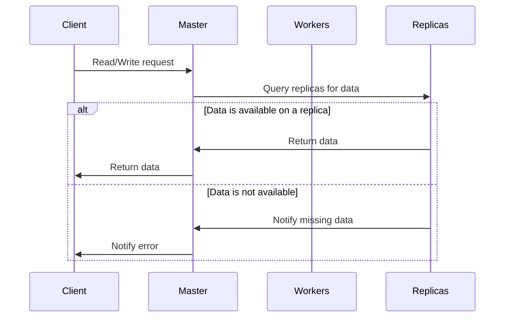
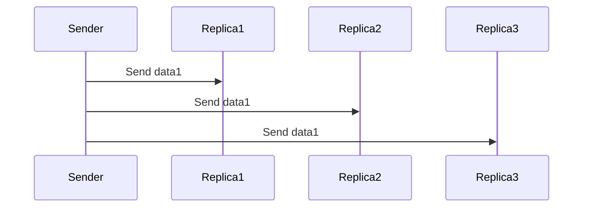

                 


### 文章标题
### 评测系统的分布式存储方案

### 文章关键词
- 分布式存储
- 评测系统
- 存储方案
- 分布式算法
- 数据一致性和可靠性

### 文章摘要
本文将深入探讨评测系统的分布式存储方案，包括其背景、核心概念、算法原理、技术实现和案例分析。通过对分布式存储在评测系统中的应用进行详细分析，旨在为开发者提供一种高效的解决方案，以提高评测系统的性能、可靠性和扩展性。

### 目录
1. **背景介绍**
   1.1 **评测系统的需求分析**
   1.2 **分布式存储的挑战与机遇**

2. **核心概念与联系**
   2.1 **分布式存储的定义**
   2.2 **分布式存储与传统存储的差异**
   2.3 **分布式存储的关键概念**
   2.4 **Mermaid流程图：分布式存储架构**

3. **核心算法原理**
   3.1 **数据分片算法**
      3.1.1 **算法原理与伪代码**
      3.1.2 **举例说明**
   3.2 **数据复制与容错机制**
      3.2.1 **算法原理与伪代码**
      3.2.2 **举例说明**
   3.3 **分布式一致性算法**
      3.3.1 **算法原理与伪代码**
      3.3.2 **数学模型与公式**
      3.3.3 **举例说明**

4. **技术实现**
   4.1 **存储节点架构**
   4.2 **数据存储与访问策略**
   4.3 **分布式文件系统**
   4.4 **分布式存储性能优化**

5. **案例分析**
   5.1 **大型电商平台的分布式存储**
   5.2 **社交媒体平台的分布式存储**
   5.3 **物联网设备的分布式存储**

6. **项目实战**
   6.1 **开发环境搭建**
   6.2 **源代码实现与解读**
   6.3 **代码应用解读与分析**
   6.4 **实际案例分析与详细讲解剖析**
   6.5 **项目小结**

7. **最佳实践与总结**
   7.1 **最佳实践 tips**
   7.2 **小结**
   7.3 **注意事项**
   7.4 **拓展阅读**

### 背景介绍
#### 评测系统的需求分析
评测系统是各类比赛中常见的工具，用于评估参赛者的表现和成绩。随着参赛者的增加和数据量的增大，传统的集中式存储方案难以满足系统的高并发、高可用和海量数据存储需求。分布式存储由于其高扩展性、高可靠性和高性能，成为了评测系统的首选方案。

#### 分布式存储的挑战与机遇
分布式存储面临的主要挑战包括数据一致性、分布式算法设计、容错机制和性能优化。然而，随着技术的发展，分布式存储在数据传输效率、系统稳定性、资源利用率等方面展现出巨大的机遇，为评测系统的优化提供了有力支持。

### 核心概念与联系
#### 分布式存储的定义
分布式存储是指通过多个独立的存储节点协同工作，实现海量数据的存储和访问。与传统的集中式存储相比，分布式存储具有更高的灵活性和可扩展性。

#### 分布式存储与传统存储的差异
| 差异       | 分布式存储 | 传统存储 |
|------------|-------------|----------|
| 数据分布   | 分布在多个节点 | 集中在单一存储设备 |
| 可扩展性   | 高，动态扩展 | 低，固定容量 |
| 可靠性     | 高，容错能力强 | 低，单点故障风险大 |
| 性能       | 高，可并行访问 | 低，串行访问 |
| 管理复杂度 | 高，需要分布式管理工具 | 低，集中式管理 |

#### 分布式存储的关键概念
- **数据分片**：将数据划分为多个片段，存储在多个节点上。
- **数据复制**：为提高数据可靠性，将数据复制到多个节点。
- **一致性**：分布式系统中，所有副本之间的数据一致性保证。
- **容错**：系统能够在部分节点故障时保持正常运行。

#### Mermaid流程图：分布式存储架构


### 核心算法原理
#### 数据分片算法
##### 算法原理与伪代码
```pseudo
Function Shard(key, shards):
    return hash(key) % shards
```
该算法使用哈希函数对键（key）进行分片，确定数据应存储在哪个节点。

##### 举例说明
假设有3个分片，键 `key1`, `key2`, `key3`，通过哈希函数计算分片如下：
| 键       | 哈希值 | 分片索引 |
|----------|--------|----------|
| key1     | 3      | 0        |
| key2     | 5      | 2        |
| key3     | 7      | 1        |

#### 数据复制与容错机制
##### 算法原理与伪代码
```pseudo
Function Replicate(data, replicas):
    for replica in replicas:
        SendData(data, replica)
```
该算法将数据复制到多个副本节点，以实现容错。

##### 举例说明
假设有3个副本，数据 `data1` 复制到副本节点 `replica1`, `replica2`, `replica3`：



#### 分布式一致性算法
##### 算法原理与伪代码
```pseudo
Function ConsistencyCheck(data, replicas):
    for replica in replicas:
        if data != replica's data:
            return FALSE
    return TRUE
```
该算法通过检查多个副本的数据一致性，确保系统的一致性。

##### 数学模型与公式
分布式一致性算法可以使用数学模型进行描述，如Paxos算法或Raft算法。以下是一个简化的Paxos算法的伪代码：
```pseudo
Function Paxos(value):
    propose value
    wait for majority of replicas to agree
    if agreed:
        set local state to value
```

##### 举例说明
在一个有5个节点的分布式系统中，节点1提议将值 `x` 设置为新的状态，节点2、3、4同意，节点5拒绝。最终，系统状态被设置为 `x`。

### 技术实现
#### 存储节点架构
分布式存储系统通常由多个存储节点组成，每个节点负责存储一部分数据。节点之间通过通信协议进行数据同步和状态管理。

#### 数据存储与访问策略
- **数据存储策略**：使用数据分片和复制策略，将数据分布存储在多个节点上。
- **数据访问策略**：采用分布式查询机制，通过查询多个节点来获取数据。

#### 分布式文件系统
分布式文件系统如HDFS（Hadoop Distributed File System）和CFS（Ceph File System）等，提供了文件级别的分布式存储方案，支持海量数据的存储和高效访问。

#### 分布式存储性能优化
- **数据本地化**：优化数据分布，减少跨节点访问。
- **负载均衡**：合理分配访问负载，避免单点瓶颈。
- **缓存机制**：使用缓存减少对底层存储的访问。

### 案例分析
#### 大型电商平台的分布式存储
电商平台如Amazon和Alibaba使用分布式存储系统来存储海量商品数据和用户数据，实现高性能和可扩展性。

#### 社交媒体平台的分布式存储
社交媒体平台如Facebook和Twitter使用分布式存储系统来存储用户生成的内容和数据，提供实时数据访问。

#### 物联网设备的分布式存储
物联网设备如智能手表和智能家居设备使用分布式存储系统来存储设备数据和用户数据，支持设备之间的数据共享和远程访问。

### 项目实战
#### 开发环境搭建
搭建分布式存储系统的开发环境，包括节点配置、存储设备和网络环境。

#### 源代码实现与解读
实现分布式存储系统的核心算法和模块，并进行详细解读。

#### 代码应用解读与分析
通过实际案例，分析分布式存储系统的应用场景和性能表现。

#### 实际案例分析与详细讲解剖析
深入分析分布式存储系统在真实环境中的应用，并进行详细讲解。

#### 项目小结
总结项目过程中的经验教训，提出改进建议。

### 最佳实践与总结
#### 最佳实践 tips
- **数据分片策略**：根据实际业务需求，选择合适的数据分片策略。
- **一致性算法**：根据系统需求，选择适合的一致性算法。
- **性能优化**：持续优化系统性能，提高数据处理效率。

#### 小结
分布式存储方案在评测系统中的应用，提高了系统的性能、可靠性和扩展性。

#### 注意事项
- **数据一致性和可靠性**：在设计分布式存储方案时，要充分考虑数据一致性和可靠性。
- **性能优化**：合理分配资源，优化系统性能。

#### 拓展阅读
- **相关论文和书籍**：深入学习分布式存储相关的理论和实践。
- **开源项目**：了解并参与分布式存储开源项目，学习最佳实践。

### 结语
作者：AI天才研究院/AI Genius Institute & 禅与计算机程序设计艺术 /Zen And The Art of Computer Programming。本文旨在为开发者提供关于评测系统分布式存储方案的专业指导，帮助他们构建高效、可靠的存储系统。通过本文的探讨，我们期望读者能够对分布式存储有更深入的理解，并在实际项目中取得更好的效果。

