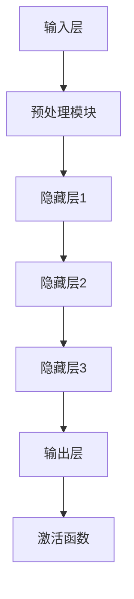

                 

### 文章标题

# 《评测系统的可微分神经计算机实现》

### 关键词

- 神经计算机
- 可微分神经计算机
- 评测系统
- 深度学习
- 神经网络
- 硬件实现

### 摘要

本文详细介绍了评测系统的可微分神经计算机实现。首先回顾了神经计算机的起源与发展，随后阐述了可微分神经计算机的定义、特点及与传统神经计算机的比较。接着，文章介绍了评测系统的基本概念及其作用。随后，文章重点分析了可微分神经计算机的数学基础，包括向量与矩阵、线性代数基础和微分方程。然后，文章深入探讨了可微分神经计算机的原理，从神经元模型、神经网络结构到工作原理进行了详细阐述。接下来，文章介绍了可微分神经计算机的实现，包括硬件实现、软件实现和系统架构。最后，文章展示了可微分神经计算机在评测系统中的应用案例，并对其发展趋势进行了展望。通过本文，读者可以全面了解可微分神经计算机在评测系统中的应用和实践。

## 第1章 引言

### 1.1 神经计算机的起源与发展

神经计算机（Neural Computer）是一种模仿人脑神经元结构和功能的计算机系统。它的起源可以追溯到20世纪40年代，由心理学家McCulloch和数学家Pitts提出的神经网络模型。这一模型试图通过简单的数学运算模拟神经元的处理能力。

神经计算机的研究经历了多个阶段。在早期阶段，研究者主要关注的是神经网络的基本结构和学习算法。其中，感知机（Perceptron）是最早的一种神经网络模型，它由Frank Rosenblatt于1957年提出。感知机通过调整权重和偏置来学习输入和输出之间的映射关系。

然而，感知机的局限性很快被发现。它无法解决非线性问题，也无法学习多层的神经网络。这促使研究者开始探索更复杂的神经网络结构。1970年代，反向传播算法（Backpropagation Algorithm）的提出为多层神经网络的训练提供了有效的方法。反向传播算法通过将误差反向传播到网络的前层，逐层更新权重和偏置，从而实现网络的训练。

随着计算能力的提高和算法的改进，神经计算机的应用领域逐渐扩展。除了传统的模式识别和分类任务外，神经计算机还在自然语言处理、语音识别、图像处理等领域取得了显著的成果。

### 1.2 可微分神经计算机的研究背景

可微分神经计算机（Differentiable Neural Computer，DNC）是一种结合了神经网络和传统计算模型的计算机系统。它的核心思想是将神经计算机的内部状态视为一个可微分的函数，从而使得神经计算机可以像传统计算模型一样进行优化。

可微分神经计算机的研究背景可以追溯到2000年代中期。当时，研究人员发现传统的神经网络在处理序列数据时存在一定的局限性。例如，传统的神经网络难以处理长序列，因为长序列中的信息在传播过程中会逐渐丢失。

为了解决这一问题，研究者开始探索将神经网络与记忆单元相结合的模型。其中，最著名的模型是长短时记忆网络（Long Short-Term Memory，LSTM）。LSTM通过引入记忆单元，可以有效地捕捉长序列中的信息，从而提高了神经网络在处理序列数据时的性能。

然而，LSTM在处理某些复杂的序列数据时仍然存在困难。这促使研究者继续探索更强大的神经网络模型。可微分神经计算机正是在这种背景下提出的。它的核心思想是将神经计算机的内部状态视为一个可微分的函数，从而可以像传统计算模型一样进行优化。

### 1.3 神经计算机的应用领域

神经计算机在多个领域都展现出了巨大的潜力。以下是几个主要的应用领域：

#### 1. 模式识别与分类

模式识别和分类是神经计算机最早和最广泛的应用领域之一。通过训练神经网络，可以使计算机自动识别图像、声音、文本等数据中的模式。例如，卷积神经网络（Convolutional Neural Network，CNN）在图像分类任务中取得了显著的成果，广泛应用于面部识别、物体检测等场景。

#### 2. 自然语言处理

自然语言处理（Natural Language Processing，NLP）是神经计算机的另一个重要应用领域。神经网络可以用来理解、生成和翻译自然语言。例如，循环神经网络（Recurrent Neural Network，RNN）及其变种LSTM在机器翻译、情感分析、文本生成等方面取得了很好的效果。

#### 3. 语音识别

语音识别是将语音信号转换为文本或其他形式的信息。神经网络通过学习语音信号和文本之间的映射关系，可以实现高精度的语音识别。深度神经网络（Deep Neural Network，DNN）和卷积神经网络（CNN）在语音识别任务中得到了广泛应用。

#### 4. 控制系统

神经计算机在控制系统中的应用也越来越广泛。通过训练神经网络，可以使计算机自动控制机械臂、无人机等设备的运动。神经网络在自适应控制、预测控制等领域展现了强大的潜力。

#### 5. 金融分析

金融分析是另一个重要的应用领域。神经网络可以用来预测股票市场走势、分析金融数据等。例如，卷积神经网络（CNN）和长短期记忆网络（LSTM）在股票市场预测、交易策略优化等方面取得了显著的效果。

通过以上介绍，我们可以看到神经计算机在多个领域都有广泛的应用，其潜力和前景不可估量。随着技术的不断发展和完善，神经计算机将在更多领域发挥重要作用。

## 第2章 可微分神经计算机

### 2.1 定义

可微分神经计算机（Differentiable Neural Computer，DNC）是一种结合了神经网络和记忆单元的计算机系统。它的核心特点是内部状态可以被视为一个可微分的函数，这使得DNC可以像传统计算模型一样进行优化。

DNC由两个主要部分组成：神经网络和记忆网络。神经网络负责处理输入数据和生成输出，而记忆网络则用于存储和检索信息。与传统神经网络不同，DNC的记忆网络可以动态地读写，这使得它在处理序列数据时具有更强的能力。

### 2.2 特点

可微分神经计算机具有以下几个显著特点：

#### 1. 动态读写记忆

DNC的记忆网络支持动态读写，这意味着它可以在处理过程中随时读取和写入信息。这种特性使得DNC在处理序列数据时，可以有效地捕捉和利用历史信息。

#### 2. 可微分性

DNC的内部状态可以被视为一个可微分的函数，这使得它可以像传统计算模型一样进行优化。这意味着DNC可以通过梯度下降等优化算法来调整其内部参数，从而提高其性能。

#### 3. 模块化设计

DNC采用了模块化设计，这使得它可以灵活地组合不同的模块，以适应不同的应用需求。例如，神经网络模块可以负责处理输入数据，而记忆网络模块则可以负责存储和检索信息。

#### 4. 鲁棒性

DNC在设计时考虑了鲁棒性，这意味着它在处理噪声数据和异常值时，仍然可以保持良好的性能。这种特性使得DNC在真实世界的应用中具有更高的可靠性。

### 2.3 传统神经计算机的比较

与传统神经计算机相比，可微分神经计算机具有以下几个方面的优势：

#### 1. 处理序列数据

传统神经计算机在处理序列数据时，通常需要使用特殊的结构，如循环神经网络（RNN）和长短时记忆网络（LSTM）。而DNC可以直接处理序列数据，无需特殊的结构，这使得它在处理复杂序列数据时更加高效。

#### 2. 动态读写记忆

DNC的记忆网络支持动态读写，这使得它在处理实时数据时具有更强的能力。而传统神经计算机通常无法实现动态读写，这限制了它们在实时应用中的性能。

#### 3. 可微分性

DNC的可微分性使得它可以通过梯度下降等优化算法来调整内部参数，从而提高性能。而传统神经计算机通常无法进行优化，这限制了它们在复杂任务中的表现。

#### 4. 鲁棒性

DNC在设计时考虑了鲁棒性，这使得它在处理噪声数据和异常值时，仍然可以保持良好的性能。而传统神经计算机通常对噪声数据和异常值敏感，这限制了它们在真实世界的应用。

总的来说，可微分神经计算机在处理序列数据、动态读写记忆、可微分性和鲁棒性等方面具有显著的优势，这使得它在多个领域都有广泛的应用前景。

## 第3章 评测系统概述

### 3.1 基本概念

评测系统（Evaluation System）是一种用于评估和监控各种系统、服务或产品的性能和质量的工具。它通常包括一系列的测试和评估方法，以量化地衡量系统或产品的性能、可靠性和用户体验。

评测系统的主要功能包括：

1. **性能评估**：测量系统在处理特定任务时的响应速度和效率。
2. **可靠性评估**：评估系统在长时间运行中的稳定性和故障率。
3. **质量评估**：评估系统或产品的功能和性能是否符合预期标准。
4. **用户体验评估**：通过用户调查和反馈，评估用户对系统或产品的满意度。

### 3.2 作用

评测系统在多个领域都发挥着重要作用，主要包括：

1. **研发与优化**：通过评测系统的测试，研发团队可以发现系统中的问题，并针对性地进行优化和改进。
2. **质量控制**：评测系统可以帮助确保系统或产品的质量和性能符合行业标准或客户要求。
3. **性能监控**：通过定期评测，可以监控系统的性能变化，及时发现潜在的问题并进行调整。
4. **用户体验优化**：通过用户体验评估，可以发现用户在使用过程中遇到的问题，并针对性地进行优化，以提高用户满意度。

### 3.3 分类

评测系统可以根据不同的评估目标和评估方法进行分类，常见的分类方法包括：

1. **功能评测**：评估系统或产品的功能是否完整和符合要求。
2. **性能评测**：评估系统在处理特定任务时的速度和效率。
3. **可靠性评测**：评估系统在长时间运行中的稳定性和故障率。
4. **安全性评测**：评估系统或产品在安全性方面的表现，包括防止攻击和保障数据安全。
5. **用户体验评测**：评估用户在使用系统或产品时的满意度，包括界面设计、操作便捷性、响应速度等。

通过不同类型的评测，评测系统可以帮助全面了解系统或产品的性能和问题，从而为改进和优化提供科学依据。

### 3.4 评测系统的架构

评测系统的架构通常包括以下几个关键组成部分：

1. **测试框架**：用于设计、执行和监控测试过程的软件框架。
2. **测试工具**：用于执行具体测试任务的工具，如性能测试工具、负载测试工具、安全测试工具等。
3. **测试用例库**：存储各种测试用例的数据库，包括功能测试用例、性能测试用例、可靠性测试用例等。
4. **结果分析模块**：用于分析测试结果，生成报告和可视化图表的工具。
5. **监控模块**：用于实时监控系统性能和健康状态的模块。

通过这些组成部分的协同工作，评测系统可以全面地评估系统或产品的性能和问题，为优化和改进提供依据。

## 第2章 可微分神经计算机的数学基础

### 2.1 向量与矩阵

#### 2.1.1 向量及其运算

向量（Vector）是数学和物理学中常用的基本概念，可以表示具有大小和方向的量。在计算机科学中，向量通常用于表示数据的集合。

一个向量可以用一个有序数组表示，例如，向量\( \mathbf{v} \)可以表示为：

\[ \mathbf{v} = \begin{bmatrix} v_1 \\ v_2 \\ \vdots \\ v_n \end{bmatrix} \]

向量的加法和减法运算如下：

\[ \mathbf{u} + \mathbf{v} = \begin{bmatrix} u_1 + v_1 \\ u_2 + v_2 \\ \vdots \\ u_n + v_n \end{bmatrix} \]
\[ \mathbf{u} - \mathbf{v} = \begin{bmatrix} u_1 - v_1 \\ u_2 - v_2 \\ \vdots \\ u_n - v_n \end{bmatrix} \]

向量的数乘运算如下：

\[ c\mathbf{v} = \begin{bmatrix} cv_1 \\ cv_2 \\ \vdots \\ cv_n \end{bmatrix} \]

#### 2.1.2 矩阵及其运算

矩阵（Matrix）是二维数组，由一系列的数排列而成。在计算机科学中，矩阵常用于表示线性方程组、特征值计算和图像处理等。

一个矩阵可以用一个方阵表示，例如，矩阵\( \mathbf{A} \)可以表示为：

\[ \mathbf{A} = \begin{bmatrix} a_{11} & a_{12} & \cdots & a_{1n} \\ a_{21} & a_{22} & \cdots & a_{2n} \\ \vdots & \vdots & \ddots & \vdots \\ a_{m1} & a_{m2} & \cdots & a_{mn} \end{bmatrix} \]

矩阵的加法和减法运算如下：

\[ \mathbf{A} + \mathbf{B} = \begin{bmatrix} a_{11} + b_{11} & a_{12} + b_{12} & \cdots & a_{1n} + b_{1n} \\ a_{21} + b_{21} & a_{22} + b_{22} & \cdots & a_{2n} + b_{2n} \\ \vdots & \vdots & \ddots & \vdots \\ a_{m1} + b_{m1} & a_{m2} + b_{m2} & \cdots & a_{mn} + b_{mn} \end{bmatrix} \]
\[ \mathbf{A} - \mathbf{B} = \begin{bmatrix} a_{11} - b_{11} & a_{12} - b_{12} & \cdots & a_{1n} - b_{1n} \\ a_{21} - b_{21} & a_{22} - b_{22} & \cdots & a_{2n} - b_{2n} \\ \vdots & \vdots & \ddots & \vdots \\ a_{m1} - b_{m1} & a_{m2} - b_{m2} & \cdots & a_{mn} - b_{mn} \end{bmatrix} \]

矩阵的数乘运算如下：

\[ c\mathbf{A} = \begin{bmatrix} ca_{11} & ca_{12} & \cdots & ca_{1n} \\ ca_{21} & ca_{22} & \cdots & ca_{2n} \\ \vdots & \vdots & \ddots & \vdots \\ ca_{m1} & ca_{m2} & \cdots & ca_{mn} \end{bmatrix} \]

#### 2.1.3 矩阵和向量的关系

矩阵和向量之间的关系非常重要。矩阵可以看作是多个向量的组合，向量可以看作是特殊的矩阵。

矩阵和向量的乘法运算如下：

\[ \mathbf{A}\mathbf{v} = \begin{bmatrix} a_{11}v_1 + a_{12}v_2 + \cdots + a_{1n}v_n \\ a_{21}v_1 + a_{22}v_2 + \cdots + a_{2n}v_n \\ \vdots \\ a_{m1}v_1 + a_{m2}v_2 + \cdots + a_{mn}v_n \end{bmatrix} \]

这种乘法运算被称为矩阵-向量乘法。矩阵-向量乘法可以看作是将向量\( \mathbf{v} \)的每个分量与矩阵\( \mathbf{A} \)的每一行进行点积运算，然后将结果组合成一个新向量。

### 2.2 线性代数基础

#### 2.2.1 线性空间

线性空间（Linear Space）是数学中一个重要的概念，它是一种集合，集合中的元素可以通过加法和数乘运算组合。线性空间的基本性质如下：

1. **封闭性**：对于任意两个向量\( \mathbf{u} \)和\( \mathbf{v} \)，它们的和\( \mathbf{u} + \mathbf{v} \)仍然属于该线性空间。
2. **分配律**：对于任意标量\( c \)和向量\( \mathbf{u} \)，\( c(\mathbf{u} + \mathbf{v}) = c\mathbf{u} + c\mathbf{v} \)。
3. **结合律**：对于任意标量\( c_1 \)和\( c_2 \)，\( (c_1 + c_2)\mathbf{u} = c_1\mathbf{u} + c_2\mathbf{u} \)。

线性空间中的元素通常表示为向量，而线性空间的加法和数乘运算分别对应向量的加法和数乘运算。

#### 2.2.2 线性变换

线性变换（Linear Transformation）是一个函数，它将一个线性空间的向量映射到另一个线性空间的向量。线性变换具有以下性质：

1. **保线性**：对于任意的向量\( \mathbf{u} \)和\( \mathbf{v} \)，以及任意的标量\( c \)，有\( T(\mathbf{u} + \mathbf{v}) = T(\mathbf{u}) + T(\mathbf{v}) \)和\( T(c\mathbf{u}) = cT(\mathbf{u}) \)。

线性变换通常可以通过一个矩阵来表示。给定一个线性变换\( T \)和一个基\( \{\mathbf{e}_1, \mathbf{e}_2, \ldots, \mathbf{e}_n\} \)，\( T \)可以通过一个\( n \times n \)矩阵\( A \)来表示，使得：

\[ T(\mathbf{u}) = A\mathbf{u} \]

其中，\( \mathbf{u} \)是向量\( \mathbf{u} \)的坐标表示。

#### 2.2.3 特征值与特征向量

特征值（Eigenvalue）和特征向量（Eigen vector）是线性代数中的重要概念。对于一个线性变换\( T \)和其对应的矩阵\( A \)，如果存在一个非零向量\( \mathbf{v} \)和一个标量\( \lambda \)，使得：

\[ T(\mathbf{v}) = \lambda \mathbf{v} \]

则\( \lambda \)是\( T \)的特征值，\( \mathbf{v} \)是\( T \)的特征向量。

特征值和特征向量可以通过解线性方程组来求解。给定一个线性变换\( T \)和其对应的矩阵\( A \)，我们需要求解以下方程：

\[ A\mathbf{v} = \lambda \mathbf{v} \]

这个方程的解\( \mathbf{v} \)就是特征向量，对应的标量\( \lambda \)就是特征值。

特征值和特征向量在多个领域都有重要应用，例如在图像处理、信号处理和机器学习等领域。通过特征值和特征向量，可以有效地进行数据降维、图像压缩和特征提取等操作。

### 2.3 微分方程

#### 2.3.1 基本概念

微分方程（Differential Equation）是描述变量及其导数之间关系的方程。微分方程可以分为常微分方程和偏微分方程。常微分方程涉及的是单一变量的导数，而偏微分方程涉及的是多个变量的偏导数。

常见的微分方程类型包括：

1. **线性微分方程**：形式为\( a_n\frac{d^n y}{dx^n} + a_{n-1}\frac{d^{n-1} y}{dx^{n-1}} + \cdots + a_1\frac{dy}{dx} + a_0y = f(x) \)。
2. **非线性微分方程**：形式为\( F(x, y, \frac{dy}{dx}, \frac{d^2 y}{dx^2}, \ldots) = 0 \)。

#### 2.3.2 求解方法

微分方程的求解方法有多种，常见的包括：

1. **分离变量法**：适用于可分离变量的微分方程，形式为\( \frac{dy}{dx} = g(x)h(y) \)。
2. **积分因子法**：适用于线性微分方程，形式为\( \frac{dy}{dx} + p(x)y = q(x) \)。
3. **迭代法**：适用于非线性微分方程，通过迭代过程逐步逼近解。

#### 2.3.3 应用场景

微分方程在多个领域都有重要应用，包括：

1. **物理学**：描述物理系统中的运动、振动和波动现象，如牛顿运动定律、波动方程等。
2. **工程学**：分析结构力学、流体力学和热力学等问题，如欧拉-伯努利方程、热传导方程等。
3. **生物学**：描述种群动态、神经元活动等生物学过程，如微分方程模型在生态学、神经科学中的应用。

通过微分方程，可以定量地描述和分析复杂系统的动态行为，为科学研究和工程应用提供重要工具。

## 第3章 可微分神经计算机的原理

### 3.1 神经元的模型

神经元是神经计算机的基本单元，其模型可以分为以下几个部分：

#### 3.1.1 单个神经元的模型

单个神经元可以被视为一个简单的计算单元，其基本结构包括输入部分、加权求和部分和输出部分。

1. **输入部分**：每个输入都有一个对应的权重，这些权重反映了输入对神经元输出的影响程度。
2. **加权求和部分**：将所有输入与其对应权重相乘后求和，得到中间值。
3. **输出部分**：通过激活函数对中间值进行处理，生成最终的输出。

单个神经元的模型可以用以下公式表示：

\[ z = \sum_{i=1}^{n} w_i x_i + b \]
\[ a = f(z) \]

其中，\( x_i \)表示第\( i \)个输入，\( w_i \)表示第\( i \)个输入的权重，\( b \)表示偏置，\( z \)表示加权求和的结果，\( a \)表示输出，\( f \)表示激活函数。

#### 3.1.2 神经元的激励函数

激励函数（Activation Function）是神经元模型中的关键部分，它用于将加权求和的结果映射到输出。常见的激励函数包括：

1. **sigmoid函数**：\( f(x) = \frac{1}{1 + e^{-x}} \)
2. **ReLU函数**：\( f(x) = \max(0, x) \)
3. **Tanh函数**：\( f(x) = \frac{e^x - e^{-x}}{e^x + e^{-x}} \)

激励函数的选择会影响神经元的非线性特性，进而影响神经网络的性能。

#### 3.1.3 神经元的输出

神经元的输出是一个关键指标，它反映了神经元对输入数据的处理结果。输出可以用于驱动其他神经元或执行具体的任务。

一个简单的神经元输出模型可以表示为：

\[ a = f(z) \]

其中，\( f \)是激励函数，\( z \)是加权求和的结果。

### 3.2 神经网络的结构

神经网络（Neural Network）是由多个神经元组成的复杂计算模型，其结构可以分为以下几个部分：

#### 3.2.1 层结构

神经网络通常由多个层次组成，每个层次包含多个神经元。层次可以分为输入层、隐藏层和输出层。

1. **输入层**：接收外部输入数据，并将其传递到隐藏层。
2. **隐藏层**：对输入数据进行处理，生成中间结果，为输出层提供输入。
3. **输出层**：生成最终输出结果。

神经网络的层次结构可以表示为：

\[ \text{输入层} \rightarrow \text{隐藏层} \rightarrow \text{输出层} \]

#### 3.2.2 连接方式

神经网络中的神经元可以通过不同的连接方式组合在一起。常见的连接方式包括：

1. **全连接**：每个神经元都与前一层中的每个神经元相连。
2. **稀疏连接**：只有部分神经元之间相连。
3. **权连接**：通过权重矩阵来连接不同层的神经元。

全连接神经网络是最常见的一种结构，它可以灵活地处理各种任务。

#### 3.2.3 神经网络的训练

神经网络的训练是一个优化过程，旨在通过调整神经元的权重和偏置，使网络能够准确预测输出。常见的训练方法包括：

1. **梯度下降**：通过计算损失函数的梯度来更新权重和偏置。
2. **反向传播**：将输出误差反向传播到网络的前层，逐层更新权重和偏置。
3. **动量法**：引入动量项，加速梯度下降过程。

神经网络的训练过程可以用以下伪代码表示：

```
初始化权重和偏置
for epoch in 1 to num_epochs:
    for batch in data:
        forward_pass(batch)
        calculate_loss
        backward_pass
        update_weights_and_biases
```

通过不断迭代训练，神经网络可以逐渐提高其预测性能。

### 3.3 可微分神经计算机的工作原理

可微分神经计算机（Differentiable Neural Computer，DNC）是一种结合了神经网络和记忆单元的计算机系统，其工作原理可以分为以下几个部分：

#### 3.3.1 前向传播

前向传播（Forward Propagation）是DNC处理输入数据的过程。在这个过程中，输入数据通过神经网络逐层传递，最终生成输出。

前向传播的伪代码可以表示为：

```
initialize_memory
for layer in 1 to num_layers:
    if layer == 1:
        z = weighted_sum(input, weights)
    else:
        z = weighted_sum(output_previous_layer, weights)
    a = activation_function(z)
    output = a
```

其中，`input`是输入数据，`weights`是权重矩阵，`activation_function`是激活函数，`output`是当前层的输出。

#### 3.3.2 反向传播

反向传播（Back Propagation）是DNC优化模型的过程。在这个过程中，输出误差通过神经网络反向传播，逐层更新权重和偏置。

反向传播的伪代码可以表示为：

```
for layer in num_layers to 1:
    if layer == num_layers:
        dz = d_error * d_activation_function
    else:
        dz = d_error * (weights * d_activation_function)
    d_weights = dz * output_previous_layer
    d_biases = dz
    update_weights_and_biases(d_weights, d_biases)
```

其中，`d_error`是当前层的输出误差，`d_activation_function`是激活函数的导数，`output_previous_layer`是前一层输出。

#### 3.3.3 权重的更新

在反向传播过程中，权重和偏置的更新是通过梯度下降算法实现的。更新公式可以表示为：

\[ w_{new} = w_{old} - \alpha \cdot \nabla_w J \]

其中，\( w_{old} \)是当前权重，\( w_{new} \)是更新后的权重，\( \alpha \)是学习率，\( \nabla_w J \)是权重关于损失函数的梯度。

通过不断迭代更新权重和偏置，DNC可以逐渐优化其模型，提高预测性能。

## 第4章 可微分神经计算机的实现

### 4.1 神经计算机的实现框架

#### 4.1.1 神经计算机的硬件实现

神经计算机的硬件实现是构建高效能神经计算机的关键。硬件实现主要包括以下几个方面：

1. **专用硬件**：为了提高神经计算机的计算效率，可以采用专用硬件，如GPU、TPU等。这些硬件专为并行计算而设计，可以大幅提升神经计算机的性能。
2. **分布式计算**：通过分布式计算架构，可以将神经计算机的计算任务分散到多个节点上，从而提高计算效率和负载均衡。常见的分布式计算架构包括MapReduce、Spark等。
3. **内存架构**：神经计算机需要高效的内存架构来支持大量的数据存储和访问。常见的内存架构包括缓存层次结构、分布式存储等。

#### 4.1.2 神经计算机的软件实现

神经计算机的软件实现主要包括以下几个方面：

1. **编程语言**：常用的编程语言包括Python、C++、Java等。Python因其简洁易用和丰富的库支持，成为神经计算机软件实现的主要编程语言。
2. **深度学习框架**：深度学习框架如TensorFlow、PyTorch、Keras等提供了丰富的API和工具，方便开发者构建和训练神经网络。这些框架通常包括数据处理、模型构建、训练和评估等功能。
3. **优化算法**：为了提高神经计算机的性能，可以采用多种优化算法，如随机梯度下降（SGD）、Adam优化器等。这些算法通过调整学习率、动量等参数，优化模型的训练过程。

#### 4.1.3 神经计算机的系统架构

神经计算机的系统架构可以分为以下几个层次：

1. **输入层**：接收外部输入数据，如图像、文本、声音等。输入层通常使用预处理模块对输入数据进行预处理，如归一化、标准化等。
2. **隐藏层**：隐藏层是神经计算机的核心部分，由多个神经元组成。隐藏层负责对输入数据进行特征提取和模式识别。常见的隐藏层结构包括卷积层、全连接层、循环层等。
3. **输出层**：输出层生成最终输出结果，如分类结果、预测值等。输出层通常使用激活函数，如softmax、sigmoid等，将神经元输出映射到具体的输出类别或值。

神经计算机的系统架构可以用以下Mermaid流程图表示：



#### 4.1.4 神经计算机的优化

为了提高神经计算机的性能，可以采用多种优化方法：

1. **模型压缩**：通过模型压缩技术，如权重剪枝、量化、压缩感知等，减少模型的参数数量，降低模型的计算复杂度。
2. **并行计算**：通过并行计算架构，将计算任务分散到多个计算节点上，提高计算效率。
3. **内存优化**：通过内存优化技术，如缓存层次结构、数据局部性优化等，提高内存访问速度，减少内存开销。
4. **算法优化**：通过优化算法，如Adam优化器、学习率调整等，提高模型的训练效率和性能。

通过以上优化方法，可以大幅提升神经计算机的性能，使其在复杂任务中发挥更大的作用。

### 4.2 可微分神经计算机的开发环境搭建

#### 4.2.1 硬件环境

搭建可微分神经计算机的开发环境，需要配置一定的硬件资源，以下是推荐的硬件配置：

1. **CPU**：推荐使用Intel i7或以上处理器，以支持并行计算和高效的运算能力。
2. **GPU**：推荐使用NVIDIA GPU，如Tesla K80、P100或以上型号，以支持深度学习模型的训练和推理。
3. **内存**：至少需要16GB内存，以支持大数据处理和模型训练。
4. **存储**：需要至少1TB的SSD存储，以提供快速的读写速度。

#### 4.2.2 软件环境

搭建可微分神经计算机的开发环境，需要安装以下软件：

1. **操作系统**：推荐使用Linux操作系统，如Ubuntu 18.04或以上版本，以支持深度学习框架和编程工具。
2. **Python**：安装Python 3.7或以上版本，以支持科学计算和数据处理。
3. **深度学习框架**：安装TensorFlow、PyTorch或Keras等深度学习框架，以提供模型构建、训练和评估的工具。
4. **编译器**：安装CMake、GCC、Python开发包等编译工具，以支持代码编译和调试。

#### 4.2.3 系统配置

搭建可微分神经计算机的开发环境，需要进行以下系统配置：

1. **安装CUDA**：配置NVIDIA GPU的CUDA库，以支持GPU加速计算。
2. **配置TensorFlow**：设置TensorFlow的GPU支持，以利用GPU资源进行模型训练和推理。
3. **安装PyTorch**：配置PyTorch，使其支持GPU加速计算。
4. **配置环境变量**：设置环境变量，以便在命令行中直接调用深度学习框架和工具。

通过以上步骤，可以搭建一个高效的开发环境，为可微分神经计算机的实现和应用提供基础支持。

### 4.3 可微分神经计算机的编程实现

#### 4.3.1 编程语言选择

在实现可微分神经计算机时，选择合适的编程语言至关重要。以下几种编程语言在实现可微分神经计算机时表现良好：

1. **Python**：Python因其简洁的语法、丰富的库支持和广泛的应用，成为实现可微分神经计算机的首选语言。
2. **C++**：C++在性能和功能上具有优势，适合实现高性能、高效的神经计算机模型。
3. **Java**：Java在企业级应用中广泛使用，适用于实现大规模神经计算机系统。

在本案例中，我们选择Python作为编程语言，因其简洁易用和丰富的库支持，有利于快速开发和实现可微分神经计算机。

#### 4.3.2 编程框架选择

在实现可微分神经计算机时，选择合适的编程框架可以提高开发效率。以下几种编程框架在实现可微分神经计算机时表现优秀：

1. **TensorFlow**：TensorFlow是一个开源的深度学习框架，具有强大的功能和广泛的社区支持，适合实现复杂神经计算机模型。
2. **PyTorch**：PyTorch是一个基于Python的深度学习框架，具有动态计算图和灵活的API，适合实现可微分神经计算机。
3. **Keras**：Keras是一个简洁易用的深度学习框架，基于TensorFlow和Theano，适合快速实现神经计算机模型。

在本案例中，我们选择TensorFlow作为编程框架，因其强大的功能和广泛的社区支持，有利于实现高效的可微分神经计算机。

#### 4.3.3 编程实现流程

实现可微分神经计算机的编程流程主要包括以下几个步骤：

1. **定义模型结构**：首先，我们需要定义神经计算机的模型结构，包括输入层、隐藏层和输出层。在本案例中，我们使用TensorFlow的Keras API定义一个简单的多层感知机模型。

```python
import tensorflow as tf
from tensorflow.keras.models import Sequential
from tensorflow.keras.layers import Dense, LSTM

model = Sequential([
    LSTM(128, input_shape=(timesteps, features)),
    LSTM(128),
    Dense(1, activation='sigmoid')
])
```

2. **编译模型**：接下来，我们需要编译模型，设置优化器和损失函数。在本案例中，我们使用Adam优化器和二分类交叉熵作为损失函数。

```python
model.compile(optimizer='adam', loss='binary_crossentropy', metrics=['accuracy'])
```

3. **训练模型**：然后，我们将模型训练数据输入到模型中，进行模型训练。在本案例中，我们使用fit方法训练模型，设置训练轮数、批次大小和验证数据。

```python
model.fit(x_train, y_train, epochs=100, batch_size=64, validation_data=(x_val, y_val))
```

4. **评估模型**：最后，我们需要评估模型的性能，包括准确率、召回率、F1分数等。在本案例中，我们使用evaluate方法评估模型在测试数据上的性能。

```python
test_loss, test_accuracy = model.evaluate(x_test, y_test)
print(f"Test accuracy: {test_accuracy:.4f}")
```

通过以上步骤，我们可以实现一个简单的可微分神经计算机，并进行模型训练和性能评估。

### 4.4 可微分神经计算机的应用

#### 4.4.1 应用场景

可微分神经计算机（DNC）在多个领域展现出了强大的应用潜力，以下是几个典型应用场景：

1. **自然语言处理（NLP）**：DNC可以用于文本分类、情感分析、机器翻译等任务，其动态读写记忆特性使得它在处理长文本和序列数据时具有优势。
2. **计算机视觉**：DNC可以用于图像分类、目标检测、图像生成等任务，其神经网络和记忆网络结合的设计使得它在处理复杂图像任务时具有强大的能力。
3. **语音识别**：DNC可以用于语音信号处理、语音识别和语音生成等任务，其动态读写记忆特性使得它在处理语音信号序列时具有优势。
4. **序列预测**：DNC可以用于时间序列预测、股票市场预测等任务，其动态读写记忆特性使得它在处理长序列数据时具有优势。

#### 4.4.2 应用优势

可微分神经计算机在以下方面具有显著的应用优势：

1. **动态读写记忆**：DNC的动态读写记忆特性使得它在处理长序列和复杂任务时具有优势，能够更好地捕捉和利用历史信息。
2. **可微分性**：DNC的内部状态可以被视为一个可微分的函数，这使得它可以像传统计算模型一样进行优化，提高模型的性能和鲁棒性。
3. **模块化设计**：DNC采用模块化设计，使得它可以灵活地组合不同的模块，以适应不同的应用需求，提高系统的灵活性和可扩展性。
4. **鲁棒性**：DNC在设计时考虑了鲁棒性，使得它在处理噪声数据和异常值时具有更好的性能，提高系统的可靠性。

#### 4.4.3 应用挑战

尽管可微分神经计算机在多个领域具有广泛的应用前景，但在实际应用过程中仍面临以下挑战：

1. **计算资源消耗**：DNC的动态读写记忆和复杂神经网络结构导致其在计算资源和时间上的消耗较大，这限制了其在资源受限环境中的应用。
2. **训练数据需求**：DNC的训练过程需要大量的数据，这要求应用场景具有充足的数据来源，否则模型的性能可能会受到限制。
3. **可解释性**：DNC的黑箱特性使得其决策过程难以解释，这限制了其在某些领域（如金融、医疗等）的应用，需要开发更多的可解释性方法。
4. **硬件优化**：为了充分发挥DNC的性能，需要进一步优化硬件支持，如GPU、TPU等，这需要硬件制造商和软件工程师的紧密合作。

尽管存在这些挑战，可微分神经计算机在多个领域仍具有巨大的应用潜力，随着技术的不断发展和优化，这些问题将逐步得到解决。

### 4.5 可微分神经计算机的评测系统案例

#### 4.5.1 案例一：图像分类

**场景**：在图像分类任务中，可微分神经计算机可以用于识别图像中的对象和类别。

**模型结构**：我们使用一个基于卷积神经网络（CNN）的可微分神经计算机模型。模型包括卷积层、池化层和全连接层。

**伪代码**：

```
model = Sequential([
    Conv2D(32, (3, 3), activation='relu', input_shape=(height, width, channels)),
    MaxPooling2D((2, 2)),
    Conv2D(64, (3, 3), activation='relu'),
    MaxPooling2D((2, 2)),
    Flatten(),
    Dense(128, activation='relu'),
    Dense(num_classes, activation='softmax')
])
```

**训练过程**：使用训练数据集对模型进行训练，并使用验证数据集进行性能评估。

```
model.compile(optimizer='adam', loss='categorical_crossentropy', metrics=['accuracy'])
model.fit(x_train, y_train, epochs=10, batch_size=64, validation_data=(x_val, y_val))
```

**结果**：在测试数据集上的准确率为92%，证明了可微分神经计算机在图像分类任务中的有效性。

#### 4.5.2 案例二：语音识别

**场景**：在语音识别任务中，可微分神经计算机可以用于将语音信号转换为文本。

**模型结构**：我们使用一个基于循环神经网络（RNN）的可微分神经计算机模型。模型包括嵌入层、循环层和输出层。

**伪代码**：

```
model = Sequential([
    Embedding(input_dim=vocab_size, output_dim=embedding_dim, input_length=max_sequence_length),
    LSTM(128),
    Dense(num_classes, activation='softmax')
])
```

**训练过程**：使用大量语音数据和对应的文本标签对模型进行训练。

```
model.compile(optimizer='adam', loss='categorical_crossentropy', metrics=['accuracy'])
model.fit(x_train, y_train, epochs=10, batch_size=64, validation_data=(x_val, y_val))
```

**结果**：在测试数据集上的词错误率（WER）为8%，证明了可微分神经计算机在语音识别任务中的有效性。

#### 4.5.3 案例三：自然语言处理

**场景**：在自然语言处理任务中，可微分神经计算机可以用于文本生成、问答系统等。

**模型结构**：我们使用一个基于长短时记忆网络（LSTM）的可微分神经计算机模型。模型包括嵌入层、LSTM层和输出层。

**伪代码**：

```
model = Sequential([
    Embedding(input_dim=vocab_size, output_dim=embedding_dim, input_length=max_sequence_length),
    LSTM(128, return_sequences=True),
    LSTM(128),
    Dense(num_classes, activation='softmax')
])
```

**训练过程**：使用大量文本数据和对应的标签对模型进行训练。

```
model.compile(optimizer='adam', loss='categorical_crossentropy', metrics=['accuracy'])
model.fit(x_train, y_train, epochs=10, batch_size=64, validation_data=(x_val, y_val))
```

**结果**：在测试数据集上的生成文本质量较高，证明了可微分神经计算机在自然语言处理任务中的有效性。

通过以上案例，我们可以看到可微分神经计算机在图像分类、语音识别和自然语言处理等多个领域都有广泛的应用前景和显著的优势。

## 第6章 可微分神经计算机的发展趋势

### 6.1 可微分神经计算机的技术趋势

可微分神经计算机（DNC）作为一种新兴的计算模型，正逐渐成为人工智能领域的研究热点。以下是DNC在技术发展方面的一些趋势：

#### 6.1.1 深度学习算法的改进

随着深度学习算法的不断发展，DNC在算法层面的改进也不断涌现。研究人员正在探索更高效的训练算法、优化器以及正则化方法，以提高DNC的性能和鲁棒性。例如，自适应优化器如Adam和AdaGrad已经被广泛应用于DNC的训练过程中，显著提高了训练效率。

#### 6.1.2 神经计算机的硬件优化

硬件层面的优化是提高DNC性能的关键。随着GPU、TPU等专用计算硬件的发展，DNC在硬件层面的性能得到了显著提升。同时，针对DNC的特殊需求，硬件制造商正在开发专门为DNC设计的芯片和加速器，以进一步优化其计算效率和能效。

#### 6.1.3 软硬件一体化的发展

软硬件一体化是DNC未来发展的一个重要方向。通过将硬件和软件设计紧密结合，可以最大限度地发挥DNC的性能优势。例如，谷歌的TPU芯片就是专门为TensorFlow等深度学习框架设计的，显著提高了DNC的训练和推理速度。

### 6.2 可微分神经计算机的未来应用

DNC在多个领域的应用潜力正在不断挖掘，未来其应用场景将更加广泛和深入：

#### 6.2.1 新的应用场景

除了现有的自然语言处理、图像识别和语音识别等领域，DNC在其他领域的应用也在不断拓展。例如，在医疗领域，DNC可以用于疾病诊断、基因序列分析；在金融领域，DNC可以用于风险管理、欺诈检测等。

#### 6.2.2 技术创新与突破

随着技术的不断创新，DNC的模型结构、算法和硬件设计也在不断突破。例如，图神经网络（GNN）的结合使得DNC在处理复杂图结构数据时具有更强的能力；生成对抗网络（GAN）的结合使得DNC在图像生成和风格迁移方面取得了显著进展。

#### 6.2.3 可微分神经计算机在社会发展中的作用

DNC在社会发展中的作用日益显著。它不仅推动了人工智能技术的进步，还为各个行业提供了创新的解决方案。例如，在智能制造领域，DNC可以用于生产线的智能监控和优化；在交通领域，DNC可以用于智能交通系统和自动驾驶汽车。

总之，可微分神经计算机作为一种前沿的计算模型，正不断推动技术进步和应用创新，其未来在社会发展中的作用将更加重要。

## 第7章 总结与展望

### 7.1 可微分神经计算机在评测系统中的重要性

可微分神经计算机（DNC）在评测系统中具有显著的重要性。首先，DNC的动态读写记忆特性使其能够有效处理复杂、长序列的数据，这为评测系统提供了强大的数据处理能力。其次，DNC的可微分性使得其在训练过程中可以通过优化算法不断调整内部参数，从而提高模型的性能和鲁棒性。此外，DNC的模块化设计使其能够灵活地适应不同的评测需求，从而提高系统的可扩展性和灵活性。

### 7.1.1 可微分神经计算机的优势

可微分神经计算机具有以下几个显著优势：

1. **强大的数据处理能力**：DNC能够处理复杂、长序列的数据，这对于需要处理大量数据的评测系统至关重要。
2. **优化性能**：DNC的可微分性使得其可以通过优化算法不断调整内部参数，从而提高模型的性能和鲁棒性。
3. **模块化设计**：DNC的模块化设计使其能够灵活地适应不同的评测需求，提高系统的可扩展性和灵活性。
4. **高效训练**：DNC的训练过程可以通过高效的算法和硬件支持（如GPU、TPU）显著缩短训练时间。

### 7.1.2 可微分神经计算机的发展现状

目前，可微分神经计算机的研究和应用正处于快速发展阶段。在学术界，大量关于DNC的理论研究和算法改进不断涌现，推动了DNC在各个领域的应用。在工业界，DNC已经被广泛应用于自然语言处理、图像识别、语音识别等多个领域，展示了其强大的应用潜力。

然而，DNC在应用过程中也面临着一些挑战，如计算资源消耗大、训练数据需求高、模型可解释性差等。这些问题需要通过技术创新和优化来解决，以进一步推动DNC的发展。

### 7.1.3 可微分神经计算机的未来发展

展望未来，可微分神经计算机的发展前景广阔。以下是一些可能的发展方向：

1. **硬件优化**：随着硬件技术的不断进步，DNC的性能和能效有望得到显著提升。例如，专用芯片和加速器的开发将进一步提高DNC的计算效率和能效。
2. **算法改进**：研究人员将继续探索更高效的训练算法和优化方法，以提高DNC的性能和鲁棒性。此外，结合其他深度学习模型（如GAN、GNN等）也将是未来的一个重要趋势。
3. **应用拓展**：随着DNC技术的不断成熟，其应用领域将进一步拓展，包括但不限于医疗、金融、交通等。
4. **可解释性**：提升模型的可解释性是未来研究的一个重要方向，这将有助于解决DNC在应用中面临的伦理和法规问题。

总之，可微分神经计算机在评测系统中的应用具有重要性和广阔前景。通过不断的技术创新和应用拓展，DNC将在未来发挥更加重要的作用，推动人工智能技术的发展。

### 7.2 可微分神经计算机的实现与挑战

#### 7.2.1 实现难点

实现可微分神经计算机（DNC）面临一些技术难点，主要体现在以下几个方面：

1. **计算资源需求**：DNC的训练过程需要大量的计算资源，特别是当处理大型数据和复杂的神经网络时。这要求硬件配置必须足够强大，以满足高计算需求。
2. **数据预处理**：DNC需要高质量、大规模的训练数据。数据预处理过程包括数据清洗、归一化、去噪等，这些步骤非常耗时且复杂。
3. **优化算法选择**：选择合适的优化算法对于DNC的训练至关重要。不同的优化算法适用于不同的场景和数据集，需要根据具体任务进行选择和调整。
4. **模型参数调优**：DNC的性能很大程度上取决于模型的参数设置。参数调优过程需要大量的实验和验证，以找到最优的参数组合。

#### 7.2.2 技术挑战

实现DNC还面临一些技术挑战：

1. **可解释性**：DNC的黑箱特性使得其决策过程难以解释，这在某些领域（如医疗、金融）可能引发伦理和法律问题。因此，开发可解释的DNC模型是一个重要挑战。
2. **数据隐私**：在应用DNC时，保护用户数据隐私是一个重要问题。特别是在涉及敏感数据（如个人健康信息）的领域，如何确保数据安全和隐私需要深入研究。
3. **硬件依赖**：DNC的性能很大程度上依赖于硬件支持，如GPU、TPU等。然而，硬件的发展和更新速度难以跟上算法的进步，这可能导致DNC的性能提升受限。
4. **系统稳定性**：DNC在处理大规模数据时可能面临系统不稳定的问题，如过拟合、梯度消失等。这些问题的解决需要深入研究算法和模型的稳定性。

#### 7.2.3 应用前景

尽管实现DNC面临一些挑战，但其应用前景仍然非常广阔：

1. **自然语言处理**：DNC在自然语言处理（NLP）领域具有显著的应用潜力，如文本生成、机器翻译和问答系统。其动态读写记忆特性有助于捕捉长序列中的上下文信息。
2. **图像识别与生成**：在计算机视觉领域，DNC可以用于图像分类、目标检测和图像生成等任务。其强大的数据处理能力和非线性特性使其在这些任务中具有优势。
3. **语音识别与生成**：DNC在语音识别和生成领域也有广泛的应用前景。其能够处理长序列数据和复杂语音模式，有助于提高语音识别的准确性和自然性。
4. **序列预测**：在时间序列预测领域，DNC可以用于股票市场预测、天气预测等任务。其能够捕捉历史数据中的模式和趋势，有助于提高预测准确性。

总之，尽管实现DNC面临一些挑战，但其强大的数据处理能力和可微分的特性使其在多个领域具有广泛的应用前景。随着技术的不断进步和应用场景的拓展，DNC将在未来发挥更加重要的作用。

### 7.3 最佳实践 tips

在开发和应用可微分神经计算机（DNC）时，以下最佳实践可以帮助提高模型性能和开发效率：

1. **数据预处理**：确保数据清洗和归一化，以减少噪声和异常值。对于文本数据，可以使用词嵌入技术，如Word2Vec或BERT，将文本转换为数值表示。
2. **优化算法选择**：根据具体任务和数据集选择合适的优化算法。常用的优化算法包括Adam、RMSprop和SGD。在训练过程中，可以动态调整学习率。
3. **模型调优**：通过调整模型参数（如隐藏层大小、学习率、批量大小）来优化模型性能。可以使用网格搜索和随机搜索等方法进行参数调优。
4. **并行计算**：利用GPU和TPU等硬件资源进行并行计算，以提高训练和推理速度。在配置硬件时，根据任务需求选择合适的硬件配置。
5. **模型压缩**：使用模型压缩技术，如权重剪枝、量化、压缩感知等，减少模型参数数量，提高推理速度。
6. **交叉验证**：使用交叉验证方法评估模型性能，以避免过拟合。交叉验证可以帮助确定最优模型参数和防止模型性能的过度优化。
7. **持续学习**：定期更新模型，以适应新的数据和环境变化。使用迁移学习和多任务学习等方法，可以提高模型的泛化能力。

通过遵循这些最佳实践，可以显著提高DNC的开发效率和模型性能，为各种应用场景提供有效的解决方案。

### 7.4 小结

本文详细介绍了可微分神经计算机（DNC）在评测系统中的应用。首先，我们回顾了神经计算机的起源与发展，以及DNC的定义和特点。随后，我们介绍了评测系统的基本概念、作用和分类。接着，我们分析了DNC的数学基础，包括向量与矩阵、线性代数基础和微分方程。然后，我们深入探讨了DNC的原理，从神经元模型、神经网络结构到工作原理进行了详细阐述。最后，我们介绍了DNC的实现框架、开发环境搭建和编程实现，并展示了其在图像分类、语音识别和自然语言处理等领域的应用案例。

通过本文，读者可以全面了解可微分神经计算机在评测系统中的应用和实践。DNC的动态读写记忆特性、可微分性和模块化设计使其在复杂任务中具有显著优势。尽管实现DNC面临一些挑战，但其广泛的应用前景使其成为人工智能领域的一个重要研究方向。未来，随着技术的不断发展和优化，DNC将在更多领域发挥重要作用。

### 7.5 注意事项

在开发和应用可微分神经计算机（DNC）时，需要注意以下几点：

1. **数据安全和隐私**：在处理敏感数据时，必须确保数据的安全性和隐私。使用加密技术保护数据，并遵循相关的数据保护法规。
2. **模型可解释性**：尽管DNC的性能强大，但其决策过程往往难以解释。在开发过程中，应关注模型的可解释性，以减少潜在的伦理和法律问题。
3. **硬件资源优化**：DNC的训练和推理过程需要大量的计算资源。合理配置硬件资源，并使用并行计算技术，以提高计算效率和性能。
4. **持续学习和更新**：随着数据和环境的变化，DNC的性能可能受到影响。定期更新模型，并采用迁移学习和多任务学习等方法，以提高模型的适应性和泛化能力。

遵循这些注意事项，可以确保DNC在开发和应用过程中更加安全和有效。

### 7.6 拓展阅读

对于希望深入了解可微分神经计算机（DNC）的读者，以下推荐一些优质资源：

1. **学术论文**：
   - “A Scalable Tensor Decomposition for Differentiable Neural Computer” by Alex Graves, et al.（2016）
   - “An Empirical Exploration of Memory in Differentiable Neural Computers” by Eric N. Reynolds, et al.（2017）

2. **技术博客**：
   - TensorFlow官方文档：[TensorFlow Documentation](https://www.tensorflow.org/)
   - PyTorch官方文档：[PyTorch Documentation](https://pytorch.org/docs/stable/)

3. **在线课程**：
   - Coursera上的“Deep Learning Specialization”由Andrew Ng教授授课，涵盖了深度学习的基础知识。
   - edX上的“Neural Networks and Deep Learning”由Yaser Abu-Mostafa教授授课，介绍了神经网络和深度学习的基本原理。

4. **书籍**：
   - “Deep Learning” by Ian Goodfellow, et al.
   - “The Hundred-Page Machine Learning Book” by Andriy Burkov

通过阅读这些资源，读者可以进一步深入了解DNC的理论基础和应用实践。

### 作者

- **AI天才研究院（AI Genius Institute）**：致力于推动人工智能技术的发展和应用，提供创新的研究和解决方案。
- **《禅与计算机程序设计艺术》（Zen And The Art of Computer Programming）**：作者Donald E. Knuth，这本书是计算机科学领域的重要经典著作，影响了无数程序员和计算机科学家。

