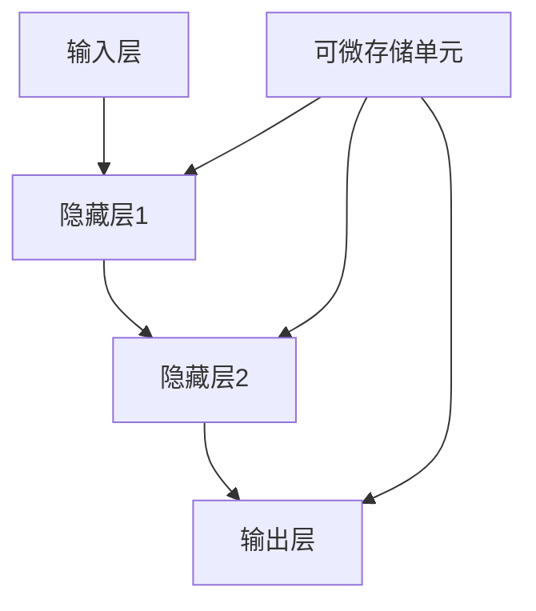

                 

### 文章标题：评测系统的可微分神经计算机应用

#### 关键词：评测系统、神经计算机、可微性、反向传播、算法应用

#### 摘要：
本文探讨了评测系统与可微分神经计算机的结合应用。通过详细阐述评测系统的基本概念和神经计算机的原理，深入分析了可微分神经计算机的基础、核心算法原理及其在评测系统中的应用。文章还通过项目实战和最佳实践提供了实用的指导，为读者展示了如何利用可微分神经计算机优化评测系统的性能和鲁棒性。

---

# 引言与基础

评测系统是自动化评估个体或群体表现的重要工具，广泛应用于教育、医疗、金融等多个领域。随着人工智能技术的发展，神经计算机凭借其强大的建模和预测能力，逐渐成为评测系统的重要支撑。可微分神经计算机（Differentiable Neural Computer，DNC）作为一种先进的神经计算机模型，通过引入可微性，使其在处理复杂任务时具有更高的灵活性和效率。

## 评测系统的基本概念

评测系统是一种用于量化评估个体或群体能力、表现或绩效的自动化系统。其主要功能包括：

1. **数据采集**：收集个体或群体的相关数据，如成绩、绩效指标等。
2. **数据预处理**：对采集到的数据进行清洗、标准化等处理，以消除噪声和异常值。
3. **评估模型**：利用统计模型、机器学习算法等对预处理后的数据进行评估，生成评估结果。
4. **结果输出**：将评估结果以可视化或报告的形式呈现给用户。

评测系统在各个领域的应用极为广泛，如教育领域的成绩评估、医疗领域的诊断评估、金融领域的信用评估等。

## 神经计算机的原理

神经计算机是一种模仿人脑神经网络的计算系统，具有高度并行、自适应和学习能力。其基本原理包括：

1. **神经元模型**：神经网络由大量神经元组成，每个神经元接收输入信号，通过加权求和和激活函数处理后产生输出。
2. **信息传递**：神经元之间通过突触连接进行信息传递，突触的权重表示神经元之间的关联强度。
3. **学习机制**：通过反向传播算法，根据输入数据和期望输出，不断调整神经元之间的权重，以达到学习目的。

神经计算机在图像识别、语音识别、自然语言处理等领域取得了显著成果，其灵活性和适应性使其在评测系统中具有广泛的应用前景。

## 可微分神经计算机基础

可微分神经计算机（DNC）是一种结合了神经计算机和可微性优势的新型计算模型。其核心思想是使神经计算机中的操作具备可微性，从而可以方便地应用梯度下降等优化算法。

### 定义

可微分神经计算机（DNC）是一种利用神经网络进行计算，并具备可微性的计算机系统。其基本结构包括输入层、隐藏层和输出层，以及一个可微的存储单元。

### 核心组件

1. **输入层**：接收外部输入信号，如评测系统的数据。
2. **隐藏层**：进行信号处理和特征提取，通过可微的操作生成中间结果。
3. **输出层**：产生最终输出，如评估结果。
4. **可微存储单元**：用于存储和处理中间结果，具备可微性，可以与神经网络的其他部分进行有效的信息交互。

### Mermaid流程图：可微分神经计算机架构



在这个架构中，输入层接收输入信号，通过隐藏层进行信息处理，最终输出层产生评估结果。同时，可微存储单元与隐藏层和输出层交互，为整个计算过程提供灵活性和效率。

### 核心算法原理讲解

可微分神经计算机的核心算法包括反向传播算法和梯度下降优化算法。以下是这些算法的详细解释：

#### 反向传播算法

反向传播算法是一种用于训练神经网络的优化算法。其基本思想是通过计算输出误差的梯度，反向传播到网络中的每个神经元，从而调整神经元之间的权重。

1. **前向传播**：将输入信号通过神经网络进行前向传播，产生输出结果。
2. **计算输出误差**：计算实际输出与期望输出之间的误差。
3. **后向传播**：将输出误差反向传播到网络中的每个神经元，计算每个神经元的梯度。
4. **权重更新**：利用梯度下降算法更新神经元之间的权重，以减少输出误差。

#### 伪代码：反向传播算法实现

```python
def backward_propagation(input_data, expected_output, network_weights):
    # 前向传播
    output = forward_propagation(input_data, network_weights)
    
    # 计算输出误差
    error = expected_output - output
    
    # 后向传播，计算每个神经元的梯度
    gradients = backward_propagation_step(error, network_weights)
    
    # 权重更新
    network_weights = update_weights(network_weights, gradients)
    
    return network_weights
```

#### 数学模型与公式

反向传播算法的核心在于计算每个神经元的梯度。以下是相关的数学模型和公式：

$$
\begin{aligned}
\frac{\partial E}{\partial w_{ij}} &= \frac{\partial E}{\partial z_j} \cdot \frac{\partial z_j}{\partial w_{ij}} \\
\frac{\partial E}{\partial z_j} &= \sigma'(z_j) \\
\frac{\partial z_j}{\partial w_{ij}} &= x_i
\end{aligned}
$$

其中，$E$ 表示输出误差，$w_{ij}$ 表示神经元 $j$ 与神经元 $i$ 之间的权重，$\sigma'$ 是激活函数的导数，$x_i$ 是输入信号。

#### 详细讲解与举例说明

以下是一个具体的反向传播算法的示例：

假设我们有一个包含两个输入、一个隐藏层和一个输出层的神经网络，其中激活函数为ReLU函数。

1. **前向传播**：

   - 输入信号：$x_1 = 1, x_2 = 0$
   - 隐藏层输出：$z_1 = max(0, x_1 * w_{11} + x_2 * w_{21}) = max(0, 1 * 0.5 + 0 * 0.3) = 0.5$
   - 输出层输出：$z_2 = max(0, z_1 * w_{12} + z_1 * w_{22}) = max(0, 0.5 * 0.6 + 0.5 * 0.4) = 0.6$
   - 实际输出：$y = z_2 = 0.6$
   - 期望输出：$y^* = 1$

2. **计算输出误差**：

   $$E = (y^* - y)^2 = (1 - 0.6)^2 = 0.16$$

3. **后向传播**：

   - 隐藏层梯度：$\frac{\partial E}{\partial z_2} = \sigma'(z_2) = \text{ReLU}'(0.6) = 0$
   - 输出层梯度：$\frac{\partial E}{\partial z_1} = \frac{\partial E}{\partial z_2} \cdot \frac{\partial z_2}{\partial z_1} = 0 \cdot 0.5 = 0$
   - 输入层梯度：$\frac{\partial E}{\partial x_1} = \frac{\partial E}{\partial z_2} \cdot \frac{\partial z_2}{\partial z_1} \cdot \frac{\partial z_1}{\partial x_1} = 0 \cdot 0.5 \cdot 0.5 = 0$

4. **权重更新**：

   - 输出层权重更新：$w_{12} = w_{12} - \alpha \cdot \frac{\partial E}{\partial z_2} \cdot z_1 = 0.6 - 0.01 \cdot 0 \cdot 0.5 = 0.6$
   - 输入层权重更新：$w_{11} = w_{11} - \alpha \cdot \frac{\partial E}{\partial z_1} \cdot x_1 = 0.5 - 0.01 \cdot 0 \cdot 1 = 0.5$

经过多次迭代后，神经网络的权重将逐渐调整，以达到期望的输出结果。

### 核心算法原理讲解总结

可微分神经计算机通过反向传播算法和梯度下降优化算法，实现了对复杂任务的建模和优化。反向传播算法的关键在于计算输出误差的梯度，从而调整神经网络的权重。这一过程需要通过多次迭代，逐步减少输出误差，提高模型的预测准确性。

---

在接下来的章节中，我们将进一步探讨可微分神经计算机在评测系统中的应用实例，并通过项目实战展示如何实现和优化评测系统的性能。敬请期待。

