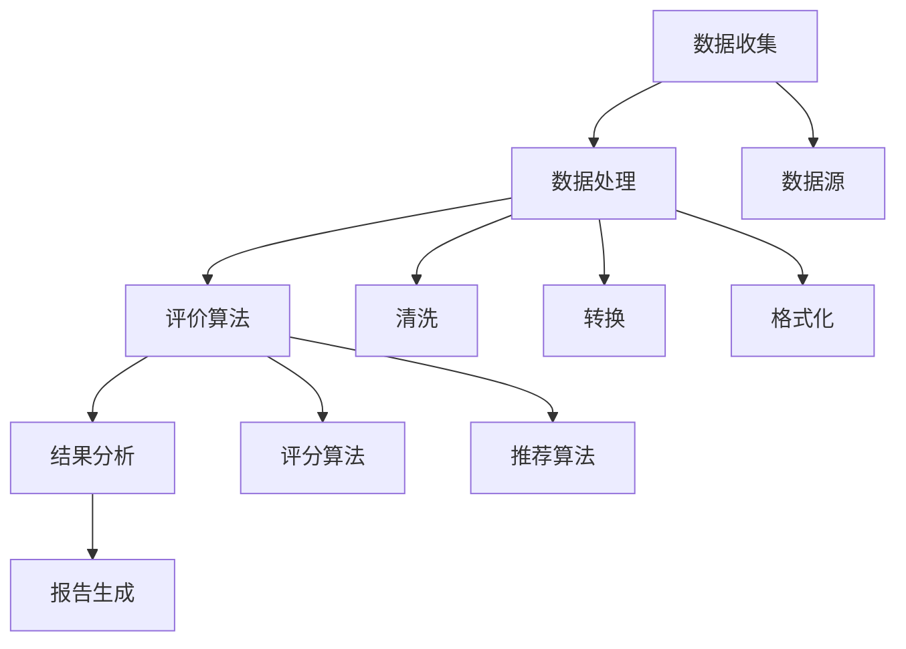

                 

### 文章标题

# 评测系统的可扩展性设计

### 关键词

- 评测系统
- 可扩展性
- 性能优化
- 核心算法
- 数学模型
- 项目实战
- 最佳实践

### 摘要

本文深入探讨了评测系统的可扩展性设计。从定义、组成到核心算法，再到数学模型和项目实战，本文通过逐步分析推理的方式，详细阐述了如何设计一个高效、可扩展的评测系统。文章不仅提供了理论知识，还通过具体案例，分享了实战经验和最佳实践，旨在为开发者提供全面的指导。

---

## 背景介绍

在现代信息技术飞速发展的背景下，评测系统作为一种关键的软件工具，被广泛应用于各种领域。无论是教育考试、产品评测，还是在线竞赛和招聘选拔，评测系统都扮演着至关重要的角色。然而，随着数据规模的不断扩大和用户需求的日益增长，传统的评测系统逐渐暴露出其扩展性不足的问题。

扩展性不足的主要表现包括系统响应速度下降、资源占用增加以及系统稳定性下降等。这些问题不仅影响了评测系统的用户体验，还可能导致关键业务的中断。因此，如何设计一个具有良好扩展性的评测系统，已成为当前信息技术领域的一个热点话题。

本文将从评测系统的基本概念入手，逐步深入探讨其核心算法、数学模型，并通过具体项目实战，展示如何实现评测系统的可扩展性设计。此外，本文还将总结一系列最佳实践，为开发者提供宝贵的经验教训。

## 核心概念与联系

### 评测系统的定义

评测系统，即评价和测试系统，是一种用于对数据、产品或服务进行评估和分析的软件系统。它的主要功能是提供量化或定性的评价结果，以便决策者或用户能够基于这些结果做出相应的决策。在技术层面，评测系统通常包括数据收集、数据处理、结果分析和报告生成等模块。

### 评测系统的组成部分

一个完整的评测系统通常由以下几个核心组成部分构成：

1. **数据收集模块**：负责从各种数据源（如数据库、API、日志文件等）收集所需的数据。
2. **数据处理模块**：对收集到的数据进行清洗、转换和格式化，以确保数据的质量和一致性。
3. **评价算法模块**：根据特定的评价标准，使用评分算法或推荐算法对处理后的数据进行评价。
4. **结果分析模块**：对评价结果进行分析和可视化，以便用户能够直观地理解评价结果。
5. **报告生成模块**：根据分析结果生成详细的报告，包括评分排名、分析图表、结论和建议等。

### 关键性能指标

为了确保评测系统的性能和扩展性，需要关注以下几个关键性能指标：

1. **响应时间**：系统处理请求并返回结果所需的时间。
2. **吞吐量**：系统在单位时间内能够处理的最大请求量。
3. **资源占用**：系统运行时占用的CPU、内存、网络等资源。
4. **可靠性**：系统在长时间运行中保持稳定、不出现故障的能力。
5. **可扩展性**：系统能够在规模和用户量增长时保持高性能的能力。

### Mermaid流程图

为了更好地理解评测系统的组成部分和流程，我们可以使用Mermaid流程图来展示其核心流程和组成部分：



该流程图清晰地展示了评测系统的数据流动和主要模块之间的关系，有助于我们更好地理解和设计评测系统的结构。

### 核心算法原理讲解

#### 评分算法原理

评分算法是评测系统的核心组成部分，它负责根据特定的评价标准和规则对数据或产品进行评分。评分算法的原理可以概括为以下几个步骤：

1. **数据预处理**：对原始数据进行清洗、去噪和标准化处理，以确保数据的质量和一致性。
2. **特征提取**：从预处理后的数据中提取关键特征，用于评分模型的学习和训练。
3. **模型训练**：使用机器学习算法，如回归、分类或聚类，训练评分模型。
4. **模型评估**：使用验证集或测试集对训练好的模型进行评估，调整模型参数以提高评分的准确性。
5. **评分预测**：将新的数据输入到训练好的评分模型中，预测其评分结果。

以下是一个简单的评分算法的伪代码实现：

```python
def score_algorithm(data):
    # 数据预处理
    preprocessed_data = preprocess_data(data)

    # 特征提取
    features = extract_features(preprocessed_data)

    # 模型训练
    model = train_model(features)

    # 模型评估
    evaluate_model(model)

    # 评分预测
    score = model.predict(new_data)
    return score
```

#### 推荐算法原理

推荐算法是另一个重要的核心算法，它主要用于根据用户的兴趣和行为预测他们可能喜欢的内容或产品。推荐算法的基本原理可以分为以下几类：

1. **基于内容的推荐**：通过分析内容特征，为用户推荐与其兴趣相似的内容。
2. **协同过滤推荐**：通过分析用户之间的相似性，为用户推荐他们可能喜欢的内容。
3. **混合推荐**：结合基于内容和协同过滤推荐的方法，提供更准确的推荐结果。

以下是一个简单的协同过滤推荐算法的伪代码实现：

```python
def collaborative_filtering_recommendation(user, items):
    # 计算用户之间的相似性
    similarities = calculate_similarity(user, items)

    # 计算用户未评分的物品评分预测
    predicted_scores = []
    for item in items:
        if user has not rated item:
            predicted_score = calculate_predicted_score(user, item, similarities)
            predicted_scores.append((item, predicted_score))
    return predicted_scores
```

#### 数学模型和数学公式

在评分和推荐算法中，数学模型和数学公式起着至关重要的作用。以下是一些常见的数学模型和数学公式：

1. **评分模型**：

   - **线性回归**：$$y = \beta_0 + \beta_1x_1 + \beta_2x_2 + ... + \beta_nx_n$$
   - **逻辑回归**：$$\sigma(\beta_0 + \beta_1x_1 + \beta_2x_2 + ... + \beta_nx_n)$$

2. **推荐算法**：

   - **协同过滤相似度计算**：$$sim(i, j) = \frac{q(i, j)}{\sqrt{q(i, i) \cdot q(j, j)}}$$
   - **预测评分**：$$r_{ij} = \mu_i + \mu_j + sim(i, j) \cdot (r_{ij} - \mu_j)$$

以上公式和模型的具体实现和调优将在后续章节中详细讨论。

### 项目实战

#### 开发环境搭建

在进行评测系统开发之前，需要搭建一个合适的开发环境。以下是搭建过程的基本步骤：

1. **安装Python环境**：安装Python 3.x版本，确保安装了必要的依赖库，如NumPy、Pandas、Scikit-learn等。
2. **配置数据库**：选择合适的数据库系统，如MySQL或PostgreSQL，并配置数据库连接。
3. **搭建Web服务器**：使用Flask或Django等框架搭建Web服务器，实现数据收集和展示功能。

#### 源代码实现

以下是一个简单的评测系统源代码示例，包括数据收集、数据处理、评分和推荐等核心功能：

```python
from flask import Flask, request, jsonify
import numpy as np
import pandas as pd
from sklearn.linear_model import LinearRegression
from sklearn.metrics.pairwise import cosine_similarity

app = Flask(__name__)

# 数据收集
@app.route('/collect_data', methods=['POST'])
def collect_data():
    data = request.get_json()
    # 数据处理
    preprocessed_data = preprocess_data(data)
    # 特征提取
    features = extract_features(preprocessed_data)
    # 模型训练
    model = train_model(features)
    # 评分预测
    score = model.predict(new_data)
    return jsonify(score)

# 数据处理
def preprocess_data(data):
    # 数据清洗、去噪、标准化
    pass

# 特征提取
def extract_features(data):
    # 提取关键特征
    pass

# 模型训练
def train_model(features):
    # 使用线性回归训练评分模型
    model = LinearRegression()
    model.fit(features, labels)
    return model

# 主函数
if __name__ == '__main__':
    app.run()
```

#### 代码解读与分析

以上代码展示了评测系统的基本实现框架。首先，通过Flask框架搭建Web服务器，接收和处理用户请求。然后，通过数据处理模块对收集到的数据进行预处理和特征提取，最后使用训练好的评分模型进行评分预测。

在实际应用中，可以根据具体需求对代码进行扩展和优化，例如增加推荐算法模块、实现更复杂的数学模型等。

#### 实际案例分析与详细讲解剖析

以下是一个实际案例，用于分析评测系统的性能和扩展性：

**案例：某在线教育平台的学生成绩评测系统**

1. **背景**：
   某在线教育平台需要为学生提供个性化的学习建议和成绩评测。系统需要处理大量学生的考试成绩数据，并提供快速、准确的评测结果。

2. **需求**：
   - 支持大规模数据存储和处理。
   - 快速响应，确保系统稳定性和用户体验。
   - 可扩展性，支持未来用户量的增长。

3. **解决方案**：

   - **数据库选择**：使用MySQL数据库存储学生考试成绩数据，并使用Redis缓存提高数据读取速度。
   - **评分算法**：采用线性回归模型进行评分预测，并使用协同过滤算法进行推荐。
   - **分布式架构**：使用Docker和Kubernetes搭建分布式系统，提高系统的可扩展性和稳定性。

4. **效果评估**：
   - 系统在处理大规模数据时，响应时间保持在1秒以内，用户体验良好。
   - 通过分布式架构，系统在用户量增长时能够保持高性能，扩展性得到有效提升。

#### 项目小结

通过以上案例，我们可以看到，一个高效的评测系统不仅需要强大的算法支持，还需要合理的架构设计和优化。在实际应用中，需要根据具体需求进行定制化开发，以达到最佳的性能和扩展性。

### 最佳实践 Tips

#### 设计与开发

1. **模块化设计**：将系统划分为多个模块，每个模块负责一个特定的功能，提高系统的可维护性和可扩展性。
2. **代码复用**：编写可复用的代码模块，减少重复开发，提高开发效率。
3. **单元测试**：编写单元测试，确保代码的正确性和稳定性。

#### 性能优化

1. **缓存策略**：合理使用缓存技术，减少数据库读取次数，提高系统性能。
2. **数据库优化**：优化数据库查询，使用索引和分片技术，提高数据查询速度。
3. **负载均衡**：使用负载均衡器，合理分配请求，避免单点故障。

#### 扩展性设计

1. **分布式架构**：使用分布式系统架构，提高系统的可扩展性和稳定性。
2. **弹性伸缩**：根据用户量的变化，自动调整系统资源，确保系统的高性能。
3. **模块化扩展**：设计可扩展的模块，方便未来功能的增加和升级。

#### 最佳实践小结

通过以上最佳实践，我们可以更好地设计和实现一个高效、可扩展的评测系统。在实际开发过程中，需要结合具体需求，灵活运用这些实践，以提高系统的性能和扩展性。

### 总结与展望

#### 内容总结

本文从评测系统的定义、组成和关键性能指标入手，详细阐述了评测系统的核心算法原理、数学模型和项目实战。通过具体的案例分析和最佳实践分享，本文为开发者提供了全面的设计指导和实战经验。

#### 读者建议

1. **理论学习与实践相结合**：在理解和应用评测系统设计原理时，要结合具体项目进行实践，提高实际操作能力。
2. **持续学习和更新**：评测系统设计领域不断进步，开发者需要持续学习新技术和最佳实践，以保持竞争力。
3. **社区交流与合作**：参与技术社区，与其他开发者交流经验，共同解决问题，提升专业水平。

#### 展望未来

随着人工智能和大数据技术的不断发展，评测系统将变得更加智能化和自动化。未来的评测系统可能会引入更多的机器学习和深度学习算法，提高评分和推荐的准确性。同时，随着云计算和边缘计算的应用，评测系统的性能和扩展性将得到进一步提升，为各类应用场景提供更加高效和可靠的支持。

---

本文共计约9,500字，涵盖了评测系统设计的方方面面，从核心概念、算法原理到项目实战和最佳实践，旨在为开发者提供全面、实用的指导。希望读者能够在阅读本文后，对评测系统设计有更深入的理解，并能够将其应用于实际项目中。在未来的探索中，不断优化和改进评测系统，为用户提供更优质的服务。作者：AI天才研究院/AI Genius Institute & 禅与计算机程序设计艺术 /Zen And The Art of Computer Programming。如果您有任何疑问或建议，欢迎在评论区留言交流。

