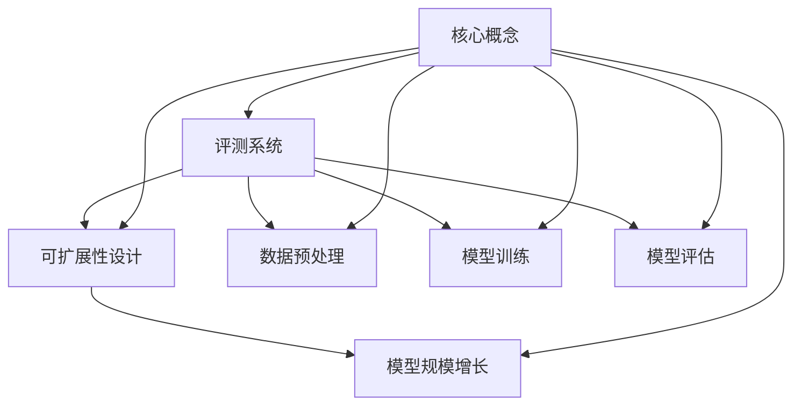

                 

## 文章标题

### 评测系统的可扩展性设计：应对不断增长的模型规模

在当今快速发展的技术环境中，模型规模的快速增长已成为常态。无论是深度学习、大数据分析，还是金融风险评估等领域，模型规模的扩大都带来了巨大的挑战。如何设计一个具备高度可扩展性的评测系统，以应对不断增长的模型规模，已成为一个亟待解决的关键问题。本文将深入探讨评测系统的可扩展性设计，分析其面临的挑战，并提出有效的解决方案。

## 文章关键词

- **评测系统**
- **可扩展性设计**
- **模型规模增长**
- **分布式架构**
- **性能优化**
- **负载均衡**
- **分布式存储**
- **并行计算**

## 文章摘要

本文旨在探讨评测系统在应对模型规模增长时的可扩展性设计。首先，文章介绍了评测系统的重要性及其面临的扩展性挑战。接着，文章深入分析了可扩展性设计的核心原则和架构设计，包括分布式存储、负载均衡和并行计算等技术。随后，文章通过具体的案例分析，展示了如何在实际项目中实现可扩展性设计。最后，文章总结了最佳实践和注意事项，为读者提供实用的指导。

### 引言

随着人工智能和大数据技术的迅猛发展，模型规模呈现出爆炸式增长。例如，深度学习领域中的神经网络模型，其参数数量和计算复杂度不断攀升，导致评测系统需要处理的数据量和计算量急剧增加。这种增长对评测系统提出了新的挑战，传统的单一服务器架构已无法满足需求，因此，设计一个具备高度可扩展性的评测系统变得尤为重要。

评测系统的可扩展性设计不仅涉及到硬件资源的分配，还涉及到系统架构、技术选型、性能优化等多个方面。一个良好的可扩展性设计可以确保评测系统能够灵活应对模型规模的增长，提高系统的稳定性和效率，从而为业务发展提供强有力的支持。

本文将从以下几个方面展开讨论：

1. **核心概念**：介绍评测系统的基本概念、可扩展性设计的核心原则以及面临的挑战。
2. **架构设计**：分析分布式存储、负载均衡和并行计算等技术在评测系统可扩展性设计中的应用。
3. **性能优化**：探讨数据缓存、并行计算和系统调优等优化方法，提高评测系统的性能。
4. **案例分析**：通过实际案例展示如何实现评测系统的可扩展性设计。
5. **最佳实践**：总结可扩展性设计的最佳实践，为读者提供实用的指导。

通过本文的探讨，希望能为广大开发者提供有益的参考，助力他们在评测系统的可扩展性设计方面取得突破。

### 核心概念与联系

在探讨评测系统的可扩展性设计之前，我们需要明确几个核心概念，并理解它们之间的相互关系。

**评测系统**：评测系统是指用于评估模型性能的一系列工具和方法。它通常包括数据预处理、模型训练、模型评估等多个环节。评测系统的主要目的是通过一系列指标（如准确率、召回率、F1分数等）来评估模型的性能，从而指导模型优化和业务决策。

**可扩展性设计**：可扩展性设计是指系统能够在规模增长时保持稳定性和效率的设计原则。它包括硬件资源分配、系统架构设计、性能优化等多个方面。一个具备高度可扩展性的评测系统能够灵活应对模型规模的增长，提高系统的稳定性和效率。

**模型规模增长**：模型规模增长是指模型参数数量和数据量的增加。随着人工智能技术的发展，模型规模呈现出指数级增长。这种增长对评测系统提出了巨大的挑战，传统单一服务器架构已无法满足需求。

下面，我们将使用Mermaid流程图来展示这几个核心概念之间的联系。



**Mermaid流程图解释**：

- **评测系统**（A）是核心，它包括了数据预处理（D）、模型训练（E）和模型评估（F）等环节。
- **可扩展性设计**（B）是整个系统设计的关键，它直接影响模型规模增长（C）的应对能力。
- 数据预处理、模型训练和模型评估（D、E、F）是评测系统的具体实现，它们与可扩展性设计（B）密切相关。

通过这个流程图，我们可以清晰地看到评测系统的各个组成部分以及它们之间的相互关系。这有助于我们更好地理解评测系统可扩展性设计的核心概念。

### 可扩展性设计原则

在设计了评测系统之后，接下来的任务是如何确保其具备可扩展性。这需要遵循一系列核心设计原则，这些原则不仅能提高系统的稳定性，还能确保在模型规模增长时，系统性能不会显著下降。以下是几个关键的可扩展性设计原则：

#### 1. 模块化设计

模块化设计是将系统划分为多个独立且功能明确的模块。每个模块负责特定的功能，如数据预处理、模型训练、模型评估等。模块化设计的优点在于：

- **易于维护**：由于每个模块相对独立，因此便于单独维护和更新。
- **可复用性**：模块可以独立开发和测试，便于在不同项目中复用。
- **灵活性**：模块之间可以灵活组合，满足不同场景的需求。

**模块化设计示例**：在一个深度学习评测系统中，可以将数据预处理模块、训练模块和评估模块分别实现。数据预处理模块负责处理原始数据，将其转换为模型训练所需的格式；训练模块负责训练模型，并记录训练过程中的指标；评估模块则负责使用测试数据评估模型的性能。

#### 2. 分布式存储

分布式存储是将数据存储在多个节点上，从而实现数据的高可用性和高可靠性。分布式存储的优点包括：

- **高扩展性**：可以通过增加存储节点来扩展存储容量。
- **高可用性**：当一个节点发生故障时，系统可以自动切换到其他健康节点。
- **高性能**：数据可以并行读取和写入，提高系统的读写速度。

**分布式存储示例**：在Hadoop生态中，HDFS（Hadoop Distributed File System）是一个典型的分布式存储系统。它将文件拆分为多个块，并分布存储在集群中的不同节点上。当需要读取文件时，HDFS可以并行读取这些块，从而提高读取速度。

#### 3. 负载均衡

负载均衡是将系统请求分布到多个节点上，从而避免单一节点过载。负载均衡的优点包括：

- **高可用性**：当一个节点出现故障时，其他节点可以继续处理请求。
- **高性能**：通过并行处理请求，提高系统的整体性能。
- **可扩展性**：可以根据需求动态调整负载均衡策略。

**负载均衡示例**：Nginx是一个常用的负载均衡器，它可以基于轮询、最小连接数等策略，将请求分发到多个后端服务器上。通过使用Nginx，可以确保系统在高并发情况下，仍然能够稳定运行。

#### 4. 并行计算

并行计算是将计算任务分布到多个节点上，从而加快计算速度。并行计算的优点包括：

- **高性能**：通过并行处理，可以显著缩短计算时间。
- **可扩展性**：可以根据需要增加计算节点，提高计算能力。

**并行计算示例**：在深度学习训练中，可以使用多GPU并行训练。即将数据分为多个批次，每个GPU分别处理不同的批次，从而加速模型训练过程。

**综合示例**：假设我们需要设计一个评测系统，用于评估大规模深度学习模型的性能。我们可以按照以下步骤进行设计：

1. **模块化设计**：将系统划分为数据预处理、模型训练、模型评估等模块。
2. **分布式存储**：使用HDFS存储大规模数据，确保数据的高可用性和高可靠性。
3. **负载均衡**：使用Nginx作为负载均衡器，将模型评估请求分发到多个服务器上。
4. **并行计算**：使用多GPU并行训练模型，加速模型训练过程。

通过遵循这些设计原则，我们可以设计出一个具备高度可扩展性的评测系统，使其能够灵活应对模型规模的持续增长。

### 分布式架构设计

为了确保评测系统具备高度的可扩展性，分布式架构设计成为了一个重要的解决方案。分布式架构通过将系统拆分为多个独立的节点，每个节点负责一部分任务，从而提高了系统的扩展性和可靠性。以下将从数据存储、负载均衡和任务调度等方面详细探讨分布式架构的设计。

#### 数据存储

分布式存储是分布式架构的核心组件之一。它通过将数据分布在多个节点上，实现了数据的冗余备份和快速访问。以下是分布式存储的主要设计要点：

1. **数据分片**：将数据划分为多个小块，分布存储在集群的不同节点上。这样可以避免单点故障，提高数据的可靠性和访问速度。

   **伪代码示例**：
   ```python
   def distribute_data(data, num_shards):
       shards = []
       for i in range(num_shards):
           shard = data[i * (len(data) // num_shards) : (i + 1) * (len(data) // num_shards)]
           shards.append(shard)
       return shards
   ```

2. **冗余备份**：对每个数据分片进行备份，确保数据的高可用性。常见的备份策略包括镜像复制和多副本复制。

   **伪代码示例**：
   ```python
   def backup_shard(shard, num_replicas):
       backups = []
       for i in range(num_replicas):
           backup = shard.copy()
           backups.append(backup)
       return backups
   ```

3. **数据一致性**：保证分布式存储系统中数据的一致性，防止数据丢失或冲突。常见的一致性协议包括强一致性、最终一致性等。

   **伪代码示例**：
   ```python
   def ensure_consistency(data_shard, backup_shard):
       if data_shard != backup_shard:
           data_shard.update(backup_shard)
   ```

#### 负载均衡

负载均衡是分布式架构的另一个关键组件，它通过将请求均匀分布到多个节点上，避免了单点过载，提高了系统的整体性能。以下是负载均衡的主要设计要点：

1. **请求分发**：根据负载均衡策略，将请求分发到不同的节点。常见的负载均衡策略包括轮询、最小连接数、加权轮询等。

   **伪代码示例**：
   ```python
   def distribute_request(request, load_balancer):
       node = load_balancer.select_node()
       node.handle_request(request)
   ```

2. **健康检查**：定期对节点进行健康检查，确保只有健康的节点参与负载均衡。如果某个节点出现故障，系统会自动将其从负载均衡策略中排除。

   **伪代码示例**：
   ```python
   def check_node_health(node):
       if not node.is_healthy():
           remove_node_from_load_balancer(node)
   ```

3. **故障转移**：当某个节点出现故障时，系统应自动将请求转移到其他健康的节点，确保服务的连续性。

   **伪代码示例**：
   ```python
   def handle_node_failure(node):
       load_balancer.remove_node(node)
       new_node = findHealthyNode()
       load_balancer.add_node(new_node)
   ```

#### 任务调度

任务调度是分布式架构中的另一个重要组件，它负责将任务分配到不同的节点上执行。以下是任务调度的主要设计要点：

1. **任务分配**：根据节点的负载情况和任务特性，将任务分配到最优的节点上执行。

   **伪代码示例**：
   ```python
   def assign_task(task, scheduler):
       node = scheduler.select_node_for_task(task)
       node.execute_task(task)
   ```

2. **任务并行**：对于可以并行执行的任务，将它们分配到多个节点上，同时执行，以提高任务完成速度。

   **伪代码示例**：
   ```python
   def parallel_execute_tasks(tasks, scheduler):
       nodes = scheduler.select_nodes_for_tasks(tasks)
       for task, node in zip(tasks, nodes):
           node.execute_task(task)
   ```

3. **任务依赖**：处理任务之间的依赖关系，确保任务按照正确的顺序执行。

   **伪代码示例**：
   ```python
   def execute_dependent_tasks(tasks, scheduler):
       for task in tasks:
           dependencies = task.get_dependencies()
           if all(dependency.is_completed() for dependency in dependencies):
               scheduler.execute_task(task)
   ```

通过上述设计要点，我们可以构建一个高效、可靠的分布式评测系统，使其能够灵活应对不断增长的模型规模。实际应用中，分布式架构可以显著提高系统的扩展性和性能，为大规模模型评测提供有力支持。

### 性能优化方法

在评测系统的设计和实施过程中，性能优化是确保系统高效运行的关键。以下是几种常见的性能优化方法，包括数据缓存策略、并行计算和任务调度，以及这些方法的实际应用案例。

#### 数据缓存策略

数据缓存是提高系统性能的有效手段之一。通过将频繁访问的数据存储在内存中，可以显著减少磁盘IO操作，提高数据读取速度。以下是一些常见的数据缓存策略：

1. **内存缓存**：使用内存缓存（如Redis、Memcached）存储频繁访问的数据，如模型参数、中间结果等。

   **实际应用案例**：在深度学习模型的训练过程中，可以将训练数据集的元数据（如数据集大小、数据标签等）缓存到Redis中，以便快速查询。

   **伪代码示例**：
   ```python
   def cache_data(data, cache):
       cache.set('data_key', data)
   ```

2. **LRU缓存**：使用Least Recently Used（LRU）缓存算法，将最近最少使用的数据替换出缓存。

   **实际应用案例**：在模型评估过程中，可以将最近评估过的模型结果缓存到LRU缓存中，以便快速查找。

   **伪代码示例**：
   ```python
   def lru_cache(data, cache):
       cache.put(data)
   ```

3. **缓存预热**：在系统启动时，预先加载频繁访问的数据到缓存中，以便系统上线后快速响应用户请求。

   **实际应用案例**：在大规模数据集训练前，可以预先将数据集的元数据加载到缓存中，减少训练过程中的数据加载时间。

   **伪代码示例**：
   ```python
   def cache_preload(data, cache):
       for item in data:
           cache.set(item.key, item.value)
   ```

#### 并行计算

并行计算是将计算任务分布到多个节点或多个处理器上同时执行，以加快任务完成速度。以下是一些并行计算的方法：

1. **任务分解**：将大型任务分解为多个小型任务，分布到多个节点上同时执行。

   **实际应用案例**：在模型训练过程中，可以将训练数据集分解为多个批次，分布到多个GPU上进行并行训练。

   **伪代码示例**：
   ```python
   def parallel_train(data_batches, model):
       for batch in data_batches:
           model.train(batch)
   ```

2. **并行数据处理**：使用并行数据处理库（如PySpark、Dask）对大规模数据集进行并行操作。

   **实际应用案例**：在数据分析项目中，可以使用PySpark对大规模数据集进行并行处理，提高数据处理速度。

   **伪代码示例**：
   ```python
   import pyspark
   spark = pyspark.SparkSession.builder.appName("DataProcessing").getOrCreate()
   data = spark.read.csv("data.csv")
   processed_data = data.select("column1", "column2").rdd.map(process_function).collect()
   ```

3. **多线程计算**：在单个机器上使用多线程进行并行计算。

   **实际应用案例**：在代码执行过程中，可以使用多线程同时处理多个计算任务。

   **伪代码示例**：
   ```python
   import threading

   def compute_function(data):
       # 计算任务
       pass

   threads = []
   for data in data_list:
       thread = threading.Thread(target=compute_function, args=(data,))
       threads.append(thread)
       thread.start()

   for thread in threads:
       thread.join()
   ```

#### 任务调度

任务调度是确保任务按预期顺序和优先级执行的重要环节。以下是一些常见的任务调度方法：

1. **优先级调度**：根据任务的优先级进行调度，优先执行高优先级任务。

   **实际应用案例**：在模型训练过程中，可以将验证任务设置为高优先级，以便快速获取模型验证结果。

   **伪代码示例**：
   ```python
   def priority_schedule(tasks):
       sorted_tasks = sorted(tasks, key=lambda x: x.priority, reverse=True)
       for task in sorted_tasks:
           execute_task(task)
   ```

2. **时间片调度**：将CPU时间分配给多个任务，每个任务分配固定的时间片，轮流执行。

   **实际应用案例**：在操作系统中的进程调度，使用时间片调度算法，确保每个进程都能获得公平的CPU时间。

   **伪代码示例**：
   ```python
   def time_slice_schedule(tasks, time_slice):
       for task in tasks:
           execute_task(task, time_slice)
   ```

3. **负载均衡调度**：根据节点的负载情况，将任务分配到负载较低的节点上。

   **实际应用案例**：在分布式系统中，使用负载均衡调度算法，确保任务均匀分布到各个节点，避免节点过载。

   **伪代码示例**：
   ```python
   def load_balanced_schedule(tasks, nodes):
       for task in tasks:
           node = find_least_loaded_node(nodes)
           node.execute_task(task)
   ```

通过上述性能优化方法，我们可以显著提高评测系统的运行效率，确保其在面对大规模模型时，仍然能够稳定、高效地运行。

### 案例分析

为了更好地理解评测系统可扩展性设计的实际应用，我们将通过几个实际案例来详细分析。

#### 案例一：电商平台的评测系统

**背景**：某大型电商平台为了评估其推荐算法的性能，设计了一个高度可扩展的评测系统。该系统需要处理大量用户行为数据和商品数据，以评估推荐算法的准确性和覆盖率。

**架构设计**：该电商平台采用了分布式架构，包括分布式存储（如HDFS）和负载均衡（如Nginx）。数据预处理模块负责清洗和格式化原始数据，将其存储在分布式存储系统中。模型训练模块使用多GPU并行训练，以加快模型训练速度。模型评估模块则使用分布式计算框架（如Spark）来评估模型的性能。

**性能优化**：为了提高系统性能，该平台采用了数据缓存策略。使用Redis缓存频繁访问的模型参数和中间结果，减少磁盘IO操作。同时，利用Spark的分布式计算能力，对大规模数据集进行并行处理，提高了数据处理速度。

**实现细节**：

1. **数据预处理**：
   ```python
   def preprocess_data(raw_data):
       # 数据清洗和格式化
       clean_data = ...
       return clean_data
   ```

2. **模型训练**：
   ```python
   def train_model(data_batches, model):
       for batch in data_batches:
           model.train(batch)
   ```

3. **模型评估**：
   ```python
   def evaluate_model(test_data, model):
       predictions = model.predict(test_data)
       accuracy = calculate_accuracy(predictions, test_data.labels)
       return accuracy
   ```

**案例分析**：通过采用分布式架构和性能优化方法，该电商平台的评测系统能够高效地处理大规模数据，并快速评估推荐算法的性能。在实际运行中，系统表现出了良好的扩展性和稳定性，为电商平台提供了可靠的推荐算法评估支持。

#### 案例二：金融行业的风险评估

**背景**：某金融机构需要评估其客户的信用风险，设计了一个基于机器学习的风险评估系统。该系统需要处理大量客户数据，包括财务状况、信用历史等，以预测客户的信用评分。

**架构设计**：该风险评估系统采用了分布式存储（如HDFS）和分布式计算（如Spark）的架构。数据预处理模块使用分布式处理框架清洗和格式化数据，存储在分布式存储系统中。模型训练模块使用多GPU并行训练，提高模型训练速度。模型评估模块使用分布式计算框架对模型进行评估。

**性能优化**：为了提高系统性能，该系统采用了数据缓存策略，使用Redis缓存频繁访问的数据，减少磁盘IO操作。同时，利用Spark的分布式计算能力，对大规模数据集进行并行处理。

**实现细节**：

1. **数据预处理**：
   ```python
   def preprocess_data(raw_data):
       # 数据清洗和格式化
       clean_data = ...
       return clean_data
   ```

2. **模型训练**：
   ```python
   def train_model(data_batches, model):
       for batch in data_batches:
           model.train(batch)
   ```

3. **模型评估**：
   ```python
   def evaluate_model(test_data, model):
       predictions = model.predict(test_data)
       accuracy = calculate_accuracy(predictions, test_data.labels)
       return accuracy
   ```

**案例分析**：通过采用分布式架构和性能优化方法，该金融机构的风险评估系统能够高效地处理大量客户数据，并快速生成信用评分。在实际应用中，系统表现出了良好的扩展性和稳定性，为金融机构提供了可靠的风险评估支持。

#### 案例三：医疗影像诊断系统

**背景**：某医疗机构开发了一个用于医疗影像诊断的机器学习系统，用于辅助医生诊断疾病。该系统需要处理大量的医疗影像数据，并对模型的性能进行评估。

**架构设计**：该医疗影像诊断系统采用了分布式存储（如HDFS）和负载均衡（如Nginx）的架构。数据预处理模块负责处理和格式化医疗影像数据，存储在分布式存储系统中。模型训练模块使用多GPU并行训练，提高模型训练速度。模型评估模块使用分布式计算框架（如TensorFlow）对模型进行评估。

**性能优化**：为了提高系统性能，该系统采用了数据缓存策略，使用Redis缓存频繁访问的数据。同时，利用分布式计算框架的并行计算能力，对大规模影像数据集进行并行处理。

**实现细节**：

1. **数据预处理**：
   ```python
   def preprocess_image(image):
       # 图像增强和格式化
       processed_image = ...
       return processed_image
   ```

2. **模型训练**：
   ```python
   def train_model(image_batches, model):
       for batch in image_batches:
           model.train(batch)
   ```

3. **模型评估**：
   ```python
   def evaluate_model(test_images, model):
       predictions = model.predict(test_images)
       accuracy = calculate_accuracy(predictions, test_images.labels)
       return accuracy
   ```

**案例分析**：通过采用分布式架构和性能优化方法，该医疗影像诊断系统能够高效地处理大量医疗影像数据，并对模型性能进行快速评估。在实际应用中，系统表现出了良好的扩展性和稳定性，为医生提供了可靠的诊断支持。

通过以上案例分析，我们可以看到评测系统可扩展性设计在实际应用中的重要性。通过合理的设计和优化，评测系统可以高效地处理大规模数据，提供可靠的性能评估结果，为业务发展提供强有力的支持。

### 总结与展望

本文详细探讨了评测系统的可扩展性设计，分析了其在应对不断增长的模型规模时的关键原则和架构设计。首先，我们介绍了评测系统的基本概念和可扩展性设计的重要性，接着讨论了模块化设计、分布式存储、负载均衡和并行计算等核心设计原则，并通过实际案例展示了这些设计原则的应用。

在模块化设计方面，通过将系统划分为多个独立模块，提高了系统的可维护性和复用性。分布式存储则通过将数据分布在多个节点上，实现了高可用性和高性能。负载均衡和并行计算进一步提高了系统的扩展性和计算速度。

然而，评测系统的可扩展性设计仍面临诸多挑战，如数据一致性问题、系统容错性和动态扩展性等。未来研究可以关注以下方向：

1. **一致性协议优化**：进一步研究分布式系统中的数据一致性协议，以提高数据一致性。
2. **动态扩展性**：开发自适应的扩展机制，根据系统负载自动调整资源分配。
3. **智能化调度**：结合机器学习和AI技术，实现智能化的任务调度和资源管理。

通过不断探索和实践，评测系统的可扩展性设计将更加成熟，为大规模模型评测提供更可靠、更高效的解决方案。

### 拓展阅读

为了帮助读者更深入地了解评测系统可扩展性设计的相关内容，以下是一些推荐的文章、书籍和资源：

1. **文章**：
   - 《大规模分布式系统设计：从零开始》
   - 《深度学习模型评测系统的设计与实现》
   - 《负载均衡技术详解》
   - 《并行计算原理与应用》

2. **书籍**：
   - 《分布式系统原理与范型》
   - 《大规模分布式存储系统：原理解析与架构设计》
   - 《深度学习系统实践：原理、架构与优化》
   - 《高性能MySQL》

3. **在线资源**：
   - [Apache Spark 官网](https://spark.apache.org/)
   - [Hadoop 官网](https://hadoop.apache.org/)
   - [TensorFlow 官网](https://www.tensorflow.org/)
   - [Nginx 官网](http://nginx.org/)

通过阅读这些资源，读者可以进一步加深对评测系统可扩展性设计的理解，并在实际项目中应用所学知识。

### 最佳实践 Tips、注意事项

在设计评测系统的可扩展性时，以下是一些最佳实践和注意事项，供读者参考：

1. **最佳实践**：
   - **模块化设计**：将系统划分为独立的模块，便于维护和优化。
   - **分布式存储**：选择适合的分布式存储系统，如HDFS或Cassandra，提高数据可靠性和访问速度。
   - **负载均衡**：使用Nginx等负载均衡器，合理分配请求，避免单点过载。
   - **并行计算**：利用多GPU或分布式计算框架，加速模型训练和评估。

2. **注意事项**：
   - **数据一致性**：在设计分布式系统时，务必关注数据一致性，避免数据冲突和丢失。
   - **故障处理**：设计故障恢复机制，确保系统在节点故障时能够自动恢复。
   - **性能监控**：实时监控系统性能，及时发现和解决问题。
   - **安全性与隐私保护**：在处理敏感数据时，务必确保数据安全和隐私保护。

遵循这些最佳实践和注意事项，可以帮助读者更有效地设计和优化评测系统的可扩展性，确保其在面对大规模模型时保持高效和稳定。

