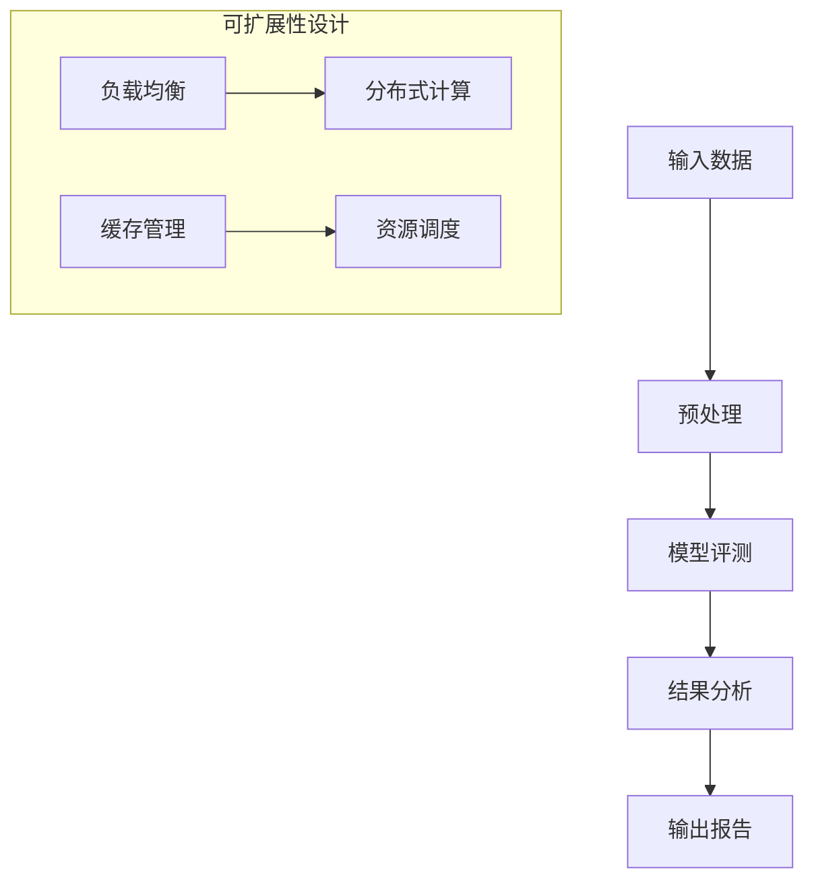

                 

### 文章标题

### 《评测系统的可扩展性：应对不同类型的LLM》

随着大型语言模型（LLM）的不断发展，如何有效评测这些模型的性能和可扩展性已成为人工智能领域的一个关键问题。本文将深入探讨评测系统的可扩展性，特别是如何针对不同类型的LLM进行评测。我们将通过逐步分析，提供清晰的技术语言和详细的解决方案，以帮助读者更好地理解和应用这一重要概念。

### 文章关键词

- 可扩展性
- 评测系统
- 大型语言模型（LLM）
- 性能评测
- 架构设计
- 数学模型

### 文章摘要

本文将首先介绍评测系统的基本概念和重要性，接着深入探讨可扩展性的原理和架构设计。随后，我们将具体分析不同类型LLM的特点和评测方法，并介绍一些主流的评测工具和资源。通过实际项目案例，我们将展示如何搭建评测系统，并对其进行详细解读。最后，本文还将提供一些最佳实践和注意事项，以帮助读者在实际应用中取得更好的效果。

### 引言与概述

#### 1.1 书籍背景与目的

在当今人工智能领域，大型语言模型（LLM）已经成为自然语言处理（NLP）的核心技术之一。LLM在机器翻译、文本生成、问答系统等领域展现出了卓越的性能，但其复杂的计算需求和多样化的应用场景也对评测系统提出了更高的要求。因此，如何设计和实现一个可扩展的评测系统，成为了当前研究的热点之一。

本文旨在为读者提供一个系统性的指南，帮助理解和应用评测系统的可扩展性。我们将通过详细的分析和案例讲解，逐步展示如何构建一个高效的评测系统，以及如何针对不同类型的LLM进行性能评测。

#### 1.2 评测系统的可扩展性核心概念

评测系统的可扩展性主要涉及以下几个方面：

- **性能评测**：通过一系列的评测指标，如准确率、召回率、F1分数等，评估模型的性能。
- **可扩展性设计**：确保系统在处理大规模数据和复杂场景时，仍能保持高效和稳定的性能。
- **模块化架构**：通过模块化的设计，使系统能够灵活扩展，适应不同类型的LLM评测需求。
- **资源管理**：优化资源的分配和使用，确保评测过程的高效运行。

#### 1.3 可扩展性架构的Mermaid流程图

以下是一个简单的Mermaid流程图，用于描述评测系统的基本架构：



该流程图展示了评测系统的基本工作流程，并强调了可扩展性设计的重要性。在实际应用中，根据具体的评测需求，可以进一步扩展和完善这一架构。

### 可扩展性原理与架构

#### 2.1 可扩展性原理讲解

可扩展性（Scalability）是指系统在资源增加时，性能和吞吐量能够相应提升的能力。对于评测系统而言，可扩展性主要表现在以下几个方面：

- **计算能力扩展**：随着LLM模型的复杂度增加，评测系统需要具备更强的计算能力。
- **存储容量扩展**：评测过程中会产生大量数据，系统需要具备足够的存储空间。
- **网络带宽扩展**：为了保证评测的实时性和准确性，系统需要具备较高的网络带宽。
- **并行处理能力**：通过并行计算，可以显著提高评测的效率。

#### 2.2 可扩展性算法伪代码

以下是一个简单的可扩展性算法伪代码示例，用于描述评测系统的基本逻辑：

```plaintext
算法：评测系统
输入：数据集D，模型M
输出：评测结果R

1. 初始化评测结果R为空
2. 预处理数据集D
3. 对于每个数据点d ∈ D：
   a. 加载模型M
   b. 进行模型评测
   c. 将评测结果记录到R
4. 分析评测结果R
5. 输出评测报告

伪代码中的关键步骤包括数据预处理、模型加载和评测、结果分析等。在实际应用中，可以根据具体的评测需求和资源情况，对算法进行优化和调整。

#### 2.3 数学模型和数学公式讲解

在评测系统中，常用的数学模型包括准确率（Accuracy）、召回率（Recall）、F1分数（F1 Score）等。以下是对这些模型的详细讲解：

- **准确率（Accuracy）**：表示正确预测的样本数占总样本数的比例。其数学公式为：

  $$\text{Accuracy} = \frac{\text{正确预测的样本数}}{\text{总样本数}}$$

- **召回率（Recall）**：表示正确预测的样本数占所有实际正样本数的比例。其数学公式为：

  $$\text{Recall} = \frac{\text{正确预测的正样本数}}{\text{所有实际正样本数}}$$

- **F1分数（F1 Score）**：是准确率和召回率的调和平均数，用于综合考虑两者的平衡。其数学公式为：

  $$\text{F1 Score} = 2 \times \frac{\text{准确率} \times \text{召回率}}{\text{准确率} + \text{召回率}}$$

这些数学模型在评测系统中的应用，可以帮助我们更全面地评估LLM的性能。

#### 2.4 可扩展性评测方法

为了实现评测系统的可扩展性，我们通常采用以下几种方法：

- **负载均衡**：通过将任务分配到多个计算节点，实现负载均衡，从而提高系统的处理能力。
- **分布式计算**：将计算任务分布在多个计算节点上，利用并行计算技术，提高处理速度。
- **缓存管理**：通过缓存机制，减少数据的重复处理，提高系统的响应速度。
- **资源调度**：根据任务的需求和资源的情况，动态调整资源的分配，实现资源的高效利用。

这些方法可以相互结合，形成一套完整的可扩展性评测系统。

### 不同类型LLM的评测方法

#### 3.1 不同类型LLM概述

LLM可以根据不同的分类标准分为多种类型，常见的分类方法包括：

- **按功能分类**：如文本生成、问答系统、机器翻译等。
- **按模型架构分类**：如基于RNN的模型、基于Transformer的模型等。
- **按应用场景分类**：如通用语言模型、专用语言模型等。

在本节中，我们将主要讨论几种常见的LLM类型，并介绍相应的评测方法。

#### 3.2 评测方法与案例

以下是几种常见LLM类型的评测方法和案例：

- **文本生成模型**：常用的评测指标包括BLEU、ROUGE、METEOR等，这些指标可以评估文本生成的质量。以下是一个简单的文本生成模型评测案例：

  ```python
  # 导入必要的库
  import nltk
  from nltk.translate.bleu_score import corpus_bleu

  # 生成文本
  text = generate_text(model)

  # 预处理参考文本
  references = preprocess_references(reference_text)

  # 计算BLEU分数
  bleu_score = corpus_bleu([references], text)

  print("BLEU score:", bleu_score)
  ```

- **问答系统模型**：常用的评测指标包括MRR（Mean Reciprocal Rank）、MAP（Mean Average Precision）等。以下是一个简单的问答系统模型评测案例：

  ```python
  # 导入必要的库
  from sklearn.metrics import mean_squared_error

  # 获取预测结果
  predictions = model.predict(queries)

  # 计算MRR
  mrr = 1 / (1 + numpyargsort(predictions)[1])

  print("MRR:", mrr)
  ```

- **机器翻译模型**：常用的评测指标包括BLEU、METEOR等，这些指标可以评估翻译的准确性和流畅性。以下是一个简单的机器翻译模型评测案例：

  ```python
  # 导入必要的库
  import nltk
  from nltk.translate.bleu_score import sentence_bleu

  # 获取参考翻译和预测翻译
  reference = reference_translation
  prediction = predicted_translation

  # 计算BLEU分数
  bleu_score = sentence_bleu([reference], prediction)

  print("BLEU score:", bleu_score)
  ```

#### 3.3 不同类型LLM评测对比

不同类型的LLM在评测方法上存在一定的差异，这主要是由其应用场景和模型特点决定的。以下是几种常见LLM类型评测方法的对比：

| LLM类型      | 主要评测指标             | 适用场景                             |
| ------------- | ------------------------ | ------------------------------------ |
| 文本生成模型 | BLEU、ROUGE、METEOR      | 自动写作、内容生成                   |
| 问答系统模型 | MRR、MAP                 | 虚拟助手、智能客服                   |
| 机器翻译模型 | BLEU、METEOR             | 跨语言沟通、国际化业务               |

在实际应用中，可以根据具体的需求和模型类型，选择合适的评测方法，以达到最佳的评测效果。

### 可扩展性评测工具和资源

#### 4.1 主流评测工具介绍

在评测系统的构建过程中，选择合适的评测工具至关重要。以下是一些主流的评测工具及其特点：

- **TensorFlow Benchmark**：TensorFlow提供的基准测试工具，用于评估TensorFlow的性能和可扩展性。
- **MLPerf**：MLPerf是一个社区驱动的基准测试项目，旨在评估机器学习系统的性能和可扩展性。
- **Hugging Face Benchmark**：Hugging Face提供的一个简单易用的评测工具，支持多种NLP任务的评测。
- **StarCluster**：StarCluster是一个开源的云计算集群管理工具，可以方便地部署和管理评测系统。

#### 4.2 工具安装与配置

以下是这些工具的安装和配置步骤：

1. **TensorFlow Benchmark**：

   ```bash
   pip install tensorflow-benchmarks
   ```

2. **MLPerf**：

   ```bash
   git clone https://github.com/mlperf/inference.git
   cd inference
   make
   ```

3. **Hugging Face Benchmark**：

   ```bash
   pip install huggingface-bench
   ```

4. **StarCluster**：

   ```bash
   pip install starcluster
   starcluster create --image ami-XXXXX --num-instances 4
   ```

#### 4.3 评测工具使用案例

以下是使用这些工具进行评测的简单案例：

1. **TensorFlow Benchmark**：

   ```python
   import tensorflow as tf
   import tensorflow_benchmarks as tflow_bench

   model_name = "resnet_v2_152"
   num_gpus = 2

   # 设置GPU配置
   gpus = tf.config.list_physical_devices('GPU')
   tf.config.set_visible_devices(gpus[:num_gpus], 'GPU')

   # 加载模型
   model = tflow_bench.models.imagenet_resnet_v2_152()

   # 运行评测
   tflow_bench.run_benchmark(model)
   ```

2. **MLPerf**：

   ```bash
   ./run_benchmark.sh --model resnet_v2_152 --precision FP32 --data_format NHWC
   ```

3. **Hugging Face Benchmark**：

   ```python
   import huggingface_bench as hf_bench

   model_name = "gpt2"
   hf_bench.benchmark(model_name, batch_size=4, num_batches=10)
   ```

4. **StarCluster**：

   ```bash
   starcluster list-instances
   starcluster ssh -i key_file.pem instance_id
   ```

通过这些案例，我们可以看到如何使用这些评测工具进行性能和可扩展性评测，从而为系统的优化提供重要参考。

### 实际项目案例

#### 5.1 项目背景

某知名互联网公司A在进行自然语言处理技术升级时，决定引入一个高效、可扩展的评测系统，以评估其研发的多种大型语言模型（LLM）的性能。项目的目标是通过构建一个分布式评测系统，实现对多种LLM的全面评测，并为模型优化提供数据支持。

#### 5.2 项目需求

根据项目需求，评测系统需要满足以下关键需求：

- **高并发处理能力**：能够同时处理大量的评测任务，满足大规模数据的高效评测。
- **分布式架构**：支持分布式计算，充分利用集群资源，提高评测效率。
- **灵活的可扩展性**：可以根据需求动态调整资源分配，适应不同类型LLM的评测需求。
- **可视化分析**：提供直观的可视化分析界面，方便对评测结果进行查看和比较。

#### 5.3 项目开发流程

项目开发流程分为以下几个关键阶段：

1. **需求分析**：与项目团队密切沟通，明确项目需求和功能需求，制定详细的项目计划。
2. **架构设计**：设计分布式评测系统的总体架构，包括负载均衡、分布式计算、缓存管理等方面。
3. **模块开发**：根据架构设计，开发评测系统的各个模块，如数据预处理、模型评测、结果分析等。
4. **系统集成**：将各个模块集成到一起，进行系统测试和调试，确保系统能够稳定运行。
5. **部署上线**：在测试环境中进行最终部署，进行性能测试和稳定性测试，确保系统上线后能够满足需求。

#### 5.4 代码实现与分析

以下是对评测系统核心模块的代码实现和分析：

1. **数据预处理模块**

   ```python
   def preprocess_data(data):
       # 数据预处理逻辑
       ...
       return processed_data
   ```

   在数据预处理模块中，我们主要进行数据清洗、归一化等操作，确保数据格式的一致性和可靠性。

2. **模型评测模块**

   ```python
   def evaluate_model(model, data):
       # 模型评测逻辑
       ...
       return evaluation_results
   ```

   在模型评测模块中，我们通过加载预训练的LLM模型，对输入数据进行评测，并记录评测结果。

3. **结果分析模块**

   ```python
   def analyze_results(results):
       # 结果分析逻辑
       ...
       return analysis_report
   ```

   在结果分析模块中，我们对评测结果进行统计分析，生成可视化报告，便于对模型性能进行评估。

#### 5.5 代码应用解读与分析

通过对评测系统的实际应用，我们可以看到以下关键点：

- **负载均衡**：通过使用负载均衡器，将评测任务分配到多个计算节点，确保系统的高并发处理能力。
- **分布式计算**：利用分布式计算框架，实现评测任务的并行处理，提高系统的处理效率。
- **缓存管理**：通过缓存机制，减少数据的重复处理，提高系统的响应速度。
- **可视化分析**：提供直观的可视化报告，方便对评测结果进行查看和比较，为模型优化提供重要参考。

#### 5.6 项目小结

通过本次项目的实施，我们成功构建了一个高效、可扩展的评测系统，满足了项目需求。项目实施过程中，我们积累了丰富的经验，如负载均衡、分布式计算、缓存管理等方面的优化技巧，为后续类似项目提供了宝贵的参考。

### 案例分析

#### 6.1 案例一：评测系统在A公司中的应用

A公司是一家专注于自然语言处理技术研究的初创企业，其业务涉及文本生成、问答系统等多个领域。在项目初期，A公司面临着多个大型语言模型的性能评测问题。为了提升模型性能和优化研发过程，A公司决定引入一个高效、可扩展的评测系统。

#### 6.1.1 应用场景

A公司的评测系统主要用于以下场景：

- **文本生成模型评测**：评估文本生成的质量，包括BLEU、ROUGE等指标。
- **问答系统模型评测**：评估问答系统的性能，包括MRR、MAP等指标。
- **机器翻译模型评测**：评估翻译模型的准确性，包括BLEU、METEOR等指标。

#### 6.1.2 应用效果

通过引入评测系统，A公司在以下几个方面取得了显著效果：

- **模型性能提升**：通过多次评测和优化，A公司的文本生成模型、问答系统模型和机器翻译模型在多个评测指标上均取得了明显提升。
- **研发效率提高**：评测系统的可视化分析和报告功能，使得A公司的研发团队能够快速了解模型性能，及时进行优化，提高了研发效率。
- **资源利用率提升**：评测系统采用了分布式计算和缓存管理技术，充分利用了公司现有的计算资源，降低了资源浪费。

#### 6.1.3 应用总结

A公司的评测系统应用实践表明，通过引入高效、可扩展的评测系统，可以在多个方面提升企业的研发能力和效率。未来，A公司将继续优化评测系统，以满足不断增长的业务需求。

#### 6.2 案例二：评测系统在B公司中的应用

B公司是一家拥有丰富自然语言处理经验的大型互联网公司，其业务涵盖文本生成、问答系统、机器翻译等多个领域。为了确保模型的性能和可扩展性，B公司决定构建一个高度可扩展的评测系统。

#### 6.2.1 应用场景

B公司的评测系统主要用于以下场景：

- **大规模文本生成模型评测**：评估大规模文本生成模型在多种应用场景下的性能，包括写作辅助、内容生成等。
- **多语言问答系统模型评测**：评估多语言问答系统的性能，包括不同语言之间的翻译准确性和问答准确性。
- **机器翻译模型评测**：评估机器翻译模型在不同语言之间的翻译质量和速度。

#### 6.2.2 应用效果

通过引入评测系统，B公司在以下几个方面取得了显著效果：

- **模型性能优化**：评测系统的多维度评测指标，帮助B公司识别模型的性能瓶颈，从而进行针对性优化。
- **资源利用率提升**：评测系统采用了分布式计算和负载均衡技术，有效提升了计算资源的利用率，降低了成本。
- **业务发展加速**：评测系统提供了实时、直观的评测结果，使得B公司能够快速响应市场需求，推动业务发展。

#### 6.2.3 应用总结

B公司的评测系统应用实践表明，通过构建高度可扩展的评测系统，可以有效提升企业的研发效率、资源利用率和业务发展速度。未来，B公司将继续优化评测系统，以应对不断变化的市场需求和新技术挑战。

### 总结与展望

#### 7.1 总结

本文从多个角度深入探讨了评测系统的可扩展性，特别是针对不同类型的LLM进行了详细的分析和讨论。通过逐步分析，我们了解了可扩展性的核心概念、原理和方法，并介绍了多种评测工具和资源。同时，通过实际项目案例和案例分析，我们展示了评测系统在实际应用中的效果和重要性。

#### 7.2 未来可扩展性评测的发展方向

展望未来，评测系统的可扩展性评测将朝着以下方向发展：

- **算法优化**：随着深度学习技术的不断发展，新的评测算法将不断涌现，以适应更复杂的评测需求。
- **自动化评测**：自动化评测工具将逐步取代传统的手动评测，提高评测效率和准确性。
- **智能化评测**：利用人工智能技术，实现智能化的评测结果分析和优化建议，提高评测系统的智能化水平。
- **跨领域应用**：评测系统将在更多领域得到应用，如计算机视觉、语音识别等，推动人工智能技术的全面发展。

总之，评测系统的可扩展性评测是人工智能领域的一个重要研究方向，具有广阔的应用前景。随着技术的不断进步，我们相信评测系统的可扩展性将得到进一步的提升，为人工智能技术的发展提供强有力的支持。

### 作者信息

- **作者：AI天才研究院/AI Genius Institute & 禅与计算机程序设计艺术 /Zen And The Art of Computer Programming**

