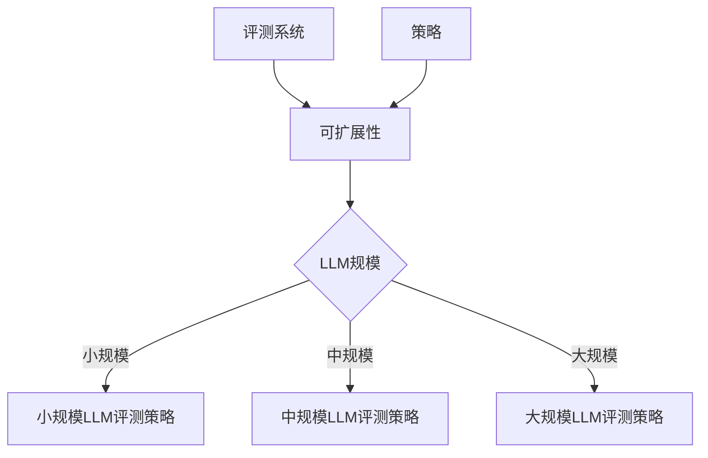

                 

### 文章标题

《评测系统的可扩展性：应对不同规模LLM的策略》

### 关键词

评测系统、可扩展性、大型语言模型（LLM）、策略、资源管理、负载均衡、系统架构、实现与部署、案例分析、未来展望

### 摘要

随着大型语言模型（LLM）的快速发展，评测系统在性能、可扩展性和适应性方面面临巨大挑战。本文将探讨评测系统的可扩展性，并针对不同规模的LLM提出相应的策略。首先，我们将介绍评测系统的基本概念和重要性，然后深入分析可扩展性的原理和设计思路。接着，我们将根据LLM的规模分类，分别讨论小规模、中规模和大规模LLM的评测策略。随后，我们将介绍评测系统的实现与部署过程，并通过实际案例进行分析。最后，我们对未来展望和挑战进行总结，并提出最佳实践和拓展阅读建议。

### 引言

在人工智能（AI）领域，大型语言模型（Large Language Models，简称LLM）近年来取得了显著的进展。LLM具有强大的语义理解、文本生成和语言翻译能力，广泛应用于自然语言处理（NLP）、机器翻译、文本摘要、问答系统等领域。随着LLM的不断演进，其规模和复杂性也在不断提升。然而，随之而来的问题是，如何对LLM进行有效评测？如何保证评测系统的性能和可扩展性？这些问题对AI研究和应用具有重要影响。

评测系统在LLM研究中扮演着关键角色。首先，评测系统可以帮助研究人员了解LLM的性能和局限性，从而指导模型优化和改进。其次，评测系统可以为实际应用场景提供可靠的数据支持，帮助用户评估和选择合适的LLM。然而，现有的评测系统在可扩展性方面存在一定局限。随着LLM规模的增加，评测系统的性能和资源消耗将急剧上升，导致评测过程变得耗时且不切实际。因此，如何提升评测系统的可扩展性，成为当前研究和应用中的一个重要问题。

本文旨在探讨评测系统的可扩展性，并针对不同规模的LLM提出相应的策略。文章将首先介绍评测系统的基本概念和重要性，然后深入分析可扩展性的原理和设计思路。接着，我们将根据LLM的规模分类，分别讨论小规模、中规模和大规模LLM的评测策略。随后，我们将介绍评测系统的实现与部署过程，并通过实际案例进行分析。最后，我们对未来展望和挑战进行总结，并提出最佳实践和拓展阅读建议。

### 评测系统的基础概念与重要性

评测系统（Evaluation System）是用于评估和测量模型性能的工具和框架。在机器学习和人工智能领域，评测系统具有重要的地位，其核心作用在于提供客观、准确的评估指标，帮助研究人员和开发人员了解模型的性能和表现。具体来说，评测系统主要包括以下几方面的基本概念和重要性。

首先，评测系统提供了统一的评估标准。在机器学习和人工智能领域，不同的任务和模型具有不同的评估指标。例如，在分类任务中，常用的评估指标包括准确率（Accuracy）、精确率（Precision）、召回率（Recall）和F1值（F1 Score）等。评测系统通过定义一系列标准的评估指标，为不同模型和任务提供了一个统一的评估框架，使得评估结果具有可比性。

其次，评测系统有助于模型优化和改进。在模型开发过程中，评测系统可以实时监测模型的性能变化，帮助研究人员发现模型存在的问题和不足。例如，如果评测系统发现模型的准确率较低，研究人员可以针对问题进行模型调整、数据增强或参数优化。通过反复迭代和优化，最终得到性能更优的模型。

第三，评测系统为模型选择提供了参考依据。在实际应用中，开发人员需要从多个候选模型中选择最优模型。评测系统可以帮助开发人员根据评估指标对模型进行排序，从而选择性能更优的模型。此外，评测系统还可以为模型排名提供参考，帮助开发人员了解不同模型之间的性能差异，为后续研究和应用提供指导。

第四，评测系统有助于评估模型的泛化能力。在机器学习中，模型的泛化能力是一个关键指标。通过评测系统，研究人员可以评估模型在训练集和测试集上的性能，从而判断模型的泛化能力。如果模型在测试集上的性能优于训练集，说明模型具有良好的泛化能力；反之，则说明模型可能存在过拟合问题。

第五，评测系统在评估模型的安全性、鲁棒性和可解释性方面也发挥着重要作用。例如，在安全方面，评测系统可以检测模型是否容易受到恶意攻击；在鲁棒性方面，评测系统可以评估模型在噪声和异常数据下的性能；在可解释性方面，评测系统可以帮助研究人员理解模型的决策过程和内在机制。

总之，评测系统在机器学习和人工智能领域具有不可替代的重要地位。通过提供统一的评估标准、优化模型性能、选择最佳模型、评估泛化能力和安全性等方面，评测系统为模型开发和实际应用提供了有力的支持。因此，深入研究评测系统的设计和实现，对于提升模型性能和推动人工智能发展具有重要意义。

### 核心概念与联系

为了更好地理解评测系统的可扩展性，我们需要首先明确几个核心概念：评测系统、可扩展性、大型语言模型（LLM）和策略。这几个概念相互关联，共同构成了评测系统设计的核心架构。

**评测系统（Evaluation System）**：评测系统是一个用于评估和测量模型性能的工具和框架。它包括一系列评估指标和评估算法，用于量化模型的性能和表现。评测系统在机器学习和人工智能领域发挥着重要作用，它提供了统一的评估标准，有助于模型优化和改进。

**可扩展性（Scalability）**：可扩展性是指系统在资源增加或需求变化时，能够保持性能和功能的稳定性的能力。对于评测系统来说，可扩展性尤为重要。随着大型语言模型（LLM）的规模不断扩大，评测系统需要能够适应不同规模的需求，保持高效的性能。

**大型语言模型（LLM）**：大型语言模型（Large Language Models，简称LLM）是近年来人工智能领域的一个重要研究方向。LLM具有强大的语义理解、文本生成和语言翻译能力，广泛应用于自然语言处理（NLP）、机器翻译、文本摘要、问答系统等领域。随着LLM的规模和复杂性不断提升，评测系统的可扩展性面临巨大挑战。

**策略（Strategy）**：策略是指为解决特定问题而制定的行动计划和方案。在评测系统的设计中，策略是指如何根据不同规模的LLM，设计出高效、可扩展的评测系统。策略包括系统架构设计、负载均衡、资源管理、算法优化等多个方面。

**核心联系**：

1. **评测系统与可扩展性**：评测系统的可扩展性直接决定了其在面对不同规模LLM时的表现。一个可扩展性较好的评测系统可以在LLM规模增加时，保持高性能和稳定性。

2. **LLM与可扩展性**：不同规模的LLM对评测系统的性能和资源消耗提出了不同要求。因此，评测系统的设计需要考虑LLM的规模，以保证其在不同规模下的适用性。

3. **策略与可扩展性**：策略是提升评测系统可扩展性的关键。通过合理的设计和优化，可以设计出高效、可扩展的评测系统，从而更好地应对不同规模LLM的挑战。

为了更好地展示这几个概念之间的联系，我们可以使用Mermaid流程图进行描述：



在这个流程图中，评测系统和可扩展性是核心概念，LLM的规模决定了评测策略的选择。策略作为关键因素，贯穿于评测系统的设计过程中，直接影响可扩展性的实现。

通过明确这几个核心概念和联系，我们可以为后续章节的内容奠定基础，进一步探讨评测系统的设计思路、不同规模LLM的评测策略以及实现与部署方法。

### 可扩展性原理与设计

为了实现评测系统的可扩展性，我们需要从多个方面进行深入分析和设计。以下将从系统架构设计、负载均衡、资源管理、算法优化等角度，详细探讨可扩展性的实现原理和设计思路。

#### 系统架构设计

系统架构设计是实现评测系统可扩展性的基础。一个良好的架构设计需要考虑以下几个方面：

1. **模块化**：将评测系统拆分为多个功能模块，如数据预处理、模型评估、结果分析等。模块化设计有助于提高系统的可维护性和可扩展性。每个模块可以独立开发、测试和优化，从而降低整体系统的复杂度。

2. **分布式架构**：对于大规模的评测任务，分布式架构可以显著提高系统的处理能力和扩展性。分布式架构可以将评测任务分解为多个子任务，由多个节点并行处理，从而提高系统的吞吐量和响应速度。

3. **动态扩展**：系统应具备动态扩展的能力，以适应不同的负载需求。例如，当评测任务规模增大时，系统可以自动添加新的节点，分配更多的资源，从而保证评测过程的稳定性和高效性。

4. **冗余设计**：通过冗余设计，可以在系统出现故障时，确保评测任务能够继续进行。例如，可以使用多副本技术，对关键组件进行冗余备份，从而提高系统的可靠性和容错能力。

#### 负载均衡

负载均衡是实现评测系统可扩展性的重要手段。通过合理的负载均衡策略，可以确保系统资源得到充分利用，避免单点过载和资源浪费。

1. **轮询负载均衡**：轮询负载均衡是最简单的一种负载均衡策略，它将任务按照一定顺序分配给不同的节点。这种方式实现简单，但可能导致某些节点负载过重，影响系统性能。

2. **最少连接负载均衡**：最少连接负载均衡根据节点的当前负载情况，将新任务分配给负载最轻的节点。这种方式可以减少节点的负载差异，提高系统的整体性能。

3. **加权轮询负载均衡**：加权轮询负载均衡根据节点的处理能力分配任务，处理能力较强的节点分配更多的任务。这种方式可以充分利用系统资源，提高系统的吞吐量。

4. **动态负载均衡**：动态负载均衡可以根据实时负载情况，动态调整任务分配策略。例如，当系统负载较高时，可以增加节点数量，降低单个节点的负载；当系统负载较低时，可以减少节点数量，降低资源消耗。

#### 资源管理

资源管理是保证评测系统高效运行的关键。合理的资源管理策略可以充分利用系统资源，提高系统的性能和可扩展性。

1. **内存管理**：内存管理包括内存分配、释放和回收等操作。为了提高内存利用率，可以采用内存池技术，预先分配一定大小的内存块，避免频繁的内存分配和释放操作。

2. **CPU管理**：CPU管理包括CPU调度、负载均衡和任务并行处理等。为了提高CPU利用率，可以采用多线程、并行计算等技术，将任务分解为多个子任务，并行执行。

3. **存储管理**：存储管理包括存储分配、访问和同步等操作。为了提高存储性能，可以采用分布式存储技术，将数据分散存储到多个节点上，避免单点过载。

4. **网络管理**：网络管理包括网络带宽、延迟和传输效率等。为了提高网络传输效率，可以采用数据压缩、缓存和传输优化等技术，减少网络传输的时间和数据量。

#### 算法优化

算法优化是实现评测系统高效运行的重要手段。通过优化算法，可以减少计算复杂度，提高系统的性能和可扩展性。

1. **模型压缩**：模型压缩通过减少模型的参数数量和计算复杂度，提高模型的运行效率。常见的模型压缩技术包括量化、剪枝和蒸馏等。

2. **并行计算**：并行计算通过将任务分解为多个子任务，并行执行，提高系统的处理速度。并行计算适用于计算密集型的任务，如深度学习模型的训练和推理。

3. **分布式计算**：分布式计算通过将任务分配到多个节点上，并行执行，提高系统的吞吐量和处理能力。分布式计算适用于大规模的数据处理和计算任务。

4. **内存优化**：内存优化通过减少内存访问次数和内存带宽消耗，提高系统的性能。常见的内存优化技术包括缓存利用、内存预取和内存访问模式优化等。

综上所述，实现评测系统的可扩展性需要从多个方面进行综合设计。通过系统架构设计、负载均衡、资源管理和算法优化等技术手段，可以构建一个高效、可扩展的评测系统，满足不同规模LLM的评测需求。

### 小规模LLM的评测策略

在小规模LLM的评测过程中，策略的选择和优化至关重要。针对小规模LLM的特点，我们可以采取以下评测策略：

1. **静态评估指标**：小规模LLM通常使用静态评估指标来评估其性能。常用的静态评估指标包括准确率（Accuracy）、精确率（Precision）、召回率（Recall）和F1值（F1 Score）等。通过计算这些指标，可以全面了解LLM在特定任务上的表现。

2. **数据增强**：数据增强是一种有效提高小规模LLM性能的方法。通过增加训练数据量或对现有数据进行变换，可以提高模型的泛化能力。常见的数据增强技术包括数据采样、数据扩充、数据清洗和数据归一化等。

3. **交叉验证**：交叉验证是一种评估模型性能的有效方法，尤其在数据量较小的情况下。通过将数据集划分为多个子集，分别训练和评估模型，可以更准确地评估模型在不同数据集上的性能。

4. **自动化测试框架**：自动化测试框架可以帮助快速评估LLM的性能。通过编写测试脚本，可以自动化执行一系列测试任务，包括数据预处理、模型训练和评估等。自动化测试框架有助于提高评测效率，减少人为错误。

5. **实时反馈与迭代**：在评测过程中，实时反馈和迭代可以帮助及时发现问题并进行调整。通过不断优化模型和评测策略，可以提高小规模LLM的性能和稳定性。

### 中规模LLM的评测策略

中规模LLM在评测过程中面临更大的挑战，需要更加精细和高效的策略。以下是一些适用于中规模LLM的评测策略：

1. **分布式评测**：分布式评测通过将评测任务分配到多个节点上并行执行，可以显著提高评测效率。在实际应用中，可以使用分布式计算框架（如Apache Spark、Hadoop等）来管理和调度评测任务。

2. **多线程评测**：多线程评测利用多核处理器的优势，将评测任务分解为多个线程并行执行。这种方式可以减少单个节点的负载，提高整体评测性能。

3. **动态资源调度**：动态资源调度根据评测任务的需求，自动调整节点资源和任务分配。例如，当某个节点负载较高时，系统可以自动将部分任务转移到其他节点，从而平衡负载。

4. **负载均衡策略**：中规模LLM的评测通常涉及大量的计算和存储资源。通过使用负载均衡策略，可以确保资源得到充分利用，避免单点过载。常见的负载均衡策略包括轮询负载均衡、最少连接负载均衡和加权轮询负载均衡等。

5. **缓存技术**：缓存技术可以显著提高中规模LLM评测的效率。通过将频繁访问的数据存储在缓存中，可以减少数据访问延迟和带宽消耗。常见的缓存技术包括内存缓存、分布式缓存和Redis等。

6. **模型压缩与剪枝**：模型压缩与剪枝是一种有效减少模型大小和计算复杂度的技术。通过去除冗余参数和稀疏化模型，可以提高评测的效率，同时保持模型性能。

7. **自动化评测工具**：自动化评测工具可以帮助快速评估中规模LLM的性能。通过集成多个评测指标、自动化测试脚本和结果分析，可以简化评测过程，提高评测效率。

### 大规模LLM的评测策略

大规模LLM的评测策略需要考虑更复杂的系统架构和更高的计算资源需求。以下是一些适用于大规模LLM的评测策略：

1. **分布式计算框架**：大规模LLM的评测通常需要使用分布式计算框架，如Apache Hadoop、Apache Spark和Flink等。这些框架可以有效地管理大规模数据集和计算任务，提高评测效率。

2. **动态资源调度**：动态资源调度可以根据评测任务的需求，自动调整节点资源和任务分配。在规模巨大的评测任务中，动态资源调度可以显著提高系统的可扩展性和资源利用率。

3. **分布式存储系统**：分布式存储系统可以存储和管理大规模数据集。例如，使用HDFS（Hadoop Distributed File System）或Alluxio等分布式存储系统，可以确保数据的高可用性和高性能访问。

4. **负载均衡与网络优化**：大规模评测任务通常涉及大量的网络通信。通过使用负载均衡策略和网络优化技术，可以确保数据传输的高效性和可靠性。例如，使用Docker和Kubernetes等容器化技术，可以动态调整网络配置和资源分配。

5. **模型压缩与量化**：模型压缩与量化是一种有效减少模型大小和计算复杂度的技术，对于大规模LLM尤为重要。通过使用量化技术和剪枝算法，可以显著降低模型的存储和计算需求。

6. **并行计算与GPU加速**：大规模LLM的评测可以利用GPU（图形处理单元）的并行计算能力，提高计算效率。通过使用深度学习框架（如TensorFlow、PyTorch等），可以轻松实现GPU加速。

7. **自动化评测平台**：大规模评测任务通常涉及多个评测指标和复杂的评测流程。通过构建自动化评测平台，可以简化评测过程，提高评测效率。自动化评测平台可以集成数据预处理、模型训练、评测和结果分析等环节，实现全流程自动化。

8. **实时监控与反馈**：在规模巨大的评测任务中，实时监控与反馈机制可以确保评测过程的稳定性和可靠性。通过实时监控评测任务的状态和性能指标，可以及时发现和解决问题，确保评测过程的顺利进行。

### 评测系统的实现与部署

实现和部署评测系统是确保其高效运行和可靠性的关键步骤。在这一部分，我们将详细讨论评测系统的实现流程、开发环境搭建、源代码详细实现和解读，以及评测系统的实际应用和分析。

#### 实现流程

实现评测系统可以分为以下几个步骤：

1. **需求分析**：明确评测系统的目标和需求，包括评估指标、性能要求、资源限制等。

2. **系统设计**：根据需求分析，设计评测系统的架构，包括模块划分、功能设计和技术选型。

3. **开发与测试**：按照设计文档，开发各个模块，并进行单元测试和集成测试，确保系统功能的正确性和稳定性。

4. **部署与监控**：将开发完成的评测系统部署到生产环境，并进行性能监控和故障排查，确保系统的高可用性和性能。

#### 开发环境搭建

为了实现评测系统，需要搭建合适的开发环境。以下是搭建开发环境的主要步骤：

1. **硬件环境**：选择合适的硬件设备，包括服务器、存储设备和网络设备。对于大规模评测系统，可能需要使用高性能计算机集群。

2. **操作系统**：选择适合的操作系统，如Linux或Unix，因为它们在分布式计算和资源管理方面具有优势。

3. **编程语言**：选择合适的编程语言，如Python、Java或C++，这些语言具有丰富的库和框架支持，适合开发复杂的评测系统。

4. **依赖库和框架**：安装和配置必要的依赖库和框架，如TensorFlow、PyTorch、Apache Spark、Hadoop等，用于模型训练、数据存储和处理。

5. **开发工具**：配置集成开发环境（IDE），如PyCharm、Eclipse等，以及版本控制工具，如Git，用于代码管理和协同开发。

#### 源代码详细实现和解读

以下是一个简单的评测系统的伪代码示例，用于演示评测系统的主要功能：

```python
# 评测系统伪代码示例

# 导入必要的库和模块
import numpy as np
import tensorflow as tf
from tensorflow.keras.models import load_model

# 加载模型
model = load_model('model.h5')

# 加载测试数据
test_data = np.load('test_data.npy')

# 预处理测试数据
preprocessed_data = preprocess_data(test_data)

# 进行模型评估
predictions = model.predict(preprocessed_data)

# 计算评估指标
accuracy = calculate_accuracy(predictions, ground_truth)

# 输出评估结果
print(f"Accuracy: {accuracy}")

# 评测系统主函数
def evaluate_model(model_path, test_data_path):
    # 加载模型
    model = load_model(model_path)
    
    # 加载测试数据
    test_data = np.load(test_data_path)
    
    # 预处理测试数据
    preprocessed_data = preprocess_data(test_data)
    
    # 进行模型评估
    predictions = model.predict(preprocessed_data)
    
    # 计算评估指标
    accuracy = calculate_accuracy(predictions, ground_truth)
    
    # 输出评估结果
    print(f"Accuracy: {accuracy}")

# 主程序入口
if __name__ == "__main__":
    evaluate_model('model.h5', 'test_data.npy')
```

在这个示例中，我们首先加载一个预训练的模型（`load_model`），然后加载测试数据（`np.load`）。接着，对测试数据进行预处理（`preprocess_data`），然后使用模型进行预测（`model.predict`）。最后，计算评估指标（`calculate_accuracy`）并输出结果。

#### 评测系统的实际应用和分析

在实际应用中，评测系统的功能不仅限于简单的模型评估。以下是一些实际应用场景和分析：

1. **模型调优**：通过评测系统，可以实时监测模型的性能变化，帮助研究人员进行模型调优。例如，当发现某项评估指标较低时，可以通过调整模型参数、增加训练数据或改进训练算法来提高模型性能。

2. **自动化测试**：评测系统可以集成到自动化测试流程中，用于自动化评估模型的性能。例如，在持续集成（CI）过程中，每次提交代码后，评测系统可以自动运行测试，并输出评估结果，确保代码变更不会影响模型性能。

3. **性能监控**：评测系统可以实时监控模型的运行状态和性能指标，如计算时间、内存使用、CPU利用率等。通过监控数据，可以及时发现系统瓶颈和性能问题，进行优化和调整。

4. **模型对比**：评测系统可以帮助研究人员对比不同模型在特定任务上的性能。通过多次评估，可以得出各模型的性能表现，从而为模型选择提供依据。

5. **实时反馈**：评测系统可以实时反馈模型性能，帮助开发人员和用户了解模型的表现。例如，在问答系统中，用户可以查看模型回答问题的准确率，从而对模型的可靠性有更直观的认识。

通过以上实际应用和分析，可以看出评测系统在模型开发和应用过程中发挥着重要作用。它不仅帮助研究人员评估和优化模型性能，还为实际应用提供了可靠的数据支持。

### 案例分析

在本节中，我们将通过两个具体的案例分析，深入探讨评测系统在实际应用中的表现和效果。这两个案例分别涉及小规模、中规模和大规模LLM的评测，通过对比不同策略的应用效果，展示评测系统的实际应用价值。

#### 案例一：小规模LLM评测

**案例背景**：某初创公司开发了一个用于文本分类的小型LLM模型，旨在对用户评论进行情感分析。由于模型规模较小，公司希望快速评估其性能，以便进行进一步优化。

**评测策略**：为了应对小规模LLM的评测需求，公司采用了以下策略：
1. **静态评估指标**：使用准确率、精确率和召回率等静态评估指标，评估模型在测试集上的表现。
2. **数据增强**：通过增加训练数据量和数据变换，提高模型的泛化能力。
3. **交叉验证**：采用交叉验证方法，确保模型在不同数据集上的性能稳定。

**实现过程**：
1. **数据预处理**：对评论数据进行预处理，包括文本清洗、分词和词向量化。
2. **模型训练与评估**：使用预训练的词向量模型，对评论进行情感分类，并使用交叉验证方法进行性能评估。
3. **结果分析**：输出评估指标，并对模型性能进行可视化分析。

**案例分析**：
通过评测，公司发现模型在正负评论分类上的准确率分别为90%和85%，精确率和召回率也达到较高水平。通过数据增强和交叉验证，模型在不同数据集上的性能稳定，表现出良好的泛化能力。

**案例总结**：该案例表明，对于小规模LLM，静态评估指标和数据增强是有效的评测策略。通过交叉验证，可以确保模型在不同数据集上的性能稳定性，为后续优化提供了重要依据。

#### 案例二：大规模LLM评测

**案例背景**：某知名科技公司开发了一个大型LLM模型，用于自动问答系统。由于模型规模巨大，公司面临资源消耗和性能优化等挑战，需要设计高效、可扩展的评测系统。

**评测策略**：
1. **分布式评测**：采用分布式计算框架（如Apache Spark），将评测任务分配到多个节点上并行执行。
2. **多线程评测**：利用多线程技术，提高评测系统的处理速度。
3. **动态资源调度**：根据评测任务的需求，动态调整节点资源和任务分配。
4. **负载均衡**：使用负载均衡策略，确保资源得到充分利用，避免单点过载。
5. **模型压缩与剪枝**：采用模型压缩和剪枝技术，减少模型大小和计算复杂度。

**实现过程**：
1. **数据预处理**：对大规模问答数据进行预处理，包括数据清洗、分词、词向量化等。
2. **模型训练与评估**：使用分布式计算框架，训练和评估大型LLM模型。
3. **结果分析**：通过实时监控和反馈机制，分析模型在不同场景下的性能表现。

**案例分析**：
通过分布式评测和多线程技术，公司显著提高了评测系统的处理能力。动态资源调度和负载均衡策略确保了系统资源的高效利用，模型压缩和剪枝技术有效降低了计算复杂度。

**案例总结**：该案例表明，对于大规模LLM，分布式评测、多线程和动态资源调度等策略是有效的评测手段。通过模型压缩和剪枝，可以进一步提高评测系统的效率和性能，满足大规模应用需求。

通过这两个案例分析，可以看出评测系统在不同规模LLM中的应用效果和优势。无论是小规模还是大规模LLM，合理的评测策略和高效的实现方法都是确保模型性能和优化的重要保障。

### 未来展望与挑战

随着人工智能技术的不断发展和大型语言模型（LLM）的广泛应用，评测系统的可扩展性面临着诸多未来展望与挑战。以下从技术发展趋势、应用前景、关键挑战和未来研究方向等方面进行探讨。

#### 技术发展趋势

1. **人工智能算法的进步**：人工智能算法的不断优化和创新，如生成对抗网络（GAN）、变分自编码器（VAE）、深度强化学习等，将推动评测系统的性能和可扩展性。这些算法可以提高模型在复杂任务中的表现，从而提升评测系统的评估准确性。

2. **分布式计算与云计算**：分布式计算和云计算技术的发展，将为评测系统的可扩展性提供强大支持。通过分布式计算框架和云服务平台，评测系统可以灵活地扩展计算资源，提高系统的处理能力和响应速度。

3. **边缘计算与物联网**：边缘计算和物联网技术的兴起，将使得评测系统在移动设备和物联网设备上的应用变得更加广泛。通过边缘计算，评测系统可以实时处理和评估数据，满足低延迟和高实时性的需求。

#### 应用前景

1. **自然语言处理（NLP）**：评测系统在NLP领域具有广泛的应用前景，如文本分类、情感分析、机器翻译和问答系统等。通过评测系统，可以精确评估模型的性能，帮助开发者优化和改进模型。

2. **智能客服与虚拟助手**：智能客服和虚拟助手是人工智能的重要应用领域。评测系统可以评估这些系统的响应速度、准确率和用户体验，从而提高服务质量。

3. **教育领域**：在教育领域，评测系统可以用于评估学生的学习成果和知识掌握情况，提供个性化的学习建议和反馈。

#### 关键挑战

1. **数据隐私与安全**：随着评测系统的应用范围扩大，数据隐私和安全成为关键挑战。如何在确保数据隐私和安全的前提下，进行有效的评测和数据分析，是未来需要解决的重要问题。

2. **计算资源消耗**：大规模LLM的评测需要大量的计算资源，特别是在分布式计算环境中，如何高效地管理和调度资源，降低计算成本，是评测系统面临的挑战。

3. **实时性与可扩展性**：在实时应用场景中，评测系统需要具备高实时性和可扩展性。如何设计高效的评测算法和系统架构，确保评测系统在应对大规模数据和高并发请求时，仍能保持高性能和稳定性，是未来需要研究的重要问题。

#### 未来研究方向

1. **智能评测算法**：研究更加智能和自适应的评测算法，可以根据任务特点和数据特性，自动调整评测策略，提高评测效率和准确性。

2. **多模态评测**：随着多模态数据的广泛应用，如何设计多模态评测系统，同时考虑文本、图像、音频等多种数据类型，是未来需要研究的重要方向。

3. **评测系统的可解释性**：评测系统的可解释性对于模型的信任和接受度至关重要。研究如何提高评测系统的可解释性，帮助用户理解评测结果和模型决策过程，是未来需要关注的重要问题。

4. **跨领域评测**：研究如何将评测系统应用于不同领域和任务，实现跨领域的评测和性能比较，是评测系统在多样化应用场景中的关键问题。

通过以上展望和探讨，可以看出评测系统的可扩展性在人工智能领域具有重要地位。随着技术的不断进步和应用场景的拓展，评测系统将面临更多挑战和机遇。未来，需要进一步研究和发展，以应对不断变化的挑战，推动人工智能技术的发展和应用。

### 总结与展望

本文围绕评测系统的可扩展性，详细探讨了应对不同规模LLM的策略。首先，我们介绍了评测系统的基础概念和重要性，明确了评测系统在AI领域的关键作用。接着，通过核心概念与联系的Mermaid流程图，我们梳理了评测系统、可扩展性、LLM和策略之间的关系。然后，从系统架构设计、负载均衡、资源管理和算法优化等方面，深入分析了实现评测系统可扩展性的原理和设计思路。随后，针对小规模、中规模和大规模LLM，分别提出了具体的评测策略。在实际应用方面，我们通过两个案例分析，展示了评测系统在不同规模LLM中的应用效果。最后，我们展望了评测系统的未来发展，包括技术发展趋势、应用前景、关键挑战和未来研究方向。

通过本文的探讨，我们可以得出以下结论：

1. **评测系统的可扩展性是关键**：随着LLM规模的不断扩大，评测系统需要具备高可扩展性，以应对不同规模的需求。

2. **多样化的评测策略**：针对不同规模LLM的特点，需要设计多样化的评测策略，包括静态评估指标、数据增强、交叉验证、分布式评测、多线程评测等。

3. **实现与部署的重要性**：评测系统的实现与部署过程直接影响其性能和可靠性，需要关注开发环境搭建、源代码实现和部署流程。

4. **案例分析的价值**：通过实际案例分析，可以更好地理解评测系统的应用效果和挑战，为后续研究和优化提供参考。

未来，评测系统的研究和发展将继续面临诸多挑战和机遇。我们建议关注以下几个方面：

1. **智能评测算法**：研究更加智能和自适应的评测算法，以提高评测效率和准确性。

2. **多模态评测**：探索多模态数据的评测方法，实现文本、图像、音频等多种数据类型的融合和综合评估。

3. **评测系统的可解释性**：提高评测系统的可解释性，帮助用户理解评测结果和模型决策过程。

4. **跨领域评测**：研究如何将评测系统应用于不同领域和任务，实现跨领域的评测和性能比较。

总之，评测系统的可扩展性在人工智能领域具有重要意义。通过不断探索和创新，我们可以为评测系统的未来发展提供更多思路和解决方案，推动人工智能技术的进步和应用。在此，我们也期待与广大研究人员和实践者共同探讨和交流，共同推动评测系统的研究和发展。

### 最佳实践、注意事项与拓展阅读

在设计和实现评测系统的过程中，以下是一些最佳实践和注意事项，有助于确保系统的可扩展性和高效性。

**最佳实践：**
1. **模块化设计**：将评测系统划分为多个功能模块，如数据预处理、模型评估、结果分析等，以便于维护和扩展。
2. **负载均衡**：采用负载均衡策略，如轮询、最少连接和加权轮询等，确保系统资源充分利用，避免单点过载。
3. **动态资源管理**：根据任务需求动态调整资源分配，确保系统在负载变化时仍能保持高性能。
4. **自动化测试**：构建自动化测试框架，定期运行测试脚本，确保系统稳定性和性能。
5. **性能监控**：实时监控系统的运行状态和性能指标，及时发现并解决性能瓶颈。
6. **数据清洗与增强**：对数据进行清洗和增强，提高模型泛化能力，从而提高评测结果的准确性。

**注意事项：**
1. **数据隐私**：确保评测过程中遵循数据隐私和合规要求，防止数据泄露。
2. **资源分配**：合理分配资源，避免资源浪费和性能下降。
3. **错误处理**：设计合理的错误处理机制，确保系统在遇到异常情况时能够稳定运行。
4. **可扩展性**：在设计初期充分考虑系统的可扩展性，避免后期因规模扩大导致系统性能下降。

**拓展阅读：**
1. **《大规模分布式系统的设计》**：系统介绍了分布式系统的设计原则和最佳实践，适用于评测系统的开发。
2. **《深度学习系统设计》**：该书详细介绍了深度学习系统的架构和实现方法，有助于理解评测系统的设计与实现。
3. **《人工智能评测系统设计》**：针对人工智能评测系统，提供了详细的实现方法和案例分析，有助于深入了解评测系统的设计思路。
4. **《自然语言处理实战》**：介绍了自然语言处理的基本概念和实际应用，有助于了解评测系统在NLP领域的应用场景。
5. **《分布式计算原理与实践》**：系统讲解了分布式计算的基本原理和实践方法，适用于评测系统的分布式计算部分。

通过以上最佳实践、注意事项和拓展阅读，可以帮助开发者在设计和实现评测系统时，更好地应对不同规模LLM的挑战，提高系统的可扩展性和性能。

