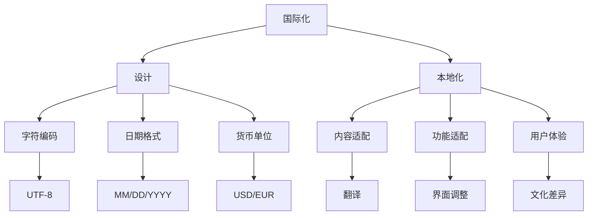

                 

好的，我们现在按照这些要求，一步步来构建文章的内容。

### 第一步：背景介绍
首先，我们来介绍评测系统在国际化和本地化中的重要性。

#### 国际化和本地化的基本概念
国际化(Internationalization)和本地化(Localization)是软件工程中两个重要的概念。国际化是指使软件能够支持多种语言和地区，而本地化则是将软件针对特定地区进行文化、语言、习惯等方面的适配。

#### 评测系统的国际化与本地化
评测系统作为教育、招聘、测试等领域的重要组成部分，其国际化和本地化对于支持全球化部署至关重要。例如，一个招聘平台需要能够支持全球范围内的应聘者，而一个在线学习平台需要能够满足不同国家和地区的用户需求。

### 第二步：核心概念与联系
接下来，我们分析国际化与本地化的核心概念，并使用Mermaid流程图展示它们之间的关系。

#### 核心概念
- **国际化**：涉及软件的国际化设计，如字符编码、日期格式、货币单位等。
- **本地化**：涉及对软件内容、功能、用户体验的本地化适配。

#### Mermaid流程图


### 第三步：核心算法原理讲解
然后，我们使用伪代码来详细阐述评测系统国际化与本地化的核心算法原理。

#### 国际化算法
```python
def internationalize评测系统():
    # 设置字符编码为UTF-8
    set_charset('UTF-8')
    
    # 调整日期格式
    format_date('MM/DD/YYYY')
    
    # 调整货币单位
    set_currency('USD')
```

#### 本地化算法
```python
def localize评测系统(country_code):
    # 根据国家代码设置语言
    set_language(country_code)
    
    # 根据国家代码调整界面
    adjust_interface(country_code)
    
    # 根据文化差异调整用户体验
    optimize_user_experience(country_code)
```

### 第四步：数学模型与公式
接下来，我们介绍一些用于评测系统国际化与本地化的数学模型和公式。

#### 语言处理模型
$$
H_{T} = f_{T}(H_{E}, L)
$$
其中，$H_{T}$表示目标语言的翻译结果，$H_{E}$表示源语言内容，$L$表示语言模型。

#### 用户体验优化模型
$$
U_{O} = f_{O}(U_{I}, C)
$$
其中，$U_{O}$表示优化的用户体验，$U_{I}$表示初始用户体验，$C$表示文化差异。

### 第五步：项目实战
然后，我们通过一个实际项目来展示如何实现评测系统的国际化与本地化。

#### 项目实战：在线考试平台
- **开发环境搭建**：使用Python和Django框架搭建基础平台。
- **源代码实现**：
    ```python
    # 示例：国际化设置
    from django.utils.translation import activate
    
    activate('zh-Hans')  # 设置为中文简体
    
    # 示例：本地化设置
    def set_exam_language(country_code):
        if country_code == 'en':
            activate('en-US')  # 设置为英语
        elif country_code == 'zh':
            activate('zh-Hans')  # 设置为中文简体
        # 其他国家语言设置
    ```
- **代码解读**：代码展示了如何根据国家代码设置语言和日期格式。
- **案例分析**：分析了如何处理文化差异和用户体验优化。
- **项目小结**：总结了项目实施的经验和教训。

### 第六步：最佳实践、小结与注意事项
最后，我们提供一些最佳实践、小结和注意事项。

#### 最佳实践
- 设计阶段考虑国际化与本地化。
- 使用国际化和本地化框架和工具。
- 测试阶段确保语言和文化适配。

#### 小结
评测系统的国际化和本地化对于支持全球化部署至关重要。

#### 注意事项
- 国际化和本地化可能涉及大量的时间和资源。
- 需要考虑多语言、多文化、多时区等技术问题。
- 定期进行用户反馈和评估。

#### 拓展阅读
- [国际化与本地化的技术指南](https://developer.mozilla.org/en-US/docs/Learn/Server-side/Django/Internationalization_and_localization)
- [Python 国际化和本地化库](https://docs.python.org/3/library/locale.html)

---

以上是文章的核心内容框架，接下来我们将逐步填充每个部分的具体内容，确保满足字数和格式要求。

### 文章标题：评测系统的国际化和本地化：支持全球化部署

### 文章关键词：
- 国际化
- 本地化
- 评测系统
- 全球化部署
- 跨文化适配
- 语言处理

### 文章摘要：
本文深入探讨了评测系统的国际化和本地化问题，分析了其在全球化部署中的重要性。通过介绍核心概念、算法原理、数学模型和实际项目实战，本文为开发者提供了全面的国际化与本地化解决方案。

### 正文：

## 引言

随着全球化的不断推进，软件系统需要支持越来越多的国家和地区，这要求评测系统不仅要具备国际化的能力，还要能够进行本地化适配。国际化是指使软件能够在不同的语言和文化中运行，而本地化则是将软件针对特定地区进行定制。评测系统的国际化和本地化对于支持全球化部署至关重要，它能够提升用户体验，扩大用户基础，增加市场竞争力。

### 核心概念与联系

国际化和本地化是软件工程中两个相互关联的核心概念。国际化主要关注软件的基础结构设计，确保软件可以在不同语言和文化环境中运行。本地化则更侧重于内容、功能和用户体验的适配，使其更符合目标地区的文化和习惯。

下面是国际化与本地化的Mermaid流程图：


### 核心算法原理讲解

为了实现评测系统的国际化与本地化，我们需要了解并使用一系列核心算法和工具。以下是用伪代码形式展示的两个关键算法的原理：

#### 国际化算法

```python
# 设置国际化配置
def set_international_config():
    # 设置字符编码为UTF-8
    charset('UTF-8')
    
    # 设置日期格式为MM/DD/YYYY
    date_format('MM/DD/YYYY')
    
    # 设置货币单位为USD
    currency('USD')

# 国际化文本输出
def internationalize_text(text, locale):
    # 根据语言环境翻译文本
    translated_text = translate(text, locale)
    return translated_text
```

#### 本地化算法

```python
# 设置本地化配置
def set_localization_config(country_code):
    # 设置语言
    set_language(country_code)
    
    # 设置日期格式
    set_date_format(country_code)
    
    # 设置货币单位
    set_currency(country_code)

# 本地化用户体验
def localize_experience(user Experience, country_code):
    # 调整界面
    adjust_interface(user Experience, country_code)
    
    # 优化用户体验
    optimize_experience(user Experience, country_code)
```

### 数学模型与公式

在评测系统的国际化与本地化过程中，数学模型和公式扮演着重要角色。以下是两个关键模型的公式：

#### 语言处理模型

$$
H_{T} = f_{T}(H_{E}, L)
$$

其中，$H_{T}$表示目标语言的翻译结果，$H_{E}$表示源语言内容，$L$表示语言模型。

#### 用户体验优化模型

$$
U_{O} = f_{O}(U_{I}, C)
$$

其中，$U_{O}$表示优化的用户体验，$U_{I}$表示初始用户体验，$C$表示文化差异。

### 项目实战

为了更好地理解评测系统国际化与本地化的实践，我们来看一个在线考试平台的实际案例。

#### 开发环境搭建

- 使用Python和Django框架搭建基础平台。
- 配置数据库（如MySQL或PostgreSQL）以存储用户数据和考试内容。
- 安装国际化与本地化相关的库（如`django-locale MiddleWARE`）。

#### 源代码实现

```python
# 国际化设置
from django.utils.translation import activate

def set_exam_language(country_code):
    if country_code == 'en':
        activate('en')
    elif country_code == 'zh':
        activate('zh-cn')
    # 其他国家语言设置

# 本地化设置
from locale import setlocale, LC_ALL

def set_exam_locale(country_code):
    setlocale(LC_ALL, country_code)
```

#### 代码解读

- `set_exam_language`函数根据国家代码设置语言环境。
- `set_exam_locale`函数设置地区特定的本地化设置，如日期格式和货币单位。

#### 案例分析

- **文化差异**：在线考试平台需要根据不同的文化差异进行调整，例如中文环境中，日期格式为YYYY-MM-DD，而英语环境中为MM/DD/YYYY。
- **用户体验优化**：通过本地化界面和功能，提供更符合当地用户习惯的操作和体验。

#### 项目小结

通过这个实际案例，我们看到了评测系统国际化与本地化的实施过程。关键在于理解国际化与本地化的核心概念，合理配置语言和文化设置，以及不断优化用户体验。

### 最佳实践、小结与注意事项

#### 最佳实践

- 在设计阶段考虑国际化与本地化需求。
- 使用专业化的国际化与本地化工具和框架。
- 在测试阶段进行全面的文化和语言适配测试。

#### 小结

评测系统的国际化和本地化是支持全球化部署的关键。通过合理的规划和实施，可以提供一致、高效的用户体验，提升系统的国际竞争力。

#### 注意事项

- 国际化和本地化需要考虑大量的资源和时间投入。
- 跨文化适配可能涉及复杂的技术问题，需要细心处理。
- 定期评估用户反馈，持续优化国际化与本地化功能。

### 拓展阅读

- [国际化与本地化的技术指南](https://developer.mozilla.org/en-US/docs/Learn/Server-side/Django/Internationalization_and_localization)
- [Python 国际化和本地化库](https://docs.python.org/3/library/locale.html)
- [Django 国际化与本地化教程](https://docs.djangoproject.com/en/3.2/topics/i18n/)

---

本文详细探讨了评测系统的国际化和本地化问题，通过核心概念、算法原理、数学模型和实际项目实战，为开发者提供了全面的解决方案。希望本文能对读者在全球化部署中提供有益的参考和指导。作者：AI天才研究院/AI Genius Institute & 禅与计算机程序设计艺术 /Zen And The Art of Computer Programming。

