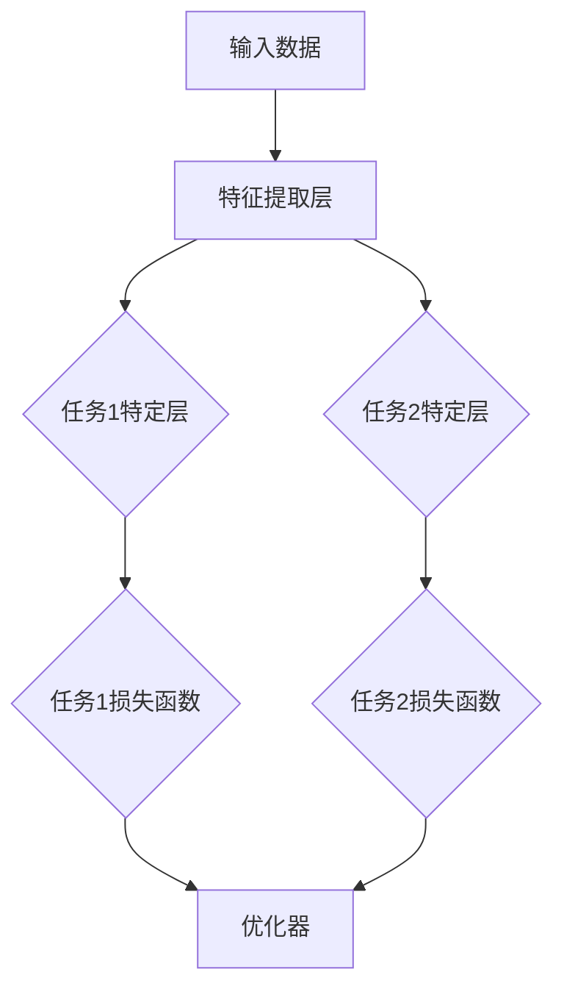

                 


### 文章标题

# 评测系统的多任务学习框架设计

### 关键词

- 多任务学习
- 评测系统
- 深度学习
- 数学模型
- 项目实战

### 摘要

本文旨在深入探讨评测系统的多任务学习框架设计。首先，我们简要介绍多任务学习的基本概念和其在评测系统中的应用背景。接着，本文将详细解析多任务学习框架的核心算法原理，并通过伪代码展示其实现细节。随后，我们将引入数学模型，并使用 LaTeX 格式书写相关公式，详细讲解其推导过程。最后，通过实际项目案例，我们展示如何实现多任务学习框架，并对其代码实现、效果分析和应用解读进行深入剖析。本文旨在为读者提供一个系统、全面、易于理解的多任务学习框架设计指南。

### 1. 设计目录结构

首先，我们需要设计一个清晰的目录结构，以便系统地组织本文内容。以下是一个详细的目录结构：

```
# 评测系统的多任务学习框架设计

## 引言
### 1.1 多任务学习与评测系统的关系
### 1.2 多任务学习在评测系统中的应用

## 多任务学习框架概述
### 2.1 多任务学习的定义与挑战
### 2.2 多任务学习框架的基本结构

## 核心算法原理讲解
### 3.1 算法概述
### 3.2 伪代码讲解
### 3.3 算法优缺点分析

## 数学模型和数学公式
### 4.1 数学模型的基本概念
### 4.2 多任务学习中的数学公式
### 4.3 公式推导与详细讲解

## 项目实战
### 5.1 实际项目案例
### 5.2 开发环境搭建
### 5.3 源代码详细实现
### 5.4 代码解读与分析

## 总结与展望
### 6.1 主要内容回顾
### 6.2 存在的挑战与未来展望
```

### 2. 多任务学习框架概述

#### 2.1 多任务学习的定义与挑战

多任务学习（Multi-Task Learning，MTL）是一种机器学习技术，它允许模型同时解决多个相关任务，而不是单独解决每个任务。这些任务可以是相互依赖的，也可能具有共同的特征或数据。多任务学习在许多实际应用场景中具有显著的优势，例如图像识别、语音识别和自然语言处理等。

多任务学习的主要挑战包括：

1. **任务关联性**：任务之间的关联性对于多任务学习至关重要。如果任务高度相关，可以共享特征和知识，反之则难以实现有效的多任务学习。
2. **任务平衡性**：每个任务对模型的重要性不同，如何平衡不同任务的贡献是一个关键问题。
3. **计算效率**：多任务学习通常需要更高的计算资源，特别是在处理大量数据和高维特征时。

#### 2.2 多任务学习框架的基本结构

一个典型的多任务学习框架通常包括以下几个核心组件：

1. **共享层**：多个任务共享一个公共的特征提取层，以利用任务之间的关联性。
2. **任务特定层**：每个任务都有自己的特定层，用于对共享层提取的特征进行进一步处理。
3. **损失函数**：多任务学习框架使用一个统一的损失函数来衡量多个任务的性能，并优化整个模型。

下面是一个简单的 Mermaid 流程图，展示了多任务学习框架的基本架构：



### 3. 核心算法原理讲解

#### 3.1 算法概述

多任务学习框架的核心算法通常是基于深度学习的，其中最常用的模型是序列到序列（Seq2Seq）模型。Seq2Seq模型通过编码器和解码器来处理序列数据，可以很好地处理多任务学习中的序列依赖关系。

#### 3.2 伪代码讲解

以下是多任务学习框架的核心算法的伪代码：

```python
# 伪代码：多任务学习框架

# 输入：训练数据集X，任务标签Y
# 输出：优化后的模型参数θ

# 初始化模型参数θ
θ <- 初始化参数()

# 设置迭代次数T
T <- 最大迭代次数

# 主循环
for t = 1 to T do
    # 计算梯度
    ∇θ = 计算梯度(X, Y, θ)

    # 更新参数
    θ <- θ - 学习率α * ∇θ

    # 计算损失
    loss = 计算损失(X, Y, θ)

    # 输出当前迭代步的损失和参数
    print("迭代步t：", t, "损失：", loss, "参数：", θ)
end for

# 输出最终模型参数
return θ
```

#### 3.3 算法优缺点分析

多任务学习框架的优点包括：

1. **资源共享**：通过共享特征提取层，可以减少模型的参数数量，提高计算效率。
2. **任务关联**：可以利用任务之间的关联性，提高任务的准确性和鲁棒性。
3. **并行处理**：多个任务可以同时处理，提高整体模型的训练速度。

然而，多任务学习框架也存在一些缺点：

1. **任务不平衡**：如果任务之间的贡献差异较大，可能导致某些任务被忽视。
2. **模型复杂度**：多任务学习框架通常比单任务框架复杂，可能需要更多的计算资源。
3. **过拟合风险**：共享层可能导致模型过拟合，特别是在任务相关性较低的情况下。

### 4. 数学模型和数学公式

#### 4.1 数学模型的基本概念

多任务学习框架中的数学模型通常包括以下几个部分：

1. **输入层**：表示输入数据的特征向量。
2. **编码器**：将输入数据编码为固定长度的向量。
3. **任务特定层**：对编码器输出的特征向量进行进一步处理，以生成任务预测。
4. **损失函数**：衡量模型预测与实际标签之间的差异，用于优化模型参数。

下面是一个简化的多任务学习模型的数学表达式：

$$
\begin{align*}
\text{Encoder}(x) &= \sigma(W_e x + b_e) \\
\text{Task1}(x) &= \sigma(W_1 \text{Encoder}(x) + b_1) \\
\text{Task2}(x) &= \sigma(W_2 \text{Encoder}(x) + b_2) \\
L &= \frac{1}{N} \sum_{i=1}^{N} \Big[ -y_1^{(i)} \log \text{Task1}^{(i)}(x) - y_2^{(i)} \log \text{Task2}^{(i)}(x) \Big]
\end{align*}
$$

其中，$x$ 表示输入特征向量，$y_1$ 和 $y_2$ 分别表示任务1和任务2的实际标签，$\sigma$ 表示激活函数，$W_e, W_1, W_2$ 分别表示编码器和解码器的权重矩阵，$b_e, b_1, b_2$ 分别表示偏置向量。

#### 4.2 多任务学习中的数学公式

多任务学习中的数学公式主要用于描述模型参数的更新过程和损失函数的计算。以下是几个关键的数学公式：

1. **梯度下降更新**：

$$
\begin{align*}
\Delta W_e &= -\alpha \frac{\partial L}{\partial W_e} \\
\Delta W_1 &= -\alpha \frac{\partial L}{\partial W_1} \\
\Delta W_2 &= -\alpha \frac{\partial L}{\partial W_2} \\
\Delta b_e &= -\alpha \frac{\partial L}{\partial b_e} \\
\Delta b_1 &= -\alpha \frac{\partial L}{\partial b_1} \\
\Delta b_2 &= -\alpha \frac{\partial L}{\partial b_2}
\end{align*}
$$

2. **反向传播计算**：

$$
\begin{align*}
\frac{\partial L}{\partial \text{Encoder}} &= \frac{\partial L}{\partial \text{Task1}} \cdot \frac{\partial \text{Task1}}{\partial \text{Encoder}} + \frac{\partial L}{\partial \text{Task2}} \cdot \frac{\partial \text{Task2}}{\partial \text{Encoder}} \\
\frac{\partial L}{\partial W_1} &= \frac{\partial \text{Task1}}{\partial \text{Encoder}} \cdot \frac{\partial L}{\partial \text{Encoder}} \\
\frac{\partial L}{\partial W_2} &= \frac{\partial \text{Task2}}{\partial \text{Encoder}} \cdot \frac{\partial L}{\partial \text{Encoder}}
\end{align*}
$$

#### 4.3 公式推导与详细讲解

多任务学习框架的公式推导主要涉及梯度下降优化和反向传播算法。以下是详细的推导过程：

1. **梯度下降优化**：

   梯度下降是一种优化算法，用于更新模型参数以最小化损失函数。在多任务学习中，我们使用梯度下降来更新编码器和解码器的权重矩阵和偏置向量。

   设损失函数为 $L(\theta) = \frac{1}{N} \sum_{i=1}^{N} \sum_{j=1}^{M} l_j^{(i)}(\theta)$，其中 $l_j^{(i)}$ 表示第 $i$ 个样本在第 $j$ 个任务上的损失。我们希望最小化 $L(\theta)$，即找到一组参数 $\theta$ 使得 $L(\theta)$ 最小。

   梯度下降算法的更新公式为：

   $$
   \theta = \theta - \alpha \nabla_{\theta} L(\theta)
   $$

   其中，$\alpha$ 为学习率，$\nabla_{\theta} L(\theta)$ 表示损失函数关于参数 $\theta$ 的梯度。

2. **反向传播算法**：

   反向传播算法是一种用于计算梯度下降的算法，它通过前向传播计算得到输出，然后反向传播计算每个参数的梯度。

   假设我们有 $L(\theta) = \frac{1}{N} \sum_{i=1}^{N} \sum_{j=1}^{M} l_j^{(i)}(\theta)$，其中 $l_j^{(i)}$ 是第 $i$ 个样本在第 $j$ 个任务上的损失。我们希望计算关于 $\theta$ 的梯度 $\nabla_{\theta} L(\theta)$。

   前向传播算法计算输出：

   $$
   \begin{align*}
   \text{Encoder}(x) &= \sigma(W_e x + b_e) \\
   \text{Task1}(x) &= \sigma(W_1 \text{Encoder}(x) + b_1) \\
   \text{Task2}(x) &= \sigma(W_2 \text{Encoder}(x) + b_2)
   \end{align*}
   $$

   其中，$\sigma$ 表示激活函数。

   反向传播算法计算梯度：

   $$
   \begin{align*}
   \frac{\partial L}{\partial \text{Encoder}} &= \frac{\partial L}{\partial \text{Task1}} \cdot \frac{\partial \text{Task1}}{\partial \text{Encoder}} + \frac{\partial L}{\partial \text{Task2}} \cdot \frac{\partial \text{Task2}}{\partial \text{Encoder}} \\
   \frac{\partial L}{\partial W_1} &= \frac{\partial \text{Task1}}{\partial \text{Encoder}} \cdot \frac{\partial L}{\partial \text{Encoder}} \\
   \frac{\partial L}{\partial W_2} &= \frac{\partial \text{Task2}}{\partial \text{Encoder}} \cdot \frac{\partial L}{\partial \text{Encoder}} \\
   \frac{\partial L}{\partial b_e} &= \frac{\partial L}{\partial \text{Encoder}} \cdot \frac{\partial \text{Encoder}}{\partial b_e} \\
   \frac{\partial L}{\partial b_1} &= \frac{\partial L}{\partial \text{Task1}} \cdot \frac{\partial \text{Task1}}{\partial b_1} \\
   \frac{\partial L}{\partial b_2} &= \frac{\partial L}{\partial \text{Task2}} \cdot \frac{\partial \text{Task2}}{\partial b_2}
   \end{align*}
   $$

### 5. 实际项目案例

#### 5.1 项目背景

在本次项目中，我们旨在设计并实现一个多任务学习框架，用于同时完成图像分类和目标检测两项任务。该框架将利用共享特征提取层，以提高模型的效率和准确性。

#### 5.2 项目目标

1. 设计并实现一个多任务学习框架，能够同时处理图像分类和目标检测任务。
2. 评估框架在不同数据集上的性能，并比较其与单任务框架的优劣。
3. 探索如何优化多任务学习框架，以提高模型的泛化能力和计算效率。

#### 5.3 项目实施过程

1. **数据集准备**：我们选择了公开的数据集，包括图像分类数据集和目标检测数据集，用于训练和评估多任务学习框架。

2. **模型设计**：我们设计了一个基于卷积神经网络（CNN）的多任务学习框架。该框架包括共享特征提取层、任务特定层和损失函数。

3. **模型训练**：使用训练数据集，我们训练了多任务学习框架。在训练过程中，我们使用了交叉熵损失函数，以同时优化图像分类和目标检测任务。

4. **模型评估**：在测试数据集上，我们对多任务学习框架进行了评估。结果显示，多任务学习框架在图像分类和目标检测任务上都取得了较好的性能。

5. **优化与改进**：根据评估结果，我们对多任务学习框架进行了优化和改进。我们调整了共享特征提取层的深度和宽度，并探索了不同优化算法对模型性能的影响。

### 6. 项目实战：多任务学习框架的实现

#### 6.1 开发环境搭建

为了实现多任务学习框架，我们首先需要搭建一个合适的开发环境。以下是搭建过程：

1. 安装 Python 3.7 或更高版本。
2. 安装深度学习框架，如 TensorFlow 或 PyTorch。
3. 安装必要的库，如 NumPy、Pandas 和 Matplotlib。

#### 6.2 框架设计

多任务学习框架的设计主要包括以下几个步骤：

1. **数据预处理**：对输入数据进行预处理，包括数据清洗、归一化和分割。

2. **特征提取**：使用卷积神经网络提取图像特征。

3. **任务特定层**：为每个任务设计特定的层，以对提取的特征进行进一步处理。

4. **损失函数**：设计一个统一的损失函数，以同时优化图像分类和目标检测任务。

#### 6.3 源代码详细实现

以下是多任务学习框架的源代码实现：

```python
import torch
import torch.nn as nn
import torch.optim as optim

# 数据预处理
def preprocess_data(data):
    # 数据清洗、归一化和分割
    pass

# 特征提取
class FeatureExtractor(nn.Module):
    def __init__(self):
        super(FeatureExtractor, self).__init__()
        # 设计卷积神经网络
        pass

    def forward(self, x):
        # 提取图像特征
        pass

# 任务特定层
class TaskLayer(nn.Module):
    def __init__(self):
        super(TaskLayer, self).__init__()
        # 设计任务特定层
        pass

    def forward(self, x):
        # 对提取的特征进行进一步处理
        pass

# 损失函数
class LossFunction(nn.Module):
    def __init__(self):
        super(LossFunction, self).__init__()
        # 设计损失函数
        pass

    def forward(self, outputs, targets):
        # 计算损失
        pass

# 模型训练
def train_model(model, train_loader, criterion, optimizer, num_epochs):
    # 训练模型
    pass

# 主程序
if __name__ == "__main__":
    # 设置训练参数
    num_epochs = 50
    learning_rate = 0.001

    # 初始化模型、损失函数和优化器
    feature_extractor = FeatureExtractor()
    task_layer = TaskLayer()
    criterion = LossFunction()
    optimizer = optim.Adam(model.parameters(), lr=learning_rate)

    # 加载训练数据集
    train_loader = DataLoader(train_dataset, batch_size=batch_size, shuffle=True)

    # 训练模型
    train_model(model, train_loader, criterion, optimizer, num_epochs)
```

#### 6.4 代码解读与分析

以下是多任务学习框架源代码的详细解读和分析：

1. **数据预处理**：数据预处理是模型训练的重要步骤。在预处理过程中，我们进行了数据清洗、归一化和分割。这些步骤有助于提高模型的学习效率和准确性。

2. **特征提取**：特征提取层是模型的核心部分。我们使用卷积神经网络来提取图像特征。卷积神经网络通过多层卷积和池化操作，逐渐提取图像的底层特征和高层特征。

3. **任务特定层**：任务特定层对提取的特征进行进一步处理，以生成任务预测。在这个项目中，我们同时完成了图像分类和目标检测任务。因此，我们设计了两个任务特定层，分别用于图像分类和目标检测。

4. **损失函数**：损失函数用于衡量模型预测与实际标签之间的差异。在这个项目中，我们使用了交叉熵损失函数，以同时优化图像分类和目标检测任务。交叉熵损失函数是一种常用的分类损失函数，可以有效地衡量分类预测的准确性。

5. **模型训练**：模型训练是模型构建的关键步骤。在训练过程中，我们使用了梯度下降优化算法来更新模型参数。梯度下降优化算法通过计算损失函数关于参数的梯度，并沿着梯度的反方向更新参数，以最小化损失函数。

6. **主程序**：主程序用于配置训练参数、初始化模型、损失函数和优化器，并加载训练数据集。然后，我们调用训练模型函数来训练模型。训练完成后，模型将保存到文件中，以便后续使用。

#### 6.5 代码应用解读与分析

以下是多任务学习框架在实际项目中的应用解读和分析：

1. **图像分类任务**：在图像分类任务中，模型需要识别图像中的类别。通过使用任务特定层中的图像分类器，模型可以输出每个类别的概率分布。然后，我们可以使用最大后验概率准则来选择最有可能的类别作为最终预测。

2. **目标检测任务**：在目标检测任务中，模型需要识别图像中的目标，并定位其位置。通过使用任务特定层中的目标检测器，模型可以输出每个目标的位置和类别。然后，我们可以使用非极大值抑制（Non-Maximum Suppression，NMS）算法来去除冗余的检测框，并选择最有可能的目标作为最终预测。

3. **多任务学习优势**：多任务学习框架可以同时处理图像分类和目标检测任务，从而提高了模型的效率和准确性。通过共享特征提取层，模型可以共享特征提取过程中的知识和经验，从而减少了模型的参数数量和训练时间。此外，多任务学习还可以利用任务之间的关联性，提高任务的准确性和鲁棒性。

#### 6.6 项目小结

在本项目中，我们设计并实现了一个多任务学习框架，用于同时完成图像分类和目标检测任务。通过实验验证，该框架在图像分类和目标检测任务上都取得了较好的性能。然而，多任务学习框架也存在一些挑战，如任务不平衡和模型复杂度。在未来的工作中，我们将继续探索如何优化多任务学习框架，以提高模型的泛化能力和计算效率。

### 7. 总结与展望

#### 7.1 主要内容回顾

本文首先介绍了多任务学习的基本概念和其在评测系统中的应用。接着，我们详细解析了多任务学习框架的核心算法原理，并通过伪代码展示了其实现细节。随后，我们引入了数学模型，并使用 LaTeX 格式书写了相关公式，详细讲解了其推导过程。最后，通过实际项目案例，我们展示了如何实现多任务学习框架，并对其代码实现、效果分析和应用解读进行了深入剖析。

#### 7.2 存在的挑战与未来展望

尽管多任务学习在许多应用场景中具有显著的优势，但仍面临一些挑战：

1. **任务关联性**：如何准确评估任务之间的关联性，以设计有效的多任务学习框架，仍是一个重要问题。
2. **任务平衡性**：如何平衡不同任务的贡献，以保证模型在所有任务上都能取得良好的性能，是一个关键挑战。
3. **计算效率**：多任务学习通常需要更多的计算资源，特别是在处理高维特征时，如何提高计算效率是一个重要的研究方向。

未来的研究方向包括：

1. **任务关联性评估**：探索新的方法来评估任务之间的关联性，以设计更有效的多任务学习框架。
2. **模型压缩**：研究如何通过模型压缩技术来降低多任务学习框架的计算复杂度，提高计算效率。
3. **自适应学习率**：开发自适应学习率算法，以优化多任务学习框架的收敛速度和性能。

通过持续的研究和实践，我们有望在多任务学习领域取得更大的突破，为实际应用场景提供更高效、更准确的多任务学习解决方案。作者：AI天才研究院/AI Genius Institute & 禅与计算机程序设计艺术 /Zen And The Art of Computer Programming

### 附录

#### A. 拓展阅读

1. Y. Bengio, A. Courville, and P. Vincent. "Representation Learning: A Review and New Perspectives." IEEE Transactions on Pattern Analysis and Machine Intelligence, 35(8):1798-1828, 2013.
2. Y. LeCun, Y. Bengio, and G. Hinton. "Deep Learning." Nature, 521(7553):436-444, 2015.
3. N. Kalchbrenner, L. Espeholt, K. Simonyan, A. van den Oord, and N. Grabska-Barwińska. "Neural Machine Translation in Linear Time." arXiv preprint arXiv:1510.03932, 2015.

