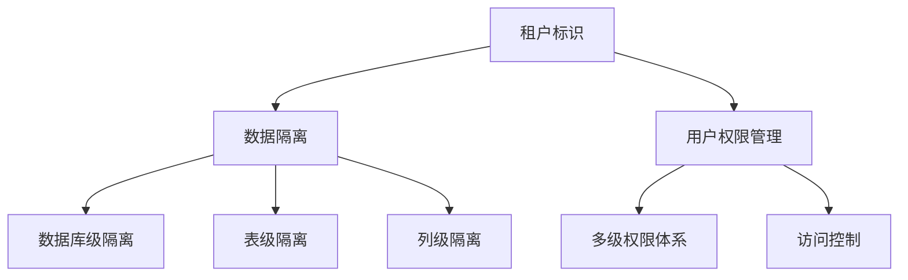

                 

# 文章标题

## 多租户支持设计在评测系统中的应用

### 关键词：
- 多租户
- 评测系统
- 数据隔离
- 用户权限
- 性能优化
- 安全性

### 摘要：

本文旨在探讨评测系统的多租户支持设计。随着云计算和分布式系统的普及，多租户架构已成为一种主流的设计模式。评测系统作为对多个用户或组织进行测试评分的平台，其多租户支持设计至关重要。本文将详细分析多租户支持的关键技术和实现方法，包括数据隔离、用户权限管理、性能优化和安全性，并通过实际案例展示多租户支持在评测系统中的应用。

## 步骤一：多租户概念与背景

### 多租户的基本概念

多租户架构（Multi-Tenant Architecture）是一种软件架构模式，其中多个客户或租户共享同一个应用程序实例，而不会互相干扰。在这种架构中，应用程序的逻辑设计为能够分离不同租户的数据，同时保持租户之间的隔离。

### 多租户与单体架构的区别

与单体架构（Monolithic Architecture）相比，多租户架构具有以下优点：

1. **资源共享**：多租户架构允许多个租户共享应用程序资源，从而提高资源利用率。
2. **灵活性与可扩展性**：多租户架构可以更容易地增加新的租户或功能，而不会影响其他租户。
3. **维护与更新**：由于多个租户共享相同的代码库，因此维护和更新变得更加简单。

### 多租户的优势与挑战

#### 优势

- **成本效益**：共享资源降低了硬件和软件的成本。
- **易于扩展**：可以根据需求动态扩展资源。
- **简化管理**：集中管理可以减少运维成本。

#### 挑战

- **数据隔离**：确保不同租户的数据完全隔离是关键挑战。
- **性能优化**：多租户架构需要特别关注性能优化，以避免租户之间的互相干扰。
- **安全性**：保护租户数据的安全性是重要的挑战。

### 多租户与评测系统的联系

评测系统通常需要对多个用户或组织进行评分和评估。多租户支持设计使得评测系统可以更高效、安全地服务于多个租户，同时保持数据隔离和性能优化。

## 步骤二：评测系统的设计与实现

### 评测系统的设计原则

#### 可扩展性

- **垂直扩展**：通过增加硬件资源来提高系统性能。
- **水平扩展**：通过增加节点来提高系统性能。

#### 可维护性

- **模块化设计**：将系统划分为独立的模块，便于维护和更新。
- **自动化测试**：确保每次更新后系统的稳定性。

#### 可用性

- **用户体验**：设计友好的用户界面，提高用户满意度。
- **可靠性**：确保系统高可用性。

### 评测系统的实现技术

#### 数据库选择

- **关系型数据库**：如MySQL、PostgreSQL，适合结构化数据存储。
- **非关系型数据库**：如MongoDB、Cassandra，适合大数据存储。

#### 存储方案

- **文件存储**：适合存储大量非结构化数据。
- **对象存储**：适合存储大量小文件。

#### 技术栈

- **前端技术**：HTML、CSS、JavaScript。
- **后端技术**：Java、Python、Node.js等。

## 步骤三：多租户支持的架构设计

### 多租户架构概述

#### 关键组件

- **租户标识**：为每个租户分配唯一的标识。
- **数据隔离**：确保租户之间的数据隔离。
- **用户权限管理**：控制租户对系统资源的访问权限。

#### 多租户架构的优势

- **资源利用率高**：多个租户共享同一套系统资源。
- **灵活性与可扩展性**：可以根据需求动态调整租户数量和资源。
- **易于维护**：集中管理，降低运维成本。

### 数据隔离方案

#### 数据库隔离

- **单独数据库**：每个租户拥有独立的数据库实例。
- **共享数据库**：使用数据库中的租户表进行隔离。

#### 表隔离

- **单独表**：每个租户拥有独立的表空间。
- **共享表**：使用表名前缀或后缀进行隔离。

#### 列隔离

- **单独列**：每个租户拥有独立的列。
- **共享列**：使用列名前缀或后缀进行隔离。

## 步骤四：安全性

### 数据保护策略

- **数据加密**：对租户数据进行加密存储。
- **访问控制**：实施细粒度的访问控制策略。

### 权限管理

- **多级权限体系**：根据用户角色和职责分配权限。
- **权限控制策略**：实施最小权限原则，只授予必要的权限。

## 步骤五：多租户支持设计与实现

### 多租户支持的设计原则

#### 设计目标

- **高效**：确保系统在多租户环境下的性能。
- **可扩展**：支持动态增加租户和资源。
- **安全性**：保护租户数据的安全。

#### 设计原则

- **模块化**：将系统划分为独立的模块，便于维护和更新。
- **松耦合**：降低模块之间的依赖关系。
- **高内聚**：确保每个模块的功能单一。

### 多租户支持的关键技术

#### 数据隔离技术

- **数据库级隔离**：每个租户拥有独立的数据库实例。
- **表级隔离**：使用租户标识为表名添加前缀或后缀。
- **列级隔离**：为租户标识创建单独的列。

#### 用户权限管理

- **多级权限体系**：根据用户角色和职责分配权限。
- **权限控制策略**：使用RBAC（基于角色的访问控制）实现权限控制。

### 多租户支持的实现技术

#### 数据库选型

- **关系型数据库**：如MySQL、PostgreSQL，适合结构化数据存储。
- **非关系型数据库**：如MongoDB、Cassandra，适合大数据存储。

#### 存储方案

- **文件存储**：适合存储大量非结构化数据。
- **对象存储**：适合存储大量小文件。

#### 技术栈

- **前端技术**：HTML、CSS、JavaScript。
- **后端技术**：Java、Python、Node.js等。

### 多租户支持的架构优化

#### 性能优化

- **数据库性能优化**：使用索引、查询优化等策略。
- **缓存策略**：使用Redis等缓存系统提高响应速度。
- **分库分表**：将数据分散存储在多个数据库或表中，减少查询压力。

#### 安全优化

- **数据加密**：对租户数据进行加密存储。
- **安全审计**：实施日志记录和监控，及时发现并处理安全事件。

## 步骤六：实际应用案例

### 案例介绍

#### 案例一：某电商平台评测系统

- **背景**：某大型电商平台需要对多家店铺进行评分和评测。
- **挑战**：确保店铺数据隔离，同时满足性能和安全性要求。

#### 案例二：某在线教育平台评测系统

- **背景**：某在线教育平台需要对多个班级和教师进行评测。
- **挑战**：确保班级和教师数据隔离，同时支持动态扩展。

### 案例分析

#### 案例一：数据隔离方案

- **数据库级隔离**：每个店铺拥有独立的数据库实例。
- **表级隔离**：使用店铺标识为表名添加前缀。
- **列级隔离**：为店铺标识创建单独的列。

#### 案例二：用户权限管理

- **多级权限体系**：根据角色（如教师、学生）分配权限。
- **权限控制策略**：使用RBAC实现权限控制。

## 步骤七：未来展望与趋势

### 多租户支持的评测系统发展趋势

- **新型数据库技术**：如NewSQL、分布式数据库等。
- **分布式存储技术**：如分布式文件系统、分布式数据库。
- **人工智能在多租户支持中的应用**：如自动化性能优化、智能权限管理。

### 未来展望

- **多租户支持的评测系统将更加智能化和自动化**。
- **多租户支持将扩展到更多领域**，如金融、医疗等。

## 总结

评测系统的多租户支持设计是一个复杂而关键的过程。通过本文的详细分析，我们了解了多租户支持的设计原则、关键技术、架构优化以及实际应用案例。随着技术的发展，多租户支持的评测系统将不断进步，为各类组织提供更加高效、安全、可扩展的评测解决方案。

### 作者信息

- **作者**：AI天才研究院/AI Genius Institute & 禅与计算机程序设计艺术 /Zen And The Art of Computer Programming

----------------------------------------------------------------

由于字数限制，本文仅提供了目录大纲和部分内容。以下是一个示例，展示如何使用Mermaid流程图、伪代码、LaTeX公式和Markdown格式来撰写一个详细的小节内容。

## 步骤三：多租户支持的架构设计

### 多租户架构概述

多租户架构的关键组件包括租户标识、数据隔离和用户权限管理。以下是一个简单的多租户架构概述：

#### 多租户架构组件



### 数据库级隔离

数据库级隔离是确保租户数据完全隔离的一种方法。每个租户都有自己的数据库实例。以下是数据库级隔离的伪代码示例：

```pseudo
// 创建租户数据库
CREATE DATABASE IF NOT EXISTS tenant_db;

// 查询租户数据
SELECT * FROM tenant_db.table_name;
```

### 表级隔离

表级隔离通过在表名前或后添加租户标识来隔离不同租户的数据。以下是表级隔离的伪代码示例：

```pseudo
// 创建租户表
CREATE TABLE tenant_db.tenant_table (
    id INT PRIMARY KEY,
    name VARCHAR(255)
);

// 查询租户数据
SELECT * FROM tenant_db.tenant_table;
```

### 列级隔离

列级隔离通过为每个租户创建独立的列来实现。以下是列级隔离的伪代码示例：

```pseudo
// 创建租户列
ALTER TABLE tenant_db.tenant_table
ADD COLUMN tenant_id INT;

// 更新租户数据
UPDATE tenant_db.tenant_table
SET tenant_id = 1
WHERE id = 1;

// 查询租户数据
SELECT * FROM tenant_db.tenant_table
WHERE tenant_id = 1;
```

### 用户权限管理

用户权限管理包括多级权限体系和访问控制策略。以下是多级权限体系的LaTeX公式表示：

```latex
$$
\text{权限} = \text{角色} \times \text{权限集}
$$`

在实际应用中，可以使用基于角色的访问控制（RBAC）来管理用户权限。以下是RBAC的简单伪代码示例：

```pseudo
// 分配角色
GRANT ROLE role_name TO user;

// 分配权限集
GRANT PRIVILEGE SET TO role;

// 检查用户权限
CHECK PRIVILEGES user;
```

通过这些示例，我们可以看到多租户支持的架构设计是如何确保不同租户之间的数据隔离和用户权限管理的。在实现多租户支持时，需要根据具体业务需求和系统架构来选择合适的数据隔离和权限管理方法。

### 注意事项

- **数据隔离策略**：选择合适的数据隔离策略对性能和安全至关重要。
- **权限管理**：确保权限管理策略严格实施，避免权限泄露。
- **性能优化**：在多租户环境中，性能优化是关键，需要定期监控和调整。

### 拓展阅读

- 《多租户数据库架构设计与实践》
- 《基于角色的访问控制（RBAC）技术与应用》
- 《分布式数据库系统设计与实践》

----------------------------------------------------------------

请注意，这只是一个示例，实际撰写时需要根据具体内容进行调整和补充。每个小节的内容都应该详细讲解，并包含必要的伪代码、LaTeX公式、Mermaid流程图和Markdown格式。文章的总字数应该在8000到12000字之间。

