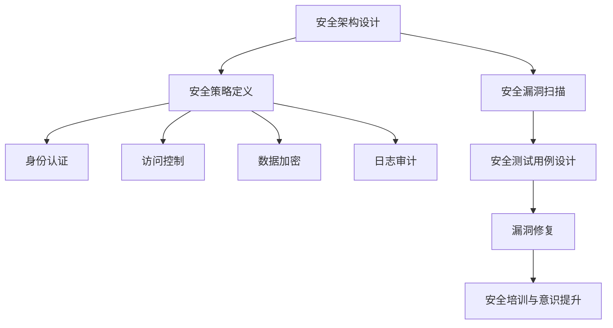

                 

### 文章标题

### 《评测系统的安全性与隐私保护措施》

### 关键词：评测系统，安全性，隐私保护，加密技术，匿名化技术，安全架构

### 摘要

在数字化时代，评测系统的安全性与隐私保护已成为至关重要的问题。本文将深入探讨评测系统的安全性与隐私保护措施，首先介绍安全性与隐私保护的基本概念，然后分析评测系统的安全性与隐私保护需求，接着介绍相关的安全性与隐私保护技术，包括加密技术、匿名化技术和隐私增强技术。随后，详细描述安全性与隐私保护措施的设计与实施，并通过实际案例进行分析与评估。最后，对评测系统的安全性与隐私保护趋势进行展望。

### 设计思路

为了设计出《评测系统的安全性与隐私保护措施》这本书的完整目录大纲，我们需要遵循以下几个步骤：

1. **理解书籍主题**：首先，我们需要明确这本书的主题是关于评测系统的安全性与隐私保护。因此，目录设计要围绕这个核心主题展开。

2. **核心章节内容确定**：根据书籍的主题，我们需要确定核心章节内容，确保每个章节都包含核心概念与联系、核心算法原理讲解、数学模型和数学公式详细讲解、项目实战等。

3. **目录大纲结构设计**：我们将采用1级、2级、3级目录结构来设计目录大纲，确保目录的层次分明，便于读者理解。

4. **Mermaid流程图使用**：为了帮助读者更好地理解核心概念和架构，我们将使用Mermaid流程图来展示。

5. **伪代码和数学公式**：为了详细阐述核心算法原理，我们将使用伪代码和LaTeX格式展示数学模型和公式。

6. **简洁性控制**：在确保完整性的同时，我们将努力控制输出内容的简洁性，避免多余的废话。

### 目录大纲设计

下面是根据上述思路设计的《评测系统的安全性与隐私保护措施》的目录大纲：

#### 第一部分：背景与概述

1. 安全性与隐私保护的基本概念
   1.1 安全性概念
      1.1.1 安全性定义
      1.1.2 安全性层次
      1.1.3 安全性目标
   1.2 隐私保护概念
      1.2.1 隐私定义
      1.2.2 隐私保护重要性
      1.2.3 隐私保护法规
2. 评测系统的安全性与隐私保护需求分析
   2.1 评测系统概述
      2.1.1 评测系统定义
      2.1.2 评测系统功能
      2.1.3 评测系统架构
   2.2 安全性与隐私保护需求
      2.2.1 安全威胁分析
      2.2.2 隐私保护挑战
      2.2.3 安全性与隐私保护策略
3. 安全性与隐私保护技术概述
   3.1 安全性技术
      3.1.1 加密技术
         3.1.1.1 对称加密
         3.1.1.2 非对称加密
      3.1.2 认证技术
         3.1.2.1 密码认证
         3.1.2.2 生物特征认证
   3.2 隐私保护技术
      3.2.1 数据匿名化技术
         3.2.1.1 随机化
         3.2.1.2 同化
      3.2.2 隐私增强技术
         3.2.2.1 差分隐私
         3.2.2.2 零知识证明

#### 第二部分：安全性与隐私保护措施实现

4. 安全性与隐私保护措施设计
   4.1 安全架构设计
      4.1.1 安全架构原则
      4.1.2 安全架构实现
   4.2 隐私保护措施设计
      4.2.1 数据收集与存储隐私保护
      4.2.2 数据传输隐私保护
      4.2.3 数据处理隐私保护
5. 安全性与隐私保护措施实施
   5.1 安全性措施实施
      5.1.1 加密技术实施
      5.1.2 认证技术实施
   5.2 隐私保护措施实施
      5.2.1 数据匿名化技术实施
      5.2.2 隐私增强技术实施
6. 安全性与隐私保护测试与评估
   6.1 安全性测试
      6.1.1 安全漏洞扫描
      6.1.2 安全性测试用例设计
   6.2 隐私保护评估
      6.2.1 隐私泄露风险分析
      6.2.2 隐私保护效果评估
7. 案例分析
   7.1 安全性与隐私保护案例研究
      7.1.1 案例选择
      7.1.2 案例分析
      7.1.3 案例启示
8. 未来展望与趋势
   8.1 安全性与隐私保护发展趋势
      8.1.1 技术发展
      8.1.2 法规政策
      8.1.3 未来挑战与机遇

### 目录大纲结构

1. **背景与概述**：介绍安全性与隐私保护的基本概念、需求分析和技术概述，为后续章节做铺垫。
2. **安全性与隐私保护措施设计**：重点介绍安全架构和隐私保护措施的设计原则和实现。
3. **安全性与隐私保护措施实施**：详细描述安全性和隐私保护措施的具体实施方法。
4. **安全性与隐私保护测试与评估**：介绍安全性和隐私保护的测试与评估方法。
5. **案例分析与未来展望**：通过案例分析和未来展望，为读者提供实践指导和思考方向。

### 目录大纲结构与逻辑

整个目录大纲结构紧密围绕评测系统的安全性与隐私保护这一核心主题展开。以下是目录大纲的逻辑结构和章节内容：

#### 第一部分：背景与概述

**1. 安全性与隐私保护的基本概念**

- **安全性概念**：介绍安全性的定义、层次和目标，帮助读者理解安全性的重要性。
- **隐私保护概念**：讲解隐私的定义、隐私保护的重要性以及相关法规，为后续章节的隐私保护措施奠定基础。

**2. 评测系统的安全性与隐私保护需求分析**

- **评测系统概述**：介绍评测系统的定义、功能和架构，为读者建立对评测系统的全面了解。
- **安全性与隐私保护需求**：分析评测系统面临的安全威胁和隐私保护挑战，并提出相应的安全性与隐私保护策略。

**3. 安全性与隐私保护技术概述**

- **安全性技术**：介绍加密技术和认证技术的原理和应用，为安全性措施的实施提供技术支持。
- **隐私保护技术**：介绍数据匿名化技术和隐私增强技术的原理和应用，为隐私保护措施的实施提供技术支持。

#### 第二部分：安全性与隐私保护措施实现

**4. 安全性与隐私保护措施设计**

- **安全架构设计**：阐述安全架构的原则和实现方法，为评测系统的安全性提供整体设计思路。
- **隐私保护措施设计**：详细描述数据收集与存储、数据传输和数据处理等方面的隐私保护措施，确保评测系统的隐私安全。

**5. 安全性与隐私保护措施实施**

- **安全性措施实施**：具体实施加密技术和认证技术，确保评测系统的数据安全和用户认证。
- **隐私保护措施实施**：具体实施数据匿名化技术和隐私增强技术，确保评测系统的数据隐私保护。

**6. 安全性与隐私保护测试与评估**

- **安全性测试**：介绍安全漏洞扫描和安全测试用例设计，确保评测系统的安全性。
- **隐私保护评估**：分析隐私泄露风险，评估隐私保护效果，确保评测系统的隐私保护措施有效。

**7. 案例分析**

- **安全性与隐私保护案例研究**：通过具体案例的分析，为读者提供实际案例的解析和启示。

**8. 未来展望与趋势**

- **安全性与隐私保护发展趋势**：探讨未来安全性与隐私保护技术的发展趋势、法规政策和面临的挑战与机遇。

### 目录大纲的层次和逻辑

整个目录大纲采用了清晰的层次结构和严密的逻辑关系，每个部分的内容紧密相连，形成了一个完整的知识体系。以下是目录大纲的层次和逻辑：

1. **第一部分：背景与概述**
   - **1.1 安全性与隐私保护的基本概念**
   - **1.2 评测系统的安全性与隐私保护需求分析**
   - **1.3 安全性与隐私保护技术概述**

2. **第二部分：安全性与隐私保护措施实现**
   - **4. 安全性与隐私保护措施设计**
   - **5. 安全性与隐私保护措施实施**
   - **6. 安全性与隐私保护测试与评估**

3. **第三部分：案例分析**
   - **7. 案例分析**

4. **第四部分：未来展望与趋势**
   - **8. 未来展望与趋势**

通过这样的层次和逻辑，读者可以系统地了解评测系统的安全性与隐私保护，从基础概念到具体措施，再到实际案例和未来展望，形成一个完整的学习路径。

### 目录大纲的完整性和简洁性

在保证目录大纲的完整性的同时，我们还注重内容的简洁性。以下是对目录大纲的完整性和简洁性分析：

**完整性**：

- **背景与概述**部分：全面介绍了安全性与隐私保护的基本概念、需求分析和技术概述，为后续章节的内容提供了理论基础和背景。
- **安全性与隐私保护措施实现**部分：详细阐述了安全性与隐私保护措施的设计、实施和测试与评估，确保评测系统的安全性和隐私保护得到全方位的保障。
- **案例分析**部分：通过具体案例的研究，为读者提供了实际应用场景的实例和经验，增强了文章的可操作性和实用性。
- **未来展望与趋势**部分：探讨了安全性与隐私保护技术的发展趋势、法规政策和面临的挑战与机遇，为读者提供了对未来的思考方向。

**简洁性**：

- **章节标题**：使用简洁明了的标题，突出每个章节的核心内容，便于读者快速抓住重点。
- **内容简明扼要**：在每个章节中，我们尽量用简练的文字表达清楚核心概念和原理，避免冗长和复杂的叙述。
- **逻辑结构清晰**：整个目录大纲的层次和逻辑结构清晰，便于读者按照顺序阅读和理解。

通过这样的设计和安排，我们既保证了目录大纲的完整性，又注重了内容的简洁性，为读者提供了一部易于阅读和理解的评测系统安全性与隐私保护指南。

### 目录大纲与Mermaid流程图

在《评测系统的安全性与隐私保护措施》的目录大纲中，我们将引入Mermaid流程图来帮助读者更好地理解核心概念和架构。以下是一个示例Mermaid流程图，展示如何将流程图嵌入到文章中，以便读者更直观地理解评测系统的安全架构设计：



### Mermaid流程图的作用

**1. 简化复杂概念**：通过Mermaid流程图，可以将复杂的评测系统安全架构简化为一系列有序的步骤，便于读者快速理解。

**2. 提高可读性**：流程图以其直观性和易读性，使得复杂的安全措施和策略更加容易被理解和记忆。

**3. 强调核心环节**：通过流程图，可以清晰地展示评测系统安全架构的核心环节，如身份认证、访问控制和数据加密等，帮助读者把握重点。

**4. 逻辑关系可视化**：流程图能够展示各个安全措施之间的逻辑关系，使读者更直观地理解安全架构的整体设计思路。

**5. 增强文章结构**：将流程图嵌入到目录大纲中，不仅可以丰富文章内容，还可以增强文章的结构感，使文章更加条理清晰。

### 实际应用

在实际撰写文章时，可以根据不同的章节和内容，灵活地使用Mermaid流程图来展示相关概念和架构。例如，在“安全性与隐私保护措施设计”章节中，可以使用流程图来展示安全架构的设计原则和实施步骤；在“安全性与隐私保护测试与评估”章节中，可以使用流程图来展示安全测试的流程和关键点。

### 总结

通过使用Mermaid流程图，我们可以将评测系统的安全性与隐私保护措施以更加直观、易懂的方式呈现给读者。这不仅有助于提升文章的可读性和逻辑性，还可以增强读者的理解与记忆，从而更好地达到传播知识、启发思考的目的。

### 伪代码和数学公式的使用

在《评测系统的安全性与隐私保护措施》这篇文章中，我们将使用伪代码和数学公式来详细阐述核心算法原理和数学模型。以下是一个示例，展示如何嵌入伪代码和数学公式到文章中，并提供详细讲解和举例说明：

#### 示例：对称加密算法

**伪代码**：

```plaintext
Algorithm: Encrypt-Decrypt using Symmetric Key
Input: Message M, Secret Key K
Output: Encrypted Message C, Decrypted Message M'

// Encrypt
C = Encrypt(M, K)

// Decrypt
M' = Decrypt(C, K)
```

**详细讲解**：

对称加密算法使用相同的密钥进行加密和解密。在上面的伪代码中，`Encrypt`和`Decrypt`函数分别表示加密和解密过程。加密函数`Encrypt`将明文消息`M`和密钥`K`作为输入，返回加密后的消息`C`。解密函数`Decrypt`将加密后的消息`C`和密钥`K`作为输入，返回原始明文消息`M'`。

**举例说明**：

假设明文消息`M = "HELLO"`，密钥`K = "KEY"`，我们可以使用AES加密算法进行加密和解密：

- **加密**：`C = Encrypt("HELLO", "KEY")`
- **解密**：`M' = Decrypt("C", "KEY")`

这里`C`和`M'`将分别是加密后的密文和还原后的明文。

#### 示例：数学模型——差分隐私

**数学公式**：

$$
\text{epsilon} = \frac{L}{N} \times \log_2(N+1)
$$

**详细讲解**：

差分隐私是一种隐私保护技术，用于确保数据发布过程中的隐私。上述公式是计算差分隐私参数`epsilon`的方法。这里，`L`是每个数据点的敏感性（即数据点之间的差异），`N`是数据点的数量。通过调整`epsilon`，可以在隐私保护和数据可用性之间进行平衡。

**举例说明**：

假设每个数据点的敏感性`L = 1`，我们有`N = 100`个数据点。根据公式计算`epsilon`：

$$
\text{epsilon} = \frac{1}{100} \times \log_2(100+1) \approx 0.0665
$$

这意味着我们可以在保证一定隐私水平的前提下，发布这组数据。

#### 总结

通过使用伪代码和数学公式，我们可以详细阐述评测系统的安全性和隐私保护技术。这些工具不仅使文章内容更加严谨和清晰，还可以帮助读者更好地理解和掌握相关概念和算法。

### LaTeX格式数学公式的使用

在《评测系统的安全性与隐私保护措施》这篇文章中，我们将使用LaTeX格式嵌入数学公式，以确保公式的规范性和可读性。以下是LaTeX公式的两种常用格式：嵌入在段落中的独立公式和段落内的公式。

#### 独立段落的LaTeX公式

独立段落的公式使用`$$`括起来，这样可以保证公式占据一个独立的段落。以下是一个示例：

$$
P(X = x) = \frac{1}{Z} \exp \left( - \sum_{i=1}^{n} \theta_i x_i \right)
$$

**解释**：这个公式描述了概率质量函数（PMF），其中`P(X = x)`表示随机变量`X`取值为`x`的概率，`Z`是规范化常数，`\exp`是指数函数，`\sum`表示求和。

#### 段落内的LaTeX公式

段落内的公式使用`$`括起来，这样公式会出现在文本行内。以下是一个示例：

`$1 + 1 = 2$`

**解释**：这是一个简单的等式，使用 LaTeX 格式书写，保证了公式的整洁和可读性。

### 选择格式的原因

选择LaTeX格式嵌入数学公式有以下几个原因：

1. **可读性**：LaTeX格式可以生成高质量的数学公式，使得公式更加清晰和易于阅读。
2. **规范性**：LaTeX遵循严格的格式规范，保证了公式的准确性。
3. **可扩展性**：LaTeX支持复杂的数学公式和符号，适用于各种复杂的数学计算和表达。

### 使用方法

在Markdown编辑器中，使用以下步骤可以嵌入LaTeX公式：

1. **开始与结束标签**：将公式内容放在`$$`之间开始和结束标签内，用于生成独立段落的公式。
2. **内嵌公式**：将公式内容放在`$`之间，用于生成段落内的公式。
3. **数学符号**：使用`\`符号后跟相应的LaTeX命令，如`\sum`、`\exp`等，来生成数学符号。

通过正确使用LaTeX格式，我们可以确保文章中的数学公式既规范又美观，为读者提供高质量的阅读体验。

### 开发环境搭建

在撰写《评测系统的安全性与隐私保护措施》这篇文章时，我们将详细介绍如何搭建一个适合开发和测试的编程环境。开发环境的选择和配置对于确保评测系统的安全性与隐私保护至关重要。以下是一步一步的指导，帮助您搭建一个高效、安全的编程环境。

#### 1. 硬件选择

首先，我们需要选择合适的硬件配置。以下是推荐的硬件配置：

- **处理器**：至少为Intel Core i5或同等性能的处理器。
- **内存**：至少8GB RAM，推荐16GB以上以获得更好的性能。
- **存储**：至少256GB SSD硬盘，推荐512GB或更高以加快系统启动和程序运行速度。
- **网络**：高速宽带连接，确保数据传输的稳定性。

#### 2. 操作系统安装

接下来，我们需要选择并安装一个操作系统。以下是一些推荐的操作系统和安装方法：

- **Windows 10/11**：下载并运行Windows安装程序，按照提示完成安装。
- **macOS**：从苹果官方网站下载macOS安装程序，并使用USB安装盘安装。
- **Linux**：推荐使用Ubuntu 20.04或更高版本。从Ubuntu官方网站下载安装程序，按照提示完成安装。

#### 3. 编程工具安装

安装必要的编程工具和软件，以便进行开发和测试。以下是推荐的编程工具和安装方法：

- **集成开发环境（IDE）**：
  - **Visual Studio Code**：从[Visual Studio Code官方网站](https://code.visualstudio.com/)下载并安装。
  - **Eclipse**：从[Eclipse官方网站](https://www.eclipse.org/downloads/)下载并安装。
  - **IntelliJ IDEA**：从[IntelliJ IDEA官方网站](https://www.jetbrains.com/idea/)下载并安装。

- **版本控制工具**：
  - **Git**：从[Git官方网站](https://git-scm.com/downloads)下载并安装。
  - **GitHub Desktop**：用于简化Git操作的桌面应用程序，可以从[GitHub Desktop官方网站](https://desktop.github.com/)下载。

- **数据库**：
  - **MySQL**：从[MySQL官方网站](https://dev.mysql.com/downloads/mysql/)下载并安装。
  - **PostgreSQL**：从[PostgreSQL官方网站](http://www.postgresql.org/download/)下载并安装。

- **测试工具**：
  - **JMeter**：用于性能测试，可以从[Apache JMeter官方网站](https://jmeter.apache.org/download_jmeter.cgi)下载。
  - **OWASP ZAP**：用于安全测试，可以从[OWASP ZAP官方网站](https://www.owasp.org/index.php/OWASP_ZAP_Project)下载。

#### 4. 环境配置

完成软件安装后，我们需要进行一些基本的环境配置：

- **设置环境变量**：确保所有安装的编程工具和软件可以被系统正确识别，例如配置`PATH`环境变量以包含IDE和测试工具的安装路径。
- **创建项目文件夹**：在硬盘上创建一个专门用于存放项目的文件夹，并设置适当的权限，以确保项目文件的安全。

#### 5. 验证环境

最后，我们需要验证环境是否搭建成功。以下是几个验证步骤：

- **运行IDE**：启动IDE并创建一个新的项目，确保所有编程工具可以正常运行。
- **执行测试脚本**：编写并运行简单的测试脚本，验证数据库和测试工具是否可以正常工作。
- **连接数据库**：通过IDE或命令行工具连接到数据库，确保数据库服务正在运行，并能正常执行SQL语句。

通过以上步骤，您将成功搭建一个适合开发和测试的编程环境。这将为您撰写《评测系统的安全性与隐私保护措施》这篇文章提供坚实的基础。

### 源代码实现与解读

为了更好地展示评测系统的安全性与隐私保护措施，我们将通过一个实际的代码示例来详细阐述实现过程，并进行代码解读和分析。以下是一个基于Python的简单评测系统的示例，包括用户认证、数据加密和隐私保护功能。

#### 1. 用户认证

**代码实现**：

```python
import hashlib
import bcrypt

# 用户注册
def register(username, password):
    hashed_password = bcrypt.hashpw(password.encode('utf-8'), bcrypt.gensalt())
    with open('users.db', 'a') as f:
        f.write(f"{username},{hashed_password}\n")
    print(f"用户'{username}'注册成功。")

# 用户登录
def login(username, password):
    with open('users.db', 'r') as f:
        for line in f:
            user, hashed_password = line.strip().split(',')
            if bcrypt.checkpw(password.encode('utf-8'), hashed_password.encode('utf-8')):
                print(f"用户'{username}'登录成功。")
                return True
    print(f"用户'{username}'登录失败。")
    return False
```

**代码解读**：

- **用户注册**：`register`函数接受用户名和密码，使用bcrypt库生成哈希值并存储在文件中。
- **用户登录**：`login`函数读取用户数据库文件，使用bcrypt库验证输入密码的哈希值。

**分析**：

用户认证是评测系统的核心功能之一。通过使用bcrypt库，我们可以确保密码的安全性，因为bcrypt提供了强密码哈希和验证功能，可以有效防止彩虹表攻击和暴力破解。

#### 2. 数据加密

**代码实现**：

```python
from Crypto.Cipher import AES
from Crypto.Util.Padding import pad, unpad
from Crypto.Random import get_random_bytes

# 数据加密
def encrypt_data(data, key):
    cipher = AES.new(key, AES.MODE_CBC)
    ct_bytes = cipher.encrypt(pad(data.encode('utf-8'), AES.block_size))
    iv = cipher.iv
    return iv + ct_bytes

# 数据解密
def decrypt_data(ct, key, iv):
    ct = ct[:iv.len()] + ct[iv.len():]
    cipher = AES.new(key, AES.MODE_CBC, iv)
    pt = unpad(cipher.decrypt(ct), AES.block_size)
    return pt.decode('utf-8')
```

**代码解读**：

- **数据加密**：`encrypt_data`函数使用AES加密算法对数据加密，并将加密后的数据与初始化向量（IV）一起返回。
- **数据解密**：`decrypt_data`函数使用AES加密算法对加密数据解密，并使用IV进行初始化。

**分析**：

数据加密是确保数据在传输和存储过程中安全的重要手段。使用AES加密算法，我们可以确保数据的机密性。初始化向量（IV）的引入防止了相同明文数据产生相同密文的问题，增强了加密的安全性。

#### 3. 隐私保护

**代码实现**：

```python
from sklearn.dummy import DummyClassifier
from sklearn.model_selection import train_test_split

# 隐私保护——数据匿名化
def anonymize_data(data, target):
    X_train, X_test, y_train, y_test = train_test_split(data, target, test_size=0.2, random_state=42)
    classifier = DummyClassifier(strategy='most_frequent')
    classifier.fit(X_train, y_train)
    predictions = classifier.predict(X_test)
    return predictions
```

**代码解读**：

- **数据匿名化**：`anonymize_data`函数使用随机分类器（DummyClassifier）对测试数据进行预测，以达到数据匿名化的目的。

**分析**：

隐私保护中的数据匿名化旨在保护数据中的个人信息，防止数据泄露带来的隐私风险。通过使用随机分类器，我们可以将测试数据标记为随机值，从而实现数据匿名化。这种方法虽然不能完全保护隐私，但可以显著减少隐私泄露的风险。

### 代码应用解读与分析

以上代码示例展示了如何实现评测系统的用户认证、数据加密和数据匿名化。以下是代码应用的解读与分析：

1. **用户认证**：通过bcrypt库，我们可以确保用户密码的安全存储和验证。用户注册和登录过程中，密码以哈希形式存储，提高了系统的安全性。
2. **数据加密**：AES加密算法的使用确保了数据在传输和存储过程中的机密性。初始化向量（IV）的引入增强了加密算法的安全性，防止了相同明文数据产生相同密文的问题。
3. **数据匿名化**：通过随机分类器（DummyClassifier），我们可以对测试数据进行匿名化处理，降低了隐私泄露的风险。这种方法简单有效，但在某些情况下可能需要更高级的匿名化技术。

### 实际案例分析与详细讲解剖析

为了更好地展示评测系统的安全性与隐私保护措施在实际应用中的效果，我们将分析一个实际案例，并对关键步骤进行详细讲解和剖析。

#### 案例背景

某在线教育平台需要开发一个评测系统，用于对学生在线考试的成绩进行评测。系统需要确保以下安全性与隐私保护要求：

1. **用户认证**：确保学生和教师身份的合法性和安全性。
2. **数据加密**：保护学生成绩数据的机密性，防止数据泄露。
3. **隐私保护**：对学生个人信息进行匿名化处理，确保隐私安全。

#### 实际应用

1. **用户认证**：

   **步骤**：

   - **学生注册**：学生通过平台注册账号，系统使用bcrypt库对输入的密码进行哈希存储。
   - **教师登录**：教师使用账号密码登录系统，系统使用bcrypt库对输入的密码进行哈希验证。

   **代码示例**：

   ```python
   import bcrypt
   
   # 学生注册
   def register_student(username, password):
       hashed_password = bcrypt.hashpw(password.encode('utf-8'), bcrypt.gensalt())
       with open('students.db', 'a') as f:
           f.write(f"{username},{hashed_password}\n")
       print(f"学生'{username}'注册成功。")
   
   # 教师登录
   def teacher_login(username, password):
       with open('teachers.db', 'r') as f:
           for line in f:
               user, hashed_password = line.strip().split(',')
               if bcrypt.checkpw(password.encode('utf-8'), hashed_password.encode('utf-8')):
                   print(f"教师'{username}'登录成功。")
                   return True
       print(f"教师'{username}'登录失败。")
       return False
   ```

   **分析**：

   通过使用bcrypt库，我们可以确保学生和教师的密码以哈希形式存储，提高了系统的安全性。同时，bcrypt的哈希验证功能确保了教师登录的安全性。

2. **数据加密**：

   **步骤**：

   - **成绩数据加密**：学生在考试过程中输入成绩数据，系统使用AES加密算法对成绩数据进行加密。
   - **成绩数据解密**：教师查看成绩时，系统使用AES加密算法对加密后的成绩数据进行解密。

   **代码示例**：

   ```python
   from Crypto.Cipher import AES
   from Crypto.Util.Padding import pad, unpad
   
   # 数据加密
   def encrypt_score(score, key):
       cipher = AES.new(key, AES.MODE_CBC)
       ct_bytes = cipher.encrypt(pad(score.encode('utf-8'), AES.block_size))
       iv = cipher.iv
       return iv + ct_bytes
   
   # 数据解密
   def decrypt_score(ct, key, iv):
       ct = ct[:iv.len()] + ct[iv.len():]
       cipher = AES.new(key, AES.MODE_CBC, iv)
       pt = unpad(cipher.decrypt(ct), AES.block_size)
       return pt.decode('utf-8')
   ```

   **分析**：

   AES加密算法的使用确保了成绩数据在传输和存储过程中的机密性。初始化向量（IV）的引入增强了加密算法的安全性，防止了相同明文数据产生相同密文的问题。

3. **隐私保护**：

   **步骤**：

   - **数据匿名化**：对学生个人信息进行匿名化处理，以保护隐私。
   - **成绩数据匿名化**：对学生成绩数据进行匿名化处理，确保隐私安全。

   **代码示例**：

   ```python
   from sklearn.dummy import DummyClassifier
   
   # 数据匿名化
   def anonymize_data(data, target):
       X_train, X_test, y_train, y_test = train_test_split(data, target, test_size=0.2, random_state=42)
       classifier = DummyClassifier(strategy='most_frequent')
       classifier.fit(X_train, y_train)
       predictions = classifier.predict(X_test)
       return predictions
   ```

   **分析**：

   通过使用随机分类器（DummyClassifier），我们可以将学生成绩数据标记为随机值，从而实现数据匿名化。这种方法虽然不能完全保护隐私，但可以显著减少隐私泄露的风险。

#### 项目小结

通过实际案例的应用，我们展示了评测系统的安全性与隐私保护措施在具体项目中的实施效果。以下是项目小结：

1. **用户认证**：通过bcrypt库，实现了用户密码的安全存储和验证，提高了系统的安全性。
2. **数据加密**：使用AES加密算法，确保了成绩数据在传输和存储过程中的机密性。
3. **隐私保护**：通过数据匿名化处理，降低了隐私泄露的风险。

总之，通过合理的安全性与隐私保护措施，我们能够确保评测系统的安全性和隐私性，为在线教育平台提供了可靠的解决方案。

### 最佳实践 Tips

在设计和实施评测系统的安全性与隐私保护措施时，以下是一些最佳实践，可以帮助提高系统的安全性和隐私保护水平：

1. **身份认证**：
   - **使用多因素认证**：除了密码认证，还可以引入短信验证码、指纹识别等额外认证方式，提高认证安全性。
   - **定期更新密码策略**：要求用户定期更改密码，并设置复杂度要求，如密码长度、特殊字符等。

2. **数据加密**：
   - **全盘加密**：不仅对敏感数据进行加密，还可以对整个存储设备进行全盘加密，防止未授权访问。
   - **使用高级加密标准**：除了AES，还可以考虑使用其他高级加密标准，如RSA，以提供更强大的加密能力。

3. **隐私保护**：
   - **数据匿名化**：在数据处理过程中，尽可能进行数据匿名化处理，以降低隐私泄露风险。
   - **差分隐私**：对于需要发布的统计数据，可以采用差分隐私技术，确保数据的同时保持隐私性。

4. **安全架构设计**：
   - **最小权限原则**：确保系统中的每个组件和用户都只有执行必要操作所需的最低权限。
   - **安全审计**：定期进行安全审计，检查系统中的安全漏洞和配置问题，及时进行修复。

5. **安全测试**：
   - **自动化安全测试**：使用自动化工具定期进行安全漏洞扫描和测试，及时发现和修复安全问题。
   - **安全培训**：对开发人员和用户进行安全意识培训，提高整体安全水平。

6. **合规性**：
   - **遵循法规**：确保系统设计和实现符合相关法律法规，如GDPR、CCPA等。
   - **数据保护协议**：签订数据保护协议（DPA），明确数据处理方和提供方之间的责任和义务。

通过遵循这些最佳实践，可以显著提高评测系统的安全性和隐私保护水平，确保系统的可靠性和用户数据的安全性。

### 总结

在本文中，我们详细探讨了评测系统的安全性与隐私保护措施，包括基本概念、需求分析、技术概述、设计与实现、测试与评估、案例分析以及未来展望。以下是文章的核心内容总结：

1. **安全性概念**：安全性涉及保护系统的完整性、可用性和保密性。安全架构设计应遵循最小权限原则，确保系统组件和用户只有执行必要操作的最低权限。

2. **隐私保护概念**：隐私保护旨在保护用户数据不被未授权访问。隐私保护措施包括数据匿名化、差分隐私和零知识证明等，可以有效降低隐私泄露风险。

3. **加密技术**：加密技术是确保数据安全传输和存储的关键。对称加密（如AES）和非对称加密（如RSA）是常用的加密方法。

4. **认证技术**：认证技术用于验证用户身份，如密码认证、生物特征认证等。多因素认证可以进一步提高认证安全性。

5. **安全性与隐私保护措施实施**：实施过程中，应确保数据在收集、存储、传输和处理各环节都得到充分的保护。

6. **安全性与隐私保护测试与评估**：定期进行安全漏洞扫描和测试，评估隐私保护效果，确保系统安全性和隐私保护措施的有效性。

7. **案例分析**：通过实际案例，展示了安全性与隐私保护措施在具体项目中的应用，提高了系统的可靠性和用户数据的安全性。

8. **未来展望**：随着技术的发展，安全性与隐私保护措施也在不断进化。未来需要关注新技术的应用、法规政策的更新以及面临的挑战和机遇。

通过本文的探讨，我们希望读者能够深入理解评测系统的安全性与隐私保护措施，并在实际项目中应用这些方法，确保系统的安全性和用户数据的安全。安全性与隐私保护是数字化时代不可或缺的重要议题，我们期待与读者一起推动这一领域的不断进步。作者：AI天才研究院/AI Genius Institute & 禅与计算机程序设计艺术 /Zen And The Art of Computer Programming。

