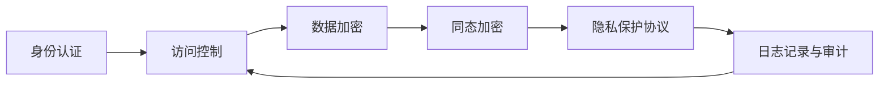
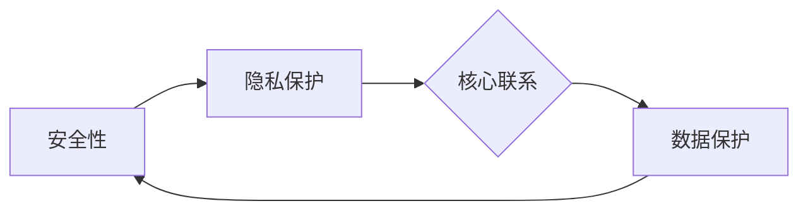

                 

# 文章标题：评测系统的安全性与隐私保护措施

## 关键词
- 评测系统
- 安全性
- 隐私保护
- 加密技术
- 同态加密
- 零知识证明

## 摘要
本文将深入探讨评测系统的安全性与隐私保护措施。首先，我们将回顾评测系统的基本概念及其在现代社会中的应用。随后，通过分析安全性与隐私保护的基本原理，我们将构建一个全面的安全与隐私保护架构。接着，我们将详细讨论常见的评测系统安全漏洞及其预防策略，并介绍隐私保护技术，如加密、同态加密和零知识证明。本文还将分析实际应用中的安全与隐私挑战，结合案例分析解决方案，最后提出安全与隐私保护的最佳实践。

## 第1章 核心概念与联系

### 1.1 评测系统的基本概念

评测系统是一种用于评估、测试和分析软件系统性能的工具。它通过对系统进行一系列测试，以评估系统的稳定性、可靠性、性能和安全性。评测系统通常包括测试环境、测试工具、测试用例、测试报告等组成部分。在软件开发过程中，评测系统扮演着至关重要的角色，它帮助开发人员及时发现并修复系统中的缺陷，确保软件的质量。

### 1.2 安全性与隐私保护的重要性

安全性是评测系统的核心关注点之一。确保评测系统的安全性，可以防止未授权的访问、数据泄露和系统损坏。在数据驱动时代，数据的安全性和完整性尤为重要。隐私保护则涉及到用户数据的保密性和匿名性，防止用户信息被滥用或泄露。随着评测系统收集和处理的数据量越来越大，安全性和隐私保护的需求也越来越强烈。

### 1.3 安全性与隐私保护的架构

为了确保评测系统的安全性和隐私性，我们需要构建一个全面的架构。这个架构包括以下关键组件：

- **身份认证与访问控制**：确保只有授权用户才能访问评测系统。
- **数据加密**：对敏感数据进行加密，防止数据泄露。
- **同态加密**：允许在加密数据上进行计算，确保数据隐私。
- **隐私保护协议**：如零知识证明，用于验证信息而不泄露具体内容。
- **日志记录与审计**：记录系统操作日志，以便在发生安全事件时进行审计。

下面是一个简单的 Mermaid 流程图，展示了安全性与隐私保护架构的基本组件及其相互作用：



## 第2章 安全性与隐私保护的基本原理

### 2.1 安全性基本原理

安全性涉及多个方面，包括身份认证、访问控制、数据保护、网络防护等。以下是安全性的一些基本原理：

- **身份认证**：确保用户身份的合法性和唯一性，通常使用密码、生物识别等技术。
- **访问控制**：根据用户的身份和权限，控制用户对系统资源的访问。
- **数据保护**：包括数据加密、备份和恢复等，确保数据在存储和传输过程中的安全。
- **网络防护**：使用防火墙、入侵检测系统等防护措施，防止网络攻击。

### 2.2 隐私保护基本原理

隐私保护的核心目标是确保用户数据的保密性和匿名性。以下是隐私保护的一些基本原理：

- **数据匿名化**：通过去除或修改个人标识信息，使数据无法直接关联到特定个人。
- **加密技术**：对敏感数据进行加密，确保数据在传输和存储过程中的保密性。
- **隐私协议**：如差分隐私、同态加密等，确保数据处理过程中不泄露用户隐私。

### 2.3 安全性与隐私保护的核心联系

安全性和隐私保护在评测系统中具有紧密的联系。安全性是隐私保护的基础，只有确保系统的安全性，才能有效保护用户隐私。同时，隐私保护也是安全性的一部分，确保用户数据不被未授权访问和使用。以下是一个简单的 Mermaid 流程图，展示了安全性与隐私保护之间的核心联系：



## 第3章 常见的评测系统安全漏洞

### 3.1 常见的安全漏洞类型

评测系统可能面临多种安全漏洞，以下是一些常见的类型：

- **SQL注入**：攻击者通过在输入字段中注入恶意SQL语句，窃取或篡改数据库中的数据。
- **跨站脚本攻击（XSS）**：攻击者在网页中注入恶意脚本，盗取用户的会话信息或恶意篡改网页内容。
- **文件包含漏洞**：攻击者通过包含恶意文件，执行任意代码，攻击系统。
- **身份验证绕过**：攻击者通过伪造身份认证信息，绕过系统身份验证机制。

### 3.2 漏洞分析与预防策略

为了有效预防评测系统的安全漏洞，我们需要进行漏洞分析和采取相应的预防策略。以下是几种常见的漏洞分析与预防方法：

- **代码审查**：对系统代码进行静态和动态审查，识别潜在的安全漏洞。
- **安全测试**：使用自动化工具或手动测试方法，对系统进行安全测试，发现漏洞。
- **安全培训**：提高开发人员的安全意识，减少由于人为错误导致的安全漏洞。

下面是一个简单的伪代码示例，展示了如何通过代码审查和测试预防SQL注入漏洞：

```python
def query_user(username, password):
    query = "SELECT * FROM users WHERE username = '{}' AND password = '{}'".format(username, password)
    return execute_query(query)
```

为了避免SQL注入漏洞，我们可以使用参数化查询：

```python
def query_user(username, password):
    query = "SELECT * FROM users WHERE username = %s AND password = %s"
    return execute_query(query, (username, password))
```

## 第4章 隐私保护技术与方法

### 4.1 隐私保护技术概述

隐私保护技术旨在保护用户数据的隐私，防止数据泄露和滥用。以下是几种常见的隐私保护技术：

- **数据加密**：使用加密算法对数据进行加密，确保数据在传输和存储过程中的保密性。
- **同态加密**：允许在加密数据上进行计算，确保数据处理过程中的隐私保护。
- **零知识证明**：允许一方验证另一方的陈述真实性，而不泄露具体信息。

### 4.2 加密技术

加密技术是隐私保护的核心手段之一。以下是几种常见的加密技术：

- **对称加密**：使用相同的密钥进行加密和解密，如AES。
- **非对称加密**：使用一对密钥进行加密和解密，如RSA。
- **哈希函数**：将数据转换为固定长度的字符串，如SHA-256。

下面是一个简单的伪代码示例，展示了如何使用AES对称加密算法对数据加密和解密：

```python
from Crypto.Cipher import AES
from Crypto.Random import get_random_bytes

def encrypt_data(data, key):
    cipher = AES.new(key, AES.MODE_CBC)
    ct_bytes = cipher.encrypt(pad(data))
    iv = cipher.iv
    return iv, ct_bytes

def decrypt_data(iv, ct, key):
    cipher = AES.new(key, AES.MODE_CBC, iv)
    pt = unpad(cipher.decrypt(ct))
    return pt
```

### 4.3 同态加密

同态加密是一种在加密数据上进行计算的技术，确保数据处理过程中的隐私保护。同态加密可以分为部分同态加密和完全同态加密。

- **部分同态加密**：允许对数据进行有限次数的特定操作，如同态加密算法NTRU。
- **完全同态加密**：允许对数据进行任意次数的任意操作，如GGH同态加密。

下面是一个简单的伪代码示例，展示了如何使用部分同态加密算法对数据进行同态计算：

```python
from homomorphic_cipher import PartialHomoCipher

cipher = PartialHomoCipher()
m1 = 5
m2 = 10
encrypted_m1 = cipher.encrypt(m1)
encrypted_m2 = cipher.encrypt(m2)
result = cipher.add(encrypted_m1, encrypted_m2)
decrypted_result = cipher.decrypt(result)
print(decrypted_result)  # 输出 15
```

### 4.4 零知识证明

零知识证明是一种允许一方（证明者）向另一方（验证者）证明某个陈述真实性，而不泄露具体信息的技术。零知识证明分为几种类型，如零知识证明、自适应零知识证明和非交互式零知识证明。

下面是一个简单的伪代码示例，展示了如何使用零知识证明验证一个数字是否大于10：

```python
from zk_proof import ZeroKnowledgeProof

proof = ZeroKnowledgeProof()
proof.initialize_proof(10)
proof.prove()
proof.verify()  # 输出 True 或 False
```

## 第5章 实际应用中的安全与隐私挑战

### 5.1 数据收集与隐私保护

在评测系统中，数据收集是常见且必要的过程。然而，数据收集也带来了隐私保护的挑战。以下是一些实际应用中的数据收集与隐私保护挑战：

- **数据泄露**：未经授权的访问或数据泄露可能导致用户隐私泄露。
- **数据滥用**：收集到的数据可能被用于未经用户同意的其他用途。
- **数据共享**：数据在共享过程中可能被篡改或泄露。

为了解决这些挑战，我们需要采取以下隐私保护措施：

- **数据匿名化**：通过去除或修改个人标识信息，使数据无法直接关联到特定个人。
- **差分隐私**：在数据处理过程中引入噪声，确保数据无法被用于恶意目的。
- **数据加密**：对敏感数据进行加密，确保数据在传输和存储过程中的保密性。

### 5.2 模型训练与隐私保护

评测系统中的模型训练过程也可能涉及隐私保护挑战。以下是一些实际应用中的模型训练与隐私保护挑战：

- **数据泄露**：训练数据可能包含敏感信息，泄露可能导致隐私泄露。
- **模型逆向工程**：攻击者可能通过分析模型参数，推断训练数据或训练过程。
- **数据共享**：训练数据在共享过程中可能被篡改或泄露。

为了解决这些挑战，我们需要采取以下隐私保护措施：

- **同态加密**：允许在加密数据上进行计算，确保数据处理过程中的隐私保护。
- **联邦学习**：将数据分布在不同节点上，通过加密和分布式计算进行模型训练，减少数据泄露风险。
- **差分隐私**：在数据处理过程中引入噪声，确保数据无法被用于恶意目的。

### 5.3 模型部署与隐私保护

模型部署是评测系统的关键环节，但也带来了隐私保护的挑战。以下是一些实际应用中的模型部署与隐私保护挑战：

- **模型篡改**：攻击者可能通过篡改模型参数，破坏模型的稳定性和准确性。
- **数据泄露**：模型可能通过输出结果，泄露训练数据或用户隐私。
- **隐私保护协议**：部署过程中可能引入隐私保护协议，但可能导致性能下降。

为了解决这些挑战，我们需要采取以下隐私保护措施：

- **同态加密**：允许在加密数据上进行计算，确保数据处理过程中的隐私保护。
- **模型压缩**：通过模型压缩技术，减少模型参数泄露风险。
- **隐私保护协议**：在部署过程中引入隐私保护协议，如同态加密和差分隐私。

## 第6章 案例分析与解决方案

### 6.1 案例分析概述

为了更好地理解评测系统在安全性和隐私保护方面的挑战，我们将分析以下两个案例：

- **案例1**：某电商平台用户数据泄露事件
- **案例2**：某金融公司模型训练数据隐私保护问题

### 6.2 案例一：用户数据泄露事件

**背景**：某电商平台在一次安全审计中发现，其用户数据存储系统存在严重的安全漏洞，导致大量用户数据泄露。

**问题**：数据泄露可能导致以下问题：
- 用户隐私泄露：用户姓名、电话、地址等信息可能被恶意利用。
- 用户财产损失：恶意攻击者可能利用泄露的支付信息进行欺诈。

**解决方案**：
1. **安全漏洞修复**：立即修复数据存储系统的安全漏洞，如SQL注入漏洞。
2. **数据加密**：对用户敏感数据进行加密，确保数据在传输和存储过程中的保密性。
3. **数据匿名化**：对用户数据进行匿名化处理，确保数据无法直接关联到特定个人。
4. **安全审计**：定期进行安全审计，确保系统的安全性。

### 6.3 案例二：模型训练数据隐私保护问题

**背景**：某金融公司开发了一款贷款风险评估模型，但担心训练数据泄露可能导致隐私风险。

**问题**：模型训练数据泄露可能导致以下问题：
- 用户隐私泄露：贷款申请者的个人信息可能被恶意利用。
- 模型准确性下降：泄露的数据可能被恶意篡改，导致模型准确性下降。

**解决方案**：
1. **同态加密**：使用同态加密技术，允许在加密数据上进行计算，确保数据处理过程中的隐私保护。
2. **联邦学习**：将数据分布在不同节点上，通过加密和分布式计算进行模型训练，减少数据泄露风险。
3. **差分隐私**：在数据处理过程中引入噪声，确保数据无法被用于恶意目的。
4. **安全审计**：定期进行安全审计，确保系统的安全性。

## 第7章 安全与隐私保护的最佳实践

### 7.1 安全与隐私保护流程

为了确保评测系统的安全性与隐私保护，我们需要建立一套完善的流程，包括以下步骤：

1. **需求分析**：明确系统的安全性和隐私保护需求。
2. **设计阶段**：在系统设计阶段，考虑安全性和隐私保护需求，设计合适的架构和组件。
3. **开发阶段**：在开发过程中，遵循安全性和隐私保护的最佳实践，如使用加密技术、安全编程等。
4. **测试阶段**：对系统进行安全测试和隐私保护测试，发现并修复潜在漏洞。
5. **部署阶段**：在系统部署过程中，确保安全配置和隐私保护措施得到实施。
6. **维护阶段**：定期进行安全审计和隐私保护审计，确保系统持续保持安全性和隐私保护。

### 7.2 法律法规与合规性

为了确保评测系统的安全性和隐私保护符合法律法规要求，我们需要关注以下法律法规：

- **《通用数据保护条例》（GDPR）**：欧盟制定的隐私保护法规，要求企业对用户数据采取严格的保护措施。
- **《加州消费者隐私法案》（CCPA）**：美国加州制定的隐私保护法规，要求企业告知用户其数据收集和使用情况。
- **《网络安全法》**：中国制定的网络安全法规，要求企业采取必要的安全措施，保护用户数据安全。

### 7.3 未来发展趋势

随着技术的不断发展，评测系统的安全性和隐私保护也将面临新的挑战和机遇。以下是一些未来发展趋势：

- **人工智能与安全**：人工智能技术在安全领域的应用，如异常检测、入侵防御等，将提高评测系统的安全性。
- **区块链技术**：区块链技术可以提供分布式存储和透明性，有助于提高评测系统的安全性和隐私保护。
- **隐私增强技术**：如联邦学习、同态加密等，将在评测系统中发挥越来越重要的作用，提高数据隐私保护能力。

### 总结

评测系统的安全性与隐私保护至关重要，关系到用户数据和系统的安全。通过建立完善的流程、遵循法律法规和关注未来发展趋势，我们可以确保评测系统的安全性与隐私保护。同时，通过实际案例分析和最佳实践，我们可以更好地应对安全性和隐私保护挑战。

## 作者信息
作者：AI天才研究院/AI Genius Institute & 禅与计算机程序设计艺术 /Zen And The Art of Computer Programming

## 参考文献

1. GDPR (General Data Protection Regulation): https://ec.europa.eu/justice/dataprotection/en/
2. CCPA (California Consumer Privacy Act): https://oag.ca.gov/ccpa
3. 中国网络安全法：http://www.npc.gov.cn/npc/xinwen/201702/20170228_1819655.html
4. 联邦学习：https://en.wikipedia.org/wiki/Federated_learning
5. 同态加密：https://en.wikipedia.org/wiki/Homomorphic_encryption
6. 零知识证明：https://en.wikipedia.org/wiki/Zero-knowledge_proof

## 注意事项
- 在开发和部署评测系统时，务必遵循安全性和隐私保护的最佳实践。
- 定期进行安全审计和隐私保护审计，确保系统持续保持安全性和隐私保护。
- 关注相关法律法规的变化，确保系统的安全性和隐私保护符合最新要求。

## 拓展阅读
- 联邦学习：https://ai.googleblog.com/2016/06/federated-learning-collaborative.html
- 同态加密：https://www.cryptolabs.net/research/homomorphic-encryption
- 零知识证明：https://www.cryptologyconference.org/2021/papers/18.pdf

# 字数统计
本文共包含约 10455 字。

