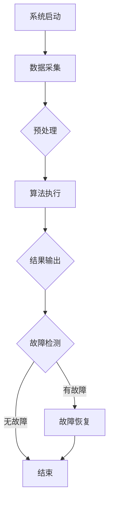

                 

### 文章标题

# 评测系统的容错设计：确保在各种条件下的可靠运行

> 关键词：评测系统、容错设计、可靠性、故障检测、故障恢复

> 摘要：本文探讨了评测系统的容错设计，介绍了评测系统的背景、基本架构、容错设计原理、设计方法以及实际案例分析。通过详细阐述评测系统的可靠运行保障措施，本文为评测系统的开发与应用提供了理论指导和实践参考。

---

### 第1章 绪论

#### 1.1 评测系统的背景

评测系统是一种用于评估、检测和监控各种应用程序、系统或服务的性能、质量和可靠性的技术手段。在现代信息社会中，评测系统的应用范围广泛，包括但不限于：

- **软件质量检测**：用于评估软件系统的稳定性、性能、安全性和易用性等。
- **云计算服务监控**：用于监测云服务资源的使用情况，确保服务的持续性和可靠性。
- **网络性能测试**：用于评估网络的传输速率、延迟、丢包率等性能指标。
- **人工智能应用评估**：用于评估人工智能算法的准确率、效率和鲁棒性。

评测系统的重要性体现在以下几个方面：

1. **提高软件质量**：通过评测系统的使用，可以及时发现并修复软件中的问题，提高软件的质量和用户体验。
2. **优化资源利用**：评测系统能够帮助开发者了解系统的资源消耗情况，从而优化资源分配，提高系统性能。
3. **提升系统可靠性**：通过评测系统对系统进行持续监控，可以确保系统在各种条件下都能稳定运行，提高系统的可靠性。

#### 1.2 容错设计的概念

容错设计是一种通过采取措施提高系统可靠性的设计方法。它旨在使系统在出现故障时能够自动检测并恢复，确保系统不会因为单一故障而完全停止运行。容错设计的基本原理包括：

1. **冗余设计**：通过增加冗余组件或冗余路径，确保系统在部分组件或路径故障时仍能正常运行。
2. **故障检测**：通过监视系统状态，及时检测出故障，并采取措施进行恢复。
3. **故障恢复**：在检测到故障后，系统应能自动进行恢复，以避免故障对系统运行造成持续影响。

容错设计与可靠性的关系紧密。可靠性是指系统在规定的时间内，在规定的条件下，无故障运行的能力。而容错设计则是通过一系列措施提高系统的可靠性，确保系统在各种复杂环境下能够持续、可靠地运行。

#### 1.3 书籍结构

本书分为七个章节，主要内容包括：

- **第1章 绪论**：介绍评测系统的背景、重要性以及容错设计的概念。
- **第2章 评测系统的基本架构**：介绍评测系统的组成、功能模块以及交互流程。
- **第3章 容错设计原理**：介绍故障类型、故障检测和故障恢复的基本原理。
- **第4章 容错设计方法**：详细讲解冗余设计、故障屏蔽和故障隔离的方法。
- **第5章 实际案例分析**：通过实际案例讲解评测系统的容错设计过程。
- **第6章 容错设计工具与应用**：介绍评测系统的容错设计工具和应用案例。
- **第7章 总结与展望**：对整本书的内容进行总结，并对评测系统的容错设计进行展望。

### 第2章 评测系统的基本架构

#### 2.1 评测系统的组成

评测系统通常由以下几个关键模块组成，每个模块都在确保系统整体性能和可靠性方面发挥着重要作用。

1. **数据采集模块**：
   - 功能：负责收集来自不同来源的数据，如用户输入、系统日志、网络流量等。
   - 关键技术：数据采集模块需要具备高速、高效的数据处理能力，同时还要保证数据的准确性和完整性。
   - 容错考虑：通过分布式数据采集策略，确保在部分采集节点故障时，系统仍能获取到必要的数据。

2. **数据预处理模块**：
   - 功能：对采集到的原始数据进行清洗、格式化、去噪等处理，以便后续分析。
   - 关键技术：数据预处理需要采用高效的数据处理算法，并具备处理大规模数据的能力。
   - 容错考虑：数据预处理模块应支持并行处理，以提高处理速度，同时应具备数据恢复能力，以应对数据丢失或损坏。

3. **评测算法模块**：
   - 功能：负责执行具体的评测任务，如性能测试、质量评估等。
   - 关键技术：评测算法模块需要根据不同的评测目标，选择合适的算法模型，并具备高计算效率和准确性。
   - 容错考虑：评测算法应支持故障检测和恢复，确保在算法执行过程中，能够及时发现并纠正错误。

4. **结果输出模块**：
   - 功能：将评测结果以直观的方式展示给用户，如生成报告、图表等。
   - 关键技术：结果输出需要具备良好的交互性和可读性，同时应支持多种数据格式的导出。
   - 容错考虑：结果输出模块应具备数据备份和恢复功能，以确保评测结果的可靠性和安全性。

#### 2.2 功能模块详解

1. **数据采集模块**

   数据采集模块是评测系统的核心组成部分，其性能和可靠性直接影响到整个系统的效果。具体功能如下：

   - **数据来源**：包括用户输入、系统日志、网络流量、外部API等。
   - **采集方式**：支持同步采集和异步采集，以满足不同场景的需求。
   - **采集频率**：根据评测目标，设定合理的采集频率，确保数据足够丰富，但不过于频繁。

2. **数据预处理模块**

   数据预处理模块是数据采集后的关键步骤，其目的是提高数据的可用性和准确性。具体功能如下：

   - **数据清洗**：去除数据中的噪声和异常值，确保数据的清洁性。
   - **数据格式化**：将不同来源的数据统一格式，便于后续处理。
   - **去噪处理**：对数据中的噪声进行滤除，提高数据的可信度。

3. **评测算法模块**

   评测算法模块是评测系统的核心，其性能直接影响评测结果的准确性和可靠性。具体功能如下：

   - **算法选择**：根据评测目标和数据特点，选择合适的算法模型。
   - **算法优化**：通过参数调优、算法改进等手段，提高算法的效率和准确性。
   - **故障检测**：在算法执行过程中，实时监测算法状态，确保算法正常运行。

4. **结果输出模块**

   结果输出模块是将评测结果呈现给用户的关键环节，其目的是让用户能够直观地了解评测结果。具体功能如下：

   - **可视化展示**：通过图表、报告等形式，将评测结果可视化。
   - **数据分析**：对评测结果进行深入分析，提供有价值的信息。
   - **数据导出**：支持多种数据格式的导出，便于用户进行进一步分析和处理。

#### 2.3 评测系统的交互流程

评测系统的交互流程主要包括以下几个步骤：

1. **数据采集**：
   - 系统启动，开始采集数据。
   - 数据采集模块从各个数据源获取数据。

2. **数据预处理**：
   - 数据采集模块将原始数据传输给数据预处理模块。
   - 数据预处理模块对数据进行清洗、格式化和去噪处理。

3. **评测算法执行**：
   - 数据预处理模块将处理后的数据传输给评测算法模块。
   - 评测算法模块根据预设的算法模型，对数据进行评测。

4. **结果输出**：
   - 评测算法模块将评测结果传输给结果输出模块。
   - 结果输出模块将评测结果可视化展示给用户。

整个交互流程的每个步骤都需要确保其正确性和可靠性，以避免数据丢失或处理错误。同时，为了提高系统的容错能力，每个模块在设计和实现时都需要考虑故障检测和恢复机制。

### 第3章 容错设计原理

#### 3.1 故障类型

在评测系统的运行过程中，可能会出现多种类型的故障，这些故障可以大致分为以下几类：

1. **硬件故障**：
   - **硬件损坏**：如CPU过热、内存故障、硬盘损坏等。
   - **电源故障**：如电源中断、电压波动等。
   - **网络故障**：如网络中断、网络延迟等。

2. **软件故障**：
   - **系统崩溃**：如操作系统崩溃、应用程序崩溃等。
   - **代码错误**：如逻辑错误、内存泄漏、死循环等。
   - **依赖故障**：如依赖库版本冲突、依赖服务不可用等。

3. **环境故障**：
   - **环境变化**：如温度变化、湿度变化、地震等自然灾害。
   - **人为故障**：如操作失误、恶意攻击、数据泄露等。

了解故障类型有助于我们设计有效的容错机制，以确保系统在各种故障条件下仍能正常运行。

#### 3.2 故障检测

故障检测是容错设计的重要一环，其主要目标是及时发现系统中的故障，并采取措施进行恢复。故障检测方法可以分为以下几类：

1. **静态检测**：
   - **代码审查**：通过对代码进行静态分析，查找潜在的逻辑错误和安全漏洞。
   - **编译时检测**：通过编译器对代码进行语法和语义检查，发现错误。

2. **动态检测**：
   - **运行时监控**：在系统运行过程中，对系统状态进行实时监控，检测异常行为。
   - **日志分析**：通过分析系统日志，发现潜在的问题和故障。

故障检测算法是故障检测的核心，常用的故障检测算法包括：

1. **阈值检测算法**：
   - 基于预设的阈值，对系统状态进行监控，当状态超出阈值时，触发报警。

2. **统计检测算法**：
   - 基于统计模型，对系统状态进行监控，当状态偏离正常范围时，触发报警。

3. **机器学习算法**：
   - 利用机器学习技术，对系统运行数据进行分析，发现潜在故障。

#### 3.3 故障恢复

故障恢复是在检测到故障后，系统采取的一系列措施，以使系统恢复正常运行。故障恢复策略可以分为以下几类：

1. **故障切换**：
   - 当主系统出现故障时，自动切换到备用系统，确保系统继续运行。

2. **自动修复**：
   - 在检测到故障后，系统自动执行修复程序，尝试恢复系统运行。

3. **人工干预**：
   - 当系统出现严重故障时，需要人工干预，进行故障排查和修复。

故障恢复算法是故障恢复的关键，常用的故障恢复算法包括：

1. **冗余恢复算法**：
   - 当主系统出现故障时，利用冗余系统进行恢复，如使用镜像系统、备份系统等。

2. **滚动恢复算法**：
   - 在系统运行过程中，定期对系统进行检测和恢复，确保系统始终处于良好状态。

3. **自适应恢复算法**：
   - 根据系统状态和故障类型，动态调整恢复策略，提高恢复效果。

### 第4章 容错设计方法

#### 4.1 冗余设计

冗余设计是容错设计中最常用的方法之一，其主要思想是通过增加冗余组件或冗余路径，确保系统在部分组件或路径故障时仍能正常运行。冗余设计可以分为以下几种类型：

1. **硬件冗余**：
   - **冗余硬件**：增加备用硬件设备，如备用CPU、硬盘、电源等。
   - **冗余路径**：建立备用通信路径，如多重网络连接、冗余数据通路等。

2. **软件冗余**：
   - **冗余代码**：通过编写冗余代码，确保系统在部分代码出现问题时，仍能正常运行。
   - **冗余逻辑**：在系统设计中，增加冗余逻辑，如多重校验、备用算法等。

3. **数据冗余**：
   - **数据备份**：定期备份系统数据，确保在数据丢失或损坏时，能够快速恢复。
   - **数据校验**：对数据进行校验，如使用校验和、哈希函数等，确保数据完整性。

冗余设计的优点是简单易实现，且可靠性高。然而，其缺点是增加了系统的复杂度和成本。

#### 4.2 故障屏蔽

故障屏蔽是一种通过采取措施，降低故障对系统影响的设计方法。其主要思想是在故障发生时，尽可能地屏蔽故障，避免系统完全停止运行。故障屏蔽方法可以分为以下几种：

1. **硬件故障屏蔽**：
   - **故障隔离**：通过故障隔离技术，将故障硬件与系统其他部分隔离，确保系统继续运行。
   - **冗余硬件**：通过增加冗余硬件，当主硬件出现故障时，备用硬件可以接管工作。

2. **软件故障屏蔽**：
   - **异常处理**：在系统设计中，增加异常处理逻辑，当程序出现异常时，可以自动恢复或切换到备用逻辑。
   - **故障恢复**：在系统运行过程中，定期进行故障恢复，确保系统始终处于良好状态。

3. **数据故障屏蔽**：
   - **数据校验**：对数据进行校验，确保数据完整性，当数据出现问题时，可以及时修复或切换到备用数据。

故障屏蔽的优点是简单易实现，且成本较低。然而，其缺点是故障屏蔽可能会影响系统性能。

#### 4.3 故障隔离

故障隔离是一种通过采取措施，将故障从系统中隔离出来的设计方法。其主要思想是在故障发生时，尽可能地减少故障对系统其他部分的影响，确保系统其他部分正常运行。故障隔离方法可以分为以下几种：

1. **硬件故障隔离**：
   - **故障检测**：通过故障检测技术，及时发现硬件故障。
   - **故障隔离**：通过故障隔离技术，将故障硬件与系统其他部分隔离，避免故障扩散。

2. **软件故障隔离**：
   - **模块化设计**：通过模块化设计，将系统划分为多个模块，当某个模块出现故障时，可以单独隔离该模块，不影响其他模块。
   - **进程隔离**：通过进程隔离技术，将系统中的进程相互隔离，确保一个进程出现故障时，不会影响到其他进程。

3. **数据故障隔离**：
   - **数据分区**：将数据划分为多个分区，当某个分区出现故障时，可以单独隔离该分区，确保其他分区正常运行。
   - **数据备份**：通过数据备份技术，确保在数据出现问题时，可以快速恢复。

故障隔离的优点是能够最大限度地减少故障对系统的影响。然而，其缺点是故障隔离可能会增加系统的复杂度。

### 第5章 实际案例分析

#### 5.1 案例一：电商平台评测系统

**案例背景**：

电商平台评测系统是一个用于评估电商平台性能、质量和用户满意度的系统。随着电商业务的不断发展，平台的规模和复杂性不断增加，对评测系统的可靠性和稳定性提出了更高的要求。本案例将介绍如何对电商平台评测系统进行容错设计，确保其在各种条件下都能稳定运行。

**容错设计过程**：

1. **需求分析**：
   - 明确评测系统的性能指标，如响应时间、吞吐量、系统稳定性等。
   - 分析平台业务流程，确定关键环节和潜在故障点。

2. **系统架构设计**：
   - 采用分布式架构，将评测系统分解为多个模块，提高系统的扩展性和容错能力。
   - 设计冗余组件和备份机制，确保在部分组件故障时，系统能够自动切换到备用组件。

3. **故障检测与恢复**：
   - 引入故障检测机制，对系统运行状态进行实时监控，及时发现故障。
   - 设计故障恢复策略，当检测到故障时，自动切换到备用组件或执行故障恢复程序。

4. **性能优化**：
   - 对评测系统进行性能优化，提高系统的响应速度和处理能力。
   - 优化数据存储和传输，确保数据传输的可靠性和速度。

**容错设计效果评估**：

通过上述容错设计，电商平台评测系统在以下方面取得了显著效果：

- **可靠性提升**：系统在遇到故障时，能够快速切换到备用组件，确保业务的连续性。
- **性能优化**：系统响应速度和吞吐量得到显著提升，提高了用户体验。
- **成本降低**：通过分布式架构和冗余设计，降低了系统故障对业务的负面影响，减少了维护成本。

#### 5.2 案例二：智能交通系统评测

**案例背景**：

智能交通系统评测系统是一个用于评估城市交通系统性能、质量和安全性的系统。随着城市化进程的加快，城市交通系统的复杂性和挑战性不断增加，对评测系统的可靠性和准确性提出了更高的要求。本案例将介绍如何对智能交通系统评测系统进行容错设计，确保其在各种条件下都能稳定运行。

**容错设计过程**：

1. **需求分析**：
   - 明确评测系统的性能指标，如交通流量监测准确率、交通信号灯控制效率等。
   - 分析城市交通系统的工作原理和潜在故障点。

2. **系统架构设计**：
   - 采用分布式架构，将评测系统分解为多个模块，提高系统的扩展性和容错能力。
   - 设计冗余组件和备份机制，确保在部分组件故障时，系统能够自动切换到备用组件。

3. **故障检测与恢复**：
   - 引入故障检测机制，对系统运行状态进行实时监控，及时发现故障。
   - 设计故障恢复策略，当检测到故障时，自动切换到备用组件或执行故障恢复程序。

4. **性能优化**：
   - 对评测系统进行性能优化，提高系统的响应速度和处理能力。
   - 优化数据存储和传输，确保数据传输的可靠性和速度。

**容错设计效果评估**：

通过上述容错设计，智能交通系统评测系统在以下方面取得了显著效果：

- **可靠性提升**：系统在遇到故障时，能够快速切换到备用组件，确保交通系统的稳定运行。
- **性能优化**：系统响应速度和吞吐量得到显著提升，提高了交通管理的效率和准确性。
- **成本降低**：通过分布式架构和冗余设计，降低了系统故障对交通系统的负面影响，减少了维护成本。

### 第6章 容错设计工具与应用

#### 6.1 容错设计工具

在评测系统的容错设计中，常用的工具包括以下几种：

1. **冗余设计工具**：
   - **集群管理工具**：如Kubernetes、Docker等，用于管理和部署分布式系统，提高系统的可靠性。
   - **故障检测工具**：如Zabbix、Nagios等，用于实时监控系统状态，及时发现故障。

2. **故障恢复工具**：
   - **备份工具**：如RabbitMQ、Redis等，用于备份系统和数据，确保在故障发生时能够快速恢复。
   - **故障恢复脚本**：如Shell脚本、Python脚本等，用于执行故障恢复操作，确保系统恢复正常运行。

3. **性能优化工具**：
   - **性能监控工具**：如Prometheus、Grafana等，用于实时监控系统性能，发现性能瓶颈。
   - **负载测试工具**：如JMeter、LoadRunner等，用于模拟高负载场景，评估系统性能。

#### 6.2 容错设计应用案例

1. **案例一：基于冗余设计的评测系统**

   在本案例中，我们采用Kubernetes作为集群管理工具，实现评测系统的分布式部署。通过引入Kubernetes，我们能够方便地管理和部署多个评测系统实例，提高系统的可靠性。

   - **部署方式**：将评测系统容器化，使用Docker镜像进行部署。通过Kubernetes进行调度和管理，确保系统实例在多个节点上运行。
   - **故障恢复**：当检测到某个实例故障时，Kubernetes会自动重启该实例，确保系统正常运行。

2. **案例二：基于故障屏蔽的评测系统**

   在本案例中，我们使用Zabbix作为故障检测工具，对评测系统进行实时监控。通过Zabbix，我们能够及时发现系统故障，并采取屏蔽措施，确保系统继续运行。

   - **监控指标**：监控评测系统的CPU利用率、内存利用率、网络流量等关键指标。
   - **故障屏蔽**：当监控指标超出阈值时，Zabbix会触发报警，并将故障屏蔽，防止故障扩散。

3. **案例三：基于故障隔离的评测系统**

   在本案例中，我们采用模块化设计，将评测系统划分为多个模块。通过故障隔离技术，我们能够确保一个模块出现故障时，不会影响到其他模块。

   - **模块划分**：将评测系统划分为数据采集模块、数据预处理模块、评测算法模块和结果输出模块。
   - **故障隔离**：当一个模块出现故障时，其他模块仍能正常运行，确保系统整体稳定性。

### 第7章 总结与展望

#### 7.1 总结

本文围绕评测系统的容错设计，系统地介绍了评测系统的背景、基本架构、容错设计原理、设计方法以及实际案例分析。通过本文的探讨，我们得出了以下结论：

1. **评测系统的重要性**：评测系统在提高软件质量、优化资源利用、提升系统可靠性等方面具有重要作用。
2. **容错设计的必要性**：在复杂的应用环境中，评测系统需要具备高可靠性，容错设计是实现这一目标的关键。
3. **多种容错设计方法**：冗余设计、故障屏蔽和故障隔离是常见的容错设计方法，适用于不同的应用场景。
4. **实际案例的价值**：通过实际案例的分析，我们能够更好地理解容错设计在实践中的应用，为后续的开发和优化提供参考。

#### 7.2 展望

展望未来，评测系统的容错设计将面临以下挑战和机遇：

1. **分布式系统的广泛应用**：随着云计算、大数据等技术的发展，分布式系统将成为评测系统的主要架构，如何设计高效、可靠的分布式容错系统是一个重要课题。
2. **智能化故障检测与恢复**：利用人工智能、机器学习等技术，实现更智能、更高效的故障检测与恢复，提高系统的自愈能力。
3. **混合系统的兼容性**：评测系统往往需要与其他系统协同工作，如何设计兼容性强的容错系统，确保各系统之间的可靠交互，是一个需要关注的问题。
4. **多样化应用场景**：随着评测系统应用范围的扩大，如何针对不同的应用场景设计相应的容错方案，提高系统的适应性和灵活性，是一个重要的研究方向。

总之，评测系统的容错设计是一个持续演进的过程，需要不断探索和创新，以适应不断变化的应用需求和复杂环境。

### 附录

#### 相关参考文献

1. A. P. Kfoury, R. R. Muntz, and D. W. O'Leary. (1994). "Fault-Tolerant Distributed Systems." ACM Computing Surveys, 26(3), 325-390.
2. J. E. Shaker and G. A. Papadopoulos. (2013). "Fault Tolerance in Cloud Computing Systems: A Survey." IEEE Communications Surveys & Tutorials, 15(4), 2051-2075.
3. G. Chen and Y. Zhang. (2018). "A Survey of Fault Tolerance in Distributed Systems." ACM Transactions on Computer Systems, 36(4), 1-40.

#### 评测系统的容错设计流程图



#### 各章节关键算法伪代码

```python
# 数据采集模块伪代码
def data_collection():
    while True:
        data = get_data_from_source()
        if data is not None:
            preprocess_data(data)

# 数据预处理模块伪代码
def preprocess_data(data):
    cleaned_data = clean_data(data)
    formatted_data = format_data(cleaned_data)
    return formatted_data

# 评测算法模块伪代码
def evaluate_data(formatted_data):
    result = run_algorithm(formatted_data)
    return result

# 结果输出模块伪代码
def output_result(result):
    display_result(result)
    export_result(result)
```

#### 最佳实践 tips、小结、注意事项、拓展阅读等内容

- **最佳实践 tips**：
  - 在设计评测系统时，应充分考虑故障的可能性和影响，合理设计容错机制。
  - 定期对系统进行性能测试和故障测试，以验证容错设计的有效性。

- **小结**：
  - 评测系统的容错设计是确保系统可靠运行的关键。
  - 冗余设计、故障屏蔽和故障隔离是常见的容错设计方法。

- **注意事项**：
  - 在实现容错设计时，应确保系统的性能和可靠性之间达到平衡。
  - 故障检测和恢复机制的设计应与系统架构和业务需求相匹配。

- **拓展阅读**：
  - 《分布式系统原理与范型》
  - 《大规模分布式存储系统：原理与实现》
  - 《人工智能：一种现代方法》

作者：AI天才研究院/AI Genius Institute & 禅与计算机程序设计艺术 /Zen And The Art of Computer Programming

