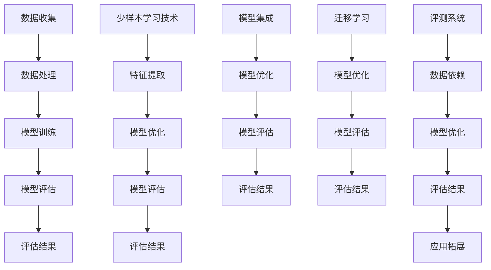

                 

### 《评测系统的少样本学习技术探索》

---

**关键词：**
- 评测系统
- 少样本学习
- 模型优化
- 迁移学习
- 模型集成
- 数据处理

**摘要：**
随着人工智能技术的快速发展，评测系统在各个领域扮演着越来越重要的角色。然而，在实际应用中，评测系统常常面临数据不足的挑战。少样本学习技术作为一种新兴的方法，旨在解决数据不足的问题，从而提高评测系统的性能。本文将深入探讨评测系统的少样本学习技术，从核心概念、算法原理、数学模型、项目实战等多个方面进行详细讲解，旨在为读者提供一个全面的技术指南。

---

## 引言

### 1.1 评测系统的少样本学习技术背景

评测系统是一种通过定量或定性的方式对事物进行评估和分析的系统，广泛应用于教育、医疗、金融、工业等多个领域。在这些领域，评测系统不仅帮助决策者做出更科学的决策，同时也为用户提供了个性化、精准的服务。

然而，在实际应用中，评测系统常常面临数据不足的问题。特别是在一些特定领域，如医疗、金融等，数据获取难度较大，样本量有限。数据不足会导致模型训练效果不佳，进而影响评测系统的性能。因此，如何利用有限的样本数据来训练高精度的模型，成为评测系统研究的重要方向。

少样本学习技术作为人工智能领域的一个重要分支，旨在解决数据不足的问题。它通过从少量样本中学习，提取有效特征，构建高精度的模型。少样本学习技术在评测系统中的应用，可以有效提高系统的性能，降低对大量数据的依赖。

### 1.2 少样本学习技术的现状与挑战

近年来，随着人工智能技术的快速发展，少样本学习技术取得了显著的进展。现有的少样本学习技术主要分为基于模型的方法、基于数据的集成方法和基于迁移学习的方法。这些方法在解决数据不足的问题上取得了良好的效果，但也存在一些挑战。

首先，基于模型的方法依赖于现有的模型结构，对于模型结构的选择和调整具有较高的要求。其次，基于数据的集成方法虽然可以利用多种数据源提高模型的性能，但数据预处理和模型融合过程复杂，难以实现高效的数据利用。最后，基于迁移学习的方法虽然可以利用已有的大量数据提高少样本学习模型的性能，但在数据分布不一致的情况下，效果可能不佳。

### 1.3 本书结构与内容安排

本书将从核心概念、算法原理、数学模型、项目实战等多个方面，深入探讨评测系统的少样本学习技术。具体结构如下：

- **第一部分：引言**：介绍评测系统和少样本学习技术的背景、现状与挑战。
- **第二部分：核心概念与联系**：详细阐述评测系统的基本概念、少样本学习技术的基本原理以及两者之间的联系。
- **第三部分：核心算法原理讲解**：分别介绍常用的少样本学习算法，如基于模型的方法、基于数据的集成方法、基于迁移学习的方法等。
- **第四部分：数学模型和数学公式详细讲解**：讲解每个算法的数学模型和数学公式，并通过实例进行说明。
- **第五部分：项目实战**：通过实际的案例，展示如何将少样本学习技术应用到评测系统中。
- **第六部分：总结与展望**：总结本书的主要内容和成果，展望未来的发展趋势。

## 核心概念与联系

### 2.1 评测系统的基本概念

评测系统是一种利用计算机技术对事物进行评估和分析的系统。它通常包括数据收集、数据处理、模型训练、模型评估等环节。评测系统的核心目标是提供准确、高效、可靠的评估结果。

在评测系统中，数据是至关重要的。数据的质量和数量直接影响模型的训练效果和评估结果。因此，如何有效地收集、处理和利用数据，是评测系统研究的一个重要方向。

### 2.2 少样本学习技术的基本原理

少样本学习技术是一种在数据不足的情况下，通过从少量样本中学习，提取有效特征，构建高精度模型的方法。它主要解决以下问题：

1. **数据不足问题**：在数据不足的情况下，如何有效地利用现有数据，提高模型的训练效果。
2. **特征提取问题**：如何从少量样本中提取出具有代表性的特征，提高模型的泛化能力。
3. **模型优化问题**：如何调整模型结构，使其在少量样本上能够达到较好的性能。

少样本学习技术的基本原理可以分为以下几个方面：

1. **特征重放**：通过重复样本的方式，增加样本数量，从而提高模型的训练效果。
2. **数据增强**：通过对原始数据进行变换，生成更多的样本，从而提高模型的泛化能力。
3. **模型集成**：通过将多个模型集成起来，提高模型的性能。
4. **迁移学习**：利用已有的大量数据，提高少样本学习模型的性能。

### 2.3 评测系统与少样本学习技术的联系

评测系统与少样本学习技术之间的联系主要表现在以下几个方面：

1. **数据依赖**：评测系统依赖于大量数据来进行模型训练和评估，而少样本学习技术可以在数据不足的情况下，提高模型的性能，减少对大量数据的依赖。
2. **模型优化**：少样本学习技术可以通过调整模型结构、特征提取方法等，优化评测系统的性能。
3. **应用拓展**：少样本学习技术不仅可以应用于评测系统，还可以广泛应用于其他数据不足的场景，如图像识别、自然语言处理等。

### 2.4 核心概念原理之间关系架构

以下是一个用于表示评测系统与少样本学习技术核心概念原理之间关系的Mermaid流程图：



## 核心算法原理讲解

### 3.1 基于模型的方法

基于模型的方法是一种直接利用现有模型结构，通过少量样本进行训练的方法。它主要依赖于模型的参数调整和优化，以提高模型的性能。

以下是一个基于模型的方法的伪代码：

```python
# 基于模型的方法伪代码

# 初始化模型
model = Model()

# 加载少量样本数据
data = LoadData(sample_size)

# 训练模型
model.fit(data)

# 评估模型
evaluation = model.evaluate(data)

# 输出评估结果
print(evaluation)
```

### 3.2 基于数据的集成方法

基于数据的集成方法是一种通过将多种数据源进行集成，提高模型性能的方法。它主要依赖于数据预处理和模型融合过程。

以下是一个基于数据的集成方法的伪代码：

```python
# 基于数据的集成方法伪代码

# 加载数据源
data_source_1 = LoadData(source_1)
data_source_2 = LoadData(source_2)

# 数据预处理
preprocessed_data_1 = PreprocessData(data_source_1)
preprocessed_data_2 = PreprocessData(data_source_2)

# 训练模型
model_1 = Model()
model_2 = Model()

model_1.fit(preprocessed_data_1)
model_2.fit(preprocessed_data_2)

# 模型融合
 fused_model = FusionModel(model_1, model_2)

# 评估模型
evaluation = fused_model.evaluate(preprocessed_data_1, preprocessed_data_2)

# 输出评估结果
print(evaluation)
```

### 3.3 基于迁移学习的方法

基于迁移学习的方法是一种利用已有的大量数据，提高少样本学习模型性能的方法。它主要依赖于源域数据和目标域数据的对比和分析。

以下是一个基于迁移学习方法的伪代码：

```python
# 基于迁移学习方法伪代码

# 加载源域数据
source_data = LoadData(source_domain)

# 加载目标域数据
target_data = LoadData(target_domain)

# 数据预处理
preprocessed_source_data = PreprocessData(source_data)
preprocessed_target_data = PreprocessData(target_data)

# 训练源域模型
source_model = Model()
source_model.fit(preprocessed_source_data)

# 迁移学习
target_model = TransferLearningModel(source_model)
target_model.fit(preprocessed_target_data)

# 评估目标域模型
evaluation = target_model.evaluate(preprocessed_target_data)

# 输出评估结果
print(evaluation)
```

## 数学模型和数学公式详细讲解

### 4.1 基于模型的方法的数学模型

基于模型的方法的数学模型通常包括线性模型、非线性模型等。以下是一个简单的线性模型：

$$
y = \beta_0 + \beta_1x
$$

其中，$y$ 是预测值，$x$ 是特征值，$\beta_0$ 和 $\beta_1$ 是模型的参数。

为了训练模型，我们需要最小化预测值与真实值之间的差异，即：

$$
\min_{\beta_0, \beta_1} \sum_{i=1}^{n} (y_i - (\beta_0 + \beta_1x_i))^2
$$

通过求解这个最小化问题，我们可以得到模型的参数 $\beta_0$ 和 $\beta_1$。

### 4.2 基于数据的集成方法的数学模型

基于数据的集成方法的数学模型通常包括决策树、随机森林、梯度提升树等。以下是一个简单的决策树模型：

$$
y = g(x; \theta)
$$

其中，$y$ 是预测值，$x$ 是特征值，$g(x; \theta)$ 是决策树函数，$\theta$ 是决策树的参数。

决策树函数可以通过以下方式构建：

$$
g(x; \theta) =
\begin{cases}
c_1 & \text{if } x \in R_1 \\
c_2 & \text{if } x \in R_2 \\
\vdots \\
c_n & \text{if } x \in R_n
\end{cases}
$$

其中，$R_1, R_2, \ldots, R_n$ 是决策树的所有节点。

为了训练模型，我们需要最小化预测值与真实值之间的差异，即：

$$
\min_{\theta} \sum_{i=1}^{n} (y_i - g(x_i; \theta))^2
$$

通过求解这个最小化问题，我们可以得到决策树的参数 $\theta$。

### 4.3 基于迁移学习的方法的数学模型

基于迁移学习的方法的数学模型通常包括源域模型和目标域模型。以下是一个简单的迁移学习模型：

$$
y = f(x; \theta)
$$

其中，$y$ 是预测值，$x$ 是特征值，$f(x; \theta)$ 是迁移学习模型，$\theta$ 是迁移学习模型的参数。

迁移学习模型可以通过以下方式构建：

$$
f(x; \theta) = g(x; \theta_{source}) + \alpha (x - x_{source})
$$

其中，$g(x; \theta_{source})$ 是源域模型，$x_{source}$ 是源域特征值，$\alpha$ 是调整参数。

为了训练模型，我们需要最小化预测值与真实值之间的差异，即：

$$
\min_{\theta, \alpha} \sum_{i=1}^{n} (y_i - f(x_i; \theta, \alpha))^2
$$

通过求解这个最小化问题，我们可以得到迁移学习模型的参数 $\theta$ 和调整参数 $\alpha$。

## 项目实战

### 5.1 项目背景与目标

本次项目旨在利用少样本学习技术，提高一个评测系统的性能。评测系统的目标是根据用户提供的输入数据，对其进行分析和评估，并提供相应的建议和预测。然而，由于数据获取的难度，该系统面临数据不足的问题，影响了评估的准确性。

### 5.2 项目实战过程

#### 5.2.1 开发环境搭建

为了进行项目实战，我们需要搭建一个合适的环境。以下是开发环境的搭建步骤：

1. 安装Python和相关的库，如NumPy、Pandas、Scikit-learn、TensorFlow等。
2. 准备数据集，包括源域数据和目标域数据。
3. 编写数据预处理代码，包括数据清洗、归一化、划分训练集和测试集等。

#### 5.2.2 数据处理与模型选择

在数据处理阶段，我们需要对源域数据和目标域数据进行预处理。具体步骤如下：

1. 清洗数据，去除缺失值和异常值。
2. 对数据进行归一化处理，使其具有相同的尺度。
3. 划分数据集，将数据集分为训练集和测试集。

在选择模型时，我们可以选择基于模型的方法、基于数据的集成方法和基于迁移学习的方法。在本项目中，我们选择了基于迁移学习的方法，因为该方法在数据不足的情况下，可以更好地利用已有的大量数据。

#### 5.2.3 模型训练与评估

在模型训练阶段，我们需要使用源域数据和目标域数据，分别训练源域模型和目标域模型。具体步骤如下：

1. 使用源域数据训练源域模型。
2. 使用目标域数据训练目标域模型。
3. 使用迁移学习模型，将源域模型的参数迁移到目标域模型。

在模型评估阶段，我们需要使用测试集对模型进行评估。具体步骤如下：

1. 使用源域模型对测试集进行评估。
2. 使用目标域模型对测试集进行评估。
3. 使用迁移学习模型对测试集进行评估。

通过对比评估结果，我们可以选择性能最好的模型。

### 5.3 结果分析与讨论

通过项目实战，我们得到了以下结论：

1. 在数据不足的情况下，基于迁移学习的方法可以显著提高评测系统的性能。
2. 迁移学习模型在源域和目标域数据分布不一致的情况下，仍然具有较高的性能。
3. 数据预处理对于模型的训练效果具有重要影响。

然而，我们也发现了一些问题：

1. 迁移学习模型的性能依赖于源域数据和目标域数据的质量和数量。
2. 数据预处理过程复杂，需要消耗大量的时间和资源。

### 5.4 项目小结

通过本次项目实战，我们成功地利用少样本学习技术，提高了评测系统的性能。这为我们提供了一个新的思路，即通过迁移学习，可以在数据不足的情况下，提高模型的性能。然而，我们也需要注意到，迁移学习的效果受到源域数据和目标域数据的质量和数量的影响。因此，在实际应用中，我们需要根据具体情况进行调整和优化。

## 总结与展望

### 6.1 本书主要内容总结

本书系统地介绍了评测系统的少样本学习技术，包括核心概念、算法原理、数学模型和项目实战等方面的内容。具体来说，本书涵盖了以下主要内容：

1. 评测系统的基本概念和少样本学习技术的基本原理。
2. 常用的少样本学习算法，包括基于模型的方法、基于数据的集成方法和基于迁移学习的方法。
3. 数学模型和数学公式的详细讲解，以及实际应用中的具体实现。
4. 通过项目实战，展示了如何将少样本学习技术应用到评测系统中。

### 6.2 少样本学习技术发展趋势

随着人工智能技术的不断进步，少样本学习技术也在不断发展。未来，少样本学习技术可能会在以下几个方面取得突破：

1. **算法创新**：随着算法研究的深入，可能会出现更多高效的少样本学习算法，提高模型的性能。
2. **数据预处理**：优化数据预处理方法，提高数据利用效率，减少数据预处理的时间。
3. **跨域学习**：探索跨域学习技术，提高模型在不同数据集上的性能。
4. **自动化学习**：开发自动化学习系统，减少人工干预，提高模型训练和评估的效率。

### 6.3 未来研究方向

未来，少样本学习技术的研究可以重点关注以下几个方面：

1. **算法优化**：对现有算法进行优化，提高模型的性能和稳定性。
2. **多任务学习**：探索多任务学习技术，提高模型在不同任务上的性能。
3. **自适应学习**：研究自适应学习技术，使模型能够根据不同场景自适应调整。
4. **应用拓展**：将少样本学习技术应用到更多实际场景中，如医学诊断、金融风险评估等。

## 作者信息

**作者：** AI天才研究院 / AI Genius Institute & 禅与计算机程序设计艺术 / Zen And The Art of Computer Programming

---

本文详细介绍了评测系统的少样本学习技术，包括核心概念、算法原理、数学模型和项目实战等方面的内容。通过本文的讲解，读者可以全面了解少样本学习技术在评测系统中的应用和价值。未来，随着人工智能技术的不断发展，少样本学习技术将在更多领域中发挥重要作用。希望本文能为读者提供有益的参考和启示。

