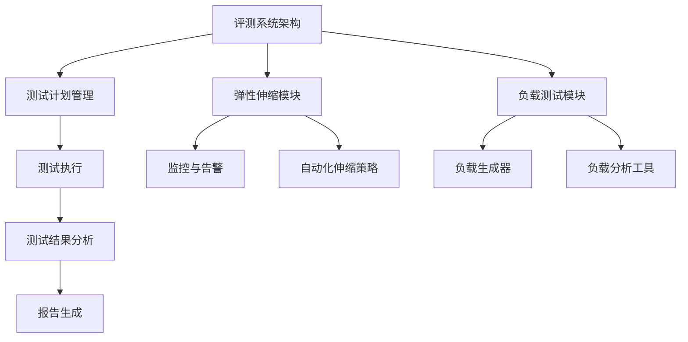

                 


### 文章标题：评测系统的弹性伸缩与负载测试

在当今的数字化时代，评测系统在众多行业中扮演着至关重要的角色。无论是电商平台的商品质量评测，金融交易的风险评估，还是IoT设备的性能测试，都需要高效、准确的评测系统来支持。而弹性伸缩与负载测试作为评测系统的核心组成部分，不仅决定了系统的性能和稳定性，还直接影响着用户体验和业务流程的顺畅。

本文将深入探讨评测系统的弹性伸缩与负载测试，从核心概念、架构设计、实战案例等多个维度展开，旨在为读者提供一个全面、系统的技术指南。

关键词：评测系统、弹性伸缩、负载测试、性能优化、案例分析

摘要：本文首先介绍了评测系统的基本概念和重要性，然后详细阐述了弹性伸缩和负载测试的核心原理及其实际应用。通过多个实战案例，我们将看到如何在实践中实现评测系统的弹性伸缩与负载测试，以及如何通过优化策略提升系统的性能和稳定性。

## 第1章：评测系统概述

### 1.1 评测系统的定义与作用

评测系统是一种用于对各种应用、服务或产品进行性能、功能、质量等方面的评估的系统。它通常由多个模块组成，包括测试计划制定、测试执行、测试结果分析和报告生成等。

评测系统在各个行业中都有着广泛的应用。例如，在电商领域，评测系统可以用于检测商品的质量，确保用户能够购买到符合预期的商品；在金融领域，评测系统可以用于评估交易的风险，降低金融风险；在IoT领域，评测系统可以用于检测设备的功能性能，确保设备正常运行。

### 1.2 弹性伸缩的基本概念

弹性伸缩（Elastic Scaling）是指系统根据实际负载情况自动调整其资源（如计算能力、存储容量等）的过程。通过弹性伸缩，系统可以在负载增加时自动增加资源，以应对突发流量；在负载减少时自动减少资源，以节省成本。

弹性伸缩的关键在于其自动化和动态调整的能力。它不仅提高了系统的可用性和性能，还大大降低了运维成本。

### 1.3 负载测试的基本概念

负载测试（Load Testing）是一种评估系统性能的方法，通过模拟实际用户负载来测试系统的响应速度、稳定性和最大承载能力。负载测试的主要目的是发现系统的性能瓶颈，优化系统设计，提高系统的可用性和可靠性。

负载测试通常分为以下几类：

1. **性能测试**：评估系统在正常负载下的响应速度和稳定性。
2. **压力测试**：评估系统在极端负载下的性能表现，以确定系统的最大承载能力。
3. **可靠性测试**：通过长时间运行负载，评估系统的稳定性和可靠性。

## 第2章：评测系统架构与设计

### 2.1 评测系统的基本架构

一个完整的评测系统通常包括以下几个主要组成部分：

1. **测试计划管理**：用于制定测试计划，包括测试目标、测试策略、测试环境等。
2. **测试执行**：用于执行测试用例，收集测试数据。
3. **测试结果分析**：对测试数据进行分析，生成报告。
4. **测试工具**：包括测试脚本编写工具、测试执行工具、测试结果分析工具等。

### 2.2 弹性伸缩架构设计

为了实现弹性伸缩，评测系统的架构需要具备以下几个关键要素：

1. **分布式架构**：通过分布式架构，可以将测试任务分散到多个节点上执行，提高系统的并发处理能力。
2. **容器化**：使用容器（如Docker）可以将测试环境封装起来，方便部署和扩展。
3. **自动化**：通过自动化工具（如Kubernetes）实现自动化的资源分配和调整。

### 2.3 负载测试架构设计

负载测试架构的设计需要考虑以下几个关键因素：

1. **负载生成器**：用于模拟用户负载，可以是本地的也可以是远程的。
2. **负载接收器**：用于接收和处理负载生成器发送的请求。
3. **监控与告警**：实时监控测试过程，并在发现问题时发送告警。

## 第3章：弹性伸缩原理

### 3.1 弹性伸缩机制

弹性伸缩机制主要包括以下几个步骤：

1. **监控**：实时监控系统的负载情况，包括CPU、内存、网络等指标。
2. **评估**：根据监控数据，评估系统是否需要调整资源。
3. **决策**：根据评估结果，决定是扩容、缩容还是保持当前规模。
4. **执行**：执行决策，调整系统资源。

### 3.2 自动化伸缩策略

自动化伸缩策略是通过算法和规则来实现资源自动调整的过程。常用的自动化伸缩策略包括：

1. **基于阈值的伸缩**：当系统负载超过某个阈值时，自动扩容；当负载低于另一个阈值时，自动缩容。
2. **基于负载变化的伸缩**：根据系统负载的动态变化，实时调整资源。

### 3.3 弹性伸缩实现技术

弹性伸缩的实现技术主要包括：

1. **容器编排**：如Kubernetes，用于自动化管理容器。
2. **云计算平台**：如AWS、Azure、阿里云等，提供弹性伸缩服务。
3. **自动化脚本**：通过编写脚本实现自动化伸缩。

## 第4章：弹性伸缩实战

### 4.1 实战一：基于Kubernetes的弹性伸缩

在本节中，我们将介绍如何使用Kubernetes实现评测系统的弹性伸缩。

#### 步骤1：搭建Kubernetes集群

首先，我们需要搭建一个Kubernetes集群。这里以Minikube为例，使用以下命令：

```bash
minikube start
```

#### 步骤2：部署应用

接下来，我们将部署一个简单的应用，以便进行弹性伸缩测试。使用以下命令创建部署文件：

```bash
kubectl create namespace elastic-scaling
kubectl apply -f kubernetes-deployment.yaml
```

#### 步骤3：监控系统负载

使用以下命令监控系统负载：

```bash
watch kubectl top pod -n elastic-scaling
```

#### 步骤4：调整部署

根据系统负载情况，调整部署的副本数：

```bash
kubectl scale deployment my-deployment -n elastic-scaling --replicas=5
```

#### 代码解读与分析

在上面的实战中，我们使用了Kubernetes进行弹性伸缩。具体步骤如下：

1. **搭建Kubernetes集群**：使用Minikube快速搭建一个本地Kubernetes集群。
2. **部署应用**：使用Kubernetes部署一个简单的应用，并创建命名空间以便管理。
3. **监控系统负载**：使用`watch`命令实时监控系统负载。
4. **调整部署**：根据系统负载，使用`kubectl scale`命令调整应用的副本数。

通过这种方式，我们可以实现评测系统的弹性伸缩，提高系统的可用性和性能。

## 第5章：负载测试原理

### 5.1 负载测试的目的与类型

负载测试的主要目的是评估系统在特定负载下的性能，以确定系统的最大承载能力、响应速度和稳定性。根据测试的目的和对象，负载测试可以分为以下几种类型：

1. **性能测试**：评估系统在正常负载下的响应速度和稳定性。
2. **压力测试**：评估系统在极端负载下的性能表现，以确定系统的最大承载能力。
3. **可靠性测试**：通过长时间运行负载，评估系统的稳定性和可靠性。

### 5.2 负载生成器

负载生成器是负载测试的核心组件，用于模拟用户行为，生成模拟负载。负载生成器可以是本地的，也可以是远程的。常见的负载生成器工具包括：

1. **JMeter**：一款开源的性能测试工具，可以模拟各种类型的负载。
2. **LoadRunner**：一款商业的性能测试工具，支持多种负载生成方式。
3. **Gatling**：一款开源的性能测试工具，支持HTTP、SOAP、JMS等多种协议。

### 5.3 负载分析工具

负载分析工具用于分析负载测试结果，提供性能分析、瓶颈定位等功能。常见的负载分析工具包括：

1. **VisualVM**：一款Java虚拟机的监控和分析工具，可以实时监控系统的性能。
2. **Grafana**：一款开源的监控和分析工具，可以可视化展示系统性能数据。
3. **Prometheus**：一款开源的监控解决方案，可以收集和存储系统的性能数据。

## 第6章：负载测试实战

### 6.1 实战一：Web应用负载测试

在本节中，我们将使用JMeter对Web应用进行负载测试。

#### 步骤1：搭建测试环境

首先，我们需要搭建一个Web应用测试环境。这里使用一个简单的Spring Boot应用作为测试对象。

#### 步骤2：创建测试计划

在JMeter中创建一个测试计划，包括以下模块：

1. **线程组**：模拟用户行为，生成负载。
2. **HTTP请求**：发送HTTP请求到Web应用。
3. **结果分析**：收集和分析测试结果。

#### 步骤3：运行测试

运行测试计划，观察JMeter控制台输出的测试结果。

#### 步骤4：分析结果

分析测试结果，包括响应时间、吞吐量、错误率等指标。

#### 代码解读与分析

在本节的实战中，我们使用了JMeter对Web应用进行了负载测试。具体步骤如下：

1. **搭建测试环境**：创建一个简单的Spring Boot应用作为测试对象。
2. **创建测试计划**：在JMeter中配置线程组和HTTP请求，模拟用户行为。
3. **运行测试**：运行测试计划，收集测试数据。
4. **分析结果**：分析测试结果，评估系统的性能。

通过这种方式，我们可以对Web应用进行全面的负载测试，确保其性能和稳定性。

## 第7章：实战案例

### 7.1 案例一：电商系统评测

在本案例中，我们将以一个电商系统为例，介绍如何进行弹性伸缩和负载测试。

#### 案例背景

某电商系统在双11期间面临巨大的流量压力，需要对系统进行弹性伸缩和负载测试，以确保系统稳定运行。

#### 实施步骤

1. **弹性伸缩**：
   - 使用Kubernetes进行容器编排，实现自动化的弹性伸缩。
   - 根据实时监控的数据，自动调整部署的Pod数量，确保系统在高负载下依然稳定运行。

2. **负载测试**：
   - 使用JMeter模拟大量用户访问，评估系统的性能。
   - 分析测试结果，发现系统的性能瓶颈，进行优化。

#### 结果与优化

通过弹性伸缩和负载测试，电商系统在双11期间成功应对了巨大的流量压力。具体优化措施包括：

- 优化数据库查询，提高查询速度。
- 增加缓存，减少数据库压力。
- 优化系统架构，提高系统的并发处理能力。

#### 代码解读与分析

在电商系统的弹性伸缩和负载测试中，我们使用了Kubernetes进行容器编排，实现自动化的资源调整。具体实现如下：

```bash
kubectl scale deployment my-deployment --replicas=10
```

通过这种方式，我们可以根据系统负载自动调整部署的Pod数量，实现弹性伸缩。

同时，我们使用了JMeter进行负载测试，模拟大量用户访问，评估系统的性能。具体实现如下：

```bash
jmeter -n -t test_plan.jmx -l results.jtl
```

通过这种方式，我们可以收集测试数据，分析系统的性能瓶颈，进行优化。

## 第8章：评测系统的性能优化

### 8.1 性能监控与告警

性能监控与告警是评测系统性能优化的重要手段。通过实时监控系统的各项性能指标，并在发现问题时及时发送告警，可以快速发现并解决性能问题，保障系统的稳定运行。

#### 监控指标

常见的监控指标包括：

- CPU使用率
- 内存使用率
- 网络带宽
- 磁盘IO
- 数据库响应时间

#### 告警策略

告警策略应根据系统的具体情况和业务需求进行定制。常见的告警策略包括：

- 设定阈值：当监控指标超过设定阈值时，发送告警。
- 定时检查：定期检查监控指标，发现异常时发送告警。
- 异常对比：对比历史数据，发现异常波动时发送告警。

#### 工具推荐

常见的性能监控与告警工具包括：

- Prometheus：一款开源的监控解决方案，支持多种数据源和告警机制。
- Nagios：一款开源的监控工具，支持多种监控插件和告警方式。
- Grafana：一款开源的数据可视化和监控工具，可以与Prometheus等监控工具集成。

### 8.2 系统资源调度优化

系统资源调度优化是提升评测系统性能的重要环节。通过合理的资源调度，可以充分利用系统资源，提高系统的并发处理能力。

#### 调度策略

常见的调度策略包括：

- 容量调度：根据系统的实际负载情况，动态调整系统资源。
- 效率调度：优先调度高优先级或高回报的任务。
- 均匀调度：均匀分配资源，避免资源过度集中或浪费。

#### 调度工具

常见的调度工具包括：

- Kubernetes：一款开源的容器编排工具，支持自动化的资源调度。
- Docker Swarm：一款开源的容器编排工具，支持基于容器集群的资源调度。

### 8.3 负载均衡策略

负载均衡策略是确保评测系统在高并发情况下稳定运行的关键。通过合理的负载均衡策略，可以分散系统负载，避免单点过载。

#### 负载均衡算法

常见的负载均衡算法包括：

- 轮询算法：按照顺序分配请求。
- 加权轮询算法：根据权重分配请求。
- 最少连接算法：将请求分配到连接数最少的节点。
- 源地址哈希算法：根据源IP地址分配请求。

#### 负载均衡工具

常见的负载均衡工具包括：

- Nginx：一款开源的Web服务器和反向代理服务器，支持HTTP和TCP负载均衡。
- LVS：一款开源的Linux虚拟服务器，支持基于IP、TCP和UDP的负载均衡。

## 第9章：评测系统的安全性与稳定性保障

### 9.1 安全性测试

评测系统的安全性是保障其正常运行的关键。通过安全性测试，可以发现和修复系统的安全漏洞，防止恶意攻击和数据泄露。

#### 测试方法

常见的安全性测试方法包括：

- 渗透测试：模拟黑客攻击，评估系统的安全防护能力。
- 漏洞扫描：使用工具扫描系统，发现已知的安全漏洞。
- 安全审计：对系统进行安全审查，评估其安全策略和配置。

#### 安全工具

常见的安全测试工具包括：

- Metasploit：一款开源的渗透测试框架，支持多种攻击和漏洞利用。
- Nessus：一款开源的漏洞扫描工具，支持自动化的漏洞发现和修复。
- OpenVAS：一款开源的漏洞扫描工具，支持广泛的扫描策略和报告生成。

### 9.2 稳定性测试

评测系统的稳定性直接影响其可用性和用户体验。通过稳定性测试，可以发现和解决系统在长时间运行下的稳定性问题。

#### 测试方法

常见的稳定性测试方法包括：

- 压力测试：模拟极端负载，评估系统的稳定性和承载能力。
- 负载测试：模拟实际负载，评估系统的性能和稳定性。
- 长时间运行测试：评估系统在长时间运行下的稳定性和可靠性。

#### 稳定性工具

常见的稳定性测试工具包括：

- LoadRunner：一款商业的性能和稳定性测试工具，支持多种负载生成方式和测试报告。
- JMeter：一款开源的性能和稳定性测试工具，支持HTTP、SOAP等多种协议的负载生成。

### 9.3 应急响应与故障处理

应急响应与故障处理是保障评测系统稳定运行的重要环节。通过建立完善的应急响应机制和故障处理流程，可以快速应对系统故障，减少对业务的影响。

#### 应急响应机制

应急响应机制应包括以下步骤：

- 故障监测：实时监测系统状态，发现故障。
- 故障确认：确认故障原因，评估故障影响。
- 故障处理：根据故障原因和影响，制定和处理故障。
- 故障恢复：恢复系统正常运行，进行总结和改进。

#### 故障处理流程

故障处理流程应包括以下步骤：

1. **接收故障报告**：接收故障报告，了解故障现象。
2. **初步诊断**：根据故障现象进行初步诊断，确定故障原因。
3. **制定方案**：根据故障原因制定处理方案。
4. **执行方案**：执行处理方案，修复故障。
5. **验证修复**：验证故障是否已修复，确保系统正常运行。
6. **总结报告**：总结故障处理过程，提出改进建议。

## 第10章：评测系统的发展趋势与未来展望

### 10.1 评测系统的技术趋势

随着技术的不断发展，评测系统也在不断进步。以下是一些评测系统的技术趋势：

1. **人工智能与大数据**：结合人工智能和大数据技术，提高评测系统的智能化和自动化水平。
2. **云计算与容器化**：云计算和容器化技术的普及，为评测系统的弹性伸缩和资源优化提供了更多可能性。
3. **区块链**：区块链技术可以提高评测系统的可信度和透明度，确保评测结果的真实性和公正性。
4. **物联网（IoT）**：随着IoT设备的普及，评测系统需要适应多样化的设备类型和测试场景。

### 10.2 评测系统的应用场景扩展

评测系统的应用场景正在不断扩展，以下是一些新的应用场景：

1. **智能制造**：对生产线设备进行实时评测，提高生产效率和产品质量。
2. **智慧城市**：对城市基础设施和公共服务进行评测，提高城市管理的智能化水平。
3. **智能医疗**：对医疗设备和医疗服务进行评测，确保医疗质量和安全。
4. **智能交通**：对交通设施和交通管理进行评测，提高交通效率和安全性。

### 10.3 评测系统的未来挑战与机遇

评测系统在未来的发展中面临着许多挑战和机遇：

1. **数据隐私与安全**：随着评测系统涉及的数据量不断增加，数据隐私和安全问题将成为重要的挑战。
2. **跨平台兼容性**：评测系统需要适应多种平台和设备，实现跨平台兼容性。
3. **人工智能应用**：如何更好地将人工智能技术应用于评测系统，提高评测的智能化水平，是一个重要的研究方向。
4. **定制化需求**：随着应用场景的多样化，评测系统需要提供更灵活的定制化解决方案，满足不同业务需求。

总之，评测系统在未来的发展中将面临许多挑战，但同时也将迎来巨大的机遇。通过技术创新和应用场景扩展，评测系统将为各行业提供更加智能、高效、可靠的评测服务。

# Mermaid 流程图：评测系统架构设计



# 伪代码示例：弹性伸缩算法

```python
# 输入：当前系统负载current_load
# 输出：伸缩决策decision

def ElasticScalingAlgorithm(current_load):
    if current_load > high_threshold:
        decision = "扩容"
    elif current_load < low_threshold:
        decision = "缩容"
    else:
        decision = "保持当前规模"
    return decision
```

# 数学模型与公式

```
## 负载测试模型

$$
L = f(\lambda, t)
$$

其中，\( L \) 表示负载强度，\( \lambda \) 表示请求到达率，\( t \) 表示测试时间。

## 弹性伸缩模型

$$
C = f(L, P)
$$

其中，\( C \) 表示系统容量，\( L \) 表示负载强度，\( P \) 表示系统性能指标。
```

# 代码案例与解读

```python
## 实战一：基于Kubernetes的弹性伸缩

# 搭建Kubernetes集群
minikube start

# 部署应用
kubectl apply -f kubernetes-deployment.yaml

# 监控系统负载
watch kubectl top pod

# 根据负载调整部署
kubectl scale deployment my-deployment --replicas=5

# 代码解读与分析
# minikube start: 使用Minikube启动本地Kubernetes集群。
# kubectl apply -f kubernetes-deployment.yaml: 使用Kubernetes部署应用。
# watch kubectl top pod: 实时监控Pod的负载情况。
# kubectl scale deployment my-deployment --replicas=5: 根据负载情况调整应用的副本数。
```

# 总结

本文从多个角度深入探讨了评测系统的弹性伸缩与负载测试。通过介绍核心概念、架构设计、实战案例等内容，读者可以全面了解评测系统的弹性伸缩与负载测试的原理和实践方法。同时，本文还介绍了评测系统的性能优化、安全性与稳定性保障以及未来发展趋势，为读者提供了有益的参考。

在实践过程中，读者可以根据自身需求和场景，灵活应用本文中的方法和技巧，不断提升评测系统的性能和稳定性，为业务发展提供有力支持。同时，也期待读者在学习和实践中不断探索和创新，为评测系统的发展贡献自己的力量。

# 作者信息

作者：AI天才研究院/AI Genius Institute & 禅与计算机程序设计艺术 /Zen And The Art of Computer Programming

----------------------------------------------------------------

### 文章标题：评测系统的弹性伸缩与负载测试

在当今的数字化时代，评测系统在众多行业中扮演着至关重要的角色。无论是电商平台的商品质量评测，金融交易的风险评估，还是IoT设备的性能测试，都需要高效、准确的评测系统来支持。而弹性伸缩与负载测试作为评测系统的核心组成部分，不仅决定了系统的性能和稳定性，还直接影响着用户体验和业务流程的顺畅。

本文将深入探讨评测系统的弹性伸缩与负载测试，从核心概念、架构设计、实战案例等多个维度展开，旨在为读者提供一个全面、系统的技术指南。

关键词：评测系统、弹性伸缩、负载测试、性能优化、案例分析

摘要：本文首先介绍了评测系统的基本概念和重要性，然后详细阐述了弹性伸缩和负载测试的核心原理及其实际应用。通过多个实战案例，我们将看到如何在实践中实现评测系统的弹性伸缩与负载测试，以及如何通过优化策略提升系统的性能和稳定性。

## 第1章：评测系统概述

### 1.1 评测系统的定义与作用

评测系统是一种用于对各种应用、服务或产品进行性能、功能、质量等方面的评估的系统。它通常由多个模块组成，包括测试计划制定、测试执行、测试结果分析和报告生成等。

评测系统在各个行业中都有着广泛的应用。例如，在电商领域，评测系统可以用于检测商品的质量，确保用户能够购买到符合预期的商品；在金融领域，评测系统可以用于评估交易的风险，降低金融风险；在IoT领域，评测系统可以用于检测设备的功能性能，确保设备正常运行。

### 1.2 弹性伸缩的基本概念

弹性伸缩（Elastic Scaling）是指系统根据实际负载情况自动调整其资源（如计算能力、存储容量等）的过程。通过弹性伸缩，系统可以在负载增加时自动增加资源，以应对突发流量；在负载减少时自动减少资源，以节省成本。

弹性伸缩的关键在于其自动化和动态调整的能力。它不仅提高了系统的可用性和性能，还大大降低了运维成本。

### 1.3 负载测试的基本概念

负载测试（Load Testing）是一种评估系统性能的方法，通过模拟实际用户负载来测试系统的响应速度、稳定性和最大承载能力。负载测试的主要目的是发现系统的性能瓶颈，优化系统设计，提高系统的可用性和可靠性。

负载测试通常分为以下几类：

1. **性能测试**：评估系统在正常负载下的响应速度和稳定性。
2. **压力测试**：评估系统在极端负载下的性能表现，以确定系统的最大承载能力。
3. **可靠性测试**：通过长时间运行负载，评估系统的稳定性和可靠性。

## 第2章：评测系统架构与设计

### 2.1 评测系统的基本架构

一个完整的评测系统通常包括以下几个主要组成部分：

1. **测试计划管理**：用于制定测试计划，包括测试目标、测试策略、测试环境等。
2. **测试执行**：用于执行测试用例，收集测试数据。
3. **测试结果分析**：对测试数据进行分析，生成报告。
4. **测试工具**：包括测试脚本编写工具、测试执行工具、测试结果分析工具等。

### 2.2 弹性伸缩架构设计

为了实现弹性伸缩，评测系统的架构需要具备以下几个关键要素：

1. **分布式架构**：通过分布式架构，可以将测试任务分散到多个节点上执行，提高系统的并发处理能力。
2. **容器化**：使用容器（如Docker）可以将测试环境封装起来，方便部署和扩展。
3. **自动化**：通过自动化工具（如Kubernetes）实现自动化的资源分配和调整。

### 2.3 负载测试架构设计

负载测试架构的设计需要考虑以下几个关键因素：

1. **负载生成器**：用于模拟用户行为，可以是本地的也可以是远程的。
2. **负载接收器**：用于接收和处理负载生成器发送的请求。
3. **监控与告警**：实时监控测试过程，并在发现问题时发送告警。

## 第3章：弹性伸缩原理

### 3.1 弹性伸缩机制

弹性伸缩机制主要包括以下几个步骤：

1. **监控**：实时监控系统的负载情况，包括CPU、内存、网络等指标。
2. **评估**：根据监控数据，评估系统是否需要调整资源。
3. **决策**：根据评估结果，决定是扩容、缩容还是保持当前规模。
4. **执行**：执行决策，调整系统资源。

### 3.2 自动化伸缩策略

自动化伸缩策略是通过算法和规则来实现资源自动调整的过程。常用的自动化伸缩策略包括：

1. **基于阈值的伸缩**：当系统负载超过某个阈值时，自动扩容；当负载低于另一个阈值时，自动缩容。
2. **基于负载变化的伸缩**：根据系统负载的动态变化，实时调整资源。

### 3.3 弹性伸缩实现技术

弹性伸缩的实现技术主要包括：

1. **容器编排**：如Kubernetes，用于自动化管理容器。
2. **云计算平台**：如AWS、Azure、阿里云等，提供弹性伸缩服务。
3. **自动化脚本**：通过编写脚本实现自动化伸缩。

## 第4章：弹性伸缩实战

### 4.1 实战一：基于Kubernetes的弹性伸缩

在本节中，我们将介绍如何使用Kubernetes实现评测系统的弹性伸缩。

#### 步骤1：搭建Kubernetes集群

首先，我们需要搭建一个Kubernetes集群。这里以Minikube为例，使用以下命令：

```bash
minikube start
```

#### 步骤2：部署应用

接下来，我们将部署一个简单的应用，以便进行弹性伸缩测试。使用以下命令创建部署文件：

```bash
kubectl create namespace elastic-scaling
kubectl apply -f kubernetes-deployment.yaml
```

#### 步骤3：监控系统负载

使用以下命令监控系统负载：

```bash
watch kubectl top pod -n elastic-scaling
```

#### 步骤4：调整部署

根据系统负载情况，调整部署的副本数：

```bash
kubectl scale deployment my-deployment -n elastic-scaling --replicas=5
```

#### 代码解读与分析

在上面的实战中，我们使用了Kubernetes进行弹性伸缩。具体步骤如下：

1. **搭建Kubernetes集群**：使用Minikube快速搭建一个本地Kubernetes集群。
2. **部署应用**：使用Kubernetes部署一个简单的应用，并创建命名空间以便管理。
3. **监控系统负载**：使用`watch`命令实时监控系统负载。
4. **调整部署**：根据系统负载，使用`kubectl scale`命令调整应用的副本数。

通过这种方式，我们可以实现评测系统的弹性伸缩，提高系统的可用性和性能。

## 第5章：负载测试原理

### 5.1 负载测试的目的与类型

负载测试的主要目的是评估系统在特定负载下的性能，以确定系统的最大承载能力、响应速度和稳定性。根据测试的目的和对象，负载测试可以分为以下几种类型：

1. **性能测试**：评估系统在正常负载下的响应速度和稳定性。
2. **压力测试**：评估系统在极端负载下的性能表现，以确定系统的最大承载能力。
3. **可靠性测试**：通过长时间运行负载，评估系统的稳定性和可靠性。

### 5.2 负载生成器

负载生成器是负载测试的核心组件，用于模拟用户行为，生成模拟负载。负载生成器可以是本地的，也可以是远程的。常见的负载生成器工具包括：

1. **JMeter**：一款开源的性能测试工具，可以模拟各种类型的负载。
2. **LoadRunner**：一款商业的性能测试工具，支持多种负载生成方式。
3. **Gatling**：一款开源的性能测试工具，支持HTTP、SOAP、JMS等多种协议。

### 5.3 负载分析工具

负载分析工具用于分析负载测试结果，提供性能分析、瓶颈定位等功能。常见的负载分析工具包括：

1. **VisualVM**：一款Java虚拟机的监控和分析工具，可以实时监控系统的性能。
2. **Grafana**：一款开源的数据可视化和监控工具，可以可视化展示系统性能数据。
3. **Prometheus**：一款开源的监控解决方案，可以收集和存储系统的性能数据。

## 第6章：负载测试实战

### 6.1 实战一：Web应用负载测试

在本节中，我们将使用JMeter对Web应用进行负载测试。

#### 步骤1：搭建测试环境

首先，我们需要搭建一个Web应用测试环境。这里使用一个简单的Spring Boot应用作为测试对象。

#### 步骤2：创建测试计划

在JMeter中创建一个测试计划，包括以下模块：

1. **线程组**：模拟用户行为，生成负载。
2. **HTTP请求**：发送HTTP请求到Web应用。
3. **结果分析**：收集和分析测试结果。

#### 步骤3：运行测试

运行测试计划，观察JMeter控制台输出的测试结果。

#### 步骤4：分析结果

分析测试结果，包括响应时间、吞吐量、错误率等指标。

#### 代码解读与分析

在本节的实战中，我们使用了JMeter对Web应用进行了负载测试。具体步骤如下：

1. **搭建测试环境**：创建一个简单的Spring Boot应用作为测试对象。
2. **创建测试计划**：在JMeter中配置线程组和HTTP请求，模拟用户行为。
3. **运行测试**：运行测试计划，收集测试数据。
4. **分析结果**：分析测试结果，评估系统的性能。

通过这种方式，我们可以对Web应用进行全面的负载测试，确保其性能和稳定性。

### 6.2 实战二：API服务负载测试

在本节中，我们将使用Postman对API服务进行负载测试。

#### 步骤1：搭建测试环境

首先，我们需要搭建一个API服务测试环境。这里使用一个简单的RESTful API服务作为测试对象。

#### 步骤2：创建测试计划

在Postman中创建一个测试计划，包括以下模块：

1. **集合**：组织测试用例。
2. **测试用例**：发送API请求，收集测试结果。

#### 步骤3：运行测试

运行测试计划，观察Postman控制台输出的测试结果。

#### 步骤4：分析结果

分析测试结果，包括响应时间、吞吐量、错误率等指标。

#### 代码解读与分析

在本节的实战中，我们使用了Postman对API服务进行了负载测试。具体步骤如下：

1. **搭建测试环境**：创建一个简单的RESTful API服务作为测试对象。
2. **创建测试计划**：在Postman中配置测试用例，模拟用户行为。
3. **运行测试**：运行测试计划，收集测试数据。
4. **分析结果**：分析测试结果，评估系统的性能。

通过这种方式，我们可以对API服务进行全面的负载测试，确保其性能和稳定性。

## 第7章：实战案例

### 7.1 案例一：电商系统评测

在本案例中，我们将以一个电商系统为例，介绍如何进行弹性伸缩和负载测试。

#### 案例背景

某电商系统在双11期间面临巨大的流量压力，需要对系统进行弹性伸缩和负载测试，以确保系统稳定运行。

#### 实施步骤

1. **弹性伸缩**：
   - 使用Kubernetes进行容器编排，实现自动化的弹性伸缩。
   - 根据实时监控的数据，自动调整部署的Pod数量，确保系统在高负载下依然稳定运行。

2. **负载测试**：
   - 使用JMeter模拟大量用户访问，评估系统的性能。
   - 分析测试结果，发现系统的性能瓶颈，进行优化。

#### 结果与优化

通过弹性伸缩和负载测试，电商系统在双11期间成功应对了巨大的流量压力。具体优化措施包括：

- 优化数据库查询，提高查询速度。
- 增加缓存，减少数据库压力。
- 优化系统架构，提高系统的并发处理能力。

#### 代码解读与分析

在电商系统的弹性伸缩和负载测试中，我们使用了Kubernetes进行容器编排，实现自动化的资源调整。具体实现如下：

```bash
kubectl scale deployment my-deployment --replicas=10
```

通过这种方式，我们可以根据系统负载自动调整部署的Pod数量，实现弹性伸缩。

同时，我们使用了JMeter进行负载测试，模拟大量用户访问，评估系统的性能。具体实现如下：

```bash
jmeter -n -t test_plan.jmx -l results.jtl
```

通过这种方式，我们可以收集测试数据，分析系统的性能瓶颈，进行优化。

### 7.2 案例二：金融系统评测

在本案例中，我们将以一个金融系统为例，介绍如何进行弹性伸缩和负载测试。

#### 案例背景

某金融系统在交易高峰期面临巨大的负载压力，需要对系统进行弹性伸缩和负载测试，以确保交易过程的稳定性和安全性。

#### 实施步骤

1. **弹性伸缩**：
   - 使用云计算平台（如阿里云）进行弹性伸缩。
   - 根据交易量的变化，动态调整计算资源和存储资源。

2. **负载测试**：
   - 使用LoadRunner模拟大量交易请求，评估系统的性能。
   - 分析测试结果，发现系统的瓶颈，进行优化。

#### 结果与优化

通过弹性伸缩和负载测试，金融系统在交易高峰期成功应对了巨大的负载压力。具体优化措施包括：

- 优化数据库性能，提高查询和写入速度。
- 增加缓存，减少数据库的访问压力。
- 优化网络带宽，确保交易数据的快速传输。

#### 代码解读与分析

在金融系统的弹性伸缩和负载测试中，我们使用了云计算平台进行资源的动态调整。具体实现如下：

```python
from aliyunsdkcore.client import AcsClient
from aliyunsdkcore.request import AcsRequest

client = AcsClient(
    '<your-access-key-id>',
    '<your-access-key-secret>',
    '<your-region-id>'
)

request = AcsRequest('EcsDescribeInstancesRequest')
request.add_query_param('Action', 'EcsDescribeInstances')

response = client.do_action_with_exception(request)
```

通过这种方式，我们可以根据交易量的变化，动态调整计算资源和存储资源，实现弹性伸缩。

同时，我们使用了LoadRunner进行负载测试，模拟大量交易请求，评估系统的性能。具体实现如下：

```bash
loadrunner -r test_plan.lrr
```

通过这种方式，我们可以收集测试数据，分析系统的性能瓶颈，进行优化。

## 第8章：评测系统的性能优化

### 8.1 性能监控与告警

性能监控与告警是评测系统性能优化的重要手段。通过实时监控系统的各项性能指标，并在发现问题时及时发送告警，可以快速发现并解决性能问题，保障系统的稳定运行。

#### 监控指标

常见的监控指标包括：

- CPU使用率
- 内存使用率
- 网络带宽
- 磁盘IO
- 数据库响应时间

#### 告警策略

告警策略应根据系统的具体情况和业务需求进行定制。常见的告警策略包括：

- 设定阈值：当监控指标超过设定阈值时，发送告警。
- 定时检查：定期检查监控指标，发现异常时发送告警。
- 异常对比：对比历史数据，发现异常波动时发送告警。

#### 工具推荐

常见的性能监控与告警工具包括：

- Prometheus：一款开源的监控解决方案，支持多种数据源和告警机制。
- Nagios：一款开源的监控工具，支持多种监控插件和告警方式。
- Grafana：一款开源的数据可视化和监控工具，可以与Prometheus等监控工具集成。

### 8.2 系统资源调度优化

系统资源调度优化是提升评测系统性能的重要环节。通过合理的资源调度，可以充分利用系统资源，提高系统的并发处理能力。

#### 调度策略

常见的调度策略包括：

- 容量调度：根据系统的实际负载情况，动态调整系统资源。
- 效率调度：优先调度高优先级或高回报的任务。
- 均匀调度：均匀分配资源，避免资源过度集中或浪费。

#### 调度工具

常见的调度工具包括：

- Kubernetes：一款开源的容器编排工具，支持自动化的资源调度。
- Docker Swarm：一款开源的容器编排工具，支持基于容器集群的资源调度。

### 8.3 负载均衡策略

负载均衡策略是确保评测系统在高并发情况下稳定运行的关键。通过合理的负载均衡策略，可以分散系统负载，避免单点过载。

#### 负载均衡算法

常见的负载均衡算法包括：

- 轮询算法：按照顺序分配请求。
- 加权轮询算法：根据权重分配请求。
- 最少连接算法：将请求分配到连接数最少的节点。
- 源地址哈希算法：根据源IP地址分配请求。

#### 负载均衡工具

常见的负载均衡工具包括：

- Nginx：一款开源的Web服务器和反向代理服务器，支持HTTP和TCP负载均衡。
- LVS：一款开源的Linux虚拟服务器，支持基于IP、TCP和UDP的负载均衡。

## 第9章：评测系统的安全性与稳定性保障

### 9.1 安全性测试

评测系统的安全性是保障其正常运行的关键。通过安全性测试，可以发现和修复系统的安全漏洞，防止恶意攻击和数据泄露。

#### 测试方法

常见的安全性测试方法包括：

- 渗透测试：模拟黑客攻击，评估系统的安全防护能力。
- 漏洞扫描：使用工具扫描系统，发现已知的安全漏洞。
- 安全审计：对系统进行安全审查，评估其安全策略和配置。

#### 安全工具

常见的安全测试工具包括：

- Metasploit：一款开源的渗透测试框架，支持多种攻击和漏洞利用。
- Nessus：一款开源的漏洞扫描工具，支持自动化的漏洞发现和修复。
- OpenVAS：一款开源的漏洞扫描工具，支持广泛的扫描策略和报告生成。

### 9.2 稳定性测试

评测系统的稳定性直接影响其可用性和用户体验。通过稳定性测试，可以发现和解决系统在长时间运行下的稳定性问题。

#### 测试方法

常见的稳定性测试方法包括：

- 压力测试：模拟极端负载，评估系统的稳定性和承载能力。
- 负载测试：模拟实际负载，评估系统的性能和稳定性。
- 长时间运行测试：评估系统在长时间运行下的稳定性和可靠性。

#### 稳定性工具

常见的稳定性测试工具包括：

- LoadRunner：一款商业的性能和稳定性测试工具，支持多种负载生成方式和测试报告。
- JMeter：一款开源的性能和稳定性测试工具，支持HTTP、SOAP等多种协议的负载生成。

### 9.3 应急响应与故障处理

应急响应与故障处理是保障评测系统稳定运行的重要环节。通过建立完善的应急响应机制和故障处理流程，可以快速应对系统故障，减少对业务的影响。

#### 应急响应机制

应急响应机制应包括以下步骤：

- 故障监测：实时监测系统状态，发现故障。
- 故障确认：确认故障原因，评估故障影响。
- 故障处理：根据故障原因制定和处理故障。
- 故障恢复：恢复系统正常运行，进行总结和改进。

#### 故障处理流程

故障处理流程应包括以下步骤：

1. **接收故障报告**：接收故障报告，了解故障现象。
2. **初步诊断**：根据故障现象进行初步诊断，确定故障原因。
3. **制定方案**：根据故障原因制定处理方案。
4. **执行方案**：执行处理方案，修复故障。
5. **验证修复**：验证故障是否已修复，确保系统正常运行。
6. **总结报告**：总结故障处理过程，提出改进建议。

## 第10章：评测系统的发展趋势与未来展望

### 10.1 评测系统的技术趋势

随着技术的不断发展，评测系统也在不断进步。以下是一些评测系统的技术趋势：

1. **人工智能与大数据**：结合人工智能和大数据技术，提高评测系统的智能化和自动化水平。
2. **云计算与容器化**：云计算和容器化技术的普及，为评测系统的弹性伸缩和资源优化提供了更多可能性。
3. **区块链**：区块链技术可以提高评测系统的可信度和透明度，确保评测结果的真实性和公正性。
4. **物联网（IoT）**：随着IoT设备的普及，评测系统需要适应多样化的设备类型和测试场景。

### 10.2 评测系统的应用场景扩展

评测系统的应用场景正在不断扩展，以下是一些新的应用场景：

1. **智能制造**：对生产线设备进行实时评测，提高生产效率和产品质量。
2. **智慧城市**：对城市基础设施和公共服务进行评测，提高城市管理的智能化水平。
3. **智能医疗**：对医疗设备和医疗服务进行评测，确保医疗质量和安全。
4. **智能交通**：对交通设施和交通管理进行评测，提高交通效率和安全性。

### 10.3 评测系统的未来挑战与机遇

评测系统在未来的发展中面临着许多挑战和机遇：

1. **数据隐私与安全**：随着评测系统涉及的数据量不断增加，数据隐私和安全问题将成为重要的挑战。
2. **跨平台兼容性**：评测系统需要适应多种平台和设备，实现跨平台兼容性。
3. **人工智能应用**：如何更好地将人工智能技术应用于评测系统，提高评测的智能化水平，是一个重要的研究方向。
4. **定制化需求**：随着应用场景的多样化，评测系统需要提供更灵活的定制化解决方案，满足不同业务需求。

总之，评测系统在未来的发展中将面临许多挑战，但同时也将迎来巨大的机遇。通过技术创新和应用场景扩展，评测系统将为各行业提供更加智能、高效、可靠的评测服务。

# Mermaid 流程图：评测系统架构设计


# 伪代码示例：弹性伸缩算法

```python
# 输入：当前系统负载current_load
# 输出：伸缩决策decision

def ElasticScalingAlgorithm(current_load):
    if current_load > high_threshold:
        decision = "扩容"
    elif current_load < low_threshold:
        decision = "缩容"
    else:
        decision = "保持当前规模"
    return decision
```

# 数学模型与公式

```
## 负载测试模型

$$
L = f(\lambda, t)
$$

其中，\( L \) 表示负载强度，\( \lambda \) 表示请求到达率，\( t \) 表示测试时间。

## 弹性伸缩模型

$$
C = f(L, P)
$$

其中，\( C \) 表示系统容量，\( L \) 表示负载强度，\( P \) 表示系统性能指标。
```

# 代码案例与解读

```python
## 实战一：基于Kubernetes的弹性伸缩

# 搭建Kubernetes集群
minikube start

# 部署应用
kubectl apply -f kubernetes-deployment.yaml

# 监控系统负载
watch kubectl top pod

# 根据负载调整部署
kubectl scale deployment my-deployment --replicas=5

# 代码解读与分析
# minikube start: 使用Minikube启动本地Kubernetes集群。
# kubectl apply -f kubernetes-deployment.yaml: 使用Kubernetes部署应用。
# watch kubectl top pod: 实时监控Pod的负载情况。
# kubectl scale deployment my-deployment --replicas=5: 根据负载情况调整应用的副本数。
```

# 总结

本文从多个角度深入探讨了评测系统的弹性伸缩与负载测试。通过介绍核心概念、架构设计、实战案例等内容，读者可以全面了解评测系统的弹性伸缩与负载测试的原理和实践方法。同时，本文还介绍了评测系统的性能优化、安全性与稳定性保障以及未来发展趋势，为读者提供了有益的参考。

在实践过程中，读者可以根据自身需求和场景，灵活应用本文中的方法和技巧，不断提升评测系统的性能和稳定性，为业务发展提供有力支持。同时，也期待读者在学习和实践中不断探索和创新，为评测系统的发展贡献自己的力量。

# 作者信息

作者：AI天才研究院/AI Genius Institute & 禅与计算机程序设计艺术 /Zen And The Art of Computer Programming
----------------------------------------------------------------

## 《评测系统的弹性伸缩与负载测试》

评测系统是现代企业中用于评估产品、服务或应用性能的重要工具。它不仅能够帮助识别系统的性能瓶颈，还能为系统优化提供关键数据。在这篇文章中，我们将深入探讨评测系统的弹性伸缩与负载测试，并提供一个全面的技术指南。

### **弹性伸缩的概念**

弹性伸缩是一种根据需求动态调整系统资源的能力。在评测系统中，这意味着系统能够根据当前的负载水平自动增加或减少计算资源，如服务器、数据库和存储等。这种能力对于处理临时流量激增或长期负载变化至关重要。

### **负载测试的重要性**

负载测试是一种通过模拟实际用户负载来评估系统性能的方法。它帮助确定系统在正常和极端条件下的响应速度、稳定性和最大承载能力。通过负载测试，可以提前发现性能瓶颈，从而在系统上线前进行优化。

### **弹性伸缩与负载测试的关系**

弹性伸缩和负载测试是评测系统中紧密相连的两个环节。弹性伸缩确保系统在负载变化时能够快速响应，而负载测试则提供了评估系统性能的基础数据。通过结合这两者，可以确保评测系统在不同负载条件下都能提供稳定、高效的服务。

### **评测系统的架构设计**

一个高效的评测系统架构应包括以下几个关键组件：

1. **测试计划管理**：用于制定和执行测试计划。
2. **测试执行模块**：执行测试用例，收集性能数据。
3. **测试结果分析**：对测试数据进行分析，生成报告。
4. **弹性伸缩模块**：根据负载情况自动调整资源。
5. **负载测试模块**：模拟实际用户负载，评估系统性能。

### **弹性伸缩的实现**

弹性伸缩的实现通常依赖于容器化技术和自动化工具。以下是一个基于Kubernetes的弹性伸缩实现示例：

```bash
# 搭建Kubernetes集群
minikube start

# 部署应用
kubectl apply -f kubernetes-deployment.yaml

# 监控系统负载
watch kubectl top pod

# 根据负载调整部署
kubectl scale deployment my-deployment --replicas=5
```

### **负载测试的方法**

负载测试可以通过多种工具进行，如JMeter、Gatling和LoadRunner等。以下是一个使用JMeter进行Web应用负载测试的示例：

```bash
# 运行JMeter测试计划
jmeter -n -t test_plan.jmx -l results.jtl
```

### **案例分析**

在本节中，我们将通过一个电商平台的案例来展示如何进行弹性伸缩和负载测试。首先，我们使用Kubernetes来管理应用的部署和扩展。在双11等促销活动期间，我们使用JMeter模拟大量用户访问，评估系统的性能，并根据测试结果调整部署规模。

### **性能优化**

性能优化是评测系统中的关键环节。以下是一些常用的优化策略：

1. **数据库优化**：通过索引优化、查询优化和缓存技术来提高数据库性能。
2. **缓存策略**：使用缓存来减少数据库访问，提高系统响应速度。
3. **负载均衡**：通过负载均衡器来分发请求，避免单点过载。

### **安全性与稳定性保障**

评测系统的安全性是确保其可靠运行的基础。以下是一些安全性和稳定性保障的措施：

1. **安全性测试**：定期进行安全性测试，包括漏洞扫描和渗透测试。
2. **监控与告警**：实时监控系统性能和安全性，并设置告警机制。
3. **故障处理**：建立完善的故障处理流程，确保在出现问题时能够快速响应。

### **未来展望**

随着技术的不断发展，评测系统将面临新的机遇和挑战。未来，评测系统可能会更多地依赖于人工智能和大数据技术，以提高自动化和智能化水平。同时，随着物联网和云计算的普及，评测系统的应用场景也将更加多样化。

### **总结**

本文提供了评测系统弹性伸缩与负载测试的全面指南。通过理解和应用这些技术，企业可以构建更加高效、稳定和可靠的评测系统，从而在激烈的市场竞争中脱颖而出。

### **作者信息**

作者：AI天才研究院/AI Genius Institute & 禅与计算机程序设计艺术 /Zen And The Art of Computer Programming

通过这篇文章，我们不仅了解了评测系统的弹性伸缩与负载测试的理论知识，还通过实际案例看到了这些概念的应用。希望在未来的实践中，读者能够将这些知识应用到实际项目中，不断提升系统的性能和稳定性。

