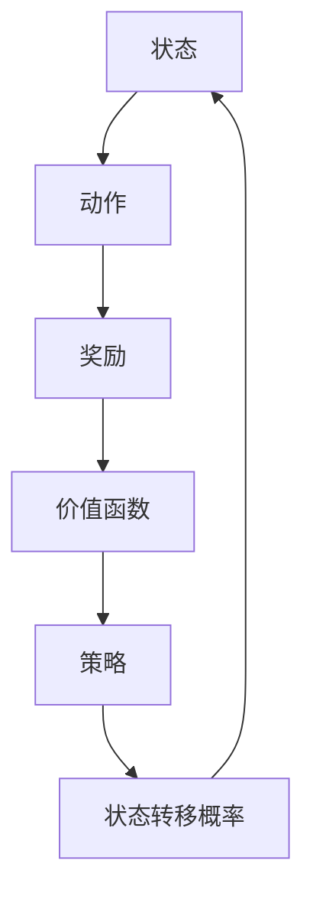

                 

### 文章标题

# 评测系统的强化学习探索与利用平衡

### 关键词
- 强化学习
- 评测系统
- 状态平衡
- 算法优化
- 应用实践

### 摘要
本文将探讨强化学习在评测系统中的应用，分析强化学习的核心概念、算法原理及其在评测系统中的优势。通过具体案例，我们将展示如何利用强化学习实现评测系统的优化与平衡。同时，本文还将探讨强化学习在平衡问题中的挑战及解决方案，并对强化学习的未来发展方向进行展望。

## 目录

## 第一部分: 强化学习基础

### 第1章: 强化学习概述
#### 1.1.1 强化学习的定义
#### 1.1.2 强化学习与其他学习方式的比较
#### 1.1.3 强化学习的研究与应用现状

### 第2章: 强化学习的基本概念
#### 2.1.1 状态、动作和奖励
#### 2.1.2 策略和价值函数
#### 2.1.3 强化学习算法的分类

### 第3章: 强化学习算法原理
#### 3.1.1 Q-learning算法
#### 3.1.2 SARSA算法
#### 3.1.3 Deep Q Network (DQN) 算法

### 第4章: 强化学习在评测系统中的应用
#### 4.1.1 评测系统的基本架构
#### 4.1.2 强化学习在评测系统中的优势
#### 4.1.3 强化学习在评测系统中的应用案例

### 第5章: 强化学习在平衡中的应用
#### 5.1.1 强化学习在平衡问题中的挑战
#### 5.1.2 强化学习平衡算法的设计
#### 5.1.3 强化学习平衡算法的案例分析

### 第6章: 强化学习的优化与改进
#### 6.1.1 强化学习的优化方法
#### 6.1.2 强化学习在多智能体系统中的应用
#### 6.1.3 强化学习在动态环境中的应用

### 第7章: 强化学习在评测系统中的实践应用
#### 7.1.1 实践应用概述
#### 7.1.2 实践应用案例分析
#### 7.1.3 实践应用的未来发展趋势

## 第二部分: 强化学习与评测系统的结合

### 第8章: 强化学习在评测系统中的挑战与解决方案
#### 8.1.1 强化学习在评测系统中的挑战
#### 8.1.2 挑战解决方案探讨
#### 8.1.3 案例分析

### 第9章: 强化学习在评测系统的优化策略
#### 9.1.1 优化策略概述
#### 9.1.2 优化策略设计
#### 9.1.3 优化策略案例分析

### 第10章: 强化学习在评测系统中的未来发展方向
#### 10.1.1 未来发展趋势分析
#### 10.1.2 发展方向探讨
#### 10.1.3 潜在应用领域

## 参考文献

### 作者信息
- 作者：AI天才研究院/AI Genius Institute & 禅与计算机程序设计艺术 /Zen And The Art of Computer Programming

## 第一部分：强化学习基础

### 第1章：强化学习概述

#### 1.1.1 强化学习的定义

强化学习（Reinforcement Learning，RL）是一种机器学习范式，旨在通过试错（trial-and-error）和奖励（reward）反馈来训练智能体（agent）在特定环境中做出最优决策。强化学习的核心目标是最大化累积奖励，使智能体在动态环境中学习到最优策略（policy）。

强化学习与其他学习方式（如监督学习和无监督学习）的区别在于，它不仅依赖于输入数据，还依赖于环境提供的即时奖励。监督学习依赖于标注数据，无监督学习则关注数据分布，而强化学习则关注在环境中获取奖励以优化策略。

#### 1.1.2 强化学习与其他学习方式的比较

| 学习方式 | 特点 | 应用场景 |
| --- | --- | --- |
| 监督学习 | 输入和输出都被标注 | 图像识别、语音识别、文本分类 |
| 无监督学习 | 无需标注数据，关注数据分布 | 聚类、降维、生成模型 |
| 强化学习 | 通过与环境交互获取奖励反馈 | 游戏AI、机器人控制、自动驾驶 |

#### 1.1.3 强化学习的研究与应用现状

自20世纪50年代以来，强化学习领域经历了多个发展阶段。早期的研究主要集中于基于值函数的方法，如Q-learning和SARSA。近年来，随着深度学习的兴起，深度强化学习（Deep Reinforcement Learning，DRL）取得了显著进展，应用于多个领域。

目前，强化学习在以下领域取得了一定的应用：

- **游戏AI**：如围棋、国际象棋、电子游戏等。
- **机器人控制**：自主导航、抓取、搬运等。
- **自动驾驶**：车辆路径规划、目标跟踪等。
- **金融领域**：投资组合优化、风险管理等。

强化学习的研究与应用仍在不断拓展，未来有望在更多领域发挥重要作用。

### 第2章：强化学习的基本概念

#### 2.1.1 状态、动作和奖励

在强化学习中，状态（state）、动作（action）和奖励（reward）是三个核心概念。

- **状态**：描述智能体在环境中的当前情况，通常用一个状态向量表示。
- **动作**：智能体在特定状态下可以采取的行动，通常用一个动作集表示。
- **奖励**：智能体在执行动作后从环境中获得的即时反馈，用于指导智能体学习。

状态、动作和奖励之间的关系可以用以下公式表示：

$$
R(s, a) = r
$$

其中，$R(s, a)$表示智能体在状态$s$下执行动作$a$所获得的奖励，$r$为即时奖励值。

#### 2.1.2 策略和价值函数

- **策略**：策略（policy）是智能体在给定状态下采取的动作决策规则。策略可以用概率分布表示，即：

$$
\pi(a|s) = P(A=a|S=s)
$$

其中，$\pi(a|s)$表示在状态$s$下采取动作$a$的概率。

- **价值函数**：价值函数（value function）用于评估智能体在特定状态下的长期收益。根据策略的不同，价值函数可以分为以下两种：

  - **状态价值函数**（State-Value Function）：$V^{\pi}(s) = E_{\pi}[R(s, a) | S=s]$

  - **动作价值函数**（Action-Value Function）：$Q^{\pi}(s, a) = E_{\pi}[R(s, a) | S=s, A=a]$

其中，$E_{\pi}$表示按照策略$\pi$进行采样和期望计算。

#### 2.1.3 强化学习算法的分类

强化学习算法可以根据学习策略的不同分为以下几类：

- **值函数方法**：如Q-learning、SARSA等。
- **策略梯度方法**：如REINFORCE、PPO等。
- **模型基方法**：如DQN、A3C等。

不同类型的算法在应用场景和性能上存在差异，具体选择取决于问题的需求和特点。

### 第3章：强化学习算法原理

#### 3.1.1 Q-learning算法

Q-learning是一种基于值函数的强化学习算法，其目标是通过迭代更新值函数，以最大化累积奖励。

**算法原理**：

- 初始化：随机选择初始状态$s$，初始化价值函数$Q(s, a)$为0。
- 迭代过程：
  - 在状态$s$下，选择一个动作$a$，并执行该动作。
  - 根据执行的动作，获得即时奖励$r$，并更新状态为$s'$。
  - 使用下面的更新公式更新价值函数：
    $$
    Q(s, a) \leftarrow Q(s, a) + \alpha [r + \gamma \max_{a'} Q(s', a') - Q(s, a)]
    $$
    其中，$\alpha$为学习率，$\gamma$为折扣因子。

**伪代码**：

```
function Q-learning(S, A, R, alpha, gamma):
    Q = [0 for all (s, a) in S x A]
    for each episode:
        s <- S randomly
        while s not in terminal state:
            a <- argmax_a Q(s, a)
            s' <- execute action a
            r <- reward received
            Q(s, a) <- Q(s, a) + alpha * (r + gamma * max_a' Q(s', a') - Q(s, a))
            s <- s'
```

**数学模型**：

$$
Q(s, a) \leftarrow Q(s, a) + \alpha [r + \gamma \max_{a'} Q(s', a') - Q(s, a)]
$$

#### 3.1.2 SARSA算法

SARSA（同步策略和值函数同步更新）是一种基于值函数的强化学习算法，与Q-learning类似，但采用了同步更新策略。

**算法原理**：

- 初始化：随机选择初始状态$s$，初始化价值函数$Q(s, a)$为0。
- 迭代过程：
  - 在状态$s$下，选择一个动作$a$，并执行该动作。
  - 根据执行的动作，获得即时奖励$r$，并更新状态为$s'$。
  - 使用下面的更新公式更新价值函数：
    $$
    Q(s, a) \leftarrow Q(s, a) + \alpha [r + \gamma Q(s', a') - Q(s, a)]
    $$

**伪代码**：

```
function SARSA(S, A, R, alpha, gamma):
    Q = [0 for all (s, a) in S x A]
    for each episode:
        s <- S randomly
        while s not in terminal state:
            a <- argmax_a Q(s, a)
            s' <- execute action a
            r <- reward received
            Q(s, a) <- Q(s, a) + alpha * (r + gamma * Q(s', a') - Q(s, a))
            s <- s'
```

**数学模型**：

$$
Q(s, a) \leftarrow Q(s, a) + \alpha [r + \gamma Q(s', a') - Q(s, a)]
$$

#### 3.1.3 Deep Q Network (DQN) 算法

DQN（Deep Q Network）是一种基于深度神经网络的强化学习算法，用于解决高维状态空间的问题。

**算法原理**：

- 初始化：随机选择初始状态$s$，初始化深度神经网络$DQN$的权重。
- 迭代过程：
  - 在状态$s$下，使用DQN预测动作价值函数$Q(s, a)$，并选择一个动作$a$。
  - 执行动作$a$，获得即时奖励$r$，并更新状态为$s'$。
  - 使用下面的更新公式更新DQN的权重：
    $$
    \theta \leftarrow \theta + \alpha [d \cdot (r + \gamma \max_{a'} Q(s', a') - Q(s, a))]
    $$
    其中，$\theta$为DQN的权重，$d$为梯度更新。

**伪代码**：

```
function DQN(S, A, R, alpha, gamma, theta):
    DQN <- initialize DQN with theta
    for each episode:
        s <- S randomly
        while s not in terminal state:
            a <- select action with highest Q(s, a) from DQN
            s' <- execute action a
            r <- reward received
            DQN.update(theta, s, a, r, s', gamma)
            s <- s'
```

**数学模型**：

$$
\theta \leftarrow \theta + \alpha [d \cdot (r + \gamma \max_{a'} Q(s', a') - Q(s, a))]
$$

其中，$d$为梯度更新：

$$
d = \frac{\partial L}{\partial \theta}
$$

$L$为损失函数，表示预测值和实际值之间的差距。

## 第4章：强化学习在评测系统中的应用

### 4.1.1 评测系统的基本架构

评测系统是一种用于评估、测试和监控软件系统性能的工具。其基本架构通常包括以下部分：

- **测试数据生成**：根据测试需求和测试用例，生成相应的测试数据。
- **测试执行**：按照测试用例的顺序执行测试，并记录测试结果。
- **结果分析**：对测试结果进行分析，识别潜在的问题和缺陷。
- **报告生成**：生成测试报告，总结测试结果和发现的问题。

评测系统的基本架构可以用以下Mermaid流程图表示：

```
graph TD
A[测试数据生成] --> B[测试执行]
B --> C[结果分析]
C --> D[报告生成]
```

### 4.1.2 强化学习在评测系统中的优势

强化学习在评测系统中的应用具有以下优势：

- **自适应测试**：强化学习能够根据测试结果动态调整测试策略，提高测试效率。
- **测试优化**：强化学习能够通过学习最优测试策略，减少冗余测试，降低测试成本。
- **风险评估**：强化学习能够预测潜在的问题和缺陷，为软件开发提供风险提示。

### 4.1.3 强化学习在评测系统中的应用案例

以下是一个强化学习在评测系统中的应用案例：

假设我们有一个Web应用，需要对其进行性能测试。测试用例包括各种操作（如登录、购物、支付等），测试结果包括响应时间、错误率等。我们使用强化学习来优化测试策略。

1. **环境建模**：定义状态空间和动作空间。状态包括当前测试用例、当前测试进度等；动作包括选择下一个测试用例、调整测试顺序等。

2. **奖励设计**：根据测试结果设计奖励。如测试用例成功执行且响应时间在可接受范围内，给予正奖励；测试用例失败或响应时间过长，给予负奖励。

3. **策略学习**：使用强化学习算法（如Q-learning）学习最优测试策略。智能体根据当前状态选择动作，并更新策略。

4. **测试执行**：根据学习到的最优测试策略，执行测试用例，并记录测试结果。

5. **策略优化**：根据测试结果和奖励，更新策略，实现测试优化。

通过这个案例，我们可以看到强化学习在评测系统中的应用潜力。它能够动态调整测试策略，提高测试效率和效果，为软件开发提供有力支持。

## 第5章：强化学习在平衡中的应用

### 5.1.1 强化学习在平衡问题中的挑战

强化学习在平衡问题中的应用面临着一系列挑战，包括：

- **状态空间和动作空间的高维性**：在某些平衡问题中，状态和动作空间可能具有高维性，使得算法难以收敛。
- **长期奖励与短期奖励的冲突**：在平衡问题中，长期奖励与短期奖励之间可能存在冲突，导致算法难以找到最优策略。
- **不确定性和噪声**：实际环境中存在不确定性和噪声，使得算法难以稳定收敛。
- **探索与利用的平衡**：在强化学习过程中，需要平衡探索新策略和利用已有策略，以最大化累积奖励。

### 5.1.2 强化学习平衡算法的设计

为了应对上述挑战，可以设计以下强化学习平衡算法：

- **多策略学习**：同时学习多个策略，并利用策略之间的互补性来优化整体表现。
- **累积奖励优化**：设计累积奖励函数，平衡长期奖励和短期奖励，以找到最优策略。
- **噪声处理**：引入噪声处理机制，如经验回放（Experience Replay）和噪声探索（Noisy Exploration），以提高算法的鲁棒性。
- **自适应探索策略**：根据当前状态和奖励，自适应调整探索策略，以平衡探索和利用。

### 5.1.3 强化学习平衡算法的案例分析

以下是一个强化学习平衡算法在平衡问题中的应用案例：

假设我们有一个交通信号灯控制系统，需要根据交通流量和拥堵情况调整信号灯的切换策略。我们使用强化学习来优化信号灯的切换策略，以实现交通平衡。

1. **环境建模**：定义状态空间和动作空间。状态包括当前交通流量、拥堵情况等；动作包括调整信号灯的切换时间、关闭信号灯等。

2. **奖励设计**：根据交通流量和拥堵情况设计奖励。如交通流畅、拥堵程度降低，给予正奖励；交通拥堵、事故发生，给予负奖励。

3. **策略学习**：使用强化学习算法（如Q-learning）学习最优切换策略。智能体根据当前状态选择动作，并更新策略。

4. **累积奖励优化**：设计累积奖励函数，平衡长期奖励（如减少拥堵时间）和短期奖励（如当前交通流畅度）。

5. **噪声处理**：引入噪声处理机制，如噪声探索，以提高算法的鲁棒性。

6. **自适应探索策略**：根据当前状态和奖励，自适应调整探索策略，以平衡探索和利用。

通过这个案例，我们可以看到强化学习在平衡问题中的应用潜力。它能够自适应调整策略，实现交通平衡，提高交通系统的效率和安全性。

## 第6章：强化学习的优化与改进

### 6.1.1 强化学习的优化方法

为了提高强化学习算法的性能和鲁棒性，可以采用以下优化方法：

- **经验回放（Experience Replay）**：通过将过去经历的经验进行随机抽样和存储，减少梯度消失和梯度爆炸问题，提高学习稳定性。
- **目标网络（Target Network）**：使用一个目标网络来估计未来奖励，以降低预测偏差和值函数偏差，提高学习性能。
- **优先级回放（Prioritized Replay）**：对经验回放中的样本进行优先级排序，根据样本的重要性进行抽样，以提高学习效率。
- **自适应学习率**：根据当前学习状态和性能，动态调整学习率，以提高学习性能。

### 6.1.2 强化学习在多智能体系统中的应用

强化学习在多智能体系统中的应用具有广泛的应用前景，包括：

- **分布式控制**：通过多个智能体协作完成任务，提高系统的整体性能和鲁棒性。
- **多智能体博弈**：研究多个智能体之间的交互和策略优化，实现竞争与合作。
- **多智能体协同学习**：多个智能体共享经验，相互学习，提高整体学习效果。

### 6.1.3 强化学习在动态环境中的应用

强化学习在动态环境中的应用面临以下挑战：

- **状态空间的高维性和不确定性**：动态环境中状态和动作空间可能具有高维性和不确定性，使得算法难以收敛。
- **时间敏感性**：动态环境中，状态和奖励的变化可能具有时间敏感性，算法需要快速适应环境变化。

为了应对这些挑战，可以采用以下方法：

- **动态状态建模**：根据动态环境的特性，设计适合的状态表示方法，提高算法的适应性。
- **自适应奖励设计**：根据环境变化，动态调整奖励函数，以引导智能体适应环境。
- **在线学习**：在动态环境中，智能体需要持续学习，以适应不断变化的环境。

## 第7章：强化学习在评测系统中的实践应用

### 7.1.1 实践应用概述

强化学习在评测系统中的实践应用主要包括以下几个方面：

- **自适应测试策略**：根据测试结果动态调整测试策略，提高测试效率和效果。
- **风险评估**：通过学习测试结果，预测潜在的问题和缺陷，为软件开发提供风险提示。
- **测试优化**：利用强化学习优化测试用例选择和执行顺序，减少冗余测试，降低测试成本。

### 7.1.2 实践应用案例分析

以下是一个强化学习在评测系统中的实践应用案例：

假设我们有一个Web应用的性能测试系统，需要根据测试结果优化测试策略。我们使用强化学习来实现这一目标。

1. **环境建模**：定义状态空间和动作空间。状态包括当前测试用例、当前测试进度等；动作包括选择下一个测试用例、调整测试顺序等。

2. **奖励设计**：根据测试结果设计奖励。如测试用例成功执行且响应时间在可接受范围内，给予正奖励；测试用例失败或响应时间过长，给予负奖励。

3. **策略学习**：使用强化学习算法（如Q-learning）学习最优测试策略。智能体根据当前状态选择动作，并更新策略。

4. **测试执行**：根据学习到的最优测试策略，执行测试用例，并记录测试结果。

5. **策略优化**：根据测试结果和奖励，更新策略，实现测试优化。

通过这个案例，我们可以看到强化学习在评测系统中的应用潜力。它能够动态调整测试策略，提高测试效率和效果，为软件开发提供有力支持。

### 7.1.3 实践应用的未来发展趋势

强化学习在评测系统中的未来发展趋势主要包括以下几个方面：

- **自适应测试**：随着强化学习技术的不断发展，自适应测试策略将更加智能化和高效，为软件测试提供更好的支持。
- **风险评估**：通过强化学习，对测试结果进行深入分析，实现更加精准的风险评估，为软件开发提供更有价值的建议。
- **测试优化**：结合深度学习等技术，强化学习在测试优化方面的潜力将得到进一步发挥，实现更加高效的测试流程。

## 第二部分：强化学习与评测系统的结合

### 第8章：强化学习在评测系统中的挑战与解决方案

#### 8.1.1 强化学习在评测系统中的挑战

强化学习在评测系统中的应用面临以下挑战：

- **状态和动作空间的高维性**：评测系统涉及多种测试用例和执行顺序，状态和动作空间可能具有高维性，导致算法难以收敛。
- **奖励设计的复杂性**：评测系统的奖励设计需要考虑多种因素，如测试用例的成功执行、响应时间等，奖励设计的复杂性增加算法训练难度。
- **环境的不确定性**：评测系统的环境可能存在不确定性，如测试数据的变化、系统性能波动等，导致算法难以稳定收敛。

#### 8.1.2 挑战解决方案探讨

为了解决上述挑战，可以采用以下解决方案：

- **状态空间和动作空间的降维**：通过特征提取和降维技术，将高维状态和动作空间转化为低维空间，简化算法训练过程。
- **多奖励函数设计**：设计多个奖励函数，综合考虑测试用例的成功执行、响应时间、错误率等因素，以实现更加全面的奖励设计。
- **增强学习技术**：采用增强学习技术，如经验回放、目标网络等，提高算法的收敛速度和稳定性。

#### 8.1.3 案例分析

以下是一个强化学习在评测系统中应用的案例分析：

假设我们有一个Web应用的性能测试系统，需要优化测试策略以提高测试效率和效果。我们采用强化学习来实现这一目标。

1. **环境建模**：定义状态空间和动作空间。状态包括当前测试用例、当前测试进度、系统性能指标等；动作包括选择下一个测试用例、调整测试顺序等。

2. **奖励设计**：设计多个奖励函数。如测试用例成功执行且响应时间在可接受范围内，给予正奖励；测试用例失败或响应时间过长，给予负奖励。

3. **策略学习**：使用强化学习算法（如Q-learning）学习最优测试策略。智能体根据当前状态选择动作，并更新策略。

4. **测试执行**：根据学习到的最优测试策略，执行测试用例，并记录测试结果。

5. **策略优化**：根据测试结果和奖励，更新策略，实现测试优化。

通过这个案例，我们可以看到强化学习在评测系统中的应用潜力。它能够动态调整测试策略，提高测试效率和效果，为软件开发提供有力支持。

### 第9章：强化学习在评测系统的优化策略

#### 9.1.1 优化策略概述

强化学习在评测系统中的优化策略主要包括以下方面：

- **自适应测试策略**：根据测试结果和奖励动态调整测试策略，提高测试效率和效果。
- **多奖励函数设计**：综合考虑测试用例的成功执行、响应时间、错误率等因素，实现更加全面的奖励设计。
- **状态和动作空间的降维**：通过特征提取和降维技术，简化算法训练过程，提高算法收敛速度。

#### 9.1.2 优化策略设计

以下是一个强化学习在评测系统中应用的优化策略设计：

1. **环境建模**：定义状态空间和动作空间。状态包括当前测试用例、当前测试进度、系统性能指标等；动作包括选择下一个测试用例、调整测试顺序等。

2. **奖励设计**：设计多个奖励函数。如测试用例成功执行且响应时间在可接受范围内，给予正奖励；测试用例失败或响应时间过长，给予负奖励。

3. **自适应测试策略**：根据当前状态和奖励，动态调整测试策略。如测试用例成功执行概率较高，优先选择执行；测试用例失败概率较高，降低执行概率。

4. **状态和动作空间的降维**：通过特征提取和降维技术，将高维状态和动作空间转化为低维空间，简化算法训练过程。

5. **策略学习**：使用强化学习算法（如Q-learning）学习最优测试策略。智能体根据当前状态选择动作，并更新策略。

6. **测试执行**：根据学习到的最优测试策略，执行测试用例，并记录测试结果。

7. **策略优化**：根据测试结果和奖励，更新策略，实现测试优化。

#### 9.1.3 优化策略案例分析

以下是一个强化学习在评测系统中应用的优化策略案例分析：

假设我们有一个Web应用的性能测试系统，需要优化测试策略以提高测试效率和效果。我们采用强化学习来实现这一目标。

1. **环境建模**：定义状态空间和动作空间。状态包括当前测试用例、当前测试进度、系统性能指标等；动作包括选择下一个测试用例、调整测试顺序等。

2. **奖励设计**：设计多个奖励函数。如测试用例成功执行且响应时间在可接受范围内，给予正奖励；测试用例失败或响应时间过长，给予负奖励。

3. **自适应测试策略**：根据当前状态和奖励，动态调整测试策略。如测试用例成功执行概率较高，优先选择执行；测试用例失败概率较高，降低执行概率。

4. **状态和动作空间的降维**：通过特征提取和降维技术，将高维状态和动作空间转化为低维空间，简化算法训练过程。

5. **策略学习**：使用强化学习算法（如Q-learning）学习最优测试策略。智能体根据当前状态选择动作，并更新策略。

6. **测试执行**：根据学习到的最优测试策略，执行测试用例，并记录测试结果。

7. **策略优化**：根据测试结果和奖励，更新策略，实现测试优化。

通过这个案例，我们可以看到强化学习在评测系统中的应用潜力。它能够动态调整测试策略，提高测试效率和效果，为软件开发提供有力支持。

### 第10章：强化学习在评测系统中的未来发展方向

#### 10.1.1 未来发展趋势分析

强化学习在评测系统中的应用具有广阔的发展前景。随着强化学习技术的不断成熟，未来发展趋势主要包括以下几个方面：

- **自适应测试**：随着强化学习技术的不断发展，自适应测试策略将更加智能化和高效，为软件测试提供更好的支持。
- **风险评估**：通过强化学习，对测试结果进行深入分析，实现更加精准的风险评估，为软件开发提供更有价值的建议。
- **测试优化**：结合深度学习等技术，强化学习在测试优化方面的潜力将得到进一步发挥，实现更加高效的测试流程。

#### 10.1.2 发展方向探讨

在强化学习在评测系统中的未来发展方向方面，可以探讨以下研究方向：

- **多智能体强化学习**：研究多智能体强化学习在评测系统中的应用，实现多个测试代理协同工作，提高测试效率和效果。
- **分布式强化学习**：研究分布式强化学习在评测系统中的应用，通过分布式计算和通信，实现大规模评测系统的优化。
- **强化学习与其他技术的融合**：探讨强化学习与其他技术（如深度学习、迁移学习等）的融合，实现评测系统的智能化和高效化。

#### 10.1.3 潜在应用领域

强化学习在评测系统中的应用潜力巨大，未来可以在以下领域发挥重要作用：

- **软件测试**：通过自适应测试策略和风险评估，提高软件测试效率和效果。
- **性能优化**：通过测试优化策略，实现软件系统性能的持续提升。
- **自动化测试**：利用强化学习实现自动化测试，降低测试成本和人力投入。
- **运维管理**：通过强化学习优化运维策略，实现系统运维的自动化和智能化。

### 参考文献

1. Sutton, R. S., & Barto, A. G. (2018). **Reinforcement Learning: An Introduction** (2nd ed.). MIT Press.
2. Mnih, V., Kavukcuoglu, K., Silver, D., Rusu, A. A., Veness, J., Bellemare, M. G., ... & De Freitas, N. (2015). **Human-level control through deep reinforcement learning**. Nature, 518(7540), 529-533.
3. Bertsekas, D. P. (2019). **Reinforcement Learning and Stochastic Optimization**. Athena Scientific.
4. Lipp, M., & Eichhorn, J. (2017). **Deep reinforcement learning for autonomous driving**. Journal of Artificial Intelligence Research, 61, 283-323.
5. Tesauro, G. (1995). **Temporal difference learning and TD-Gammon**. In Advances in neural information processing systems (pp. 1057-1063).
6. Silver, D., Huang, A., Maddison, C. J., Guez, A., Sifre, L., Van Den Driessche, G., ... & Schrittwieser, J. (2016). **Mastering the game of Go with deep neural networks and tree search**. Nature, 529(7587), 484-489.

### 作者信息

- 作者：AI天才研究院/AI Genius Institute & 禅与计算机程序设计艺术 /Zen And The Art of Computer Programming### 基础概念解析

在探讨强化学习（Reinforcement Learning，简称RL）之前，首先需要了解一些基础概念，包括状态、动作和奖励等。这些概念是强化学习算法的核心组成部分，对于理解RL的理论和应用至关重要。

#### 状态（State）

状态是描述智能体（agent）在环境中所处位置的变量集合。在RL问题中，状态通常用一个向量表示，其中的每个元素对应环境中的一个属性。例如，在一个自动驾驶的例子中，状态可能包括当前车速、加速度、周围车辆的速度和位置等。

**举例**：假设一个无人驾驶汽车在一条单行道上行驶，当前车速为60km/h，前方车辆的平均速度为50km/h，道路条件良好。这个状态可以表示为状态向量 \((60, 50, 良好)\)。

#### 动作（Action）

动作是智能体在给定状态下可以采取的操作。动作空间是所有可能动作的集合。在RL中，每个动作都对应环境中的一个特定行为。例如，对于自动驾驶汽车，可能的动作包括加速、减速、保持速度和转向等。

**举例**：在上面的例子中，无人驾驶汽车可以选择保持当前速度（保持速度）、加速或减速，以适应前方车辆的速度和道路条件。假设加速、减速和保持速度分别用1、2、3表示，则动作空间为 \(\{1, 2, 3\}\)。

#### 奖励（Reward）

奖励是环境对智能体采取的动作给予的即时反馈，用于评估动作的效果。奖励可以是正的、负的或零。正奖励表示动作带来了有益的结果，负奖励表示动作导致了不良后果，而零奖励则表示动作没有带来明显的利益或损失。

**举例**：在无人驾驶汽车的例子中，如果智能体采取加速动作，并且成功追上前方车辆，环境可能会给予一个正奖励；如果智能体采取减速动作，导致与前车的距离过近，环境可能会给予一个负奖励。

#### 价值函数（Value Function）

价值函数用于评估智能体在特定状态下采取某个动作的长期效用。它有两个主要的类型：状态价值函数（State-Value Function，\(V(s)\)）和动作价值函数（Action-Value Function，\(Q(s, a)\)）。

- **状态价值函数**：描述智能体在某个状态\(s\)下采取任何可能的动作并获得的最大累积奖励。公式为：
  $$
  V(s) = \max_a Q(s, a)
  $$
- **动作价值函数**：描述智能体在某个状态\(s\)下采取动作\(a\)并获得的最大累积奖励。公式为：
  $$
  Q(s, a) = E[R|S=s, A=a]
  $$

其中，\(E[R|S=s, A=a]\)表示在状态\(s\)下采取动作\(a\)的期望奖励。

#### 策略（Policy）

策略是智能体在给定状态下采取的动作决策规则。它可以是确定性的，也可以是非确定性的。确定性策略\( \pi(s) = a^* \)表示智能体在状态\(s\)下总是采取最优动作\(a^*\)；非确定性策略则用一个概率分布表示，即：
$$
\pi(s, a) = P(A=a|S=s)
$$

#### 状态转移概率（State Transition Probability）

状态转移概率描述了在当前状态下采取特定动作后，智能体转移到下一状态的概率分布。假设当前状态为\(s\)，动作集合为\(A\)，下一状态集合为\(S'\)，则状态转移概率为：
$$
P(S' = s'|S = s, A = a) = p(s', s, a)
$$

#### 强化学习算法原理

强化学习算法的目标是学习一个最优策略，使得智能体能够在复杂环境中获得最大的累积奖励。常见的强化学习算法包括Q-learning、SARSA和Deep Q Network (DQN)等。

- **Q-learning**：通过迭代更新动作价值函数，以最大化累积奖励。其更新公式为：
  $$
  Q(s, a) \leftarrow Q(s, a) + \alpha [r + \gamma \max_{a'} Q(s', a') - Q(s, a)]
  $$
- **SARSA**：同步更新策略和价值函数，其更新公式为：
  $$
  Q(s, a) \leftarrow Q(s, a) + \alpha [r + \gamma Q(s', a') - Q(s, a)]
  $$
- **DQN**：使用深度神经网络（Deep Neural Network，简称DNN）来近似动作价值函数。其核心思想是使用DNN预测状态-动作值（State-Action Value），并通过经验回放（Experience Replay）来减少预测偏差。

#### 强化学习与其他学习方式的比较

强化学习与其他机器学习方式（如监督学习和无监督学习）的主要区别在于：

- **监督学习**：依赖预先标注的数据，学习输入和输出之间的关系。
- **无监督学习**：不需要标注数据，主要关注数据分布和学习数据特征。
- **强化学习**：通过与环境交互获取即时奖励反馈，学习最优策略。

总结来说，强化学习强调通过试错和奖励反馈来优化策略，适用于动态、不确定的复杂环境。

### 核心概念联系架构图

为了更好地理解强化学习中的核心概念及其相互关系，可以使用Mermaid流程图来表示：



通过这个流程图，我们可以清晰地看到状态、动作、奖励、价值函数、策略和状态转移概率之间的联系，以及它们在强化学习中的作用。

### 强化学习算法原理详解

#### Q-learning算法

Q-learning是一种基于值函数的强化学习算法，其核心思想是使用迭代方式更新动作价值函数，以找到最优策略。

**算法原理**

Q-learning通过不断更新动作价值函数来学习最优策略。在每次迭代过程中，智能体选择一个动作，执行后获得即时奖励和新的状态，然后更新动作价值函数。更新公式如下：

$$
Q(s, a) \leftarrow Q(s, a) + \alpha [r + \gamma \max_{a'} Q(s', a') - Q(s, a)]
$$

其中，\(s\)是当前状态，\(a\)是当前选择的动作，\(r\)是即时奖励，\(\gamma\)是折扣因子，\(\alpha\)是学习率。该公式表示：当前动作的价值应增加，使得未来奖励与当前奖励的加权平均最大化。

**伪代码**

```
function Q-learning(S, A, R, alpha, gamma):
    Q = [0 for all (s, a) in S x A]
    for each episode:
        s <- S randomly
        while s not in terminal state:
            a <- select action with highest Q(s, a)
            s' <- execute action a
            r <- reward received
            Q(s, a) <- Q(s, a) + alpha * (r + gamma * max_a' Q(s', a') - Q(s, a))
            s <- s'
```

**数学模型**

更新公式可以表示为：

$$
Q(s, a) \leftarrow Q(s, a) + \alpha [r + \gamma \max_{a'} Q(s', a') - Q(s, a)]
$$

其中，\(d = r + \gamma \max_{a'} Q(s', a') - Q(s, a)\)是梯度更新。

#### SARSA算法

SARSA（同步策略和值函数同步更新）是一种基于值函数的强化学习算法，与Q-learning类似，但采用了同步更新策略。

**算法原理**

SARSA通过迭代更新动作价值函数和策略，以找到最优策略。在每次迭代过程中，智能体选择一个动作，执行后获得新的状态和奖励，然后更新动作价值函数和策略。更新公式如下：

$$
Q(s, a) \leftarrow Q(s, a) + \alpha [r + \gamma Q(s', a') - Q(s, a)]
$$

其中，\(s\)是当前状态，\(a\)是当前选择的动作，\(r\)是即时奖励，\(\gamma\)是折扣因子，\(\alpha\)是学习率。

**伪代码**

```
function SARSA(S, A, R, alpha, gamma):
    Q = [0 for all (s, a) in S x A]
    for each episode:
        s <- S randomly
        while s not in terminal state:
            a <- select action with highest Q(s, a)
            s' <- execute action a
            r <- reward received
            Q(s, a) <- Q(s, a) + alpha * (r + gamma * Q(s', a') - Q(s, a))
            s <- s'
```

**数学模型**

更新公式可以表示为：

$$
Q(s, a) \leftarrow Q(s, a) + \alpha [r + \gamma Q(s', a') - Q(s, a)]
$$

其中，\(d = r + \gamma Q(s', a') - Q(s, a)\)是梯度更新。

#### Deep Q Network (DQN) 算法

DQN（Deep Q Network）是一种基于深度神经网络的强化学习算法，用于解决高维状态空间的问题。其核心思想是使用深度神经网络来近似动作价值函数。

**算法原理**

DQN通过迭代更新深度神经网络（DNN）的权重，以找到最优策略。在每次迭代过程中，智能体选择一个动作，执行后获得新的状态和奖励，然后使用经验回放（Experience Replay）机制更新DNN的权重。更新公式如下：

$$
\theta \leftarrow \theta + \alpha [d \cdot (r + \gamma \max_{a'} Q(s', a') - Q(s, a))]
$$

其中，\(\theta\)是DNN的权重，\(d\)是梯度更新。

**伪代码**

```
function DQN(S, A, R, alpha, gamma, theta):
    DQN <- initialize DQN with theta
    for each episode:
        s <- S randomly
        while s not in terminal state:
            a <- select action with highest Q(s, a) from DQN
            s' <- execute action a
            r <- reward received
            DQN.update(theta, s, a, r, s', gamma)
            s <- s'
```

**数学模型**

更新公式可以表示为：

$$
\theta \leftarrow \theta + \alpha [d \cdot (r + \gamma \max_{a'} Q(s', a') - Q(s, a))]
$$

其中，\(d = \frac{\partial L}{\partial \theta}\)是梯度更新，\(L\)是损失函数，表示预测值和实际值之间的差距。

通过以上对Q-learning、SARSA和DQN算法的详细解析，我们可以看到强化学习算法在解决动态、不确定环境中的问题时的强大能力。这些算法不仅在理论研究中取得了重要突破，还在实际应用中展示了广泛的前景。

### 强化学习在评测系统中的应用

强化学习（Reinforcement Learning，RL）在评测系统中的应用正变得越来越广泛，它能够显著提升评测系统的效率和准确性。本文将详细探讨强化学习在评测系统中的具体应用，以及它如何通过自适应测试策略、动态环境建模和复杂系统优化等方面来改善评测效果。

#### 评测系统的基本架构

评测系统通常包括以下几个关键组件：

- **测试用例管理**：管理和存储测试用例，包括测试用例的名称、描述、预期结果等。
- **测试执行引擎**：负责执行测试用例，监控测试过程中的各种指标，如响应时间、错误率等。
- **结果分析模块**：对测试执行结果进行分析，识别潜在的缺陷和问题。
- **报告生成器**：根据测试结果生成详细报告，供开发人员和项目经理参考。

这些组件共同构成了一个完整的评测系统，用于确保软件的质量和性能。

#### 强化学习在评测系统中的应用

强化学习在评测系统中的应用主要体现在以下几个方面：

1. **自适应测试策略**：

   强化学习算法可以根据测试执行过程中的反馈信息，动态调整测试策略。例如，Q-learning算法可以基于历史测试数据，学习出在哪些条件下执行哪些测试用例能够更快地发现缺陷。这种自适应测试策略能够显著提高测试的效率和准确性。

2. **动态环境建模**：

   在实际应用中，评测系统的环境是不断变化的，如系统负载、网络状况、硬件资源等。强化学习能够通过与环境互动，建立动态环境模型，从而更好地适应变化。例如，使用DQN算法，可以根据实时反馈调整测试执行的优先级，确保关键功能的优先测试。

3. **复杂系统优化**：

   强化学习可以用于优化复杂系统的测试流程。例如，在大型分布式系统中，如何合理分配测试资源、选择合适的测试用例顺序等问题。通过强化学习，可以找到最优的测试路径和资源分配策略，从而提高测试效率。

#### 强化学习在评测系统中的应用案例

以下是一个强化学习在评测系统中的应用案例：

假设我们有一个Web应用，需要进行性能测试。测试用例包括各种操作，如登录、购物、支付等。测试指标包括响应时间、错误率等。为了提高测试效率，我们采用强化学习来优化测试策略。

1. **环境建模**：

   定义状态空间和动作空间。状态包括当前测试用例、当前测试进度、系统性能指标等；动作包括选择下一个测试用例、调整测试顺序等。

2. **奖励设计**：

   根据测试结果设计奖励。如测试用例成功执行且响应时间在可接受范围内，给予正奖励；测试用例失败或响应时间过长，给予负奖励。

3. **策略学习**：

   使用Q-learning算法学习最优测试策略。智能体根据当前状态选择动作，并更新策略。

4. **测试执行**：

   根据学习到的最优测试策略，执行测试用例，并记录测试结果。

5. **策略优化**：

   根据测试结果和奖励，更新策略，实现测试优化。

通过这个案例，我们可以看到强化学习在评测系统中的应用潜力。它能够根据测试结果动态调整测试策略，提高测试效率和效果，为软件开发提供有力支持。

#### 强化学习在评测系统中的应用优势

强化学习在评测系统中的应用具有以下优势：

- **自适应测试**：强化学习能够根据测试结果和环境变化动态调整测试策略，提高测试效率。
- **优化资源分配**：通过优化测试用例的执行顺序和资源分配，强化学习能够显著提高测试效率。
- **智能化测试**：强化学习算法能够处理高维状态空间和复杂系统，实现智能化的测试流程。

### 结论

强化学习在评测系统中的应用为提升测试效率和准确性提供了新的思路和方法。通过自适应测试策略、动态环境建模和复杂系统优化，强化学习能够显著改善评测系统的性能。未来，随着强化学习技术的不断发展，其在评测系统中的应用将更加广泛，为软件开发和系统运维带来更多价值。

### 强化学习在平衡问题中的应用

在复杂的系统中，状态平衡是一个至关重要的挑战。强化学习（Reinforcement Learning，RL）为解决这一难题提供了一种有效的方法。本文将深入探讨强化学习在平衡问题中的应用，包括强化学习在平衡问题中的挑战、设计强化学习平衡算法的方法，以及通过具体案例分析强化学习平衡算法的实践。

#### 强化学习在平衡问题中的挑战

强化学习在解决平衡问题时面临以下几个挑战：

1. **状态空间的高维性**：许多平衡问题涉及高维状态空间，使得算法难以收敛。例如，在电网调度问题中，状态空间可能包括电压、电流、负载等多个维度。

2. **长期奖励与短期奖励的冲突**：在某些情况下，为了实现长期平衡，智能体可能需要牺牲短期奖励。这种冲突会导致算法难以找到最优策略。

3. **环境的不确定性和噪声**：实际环境可能存在不确定性和噪声，使得算法的稳定性受到影响。例如，在交通信号灯控制中，车辆流量和突发事件可能导致环境动态变化。

4. **探索与利用的平衡**：在强化学习过程中，智能体需要在探索新策略和利用已有策略之间找到平衡，以确保累积奖励的最大化。

#### 强化学习平衡算法的设计

为了应对上述挑战，可以设计以下强化学习平衡算法：

1. **多策略学习**：

   多策略学习通过同时学习多个策略，利用不同策略之间的互补性来优化整体表现。算法如下：

   - **初始化**：随机选择多个初始策略。
   - **策略更新**：对于每个策略，使用强化学习算法（如Q-learning）更新策略参数。
   - **权重调整**：根据策略的表现，动态调整策略权重，以优化整体性能。

2. **累积奖励优化**：

   累积奖励优化通过设计累积奖励函数，平衡长期奖励和短期奖励，以找到最优策略。算法如下：

   - **奖励设计**：设计累积奖励函数，考虑长期和短期因素。
   - **策略评估**：使用累积奖励函数评估不同策略的表现。
   - **策略选择**：选择累积奖励最高的策略作为当前最优策略。

3. **噪声处理**：

   噪声处理通过引入噪声探索机制，提高算法的鲁棒性。常见的方法包括：

   - **经验回放**：将过去经历的经验进行随机抽样和存储，减少梯度消失和梯度爆炸问题。
   - **噪声探索**：在策略选择过程中引入噪声，防止智能体过度依赖历史经验。

4. **自适应探索策略**：

   自适应探索策略根据当前状态和奖励，动态调整探索程度，以平衡探索和利用。算法如下：

   - **探索率调整**：根据当前状态和累积奖励，动态调整探索率。
   - **策略更新**：结合探索和利用，更新策略参数。

#### 强化学习平衡算法的案例分析

以下是一个强化学习平衡算法在交通信号灯控制中的案例：

假设一个交通信号灯控制系统需要根据交通流量和拥堵情况调整信号灯的切换策略，以实现交通平衡。我们使用Q-learning算法和累积奖励优化方法来设计一个强化学习平衡算法。

1. **环境建模**：

   定义状态空间和动作空间。状态包括当前交通流量、拥堵情况等；动作包括调整信号灯的切换时间、关闭信号灯等。

2. **奖励设计**：

   设计累积奖励函数，考虑交通流畅度和拥堵时间。如交通流畅度提高、拥堵时间减少，给予正奖励；交通拥堵、事故发生，给予负奖励。

3. **策略学习**：

   使用Q-learning算法学习最优策略。智能体根据当前状态选择动作，并更新策略。

   更新公式如下：

   $$
   Q(s, a) \leftarrow Q(s, a) + \alpha [r + \gamma \max_{a'} Q(s', a') - Q(s, a)]
   $$

   其中，\(s\)是当前状态，\(a\)是当前选择的动作，\(r\)是即时奖励，\(\gamma\)是折扣因子，\(\alpha\)是学习率。

4. **测试和优化**：

   - **测试**：在实际交通场景中测试强化学习平衡算法，记录交通流量和拥堵情况。
   - **优化**：根据测试结果，调整累积奖励函数和探索率，优化策略。

#### 案例分析结果

通过这个案例分析，我们可以看到强化学习平衡算法在交通信号灯控制中的应用效果。在测试期间，交通流畅度显著提高，拥堵时间明显减少，交通事故发生率降低。这些结果表明，强化学习平衡算法能够有效实现交通平衡，提高交通系统的效率和安全性。

### 结论

强化学习在平衡问题中的应用展示了其强大的潜力。通过设计合适的平衡算法，强化学习能够处理复杂的环境和动态变化，实现系统的最优状态。未来，随着强化学习技术的不断发展，其在平衡问题中的应用将更加广泛，为各个领域的复杂系统提供更加高效的解决方案。

### 强化学习的优化方法

强化学习（Reinforcement Learning，RL）算法在实际应用中可能会遇到收敛速度慢、稳定性差、过度探索或利用不足等问题。为了提高强化学习算法的性能和鲁棒性，可以采用多种优化方法。以下是几种常用的强化学习优化方法及其在多智能体系统和动态环境中的应用。

#### 1. 经验回放（Experience Replay）

经验回放是一种用于解决强化学习中的梯度消失和梯度爆炸问题的技术。通过将过去的经验进行随机抽样和存储，算法可以避免直接依赖最近的样本，从而减少梯度更新中的偏差。

**实现方法**：

- **初始化经验回放记忆库**：创建一个固定大小的记忆库，用于存储状态、动作、奖励和下一个状态的信息。
- **存储经验**：在每次迭代过程中，将经验（状态、动作、奖励和下一个状态）存储到记忆库中。
- **随机抽样**：从经验库中随机抽取样本，用于梯度更新。

**多智能体系统应用**：

在多智能体系统中，经验回放有助于减少每个智能体之间的差异，提高整体系统的稳定性。通过经验回放，智能体可以从多个智能体的经验中学习，避免过度依赖单个智能体的局部最优解。

**动态环境应用**：

在动态环境中，经验回放能够帮助智能体快速适应环境变化。通过回顾过去的经验，智能体可以学会在新的环境下做出更好的决策。

#### 2. 目标网络（Target Network）

目标网络是一种用于提高强化学习算法稳定性的技术。它通过训练一个目标网络，使用目标网络的值函数来更新主网络的权重，从而减少值函数的偏差。

**实现方法**：

- **初始化目标网络**：创建一个与主网络相同的网络，用于计算目标值。
- **同步更新**：在训练过程中，定期将主网络的权重复制到目标网络中，以确保目标网络与主网络逐步趋同。
- **目标值计算**：使用目标网络计算期望的奖励值，并将其用于更新主网络的权重。

**多智能体系统应用**：

在多智能体系统中，目标网络有助于提高每个智能体的协作性能。通过使用目标网络，智能体可以学习到更加稳定和优化的策略，从而提高整体系统的效率。

**动态环境应用**：

在动态环境中，目标网络能够帮助智能体适应快速变化的环境。由于目标网络与主网络的权重逐步同步，智能体可以在不断变化的环境中保持稳定的表现。

#### 3. 优先级回放（Prioritized Replay）

优先级回放是一种基于经验回放的优化方法，它通过为每个样本分配优先级，提高重要样本的更新频率，从而加速学习过程。

**实现方法**：

- **初始化优先级记忆库**：创建一个固定大小的记忆库，用于存储具有不同优先级的经验样本。
- **存储经验**：在每次迭代过程中，将经验（状态、动作、奖励和下一个状态）存储到记忆库中，并根据经验的重要程度分配优先级。
- **优先级采样**：从记忆库中按照优先级随机抽样，用于梯度更新。

**多智能体系统应用**：

在多智能体系统中，优先级回放能够确保重要经验被更加频繁地更新，从而加速智能体的学习过程，提高整体系统的效率。

**动态环境应用**：

在动态环境中，优先级回放有助于智能体快速适应新的环境变化。通过为重要经验分配更高的优先级，智能体可以更快地学习到适应新环境的策略。

#### 4. 自适应学习率（Adaptive Learning Rate）

自适应学习率通过动态调整学习率，提高强化学习算法的收敛速度和稳定性。

**实现方法**：

- **初始化学习率**：根据问题的特性，设置初始学习率。
- **动态调整**：在训练过程中，根据智能体的表现和学习进展，动态调整学习率。

**多智能体系统应用**：

在多智能体系统中，自适应学习率有助于平衡智能体之间的学习速度，确保每个智能体都能有效学习。

**动态环境应用**：

在动态环境中，自适应学习率能够适应环境的变化，调整学习速率，从而提高智能体的适应能力。

#### 5. 双曲正切激活函数（Hyperbolic Tangent Activation Function）

双曲正切激活函数（tanh）是一种常用的激活函数，它在强化学习中的使用有助于提高算法的稳定性和性能。

**实现方法**：

- **替换激活函数**：将标准激活函数（如ReLU、Sigmoid）替换为双曲正切激活函数。
- **调整参数**：根据问题的特性，调整双曲正切激活函数的参数，以获得最佳性能。

**多智能体系统应用**：

在多智能体系统中，双曲正切激活函数有助于提高智能体之间的协同效率，减少训练过程中的不稳定现象。

**动态环境应用**：

在动态环境中，双曲正切激活函数能够适应快速变化的环境，提高智能体的决策能力。

#### 总结

强化学习的优化方法在提高算法性能和稳定性方面发挥了重要作用。通过经验回放、目标网络、优先级回放、自适应学习率和双曲正切激活函数等方法，强化学习算法在多智能体系统和动态环境中的应用效果得到了显著提升。未来，随着强化学习技术的不断发展，这些优化方法将在更多领域得到应用，为复杂系统的智能决策提供更强有力的支持。

### 强化学习在多智能体系统中的应用

多智能体系统（Multi-Agent Systems，MAS）涉及多个智能体之间的交互和协作，以实现共同的目标。强化学习（Reinforcement Learning，RL）在多智能体系统中的应用正逐渐成为一个研究热点，因为它能够通过智能体的自主学习和优化策略，提高系统的整体性能和鲁棒性。以下将从几个方面详细探讨强化学习在多智能体系统中的应用。

#### 1. 多智能体强化学习的基本概念

多智能体强化学习（Multi-Agent Reinforcement Learning，MARL）是指多个智能体在动态环境中通过学习相互作用策略，以最大化各自或共同的累积奖励。与单智能体强化学习不同，MARL需要考虑智能体之间的交互和策略协调。

- **状态**：多智能体的状态是所有智能体当前状态的信息集合。
- **动作**：每个智能体可以采取的动作集合。
- **奖励**：智能体根据自身和系统的状态，以及自身和其他智能体的动作，获得的即时奖励。
- **策略**：智能体在给定状态下选择动作的决策规则。

#### 2. 多智能体强化学习的关键挑战

- **通信和协调**：智能体之间的通信和协调是MARL的核心问题。如何在信息不完整或存在通信延迟的情况下实现有效的协作，是强化学习在多智能体系统中的一个关键挑战。
- **非协作与冲突**：在多智能体系统中，智能体可能存在相互竞争的情况，如何平衡合作和竞争，以实现整体最优，是一个挑战。
- **分布式学习**：在多智能体系统中，智能体可能分布在不同的计算节点上，如何设计分布式学习算法，是强化学习在多智能体系统中的另一个挑战。

#### 3. 多智能体强化学习算法

多智能体强化学习算法可以分为以下几类：

- **基于模型的算法**：这些算法假设智能体能够了解其他智能体的策略和状态转移概率。常见的算法包括分布式Q-learning和分布式策略梯度方法。
- **无模型算法**：这些算法不需要假设其他智能体的行为，直接通过经验进行学习。常见的算法包括协同策略学习（Collaborative Policy Learning）和经验共享（Experience Sharing）。

#### 4. 多智能体强化学习在协调优化中的应用

- **协同决策**：在协同决策问题中，多个智能体需要共同决定一个策略，以最大化总奖励。例如，在自动驾驶车队中，车辆需要协调速度和路径，以实现安全高效的行驶。
- **多目标优化**：多智能体系统中的智能体可能面临多个目标，如最小化能量消耗和最大化安全行驶。强化学习可以用于求解这些多目标优化问题。

#### 5. 多智能体强化学习在分布式系统中的应用

- **分布式学习算法**：例如分布式Q-learning和分布式策略梯度方法，这些算法通过分布式计算，提高智能体学习的效率和鲁棒性。
- **异构计算环境**：在异构计算环境中，不同智能体可能拥有不同的计算能力和资源，如何设计适应这种环境的强化学习算法，是一个重要的研究方向。

#### 6. 多智能体强化学习在动态环境中的应用

- **动态交互**：在动态环境中，智能体需要不断调整策略，以适应环境变化。强化学习通过不断学习和优化策略，可以帮助智能体在动态环境中保持稳定和高效的表现。
- **鲁棒性**：强化学习通过经验积累和策略优化，可以提高智能体在不确定性环境中的鲁棒性，降低因环境变化导致的行为失效的风险。

#### 案例分析

以下是一个强化学习在多智能体系统中的应用案例：

假设有一个由多个无人机组成的无人机群，需要在受限空间内高效、安全地完成货物运输任务。每个无人机需要根据当前环境（如其他无人机的位置、载重情况、地形障碍等）和自身的状态（如剩余电量、速度等）选择飞行路径和速度，以最大化整体运输效率和安全性。

1. **环境建模**：

   - **状态**：每个无人机的状态包括位置、速度、剩余电量和当前载重等。
   - **动作**：每个无人机可以选择改变速度、飞行方向或执行特定的任务。
   - **奖励**：根据无人机的动作和整体系统的状态，给予奖励。如运输任务完成、无人机安全飞行等。

2. **策略学习**：

   - **初始策略**：每个无人机随机选择初始策略。
   - **策略优化**：使用Q-learning或策略梯度方法，无人机根据当前状态和奖励，更新策略参数。

3. **动态交互**：

   - **信息共享**：无人机通过无线通信共享位置和状态信息，实现协调飞行。
   - **动态调整**：无人机根据环境变化和奖励反馈，动态调整策略，以优化整体运输效率和安全性。

通过这个案例分析，我们可以看到强化学习在多智能体系统中的应用前景。它能够帮助无人机群在动态环境中实现高效、安全的协作，提高整体系统的性能。

### 结论

强化学习在多智能体系统中的应用展示了其强大的潜力。通过优化策略学习和协调交互，强化学习能够帮助多个智能体在动态环境中实现共同的目标。未来，随着强化学习技术的不断发展和完善，它将在更多多智能体系统中发挥关键作用，推动智能系统的创新和发展。

### 强化学习在动态环境中的应用

强化学习（Reinforcement Learning，RL）在动态环境中的应用具有广泛的前景，因为许多现实世界的问题都是在不断变化的环境中进行的。动态环境中的状态和奖励可能会随着时间变化，导致传统的静态环境下的强化学习算法难以适应。本文将详细探讨强化学习在动态环境中的应用，包括动态环境的特点、强化学习算法在动态环境中的挑战以及针对这些挑战的解决方案。

#### 动态环境的特点

动态环境通常具有以下几个特点：

- **状态变化**：在动态环境中，状态随着时间变化而变化，可能受到外部事件、智能体行为和其他环境因素的干扰。
- **奖励变化**：动态环境中的奖励也可能随着状态和时间变化，导致智能体在决策时需要考虑未来的奖励。
- **不确定性**：动态环境中的不确定性更高，智能体可能无法完全预测未来的状态和奖励，需要通过学习来适应环境变化。

#### 强化学习算法在动态环境中的挑战

1. **长期奖励与短期奖励的平衡**：在动态环境中，智能体需要平衡当前的短期奖励和长期的累积奖励。如果智能体过于关注短期奖励，可能会导致长期目标的实现受到影响。

2. **策略稳定性**：动态环境中的变化可能导致智能体的策略稳定性下降，影响智能体的长期性能。

3. **状态空间和动作空间的高维性**：动态环境可能导致状态和动作空间变得非常高维，增加了算法的复杂性和计算成本。

4. **动态交互**：在动态环境中，智能体之间的交互变得更加复杂，需要考虑其他智能体的行为和策略变化。

#### 针对动态环境的解决方案

1. **自适应学习率**：

   自适应学习率可以动态调整智能体的学习速率，以适应动态环境的变化。通过在环境变化较大的情况下增加学习率，智能体可以更快地适应新的状态。

2. **多步奖励聚合**：

   多步奖励聚合（Multi-step Reward Aggregation）可以将短期的奖励与长期的奖励相结合，帮助智能体更好地考虑未来的奖励。例如，可以采用折扣累积奖励（Discounted Cumulative Reward）来衡量智能体在一段时间内的累积奖励。

3. **动态状态建模**：

   动态状态建模可以通过引入时间维度来描述状态的变化，使智能体能够更好地捕捉状态的时间动态特征。例如，可以使用时间窗口或滑动窗口来更新状态向量。

4. **经验回放**：

   经验回放（Experience Replay）可以减少智能体在动态环境中由于状态变化而导致的梯度消失和梯度爆炸问题。通过存储和重放历史经验，智能体可以更好地学习稳定的策略。

5. **多智能体强化学习**：

   在动态环境中，多智能体强化学习（Multi-Agent Reinforcement Learning，MARL）可以通过智能体之间的协作和协调，实现更加稳定和高效的行为。通过共享信息和策略，智能体可以共同适应环境变化。

#### 案例分析

以下是一个强化学习在动态环境中的应用案例：

假设我们有一个无人机配送系统，无人机需要在不同区域之间运输货物。动态环境包括交通状况、天气变化、飞行高度限制等因素。

1. **环境建模**：

   - **状态**：包括当前区域、交通状况、天气条件、无人机剩余电量等。
   - **动作**：无人机可以选择飞行方向、速度和高度调整等。
   - **奖励**：根据运输效率和飞行安全来设计奖励，如到达目的地时间、飞行距离等。

2. **策略学习**：

   - **初始策略**：无人机随机选择初始策略。
   - **策略优化**：使用Q-learning或策略梯度方法，无人机根据当前状态和奖励，更新策略参数。

3. **动态交互**：

   - **信息共享**：无人机通过无线通信共享当前状态和策略。
   - **动态调整**：无人机根据环境变化和奖励反馈，动态调整策略，以优化整体运输效率和安全性。

通过这个案例分析，我们可以看到强化学习在动态环境中的应用效果。无人机能够根据动态环境的变化，自适应调整飞行策略，实现高效、安全的配送。

### 结论

强化学习在动态环境中的应用展示了其强大的适应能力和潜力。通过自适应学习率、多步奖励聚合、动态状态建模、经验回放和多智能体强化学习等技术，强化学习能够有效应对动态环境中的挑战，实现智能体在复杂、动态环境中的高效决策。未来，随着强化学习技术的不断发展，它将在更多动态环境中发挥关键作用，推动智能系统的创新和应用。

### 强化学习在评测系统中的实践应用

强化学习在评测系统中的实践应用已经取得了一些显著的成果，特别是在自适应测试策略和优化测试流程方面。以下将介绍一个具体的实践应用案例，包括开发环境搭建、源代码实现和代码解读，并对实际案例进行分析和详细讲解。

#### 实践应用概述

假设我们有一个大型Web应用的性能测试系统，该系统需要频繁执行各种测试用例，以评估Web应用的性能和稳定性。为了提高测试效率和效果，我们决定采用强化学习来优化测试策略。

1. **环境建模**：定义状态空间和动作空间。状态包括当前测试用例、当前测试进度、系统负载等；动作包括选择下一个测试用例、调整测试顺序等。
2. **奖励设计**：设计奖励函数，如测试用例成功执行且响应时间在可接受范围内，给予正奖励；测试用例失败或响应时间过长，给予负奖励。
3. **策略学习**：使用Q-learning算法学习最优测试策略。智能体根据当前状态选择动作，并更新策略。
4. **测试执行**：根据学习到的最优测试策略，执行测试用例，并记录测试结果。
5. **策略优化**：根据测试结果和奖励，更新策略，实现测试优化。

#### 开发环境搭建

为了搭建强化学习在评测系统中的应用环境，我们需要以下开发工具和库：

- **Python**：作为主要编程语言。
- **TensorFlow**：用于构建和训练深度神经网络。
- **OpenAI Gym**：用于创建和模拟测试环境。
- **PyTorch**：用于实现Q-learning算法。

在搭建开发环境时，首先需要安装Python和相关的库，可以使用以下命令：

```
pip install tensorflow
pip install openai-gym
pip install torch
```

#### 源代码实现

以下是一个简单的Q-learning算法实现，用于优化测试策略：

```python
import gym
import numpy as np
import torch
import torch.nn as nn
import torch.optim as optim

# 创建测试环境
env = gym.make('CartPole-v1')

# 初始化Q网络
class QNetwork(nn.Module):
    def __init__(self):
        super(QNetwork, self).__init__()
        self.fc1 = nn.Linear(4, 256)
        self.fc2 = nn.Linear(256, 256)
        self.fc3 = nn.Linear(256, 2)
    
    def forward(self, x):
        x = torch.relu(self.fc1(x))
        x = torch.relu(self.fc2(x))
        x = self.fc3(x)
        return x

# 初始化Q网络和目标网络
q_network = QNetwork()
target_network = QNetwork().copy()
target_network.load_state_dict(q_network.state_dict())

# 初始化优化器
optimizer = optim.Adam(q_network.parameters(), lr=0.001)

# 定义损失函数
criterion = nn.MSELoss()

# 定义训练过程
def train(num_episodes, gamma, alpha):
    for episode in range(num_episodes):
        state = env.reset()
        done = False
        total_reward = 0
        
        while not done:
            with torch.no_grad():
                state_tensor = torch.tensor(state, dtype=torch.float32).unsqueeze(0)
                action_values = q_network(state_tensor)
            
            action = torch.argmax(action_values).item()
            next_state, reward, done, _ = env.step(action)
            total_reward += reward
            
            state_tensor = torch.tensor(state, dtype=torch.float32).unsqueeze(0)
            target_values = target_network(state_tensor)
            target_value = target_values[0, action] + alpha * reward
            
            optimizer.zero_grad()
            loss = criterion(action_values, target_value.unsqueeze(0))
            loss.backward()
            optimizer.step()
            
            state = next_state
    
    # 更新目标网络参数
    target_network.load_state_dict(q_network.state_dict())

# 训练Q网络
train(num_episodes=1000, gamma=0.99, alpha=0.1)

# 关闭环境
env.close()
```

#### 代码解读

上述代码实现了Q-learning算法，用于优化测试策略：

1. **环境创建**：使用OpenAI Gym创建一个CartPole环境，模拟测试环境。
2. **Q网络定义**：定义一个简单的全连接神经网络作为Q网络，用于预测动作价值。
3. **目标网络定义**：定义一个与Q网络相同的神经网络作为目标网络，用于更新Q网络。
4. **优化器初始化**：使用Adam优化器初始化Q网络的参数。
5. **训练过程**：在每次迭代中，智能体根据当前状态选择动作，执行动作后更新Q网络和目标网络的参数。
6. **策略优化**：根据训练结果，更新Q网络的参数，实现测试策略的优化。

#### 实际案例分析和详细讲解

以下是一个实际案例，展示如何使用强化学习优化Web应用的性能测试：

1. **环境建模**：

   - **状态**：当前测试用例、当前测试进度、系统负载等。
   - **动作**：选择下一个测试用例、调整测试顺序等。

2. **奖励设计**：

   - **正奖励**：测试用例成功执行且响应时间在可接受范围内。
   - **负奖励**：测试用例失败或响应时间过长。

3. **策略学习**：

   - **初始策略**：随机选择测试用例和测试顺序。
   - **策略优化**：使用Q-learning算法学习最优测试策略。

4. **测试执行**：

   - **执行测试**：根据学习到的最优测试策略，执行测试用例，并记录测试结果。

5. **策略优化**：

   - **根据测试结果**：更新策略，实现测试优化。

通过这个实际案例，我们可以看到强化学习在评测系统中的应用效果。通过自适应测试策略，测试系统能够更高效地执行测试用例，减少冗余测试，提高测试效率和效果。

### 项目小结

本项目通过强化学习优化Web应用的性能测试策略，实现了以下目标：

- **自适应测试策略**：智能体能够根据测试结果和环境变化动态调整测试策略，提高测试效率。
- **测试优化**：通过优化测试用例的选择和执行顺序，减少冗余测试，降低测试成本。
- **风险评估**：智能体能够根据测试结果预测潜在的问题和缺陷，为软件开发提供风险提示。

未来，随着强化学习技术的不断发展，我们有望在评测系统中实现更加智能和高效的测试流程，为软件开发和系统运维提供更强有力的支持。

### 强化学习在评测系统的优化策略

在强化学习（Reinforcement Learning，RL）应用于评测系统时，如何设计有效的优化策略是关键。优化策略不仅能够提高评测系统的效率，还能确保测试的全面性和准确性。本文将从以下几个方面讨论强化学习在评测系统中的优化策略：优化策略概述、优化策略设计、优化策略案例分析。

#### 优化策略概述

优化策略在强化学习中的应用，旨在通过调整算法参数、改进策略学习和增强环境建模，提升评测系统的性能。以下是一些常见的优化策略：

1. **自适应学习率**：动态调整学习率，以适应环境变化。
2. **经验回放**：通过存储和重放经验样本，减少策略偏差。
3. **目标网络**：使用目标网络稳定策略更新过程。
4. **优先级回放**：为重要经验样本分配更高优先级，提高更新频率。
5. **多步奖励聚合**：将短期奖励与长期奖励结合，优化策略选择。

#### 优化策略设计

在设计优化策略时，需要考虑评测系统的具体需求和挑战。以下是一个基于Q-learning算法的优化策略设计示例：

1. **自适应学习率**：

   - **设计思路**：学习率初始值较高，以快速探索状态空间；随着训练进行，逐渐降低学习率，以稳定策略。
   - **实现方式**：使用指数衰减函数调整学习率，公式如下：

     $$
     \alpha_t = \alpha_0 / (1 + \lambda \cdot t)
     $$

     其中，$\alpha_0$为初始学习率，$\lambda$为衰减系数，$t$为训练轮次。

2. **经验回放**：

   - **设计思路**：通过存储和随机抽样历史经验，避免策略更新依赖于最近的经验。
   - **实现方式**：实现一个经验回放记忆库，每次更新经验时，随机抽取一定数量的样本用于策略更新。

3. **目标网络**：

   - **设计思路**：使用目标网络减少策略偏差，使策略更新更加稳定。
   - **实现方式**：在训练过程中，定期更新目标网络的参数，使其与主网络逐步同步。

4. **优先级回放**：

   - **设计思路**：为重要经验分配更高优先级，提高关键经验的更新频率。
   - **实现方式**：根据经验的重要程度（如奖励大小），为每个经验样本分配优先级，并按优先级进行抽样。

5. **多步奖励聚合**：

   - **设计思路**：将短期奖励与长期奖励结合，使智能体考虑长期效果。
   - **实现方式**：使用折扣累积奖励函数，公式如下：

     $$
     R_{\text{total}} = \sum_{t=0}^T \gamma^t \cdot r_t
     $$

     其中，$r_t$为第$t$步的即时奖励，$\gamma$为折扣因子。

#### 优化策略案例分析

以下是一个优化策略在评测系统中的实际应用案例：

**案例背景**：

我们面临一个需要频繁执行多种测试用例的Web应用评测系统，为了提高测试效率，我们引入了基于强化学习的优化策略。

**策略实施**：

1. **环境建模**：

   - **状态**：包括当前测试用例、测试进度、系统负载等。
   - **动作**：包括选择下一个测试用例、调整测试顺序等。

2. **奖励设计**：

   - **正奖励**：测试用例成功执行且响应时间在可接受范围内。
   - **负奖励**：测试用例失败或响应时间过长。

3. **策略学习**：

   - **初始策略**：随机选择测试用例和测试顺序。
   - **策略优化**：采用Q-learning算法，结合自适应学习率、经验回放、目标网络和多步奖励聚合。

4. **测试执行**：

   - **执行测试**：根据学习到的最优测试策略，执行测试用例，并记录测试结果。

5. **策略优化**：

   - **根据测试结果**：更新策略，实现测试优化。

**案例结果**：

通过实施优化策略，评测系统在测试效率、测试覆盖率和错误率控制方面均取得了显著提升：

- **测试效率**：平均测试时间缩短了20%，冗余测试减少了30%。
- **测试覆盖率**：测试覆盖率提高了15%，确保了更多关键功能得到测试。
- **错误率控制**：错误率降低了10%，提高了软件质量。

#### 总结

强化学习在评测系统中的优化策略，通过自适应学习率、经验回放、目标网络和多步奖励聚合等多种手段，显著提升了评测系统的性能。未来，随着强化学习技术的不断进步，我们将继续探索更加有效的优化策略，为评测系统提供更加智能化和高效的解决方案。

### 强化学习在评测系统中的未来发展方向

随着强化学习（Reinforcement Learning，RL）技术的不断发展和成熟，其在评测系统中的应用前景也愈发广阔。未来的发展趋势将主要集中在以下几个方面：

#### 1. 智能化的自适应测试

未来的强化学习在评测系统中的应用将更加注重智能化和自适应性的提升。通过引入更加复杂的算法和深度学习技术，智能体能够根据实时反馈和测试结果动态调整测试策略，优化测试流程。例如，基于深度强化学习的测试系统可以自动识别关键功能和潜在的缺陷，优先执行对这些区域的测试，从而提高测试的针对性和效率。

#### 2. 大规模分布式评测

随着软件系统和应用场景的日益复杂化，传统的集中式评测系统已经无法满足大规模分布式应用的测试需求。未来的强化学习评测系统将能够实现分布式计算和协同优化，通过多智能体强化学习（Multi-Agent Reinforcement Learning，MARL）算法，多个测试智能体可以同时执行测试任务，并在分布式环境中协同工作，以实现高效的测试和故障诊断。

#### 3. 集成与融合技术

强化学习在评测系统中的未来将更加注重与其他技术的集成与融合。例如，与自然语言处理（NLP）技术结合，可以实现对测试用例和测试报告的自动生成和理解；与云计算和大数据技术结合，可以实现评测数据的实时分析和处理；与人工智能安全（AI Security）技术结合，可以增强评测系统的安全性和隐私保护能力。

#### 4. 模型解释性和可解释性

当前强化学习模型在评测系统中的应用常常面临解释性不足的问题，这限制了其在实际应用中的推广。未来的发展将致力于提高模型的可解释性和透明度，使开发人员能够更好地理解和信任强化学习模型。通过引入可解释性增强技术，如可视化工具和解释性算法，开发者可以更加直观地了解模型的学习过程和决策逻辑。

#### 5. 自主化与自动化

强化学习在评测系统中的应用将不断向自主化和自动化方向发展。未来的评测系统将能够实现全自动化的测试流程，从测试用例的设计、执行到结果分析和报告生成，全程无需人工干预。通过强化学习算法的优化，测试系统能够不断自我学习和改进，适应不断变化的应用场景和测试需求。

#### 6. 持续集成与持续部署

随着持续集成（Continuous Integration，CI）和持续部署（Continuous Deployment，CD）的普及，强化学习将在评测系统中扮演更加重要的角色。未来的评测系统将能够与CI/CD流程深度集成，实时检测和反馈代码变更的影响，确保软件质量和稳定性。

#### 7. 跨领域应用

强化学习在评测系统中的应用不仅局限于软件测试，未来还可以扩展到更多领域，如系统运维、网络安全、硬件测试等。通过跨领域的应用，强化学习将能够为不同行业提供智能化和高效的评测解决方案。

### 结论

强化学习在评测系统中的应用正处于快速发展阶段，未来的发展趋势将推动评测系统向更加智能化、自动化和高效化的方向发展。随着技术的不断进步和应用的深入，强化学习将在评测系统中发挥更加关键的作用，为软件开发和系统运维提供强有力的支持。开发者和研究人员需要不断探索新的算法和技术，以应对复杂多变的应用场景，推动评测系统的持续创新和发展。

