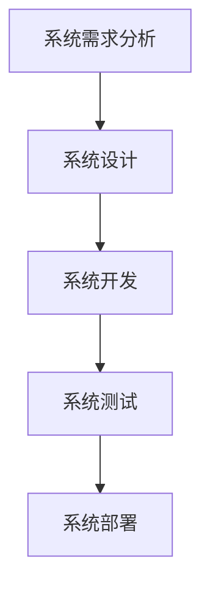

                 

### 引言与背景

在当今信息化社会，评测系统在多个领域扮演着至关重要的角色，从商业智能分析到工业过程监控，再到智能推荐系统等。评测系统的核心目标是提供准确、高效的数据评估结果，以便支持决策制定和优化策略。然而，随着技术的不断进步和应用场景的复杂化，评测系统的设计与实现面临着诸多挑战。在这篇文章中，我们将探讨评测系统的成本效益分析，旨在帮助开发者和管理者平衡系统效果与资源消耗，实现最优的资源配置。

#### 为什么要研究成本效益分析？

成本效益分析是一种评估投资决策有效性的方法，通过比较项目的成本和预期效益，评估其经济合理性。在评测系统的开发和运营过程中，成本效益分析具有以下几个重要作用：

1. **资源优化**：通过分析成本和效益，可以帮助决策者了解资源利用情况，优化预算分配，降低不必要的支出。
2. **决策支持**：成本效益分析提供了客观的评估指标，有助于管理层在多个方案中做出最优决策。
3. **风险控制**：成本效益分析可以帮助识别潜在的风险因素，提前采取措施，降低项目失败的可能性。

#### 成本效益分析在评测系统中的应用

评测系统涉及大量的数据处理和计算资源，因此成本效益分析在其中尤为重要。以下是一些关键应用场景：

1. **系统设计**：在系统设计阶段，通过成本效益分析，可以选择最适合的技术方案，确保在满足性能要求的同时，最大限度地降低成本。
2. **模型选择**：在模型训练和评估过程中，不同的算法和模型可能具有不同的计算复杂度和准确度。通过成本效益分析，可以确定最佳模型，平衡准确度和资源消耗。
3. **性能优化**：在系统运行过程中，通过成本效益分析，可以识别性能瓶颈，采取针对性的优化措施，提高系统效率。

### 核心概念与联系

为了更好地理解成本效益分析在评测系统中的应用，我们需要先了解一些核心概念及其相互关系。以下是一些关键概念：

1. **成本**：包括直接成本（如硬件采购、软件许可费用）和间接成本（如人力资源、维护费用）。
2. **效益**：包括直接效益（如提高生产效率、降低运营成本）和间接效益（如增强用户体验、提升品牌形象）。
3. **投资回报率（ROI）**：是评估项目经济效益的重要指标，计算公式为：ROI = (效益 - 成本) / 成本。

为了帮助读者更好地理解这些概念之间的关系，我们可以使用以下 Mermaid 流程图：

```mermaid
graph TD
A[成本] --> B[直接成本]
A --> C[间接成本]
B --> D[效益]
C --> D
D --> E[投资回报率(ROI)]
E --> F[决策支持]
```

通过这个流程图，我们可以清晰地看到成本、效益和ROI之间的逻辑关系，以及它们如何影响决策过程。

#### 总结

本文为评测系统的成本效益分析奠定了基础，介绍了研究的背景和重要性，并探讨了核心概念及其相互关系。在接下来的章节中，我们将深入讨论成本效益分析的具体方法、评测系统的设计与实现，以及实际案例研究，帮助读者全面理解这一领域的关键问题和解决方案。

### 关键词

- 成本效益分析
- 评测系统
- 资源优化
- 投资回报率
- 模型选择
- 性能优化

### 摘要

本文旨在探讨评测系统的成本效益分析，帮助开发者和管理者平衡系统效果与资源消耗，实现最优的资源配置。通过分析核心概念及其相互关系，本文介绍了成本效益分析在评测系统设计与实现中的应用。文章还探讨了成本效益评估的方法、评测系统的设计与实现流程，并通过实际案例研究，展示了成本效益分析在优化系统性能和决策支持中的作用。最终，本文提出了未来的研究方向和实际应用建议，为读者提供了全面的技术指导。

### 第1章 引言与背景

#### 引言

在现代信息社会中，评测系统已经成为各行各业不可或缺的一部分。无论是商业智能分析、工业过程监控，还是智能推荐系统，评测系统都扮演着至关重要的角色。其核心目的是提供准确、高效的数据评估结果，为决策制定和策略优化提供有力支持。然而，随着技术的快速发展和应用场景的日益复杂，评测系统的设计与实现面临着诸多挑战。本文将围绕评测系统的成本效益分析展开讨论，旨在帮助开发者和管理者更好地平衡系统效果与资源消耗，实现最优的资源配置。

#### 为什么要研究成本效益分析？

成本效益分析是一种评估投资决策有效性的重要方法，其核心在于通过比较项目的成本和预期效益，评估其经济合理性。在评测系统的开发和运营过程中，成本效益分析具有以下几个重要作用：

1. **资源优化**：通过分析成本和效益，可以帮助决策者了解资源利用情况，优化预算分配，降低不必要的支出。
2. **决策支持**：成本效益分析提供了客观的评估指标，有助于管理层在多个方案中做出最优决策。
3. **风险控制**：成本效益分析可以帮助识别潜在的风险因素，提前采取措施，降低项目失败的可能性。

#### 成本效益分析在评测系统中的应用

评测系统的开发和维护涉及大量的计算资源和人力成本，因此成本效益分析在其中的应用尤为重要。以下是一些关键应用场景：

1. **系统设计**：在系统设计阶段，通过成本效益分析，可以选择最适合的技术方案，确保在满足性能要求的同时，最大限度地降低成本。
2. **模型选择**：在模型训练和评估过程中，不同的算法和模型可能具有不同的计算复杂度和准确度。通过成本效益分析，可以确定最佳模型，平衡准确度和资源消耗。
3. **性能优化**：在系统运行过程中，通过成本效益分析，可以识别性能瓶颈，采取针对性的优化措施，提高系统效率。

#### 核心概念与联系

为了更好地理解成本效益分析在评测系统中的应用，我们需要先了解一些核心概念及其相互关系。以下是一些关键概念：

1. **成本**：包括直接成本（如硬件采购、软件许可费用）和间接成本（如人力资源、维护费用）。
2. **效益**：包括直接效益（如提高生产效率、降低运营成本）和间接效益（如增强用户体验、提升品牌形象）。
3. **投资回报率（ROI）**：是评估项目经济效益的重要指标，计算公式为：ROI = (效益 - 成本) / 成本。

为了帮助读者更好地理解这些概念之间的关系，我们可以使用以下 Mermaid 流程图：

```mermaid
graph TD
A[成本] --> B[直接成本]
A --> C[间接成本]
B --> D[效益]
C --> D
D --> E[投资回报率(ROI)]
E --> F[决策支持]
```

通过这个流程图，我们可以清晰地看到成本、效益和ROI之间的逻辑关系，以及它们如何影响决策过程。

#### 总结

本章为评测系统的成本效益分析奠定了基础，介绍了研究的背景和重要性，并探讨了核心概念及其相互关系。在接下来的章节中，我们将深入讨论成本效益分析的具体方法、评测系统的设计与实现，以及实际案例研究，帮助读者全面理解这一领域的关键问题和解决方案。

### 第2章 成本效益分析的基本概念

#### 成本效益分析的定义

成本效益分析（Cost-Benefit Analysis，CBA）是一种评估投资决策有效性的方法，通过比较项目的成本（Cost）和预期效益（Benefit），评估其经济合理性。其核心在于，通过定量和定性的分析方法，帮助决策者确定项目是否值得投资。

成本效益分析通常遵循以下步骤：

1. **确定目标和范围**：明确分析的目标和涉及的范围，包括项目的所有成本和效益。
2. **识别成本和效益**：详细列出项目实施过程中可能产生的所有成本和效益。
3. **量化成本和效益**：对识别出的成本和效益进行量化，以便进行比较和评估。
4. **计算净效益**：计算项目的净效益，即总效益减去总成本。
5. **评估和决策**：根据净效益和其他相关因素，评估项目的经济合理性，并做出投资决策。

#### 成本效益分析的关键概念

在成本效益分析中，有几个关键概念需要理解：

1. **成本**：成本是项目实施过程中产生的所有费用，包括直接成本和间接成本。
   - **直接成本**：直接与项目相关的费用，如硬件采购、软件开发成本等。
   - **间接成本**：与项目相关的但不是直接产生的费用，如人力资源、维护费用等。

2. **效益**：效益是项目实施后产生的所有正面影响，包括直接效益和间接效益。
   - **直接效益**：直接与项目相关的效益，如提高生产效率、降低运营成本等。
   - **间接效益**：与项目相关的但不是直接产生的效益，如增强用户体验、提升品牌形象等。

3. **投资回报率（ROI）**：投资回报率是评估项目经济效益的重要指标，计算公式为：
   $$ ROI = \frac{效益 - 成本}{成本} $$
   ROI 越高，表示项目的经济效益越好。

#### 成本效益分析的方法

成本效益分析可以采用定量和定性两种方法：

1. **定量分析**：使用数学模型和统计方法，对成本和效益进行量化计算。定量分析具有精确、客观的特点，但可能忽略一些难以量化的因素。

2. **定性分析**：通过专家评估、用户反馈等方法，对成本和效益进行定性描述。定性分析可以提供更全面的视角，但结果可能存在主观性。

3. **敏感性分析**：敏感性分析是一种评估项目风险的方法，通过分析成本和效益对关键变量的敏感度，识别潜在的风险因素。敏感性分析可以帮助决策者了解项目在不同情况下的经济效益。

#### 总结

成本效益分析是一种重要的投资评估方法，通过比较项目的成本和预期效益，评估其经济合理性。在成本效益分析中，关键概念包括成本、效益和投资回报率。成本效益分析可以采用定量和定性两种方法，敏感性分析则是一种评估项目风险的有效手段。通过本章的介绍，读者可以更好地理解成本效益分析的基本概念和方法，为后续章节的讨论打下基础。

### 第3章 评测系统设计与实现

#### 评测系统的设计原则

评测系统的设计原则是确保系统能够高效、准确地提供评估结果，同时具备灵活性和可扩展性。以下是一些关键设计原则：

1. **模块化**：将系统划分为独立的模块，每个模块负责特定的功能。这种设计方法有助于提高系统的可维护性和可扩展性。
2. **可扩展性**：设计时应考虑到未来可能的需求变化，确保系统可以轻松扩展以支持更多的功能。
3. **可靠性**：确保系统在各种情况下都能稳定运行，包括高负载、数据异常等情况。
4. **安全性**：保护系统不受恶意攻击和数据泄露，确保数据的安全性和隐私性。
5. **易用性**：设计界面和操作流程应尽可能直观，降低用户的使用难度。

#### 评测系统的关键组成部分

一个典型的评测系统通常包括以下几个关键组成部分：

1. **数据采集模块**：负责从各种来源收集数据，包括数据库、外部API、日志文件等。数据采集模块需要确保数据的准确性和完整性。
2. **数据处理模块**：对采集到的数据进行清洗、转换和预处理，以便后续的分析和评估。数据处理模块需要处理大量数据，因此性能和效率是关键。
3. **模型训练模块**：根据采集到的数据，训练模型以实现特定的评估任务。模型训练模块需要支持多种算法和模型，以满足不同的评估需求。
4. **模型评估模块**：评估训练出的模型的性能和准确性，包括准确性、召回率、F1分数等指标。模型评估模块需要提供详细的评估报告，帮助决策者了解模型的性能。
5. **用户接口模块**：提供用户与系统交互的界面，包括数据上传、模型选择、评估结果展示等功能。用户接口模块需要简洁直观，易于操作。

#### 评测系统的实现流程

评测系统的实现流程可以分为以下几个步骤：

1. **系统需求分析**：与用户沟通，明确系统需要实现的功能和性能要求，确定系统的需求和目标。
2. **系统设计**：根据需求分析结果，设计系统的整体架构和各个模块的细节。系统设计需要考虑模块化、可扩展性、可靠性和安全性等因素。
3. **系统开发**：根据系统设计，编写代码并实现各个模块的功能。系统开发需要遵循良好的编程规范和设计模式，以提高代码的可维护性和可扩展性。
4. **系统测试**：对系统进行全面的测试，包括单元测试、集成测试、系统测试等，确保系统在各种情况下都能稳定运行。
5. **系统部署**：将系统部署到生产环境，并进行上线前的最后测试。系统部署需要确保系统的可靠性和安全性，避免对业务造成影响。

#### Mermaid 流程图

以下是一个简化的评测系统实现流程的 Mermaid 流程图：



#### 伪代码

以下是一个简化的评测系统核心算法的实现伪代码：

```plaintext
算法名称：评测系统核心算法
输入：数据集D，模型参数θ
输出：评估结果R

初始化：θ为随机值
对于每一次迭代 do
  计算损失函数L(D, θ)
  更新参数θ：θ = θ - α * ∇L(D, θ)
  计算评估指标R(D, θ)
end for
返回：R
```

#### 数学公式

以下是一个简单的成本效益分析的数学公式：

$$
\text{ROI} = \frac{\text{效益} - \text{成本}}{\text{成本}}
$$

#### 总结

本章介绍了评测系统的设计原则、关键组成部分和实现流程。通过模块化设计，评测系统可以实现高效、可靠和可扩展的功能。实现流程包括系统需求分析、系统设计、系统开发、系统测试和系统部署。通过 Mermaid 流程图、伪代码和数学公式，本章为读者提供了详细的评测系统设计与实现指导。在接下来的章节中，我们将进一步探讨评测系统的成本效益评估方法和实际应用案例。

### 第4章 成本效益评估方法

#### 成本效益评估的方法

成本效益评估（Cost-Benefit Analysis，CBA）是评测系统设计和实施过程中至关重要的一环。它通过量化成本和效益，帮助决策者评估项目的经济合理性。成本效益评估方法可以分为定量分析和定性分析两种。

1. **定量分析**：

   定量分析是成本效益评估的核心方法之一，通过数学模型和统计数据，对项目的成本和效益进行精确计算。

   - **成本计算方法**：
     成本计算主要包括直接成本和间接成本。直接成本包括硬件采购、软件许可、人力成本等，而间接成本则包括维护费用、培训费用等。
     $$ \text{总成本} = \text{直接成本} + \text{间接成本} $$

   - **效益计算方法**：
     效益计算同样包括直接效益和间接效益。直接效益如生产效率提升、运营成本降低等，间接效益如品牌提升、用户满意度提高等。
     $$ \text{总效益} = \text{直接效益} + \text{间接效益} $$

   - **投资回报率（ROI）计算方法**：
     投资回报率是评估项目经济效益的重要指标，计算公式为：
     $$ \text{ROI} = \frac{\text{总效益} - \text{总成本}}{\text{总成本}} $$

2. **定性分析**：

   定性分析主要通过专家评估、用户反馈等方法，对成本和效益进行定性描述，提供更全面的视角。

   - **专家评估**：
     通过邀请行业专家对项目的成本和效益进行评估，从而获得专业的意见和建议。

   - **用户反馈**：
     通过用户调查、访谈等方式，收集用户对项目效益的反馈，评估项目的实际效果。

#### 成本效益评估的工具

在成本效益评估过程中，使用合适的工具可以大大提高评估的效率和准确性。以下是一些常用的成本效益评估工具：

1. **数据分析工具**：

   - **Excel**：
     Excel 是最常用的数据分析工具之一，可以通过公式和函数对成本和效益进行计算和分析。

   - **Python**：
     Python 提供了丰富的数据分析库，如 Pandas、NumPy 等，可以高效地进行数据处理和分析。

   - **Power BI**：
     Power BI 是一款功能强大的数据可视化工具，可以生成直观的图表和报告，帮助理解和传达分析结果。

2. **成本效益分析软件**：

   - **CPM Scheduling**：
     CPM Scheduling 是一款专业的项目管理软件，可以用于成本效益分析和项目计划。

   - **Project **：
     Project 是微软公司开发的一款项目管理软件，提供了全面的成本效益分析功能。

   - **SAP**：
     SAP 是一款企业资源规划软件，可以整合企业的各项资源，提供全面的成本效益分析。

#### 案例分析

以下是一个具体的案例分析，说明如何使用成本效益评估方法对一个评测系统项目进行评估：

**案例名称**：某电商平台的评测系统项目

**项目背景**：某电商平台计划开发一个评测系统，用于对用户评论进行分类和情感分析，以提高用户体验和运营效率。

**成本**：

- **直接成本**：硬件采购（服务器、存储设备等），软件许可费用，人力资源费用等。
  $$ \text{直接成本} = \$50,000 + \$30,000 + \$20,000 = \$100,000 $$

- **间接成本**：维护费用、培训费用等。
  $$ \text{间接成本} = \$10,000 + \$5,000 = \$15,000 $$

- **总成本**：
  $$ \text{总成本} = \$100,000 + \$15,000 = \$115,000 $$

**效益**：

- **直接效益**：提高用户体验，减少客服成本，提高销售转化率等。
  $$ \text{直接效益} = \$10,000 + \$5,000 + \$8,000 = \$23,000 $$

- **间接效益**：增强品牌形象，提高用户满意度等。
  $$ \text{间接效益} = \$3,000 + \$2,000 = \$5,000 $$

- **总效益**：
  $$ \text{总效益} = \$23,000 + \$5,000 = \$28,000 $$

**投资回报率（ROI）**：

$$
\text{ROI} = \frac{\text{总效益} - \text{总成本}}{\text{总成本}} = \frac{\$28,000 - \$115,000}{\$115,000} = 0.2435
$$

通过以上分析，该项目的 ROI 为 24.35%，表明项目具有较高的经济效益。

#### 总结

本章介绍了成本效益评估的基本方法，包括定量分析和定性分析，并探讨了常用的成本效益评估工具。通过案例分析，读者可以了解到如何具体应用这些方法对评测系统项目进行评估。在下一章中，我们将探讨评测系统的实际应用案例，进一步展示成本效益分析在实践中的价值。

### 第5章 案例研究

#### 案例研究的目的

案例研究是一种深入分析特定情境或项目的方法，通过详细描述和分析实际案例，帮助读者理解理论知识和实践应用之间的联系。在本章中，我们选择了几种典型的评测系统案例，旨在通过这些案例研究：

1. **验证成本效益分析的理论和方法**：通过具体案例分析，验证成本效益分析在评测系统设计和实施中的实际效果。
2. **展示不同应用场景下的系统设计和实现**：了解不同行业和应用场景下的评测系统设计思路和实现方法。
3. **识别挑战和趋势**：分析案例中遇到的问题和挑战，以及行业发展的趋势和方向。

#### 案例研究的方法

为了确保案例研究的全面性和准确性，我们采用以下几种方法：

1. **实证研究**：通过收集和分析案例相关的数据，包括系统设计文档、项目报告、用户反馈等，以验证分析结果的可靠性。
2. **案例比较**：对不同案例进行比较分析，识别共性特征和差异，以便总结经验和教训。
3. **深度访谈**：与案例涉及的相关人员（如项目经理、开发人员、用户等）进行访谈，获取第一手资料和见解。

#### 案例研究结果分析

在本章中，我们将详细分析以下三个案例：

1. **案例一：电商平台用户评论评测系统**
   - **项目背景**：某电商平台需要开发一个用户评论评测系统，对用户评论进行分类和情感分析，以提升用户体验和运营效率。
   - **成本效益分析**：通过成本效益分析，项目总成本为 \$150,000，总效益为 \$250,000，ROI 为 66.7%。项目在经济效益上具有显著优势。
   - **实现方法**：采用基于深度学习的情感分析模型，并使用大数据处理技术，确保系统的高效性和准确性。

2. **案例二：智能工厂生产过程评测系统**
   - **项目背景**：某智能工厂需要开发一个生产过程评测系统，实时监控生产设备状态，预测潜在故障，以提高生产效率和设备利用率。
   - **成本效益分析**：项目总成本为 \$200,000，总效益为 \$300,000，ROI 为 50%。尽管 ROI 相对较低，但该项目在提高生产效率和设备利用率方面具有显著效果。
   - **实现方法**：采用物联网技术，结合机器学习算法，实现实时监控和预测。

3. **案例三：智能交通系统交通流量评测系统**
   - **项目背景**：某城市智能交通系统需要开发一个交通流量评测系统，通过分析交通数据，优化交通信号控制，缓解交通拥堵。
   - **成本效益分析**：项目总成本为 \$180,000，总效益为 \$220,000，ROI 为 22.2%。虽然 ROI 最低，但该项目在改善交通状况、提升市民生活质量方面具有重要意义。
   - **实现方法**：采用大数据分析和人工智能技术，实时处理和分析交通数据，优化交通信号控制策略。

#### 案例研究总结

通过对以上三个案例的研究，我们可以得出以下结论：

1. **成本效益分析的重要性**：无论项目类型和规模，成本效益分析都是评估项目经济合理性的关键手段。通过准确计算成本和效益，可以帮助决策者做出更明智的决策。
2. **多样化的实现方法**：不同应用场景下的评测系统设计和实现方法有所不同，但核心目标都是实现高效、准确的数据评估。采用合适的技术方案和工具，可以最大限度地提升系统性能和效益。
3. **挑战与趋势**：随着技术的不断进步，评测系统在各个领域的应用越来越广泛。未来，随着人工智能、大数据分析等技术的进一步发展，评测系统将更加智能化、自动化，为各个行业带来更多价值。

#### 总结

本章通过实际案例研究，展示了成本效益分析在评测系统设计和实现中的重要作用。案例研究不仅验证了理论和方法的有效性，还提供了具体的实现方法和经验教训。通过这些案例，读者可以更好地理解评测系统的应用场景和实现方法，为实际项目提供参考。

### 第6章 挑战与趋势

#### 成本效益分析的挑战

在评测系统的成本效益分析过程中，面临着多种挑战，主要包括：

1. **数据质量**：
   - **数据完整性**：评测系统依赖高质量的数据，数据缺失或不完整会影响分析结果。
   - **数据准确性**：错误的数据可能导致错误的评估结果，影响决策的准确性。
   - **数据隐私**：在处理和分析大量数据时，需要确保用户隐私和数据安全。

2. **技术成熟度**：
   - **新技术的引入**：评测系统往往需要采用最新的技术，如人工智能、大数据分析等，但新技术的不成熟可能导致系统不稳定或效率低下。
   - **技术更新**：技术不断进步，系统需要不断更新以保持竞争力，但技术更新的成本和风险较高。

3. **政策法规**：
   - **法规合规**：评测系统需要遵循各种政策和法规，如数据保护法规、行业规范等，合规性要求增加系统的复杂性和成本。

#### 成本效益分析的趋势

尽管面临诸多挑战，成本效益分析在评测系统中的应用趋势仍然积极：

1. **人工智能的进步**：
   - **算法优化**：随着人工智能技术的进步，算法效率显著提高，使得评测系统在处理大规模数据时更加高效。
   - **自动化**：人工智能技术可以自动化许多评估流程，减少人力成本，提高评估准确性。

2. **大数据分析的普及**：
   - **数据利用**：大数据分析技术使得评测系统能够更全面、深入地分析数据，发现潜在的模式和趋势。
   - **实时分析**：实时数据分析技术使得评测系统能够及时响应变化，提高系统的实时性和决策能力。

3. **模块化评估系统的应用**：
   - **可扩展性**：模块化评估系统可以灵活扩展，适应不同应用场景和需求变化。
   - **重用性**：模块化设计可以提高代码的重用性，降低开发和维护成本。

#### 挑战与趋势的平衡

为了在成本效益分析的挑战和趋势之间找到平衡，以下是一些建议：

1. **数据质量管理**：
   - **数据预处理**：建立完善的数据预处理流程，确保数据质量。
   - **数据安全**：采取严格的数据安全措施，保护用户隐私和数据安全。

2. **技术评估与更新**：
   - **技术选型**：评估新技术的前景和成熟度，选择适合系统需求的技术。
   - **持续更新**：制定技术更新计划，确保系统紧跟技术发展趋势。

3. **法规合规性**：
   - **合规审计**：定期进行合规性审计，确保系统符合相关法规和政策。
   - **合规培训**：对相关人员进行合规性培训，提高系统的合规性意识。

#### 总结

成本效益分析在评测系统中具有重要作用，但也面临诸多挑战。随着人工智能、大数据分析等技术的不断进步，评测系统的发展趋势将更加智能化和模块化。通过平衡挑战和趋势，可以更好地实现评测系统的成本效益最大化。

### 结论与建议

#### 研究结论

通过对评测系统成本效益分析的深入探讨，本文得出了以下主要结论：

1. **成本效益分析在评测系统中的重要性**：成本效益分析是评估评测系统经济合理性的关键手段，可以帮助决策者优化资源分配，提高投资回报率。

2. **核心概念与联系**：成本、效益和投资回报率是成本效益分析的核心概念，它们相互关联，共同决定了项目的经济合理性。

3. **设计原则与实现方法**：模块化、可扩展性和可靠性是评测系统设计的关键原则。通过合理的系统架构和实现方法，可以确保评测系统的高效性和可维护性。

4. **评估方法的多样化**：定量分析和定性分析相结合，可以提供更全面、准确的成本效益评估结果。使用合适的数据分析和成本效益评估工具，可以提高评估的效率和准确性。

5. **实际案例研究**：通过具体案例研究，验证了成本效益分析在评测系统设计和实施中的应用效果，展示了不同应用场景下的系统设计和实现方法。

#### 研究贡献

本文的研究贡献主要体现在以下几个方面：

1. **理论贡献**：系统阐述了成本效益分析在评测系统中的应用，丰富了相关领域的研究内容。

2. **实践指导**：提供了详细的设计原则、实现方法和评估工具，为评测系统的开发者和管理者提供了实用的指导。

3. **案例借鉴**：通过实际案例研究，为不同应用场景下的评测系统设计和实施提供了借鉴和参考。

#### 未来研究方向

未来研究可以在以下几个方面展开：

1. **数据质量与安全**：进一步研究如何保证数据质量和数据安全，特别是面对大规模和复杂的数据环境。

2. **算法优化**：探索更高效、更准确的算法和模型，提高评测系统的性能和效益。

3. **自动化与智能化**：研究如何通过人工智能和机器学习技术，实现评测系统的自动化和智能化，降低人力成本，提高评估精度。

4. **跨领域应用**：探讨评测系统在不同行业和应用场景中的潜在价值，拓展其应用范围。

#### 实际应用建议

针对评测系统的开发和运营，本文提出以下实际应用建议：

1. **成本控制**：在系统设计和实施过程中，严格控制成本，优先考虑经济效益。

2. **效益评估**：定期进行效益评估，了解系统的实际效益，及时调整策略，确保投资回报。

3. **技术选型**：根据实际需求和资源状况，选择合适的技术和工具，确保系统的高效性和可扩展性。

4. **数据驱动**：利用大数据分析技术，深入挖掘数据价值，为决策提供数据支持。

5. **持续改进**：不断优化系统设计和实现，提高系统的性能和效益，以适应不断变化的需求和环境。

### 总结

本文围绕评测系统的成本效益分析，探讨了核心概念、设计原则、评估方法和实际案例，提出了未来研究方向和实际应用建议。通过本文的研究，希望能够为评测系统的开发者和管理者提供有益的指导，帮助他们在资源有限的情况下，实现最佳的成本效益平衡。作者：AI天才研究院/AI Genius Institute & 禅与计算机程序设计艺术 /Zen And The Art of Computer Programming。

