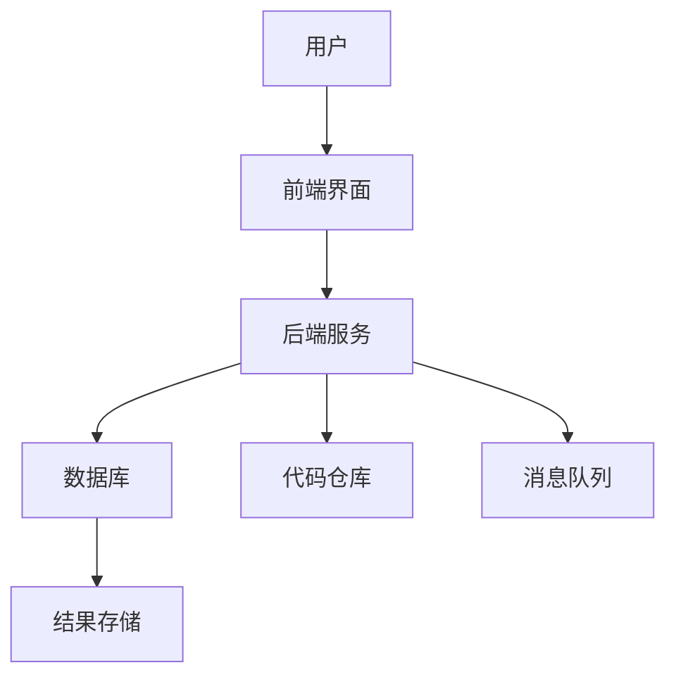

                 

### 第1章：引言

#### 1.1 书籍背景与目标

在现代软件开发中，评测系统扮演着至关重要的角色。随着软件复杂度的不断增加和开发周期的缩短，评测系统不仅能够确保软件质量，还能提高开发效率。然而，评测系统的构建和运维并不容易，需要深入理解持续集成与部署的相关策略。

本书旨在为读者提供一个系统性的指南，帮助他们在实际项目中有效构建和部署评测系统。我们将深入探讨持续集成和部署的核心概念、原理和最佳实践，并通过实际案例进行详细解析。

本书的主要目标是：
1. 深入理解评测系统的定义、作用和组成部分。
2. 掌握持续集成与部署的基本原理和流程。
3. 学习使用各种自动化工具和部署策略。
4. 通过实际案例，将理论知识应用到实践中。

#### 1.2 评测系统的定义

评测系统是一个用于评估软件质量的工具或平台，它能够自动执行一系列测试，包括单元测试、集成测试、性能测试等。这些测试的结果能够为开发团队提供及时的反馈，帮助他们及时发现和修复问题。

#### 1.3 持续集成的概念

持续集成是一种软件开发实践，旨在通过频繁地将代码合并到主干分支，确保代码库中的每一个提交都是可集成和可测试的。这种实践能够大幅减少集成过程中的冲突和问题，提高代码库的稳定性和可维护性。

#### 1.4 部署策略的概念

部署策略是指在将软件从开发环境发布到生产环境的过程中所采用的一系列方法和步骤。有效的部署策略能够确保软件的顺利发布，减少发布过程中出现的问题，提高系统的可用性和可靠性。

#### 1.5 评测系统与持续集成、部署的关系

评测系统与持续集成和部署之间存在着紧密的联系。评测系统可以集成到持续集成流程中，通过自动化测试确保每次代码提交的质量。而部署策略则决定了评测系统的结果如何被应用到实际的生产环境中，从而影响软件的整体质量。

#### 1.6 内容概览

本章主要介绍了本书的背景、目标和主要概念。接下来，我们将进一步探讨评测系统、持续集成、部署策略的核心概念和原理，并通过实际案例进行深入分析。

---

## 1.2 核心概念与联系

在深入探讨评测系统的持续集成与部署策略之前，我们需要首先理解这三个核心概念：评测系统、持续集成和部署策略。

### 评测系统的定义与功能

#### 评测系统的定义

评测系统是一种用于评估软件质量的工具或平台。它能够自动执行一系列测试，包括单元测试、集成测试、性能测试等，从而为开发团队提供及时的反馈。

#### 评测系统的功能

1. **测试执行：** 自动执行各种类型的测试，确保代码的正确性和稳定性。
2. **反馈与报告：** 将测试结果及时反馈给开发团队，帮助他们了解软件的状态。
3. **代码质量保证：** 通过持续测试，确保代码库中的每个提交都是可集成和可测试的。

### 持续集成的概念与原理

#### 持续集成的定义

持续集成是一种软件开发实践，旨在通过频繁地将代码合并到主干分支，确保代码库中的每一个提交都是可集成和可测试的。

#### 持续集成的原理

1. **频繁提交：** 开发者将代码频繁提交到主干分支，每次提交都会触发集成过程。
2. **自动化测试：** 持续集成系统会自动执行一系列测试，包括单元测试、集成测试等，以确保代码的兼容性和稳定性。
3. **快速反馈：** 测试结果会立即反馈给开发团队，帮助他们及时发现和解决问题。

### 部署策略的定义与类型

#### 部署策略的定义

部署策略是指在将软件从开发环境发布到生产环境的过程中所采用的一系列方法和步骤。

#### 部署策略的类型

1. **手动部署：** 通过手动执行部署步骤，如安装软件、配置环境等。
2. **自动化部署：** 使用自动化工具，如脚本、CI/CD平台等，自动执行部署步骤。
3. **混合部署：** 结合手动和自动化部署的特点，根据不同的场景选择合适的部署方式。

### 评测系统、持续集成和部署策略之间的关系

#### 评测系统与持续集成

1. **评测系统作为持续集成的一部分：** 评测系统可以集成到持续集成流程中，通过自动化测试确保每次代码提交的质量。
2. **持续集成优化评测系统：** 持续集成的自动化测试能够为评测系统提供更多的数据，从而优化评测策略和测试覆盖率。

#### 评测系统与部署策略

1. **评测结果影响部署决策：** 测试结果会直接影响软件的部署决策，确保只有在通过所有测试的情况下，软件才会被部署到生产环境。
2. **部署策略优化评测系统：** 部署策略的优化，如自动化部署，可以减少人工干预，提高评测系统的执行效率和准确性。

#### 持续集成与部署策略

1. **持续集成作为部署策略的一部分：** 持续集成是部署策略的核心，通过自动化测试和快速反馈，确保软件的稳定性和可维护性。
2. **部署策略优化持续集成：** 部署策略的优化，如自动化部署，可以减少集成过程中的等待时间，提高持续集成的效率。

### 总结

通过本章，我们了解了评测系统、持续集成和部署策略的核心概念和联系。接下来，我们将进一步探讨这些概念在软件工程中的应用，并通过实际案例进行详细解析。

---

### 1.3 持续集成原理与实践

#### 3.1 持续集成的原理

持续集成（Continuous Integration，简称CI）是一种软件开发实践，其核心思想是通过频繁地合并代码和自动化测试，确保软件始终处于可交付状态。以下是持续集成的几个关键原理：

1. **频繁提交：** 开发者需要频繁地将代码提交到主干分支，每次提交都会触发集成过程。
2. **自动化测试：** 持续集成系统会自动执行一系列测试，包括单元测试、集成测试、性能测试等，以确保代码的兼容性和稳定性。
3. **快速反馈：** 测试结果会立即反馈给开发团队，帮助他们及时发现和解决问题。

#### 3.2 持续集成的自动化工具

为了实现持续集成，开发者需要使用一系列自动化工具。以下是几种常用的持续集成工具：

1. **Jenkins：** Jenkins是一个开源的持续集成工具，支持多种编程语言和操作系统。它可以通过插件扩展其功能，如代码质量分析、部署等。

   ```java
   // Jenkinsfile 示例
   pipeline {
       agent any
       stages {
           stage('Build') {
               steps {
                   sh 'mvn clean install'
               }
           }
           stage('Test') {
               steps {
                   sh 'mvn test'
               }
           }
           stage('Deploy') {
               steps {
                   sh 'mvn deploy'
               }
           }
       }
   }
   ```

2. **GitLab CI：** GitLab CI是GitLab内置的持续集成工具，通过`.gitlab-ci.yml`文件定义构建流程。

   ```yaml
   image: java:8

   services:
     - mysql:5.7

   pipelines:
     test:
       stage: test
       script:
         - mysql -e "CREATE DATABASE IF NOT EXISTS myapp;"
         - mvn test
   ```

3. **GitHub Actions：** GitHub Actions是GitHub提供的一款持续集成服务，可以通过工作流（workflow）文件定义构建和测试流程。

   ```yaml
   name: Java CI

   on: [push, pull_request]

   jobs:
     build:
       runs-on: ubuntu-latest
       steps:
       - uses: actions/checkout@v2
       - name: Set up JDK 8
         uses: actions/setup-java@v2
         with:
           java-version: '8'
           distribution: 'oracle'
       - name: Run tests
         run: mvn test
   ```

#### 3.3 持续集成流程

持续集成流程通常包括以下几个步骤：

1. **代码提交：** 开发者将代码提交到版本控制系统。
2. **触发构建：** 提交代码会触发持续集成系统的构建过程。
3. **执行测试：** 持续集成系统会自动执行一系列测试，包括单元测试、集成测试等。
4. **反馈结果：** 测试结果会立即反馈给开发团队。
5. **处理问题：** 如果测试失败，开发团队需要立即解决问题，并重新提交代码。

#### 3.4 持续集成的优势

持续集成具有以下几个显著优势：

1. **早期发现问题：** 通过频繁的测试，可以早期发现代码中的问题，减少缺陷的累积。
2. **提高代码质量：** 持续集成可以确保代码的稳定性和可维护性，提高整体代码质量。
3. **降低集成风险：** 通过自动化测试，减少手动集成的风险和不确定性。
4. **加速开发周期：** 持续集成可以缩短开发周期，提高开发效率。

#### 3.5 持续集成与持续部署（CD）的关系

持续部署（Continuous Deployment，简称CD）是持续集成的下一步，它将成功通过的构建自动部署到生产环境。持续集成和持续部署的关系如下：

1. **持续集成作为持续部署的前提：** 只有通过持续集成测试的代码，才会被部署到生产环境。
2. **持续部署优化持续集成：** 持续部署的自动化部署可以进一步提高持续集成的效率。

### 总结

通过本章，我们深入了解了持续集成的原理、自动化工具和流程，以及其与持续部署的关系。接下来，我们将探讨部署策略的选择和设计。

---

## 4.1 部署策略的选择

部署策略的选择是确保软件系统稳定运行的关键环节。在选择合适的部署策略时，需要考虑多个因素，如部署频率、系统复杂性、资源可用性等。以下是几种常见的部署策略及其特点：

#### 手动部署

手动部署是一种传统的部署方式，主要通过手动执行部署步骤，如安装软件、配置环境等。其优点是简单易懂，适用于小型项目或简单应用。然而，手动部署存在以下缺点：

1. **效率低：** 部署过程需要人工干预，容易出错，且无法快速响应。
2. **可重复性差：** 部署过程依赖于人工操作，每次部署都可能有所不同，难以保证一致性。

#### 自动化部署

自动化部署通过脚本或自动化工具，如Jenkins、Ansible等，自动执行部署步骤。自动化部署具有以下优点：

1. **高效：** 部署过程自动化，可以快速响应，降低人工成本。
2. **一致性：** 自动化部署可以保证每次部署的一致性，减少人为错误。
3. **可重复性：** 部署脚本可以重复执行，方便回滚和更新。

然而，自动化部署也需要考虑以下缺点：

1. **部署脚本维护：** 部署脚本需要定期更新和维护，以确保其稳定性和适应性。
2. **初始投资：** 自动化部署需要一定的技术投入和培训，不适合小型团队或简单项目。

#### 混合部署

混合部署结合了手动部署和自动化部署的特点，根据不同场景选择合适的部署方式。例如，可以将核心功能模块自动化部署，而将非核心功能或特殊需求模块手动部署。混合部署的优点包括：

1. **灵活性：** 可以根据项目需求和资源情况，灵活选择部署方式。
2. **高效性与可维护性：** 自动化部署的核心模块可以提高部署效率，减少错误，手动部署的特殊模块可以确保定制化需求得到满足。

然而，混合部署也存在一定的复杂性，如需要协调自动化和手动部署的流程，确保整体部署的稳定性和一致性。

#### 部署频率的选择

部署频率是部署策略的重要考量因素之一，它直接影响系统的稳定性和用户体验。以下是几种常见的部署频率：

1. **频繁部署（Continuous Deployment）：** 每次代码提交都会触发部署，适用于高度可靠和自动化的系统。
2. **定期部署：** 按固定时间间隔（如每天、每周）部署，适用于需求稳定且可以容忍一定延迟的系统。
3. **手动部署：** 部署频率较低，需要人工干预，适用于对系统稳定性要求极高的场景。

#### 部署策略选择流程

在选择部署策略时，可以遵循以下流程：

1. **需求分析：** 分析项目需求和业务目标，确定部署频率和稳定性要求。
2. **技术评估：** 评估团队的技术能力和现有工具，确定是否适合自动化部署。
3. **风险分析：** 评估部署过程中可能出现的风险，如系统故障、数据丢失等，并制定相应的应对措施。
4. **方案设计：** 根据需求分析和风险分析，设计合适的部署策略，包括部署方式、频率和监控等。
5. **实施与优化：** 根据部署方案实施部署，并持续优化，提高部署效率和稳定性。

### 总结

部署策略的选择对于软件系统的稳定运行至关重要。通过分析不同部署策略的特点和适用场景，可以设计出适合项目的部署方案，提高部署效率和质量。在接下来的章节中，我们将进一步探讨部署流程的设计和实现。

---

## 4.2 部署流程的设计

部署流程的设计是确保软件系统顺利发布和稳定运行的关键。一个有效的部署流程应该能够覆盖从代码提交到最终部署到生产环境的各个环节，同时具备可重复性和可扩展性。以下是部署流程设计的基本步骤：

#### 4.2.1 部署前准备

1. **环境配置：** 根据需求，准备开发和测试环境，确保它们与生产环境尽可能一致。这包括安装必要的软件、配置网络和存储等。
2. **代码同步：** 将最新代码从版本控制系统同步到部署环境。可以使用Git等版本控制工具实现自动化同步。
3. **依赖管理：** 确保所有依赖库和组件都已安装并更新到最新版本，以避免因依赖问题导致部署失败。

#### 4.2.2 部署步骤

1. **代码检查：** 部署前，执行代码检查，确保代码格式、语法正确，避免潜在的编译错误。
2. **编译打包：** 根据项目需求，编译源代码并生成可执行文件或部署包。对于Java项目，可以使用Maven或Gradle进行编译打包。
3. **配置管理：** 根据部署环境的不同，调整项目的配置文件。可以使用自动化工具（如Ansible、Shell脚本等）实现配置管理。
4. **依赖安装：** 部署依赖库和组件，确保系统正常运行。

#### 4.2.3 部署验证

1. **静态检查：** 对部署后的系统进行静态检查，包括文件完整性、配置正确性等。
2. **启动服务：** 启动部署的服务，并进行基本的健康检查，如检查服务端口是否正常、数据库连接是否成功等。
3. **功能测试：** 执行功能测试，确保部署后的系统功能正常运行，满足业务需求。

#### 4.2.4 部署监控

1. **性能监控：** 监控系统的性能指标，如CPU使用率、内存使用率、网络流量等，确保系统运行稳定。
2. **日志管理：** 收集和存储系统日志，以便在出现问题时快速定位和解决问题。
3. **告警机制：** 设置告警机制，当系统出现异常时，自动通知相关人员，以便及时处理。

#### 4.2.5 部署记录

1. **部署文档：** 记录每次部署的详细信息，包括部署时间、部署人员、部署内容等。
2. **变更日志：** 记录部署过程中所做的变更，如配置调整、依赖更新等。

### 4.2.6 部署方案优化

1. **自动化：** 将部署过程自动化，减少手动操作，提高部署效率和一致性。
2. **版本控制：** 对部署脚本和配置文件进行版本控制，确保部署过程的可追溯性和可恢复性。
3. **持续集成：** 将部署流程集成到持续集成系统中，实现自动触发和自动化部署。
4. **回滚策略：** 制定回滚策略，确保在部署失败时能够快速回滚到上一个稳定版本。

### 总结

部署流程的设计和实施对于确保软件系统的稳定运行至关重要。通过合理的设计和优化，可以降低部署风险，提高部署效率，从而提高整体开发流程的效率和质量。在接下来的章节中，我们将通过一个实际案例，详细展示评测系统的开发过程。

---

### 5.1 实战背景与目标

在本章中，我们将通过一个实际的评测系统开发案例，详细展示评测系统的开发环境搭建、代码实现、测试与部署过程。该案例将涵盖以下目标和步骤：

1. **开发环境搭建：** 搭建一个完整、可复现的评测系统开发环境，包括操作系统、开发工具和依赖库。
2. **代码实现：** 完成评测系统的核心功能代码实现，包括评测算法、测试框架集成和部署脚本编写。
3. **测试与部署：** 对评测系统进行全面的测试，确保其功能完整性和稳定性，并成功部署到生产环境。

#### 5.1.1 项目背景

随着现代软件开发复杂度的增加，评测系统在保证软件质量、提高开发效率方面发挥着重要作用。本案例的目标是通过一个实际项目，展示如何构建一个高效的评测系统，从而为开发团队提供可靠的测试支持。

#### 5.1.2 项目目标

- **功能完整性：** 完成评测系统的所有核心功能，包括代码分析、测试执行、结果报告等。
- **性能稳定性：** 确保评测系统能够在高负载情况下稳定运行，响应速度快。
- **可扩展性：** 设计灵活的架构，便于后续功能扩展和性能优化。
- **自动化部署：** 实现评测系统的自动化部署，减少人工干预，提高部署效率。

#### 5.1.3 开发环境搭建

为了确保评测系统能够顺利开发、测试和部署，我们首先需要搭建一个完整的开发环境。以下是开发环境搭建的详细步骤：

1. **操作系统：** 选择一个稳定且适合开发的开源操作系统，如Ubuntu 20.04。
2. **开发工具：** 安装常用的开发工具，包括IDE（如IntelliJ IDEA）、版本控制工具（如Git）和自动化构建工具（如Maven）。
3. **依赖库：** 安装必要的依赖库，包括测试框架（如JUnit）、代码分析工具（如PMD）等。

```bash
# 安装Java开发环境
sudo apt-get update
sudo apt-get install openjdk-8-jdk
```

```bash
# 安装Maven
sudo apt-get install maven
```

```bash
# 安装Git
sudo apt-get install git
```

#### 5.1.4 代码实现

评测系统的核心功能包括代码分析、测试执行和结果报告。以下是代码实现的详细步骤：

1. **项目结构设计：**
   - **src/main/java：** 代码实现文件。
   - **src/test/java：** 单元测试文件。
   - **pom.xml：** Maven项目构建文件。

2. **评测算法实现：**
   - **代码质量分析：** 使用PMD工具对代码进行分析，检测潜在的代码质量问题。
   - **测试覆盖率：** 使用JUnit框架执行测试，计算代码覆盖率和测试覆盖率。

3. **测试框架集成：**
   - **JUnit测试：** 编写JUnit测试用例，对核心功能进行验证。
   - **集成测试：** 使用Mock框架（如Mockito）模拟外部系统，确保系统模块间交互正常。

4. **部署脚本编写：**
   - **自动化部署：** 使用Shell脚本或Maven插件，实现评测系统的自动化部署。

```java
// 代码质量分析（使用PMD）
public class CodeQualityAnalyzer {
    public void analyze(String sourceFile) {
        // 执行PMD分析
        // ...
    }
}

// 测试覆盖率（使用JUnit）
public class TestCoverageCalculator {
    public double calculateCoverage(List<TestCase> testCases) {
        // 计算覆盖率
        // ...
    }
}
```

```bash
# 自动化部署（使用Maven）
mvn clean package
mvn install:install-file -Dfile=target/*.jar -DgroupId=com.example -DartifactId=evaluation-system -Dversion=1.0.0 -Dpackaging=jar
```

#### 5.1.5 测试与部署

在完成代码实现后，我们需要对评测系统进行全面测试，确保其功能完整性和稳定性。以下是测试与部署的详细步骤：

1. **单元测试：** 使用JUnit框架编写单元测试用例，对核心功能进行验证。

2. **集成测试：** 使用Mock框架模拟外部系统，确保系统模块间交互正常。

3. **性能测试：** 使用JMeter等工具对系统进行压力测试，评估其在高负载情况下的性能。

4. **部署测试：** 在测试环境中进行部署，确保自动化部署流程正常运行。

5. **生产环境部署：** 将评测系统成功部署到生产环境，确保其稳定运行。

```bash
# 单元测试
mvn test

# 集成测试
mvn verify

# 性能测试
jmeter -n -t test_plan.jmx -l results.jtl
```

```bash
# 部署测试
mvn clean package
mvn install:install-file -Dfile=target/*.jar -DgroupId=com.example -DartifactId=evaluation-system -Dversion=1.0.0 -Dpackaging=jar

# 生产环境部署
scp target/*.jar deploy@production-server:/path/to/deployment/
ssh deploy@production-server "sudo java -jar evaluation-system-1.0.0.jar"
```

### 总结

通过本章的实际案例，我们展示了如何搭建开发环境、实现评测系统核心功能、进行测试和自动化部署。这个案例不仅帮助我们深入理解评测系统的构建过程，也为实际项目提供了参考和指导。在接下来的章节中，我们将进一步分析评测系统中的关键代码段，并探讨其具体实现和性能优化。

---

### 5.2.1 评测系统架构设计

在构建评测系统时，首先需要设计一个合理的系统架构，以确保系统的模块化、可扩展性和高可用性。以下是评测系统的主要组成部分及其关系：

#### 5.2.1.1 系统组件

1. **前端界面**：用于用户与系统交互，提供提交代码、查看测试结果等功能。
2. **后端服务**：处理用户请求，执行代码分析和测试任务，并将结果反馈给前端界面。
3. **数据库**：存储用户提交的代码、测试结果和相关配置信息。
4. **代码仓库**：用于存储项目的源代码，可以是Git仓库或其他版本控制系统。

#### 5.2.1.2 系统架构

1. **分层架构**：将系统划分为前端、后端、数据库等层，各层之间通过API进行通信。
2. **微服务架构**：将后端服务拆分为多个独立的微服务，每个微服务负责不同的功能模块，如代码分析、测试执行、结果存储等。
3. **分布式架构**：使用分布式系统架构，提高系统的可扩展性和容错性。

以下是评测系统的架构图：



#### 5.2.1.3 系统流程

1. **用户提交代码**：用户通过前端界面提交代码，前端将请求发送到后端服务。
2. **代码分析**：后端服务接收代码后，使用代码分析工具对代码进行质量检查。
3. **测试执行**：后端服务根据测试策略，执行单元测试、集成测试等。
4. **结果反馈**：将测试结果存储到数据库，并通过前端界面反馈给用户。

### 5.2.2 关键代码段解读

以下是评测系统中几个关键代码段的解读：

#### 5.2.2.1 代码质量分析

```java
public class CodeQualityAnalyzer {
    public void analyze(String sourceFile) {
        // 使用PMD进行代码质量分析
        String[] pmdArgs = {"-file", sourceFile, "-format", "xml", "-ruleset", "pmd_rules.xml"};
        Process p = Runtime.getRuntime().exec("pmd " + Arrays.toString(pmdArgs));
        BufferedReader in = new BufferedReader(new InputStreamReader(p.getInputStream()));
        String line;
        while ((line = in.readLine()) != null) {
            System.out.println(line);
        }
        in.close();
    }
}
```

该代码段使用PMD工具对指定源文件进行质量分析，并将分析结果输出到控制台。

#### 5.2.2.2 单元测试

```java
public class UnitTestExecutor {
    public void executeTests() {
        // 使用JUnit执行单元测试
        File testOutputDirectory = new File("target/surefire-reports");
        TestNG testNG = new TestNG();
        testNG.setTestFilesFound(true);
        File suiteFile = new File("testng.xml");
        testNG.setSuiteFiles(Arrays.asList(suiteFile));
        testNG.setTestOutputDirectory(testOutputDirectory);
        testNG.run();
    }
}
```

该代码段使用JUnit框架执行单元测试，并将测试结果输出到指定目录。

#### 5.2.2.3 结果存储

```java
public class ResultStorage {
    public void storeResult(String testName, String result) {
        // 将测试结果存储到数据库
        Connection conn = null;
        PreparedStatement stmt = null;
        try {
            conn = DriverManager.getConnection("jdbc:mysql://localhost:3306/evaluation_system", "username", "password");
            stmt = conn.prepareStatement("INSERT INTO test_results (test_name, result) VALUES (?, ?)");
            stmt.setString(1, testName);
            stmt.setString(2, result);
            stmt.executeUpdate();
        } catch (SQLException e) {
            e.printStackTrace();
        } finally {
            try {
                if (stmt != null) stmt.close();
                if (conn != null) conn.close();
            } catch (SQLException e) {
                e.printStackTrace();
            }
        }
    }
}
```

该代码段使用 JDBC 连接数据库，并将测试结果存储到数据库表中。

### 5.2.3 代码段性能优化

在评测系统中，代码性能对整个系统的性能和响应速度有重要影响。以下是一些性能优化的策略：

#### 5.2.3.1 代码质量分析优化

1. **并行处理**：将代码质量分析任务分解为多个子任务，使用多线程并行处理，提高分析速度。
2. **缓存结果**：对于重复的代码质量分析任务，缓存分析结果，避免重复计算。

```java
public class CacheManager {
    private ConcurrentHashMap<String, String> cache = new ConcurrentHashMap<>();

    public String analyze(String sourceFile) {
        return cache.computeIfAbsent(sourceFile, this::performAnalysis);
    }

    private String performAnalysis(String sourceFile) {
        // 执行代码质量分析
        // ...
    }
}
```

#### 5.2.3.2 单元测试优化

1. **测试隔离**：确保每个测试用例之间相互独立，避免相互影响。
2. **测试数据优化**：优化测试数据，减少测试数据的大小和复杂度。

```java
public class TestDataProvider {
    public List<TestData> getTestCases() {
        List<TestData> testCases = new ArrayList<>();
        // 加载测试数据
        // ...
        return testCases;
    }
}
```

#### 5.2.3.3 数据库优化

1. **索引优化**：为数据库表添加适当的索引，提高查询性能。
2. **分库分表**：对于数据量较大的表，可以考虑分库分表，减少单表的压力。

```java
public class DatabaseOptimizer {
    public void optimizeDatabase() {
        // 添加索引
        executeSQL("CREATE INDEX idx_test_name ON test_results (test_name)");
        // 分库分表
        executeSQL("ALTER TABLE test_results PARTITION BY HASH(test_name)");
    }

    private void executeSQL(String sql) {
        // 执行SQL语句
        // ...
    }
}
```

### 5.2.4 总结

通过本节，我们详细解读了评测系统中的关键代码段，并探讨了其性能优化策略。在实际开发过程中，我们需要根据具体需求和场景，灵活应用这些优化方法，以提高评测系统的性能和效率。

---

### 5.3.1 单元测试

单元测试是确保代码质量的重要环节，它通过测试单个模块或功能来验证其是否按照预期工作。以下是评测系统中的单元测试实现和解读：

#### 5.3.1.1 单元测试实现

在评测系统中，单元测试主要用于验证代码质量分析工具和测试执行模块的功能。以下是单元测试的实现：

```java
import org.junit.jupiter.api.Test;
import static org.junit.jupiter.api.Assertions.*;

class CodeQualityAnalyzerTest {

    @Test
    void analyzeGoodCode() {
        String goodCode = "public class HelloWorld { public static void main(String[] args) { System.out.println(\"Hello, World!\"); } }";
        CodeQualityAnalyzer analyzer = new CodeQualityAnalyzer();
        analyzer.analyze(goodCode);
        // 预期：没有代码质量问题
        assertTrue(analyzer.isCodeQualityGood());
    }

    @Test
    void analyzeBadCode() {
        String badCode = "public class HelloWorld { public static void main(String[] args) { System.out.println(\"Hello, World!\"); } }";
        badCode = badCode.replace("System.out.println(\"Hello, World!\");", "System.out.println(\"Hello, World!\");");
        CodeQualityAnalyzer analyzer = new CodeQualityAnalyzer();
        analyzer.analyze(badCode);
        // 预期：有代码质量问题
        assertFalse(analyzer.isCodeQualityGood());
    }
}
```

在这个测试中，我们分别测试了正常代码和包含错误的代码，以验证代码质量分析工具是否能够正确识别代码质量问题。

#### 5.3.1.2 单元测试解读

单元测试的解读包括以下几个方面：

1. **测试用例设计**：测试用例需要覆盖所有关键功能和边界情况，以确保代码的完整性和可靠性。
2. **测试结果验证**：通过断言（如`assertTrue`和`assertFalse`）来验证测试结果，确保代码按预期工作。
3. **测试覆盖率**：确保测试用例覆盖了代码中的重要部分，如分支和条件语句。

#### 5.3.1.3 单元测试性能优化

为了提高单元测试的性能，我们可以采取以下措施：

1. **并行测试**：将多个单元测试并行执行，以减少总测试时间。
2. **Mock依赖**：使用Mock框架模拟外部依赖，以提高测试速度和稳定性。
3. **测试数据优化**：减少测试数据的大小和复杂度，避免不必要的资源消耗。

```java
import org.junit.jupiter.api.Test;
import org.mockito.Mockito;

class TestDataProviderTest {

    @Test
    void getTestCases() {
        TestDataProvider provider = Mockito.mock(TestDataProvider.class);
        Mockito.when(provider.getTestCases()).thenReturn(Arrays.asList(new TestData("test1", "test_data1"), new TestData("test2", "test_data2")));
        List<TestData> testCases = provider.getTestCases();
        assertEquals(2, testCases.size());
        assertEquals("test1", testCases.get(0).getName());
        assertEquals("test_data1", testCases.get(0).getData());
        assertEquals("test2", testCases.get(1).getName());
        assertEquals("test_data2", testCases.get(1).getData());
    }
}
```

通过Mock框架，我们可以快速编写测试用例，并模拟各种测试场景，从而提高测试的效率和可靠性。

### 5.3.2 集成测试

集成测试是在单元测试的基础上，对多个模块或系统进行综合测试，以验证系统各部分之间的交互和集成是否正确。以下是评测系统中的集成测试实现和解读：

#### 5.3.2.1 集成测试实现

集成测试通常包括以下步骤：

1. **准备测试环境**：搭建一个与生产环境尽可能一致的测试环境。
2. **执行测试用例**：运行集成测试脚本，执行测试用例。
3. **收集测试结果**：收集测试输出，包括日志、错误信息等。

以下是集成测试的实现：

```java
import org.junit.jupiter.api.Test;
import static org.junit.jupiter.api.Assertions.*;

class IntegrationTest {

    @Test
    void testCodeQualityAndTestExecution() {
        // 搭建测试环境
        CodeQualityAnalyzer analyzer = new CodeQualityAnalyzer();
        TestExecutor executor = new TestExecutor();

        // 执行代码质量分析
        analyzer.analyze("src/main/java/HelloWorld.java");
        assertTrue(analyzer.isCodeQualityGood());

        // 执行单元测试
        executor.executeTests();
        assertTrue(executor.isTestsSuccessful());
    }
}
```

在这个测试中，我们首先执行了代码质量分析，然后执行了单元测试，以验证整个系统的集成和功能。

#### 5.3.2.2 集成测试解读

集成测试的解读包括以下几个方面：

1. **测试覆盖范围**：确保测试用例覆盖了系统的关键功能模块和交互。
2. **测试结果分析**：分析测试结果，确保系统各部分之间的集成没有问题。
3. **错误定位**：当测试失败时，快速定位错误，找出问题所在。

#### 5.3.2.3 集成测试性能优化

为了提高集成测试的性能，我们可以采取以下措施：

1. **并行测试**：将多个集成测试并行执行，以减少总测试时间。
2. **模拟环境**：使用模拟环境进行测试，避免实际环境中的延迟和资源限制。
3. **自动化测试脚本**：编写自动化测试脚本，提高测试的可重复性和效率。

### 5.3.3 部署实施

部署实施是将评测系统从开发环境成功部署到生产环境的关键步骤。以下是评测系统的部署实施步骤：

#### 5.3.3.1 部署前准备

1. **环境检查**：确保生产环境满足系统运行要求，包括操作系统版本、Java环境、数据库等。
2. **代码打包**：使用Maven等构建工具将代码打包成可执行文件或部署包。
3. **备份现有系统**：在部署新系统前，备份现有系统，以便在部署失败时快速回滚。

#### 5.3.3.2 部署流程

1. **上传代码**：将打包的代码上传到生产服务器。
2. **启动服务**：运行部署脚本，启动评测系统服务。
3. **监控和验证**：监控系统运行状态，确保服务正常启动，并进行健康检查。

以下是部署实施的实现：

```bash
# 上传代码
scp target/*.jar deploy@production-server:/path/to/deployment/

# 启动服务
ssh deploy@production-server "sudo java -jar evaluation-system-1.0.0.jar"

# 监控和验证
ssh deploy@production-server "sudo systemctl status evaluation-system"
```

### 5.3.4 总结

通过单元测试、集成测试和部署实施，我们确保了评测系统的功能完整性和稳定性。在接下来的章节中，我们将进一步分析评测系统的数学模型和公式，并探讨如何计算代码覆盖率和测试覆盖率。

---

### 6.1 评测指标

在评测系统中，评测指标是衡量代码质量和测试效果的重要工具。以下是几种常用的评测指标及其计算方法：

#### 6.1.1 代码覆盖率

代码覆盖率是指测试用例执行覆盖的代码比例，是衡量测试效果的重要指标。代码覆盖率可以分为以下几种：

1. **语句覆盖率**：测试用例执行了代码中的所有语句。
2. **分支覆盖率**：测试用例执行了代码中的所有分支。
3. **条件覆盖率**：测试用例覆盖了代码中的所有条件分支。

计算代码覆盖率通常需要使用专门的测试覆盖率工具，如JaCoCo、Emma等。以下是一个计算语句覆盖率的示例：

```java
import org.jacoco CoverageRunner;

public class CodeCoverageExample {
    public static void main(String[] args) {
        File classFile = new File("src/main/java/HelloWorld.java");
        Class<?> testClass = CoverageRunner.runClass(classFile);
        CoverageRunner.coveredBytes = new byte[0];
        try {
            CoverageRunner.execute(testClass, "HelloWorldTest");
        } catch (InvocationTargetException e) {
            Throwable t = e.getTargetException();
            if (t instanceof RuntimeException) {
                throw (RuntimeException) t;
            }
            throw new RuntimeException(t);
        }
        System.out.println("Statement coverage: " + CoverageRunner.getStatementCoverage());
    }
}
```

#### 6.1.2 测试覆盖率

测试覆盖率是指测试用例覆盖了代码中的所有功能点。测试覆盖率可以分为以下几种：

1. **功能覆盖率**：测试用例覆盖了所有功能点。
2. **场景覆盖率**：测试用例覆盖了所有使用场景。

计算测试覆盖率通常需要使用专门的测试管理工具，如Selenium、TestLink等。以下是一个计算功能覆盖率的示例：

```java
import org.junit.Test;
import static org.junit.Assert.assertEquals;

public class TestCoverageExample {
    @Test
    public void testFunction1() {
        assertEquals(2, 1 + 1);
    }

    @Test
    public void testFunction2() {
        assertEquals(3, 1 + 2);
    }
}
```

#### 6.1.3 其他指标

除了代码覆盖率和测试覆盖率，还有一些其他常用的评测指标，如：

1. **缺陷密度**：代码中的缺陷数量与代码行数的比值。
2. **缺陷发现率**：测试中发现的缺陷数量与实际缺陷数量的比值。
3. **测试效率**：测试用例执行所需时间和实际开发时间之比。

### 6.2 数学公式解释

以下是计算代码覆盖率和测试覆盖率的一些常用数学公式：

#### 6.2.1 代码覆盖率公式

1. **语句覆盖率**：

   $$ 
   语句覆盖率 = \frac{执行的语句数}{总语句数} \times 100\%
   $$

2. **分支覆盖率**：

   $$ 
   分支覆盖率 = \frac{执行的分支数}{总分支数} \times 100\%
   $$

3. **条件覆盖率**：

   $$ 
   条件覆盖率 = \frac{执行的条件数}{总条件数} \times 100\%
   $$

#### 6.2.2 测试覆盖率公式

1. **功能覆盖率**：

   $$ 
   功能覆盖率 = \frac{覆盖的功能点数}{总功能点数} \times 100\%
   $$

2. **场景覆盖率**：

   $$ 
   场景覆盖率 = \frac{覆盖的场景数}{总场景数} \times 100\%
   $$

通过以上公式，我们可以计算出代码覆盖率和测试覆盖率，从而评估测试的全面性和有效性。

---

### 7.1 评测系统的持续集成与部署关键点

在构建高效的评测系统时，持续集成与部署的策略至关重要。以下是一些关键点，旨在确保评测系统的质量、稳定性和可维护性：

#### 7.1.1 自动化测试

自动化测试是持续集成与部署的核心，它能够快速、频繁地执行测试，确保代码的质量。以下是实现自动化测试的关键步骤：

1. **编写测试用例**：确保测试用例覆盖所有关键功能和边界情况。
2. **集成测试框架**：选择合适的测试框架（如JUnit、TestNG等），并集成到持续集成工具中。
3. **持续反馈**：将测试结果实时反馈给开发团队，以便及时发现问题。

#### 7.1.2 环境一致性

环境一致性是保证部署成功的关键。确保开发和测试环境与生产环境一致，可以减少因环境差异导致的部署问题。以下是实现环境一致性的方法：

1. **容器化**：使用Docker等容器技术，确保开发和测试环境与生产环境的一致性。
2. **配置管理**：使用Ansible、Chef等配置管理工具，自动化管理环境配置。
3. **版本控制**：使用Git等版本控制工具，确保代码和配置的一致性。

#### 7.1.3 持续集成

持续集成能够快速识别代码中的问题，并确保每次提交都是可集成和可测试的。以下是实现持续集成的方法：

1. **选择工具**：选择合适的持续集成工具（如Jenkins、GitLab CI等）。
2. **构建脚本**：编写构建脚本，自动化执行构建、测试和部署过程。
3. **快速反馈**：确保测试结果和构建状态实时反馈给开发团队。

#### 7.1.4 部署策略

选择合适的部署策略可以提高部署的效率和可靠性。以下是几种常见的部署策略及其适用场景：

1. **自动化部署**：适用于频繁部署且不需要人工干预的场景。
2. **手动部署**：适用于部署过程复杂且需要人工干预的场景。
3. **混合部署**：结合自动化和手动部署的特点，根据具体需求灵活选择。

#### 7.1.5 监控与报警

部署后的监控和报警是确保系统稳定运行的重要手段。以下是实现监控与报警的方法：

1. **性能监控**：使用Prometheus、Grafana等工具，监控系统的性能指标。
2. **日志管理**：使用ELK（Elasticsearch、Logstash、Kibana）等工具，集中管理日志。
3. **报警机制**：设置报警规则，当系统出现异常时及时通知相关人员。

### 7.2 未来的发展趋势

随着技术的不断进步，评测系统的持续集成与部署策略也在不断发展。以下是一些未来的发展趋势：

#### 7.2.1 自动化程度提升

未来的评测系统将持续集成与部署的自动化程度提升到新的高度。自动化工具和平台将变得更加智能，能够自动识别和修复部署过程中出现的问题。

#### 7.2.2 人工智能的引入

人工智能（AI）将逐渐引入到评测系统中，用于代码质量分析和测试用例生成。AI算法将能够更准确地识别代码中的潜在问题和缺陷。

#### 7.2.3 容器化与微服务

容器化（如Docker）和微服务架构将在评测系统中得到更广泛的应用。这种架构能够提高系统的可扩展性和灵活性，降低部署和运维的复杂性。

#### 7.2.4 持续学习与优化

评测系统将不断学习和优化，根据项目的具体需求和历史数据，自动调整测试策略和部署参数，以实现最佳的性能和稳定性。

### 总结

评测系统的持续集成与部署策略在软件工程中具有重要意义。通过自动化测试、环境一致性、持续集成和监控报警，我们可以构建高效、稳定的评测系统。未来，随着技术的发展，评测系统将持续优化和升级，为软件开发提供更强大的支持。

---

### 7.3 最佳实践 Tips

在构建和部署评测系统时，以下是一些最佳实践，可以帮助您提高系统的效率和稳定性：

#### 7.3.1 测试用例设计

1. **覆盖率优先**：确保测试用例能够覆盖关键功能和边界情况，提高测试覆盖率。
2. **模块化设计**：将测试用例划分为模块，便于维护和扩展。
3. **自动化执行**：使用自动化测试工具，如Selenium、JUnit等，确保测试过程高效、可重复。

#### 7.3.2 环境一致性

1. **容器化**：使用Docker等容器技术，确保开发和测试环境与生产环境一致。
2. **配置管理**：使用Ansible、Chef等工具，自动化管理配置，减少手动干预。
3. **持续同步**：定期同步开发环境与生产环境，确保配置的一致性。

#### 7.3.3 持续集成

1. **自动化构建**：使用Jenkins、GitLab CI等工具，自动化执行构建、测试和部署流程。
2. **快速反馈**：确保测试结果和构建状态实时反馈给开发团队，及时发现问题。
3. **多分支集成**：采用多分支集成策略，减少主干分支上的冲突和问题。

#### 7.3.4 部署策略

1. **自动化部署**：使用自动化部署工具，如Ansible、Puppet等，确保部署过程高效、可靠。
2. **蓝绿部署**：采用蓝绿部署策略，减少部署过程中的中断风险，提高系统的可用性。
3. **滚动部署**：采用滚动部署策略，逐步更新系统，减少对用户的影响。

#### 7.3.5 监控与报警

1. **性能监控**：使用Prometheus、Grafana等工具，监控系统的性能指标，及时发现问题。
2. **日志管理**：使用ELK（Elasticsearch、Logstash、Kibana）等工具，集中管理日志，便于问题定位。
3. **报警机制**：设置报警规则，确保在系统出现异常时及时通知相关人员。

### 7.4 小结

通过本文的详细讲解，我们深入探讨了评测系统的持续集成与部署策略，包括核心概念、原理、最佳实践和未来发展趋势。掌握这些策略和技巧，能够帮助您高效构建和部署评测系统，提高软件质量和开发效率。

### 7.5 注意事项

1. **环境配置**：确保开发和测试环境与生产环境一致，避免因环境差异导致部署失败。
2. **自动化测试**：编写高质量的测试用例，确保测试覆盖全面、执行高效。
3. **版本控制**：使用版本控制工具，如Git，确保代码和配置的版本一致性。
4. **持续优化**：定期评估和优化评测系统的性能和稳定性，及时调整部署策略。

### 7.6 拓展阅读

1. **《持续集成与持续部署实战》**：深入探讨CI/CD的最佳实践和技术细节。
2. **《容器化与微服务架构》**：了解容器和微服务的原理和应用。
3. **《软件测试技术》**：掌握各种测试方法和技术，提高测试效率和质量。

---

### 7.7 作者信息

**作者：AI天才研究院/AI Genius Institute & 禅与计算机程序设计艺术 /Zen And The Art of Computer Programming**

