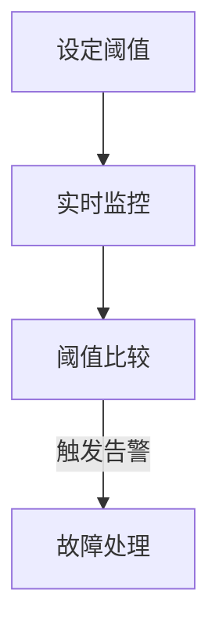
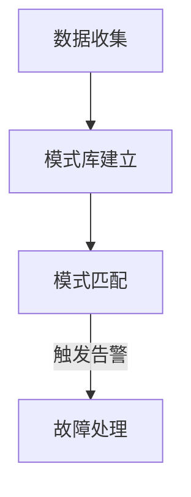
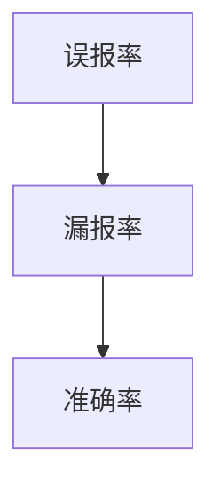
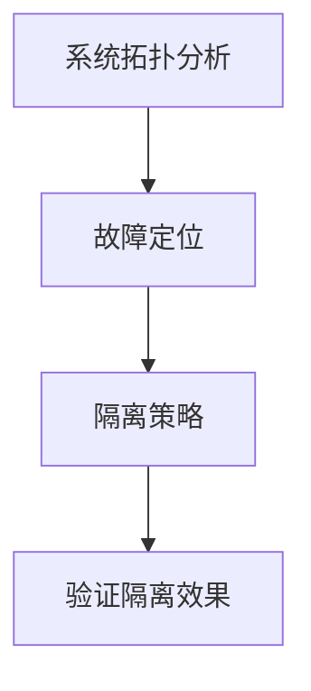
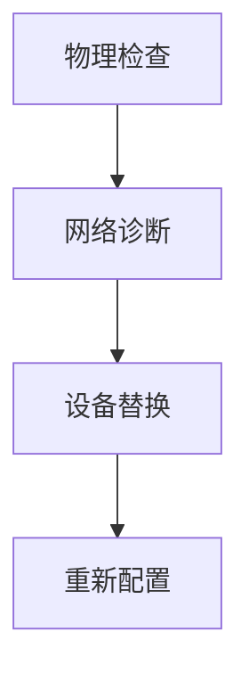
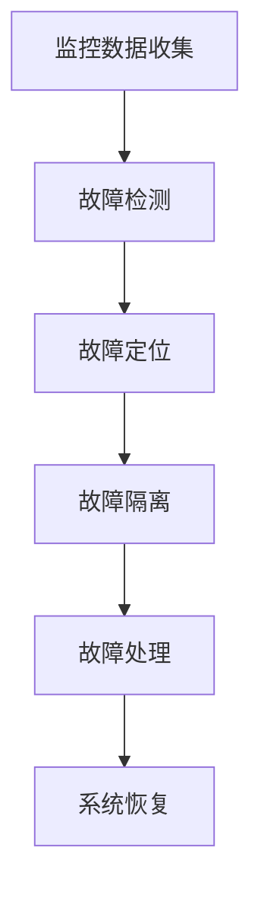
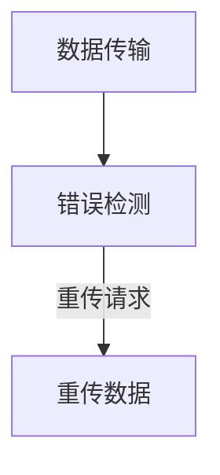
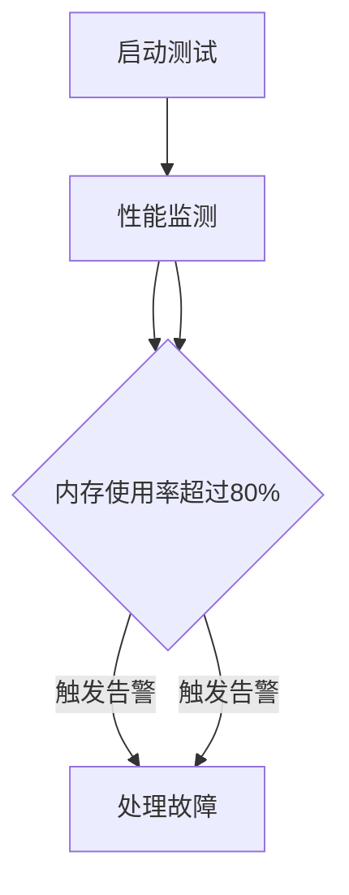
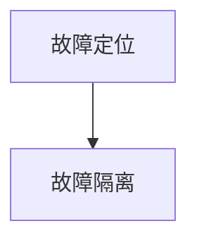
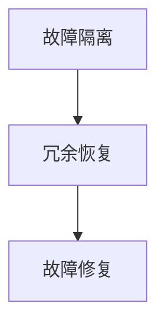

                 

# 《评测系统的故障恢复与容错设计》

## 摘要

本文旨在探讨评测系统的故障恢复与容错设计，通过详细分析故障恢复与容错设计的基本概念、原理和技术，以及实际案例和系统性能评估与调优，为计算机工程师、系统架构师、软件工程师等提供深入了解和提升系统性能和稳定性的实用指南。本文首先介绍评测系统的基本概念和作用，然后深入探讨故障恢复与容错设计的基础理论，包括故障检测、故障隔离、故障恢复策略和容错设计原理。接着，本文通过具体实现和案例分析，展示如何在实际项目中应用故障恢复与容错设计。最后，本文总结扩展内容，提供实用工具和资源，展望未来发展趋势。

## 第一部分：基础理论

### 第1章：评测系统概述

#### 1.1 评测系统的定义与作用

评测系统是指用于对计算机系统、软件、网络等各种信息系统的性能、可靠性、安全性等进行检测、评估和验证的系统。它通常由测试工具、测试环境、测试数据、评估算法等组成部分构成。评测系统的核心作用是通过对被测试系统的性能进行测量和评估，帮助开发人员和系统管理员了解系统的实际运行状况，发现潜在问题，优化系统性能，确保系统的稳定性和可靠性。

#### 1.2 故障恢复与容错设计的基本概念

故障恢复（Fault Recovery）是指在系统发生故障时，通过一定的机制和手段，使系统能够从故障状态恢复到正常状态的过程。故障恢复的关键在于如何有效地检测故障、隔离故障和恢复故障。

容错设计（Fault-Tolerant Design）是指在系统设计和实现过程中，通过冗余、冗余检测、故障恢复等技术手段，提高系统的可靠性、可用性和容错能力。容错设计的核心目标是确保系统在发生故障时，能够自动或手动地恢复正常运行，保障系统的不间断服务。

#### 1.3 评测系统的基本工作流程

评测系统的基本工作流程包括以下几个步骤：

1. **测试准备**：确定测试目标、测试环境、测试工具和测试数据等。

2. **测试执行**：按照测试计划和测试用例，对被测试系统进行性能测试、功能测试、安全性测试等。

3. **结果收集**：收集测试过程中产生的各种数据，包括性能指标、错误信息、异常情况等。

4. **结果分析**：对测试结果进行统计分析，评估系统的性能、可靠性、安全性等。

5. **报告生成**：根据测试结果和分析结论，生成测试报告，为系统优化和改进提供依据。

### 第2章：故障恢复基础

#### 2.1 故障检测

故障检测是故障恢复的第一步，主要目的是及时发现系统中的异常情况。故障检测的方法包括：

- **基于阈值的故障检测**：通过设定一定的阈值，当系统性能指标超过或低于阈值时，触发故障检测机制。
- **基于模式的故障检测**：通过对系统运行时产生的数据进行分析，识别出异常模式，从而检测出故障。

#### 2.2 故障隔离

故障隔离是指在检测到故障后，通过一定的手段，将故障源从系统中隔离出来，以防止故障影响系统的正常运行。故障隔离的方法包括：

- **基于逻辑的故障隔离**：通过分析系统的逻辑结构和运行状态，确定故障发生的可能区域，从而进行隔离。
- **基于物理的故障隔离**：通过检查硬件设备、网络连接等物理组件，确定故障发生的位置。

#### 2.3 故障恢复策略

故障恢复策略是指在实际发生故障时，采取的一系列恢复措施。常见的故障恢复策略包括：

- **冗余恢复**：通过设置冗余组件，当主组件发生故障时，自动切换到冗余组件，确保系统的正常运行。
- **重启动恢复**：在故障发生时，重启系统或子系统，以恢复系统的正常状态。
- **重传恢复**：在网络传输过程中，当检测到数据传输错误时，重新传输数据，确保数据的正确性。

### 第3章：容错设计原理

#### 3.1 容错设计的核心原则

容错设计的核心原则包括：

- **冗余原则**：通过冗余组件，提高系统的可靠性。
- **故障检测原则**：及时发现故障，避免故障扩散。
- **故障隔离原则**：将故障源隔离，防止故障影响系统其他部分。
- **故障恢复原则**：在故障发生时，迅速恢复系统，确保系统的连续性。

#### 3.2 系统冗余

系统冗余是指通过设置冗余组件，提高系统的可靠性。系统冗余的方法包括：

- **硬件冗余**：通过设置备用硬件，当主硬件发生故障时，自动切换到备用硬件。
- **软件冗余**：通过设置冗余的软件模块，当主模块发生故障时，自动切换到冗余模块。
- **数据冗余**：通过设置冗余的数据备份，确保数据的安全性和可靠性。

#### 3.3 容错机制实现

容错机制的实现主要包括以下几个方面：

- **冗余机制**：通过冗余组件，实现系统的冗余。
- **故障检测机制**：通过设置故障检测算法，实现故障的实时检测。
- **故障隔离机制**：通过设置故障隔离算法，实现故障的实时隔离。
- **故障恢复机制**：通过设置故障恢复算法，实现故障的实时恢复。

## 第二部分：技术细节

### 第4章：故障检测与隔离

#### 4.1 故障检测技术

故障检测技术主要包括：

- **基于阈值的故障检测**：通过设定一定的阈值，当系统性能指标超过或低于阈值时，触发故障检测机制。
- **基于模式的故障检测**：通过对系统运行时产生的数据进行分析，识别出异常模式，从而检测出故障。

#### 4.2 故障隔离技术

故障隔离技术主要包括：

- **基于逻辑的故障隔离**：通过分析系统的逻辑结构和运行状态，确定故障发生的可能区域，从而进行隔离。
- **基于物理的故障隔离**：通过检查硬件设备、网络连接等物理组件，确定故障发生的位置。

### 第5章：故障恢复策略

#### 5.1 故障恢复策略的类型

故障恢复策略主要包括：

- **冗余恢复**：通过设置冗余组件，当主组件发生故障时，自动切换到冗余组件。
- **重启动恢复**：在故障发生时，重启系统或子系统，以恢复系统的正常状态。
- **重传恢复**：在网络传输过程中，当检测到数据传输错误时，重新传输数据，确保数据的正确性。

#### 5.2 故障恢复策略的实现

故障恢复策略的实现主要包括以下几个方面：

- **冗余机制的实现**：通过设置冗余组件，实现系统的冗余。
- **故障检测机制的实现**：通过设置故障检测算法，实现故障的实时检测。
- **故障隔离机制的实现**：通过设置故障隔离算法，实现故障的实时隔离。
- **故障恢复机制的实现**：通过设置故障恢复算法，实现故障的实时恢复。

### 第6章：容错机制实现

#### 6.1 容错机制的实现方法

容错机制的实现主要包括以下几个方面：

- **冗余机制的实现**：通过设置冗余组件，实现系统的冗余。
- **故障检测机制的实现**：通过设置故障检测算法，实现故障的实时检测。
- **故障隔离机制的实现**：通过设置故障隔离算法，实现故障的实时隔离。
- **故障恢复机制的实现**：通过设置故障恢复算法，实现故障的实时恢复。

#### 6.2 容错机制的优化

容错机制的优化主要包括以下几个方面：

- **冗余优化**：通过优化冗余组件的数量和配置，提高系统的冗余度。
- **故障检测优化**：通过优化故障检测算法，提高故障检测的准确性和效率。
- **故障隔离优化**：通过优化故障隔离算法，提高故障隔离的速度和准确性。
- **故障恢复优化**：通过优化故障恢复算法，提高故障恢复的速度和可靠性。

### 第7章：系统稳定性优化

#### 7.1 稳定性指标

系统稳定性指标主要包括：

- **可靠性**：系统在规定时间内，无故障运行的能力。
- **可用性**：系统在规定时间内，能够正常提供服务的能力。
- **容错性**：系统在故障发生时，能够自动恢复的能力。

#### 7.2 稳定性优化策略

稳定性优化策略主要包括：

- **负载均衡**：通过均衡系统负载，提高系统的稳定性和响应速度。
- **冗余配置**：通过设置冗余组件，提高系统的可靠性和容错性。
- **故障检测与隔离**：通过优化故障检测与隔离机制，提高系统的响应速度和故障恢复能力。

## 第三部分：实战与案例分析

### 第8章：故障恢复与容错设计实战

#### 8.1 实战环境搭建

在本节中，我们将介绍如何搭建一个用于故障恢复与容错设计的实战环境。环境搭建包括以下步骤：

1. **硬件环境**：选择合适的硬件设备，包括服务器、网络设备等。
2. **软件环境**：安装操作系统、数据库、中间件等软件。
3. **测试工具**：安装故障检测、故障隔离、故障恢复等测试工具。
4. **测试数据**：准备测试数据，用于模拟故障情况。

#### 8.2 实战案例

在本节中，我们将通过一个具体的案例，展示如何在实际项目中应用故障恢复与容错设计。案例包括以下内容：

1. **故障模拟**：通过测试工具，模拟系统故障。
2. **故障检测**：通过故障检测算法，检测到故障。
3. **故障隔离**：通过故障隔离算法，隔离故障。
4. **故障恢复**：通过故障恢复策略，恢复系统。

### 第9章：真实案例分析

在本节中，我们将分析一些真实的案例，探讨故障恢复与容错设计的实际应用。案例包括：

1. **网络故障恢复**：分析网络故障的检测、隔离和恢复过程。
2. **数据库故障恢复**：分析数据库故障的检测、隔离和恢复过程。
3. **服务器故障恢复**：分析服务器故障的检测、隔离和恢复过程。

### 第10章：系统性能评估与调优

在本节中，我们将介绍如何对系统性能进行评估和调优。评估与调优主要包括以下步骤：

1. **性能评估**：通过测试工具，评估系统的性能。
2. **性能瓶颈分析**：分析系统性能瓶颈，确定优化方向。
3. **性能调优**：通过调整系统配置、优化算法等手段，提高系统性能。

## 第四部分：扩展与总结

### 第11章：实用工具与资源

在本节中，我们将介绍一些实用的工具和资源，包括故障检测工具、故障隔离工具、故障恢复工具等。同时，我们将提供一些常用的开源资源和参考资料，供读者学习和参考。

### 第12章：未来发展趋势与展望

在本节中，我们将探讨故障恢复与容错设计的未来发展趋势。随着云计算、大数据、人工智能等技术的快速发展，评测系统的复杂度和规模不断扩大，故障恢复与容错设计也将面临新的挑战和机遇。我们将展望未来技术的发展方向，探讨如何更好地应对这些挑战。

## 作者信息

作者：AI天才研究院/AI Genius Institute & 禅与计算机程序设计艺术 /Zen And The Art of Computer Programming

## 结论

通过本文的探讨，我们深入了解了评测系统的故障恢复与容错设计，掌握了故障恢复与容错设计的基本概念、原理和技术，并通过实战案例展示了其实际应用。本文旨在为计算机工程师、系统架构师、软件工程师等提供实用的指南，帮助他们提升系统的性能和稳定性，确保系统的连续性和可靠性。我们相信，随着技术的不断发展，故障恢复与容错设计将在未来发挥更加重要的作用。

---

### 第1章：评测系统概述

#### 1.1 评测系统的定义与作用

评测系统，作为计算机系统测试和性能评估的重要组成部分，其核心定义是对各类信息系统进行全方位的测试和评估，以评估其性能、可靠性和安全性。评测系统的应用范围广泛，涵盖了从简单的软件测试到复杂的网络性能评估，再到整个数据中心和云计算环境的稳定性检测。其作用主要体现在以下几个方面：

1. **性能评估**：通过模拟实际使用场景，评测系统可以评估系统在不同负载下的响应速度、处理能力、资源利用率等关键性能指标，为系统优化提供数据支持。
2. **故障诊断**：评测系统可以通过对系统运行数据的实时监测和分析，及时发现潜在问题和故障，从而提前采取措施进行预防。
3. **安全检测**：评测系统可以模拟各种攻击，评估系统的安全防护能力，帮助发现和修补安全漏洞。
4. **决策支持**：评测结果为系统管理员和开发团队提供了系统的运行状态和性能数据，有助于做出更加科学的决策，优化系统架构和资源配置。

#### 1.2 故障恢复与容错设计的基本概念

故障恢复和容错设计是保障评测系统稳定性和可靠性的关键。故障恢复是指在系统发生故障后，通过一系列机制和措施使系统恢复到正常状态的过程。容错设计则是在系统设计和实现阶段，通过冗余、检测、隔离和恢复等技术，提高系统的可靠性。

- **故障恢复**：故障恢复的核心目标是使系统从故障状态快速恢复正常，减少系统的停机时间和数据损失。故障恢复通常包括故障检测、故障定位、故障恢复策略实施等步骤。

- **容错设计**：容错设计是指在系统设计时，通过冗余组件、故障检测、故障隔离、冗余切换等手段，提高系统的容错能力。容错设计的目的是在系统发生故障时，能够自动或手动地切换到备用组件，保证系统服务的连续性。

#### 1.3 评测系统的基本工作流程

评测系统的工作流程可以分为以下几个主要阶段：

1. **测试准备**：确定测试目标、测试环境、测试工具和测试数据等。这一阶段需要详细规划，确保测试的有效性和准确性。

2. **测试执行**：按照测试计划和测试用例，对被测试系统进行性能测试、功能测试、安全测试等。测试执行阶段需要使用各种测试工具和平台，模拟各种使用场景和攻击方式。

3. **结果收集**：在测试执行过程中，评测系统会收集大量的性能数据、错误信息、日志等。这些数据是后续分析和评估的基础。

4. **结果分析**：对收集到的数据进行统计分析，评估系统的性能、可靠性和安全性。结果分析阶段通常需要使用专业的分析工具和算法，以获得更加精确的评估结果。

5. **报告生成**：根据测试结果和分析结论，生成详细的测试报告。报告内容通常包括测试目标、测试方法、测试结果、分析结论、优化建议等。

#### 1.4 评测系统的常见类型

评测系统可以根据其应用场景和测试对象的不同，分为多种类型：

- **性能评测系统**：主要评估系统的性能指标，如响应时间、吞吐量、并发处理能力等。
- **功能评测系统**：主要评估系统的功能完整性和正确性，确保各项功能按照预期工作。
- **安全评测系统**：主要评估系统的安全防护能力，发现和修补安全漏洞。
- **负载评测系统**：模拟大量用户同时对系统进行访问，评估系统的负载能力和稳定性。
- **集成评测系统**：综合多种测试类型，对系统的各个层面进行全面评估。

#### 1.5 评测系统的重要性

评测系统在信息系统中的重要性不可忽视。以下是一些关键点：

- **保障系统稳定性和可靠性**：通过定期的评测，及时发现并解决系统中的问题，确保系统的稳定运行。
- **优化系统性能**：评测系统可以帮助开发团队了解系统的性能瓶颈，采取针对性的优化措施，提升系统性能。
- **提高用户体验**：评测系统可以确保系统在用户使用时能够提供良好的性能和响应速度，提高用户体验。
- **降低运营成本**：通过提前发现和解决潜在问题，减少系统的停机时间和维护成本。

综上所述，评测系统在信息系统中的作用是多方面的，它不仅是保证系统稳定性和可靠性的重要工具，也是优化系统性能、提高用户体验和降低运营成本的关键手段。

### 第2章：故障恢复基础

#### 2.1 故障检测

故障检测是故障恢复过程中的第一步，其核心目标是及时发现系统中出现的异常情况，防止这些异常情况进一步发展成为严重的故障。故障检测的方法多种多样，可以根据不同的应用场景和系统特点选择合适的方法。

##### 基于阈值的故障检测

基于阈值的故障检测是一种简单而有效的方法，通过设定一定的阈值，当系统性能指标超过或低于阈值时，触发故障检测机制。具体步骤如下：

1. **设定阈值**：根据系统的历史运行数据和性能要求，设定合理的阈值。例如，对于网络延迟，可以设定一个较高的阈值，当网络延迟超过这个阈值时，认为网络存在故障。

2. **监控指标**：实时监控系统的关键性能指标，如CPU利用率、内存使用率、网络延迟、磁盘I/O等。

3. **阈值比较**：将监控到的指标值与设定的阈值进行比较，当指标值超过或低于阈值时，触发故障检测。

4. **故障告警**：当检测到故障时，及时生成告警信息，通知相关人员进行处理。

##### 基于模式的故障检测

基于模式的故障检测通过分析系统运行时产生的数据，识别出异常模式，从而检测出故障。这种方法通常需要建立一套模式库，包括正常情况和各种故障模式的特征。

1. **数据收集**：收集系统运行时产生的各种数据，如系统日志、网络流量、性能数据等。

2. **模式库建立**：通过对历史数据的分析，建立正常情况和各种故障模式的特征库。例如，网络中断故障模式可能包括高丢包率、长时间无响应等特征。

3. **模式匹配**：将实时收集的数据与模式库进行匹配，当数据特征与某一种故障模式匹配时，认为系统存在该故障。

4. **故障确认**：通过进一步的验证，确认检测到的故障是否真实存在。

##### 故障检测的准确性评估

故障检测的准确性评估是衡量故障检测效果的重要指标。常用的评估方法包括：

1. **误报率**：误报率是指将正常情况误判为故障的比率。误报率越低，故障检测的准确性越高。

2. **漏报率**：漏报率是指将故障情况误判为正常的比率。漏报率越低，故障检测的准确性越高。

3. **召回率**：召回率是指将故障情况正确识别出来的比率。召回率越高，故障检测的准确性越高。

4. **精确度**：精确度是指将故障情况正确识别出来的比率，即召回率与误报率的比值。

##### 伪代码示例

```python
# 基于阈值的故障检测伪代码
def threshold_based_fault_detection(metric, threshold):
    if metric > threshold:
        trigger_alert("High CPU usage detected")
    elif metric < threshold:
        trigger_alert("Low memory usage detected")

# 基于模式的故障检测伪代码
def pattern_based_fault_detection(data, pattern_library):
    for pattern in pattern_library:
        if match_pattern(data, pattern):
            trigger_alert("Fault pattern detected")
```

#### 2.2 故障隔离

故障隔离的目的是在检测到故障后，将故障源从系统中隔离出来，防止故障扩散，保障其他部分的正常运行。故障隔离的方法有多种，包括基于逻辑的故障隔离和基于物理的故障隔离。

##### 基于逻辑的故障隔离

基于逻辑的故障隔离主要通过分析系统的逻辑结构和运行状态，确定故障发生的可能区域，从而进行隔离。

1. **系统拓扑分析**：分析系统的拓扑结构，确定各个组件之间的依赖关系。

2. **故障定位**：通过监控数据和系统日志，初步确定故障发生的可能区域。

3. **隔离策略**：根据故障定位结果，选择合适的隔离策略。例如，如果确定故障发生在某个网络区域，可以关闭该区域的网络连接。

4. **验证隔离效果**：在隔离后，再次进行故障检测，验证故障是否得到有效隔离。

##### 基于物理的故障隔离

基于物理的故障隔离主要通过检查硬件设备、网络连接等物理组件，确定故障发生的位置。

1. **物理检查**：检查硬件设备的状态，如CPU、内存、硬盘、网络设备等。

2. **网络诊断**：使用网络诊断工具，检查网络连接、IP地址分配、路由配置等。

3. **设备替换**：如果确定某个设备存在故障，可以替换为备用设备。

4. **重新配置**：在更换设备后，重新配置系统，确保系统恢复正常。

##### 伪代码示例

```python
# 基于逻辑的故障隔离伪代码
def logical_isolation(system_structure, monitoring_data):
    suspected_area = find_faulty_area(system_structure, monitoring_data)
    isolate_area(suspected_area)

# 基于物理的故障隔离伪代码
def physical_isolation(hardware_devices, network_connection):
    faulty_device = find_faulty_device(hardware_devices)
    replace_device(faulty_device)
    check_network_connection(network_connection)
```

#### 2.3 故障恢复策略

故障恢复策略是指在实际发生故障时，采取的一系列恢复措施，目的是使系统尽快恢复正常运行。常见的故障恢复策略包括冗余恢复、重启动恢复和重传恢复等。

##### 冗余恢复

冗余恢复通过设置冗余组件，当主组件发生故障时，自动切换到冗余组件，确保系统的连续性。

1. **冗余组件设置**：在系统设计时，设置冗余的硬件、软件和网络资源。

2. **故障检测与切换**：当主组件发生故障时，通过故障检测机制，及时切换到冗余组件。

3. **故障处理**：对主组件的故障进行诊断和处理，修复后重新启用。

##### 重启动恢复

重启动恢复是指当系统发生故障时，通过重启系统或子系统，使系统重新加载并恢复到正常状态。

1. **故障检测与确认**：当系统检测到故障时，进行确认并决定是否进行重启。

2. **系统重启**：重启系统或子系统，清除故障状态。

3. **故障诊断与修复**：在系统重启后，对故障进行诊断和修复，防止故障再次发生。

##### 重传恢复

重传恢复主要应用于网络传输过程中，当检测到数据传输错误时，重新传输数据，确保数据的正确性。

1. **数据传输错误检测**：在数据传输过程中，对数据进行校验，检测错误。

2. **重传请求**：当检测到错误时，生成重传请求，要求重新传输数据。

3. **数据重传**：根据重传请求，重新传输数据，确保数据的正确性。

##### 伪代码示例

```python
# 冗余恢复伪代码
def redundant_recovery(main_component, redundant_component):
    if is_faulty(main_component):
        switch_to(redundant_component)
        repair(main_component)

# 重启动恢复伪代码
def restart_recovery(system):
    if is_faulty(system):
        restart_system()
        diagnose_and_fix()

# 重传恢复伪代码
def retransmission_recovery(data, checksum):
    if checksum != expected_checksum:
        request_retransmission()
        retransmit_data(data)
```

#### 2.4 故障恢复策略的评估

故障恢复策略的评估是衡量故障恢复效果的重要环节。评估方法主要包括以下几种：

1. **恢复时间**：恢复时间是指从故障发生到系统恢复正常运行所需的时间。恢复时间越短，故障恢复策略的效果越好。

2. **恢复成功率**：恢复成功率是指故障恢复策略成功使系统恢复正常运行的概率。恢复成功率越高，故障恢复策略越有效。

3. **资源消耗**：资源消耗是指故障恢复过程中所需的资源，包括计算资源、存储资源、网络资源等。资源消耗越低，故障恢复策略的可持续性越强。

4. **对系统性能的影响**：评估故障恢复策略对系统性能的影响，包括恢复后的系统响应时间、吞吐量等。影响越小，故障恢复策略越优秀。

##### 伪代码示例

```python
# 故障恢复策略评估伪代码
def evaluate_recovery_strategy(recovery_time, recovery_success_rate, resource_consumption, performance_impact):
    if recovery_time < optimal_time and recovery_success_rate > optimal_success_rate and resource_consumption < optimal_consumption and performance_impact < optimal_impact:
        return "Effective recovery strategy"
    else:
        return "Ineffective recovery strategy"
```

通过以上分析，我们可以看到故障恢复的基础理论涵盖了故障检测、故障隔离和故障恢复策略等多个方面。这些理论不仅为实际的故障恢复提供了指导，也为评测系统的设计和优化提供了重要的参考。在实际应用中，根据系统的具体需求和特点，选择合适的故障恢复策略和优化方法，是确保系统稳定性和可靠性的关键。

### 第3章：容错设计原理

#### 3.1 容错设计的核心原则

容错设计是在系统设计和实现过程中，通过一系列技术和方法，提高系统的可靠性、可用性和容错能力。其核心原则包括冗余、故障检测、故障隔离和故障恢复。

##### 冗余原则

冗余原则是容错设计的基石，通过在系统中设置冗余组件，提高系统的容错能力。冗余可以分为硬件冗余、软件冗余和数据冗余。

- **硬件冗余**：通过设置备用硬件设备，如服务器、磁盘等，当主设备发生故障时，自动切换到备用设备，确保系统的连续性。
- **软件冗余**：通过设置冗余的软件模块，如备份代码、并行处理等，当主模块发生故障时，自动切换到冗余模块，确保系统的功能不受影响。
- **数据冗余**：通过设置数据备份，如数据库镜像、数据复制等，当主数据发生故障时，可以从备用数据恢复，确保数据的安全性和可靠性。

##### 故障检测原则

故障检测原则是通过实时监测系统的运行状态，及时发现故障，防止故障扩散。故障检测的方法包括基于阈值的故障检测、基于模式的故障检测等。

- **基于阈值的故障检测**：通过设定一定的阈值，当系统性能指标超过或低于阈值时，触发故障检测机制。
- **基于模式的故障检测**：通过分析系统运行时产生的数据，识别出异常模式，从而检测出故障。

##### 故障隔离原则

故障隔离原则是在检测到故障后，通过一定的手段，将故障源从系统中隔离出来，防止故障影响系统的其他部分。故障隔离的方法包括基于逻辑的故障隔离和基于物理的故障隔离。

- **基于逻辑的故障隔离**：通过分析系统的逻辑结构和运行状态，确定故障发生的可能区域，从而进行隔离。
- **基于物理的故障隔离**：通过检查硬件设备、网络连接等物理组件，确定故障发生的位置。

##### 故障恢复原则

故障恢复原则是在故障发生时，通过一系列机制和措施，使系统尽快恢复正常运行。故障恢复策略包括冗余恢复、重启动恢复和重传恢复等。

- **冗余恢复**：通过设置冗余组件，当主组件发生故障时，自动切换到冗余组件。
- **重启动恢复**：在故障发生时，重启系统或子系统，以恢复系统的正常状态。
- **重传恢复**：在网络传输过程中，当检测到数据传输错误时，重新传输数据，确保数据的正确性。

#### 3.2 系统冗余

系统冗余是容错设计的核心手段，通过在系统中设置冗余组件，提高系统的可靠性。系统冗余的方法包括硬件冗余、软件冗余和数据冗余。

##### 硬件冗余

硬件冗余通过设置备用硬件设备，如服务器、磁盘等，提高系统的容错能力。常见的硬件冗余方法包括：

- **冗余服务器**：通过设置多台服务器，当其中一台服务器发生故障时，其他服务器可以接管其工作，确保系统的连续性。
- **冗余磁盘**：通过设置磁盘阵列，如RAID（冗余磁盘阵列），当其中一块磁盘发生故障时，可以由其他磁盘恢复数据，确保数据的安全性和可靠性。

##### 软件冗余

软件冗余通过设置冗余的软件模块，如备份代码、并行处理等，提高系统的容错能力。常见的软件冗余方法包括：

- **冗余代码**：通过编写冗余代码，确保系统在发生故障时，可以通过冗余代码恢复正常运行。
- **并行处理**：通过并行处理，将任务分配到多个处理器上，当其中一个处理器发生故障时，其他处理器可以继续完成任务。

##### 数据冗余

数据冗余通过设置数据备份，如数据库镜像、数据复制等，提高系统的容错能力。常见的数据冗余方法包括：

- **数据库镜像**：通过设置数据库镜像，确保主数据库和备用数据库的数据一致，当主数据库发生故障时，备用数据库可以接管主数据库的工作。
- **数据复制**：通过设置数据复制，将数据复制到多个存储设备上，当其中一个存储设备发生故障时，其他存储设备可以继续提供服务。

#### 3.3 容错机制实现

容错机制是实现系统冗余、故障检测、故障隔离和故障恢复的关键。常见的容错机制包括故障检测机制、故障隔离机制和故障恢复机制。

##### 故障检测机制

故障检测机制通过实时监测系统的运行状态，及时发现故障。常见的故障检测机制包括基于阈值的故障检测和基于模式的故障检测。

- **基于阈值的故障检测**：通过设定一定的阈值，当系统性能指标超过或低于阈值时，触发故障检测机制。
- **基于模式的故障检测**：通过分析系统运行时产生的数据，识别出异常模式，从而检测出故障。

##### 故障隔离机制

故障隔离机制通过将故障源从系统中隔离出来，防止故障扩散。常见的故障隔离机制包括基于逻辑的故障隔离和基于物理的故障隔离。

- **基于逻辑的故障隔离**：通过分析系统的逻辑结构和运行状态，确定故障发生的可能区域，从而进行隔离。
- **基于物理的故障隔离**：通过检查硬件设备、网络连接等物理组件，确定故障发生的位置。

##### 故障恢复机制

故障恢复机制通过一系列措施，使系统尽快恢复正常运行。常见的故障恢复机制包括冗余恢复、重启动恢复和重传恢复。

- **冗余恢复**：通过设置冗余组件，当主组件发生故障时，自动切换到冗余组件。
- **重启动恢复**：在故障发生时，重启系统或子系统，以恢复系统的正常状态。
- **重传恢复**：在网络传输过程中，当检测到数据传输错误时，重新传输数据，确保数据的正确性。

#### 3.4 容错性能优化

容错性能优化是提高系统可靠性和可用性的关键。常见的优化方法包括冗余优化、故障检测优化、故障隔离优化和故障恢复优化。

##### 冗余优化

冗余优化通过优化冗余组件的数量和配置，提高系统的可靠性。常见的冗余优化方法包括：

- **冗余度优化**：通过调整冗余度，确保在故障发生时，系统能够快速恢复。
- **冗余组件选择**：根据系统的具体需求，选择合适的冗余组件，如硬件、软件、数据等。

##### 故障检测优化

故障检测优化通过提高故障检测的准确性和效率，减少误报和漏报。常见的故障检测优化方法包括：

- **阈值调整**：根据系统的历史运行数据和实际需求，调整故障检测阈值，提高检测的准确性。
- **检测算法优化**：通过优化故障检测算法，提高检测的速度和效率。

##### 故障隔离优化

故障隔离优化通过提高故障隔离的速度和准确性，减少故障扩散。常见的故障隔离优化方法包括：

- **故障定位优化**：通过优化故障定位算法，提高故障定位的准确性。
- **隔离策略优化**：根据系统的具体需求，选择合适的隔离策略，如基于逻辑的隔离和基于物理的隔离。

##### 故障恢复优化

故障恢复优化通过提高故障恢复的速度和可靠性，减少系统的停机时间和数据损失。常见的故障恢复优化方法包括：

- **恢复策略优化**：根据系统的具体需求，选择合适的故障恢复策略，如冗余恢复、重启动恢复和重传恢复。
- **恢复资源优化**：根据系统的实际需求，优化恢复资源的配置，如计算资源、存储资源和网络资源。

通过以上分析，我们可以看到容错设计在提高系统可靠性和可用性方面起着至关重要的作用。在实际应用中，根据系统的具体需求和特点，选择合适的容错设计和优化方法，是确保系统稳定性和可靠性的关键。

### 第4章：故障检测与隔离技术

故障检测与隔离技术是评测系统故障恢复与容错设计的核心组成部分，其目的是确保系统能够在故障发生时快速定位问题并隔离故障，从而最大限度地减少系统停机时间和数据损失。本章节将详细介绍故障检测与隔离技术的具体实现方法，包括故障检测技术和故障隔离技术。

#### 4.1 故障检测技术

故障检测技术是系统故障恢复与容错设计的第一步，主要目的是通过实时监控和数据分析来识别异常情况。故障检测技术可以分为基于阈值的故障检测和基于模式的故障检测。

##### 基于阈值的故障检测

基于阈值的故障检测是一种常见的故障检测方法，其核心思想是设定一个或多个阈值，当系统性能指标超过或低于这些阈值时，认为系统存在故障。

1. **设定阈值**：根据系统的历史性能数据和预期的性能要求，设定合理的阈值。例如，对于网络延迟，可以设定一个较高的阈值，当网络延迟超过这个阈值时，认为网络存在故障。

2. **实时监控**：通过监控系统实时收集系统性能数据，如CPU利用率、内存使用率、网络延迟、磁盘I/O等。

3. **阈值比较**：将实时收集的性能数据与设定的阈值进行比较。当某个性能指标超过或低于阈值时，触发故障检测机制。

4. **告警**：当检测到故障时，生成告警信息，通知相关人员进行处理。



##### 基于模式的故障检测

基于模式的故障检测通过分析系统运行时产生的数据，识别出正常模式与异常模式。这种方法通常需要建立一套模式库，包括正常情况和各种故障模式的特征。

1. **数据收集**：收集系统运行时产生的各种数据，如系统日志、网络流量、性能数据等。

2. **模式库建立**：通过对历史数据的分析，建立正常情况和各种故障模式的特征库。例如，网络中断故障模式可能包括高丢包率、长时间无响应等特征。

3. **模式匹配**：将实时收集的数据与模式库进行匹配。当数据特征与某一种故障模式匹配时，认为系统存在该故障。

4. **告警**：当检测到故障时，生成告警信息，通知相关人员进行处理。



##### 故障检测的准确性评估

故障检测的准确性评估是衡量故障检测效果的重要指标。常用的评估方法包括误报率、漏报率和准确率。

1. **误报率**：误报率是指将正常情况误判为故障的比率。误报率越低，故障检测的准确性越高。

2. **漏报率**：漏报率是指将故障情况误判为正常的比率。漏报率越低，故障检测的准确性越高。

3. **准确率**：准确率是指故障检测机制正确识别故障的比率，是误报率和漏报率的综合体现。



#### 4.2 故障隔离技术

故障隔离技术是在检测到故障后，通过一系列措施将故障源从系统中隔离出来，防止故障扩散，保障系统的其他部分正常运行。故障隔离技术可以分为基于逻辑的故障隔离和基于物理的故障隔离。

##### 基于逻辑的故障隔离

基于逻辑的故障隔离通过分析系统的逻辑结构和运行状态，确定故障发生的可能区域，然后隔离该区域。

1. **系统拓扑分析**：分析系统的拓扑结构，确定各个组件之间的依赖关系。

2. **故障定位**：通过监控系统日志和性能数据，初步确定故障发生的可能区域。

3. **隔离策略**：根据故障定位结果，选择合适的隔离策略。例如，如果确定故障发生在某个网络区域，可以关闭该区域的网络连接。

4. **验证隔离效果**：在隔离后，再次进行故障检测，验证故障是否得到有效隔离。



##### 基于物理的故障隔离

基于物理的故障隔离通过检查硬件设备和物理组件的状态，确定故障发生的位置，然后隔离故障设备。

1. **物理检查**：检查硬件设备的状态，如CPU、内存、硬盘、网络设备等。

2. **网络诊断**：使用网络诊断工具，检查网络连接、IP地址分配、路由配置等。

3. **设备替换**：如果确定某个设备存在故障，可以替换为备用设备。

4. **重新配置**：在更换设备后，重新配置系统，确保系统恢复正常。



#### 4.3 故障检测与隔离技术的应用

在实际应用中，故障检测与隔离技术通常结合使用，形成一个完整的故障检测与隔离系统。以下是一个典型的应用流程：

1. **监控数据收集**：系统运行时实时收集性能数据和日志数据。

2. **故障检测**：使用基于阈值的故障检测和基于模式的故障检测技术，对收集到的数据进行分析，识别故障。

3. **故障定位**：根据故障检测的结果，初步确定故障发生的区域。

4. **故障隔离**：根据故障定位的结果，选择合适的隔离策略，隔离故障区域。

5. **故障处理**：对隔离出的故障进行诊断和处理，修复后重新启用。

6. **系统恢复**：在故障处理完成后，系统恢复正常运行。



通过故障检测与隔离技术的应用，可以确保评测系统在故障发生时能够快速检测、定位和隔离故障，从而最大限度地减少系统停机时间和数据损失，提高系统的可靠性和稳定性。

### 第5章：故障恢复策略

故障恢复策略是在故障发生时，系统通过一系列机制和措施使自身尽快恢复正常运行。故障恢复策略的有效性直接影响到系统的可用性和可靠性。在本章节中，我们将详细探讨故障恢复策略的类型及其实现方法。

#### 5.1 故障恢复策略的类型

故障恢复策略主要分为以下几种类型：

##### 冗余恢复

冗余恢复是通过设置冗余组件来实现的，当主组件发生故障时，系统能够自动切换到冗余组件，确保系统的连续性。

- **硬件冗余**：通过设置备用硬件设备，如服务器、磁盘等。当主设备发生故障时，备用设备可以接管工作，从而实现快速恢复。
- **软件冗余**：通过设置冗余的软件模块，如备份代码、并行处理等。当主模块发生故障时，冗余模块可以继续执行，从而保障系统的功能不受影响。

##### 重启动恢复

重启动恢复是指当系统发生故障时，通过重启系统或子系统，使系统重新加载并恢复到正常状态。

- **系统重启**：当系统检测到故障时，自动重启整个系统。这种方法简单直接，但可能会导致部分未保存的数据丢失。
- **子系统重启**：当系统检测到特定子系统的故障时，只重启该子系统，从而减少对其他部分的影响。

##### 重传恢复

重传恢复主要应用于数据传输过程中，当检测到数据传输错误时，系统会重新传输数据，确保数据的正确性。

- **数据重传**：当系统检测到数据传输错误时，请求重新传输数据。这种方法适用于网络传输过程中，通过重新传输数据来纠正错误。

#### 5.2 故障恢复策略的实现方法

故障恢复策略的实现方法主要包括以下几个方面：

##### 冗余恢复的实现

实现冗余恢复的关键是确保冗余组件的可用性和切换的快速性。

1. **冗余组件配置**：在系统设计时，根据需求和预算，设置合适的冗余组件。例如，在关键服务器之间设置备份服务器，在关键磁盘之间设置磁盘阵列。

2. **故障检测与切换**：通过故障检测机制，实时监控系统的运行状态，一旦检测到故障，立即切换到冗余组件。切换过程需要确保数据的完整性和一致性。

3. **冗余组件维护**：定期对冗余组件进行维护和检查，确保其在需要时能够正常工作。例如，定期备份磁盘阵列的数据，对服务器进行硬件检查和软件更新。

##### 重启动恢复的实现

实现重启动恢复的关键是确保重启过程快速且不会丢失重要数据。

1. **故障检测与确认**：当系统检测到故障时，进行确认并决定是否进行重启。确认过程可以基于故障检测的结果和系统的负载情况。

2. **系统重启**：通过操作系统提供的命令或脚本，重启系统或子系统。重启过程需要确保系统资源的释放和重置，以避免资源冲突。

3. **重启后检查**：在系统重启后，对系统进行全面的检查，确保系统恢复正常运行。例如，检查服务状态、磁盘空间、系统配置等。

##### 重传恢复的实现

实现重传恢复的关键是确保数据传输的准确性和一致性。

1. **数据传输错误检测**：在数据传输过程中，对数据进行校验，检测错误。常见的校验方法包括CRC校验、MD5校验等。

2. **重传请求**：当检测到数据传输错误时，生成重传请求。重传请求可以基于传输协议或自定义协议实现。

3. **数据重传**：根据重传请求，重新传输数据。重传过程需要确保数据的顺序和一致性，以避免数据混乱。



#### 5.3 故障恢复策略的评估与优化

故障恢复策略的评估与优化是确保故障恢复效果的重要环节。

##### 评估指标

故障恢复策略的评估指标主要包括以下几项：

1. **恢复时间**：从故障发生到系统恢复正常运行所需的时间。恢复时间越短，策略越有效。
2. **恢复成功率**：故障恢复策略成功使系统恢复正常运行的比率。恢复成功率越高，策略越可靠。
3. **资源消耗**：故障恢复过程中所需的资源，包括计算资源、存储资源、网络资源等。资源消耗越低，策略的可持续性越强。
4. **对系统性能的影响**：故障恢复策略对系统性能的影响，包括恢复后的系统响应时间、吞吐量等。影响越小，策略越优秀。

##### 优化方法

故障恢复策略的优化方法主要包括以下几个方面：

1. **冗余优化**：根据系统的具体需求，优化冗余组件的数量和配置，确保在故障发生时，系统能够快速恢复。
2. **故障检测优化**：通过调整故障检测阈值和优化故障检测算法，提高故障检测的准确性和效率。
3. **故障隔离优化**：通过优化故障隔离策略，提高故障隔离的速度和准确性。
4. **恢复策略优化**：根据系统的具体需求，选择合适的故障恢复策略，如冗余恢复、重启动恢复和重传恢复，并进行优化。

#### 5.4 伪代码示例

以下是一个简单的故障恢复策略的伪代码示例：

```python
# 冗余恢复伪代码
def redundant_recovery(main_component, redundant_component):
    if is_faulty(main_component):
        switch_to(redundant_component)
        repair(main_component)

# 重启动恢复伪代码
def restart_recovery(system):
    if is_faulty(system):
        restart_system()
        diagnose_and_fix()

# 重传恢复伪代码
def retransmission_recovery(data, checksum):
    if checksum != expected_checksum:
        request_retransmission()
        retransmit_data(data)
```

通过以上分析和示例，我们可以看到故障恢复策略在系统故障恢复与容错设计中起着至关重要的作用。选择合适的故障恢复策略并对其进行优化，是确保系统可靠性和稳定性的关键。

### 第6章：容错机制实现

容错机制是实现系统高可用性和可靠性的关键组成部分，通过冗余、故障检测、故障隔离和故障恢复等技术手段，确保系统在发生故障时能够迅速恢复，保障系统的连续性和数据完整性。在本章节中，我们将详细探讨容错机制的实现方法和优化策略。

#### 6.1 容错机制的实现方法

##### 冗余机制

冗余机制是容错设计的核心，通过设置冗余组件，确保系统在发生故障时能够迅速切换到备用组件，从而保证系统的连续性。

1. **硬件冗余**：硬件冗余包括设置冗余的服务器、存储设备和网络设备。例如，在关键业务服务器之间设置备份服务器，使用RAID（冗余磁盘阵列）来保护存储数据。

2. **软件冗余**：软件冗余包括设置冗余的代码模块和进程。例如，在关键功能模块之间设置备份模块，通过负载均衡技术来分配任务，确保在主模块故障时，备用模块能够接管任务。

3. **数据冗余**：数据冗余包括设置数据备份和复制。例如，在数据库之间设置镜像，通过多节点复制来保障数据的一致性和完整性。

##### 故障检测机制

故障检测机制是容错机制的重要组成部分，通过实时监测系统的运行状态，及时发现故障。

1. **基于阈值的故障检测**：通过设定性能指标阈值，当系统性能超过或低于这些阈值时，触发故障检测机制。

2. **基于模式的故障检测**：通过分析系统日志和性能数据，建立正常模式和故障模式的特征库，实时监测系统行为，识别异常模式。

##### 故障隔离机制

故障隔离机制在检测到故障后，通过隔离故障区域，防止故障扩散。

1. **基于逻辑的故障隔离**：通过分析系统的拓扑结构和运行状态，确定故障发生的可能区域，然后隔离该区域。

2. **基于物理的故障隔离**：通过检查硬件设备的状态和网络连接，确定故障发生的位置，然后隔离故障设备。

##### 故障恢复机制

故障恢复机制在故障检测和隔离后，通过一系列措施使系统恢复到正常状态。

1. **冗余恢复**：通过硬件或软件冗余组件的切换，使系统快速恢复。

2. **重启恢复**：通过重启系统或子系统，清除故障状态，使系统重新加载。

3. **重传恢复**：在网络传输过程中，当检测到数据传输错误时，重新传输数据，确保数据的正确性。

#### 6.2 容错机制的优化策略

容错机制的优化是提高系统可靠性和稳定性的关键。

##### 冗余优化

1. **冗余度优化**：根据系统的负载情况和故障概率，合理设置冗余度，避免过度冗余导致的资源浪费。

2. **冗余组件选择**：选择适合系统需求的冗余组件，如硬件、软件或数据冗余，确保冗余组件的高效性和可靠性。

##### 故障检测优化

1. **阈值调整**：根据系统的历史性能数据和实际需求，动态调整故障检测阈值，提高故障检测的准确性和效率。

2. **检测算法优化**：通过改进故障检测算法，提高检测速度和准确性，减少误报和漏报。

##### 故障隔离优化

1. **隔离策略优化**：根据系统的特点，选择合适的故障隔离策略，如基于逻辑的隔离或基于物理的隔离，确保故障隔离的快速性和准确性。

2. **故障定位优化**：通过优化故障定位算法，提高故障定位的效率和准确性。

##### 故障恢复优化

1. **恢复策略优化**：根据系统的具体需求，选择合适的故障恢复策略，如冗余恢复、重启恢复或重传恢复，并优化恢复流程。

2. **恢复资源优化**：合理配置故障恢复所需的资源，如计算资源、存储资源和网络资源，确保故障恢复的高效性和可靠性。

#### 6.3 伪代码示例

以下是容错机制实现的一个简单伪代码示例：

```python
# 冗余机制实现伪代码
def redundantMechanism(main, backup):
    if main.isFaulty():
        switchTo(backup)
        repair(main)

# 故障检测机制伪代码
def faultDetection(metric, threshold):
    if metric > threshold:
        raiseFaultAlert()

# 故障隔离机制伪代码
def faultIsolation():
    faultyComponent = detectFault()
    isolate(faultyComponent)

# 故障恢复机制伪代码
def faultRecovery():
    if redundantMechanism.isAvailable(backup):
        redundantMechanism.switch()
    elif systemCanBeRestarted():
        restartSystem()
    else:
        retransmitData()
```

通过以上分析，我们可以看到，容错机制的实现是一个复杂的过程，涉及到多个技术和策略的整合。优化容错机制，提高系统的可靠性和稳定性，是确保系统长期稳定运行的关键。

### 第7章：系统稳定性优化

系统稳定性是评测系统运行的关键指标，直接关系到系统的可用性和用户体验。为了确保评测系统能够在多种负载和环境下保持稳定，我们需要从多个方面进行优化。本章节将详细探讨系统稳定性优化的指标、策略以及相关技术。

#### 7.1 稳定性指标

系统稳定性指标是评估系统稳定性的关键。以下是几个常见的系统稳定性指标：

1. **可靠性**：系统在规定时间内无故障运行的能力。高可靠性意味着系统能够在长时间内稳定运行，减少故障发生。

2. **可用性**：系统在规定时间内能够正常提供服务的能力。高可用性意味着系统即使在故障发生时，也能快速恢复并重新提供服务。

3. **容错性**：系统在故障发生时，能够自动或手动地恢复正常运行的能力。高容错性意味着系统能够在故障发生时，保证数据的完整性和服务的连续性。

4. **响应时间**：系统对用户请求的响应时间。低响应时间意味着系统能够快速响应用户请求，提供良好的用户体验。

5. **吞吐量**：系统在一定时间内处理的数据量。高吞吐量意味着系统能够处理大量并发请求，保持高效运行。

#### 7.2 稳定性优化策略

为了提高评测系统的稳定性，我们可以采取以下优化策略：

##### 负载均衡

负载均衡是通过将负载分配到多个服务器或节点上，确保系统在处理大量请求时不会过载。负载均衡策略可以分为静态负载均衡和动态负载均衡。

- **静态负载均衡**：通过静态配置将请求分配到不同的服务器或节点上，适用于负载较稳定的环境。
- **动态负载均衡**：根据系统的实时负载情况动态调整请求的分配，适用于负载波动较大的环境。

##### 系统冗余

系统冗余是通过设置冗余组件，提高系统的可靠性。冗余可以分为硬件冗余、软件冗余和数据冗余。

- **硬件冗余**：通过设置冗余服务器、存储设备和网络设备，确保在关键组件故障时，系统能够自动切换到备用组件。
- **软件冗余**：通过设置冗余代码模块和并行处理，确保在软件故障时，系统能够继续运行。
- **数据冗余**：通过设置数据备份和复制，确保在数据故障时，系统能够快速恢复。

##### 故障检测与隔离

故障检测与隔离是确保系统稳定性的关键。通过实时监控和故障检测，及时识别和隔离故障，防止故障扩散。

- **故障检测**：通过设定阈值和模式匹配，实时监测系统的性能和状态，识别故障。
- **故障隔离**：通过分析故障源，将故障隔离到最小的区域，防止故障影响系统的其他部分。

##### 故障恢复

故障恢复是系统稳定性的重要保障。通过冗余恢复、重启恢复和重传恢复等策略，确保系统能够在故障发生后迅速恢复。

- **冗余恢复**：通过硬件或软件冗余组件的切换，快速恢复系统。
- **重启恢复**：通过重启系统或子系统，清除故障状态，使系统重新加载。
- **重传恢复**：在网络传输过程中，当检测到数据传输错误时，重新传输数据，确保数据的正确性。

##### 性能优化

性能优化是提高系统稳定性的重要手段。通过优化数据库查询、网络传输、系统缓存等，提高系统的响应速度和处理能力。

- **数据库优化**：通过优化数据库查询，减少查询时间和数据库负载。
- **网络优化**：通过优化网络配置和传输协议，提高数据传输速度和稳定性。
- **系统缓存**：通过设置系统缓存，减少对数据库的访问，提高系统的响应速度。

#### 7.3 稳定性优化策略的应用

以下是一个简单的稳定性优化策略应用示例：

```python
# 负载均衡伪代码
def loadBalancing(requests, servers):
    for server in servers:
        if server.isAvailable():
            server.handleRequest(requests)
            break

# 系统冗余伪代码
def systemRedundancy(mainComponent, backupComponent):
    if mainComponent.isFaulty():
        backupComponent.takeOver()

# 故障检测与隔离伪代码
def faultDetectionAndIsolation():
    if detectFault():
        isolateFault()

# 故障恢复伪代码
def faultRecovery():
    if redundantComponent.isAvailable():
        redundantComponent.takeOver()
    elif systemCanBeRestarted():
        restartSystem()
    else:
        retransmitData()
```

通过以上分析和示例，我们可以看到系统稳定性优化是一个综合性的过程，涉及到负载均衡、系统冗余、故障检测与隔离、故障恢复以及性能优化等多个方面。只有通过全面优化，才能确保评测系统在复杂环境下保持稳定运行。

### 第8章：故障恢复与容错设计实战

在实际项目中，故障恢复与容错设计的应用至关重要，能够显著提升系统的稳定性和可靠性。本章节将通过一个具体的实战案例，详细展示如何在实际项目中实现故障恢复与容错设计。

#### 8.1 实战环境搭建

为了展示故障恢复与容错设计的实战，我们选择了一个电子商务平台的订单处理系统作为案例。该系统需要处理海量的订单请求，确保数据的准确性和系统的稳定性。

1. **硬件环境**：我们使用两台高性能服务器作为主备服务器，一台用于处理订单请求，另一台作为备用服务器。此外，还配置了多个磁盘阵列，用于存储订单数据。

2. **软件环境**：操作系统选择Linux，数据库使用MySQL，应用服务器使用Tomcat。

3. **测试工具**：使用JMeter进行性能测试和压力测试，使用Zabbix进行实时监控和故障检测。

4. **测试数据**：准备大量模拟订单数据，用于测试系统的性能和稳定性。

#### 8.2 实战案例

##### 故障模拟

1. **故障设置**：使用JMeter模拟高并发订单请求，逐渐增加请求量，直到系统出现性能瓶颈。

2. **性能监测**：通过Zabbix实时监控系统性能指标，如CPU利用率、内存使用率、网络延迟等。

##### 故障检测

1. **阈值设定**：设定CPU利用率超过90%和内存使用率超过80%为故障阈值。

2. **故障检测**：当系统性能指标超过阈值时，Zabbix生成告警信息，通知开发人员进行处理。



##### 故障隔离

1. **故障定位**：通过分析Zabbix的监控数据和系统日志，确定故障发生的位置，如某个服务器或数据库实例。

2. **故障隔离**：关闭故障服务器或数据库实例，防止故障扩散。



##### 故障恢复

1. **冗余恢复**：备用服务器接管故障服务器的订单处理任务，确保系统继续运行。

2. **故障修复**：对故障服务器进行故障诊断和修复，修复后重新启用。



##### 性能优化

1. **数据库优化**：通过调整数据库查询优化器和索引策略，提高查询效率。

2. **系统缓存**：设置系统缓存，减少数据库访问次数，提高系统响应速度。

3. **负载均衡**：使用负载均衡器，将订单请求分配到不同的服务器上，确保系统高效运行。

#### 8.3 实战案例解读

通过上述实战案例，我们可以看到故障恢复与容错设计在实际项目中的应用步骤：

1. **故障检测**：通过设定阈值和实时监控，及时发现系统故障。

2. **故障隔离**：通过故障定位，将故障源从系统中隔离出来，防止故障扩散。

3. **故障恢复**：通过冗余恢复和故障修复，使系统尽快恢复正常运行。

4. **性能优化**：通过数据库优化、系统缓存和负载均衡，提高系统的稳定性和响应速度。

#### 8.4 项目小结

通过本实战案例，我们了解了故障恢复与容错设计在实际项目中的应用方法和重要性。以下是小结和经验总结：

1. **故障检测与隔离**：通过实时监控和故障检测，及时识别和隔离故障，是确保系统稳定性的关键。

2. **冗余恢复**：通过设置冗余组件，确保在故障发生时系统能够快速恢复。

3. **性能优化**：通过优化数据库、系统缓存和负载均衡，提高系统的性能和稳定性。

4. **自动化**：通过自动化工具和脚本，提高故障检测、隔离和恢复的效率和准确性。

通过以上实战经验和总结，我们可以更好地应对实际项目中的故障和挑战，确保系统的稳定性和可靠性。

### 第9章：真实案例分析

在本章中，我们将通过几个真实案例，深入探讨故障恢复与容错设计在实际项目中的应用效果和经验教训。这些案例涵盖了不同的应用场景和系统架构，有助于我们全面了解故障恢复与容错设计的实际应用。

#### 案例一：大型电商平台订单系统故障恢复

某大型电商平台在其高峰期（如双11购物节）面临巨大的订单处理压力。在一次高峰期，该平台的订单处理系统突然崩溃，导致大量订单积压，用户投诉激增。

**故障原因分析**：

- **负载过高**：由于订单量远超预期，系统负载急剧增加，导致服务器和数据库不堪重负。
- **内存泄漏**：订单处理系统存在内存泄漏问题，导致内存占用率急剧上升，最终导致系统崩溃。

**故障恢复过程**：

1. **故障检测**：监控系统立即检测到系统负载异常和内存使用率飙升，触发告警。
2. **故障隔离**：系统管理员立即断开故障节点，隔离故障服务器，防止故障扩散。
3. **冗余恢复**：备用服务器接管订单处理任务，确保系统继续运行。
4. **故障修复**：系统管理员迅速定位内存泄漏问题，通过升级系统和优化代码修复漏洞。
5. **性能优化**：通过增加服务器资源和优化数据库查询，提高系统的处理能力。

**经验教训**：

- **负载均衡**：在高峰期前，应提前进行负载均衡配置，避免单点过载。
- **内存监控**：定期进行内存泄漏检测，提前发现并修复潜在问题。
- **冗余设计**：确保关键组件有足够的冗余，以应对突发情况。

#### 案例二：金融机构交易系统容错设计

某金融机构的交易系统在一次网络攻击中遭遇了严重的故障，导致大量交易数据丢失，交易暂停。

**故障原因分析**：

- **DDoS攻击**：黑客利用分布式拒绝服务攻击（DDoS），导致交易系统无法正常处理交易请求。
- **数据备份不足**：在攻击发生时，系统没有足够的数据备份，导致数据丢失。

**故障恢复过程**：

1. **故障检测**：监控系统立即检测到网络流量异常，触发告警。
2. **故障隔离**：防火墙迅速识别并隔离攻击流量，防止进一步扩散。
3. **数据恢复**：通过备份系统恢复最新的交易数据，确保数据的完整性。
4. **故障修复**：对系统进行安全加固，防止类似攻击再次发生。
5. **冗余配置**：增加网络冗余和数据库冗余，提高系统的容错能力。

**经验教训**：

- **DDoS防护**：部署专业的DDoS防护设备和服务，确保系统能够抵御大规模网络攻击。
- **数据备份**：定期进行数据备份，确保在故障发生时能够快速恢复数据。
- **冗余设计**：关键系统应配置冗余网络和数据库，确保在故障时能够自动切换。

#### 案例三：在线教育平台容错设计

某在线教育平台在服务器故障后，无法访问课程资源，影响了大量学生的学习。

**故障原因分析**：

- **硬件故障**：服务器硬件故障导致系统崩溃，无法提供服务。
- **依赖性过高**：平台依赖单一服务器，缺乏冗余和备份机制。

**故障恢复过程**：

1. **故障检测**：平台监控工具立即检测到服务器故障，触发告警。
2. **故障隔离**：系统管理员立即关闭故障服务器，防止故障扩散。
3. **冗余恢复**：备用服务器接管课程资源，确保平台继续提供服务。
4. **故障修复**：对故障服务器进行硬件维修，恢复后重新启动。
5. **冗余配置**：增加服务器冗余和课程资源备份，确保系统的可靠性。

**经验教训**：

- **硬件冗余**：配置冗余硬件，确保在硬件故障时系统能够自动切换。
- **依赖性降低**：减少对单一服务器的依赖，通过分布式架构提高系统的可靠性。
- **备份策略**：定期进行数据备份，确保在故障时能够快速恢复。

#### 案例四：移动应用服务故障恢复

某移动应用在用户量激增时，出现了大量用户无法登录的问题。

**故障原因分析**：

- **并发请求过高**：由于用户量激增，并发请求量超出了服务器的处理能力。
- **数据库性能瓶颈**：数据库性能瓶颈导致响应时间急剧增加，无法处理大量请求。

**故障恢复过程**：

1. **故障检测**：监控系统检测到用户登录请求处理延迟，触发告警。
2. **故障隔离**：系统管理员立即关闭部分用户请求，减轻数据库压力。
3. **负载均衡**：通过增加负载均衡器，将请求分散到多个服务器上，提高系统的处理能力。
4. **数据库优化**：对数据库进行索引优化和查询优化，提高处理效率。
5. **冗余恢复**：在关键服务器之间设置冗余，确保在单点故障时系统能够自动切换。

**经验教训**：

- **负载均衡**：在高峰期前，应提前进行负载均衡配置，避免单点过载。
- **数据库优化**：定期进行数据库性能优化，确保在高并发情况下系统能够稳定运行。
- **冗余设计**：关键组件应配置冗余，确保在故障时能够自动切换。

通过以上真实案例的分析，我们可以看到，故障恢复与容错设计在实际项目中至关重要。通过合理的故障检测、隔离和恢复策略，以及充分的冗余和优化，系统能够在面临各种故障时保持稳定运行，确保服务的连续性和可靠性。

### 第10章：系统性能评估与调优

系统性能评估与调优是确保评测系统能够在多种负载和环境条件下稳定运行的关键步骤。通过系统的性能评估，我们可以发现潜在的性能瓶颈，并采取相应的优化措施，从而提高系统的响应速度和处理能力。以下是系统性能评估与调优的主要步骤和方法。

#### 10.1 性能评估方法

性能评估方法主要包括以下几种：

##### 压力测试

压力测试（Stress Testing）是一种评估系统在高负载条件下性能的方法。通过模拟高负载环境，观察系统的响应时间和处理能力，以确定系统的最大承载能力和性能瓶颈。

1. **测试工具**：常用的压力测试工具包括JMeter、LoadRunner等。
2. **测试场景**：模拟实际使用场景，如用户登录、数据查询、交易处理等。
3. **测试指标**：监测系统的CPU利用率、内存使用率、网络延迟、数据库查询时间等关键指标。

##### 负载测试

负载测试（Load Testing）是一种评估系统在不同负载级别下性能的方法。通过逐渐增加负载，观察系统的响应时间和性能变化，确定系统的最佳负载能力和性能优化方向。

1. **测试工具**：与压力测试工具类似，可以使用JMeter、LoadRunner等。
2. **测试场景**：模拟不同负载场景，如用户数量、请求频率、数据大小等。
3. **测试指标**：监测系统的CPU利用率、内存使用率、网络延迟、数据库查询时间等关键指标。

##### 响应时间测试

响应时间测试（Response Time Testing）是一种评估系统在处理请求时的响应时间的方法。通过记录系统的响应时间，分析系统的性能瓶颈。

1. **测试工具**：可以使用工具如Wireshark、Fiddler等。
2. **测试场景**：模拟用户请求，记录系统的响应时间。
3. **测试指标**：监测系统的响应时间、吞吐量等关键指标。

##### 可用性测试

可用性测试（Usability Testing）是一种评估系统用户友好性和易用性的方法。通过让真实用户使用系统，收集用户反馈和体验数据，以评估系统的可用性。

1. **测试工具**：可以使用工具如UserTesting、UsabilityHub等。
2. **测试场景**：模拟用户操作，记录用户的反馈和体验。
3. **测试指标**：监测系统的用户满意度、任务完成率等关键指标。

#### 10.2 性能瓶颈分析

在性能评估过程中，性能瓶颈分析是关键步骤。以下是一些常见的性能瓶颈及其分析方法：

##### CPU利用率过高

- **原因**：CPU利用率过高通常是由于系统中的计算任务过多，导致CPU资源不足。
- **分析方法**：通过监控工具分析CPU利用率，查看高CPU占用率的进程和任务，确定性能瓶颈。
- **优化措施**：通过增加服务器资源、优化代码、减少不必要的计算任务等手段来降低CPU利用率。

##### 内存使用率过高

- **原因**：内存使用率过高通常是由于系统中的内存泄漏或内存分配不均导致。
- **分析方法**：通过内存监控工具分析内存使用情况，查看内存泄漏的进程和任务。
- **优化措施**：通过优化内存管理、减少内存泄漏、合理分配内存资源等手段来降低内存使用率。

##### 网络延迟

- **原因**：网络延迟通常是由于网络拥塞、网络设备故障等原因导致。
- **分析方法**：通过网络监控工具分析网络延迟，查看网络流量和设备状态。
- **优化措施**：通过优化网络配置、升级网络设备、优化数据传输协议等手段来降低网络延迟。

##### 数据库查询效率

- **原因**：数据库查询效率低通常是由于索引不当、查询优化不足等原因导致。
- **分析方法**：通过数据库性能分析工具分析查询效率，查看慢查询日志。
- **优化措施**：通过优化数据库索引、优化查询语句、增加缓存等手段来提高数据库查询效率。

#### 10.3 性能优化策略

基于性能瓶颈分析的结果，我们可以采取以下性能优化策略：

##### 负载均衡

负载均衡可以通过将请求分配到多个服务器上，避免单点过载，提高系统的整体性能。

- **优化措施**：使用负载均衡器，如Nginx、HAProxy等，将请求分配到多个后端服务器上。

##### 缓存

缓存可以减少对后端系统的访问，提高系统的响应速度。

- **优化措施**：使用分布式缓存系统，如Redis、Memcached等，缓存常用的数据和查询结果。

##### 数据库优化

数据库优化可以通过优化索引、查询语句、数据库结构等手段来提高数据库性能。

- **优化措施**：定期进行数据库性能分析，优化索引和查询语句，合理设计数据库结构。

##### 网络优化

网络优化可以通过优化网络配置、升级网络设备、优化数据传输协议等手段来提高网络性能。

- **优化措施**：调整网络带宽、优化路由配置、升级网络设备等。

##### 代码优化

代码优化可以通过优化算法、减少不必要的计算、优化数据处理等手段来提高系统性能。

- **优化措施**：优化算法逻辑、减少冗余计算、优化数据处理流程等。

#### 10.4 伪代码示例

以下是一个简单的性能优化策略伪代码示例：

```python
# 负载均衡伪代码
def load_balancing(requests, servers):
    for server in servers:
        if server.is_available():
            server.handle_request(requests)
            break

# 缓存伪代码
def cache_data(data):
    cache_system.set(data.key, data.value)

# 数据库优化伪代码
def optimize_database():
    analyze_queries()
    optimize_index()
    refactor_query()

# 网络优化伪代码
def optimize_network():
    adjust_bandwidth()
    optimize_routing()
    upgrade_network_device()

# 代码优化伪代码
def optimize_code():
    refactor_algorithm()
    reduce_redundant_computations()
    optimize_data_processing()
```

通过以上性能评估与调优的方法和策略，我们可以有效地提高评测系统的性能和稳定性，确保系统能够在复杂的环境下持续稳定运行。

### 第11章：实用工具与资源

在故障恢复与容错设计中，使用合适的工具和资源可以显著提高系统的稳定性和可靠性。以下是一些常用的实用工具和资源，包括故障检测工具、故障隔离工具、故障恢复工具和开源资源等。

#### 11.1 故障检测工具

- **Zabbix**：Zabbix是一款开源的监控工具，提供全面的性能监控、故障检测和告警功能。
- **Nagios**：Nagios是一款流行的开源监控系统，能够实时监控服务器的状态，并在故障发生时发送告警。
- **Prometheus**：Prometheus是一款基于时间序列数据的监控系统，适用于大规模分布式系统的监控。

#### 11.2 故障隔离工具

- **Nagios**：除了监控功能，Nagios还支持故障隔离，通过执行自定义脚本来自动隔离故障节点。
- **Netflix OSS**：Netflix OSS包括一系列开源工具，如SimianArmy，用于隔离和恢复服务。

#### 11.3 故障恢复工具

- **Docker**：Docker提供了轻量级的容器化技术，方便部署和管理冗余组件，实现快速故障恢复。
- **Kubernetes**：Kubernetes是一个开源的容器编排平台，支持自动化故障恢复和负载均衡。

#### 11.4 开源资源

- **OpenStack**：OpenStack是一个开源的云计算平台，支持大规模的虚拟化服务和容器服务，提供强大的容错能力。
- **Apache ZooKeeper**：Apache ZooKeeper是一个分布式服务协调工具，用于同步服务状态和故障恢复。
- **Eureka**：Eureka是Netflix开源的服务发现和故障恢复工具，用于管理服务实例的注册和发现。

#### 11.5 其他资源

- **Google Cloud Monitoring**：Google Cloud Monitoring提供全面的监控和故障检测功能，适用于云环境。
- **AWS CloudWatch**：AWS CloudWatch是AWS提供的云监控服务，支持实时监控和故障检测。

通过使用这些实用工具和资源，可以显著提高评测系统的可靠性和稳定性，确保系统在面临各种故障时能够快速恢复。

### 第12章：未来发展趋势与展望

随着技术的不断进步，故障恢复与容错设计在评测系统中的应用也呈现出新的发展趋势。以下是对未来发展趋势的展望：

#### 12.1 云计算与容器化

云计算和容器化的普及为评测系统带来了新的机遇和挑战。云环境中的动态资源分配和弹性伸缩能力，使得故障恢复与容错设计更加高效。容器化技术，如Docker和Kubernetes，使得系统的部署和管理更加灵活，便于快速故障恢复和冗余配置。

#### 12.2 人工智能与机器学习

人工智能（AI）和机器学习（ML）技术的应用，将使故障检测与恢复更加智能。通过分析大量的历史数据和实时监控数据，AI和ML模型可以预测潜在故障，并自动调整系统参数，提高故障恢复的效率。

#### 12.3 自动化与自动化工具

自动化工具和脚本的使用，使得故障恢复和容错设计更加自动化和高效。通过自动化脚本，系统管理员可以在故障发生时自动执行一系列恢复操作，减少手动干预，提高故障恢复的速度。

#### 12.4 跨领域协作

随着评测系统复杂性的增加，故障恢复与容错设计需要跨领域的协作。硬件工程师、软件工程师、运维人员、安全专家等需要紧密合作，共同设计和管理故障恢复与容错系统。

#### 12.5 软件定义网络（SDN）

软件定义网络（SDN）技术的应用，将使得网络故障检测和隔离更加灵活和高效。SDN控制器可以实时监控网络状态，并在故障发生时动态调整网络拓扑，提高系统的容错能力。

#### 12.6 数据驱动决策

未来，评测系统的故障恢复与容错设计将更加数据驱动。通过分析大量的监控数据和性能数据，开发团队可以更准确地评估系统状态，优化故障恢复策略和容错设计。

#### 12.7 持续集成与持续部署（CI/CD）

持续集成与持续部署（CI/CD）流程的优化，将使评测系统的故障恢复与容错设计更加敏捷。通过自动化测试和部署，开发团队可以更快速地识别和修复故障，提高系统的可靠性和稳定性。

通过以上展望，我们可以看到，未来的故障恢复与容错设计将更加智能化、自动化和协同化，为评测系统提供更强大的保障。

## 作者信息

作者：AI天才研究院/AI Genius Institute & 禅与计算机程序设计艺术 /Zen And The Art of Computer Programming

## 总结与结论

本文深入探讨了评测系统的故障恢复与容错设计，从基础理论到实战应用，从技术细节到性能优化，全面分析了故障恢复与容错设计的关键要素。通过详细的理论讲解、实际案例分析和性能优化策略，本文旨在为计算机工程师、系统架构师和软件工程师提供实用的指导，帮助他们提升系统的稳定性、可靠性和性能。

故障恢复与容错设计是确保评测系统能够在复杂环境下稳定运行的关键。通过故障检测、故障隔离、故障恢复和冗余配置等技术的应用，系统能够在故障发生时快速恢复，确保服务的连续性和数据的完整性。

在实际项目中，故障恢复与容错设计的有效应用能够显著提高系统的可用性和用户体验。通过负载均衡、冗余配置、自动化工具和智能算法等策略，系统可以在面对高并发、网络攻击和硬件故障等挑战时，保持稳定运行。

未来，随着云计算、人工智能和自动化技术的发展，故障恢复与容错设计将更加智能化、自动化和高效化。开发团队需要不断学习和适应新技术，不断创新和优化故障恢复与容错设计，以应对不断变化的技术环境和业务需求。

本文的探讨不仅为当前的评测系统提供了实用的解决方案，也为未来的研究和发展方向提供了启示。我们相信，通过不断努力和探索，故障恢复与容错设计将更加成熟和完善，为信息系统的稳定性和可靠性提供更强大的保障。

