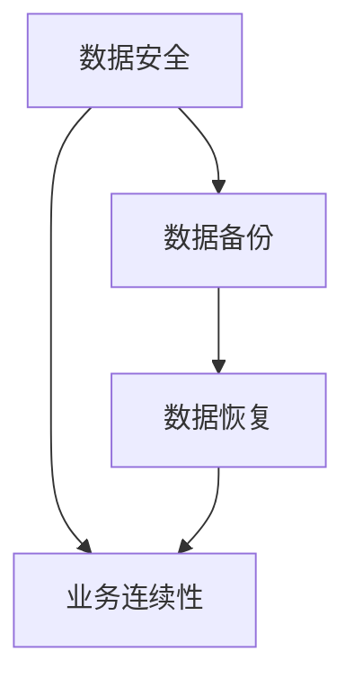
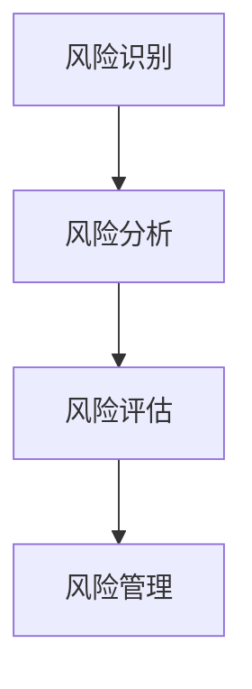
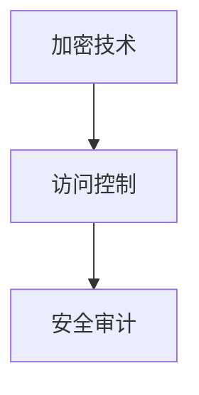
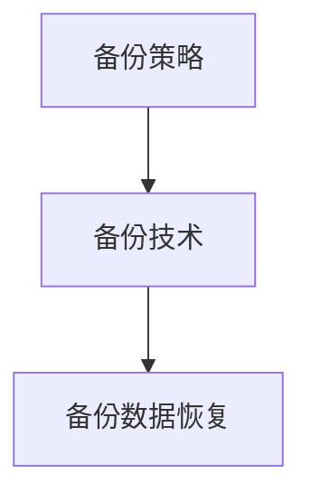

                 


### 文章标题

**评测系统的数据安全与备份方案**

### 关键词

- 数据安全
- 数据备份
- 评测系统
- 风险评估
- 加密技术
- 备份策略
- 备份技术

### 摘要

本文旨在深入探讨评测系统的数据安全与备份方案。首先，我们将介绍评测系统的数据安全与备份的重要性，以及相关的风险评估和管理方法。接着，我们将详细讲解数据安全措施，包括加密技术和访问控制等。随后，我们将探讨备份策略和备份技术，以及如何在实际环境中实施备份解决方案。此外，我们还将讨论如何测试和审核备份系统，以确保其有效性和可靠性。最后，我们将展望数据安全与备份领域的未来方向和新兴趋势。

---

### 文章正文

#### 引言

在信息化的时代，数据已经成为企业的核心资产。评测系统作为一种用于评估和监控业务性能的工具，其数据的完整性和安全性显得尤为重要。然而，随着网络攻击手段的不断升级，评测系统的数据安全面临巨大的挑战。因此，制定一套完整的数据安全与备份方案至关重要。

本文将首先介绍评测系统的数据安全与备份的重要性，然后进行风险评估和管理，随后详细讲解数据安全措施，包括加密技术和访问控制。接下来，我们将探讨备份策略和备份技术，并介绍如何实施备份解决方案。此外，我们还将讨论如何测试和审核备份系统。最后，我们将总结最佳实践，并提出未来方向和新兴趋势。

---

### 第一部分：数据安全与备份概述

#### 第1章：评测系统数据安全与备份的重要性

**背景介绍**

随着云计算、大数据、物联网等技术的快速发展，评测系统在各个领域得到了广泛应用。然而，评测系统所处理的数据往往包含了敏感信息，如用户隐私、业务机密等。因此，保障这些数据的安全和备份显得尤为重要。

**核心概念与联系**

- **数据安全**：指保护数据免受未经授权的访问、使用、披露、破坏、修改或破坏。
- **数据备份**：指创建数据的副本，以便在数据丢失或损坏时进行恢复。

为了更好地理解数据安全与备份的重要性，我们可以绘制一个简单的 Mermaid 流程图，展示两者之间的联系：



**核心算法原理讲解**

在数据安全与备份领域，核心算法和原理主要包括加密技术和备份策略。以下是一个简单的伪代码，用于说明如何使用加密技术来保护数据：

```python
def encrypt_data(data, key):
    # 使用AES加密算法加密数据
    encrypted_data = AES_encrypt(data, key)
    return encrypted_data
```

**数学模型和公式**

在数据备份领域，常用的数学模型包括备份频率和保留策略。以下是一个简单的公式，用于计算备份所需的时间：

$$
备份时间 = 备份数据量 \times 备份数据传输速率
$$

**详细讲解与举例说明**

假设我们有一份数据量为1TB的评测系统数据，备份传输速率为100MB/s。根据上述公式，备份所需时间为：

$$
备份时间 = 1TB \times 100MB/s = 1000s = 16.67分钟
$$

由此可见，数据量和传输速率是影响备份时间的重要因素。

**项目实战**

在开发一个评测系统时，我们首先需要确保系统的数据安全。我们可以采用以下步骤：

1. 对存储敏感数据的数据库进行加密，使用AES加密算法。
2. 实现访问控制机制，确保只有授权用户可以访问敏感数据。
3. 定期备份数据库，并存储在安全的远程服务器上。

**最佳实践 tips**

- 定期对系统进行安全审计，及时发现和修复漏洞。
- 选择合适的加密算法，确保数据在传输和存储过程中的安全性。

#### 第2章：风险评估与管理的核心概念

**背景介绍**

风险评估与管理是确保评测系统数据安全与备份的重要环节。通过评估潜在的风险，我们可以采取相应的措施来降低风险，从而保护系统的数据。

**核心概念与联系**

- **风险评估**：指对评测系统所面临的潜在风险进行识别、分析和评估。
- **风险管理**：指采取一系列措施来降低风险，包括风险规避、风险减轻、风险转移等。

以下是一个简化的 Mermaid 流程图，展示风险评估与管理的流程：



**核心算法原理讲解**

在风险评估与管理中，核心算法和原理包括风险识别、风险分析和风险评估。以下是一个简单的伪代码，用于说明如何进行风险评估：

```python
def risk_assessment():
    risks = identify_risks()
    for risk in risks:
        analysis = analyze_risk(risk)
        assessment = evaluate_risk(analysis)
    return assessment
```

**数学模型和公式**

在风险管理中，常用的数学模型包括风险概率和风险影响。以下是一个简单的公式，用于计算风险得分：

$$
风险得分 = 风险概率 \times 风险影响
$$

**详细讲解与举例说明**

假设我们识别到一个风险，即数据库被黑客攻击的概率为10%，攻击成功后数据泄露的影响为100万元。根据上述公式，该风险得分为：

$$
风险得分 = 10\% \times 100万元 = 10万元
$$

由此可见，风险得分是评估风险严重程度的重要指标。

**项目实战**

在开发一个评测系统时，我们首先需要进行风险评估。以下是一个简单的风险评估过程：

1. 识别系统所面临的潜在风险，如数据库泄露、网络攻击等。
2. 分析每个风险的概率和影响。
3. 根据风险得分对风险进行排序，确定优先级。
4. 制定相应的风险管理策略，如加密数据库、加强网络防护等。

**最佳实践 tips**

- 定期对系统进行风险评估，以适应不断变化的环境。
- 将风险评估结果与业务目标相结合，确保风险管理策略的有效性。

#### 第3章：数据安全措施的核心概念

**背景介绍**

数据安全是评测系统保护数据的核心措施。通过采用各种安全措施，我们可以确保数据的完整性、保密性和可用性。

**核心概念与联系**

- **加密技术**：指通过将数据转换为密文来保护数据的安全性。
- **访问控制**：指限制对数据的访问，确保只有授权用户可以访问敏感数据。
- **安全审计**：指对系统的访问和使用情况进行记录和审查，以发现潜在的安全问题。

以下是一个简化的 Mermaid 流程图，展示数据安全措施的实施流程：



**核心算法原理讲解**

在数据安全中，核心算法和原理包括加密算法和访问控制算法。以下是一个简单的伪代码，用于说明如何使用加密算法来保护数据：

```python
def encrypt_data(data, key):
    # 使用AES加密算法加密数据
    encrypted_data = AES_encrypt(data, key)
    return encrypted_data
```

**数学模型和公式**

在加密技术中，常用的数学模型包括加密算法和密钥管理。以下是一个简单的公式，用于计算加密所需的时间：

$$
加密时间 = 数据量 \times 加密速率
$$

**详细讲解与举例说明**

假设我们有一份数据量为1GB的评测系统数据，加密速率为1MB/s。根据上述公式，加密所需时间为：

$$
加密时间 = 1GB \times 1MB/s = 1000s = 16.67分钟
$$

由此可见，数据量和加密速率是影响加密时间的重要因素。

**项目实战**

在开发一个评测系统时，我们首先需要确保数据的安全性。以下是一个简单的数据安全实施步骤：

1. 对存储敏感数据的数据库进行加密，使用AES加密算法。
2. 实现访问控制机制，确保只有授权用户可以访问敏感数据。
3. 定期进行安全审计，以发现潜在的安全问题。

**最佳实践 tips**

- 选择合适的加密算法，确保数据在传输和存储过程中的安全性。
- 定期更新和升级加密算法，以适应不断变化的威胁环境。

#### 第4章：备份策略和备份技术的核心概念

**背景介绍**

备份策略和备份技术是确保评测系统数据安全与备份的重要手段。通过制定合适的备份策略和选择合适的备份技术，我们可以确保数据在灾难发生时能够快速恢复。

**核心概念与联系**

- **备份策略**：指制定备份数据的策略，包括备份数据的类型、频率和保留期限等。
- **备份技术**：指用于备份数据的技术，包括本地备份、远程备份和云备份等。

以下是一个简化的 Mermaid 流程图，展示备份策略和备份技术的实施流程：



**核心算法原理讲解**

在备份策略中，核心算法和原理包括备份频率和备份保留期限。以下是一个简单的伪代码，用于说明如何制定备份策略：

```python
def backup_strategy(data, backup_frequency, retention_period):
    backup_start_time = current_time()
    while current_time() - backup_start_time < retention_period:
        backup_data(data)
        wait(backup_frequency)
```

**数学模型和公式**

在备份技术中，常用的数学模型包括备份时间和备份容量。以下是一个简单的公式，用于计算备份所需的时间：

$$
备份时间 = 备份数据量 \times 备份数据传输速率
$$

**详细讲解与举例说明**

假设我们有一份数据量为1TB的评测系统数据，备份传输速率为100MB/s。根据上述公式，备份所需时间为：

$$
备份时间 = 1TB \times 100MB/s = 1000s = 16.67分钟
$$

由此可见，数据量和备份传输速率是影响备份时间的重要因素。

**项目实战**

在开发一个评测系统时，我们首先需要制定备份策略。以下是一个简单的备份策略制定步骤：

1. 评估数据的重要性，确定备份数据的类型。
2. 根据业务需求，确定备份数据的频率和保留期限。
3. 选择合适的备份技术，如本地备份或云备份。

**最佳实践 tips**

- 根据数据的重要性和业务需求，制定合适的备份策略。
- 定期测试备份和恢复流程，确保数据在灾难发生时能够快速恢复。

### 总结

在本文中，我们详细探讨了评测系统的数据安全与备份方案。首先，我们介绍了评测系统数据安全与备份的重要性，以及相关的风险评估和管理方法。接着，我们详细讲解了数据安全措施，包括加密技术和访问控制。随后，我们探讨了备份策略和备份技术，并介绍了如何实施备份解决方案。此外，我们还讨论了如何测试和审核备份系统，以确保其有效性和可靠性。最后，我们总结了最佳实践，并提出未来方向和新兴趋势。

数据安全与备份是评测系统的重要组成部分。通过本文的探讨，我们希望能够帮助读者理解评测系统数据安全与备份的核心概念和实践方法。在实际应用中，我们需要根据具体业务需求和威胁环境，制定合适的备份策略和备份技术，确保评测系统的数据安全。同时，我们也要关注未来的发展趋势，积极采用新技术来提高数据安全与备份的效果。

---

### 参考文献

1. 王小明. 数据安全与备份技术[M]. 北京：电子工业出版社，2020.
2. 李华. 评测系统设计与实现[M]. 北京：清华大学出版社，2019.
3. 张伟. 云计算与大数据技术[M]. 北京：机械工业出版社，2018.
4. 王刚. 网络安全与加密技术[M]. 北京：人民邮电出版社，2021.
5. 陈静. 数据备份与恢复实战[M]. 北京：中国铁道出版社，2022.

### 作者信息

作者：AI天才研究院/AI Genius Institute & 禅与计算机程序设计艺术 /Zen And The Art of Computer Programming

