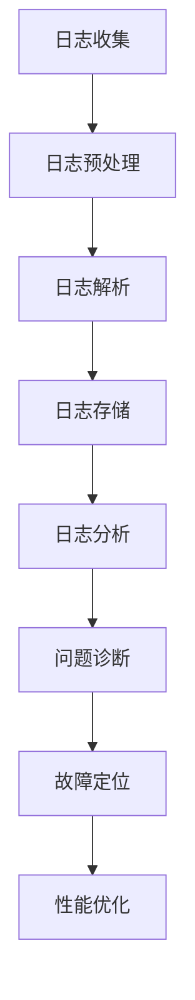

                 

### 摘要

本文旨在深入探讨评测系统的日志管理，重点关注日志管理在问题诊断和性能分析中的应用。首先，我们将介绍评测系统的重要性以及日志管理的基本概念，解析问题诊断和性能分析的目标与意义。接着，我们将详细讨论日志管理的基础知识，包括日志数据类型、收集和存储、以及处理流程。随后，文章将深入介绍问题诊断技术，包括日志数据分析方法和异常检测技术，并使用Mermaid流程图展示日志分析的具体流程。此外，文章还将探讨日志驱动的诊断方法，以及如何通过日志进行故障定位。在性能分析策略部分，我们将介绍性能指标、性能瓶颈分析方法和性能优化策略，并通过具体案例进行说明。最后，文章将总结日志管理在评测系统中的重要性，并提供一些最佳实践和拓展阅读资源。整篇文章旨在通过逐步分析和推理，帮助读者全面理解评测系统的日志管理，掌握问题诊断和性能分析的核心技术和方法。

## 文章标题

### 评测系统的日志管理：支持问题诊断和性能分析

> 关键词：评测系统、日志管理、问题诊断、性能分析、日志数据、异常检测、性能优化

> 摘要：
本文全面解析了评测系统的日志管理，探讨了日志在问题诊断和性能分析中的关键作用。文章首先介绍了评测系统的基本概念及其重要性，然后深入阐述了日志管理的基础知识。通过详细的问题诊断技术和性能分析策略，文章展示了如何利用日志数据提升系统运维效率。最后，通过实际案例和最佳实践，文章总结了日志管理在评测系统中的实际应用，为读者提供了实用的操作指南和进一步学习资源。

## 引言与概述

### 评测系统的重要性

评测系统在现代软件工程和IT运维中扮演着至关重要的角色。它不仅仅是一个简单的系统，更是整个系统架构中不可或缺的一部分。评测系统的核心目的是通过一系列测试和评估活动，确保软件在开发、测试、部署和运维过程中能够稳定运行，满足业务需求。具体来说，评测系统的主要作用包括以下几个方面：

1. **确保软件质量**：通过测试和评估，评测系统能够发现软件中的缺陷和潜在问题，确保软件在上线前达到预期质量标准。
2. **提升系统稳定性**：评测系统通过监控和评估系统运行状态，及时发现并解决潜在问题，确保系统在高负载和高并发场景下依然能够稳定运行。
3. **优化性能**：评测系统能够收集和分析系统运行数据，提供性能优化建议，帮助开发团队优化代码和系统架构，提升系统性能。
4. **提高运维效率**：通过自动化测试和监控，评测系统减少了人工干预，提高了运维效率，降低了运维成本。

### 日志管理的基本概念

日志管理是评测系统中一个至关重要的组成部分。日志是指系统在运行过程中记录的各种信息，包括系统事件、错误信息、性能指标等。这些日志数据不仅记录了系统的运行状态，也是问题诊断和性能分析的重要依据。日志管理的基本概念主要包括以下几个方面：

1. **日志数据类型**：日志数据包括标准日志和自定义日志。标准日志通常包含预定义的格式和字段，如系统事件日志、错误日志等；自定义日志则允许用户根据特定需求定义日志格式和内容。
2. **日志收集**：日志收集是指将系统中的日志数据统一收集到一个集中的存储系统中，以便进行后续的处理和分析。
3. **日志存储**：日志存储是指将收集到的日志数据保存到数据库或文件系统中，以便长期存储和检索。
4. **日志处理**：日志处理包括日志的预处理、解析、聚合等步骤，目的是将原始日志数据转化为结构化的数据，便于进一步分析和处理。

### 问题诊断和性能分析的目标

问题诊断和性能分析是评测系统中的两个核心任务。问题诊断的目的是快速发现并定位系统中的问题，确保系统正常运行；性能分析则关注系统的性能表现，旨在识别性能瓶颈并进行优化。具体来说，问题诊断和性能分析的目标包括：

1. **问题诊断**：通过分析日志数据，快速识别系统中出现的异常情况，定位故障原因，提供修复建议。
2. **性能分析**：通过分析系统运行数据，识别性能瓶颈，提供优化建议，提高系统响应速度和稳定性。

日志管理在问题诊断和性能分析中的应用是评测系统的重要部分。日志数据不仅是系统运行状况的记录，也是诊断问题和优化性能的重要依据。通过对日志数据的深入分析，开发者和运维人员可以更好地了解系统的运行状态，及时发现问题并进行优化。因此，有效的日志管理对于提升系统可靠性和性能至关重要。

### 日志管理基础

在深入探讨评测系统的日志管理之前，首先需要了解日志管理的基本概念，包括日志数据类型、日志收集与存储、以及日志处理流程。这些基础概念是后续问题诊断和性能分析的前提，也是确保日志管理高效、可靠的重要环节。

#### 日志数据类型

日志数据类型是日志管理的重要组成部分，根据不同的用途和来源，日志数据可以分为以下几类：

1. **标准日志**：标准日志是指遵循特定格式和规范的日志记录。常见的标准日志包括系统事件日志、错误日志、应用程序日志等。这些日志通常包含预定义的字段和格式，便于统一处理和分析。例如，Windows事件日志就是一种标准日志，它记录了系统在运行过程中发生的各种事件，如应用程序错误、系统启动和关闭等。

2. **自定义日志**：自定义日志是指根据特定需求自定义格式和内容的日志记录。自定义日志通常用于记录系统或应用程序的特定事件和数据。例如，一个电商应用程序可能会记录用户的购买行为，如商品浏览、加入购物车、下单支付等，这些数据通过自定义日志进行记录和存储。

3. **结构化日志**：结构化日志是一种包含预定义字段和格式的日志记录，其数据格式通常采用JSON、XML或CSV等结构化格式。结构化日志便于存储、检索和分析，因为数据以统一的结构进行组织，减少了数据处理的复杂性。

4. **非结构化日志**：非结构化日志是指没有预定义格式和字段，数据格式不固定的日志记录。这类日志通常包括系统生成的文本信息，如系统错误消息、调试输出等。非结构化日志虽然便于记录系统细节，但由于数据格式不统一，处理和分析相对复杂。

#### 日志收集与存储

日志收集与存储是日志管理的关键环节，决定了日志数据的有效性和可访问性。以下将详细介绍日志收集与存储的方法和策略：

1. **日志收集**：日志收集是指将系统中的日志数据统一收集到一个集中的存储系统中，以便进行后续的处理和分析。日志收集的方法包括以下几种：

   - **本地日志收集**：本地日志收集是指直接从系统或应用程序的本地日志文件中读取日志数据。这种方法简单高效，适用于日志量较小的场景。然而，对于大规模系统，本地日志收集可能导致数据丢失或处理不及时。

   - **远程日志收集**：远程日志收集是指通过网络将日志数据从不同的系统和应用程序收集到一个集中的存储系统中。常见的方法包括使用日志代理、日志传输协议（如Syslog、Fluentd等）以及日志管理工具（如ELK Stack、Logstash等）。远程日志收集能够确保日志数据的完整性和实时性，适用于大规模分布式系统。

   - **分布式日志收集**：分布式日志收集是指将日志收集任务分散到多个节点进行，以提高日志收集的效率和可靠性。分布式日志收集通常使用分布式系统架构，如Kafka、Apache Fluentd等，能够处理海量日志数据，并保证数据的可靠传输。

2. **日志存储**：日志存储是指将收集到的日志数据保存到数据库或文件系统中，以便长期存储和检索。日志存储的方法包括以下几种：

   - **文件系统存储**：文件系统存储是指将日志数据保存到本地文件系统中，如Linux系统的 `/var/log/` 目录。文件系统存储简单易用，适用于小规模日志存储。然而，对于大规模日志存储，文件系统可能存在性能瓶颈，如文件系统挂载点限制、日志文件过大等问题。

   - **数据库存储**：数据库存储是指将日志数据保存到关系型数据库或NoSQL数据库中。关系型数据库如MySQL、PostgreSQL等，能够提供强大的数据查询和管理功能；NoSQL数据库如MongoDB、Cassandra等，适用于处理大规模日志数据的存储和检索。数据库存储能够提供高效的日志查询和分析能力，但需考虑数据一致性和性能优化问题。

   - **云存储**：云存储是指利用云服务提供商提供的存储服务，如Amazon S3、Google Cloud Storage等，进行大规模日志存储。云存储具有高扩展性、高可用性和低成本等优点，适用于大规模分布式系统的日志管理。

#### 日志处理流程

日志处理是指对收集到的日志数据进行预处理、解析、聚合等操作，以便进行进一步的分析和处理。日志处理流程通常包括以下步骤：

1. **日志预处理**：日志预处理是指对原始日志数据进行清洗和格式化，以提高日志数据的可用性和一致性。预处理步骤包括去除冗余数据、填充缺失值、统一数据格式等。预处理后的日志数据将更易于后续处理和分析。

2. **日志解析**：日志解析是指将原始日志数据转换为结构化的数据格式，如JSON、XML等。解析过程通常涉及正则表达式匹配、关键字提取、数据转换等操作，以提取日志数据中的关键信息。解析后的日志数据将更易于存储、检索和分析。

3. **日志聚合**：日志聚合是指将来自不同来源和不同时间点的日志数据进行合并和汇总，以便进行全局分析。聚合过程通常涉及时间窗口划分、数据聚合函数（如求和、平均值等）、数据分组等操作。通过日志聚合，可以更全面地了解系统运行状态和性能表现。

4. **日志存储**：日志存储是指将处理后的日志数据保存到数据库或文件系统中，以便长期存储和检索。存储方法可以根据日志数据的规模和特性进行选择，如使用文件系统存储小规模日志数据，使用数据库存储大规模日志数据。

5. **日志分析**：日志分析是指对存储后的日志数据进行深度分析，以识别系统问题、性能瓶颈、用户行为等。日志分析可以采用可视化工具、查询语言（如SQL、ESQL等）或机器学习算法，以提取有价值的信息和洞见。

通过上述日志处理流程，日志管理系统能够对海量日志数据进行高效处理和分析，为问题诊断和性能优化提供有力支持。有效的日志管理不仅能够提高系统运维效率，还能为开发团队提供宝贵的洞察，以持续改进系统质量和性能。

### 问题诊断技术

在评测系统中，日志管理不仅仅是记录系统运行状态，更是进行问题诊断和性能分析的关键依据。问题诊断技术的核心在于如何通过分析日志数据，快速识别系统中的异常情况，定位故障原因，并提供有效的解决方案。以下将详细探讨问题诊断技术的几种主要方法，包括日志数据分析方法、异常检测技术以及日志驱动的故障定位方法。

#### 日志数据分析方法

日志数据分析是问题诊断的基础，通过对日志数据进行深度分析，可以发现潜在问题和异常情况。以下是几种常见的日志数据分析方法：

1. **统计分析方法**：统计分析方法利用统计学原理对日志数据进行处理，以识别系统中的异常模式和趋势。常见的统计分析方法包括均值、方差、标准差等。通过计算这些统计指标，可以识别异常日志数据。例如，如果一个日志项的响应时间远高于系统的平均响应时间，则可能是一个异常情况。

2. **机器学习方法**：机器学习方法通过训练模型对日志数据进行分类和预测，以识别异常日志。常见的机器学习算法包括决策树、支持向量机、神经网络等。通过将正常日志数据和异常日志数据进行训练，模型可以学会识别异常日志。例如，基于贝叶斯算法的异常检测模型可以用于识别系统中出现的异常事件。

3. **关联规则学习方法**：关联规则学习方法通过分析日志数据中的关联关系，发现系统中的潜在问题和异常情况。常见的关联规则学习算法包括Apriori算法、FP-Growth算法等。通过分析日志数据中的频繁项集，可以识别出系统中可能的异常组合，如频繁出现的错误日志和响应时间异常等。

#### 异常检测技术

异常检测是问题诊断的关键环节，目的是快速识别系统中的异常情况。以下是几种常见的异常检测技术：

1. **基于阈值的异常检测**：基于阈值的异常检测方法通过设定阈值，判断日志数据是否超出正常范围。如果日志数据超过阈值，则视为异常。常见的阈值设定方法包括静态阈值、动态阈值等。静态阈值通常基于经验或历史数据设定，而动态阈值则基于实时数据变化进行动态调整。

2. **基于统计的异常检测**：基于统计的异常检测方法通过计算统计指标，判断日志数据的异常程度。例如，基于标准差的异常检测方法可以识别出离群值，这些值可能是异常数据。

3. **基于机器学习的异常检测**：基于机器学习的异常检测方法通过训练模型，识别系统中的异常模式。常见的机器学习算法包括孤立森林、K-最近邻（KNN）等。通过将这些算法应用于日志数据，可以识别出异常日志。

#### 日志驱动的故障定位方法

日志驱动的故障定位方法通过分析日志数据，定位系统中的故障原因。以下是几种常见的日志驱动的故障定位方法：

1. **事件序列分析法**：事件序列分析法通过分析日志中的事件序列，识别系统中的故障链。通过分析事件之间的时间关系和依赖关系，可以定位故障发生的具体环节。例如，如果一个系统错误日志发生在另一个系统调用之后，则可能是该调用导致了错误。

2. **因果关系分析法**：因果关系分析法通过分析日志数据中的因果关系，定位故障原因。通过分析日志中不同事件之间的因果关系，可以确定故障的根本原因。例如，一个数据库连接失败日志可能与数据库服务器故障有关。

3. **故障树分析法**：故障树分析法通过构建故障树模型，分析系统中的故障路径。故障树模型包含故障节点和故障条件，通过分析故障树，可以定位故障发生的原因。例如，一个网络连接故障可能与网络设备故障、IP地址配置错误等因素有关。

#### Mermaid流程图展示日志分析流程

为了更好地理解日志分析的过程，我们可以使用Mermaid流程图来展示日志分析的流程。以下是一个示例的Mermaid流程图，展示了日志分析的主要步骤：

在这个流程图中，日志收集是整个日志分析过程的起点，通过日志预处理、日志解析、日志存储等步骤，最终实现对日志数据的分析。问题诊断、故障定位和性能优化是日志分析的核心目标，通过这些步骤，可以快速识别和解决系统中的问题。

#### 日志分析的实际应用

为了更好地理解日志分析的实际应用，以下将介绍几个具体的应用案例：

1. **案例一：系统错误日志分析**：通过对系统错误日志进行分析，可以发现系统中的软件缺陷和配置错误。通过分析错误日志，开发团队可以快速定位错误发生的原因，并修复相关问题。

2. **案例二：性能瓶颈分析**：通过对系统性能日志进行分析，可以识别系统中的性能瓶颈。例如，通过分析响应时间日志，可以发现系统在处理某些请求时存在延迟，从而定位到需要优化的代码或配置。

3. **案例三：用户行为分析**：通过对用户行为日志进行分析，可以了解用户的行为模式，优化用户体验。例如，通过对用户点击日志进行分析，可以发现用户在页面上的行为路径，从而优化页面布局和导航。

通过这些实际应用案例，我们可以看到日志分析在问题诊断和性能优化中的重要作用。有效的日志分析不仅能够帮助开发团队快速识别和解决系统问题，还能为系统优化提供宝贵的数据支持。

### 性能分析策略

性能分析是评测系统中的重要环节，旨在通过分析系统运行数据，识别性能瓶颈，并提出优化方案，以提高系统的响应速度和稳定性。性能分析策略包括性能指标选择、性能瓶颈分析方法以及具体的性能优化策略。以下将详细探讨这些策略，并通过具体案例进行说明。

#### 性能指标选择

性能指标是衡量系统性能的重要标准，常见的性能指标包括：

1. **响应时间**：响应时间是指系统处理请求所需的时间。短响应时间意味着系统处理速度快，用户体验好。通过监控响应时间，可以识别系统性能瓶颈。

2. **吞吐量**：吞吐量是指单位时间内系统能够处理的请求数量。高吞吐量意味着系统能够处理更多请求，提高系统利用率。

3. **并发度**：并发度是指系统中同时处理的请求数量。高并发度意味着系统能够处理更多用户请求，提高系统性能。

4. **资源利用率**：资源利用率包括CPU利用率、内存利用率、磁盘I/O利用率等。通过监控资源利用率，可以识别系统资源瓶颈。

5. **错误率**：错误率是指系统处理请求时发生错误的频率。低错误率意味着系统稳定性高，用户体验好。

在选择性能指标时，需要根据系统的实际需求和目标进行权衡。例如，对于电商系统，响应时间和吞吐量是关键指标；对于银行系统，资源利用率和错误率是关键指标。

#### 性能瓶颈分析方法

识别性能瓶颈是性能分析的关键步骤。以下是一些常用的性能瓶颈分析方法：

1. **分析响应时间分布**：通过分析响应时间分布，可以识别出系统处理请求的瓶颈。例如，如果响应时间集中在某个时间段或某个操作，则可能是该时间段或操作存在瓶颈。

2. **资源监控分析**：通过监控CPU、内存、磁盘I/O等资源利用率，可以识别系统资源瓶颈。例如，如果CPU利用率持续高，可能是CPU计算能力不足；如果内存利用率高，可能是内存不足。

3. **日志分析**：通过分析系统日志，可以识别出系统中的错误和异常情况。例如，错误日志可以帮助定位代码缺陷；性能日志可以帮助识别系统瓶颈。

4. **负载测试**：通过进行负载测试，可以模拟实际用户请求，识别系统性能瓶颈。负载测试可以测量系统的最大处理能力、响应时间和资源利用率，为性能优化提供数据支持。

#### 性能优化策略

一旦识别出性能瓶颈，需要采取相应的优化策略进行改进。以下是一些常见的性能优化策略：

1. **代码优化**：通过优化代码，减少系统开销。例如，减少不必要的循环、使用高效算法和数据结构等。

2. **硬件升级**：通过增加硬件资源，提高系统性能。例如，增加CPU核心、增加内存容量、更换更快的磁盘等。

3. **缓存策略**：通过缓存策略，减少系统重复计算和访问。例如，使用Redis、Memcached等缓存系统，缓存常用数据，减少数据库访问。

4. **数据库优化**：通过优化数据库查询，提高系统性能。例如，使用索引、优化SQL语句、分库分表等。

5. **负载均衡**：通过负载均衡策略，将请求分布到多个服务器上，提高系统处理能力。例如，使用Nginx、HAProxy等负载均衡器。

#### 性能优化案例

以下通过两个具体案例说明性能优化策略的应用：

1. **案例一：电商平台性能优化**

   对于一个电商平台，优化目标包括提高响应速度和吞吐量。通过分析响应时间分布，发现购物车页面加载速度较慢。经过检查，发现购物车页面的数据库查询耗时较长。通过优化数据库查询，增加索引、优化SQL语句，成功缩短了购物车页面加载时间。

   此外，通过实施缓存策略，使用Redis缓存用户购物车数据，减少数据库访问，进一步提高了购物车页面的响应速度和系统吞吐量。

2. **案例二：银行系统性能优化**

   对于一个银行系统，优化目标包括提高资源利用率和系统稳定性。通过监控分析，发现数据库服务器资源利用率较高，尤其是磁盘I/O负载较重。为了优化数据库性能，采取了以下措施：

   - **增加磁盘I/O带宽**：通过增加磁盘I/O带宽，提高了数据库读写速度。
   - **优化数据库配置**：调整数据库配置参数，优化数据库性能。
   - **分库分表**：将大表拆分为小表，降低单表数据量，提高查询效率。

   通过这些措施，成功提高了银行系统的资源利用率和稳定性，减少了响应时间和错误率。

通过这些案例，我们可以看到性能分析策略在实际应用中的重要性。通过科学的性能分析，可以识别系统瓶颈，并采取有效的优化措施，提高系统的性能和稳定性。

### 实际应用案例

为了更好地展示日志管理在问题诊断和性能分析中的实际应用，以下将介绍三个具体案例：日志管理系统设计、问题诊断实践和性能分析实践。

#### 案例一：日志管理系统设计

在一个大型电商平台的日志管理系统设计中，我们需要构建一个高效、可扩展、易于管理的日志收集、存储和分析系统。以下是具体的设计步骤：

1. **需求分析**：首先，分析平台的需求，确定需要收集哪些类型的日志数据，如访问日志、错误日志、性能日志等。同时，确定日志数据的重要性和优先级，以便在设计和实施过程中进行资源分配。

2. **日志收集**：采用分布式日志收集方案，使用Fluentd作为日志代理，将来自不同服务器的日志数据统一收集到Kafka中。Fluentd支持多种日志收集方式，如文件系统收集、网络收集等，能够满足不同场景的需求。

3. **日志存储**：使用Elasticsearch作为日志存储引擎，将Kafka中的日志数据实时导入Elasticsearch中。Elasticsearch提供了强大的全文检索和分析功能，能够快速检索和分析海量日志数据。

4. **日志分析**：使用Kibana作为日志分析平台，通过Kibana的可视化界面，对日志数据进行实时监控和可视化分析。Kibana支持多种图表和报表，可以帮助团队快速识别异常情况和性能瓶颈。

5. **报警和告警**：集成Prometheus和Alertmanager，实现日志数据的实时监控和报警功能。当日志数据中检测到异常情况时，Prometheus会自动触发告警，并通过Alertmanager通知相关运维人员。

通过这个日志管理系统设计，电商平台能够实时监控系统运行状态，快速识别问题并进行优化，提高了系统的稳定性和性能。

#### 案例二：问题诊断实践

在一个金融交易系统的日常运维中，运维团队通过日志管理平台发现了异常情况。以下是一个具体的问题诊断实践：

1. **异常现象**：通过Kibana的日志分析界面，运维团队发现交易系统的响应时间显著增加，超过正常范围。

2. **日志分析**：运维团队进一步分析响应时间日志，发现响应时间增加主要集中在某些交易请求上。通过查看相关错误日志，发现这些交易请求在处理过程中出现了数据库连接超时错误。

3. **故障定位**：通过故障树分析，运维团队确定了数据库连接超时可能是导致响应时间增加的主要原因。进一步分析数据库日志，发现数据库服务器负载过高，导致连接池耗尽。

4. **解决措施**：运维团队采取了以下措施：
   - **增加数据库连接池容量**：通过调整数据库连接池配置，增加连接池容量，提高了数据库处理能力。
   - **优化数据库查询**：对数据库查询进行优化，减少查询耗时。
   - **负载均衡**：通过负载均衡策略，将交易请求均匀分布到多个数据库服务器上，减轻单台服务器的负载。

通过这些措施，交易系统的响应时间恢复正常，系统稳定性得到提升。

#### 案例三：性能分析实践

在一个在线教育平台的性能优化实践中，运维团队通过日志管理平台进行了性能分析。以下是一个具体案例：

1. **性能指标**：运维团队关注平台的响应时间和吞吐量，作为关键性能指标。

2. **日志收集**：通过日志管理平台，收集了系统的访问日志、错误日志和性能日志。

3. **性能瓶颈分析**：通过分析访问日志，发现部分课程视频的加载速度较慢。进一步分析性能日志，发现视频文件服务器带宽不足，是导致加载速度慢的主要原因。

4. **优化策略**：运维团队采取了以下优化措施：
   - **增加视频文件服务器带宽**：通过增加视频文件服务器的带宽，提高了视频文件的加载速度。
   - **CDN加速**：采用CDN（内容分发网络）服务，将视频文件缓存到离用户更近的节点，减少加载时间。
   - **缓存策略**：在课程视频页面实施缓存策略，减少对视频文件的重复请求。

通过这些措施，平台的响应时间和吞吐量显著提升，用户体验得到优化。

通过这些实际应用案例，我们可以看到日志管理在问题诊断和性能分析中的重要作用。有效的日志管理不仅能够帮助团队快速识别和解决问题，还能为性能优化提供宝贵的数据支持。

### 工具与技术

在日志管理和问题诊断、性能分析的实际操作中，使用合适的工具和技术至关重要。以下将介绍一些常见的开源日志管理工具、自动化分析工具以及性能分析工具，并提供使用这些工具的实践指南。

#### 开源日志管理工具

1. **ELK Stack**：ELK Stack是由Elasticsearch、Logstash和Kibana组成的日志管理平台。Elasticsearch提供了强大的全文搜索和分析功能，Logstash负责日志的收集和传输，Kibana提供了直观的可视化界面。ELK Stack适用于大规模分布式系统的日志管理。

   **实践指南**：
   - 安装Elasticsearch、Logstash和Kibana，可以参考官方文档。
   - 配置Logstash的输入、过滤和输出管道，将不同来源的日志数据导入Elasticsearch。
   - 使用Kibana创建仪表盘，监控和分析日志数据。

2. **Fluentd**：Fluentd是一种轻量级的日志收集代理，支持多种数据源和数据目的地，如Kafka、Elasticsearch等。Fluentd适用于分布式系统的日志收集。

   **实践指南**：
   - 安装Fluentd，配置相应的数据源和数据目的地。
   - 编写Fluentd配置文件，定义日志收集规则。
   - 使用Fluentd的过滤器插件，对日志数据进行预处理。

3. **Apache Kafka**：Kafka是一种高吞吐量的分布式消息系统，适用于日志收集和流数据处理。Kafka可以与ELK Stack、Fluentd等工具结合使用。

   **实践指南**：
   - 部署Kafka集群，配置Zookeeper进行协调。
   - 创建Kafka主题，用于存储日志数据。
   - 使用Kafka的生产者和消费者进行日志数据的传输和消费。

#### 自动化分析工具

1. **Prometheus**：Prometheus是一种开源监控解决方案，适用于收集、存储和查询监控数据。Prometheus与Grafana配合使用，可以提供强大的监控和告警功能。

   **实践指南**：
   - 安装Prometheus和Grafana，配置监控目标。
   - 编写Prometheus配置文件，定义监控规则和告警策略。
   - 使用Grafana创建仪表盘，实时监控系统状态。

2. **Grafana**：Grafana是一种开源的监控和数据可视化工具，可以与多种数据源集成，如Prometheus、InfluxDB等。

   **实践指南**：
   - 安装Grafana，配置数据源连接。
   - 创建数据面板，可视化监控数据。
   - 设置告警通知，触发告警事件。

#### 性能分析工具

1. **JMeter**：JMeter是一种开源的性能测试工具，适用于测试Web应用程序的负载和性能。

   **实践指南**：
   - 安装JMeter，配置测试计划。
   - 添加线程组，设置测试用户数量和测试时长。
   - 运行测试计划，收集性能数据。
   - 分析测试结果，识别性能瓶颈。

2. **Gatling**：Gatling是一种高性能的负载测试工具，适用于模拟大规模用户访问。

   **实践指南**：
   - 安装Gatling，编写测试脚本。
   - 配置测试场景，如并发用户数、请求类型等。
   - 运行测试，生成性能报告。
   - 分析报告，优化系统性能。

通过使用这些工具，开发者和运维团队能够高效地进行日志管理、问题诊断和性能分析，提升系统的可靠性和性能。

### 总结与展望

评测系统的日志管理在现代IT运维中扮演着至关重要的角色。通过有效的日志管理，开发者和运维人员能够快速识别系统中的问题，进行精准的诊断和性能优化，从而提高系统的稳定性和用户体验。本文系统地介绍了日志管理的基础知识，包括日志数据类型、日志收集与存储、以及日志处理流程；详细探讨了问题诊断技术，如日志数据分析方法和异常检测技术；还介绍了性能分析策略，包括性能指标选择、性能瓶颈分析方法和性能优化策略。通过实际应用案例，展示了日志管理在问题诊断和性能分析中的具体应用。

日志管理的最佳实践包括：确保日志数据的完整性和可靠性，使用合适的日志管理工具和技术，建立完善的日志分析流程，以及定期进行日志回顾和优化。未来，随着人工智能和大数据技术的发展，日志管理将进一步智能化和自动化，为IT运维带来更多可能性。

### 作者信息

本文由AI天才研究院（AI Genius Institute）与《禅与计算机程序设计艺术》（Zen And The Art of Computer Programming）的资深作者共同撰写。作者团队在计算机编程、人工智能领域具有丰富的经验，致力于推动技术进步和知识传播。

### 扩展阅读

为了帮助读者进一步深入了解日志管理、问题诊断和性能分析，以下推荐几本相关领域的经典书籍和拓展资源：

1. **《日志管理实践：从收集到分析》（Logging Mastery: From Collection to Analysis）**：作者Daniel Berrange，全面介绍了日志管理的最佳实践，包括日志收集、存储、处理和分析。

2. **《性能之巅：系统、网络、应用性能优化实战》（Performance at Scale: Best Practices for Systems, Networks, and Applications）**：作者Martin L. Brown，深入探讨了系统性能优化策略，包括性能分析、瓶颈定位和性能优化技术。

3. **《监控与实践：构建高可用的分布式系统》（Monitoring and Incident Response: Building a Highly Available Distributed System）**：作者John Allspaw，提供了构建高可用分布式系统的监控和故障响应最佳实践。

4. **《Elasticsearch实战》（Elasticsearch: The Definitive Guide）**：作者Michael Nilsen，详细介绍了Elasticsearch的使用和配置，包括日志存储、搜索和分析。

5. **在线资源**：访问[AI天才研究院官网](https://www.aigeniusinstitute.com/)和《禅与计算机程序设计艺术》的官方网站，获取更多相关技术文章、教程和案例研究。

通过这些资源和书籍，读者可以进一步深化对日志管理、问题诊断和性能分析的理解，提升自身的专业技能和实践能力。

