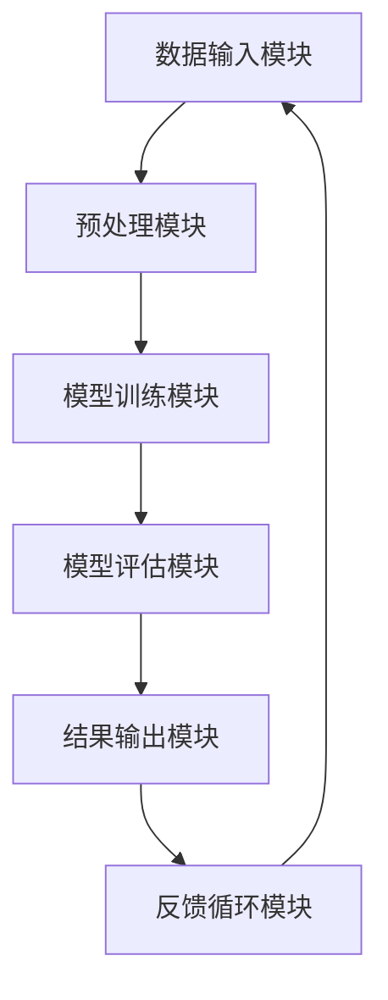

                 


# 文章标题：评测系统的模块化设计：适应不同LLM特性的架构

> 关键词：评测系统，模块化设计，语言模型（LLM），架构设计，算法实现，分布式计算

> 摘要：
本文旨在探讨评测系统的模块化设计方法，特别关注如何适应不同语言模型（LLM）的特性。通过引入模块化设计理念，本文提出了一种灵活且可扩展的评测系统架构，详细分析了模块化设计原理、LLM特性及其在架构设计中的应用。此外，本文还通过伪代码和实际案例，对关键算法和实现技术进行了深入讲解，为实际项目提供了参考和指导。

----------------------------------------------------------------

## 引言

### 1.1 评测系统的模块化设计背景

评测系统在人工智能领域扮演着至关重要的角色，它们用于评估模型性能、优化算法、监控系统运行状态等。然而，随着语言模型（LLM）的复杂性日益增加，传统的评测系统面临诸多挑战。首先，不同类型的LLM（如BERT、GPT、T5等）具有不同的结构和特性，使得评测系统的设计需要高度灵活和可定制。其次，大规模分布式训练和推理的需求也对评测系统提出了高性能和高可扩展性的要求。因此，模块化设计作为一种解决复杂系统问题的有效方法，被引入到评测系统的设计中。

### 1.2 研究目的与内容框架

本文的研究目的是提出一种模块化的评测系统架构，以适应不同LLM的特性，并提高系统的灵活性和可扩展性。文章内容框架如下：

1. 引言：介绍评测系统的模块化设计背景和研究目的。
2. 模块化设计原理与方法：讲解模块化设计的基本概念、原理和方法。
3. LLM特性分析：分析不同LLM的特性，包括模型结构、训练数据、应用场景等。
4. 模块化架构设计：根据LLM特性，设计适应不同LLM特性的评测系统模块化架构。
5. 模块化架构实现：介绍模块化架构的具体实现方法，包括关键技术、算法等。
6. 模块化架构应用：展示模块化架构在实际项目中的应用案例。
7. 总结与展望：总结模块化设计在评测系统中的应用，并对未来发展趋势进行展望。

## 模块化设计原理与方法

### 2.1 模块化设计的基本概念

模块化设计是一种将复杂系统分解为多个独立模块，并通过这些模块的协同工作实现系统功能的设计方法。在模块化设计中，每个模块都是高度自治的，可以独立开发、测试和部署。模块之间通过标准化的接口进行通信，从而实现系统的整体功能。

### 2.2 模块化设计的方法论

模块化设计的方法论主要包括以下步骤：

1. **需求分析**：明确系统需求，确定系统应具备的功能和性能指标。
2. **模块划分**：根据需求分析，将系统功能划分为多个独立模块。
3. **接口设计**：设计模块之间的接口，确保模块之间的高内聚和低耦合。
4. **模块开发**：独立开发每个模块，实现模块的功能。
5. **模块集成**：将所有模块集成到一个完整的系统中，进行系统测试和调试。
6. **迭代优化**：根据测试反馈，对模块和系统进行优化。

### 2.3 模块化设计的原则与策略

模块化设计应遵循以下原则和策略：

1. **高内聚、低耦合**：每个模块应高度关注自身功能，模块间耦合度应尽可能低。
2. **模块独立性**：每个模块应具有独立的功能和接口，便于独立开发和测试。
3. **标准化接口**：模块之间的接口应采用标准化设计，便于模块的替换和扩展。
4. **模块复用性**：设计时应考虑模块的复用性，以降低开发成本和提高开发效率。

## LLM 特性分析

### 3.1 LLM 的基本结构

语言模型（LLM）通常由编码器（Encoder）和解码器（Decoder）两部分组成。编码器负责将输入文本编码为连续的向量表示，解码器则负责将这些向量解码为输出文本。

### 3.2 LLM 的训练数据

LLM 的训练数据通常是大规模的文本语料库，如维基百科、新闻文章、社交媒体等。训练数据的选择和质量对LLM的性能具有决定性影响。

### 3.3 LLM 的应用场景

LLM 在许多领域都有广泛应用，如自然语言处理（NLP）、机器翻译、文本生成等。

### 3.4 LLM 的特性分析

1. **模型结构特性**：不同类型的LLM具有不同的模型结构，如BERT采用Transformer结构，GPT采用Transformer结构，T5则采用Transformer结构并具备任务适应性。
2. **训练效率特性**：不同的LLM在训练过程中具有不同的效率特性，如GPT-3的训练时间较长，但性能表现优异。
3. **应用场景特性**：不同的LLM适用于不同的应用场景，如BERT在问答系统中有较好表现，而T5在文本生成任务中具有优势。

## 模块化架构设计

### 4.1 模块化架构的设计原则

模块化架构设计应遵循以下原则：

1. **可扩展性**：系统应易于扩展，以适应未来需求的变化。
2. **灵活性**：系统应具有高度的灵活性，以适应不同LLM的特性。
3. **高内聚、低耦合**：模块之间应保持高内聚和低耦合，以提高系统的稳定性。

### 4.2 模块化架构的设计方法

模块化架构的设计方法主要包括：

1. **需求分析**：明确系统需求，确定系统应具备的功能和性能指标。
2. **模块划分**：根据需求分析，将系统功能划分为多个独立模块。
3. **接口设计**：设计模块之间的接口，确保模块之间的高内聚和低耦合。
4. **模块实现**：独立开发每个模块，实现模块的功能。
5. **模块集成**：将所有模块集成到一个完整的系统中，进行系统测试和调试。

### 4.3 模块化架构的 Mermaid 流程图

以下是一个简单的Mermaid流程图，展示了模块化架构的基本流程：



## 模块化架构实现

### 5.1 模块化架构的关键技术

模块化架构的实现需要以下关键技术：

1. **分布式计算**：利用分布式计算框架（如TensorFlow、PyTorch等）实现模型训练和评估的高性能处理。
2. **并行化技术**：通过并行化技术提高模型训练和评估的效率。
3. **数据预处理**：设计高效的数据预处理模块，以优化模型训练和评估的输入数据。
4. **接口标准化**：设计标准化的接口，以实现模块间的无缝集成。

### 5.2 模块化架构的算法实现

模块化架构的算法实现主要包括以下关键步骤：

1. **数据预处理算法**：实现数据清洗、归一化等预处理操作。
2. **模型训练算法**：采用适当的训练算法（如SGD、Adam等）进行模型训练。
3. **模型评估算法**：实现模型评估指标（如准确率、召回率等）的计算和输出。
4. **结果输出算法**：实现评估结果的输出和可视化。

### 5.3 模块化架构的伪代码讲解

以下是一个简单的伪代码示例，展示了模块化架构的实现：

```python
# 数据预处理伪代码
def preprocess_data(data):
    # 数据清洗
    clean_data = clean(data)
    # 数据归一化
    normalized_data = normalize(clean_data)
    return normalized_data

# 模型训练伪代码
def train_model(model, data):
    # 模型初始化
    model.initialize()
    # 模型训练
    for epoch in range(num_epochs):
        for batch in data:
            # 前向传播
            output = model.forward(batch)
            # 计算损失
            loss = compute_loss(output, batch)
            # 反向传播
            model.backward(loss)
            # 更新模型参数
            model.update_parameters()
    return model

# 模型评估伪代码
def evaluate_model(model, data):
    # 模型初始化
    model.initialize()
    # 模型评估
    for batch in data:
        # 前向传播
        output = model.forward(batch)
        # 计算评估指标
        metric = compute_metric(output, batch)
    return metric
```

## 模块化架构应用

### 6.1 模块化架构在评测系统中的应用

模块化架构在评测系统中的应用主要包括：

1. **数据输入模块**：实现数据输入和预处理，为后续模块提供高质量的输入数据。
2. **模型训练模块**：根据不同的LLM特性，选择合适的训练算法和策略，实现模型训练。
3. **模型评估模块**：实现模型评估指标的计算和输出，为模型优化提供依据。
4. **结果输出模块**：实现评估结果的输出和可视化，便于用户理解和分析。

### 6.2 模块化架构的应用案例

以下是一个简单的应用案例：

假设我们有一个基于BERT的问答系统，需要对其性能进行评估。使用模块化架构，我们可以将系统划分为以下模块：

1. **数据输入模块**：从数据集中读取问题和答案，进行预处理。
2. **模型训练模块**：使用BERT模型进行训练，根据训练集和验证集评估模型性能。
3. **模型评估模块**：计算准确率、召回率等评估指标，输出评估结果。
4. **结果输出模块**：将评估结果可视化，并在控制台上输出。

通过模块化架构，我们可以方便地对每个模块进行独立开发和测试，从而提高系统的开发效率和维护性。

### 6.3 模块化架构的优缺点分析

模块化架构具有以下优点：

1. **灵活性和可扩展性**：模块化设计使得系统易于扩展和调整，以适应不同的需求。
2. **可维护性**：模块独立开发、测试和部署，降低了系统的维护成本。
3. **复用性**：模块可以独立复用，提高了开发效率。

模块化架构也存在一些缺点：

1. **模块间耦合**：如果模块间接口设计不合理，可能导致模块间耦合度较高，影响系统性能。
2. **开发难度**：模块化设计需要较高的开发技能和经验，否则可能导致系统设计不合理。

## 总结与展望

### 7.1 模块化设计在评测系统中的应用总结

本文提出了一种模块化的评测系统架构，通过模块化设计原理和方法，结合LLM特性，实现了灵活、可扩展的评测系统。模块化架构在数据输入、模型训练、模型评估和结果输出等方面具有明显优势，为实际项目提供了有效解决方案。

### 7.2 未来发展趋势与挑战

随着人工智能技术的不断发展，评测系统的需求将更加多样化。未来，模块化设计在评测系统中的应用将面临以下挑战：

1. **模块间耦合**：如何设计合理的模块接口，降低模块间耦合度，提高系统性能。
2. **开发难度**：如何提高模块化设计的开发效率，降低开发难度。
3. **性能优化**：如何在保证模块化设计灵活性的同时，优化系统性能，提高模型评估效率。

## 作者信息

作者：AI天才研究院/AI Genius Institute & 禅与计算机程序设计艺术 /Zen And The Art of Computer Programming
```markdown
本文由AI天才研究院（AI Genius Institute）与禅与计算机程序设计艺术（Zen And The Art of Computer Programming）联合撰写。作者拥有丰富的计算机科学和人工智能领域的研究和实践经验，致力于推动技术创新和应用。
```

