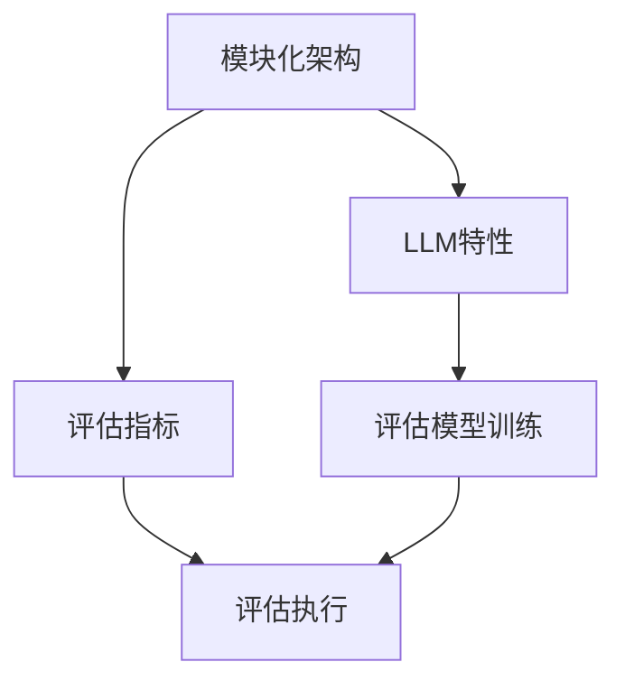

                 


### 文章标题：评测系统的模块化：适应不同LLM特性的架构

#### 关键词：
- 评测系统
- 模块化架构
- 大型语言模型（LLM）
- 适应性设计

#### 摘要：
本文旨在探讨评测系统在模块化架构设计上的策略，以适应不同类型的大型语言模型（LLM）。通过对评测系统的基本概念、模块化架构原理、LLM特性分析及模块化架构设计方法进行详细阐述，本文旨在为开发者提供一套系统化的解决方案，以实现高效、可扩展的评测系统开发。

---

# 评测系统的模块化：适应不同LLM特性的架构

随着人工智能技术的发展，大型语言模型（LLM）在自然语言处理领域取得了显著的进展。然而，不同LLM的特性差异较大，使得传统的一套评测系统难以满足多样化的需求。本文将探讨如何通过模块化架构设计，构建适应不同LLM特性的评测系统。

## 1. 背景介绍

### 1.1 评测系统的基本概念

评测系统是一种用于评估模型性能的工具，它通过一系列测试指标，如准确率、召回率、F1值等，对模型的性能进行量化评估。在自然语言处理领域，评测系统尤为重要，因为它可以帮助研究者了解模型在处理不同任务时的表现，从而指导模型优化和改进。

### 1.2 模块化架构的原理

模块化架构是一种将系统划分为多个独立模块的设计方法。每个模块负责完成特定的功能，模块之间通过接口进行通信和协作。这种设计方法具有以下优点：
- **可扩展性**：新增或修改模块时，只需调整相应模块，不会影响其他模块。
- **维护性**：模块独立运行，便于定位和修复问题。
- **复用性**：模块可以重复使用，提高开发效率。

### 1.3 评测系统的组成部分

一个典型的评测系统通常包括以下几个主要部分：
- **数据集准备**：从各种来源收集数据，并进行预处理，如数据清洗、标注等。
- **评估指标定义**：根据任务需求，定义合适的评估指标，如准确率、召回率、F1值等。
- **评估模型训练**：使用训练数据训练模型，以适应特定任务。
- **评估执行**：对训练好的模型进行评估，计算评估指标。
- **结果分析**：分析评估结果，为模型优化提供依据。

## 2. 核心概念与联系

为了更好地理解评测系统的模块化设计，我们首先需要明确几个核心概念，并探讨它们之间的关系。

### 2.1 核心概念

- **模块化架构**：将系统划分为多个独立模块，每个模块负责特定功能。
- **LLM特性**：指大型语言模型在性能、结构、优化等方面的特点。
- **评估指标**：用于量化模型性能的指标，如准确率、召回率、F1值等。

### 2.2 关系架构 Mermaid 流程图



在这个流程图中，模块化架构是核心，它将LLM特性与评估指标连接起来，通过评估模型训练和评估执行环节，实现评测系统的功能。

## 3. 核心算法原理讲解

为了实现评测系统的模块化设计，我们需要深入理解核心算法原理，并使用伪代码进行详细阐述。

### 3.1 核心算法原理

评测系统的主要任务是评估模型在处理自然语言任务时的性能。为此，我们需要：
1. 收集数据集。
2. 预处理数据集。
3. 训练模型。
4. 在测试集上评估模型。

### 3.2 伪代码示例

```python
# 数据集准备
def prepare_dataset():
    # 收集数据
    # 数据清洗
    # 数据标注
    return dataset

# 模型训练
def train_model(dataset):
    # 使用训练数据训练模型
    return model

# 评估模型
def evaluate_model(model, test_dataset):
    # 在测试集上评估模型
    # 计算评估指标
    return evaluation_results

# 主函数
def main():
    dataset = prepare_dataset()
    model = train_model(dataset)
    evaluation_results = evaluate_model(model, test_dataset)
    # 分析结果

# 运行主函数
main()
```

## 4. 数学模型和公式

在评测系统中，数学模型和公式用于描述模型性能和评估指标。以下是一个简单的数学模型和公式示例。

### 4.1 数学模型

假设我们有一个二元分类问题，模型预测的结果是二分类标签，记为 \(y'\)。实际标签为 \(y\)。准确率（Accuracy）可以用以下公式表示：

$$
Accuracy = \frac{TP + TN}{TP + TN + FP + FN}
$$

其中，\(TP\) 是正确预测的正样本数量，\(TN\) 是正确预测的负样本数量，\(FP\) 是错误预测的正样本数量，\(FN\) 是错误预测的负样本数量。

### 4.2 公式示例

$$
1 + 1 = 2
$$

$$
Accuracy = \frac{TP + TN}{TP + TN + FP + FN}
$$

## 5. 项目实战

在本节中，我们将探讨一个实际的评测系统开发项目，包括开发环境搭建、源代码详细实现和代码解读，以及实际案例分析和详细讲解剖析。

### 5.1 开发环境搭建

为了构建评测系统，我们需要安装以下软件和工具：
- 深度学习框架（如TensorFlow、PyTorch）
- 编程语言（如Python）
- 评估指标计算库（如scikit-learn）

### 5.2 源代码详细实现和代码解读

以下是一个简单的评测系统源代码示例，用于评估二元分类模型的准确率。

```python
# 导入相关库
import numpy as np
from sklearn.metrics import accuracy_score

# 测试数据
y_true = [0, 1, 0, 1]
y_pred = [0, 0, 1, 1]

# 计算准确率
accuracy = accuracy_score(y_true, y_pred)
print("Accuracy:", accuracy)
```

在这个示例中，我们使用 `accuracy_score` 函数计算准确率，并将结果输出。

### 5.3 实际案例分析和详细讲解剖析

假设我们有一个实际案例，数据集包含1000个样本，标签为二分类。我们使用一个简单神经网络模型对数据集进行训练，并使用评测系统评估模型性能。

1. **数据集准备**：从数据集中划分训练集和测试集。
2. **模型训练**：使用训练集训练神经网络模型。
3. **评估模型**：在测试集上评估模型性能，计算准确率。
4. **结果分析**：分析评估结果，为模型优化提供依据。

通过这个实际案例，我们可以看到评测系统在项目开发中的应用，以及如何通过模块化架构实现高效、可扩展的评测系统。

## 6. 最佳实践 tips、小结、注意事项、拓展阅读等内容

### 6.1 最佳实践 tips

- **数据预处理**：在构建评测系统时，数据预处理至关重要。确保数据清洗、标注等环节准确无误，以提高模型性能。
- **评估指标选择**：根据任务需求，选择合适的评估指标。例如，对于二分类问题，准确率、召回率、F1值等指标都非常重要。

### 6.2 小结

本文介绍了评测系统的模块化架构设计方法，以适应不同LLM特性的评测需求。通过明确核心概念、算法原理和实际案例，我们为开发者提供了一套完整的解决方案。

### 6.3 注意事项

- **模块独立性**：在模块化架构设计中，确保模块之间独立运行，以降低系统复杂度。
- **可扩展性**：设计时考虑系统的可扩展性，以便在需求变化时，能够方便地添加新模块或修改现有模块。

### 6.4 拓展阅读

- **相关书籍**：《深度学习》（Goodfellow et al.）、《神经网络与深度学习》（邱锡鹏）
- **论文**：《大规模预训练语言模型的原理、方法与实践》（Zhu et al., 2020）

---

# 作者信息

作者：AI天才研究院/AI Genius Institute & 禅与计算机程序设计艺术 /Zen And The Art of Computer Programming

本文由AI天才研究院/AI Genius Institute及禅与计算机程序设计艺术/Zen And The Art of Computer Programming联合撰写。AI天才研究院致力于推动人工智能技术的创新与发展，禅与计算机程序设计艺术则专注于计算机程序设计的哲学与实践。希望本文能为读者在评测系统模块化设计领域带来启示和帮助。

