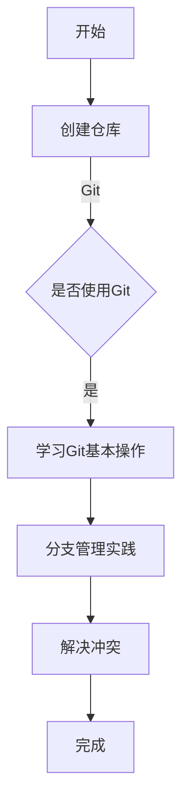

                 


## 文章标题

《评测系统的版本控制与迭代管理》

## 文章关键词

评测系统，版本控制，迭代管理，Git，敏捷开发，持续集成，持续部署，代码质量保障，单元测试，集成测试，代码审查，最佳实践

## 文章摘要

随着技术的快速发展和软件项目的复杂性增加，评测系统的版本控制与迭代管理变得尤为重要。本文将深入探讨评测系统版本控制的基本概念、版本控制系统Git的使用方法，以及迭代管理的挑战与解决方案。同时，本文还将介绍代码质量保障的关键方法，包括单元测试、集成测试和代码审查，并详细讲解持续集成与持续部署的实施策略。通过一系列最佳实践，本文旨在为开发者提供一套完整的评测系统版本控制与迭代管理指南。

## 第1章 引言

### 1.1 版本控制的重要性

版本控制是软件开发过程中的基石，它确保了代码的完整性和可追溯性。在评测系统中，版本控制尤为重要，因为它直接关系到评测结果的一致性和准确性。通过版本控制，开发者可以跟踪代码的历史变化，快速定位和修复bug，以及有效地管理功能迭代。以下是版本控制的重要性体现在以下几个方面：

1. **代码变更管理**：版本控制系统如Git可以记录每次代码变更的历史，包括谁在何时进行了哪些更改。这有助于避免因忘记之前的修改而导致代码错误。
2. **团队协作**：版本控制系统能够支持多人协作，确保团队成员之间的工作不会互相冲突，并能够有效地合并代码。
3. **回滚能力**：在任何版本发生问题时，版本控制系统可以快速回滚到之前的稳定版本，减少故障带来的影响。
4. **历史追溯**：版本控制系统提供了对代码变更的详细记录，有助于追溯问题根源，提高开发效率。

### 1.2 版本控制的基本概念

版本控制涉及几个基本概念，包括提交（commit）、分支（branch）、标签（tag）和合并（merge）：

- **提交**：每次代码变更被存储到版本控制系统时，都会生成一个提交。提交包含作者信息、变更内容和变更说明。
- **分支**：分支是版本控制系统的独立线，它允许开发者在不影响主分支的情况下进行实验性开发。完成实验后，可以通过合并将分支的变更合并到主分支。
- **标签**：标签用于标记重要的里程碑或版本，例如发布版本。标签通常包含版本号和相关描述信息。
- **合并**：合并是将两个或多个分支的变更合并到一个分支上的过程。合并可能会引起冲突，需要手动解决。

### 1.3 版本迭代管理的挑战

版本迭代管理是软件开发过程中的关键环节，它面临诸多挑战：

1. **协调与协作**：在多人协作开发中，如何确保各团队的工作协调一致，避免冲突和重复工作，是一个重要挑战。
2. **风险管理**：版本迭代过程中，如何有效管理风险，确保代码质量和系统稳定性，是一个关键问题。
3. **变更控制**：如何在大量代码变更中快速定位问题，进行有效的变更控制，是一个复杂的过程。
4. **迭代周期**：如何在限定的时间内完成功能迭代，并在每次迭代中保持代码质量，是一个持续挑战。

## 第2章 版本控制系统

### 2.1 Git简介

Git是目前最流行的分布式版本控制系统，由Linus Torvalds创建，主要用于软件开发中的版本控制。Git具有以下特点：

1. **分布式**：Git是一个分布式版本控制系统，每个开发者的本地计算机上都存储了一份完整的代码库，这使得开发者可以离线工作，并快速进行代码提交和更新。
2. **快速**：Git的内部设计使得它在处理大量文件和目录时非常快速，非常适合大型项目。
3. **灵活**：Git提供了丰富的命令集，允许开发者进行各种复杂的版本控制和协作操作。
4. **高效**：Git使用了高效的算法和数据结构，如哈希树和Delta压缩，确保了高效的存储和数据处理。

### 2.2 Git的工作流程

Git的工作流程主要包括以下几个步骤：

#### 2.2.1 创建仓库

创建Git仓库是开始版本控制的第一个步骤。可以通过以下命令创建一个本地仓库：

```bash
git init
```

或者将远程仓库克隆到本地：

```bash
git clone [remote-url]
```

#### 2.2.2 提交变更

开发者对代码进行修改后，需要将变更提交到仓库。首先，使用`git add`命令将修改的文件添加到暂存区：

```bash
git add <file>
```

然后，使用`git commit`命令将暂存区的变更提交到本地仓库：

```bash
git commit -m "Commit message"
```

#### 2.2.3 分支管理

分支是Git的核心概念之一。开发者可以通过创建分支进行实验性开发，确保主分支的稳定性。创建新分支的命令如下：

```bash
git branch <branch-name>
```

切换到新分支的命令是：

```bash
git checkout <branch-name>
```

完成开发后，可以使用以下命令将分支合并到主分支：

```bash
git merge <branch-name>
```

#### 2.2.4 冲突解决

在合并分支时，如果两个分支对同一部分的代码进行了不同的修改，Git会产生冲突。此时，开发者需要手动解决冲突，然后使用以下命令提交解决后的代码：

```bash
git add <file>
git commit -m "Resolved merge conflicts"
```

### 2.3 Git的高级特性

除了基本操作，Git还提供了许多高级特性，如：

- ** stash**：用于暂存当前工作区的内容，以便后续恢复。
- **rebase**：用于将本地分支的变更应用到另一个分支，保持提交历史的线性。
- **Git Hooks**：用于在Git操作的特定阶段执行自定义脚本，如代码审查、自动化测试等。

### 2.4 选择合适的版本控制系统

虽然Git是最流行的版本控制系统，但并不是所有项目都适合使用Git。在选择版本控制系统时，应考虑以下因素：

- **项目规模**：大型项目通常更适合使用Git，因为它的分布式特性可以更好地支持多人协作。
- **团队协作模式**：如果团队需要更严格的权限管理和复杂的变更流程，可以考虑使用集中式版本控制系统，如Subversion。
- **系统兼容性**：某些项目可能需要与其他工具或系统集成，选择兼容性更好的版本控制系统很重要。

## 第3章 版本迭代方法

### 3.1 常见的迭代模型

在软件开发中，迭代模型用于指导开发过程，常见的迭代模型包括瀑布模型、敏捷开发、持续集成与持续部署。

#### 3.1.1 瀑布模型

瀑布模型是一种传统的迭代模型，将软件开发过程分为若干阶段，每个阶段必须在完成后才能进入下一个阶段。瀑布模型的主要特点如下：

- **顺序执行**：开发过程按照固定的顺序进行，如需求分析、设计、编码、测试和部署。
- **文档驱动**：每个阶段都有相应的文档，文档的完备性是项目进展的重要指标。
- **阶段评审**：在每个阶段结束时，进行评审以确保阶段目标达成。

瀑布模型适合需求明确且稳定的项目，但缺点是灵活性差，难以适应需求变更。

#### 3.1.2 敏捷开发

敏捷开发是一种基于迭代和增量的开发方法，强调快速迭代和持续交付价值。敏捷开发的主要特点如下：

- **迭代周期**：敏捷开发将开发过程划分为短期迭代（通常为2-4周），在每个迭代中交付可用的产品增量。
- **用户故事**：用户故事是敏捷开发的核心，描述了用户的需求和功能。
- **持续集成**：敏捷开发强调持续集成，确保每次迭代完成后都能运行和测试。

敏捷开发适合需求变化频繁的项目，但需要团队成员具备较高的协作能力和灵活性。

#### 3.1.3 持续集成与持续部署

持续集成（CI）和持续部署（CD）是现代软件开发中的关键实践，它们通过自动化工具确保代码质量和快速交付。

- **持续集成**：持续集成是一种软件开发实践，通过自动化构建和测试确保每次提交的代码质量。持续集成的主要步骤包括：

  - **构建**：构建工具（如Maven、Gradle）自动编译代码并打包。
  - **测试**：自动化测试工具运行单元测试、集成测试等，确保代码功能正确。

- **持续部署**：持续部署是将代码从开发环境部署到生产环境的过程。持续部署的主要步骤包括：

  - **部署前检查**：在部署前执行静态代码分析、依赖检查等。
  - **部署**：部署工具（如Jenkins、Docker）将代码部署到目标环境。
  - **部署监控**：监控系统（如Prometheus、Grafana）监控部署后的系统状态。

持续集成与持续部署提高了开发效率和代码质量，但需要一定的基础设施和自动化工具支持。

### 3.2 选择合适的迭代模型

选择合适的迭代模型取决于项目的需求、团队规模和技术栈。以下是几种常见情况下的迭代模型选择建议：

- **需求明确且稳定**：选择瀑布模型，确保项目按计划顺利进行。
- **需求变化频繁**：选择敏捷开发，快速响应市场需求。
- **注重代码质量和快速交付**：结合持续集成与持续部署，提高开发效率和质量。

## 第4章 代码质量保障

### 4.1 单元测试

单元测试是代码质量保障的关键环节，它通过验证单个模块的功能是否正确来实现。以下是单元测试的关键概念和最佳实践：

#### 4.1.1 单元测试的基本概念

- **单元测试**：单元测试是针对软件中的最小可测试单元（通常是函数或方法）进行的测试。
- **测试用例**：测试用例是测试过程中的一条记录，描述了输入数据、预期输出和测试步骤。
- **覆盖率**：测试覆盖率是测试用例覆盖代码的比例，用于评估测试的全面性。

#### 4.1.2 单元测试框架

- **JUnit**：JUnit是最流行的Java单元测试框架，提供了丰富的测试功能和注释。
- **NUnit**：NUnit是.NET平台上的单元测试框架，与JUnit类似，提供了类似的测试功能。

#### 4.1.3 单元测试的最佳实践

- **编写简洁的测试用例**：每个测试用例应该只测试一个功能点，确保测试的逻辑清晰。
- **避免测试逻辑过于复杂**：测试用例应该尽量简单，避免包含过多的逻辑判断。
- **确保测试用例覆盖边界条件**：边界条件是代码中可能导致错误的输入值，应确保测试用例覆盖这些边界条件。
- **自动化运行测试**：将测试用例自动化，确保每次代码变更后都能自动运行测试，快速发现问题。

### 4.2 集成测试

集成测试是验证不同模块或组件之间交互的正确性的测试，它是单元测试的补充。以下是集成测试的关键概念和最佳实践：

#### 4.2.1 集成测试的重要性

- **发现模块间的错误**：集成测试可以发现单元测试无法检测到的模块间交互错误。
- **验证系统功能**：集成测试验证了系统的整体功能是否符合预期。
- **降低风险**：通过集成测试，可以提前发现和修复潜在的问题，降低项目风险。

#### 4.2.2 集成测试的策略

- **分层集成**：将系统分层，逐层进行集成测试，确保每层模块的正确性。
- **灰盒测试**：灰盒测试结合了黑盒测试和单元测试的优点，部分了解内部实现逻辑。
- **冒烟测试**：冒烟测试是初步验证系统是否基本可用的测试，通常在每次部署前进行。

#### 4.2.3 集成测试工具

- **Selenium**：Selenium是Web应用自动化测试工具，可用于进行集成测试。
- **JUnit**：JUnit提供了集成测试框架，支持在JUnit测试用例中运行集成测试。

### 4.3 代码审查

代码审查是代码质量保障的重要环节，通过同行评审来发现代码中的潜在问题。以下是代码审查的关键概念和最佳实践：

#### 4.3.1 代码审查的方法

- **同行评审**：同行评审是团队中的其他成员对代码进行审查，发现潜在问题。
- **拉取请求（Pull Request）**：在Git中，拉取请求是一种代码审查的工具，通过创建分支并合并代码到主分支，进行审查。
- **代码检查工具**：代码检查工具（如SonarQube、FindBugs）可以自动分析代码，发现潜在问题。

#### 4.3.2 代码审查的最佳实践

- **编写清晰的代码注释**：清晰的代码注释有助于其他开发者理解代码逻辑。
- **遵循编码规范**：遵循统一的编码规范，确保代码的可读性和可维护性。
- **避免复杂的逻辑**：复杂的代码逻辑难以理解和维护，应尽量简化逻辑。
- **定期进行代码审查**：定期进行代码审查，确保代码质量。

### 4.4 代码质量保障的最佳实践

- **代码质量标准**：制定代码质量标准，如代码风格、性能要求和安全性。
- **持续集成与持续部署**：结合持续集成与持续部署，确保代码质量。
- **自动化测试**：自动化运行单元测试、集成测试和代码审查，确保每次代码变更都能快速发现问题。

## 第5章 持续集成

### 5.1 持续集成的基本概念

持续集成（CI）是一种软件开发实践，通过自动化构建、测试和部署过程来确保代码质量。以下是持续集成的基本概念：

- **自动化构建**：使用构建工具（如Maven、Gradle）自动编译代码并打包。
- **自动化测试**：使用自动化测试工具运行单元测试、集成测试等，确保代码功能正确。
- **部署**：将通过测试的代码部署到测试环境或生产环境。

### 5.2 持续集成的实践

实现持续集成需要以下步骤：

#### 5.2.1 构建流程

- **源代码管理**：将代码存储在版本控制系统（如Git）中。
- **构建脚本**：编写构建脚本，用于编译代码、执行测试和生成报告。

#### 5.2.2 测试流程

- **测试脚本**：编写测试脚本，用于自动化运行单元测试、集成测试等。
- **测试报告**：生成测试报告，显示测试结果和覆盖率。

#### 5.2.3 部署流程

- **部署脚本**：编写部署脚本，用于将代码部署到测试环境或生产环境。
- **部署策略**：制定部署策略，如蓝绿部署、滚动部署等。

### 5.3 持续集成的工具

实现持续集成需要使用以下工具：

- **构建工具**：如Maven、Gradle等。
- **自动化测试工具**：如JUnit、Selenium等。
- **持续集成服务器**：如Jenkins、Travis CI等。

### 5.4 持续集成的优势

持续集成的优势包括：

- **提高代码质量**：通过自动化测试和快速反馈，确保代码质量。
- **减少发布风险**：通过频繁的构建和测试，降低发布时的风险。
- **加速迭代速度**：通过自动化流程，提高开发效率。

## 第6章 持续部署

### 6.1 持续部署的基本概念

持续部署（CD）是一种软件开发实践，通过自动化部署过程来确保代码的快速、可靠地交付。以下是持续部署的基本概念：

- **部署流程**：部署流程包括构建、测试、部署和监控等步骤。
- **部署策略**：部署策略包括蓝绿部署、滚动部署等，用于控制部署过程。

### 6.2 持续部署的实践

实现持续部署需要以下步骤：

#### 6.2.1 部署策略

- **蓝绿部署**：同时运行两个相同的环境（蓝环境和绿环境），将新版本部署到其中一个环境，然后切换流量。
- **滚动部署**：逐步将新版本部署到多个节点，确保系统的稳定性。

#### 6.2.2 部署流程

- **构建**：构建代码并生成可执行文件。
- **测试**：运行自动化测试确保代码质量。
- **部署**：将代码部署到目标环境，如生产环境。
- **监控**：监控部署后的系统状态，确保系统稳定运行。

### 6.3 持续部署的工具

实现持续部署需要使用以下工具：

- **构建工具**：如Maven、Gradle等。
- **自动化测试工具**：如JUnit、Selenium等。
- **部署工具**：如Jenkins、Docker等。

### 6.4 持续部署的优势

持续部署的优势包括：

- **提高部署效率**：通过自动化部署，提高部署速度和效率。
- **降低部署风险**：通过测试和监控，降低部署过程中的风险。
- **持续优化**：通过反馈和优化，持续改进部署过程。

## 第7章 版本控制和迭代管理的最佳实践

### 7.1 版本控制的最佳实践

以下是版本控制的最佳实践：

- **定期备份**：定期备份仓库，防止数据丢失。
- **合理命名**：为提交、分支和标签使用有意义且易于理解的名称。
- **详细日志**：为每个提交添加详细的变更说明，方便追溯历史。
- **分支策略**：采用合适的分支策略，如Git Flow、GitLab Flow等，确保分支的清晰和有序。
- **权限管理**：合理分配权限，确保代码安全。

### 7.2 迭代管理的最佳实践

以下是迭代管理的最佳实践：

- **需求管理**：明确需求，确保需求清晰、可行和可测试。
- **迭代计划**：制定合理的迭代计划，确保每个迭代都能交付有价值的成果。
- **团队协作**：加强团队协作，确保团队成员之间的工作协调一致。
- **测试驱动**：以测试驱动开发，确保每次迭代都能通过自动化测试。
- **反馈与优化**：收集用户反馈，持续优化迭代过程。

### 7.3 版本控制和迭代管理的协同

版本控制和迭代管理是软件开发过程中的两个关键环节，它们之间具有紧密的协同关系：

- **版本控制为迭代管理提供支持**：版本控制系统为迭代管理提供了代码管理、变更追踪和协作支持。
- **迭代管理促进版本控制**：迭代管理通过规划、测试和部署等过程，推动了版本控制的实践，确保了代码的稳定性和可靠性。
- **协同优化**：通过协同优化版本控制和迭代管理，可以提高开发效率、代码质量和用户满意度。

## 附录

### A.1 版本控制系统使用技巧

以下是版本控制系统的一些使用技巧：

- **使用分支进行实验性开发**：在实验性开发中，使用分支可以避免影响主分支的稳定性。
- **合理使用标签**：为重要的里程碑或版本使用标签，方便后续的回滚和追踪。
- **定期备份仓库**：定期备份仓库，防止数据丢失。
- **避免长时间未合并的分支**：长时间未合并的分支可能导致代码冲突和问题积累，应及时合并或删除。

### A.2 迭代管理工具介绍

以下是几种常见的迭代管理工具：

- **JIRA**：JIRA是一款功能强大的迭代管理工具，提供任务跟踪、需求管理和敏捷开发等功能。
- **Trello**：Trello是一款基于看板模型的迭代管理工具，简单直观，适合小型团队使用。
- **Asana**：Asana是一款功能全面的迭代管理工具，提供任务管理、进度追踪和协作功能。

### 附录：Mermaid 流程图

以下是一个Mermaid流程图的示例：



### 附录：伪代码示例

以下是一个伪代码示例：

```python
// 单元测试伪代码
function testFunction() {
    // 初始化测试环境
    setup();

    // 执行测试用例
    result = functionToTest();

    // 验证测试结果
    if (expectedResult != result) {
        fail("测试失败");
    }

    // 清理测试环境
    teardown();
}
```

### 附录：数学模型讲解与示例

以下是一个数学模型讲解与示例：

$$
f(x) = \frac{1}{1 + e^{-x}}
$$

函数 $f(x)$ 是一个Sigmoid函数，其用于将输入 $x$ 映射到 $(0, 1)$ 区间，常用于神经网络中的激活函数。

### 附录：代码实战案例

以下是一个持续集成工具 - Jenkins 的实战案例：

```python
# 安装Jenkins
pip install jenkins

# 配置Jenkins
# 1. 创建Jenkins任务
# 2. 配置源代码仓库
# 3. 添加构建触发器
# 4. 配置构建步骤
# 5. 配置测试步骤
# 6. 配置部署步骤

# 部署到生产环境
# 1. 部署前检查
# 2. 部署
# 3. 部署后检查
```

### 附录：代码解读与分析

以下是一个代码解读与分析的示例：

```python
# 代码片段
def calculate_score(test_cases):
    total_score = 0
    for case in test_cases:
        if case['expected'] == case['actual']:
            total_score += 1
    return total_score / len(test_cases)

# 解读
# 1. 定义函数 calculate_score，接收测试用例列表作为输入参数
# 2. 初始化 total_score 为0
# 3. 遍历每个测试用例
# 4. 如果测试用例的实际结果与预期结果一致，则增加 total_score
# 5. 计算测试用例的准确率，并返回
```

## 总结

本文详细介绍了评测系统的版本控制与迭代管理，包括版本控制的基本概念、Git的使用方法，以及迭代管理的挑战与解决方案。同时，本文还介绍了代码质量保障的关键方法，如单元测试、集成测试和代码审查。通过持续集成与持续部署，我们可以实现高效的代码迭代和部署。最佳实践为我们提供了实际操作的指南。希望本文能帮助开发者更好地理解和实践评测系统的版本控制和迭代管理。作者：AI天才研究院/AI Genius Institute & 禅与计算机程序设计艺术 /Zen And The Art of Computer Programming。|>
## 第1章 引言

### 1.1 版本控制的重要性

版本控制是软件开发过程中的基石，它确保了代码的完整性和可追溯性。在评测系统中，版本控制尤为重要，因为它直接关系到评测结果的一致性和准确性。随着软件项目的规模和复杂性的增加，版本控制的重要性愈发显著。以下是版本控制的重要性体现在以下几个方面：

1. **代码变更管理**：版本控制系统如Git可以记录每次代码变更的历史，包括谁在何时进行了哪些更改。这有助于避免因忘记之前的修改而导致代码错误。
2. **团队协作**：版本控制系统能够支持多人协作，确保团队成员之间的工作不会互相冲突，并能够有效地合并代码。
3. **回滚能力**：在任何版本发生问题时，版本控制系统可以快速回滚到之前的稳定版本，减少故障带来的影响。
4. **历史追溯**：版本控制系统提供了对代码变更的详细记录，有助于追溯问题根源，提高开发效率。

### 1.2 版本控制的基本概念

版本控制涉及几个基本概念，包括提交（commit）、分支（branch）、标签（tag）和合并（merge）：

- **提交**：每次代码变更被存储到版本控制系统时，都会生成一个提交。提交包含作者信息、变更内容和变更说明。
- **分支**：分支是版本控制系统的独立线，它允许开发者在不影响主分支的情况下进行实验性开发。完成实验后，可以通过合并将分支的变更合并到主分支。
- **标签**：标签用于标记重要的里程碑或版本，例如发布版本。标签通常包含版本号和相关描述信息。
- **合并**：合并是将两个或多个分支的变更合并到一个分支上的过程。合并可能会引起冲突，需要手动解决。

### 1.3 版本迭代管理的挑战

版本迭代管理是软件开发过程中的关键环节，它面临诸多挑战：

1. **协调与协作**：在多人协作开发中，如何确保各团队的工作协调一致，避免冲突和重复工作，是一个重要挑战。
2. **风险管理**：版本迭代过程中，如何有效管理风险，确保代码质量和系统稳定性，是一个关键问题。
3. **变更控制**：如何在大量代码变更中快速定位问题，进行有效的变更控制，是一个复杂的过程。
4. **迭代周期**：如何在限定的时间内完成功能迭代，并在每次迭代中保持代码质量，是一个持续挑战。

## 第2章 版本控制系统

### 2.1 Git简介

Git是目前最流行的分布式版本控制系统，由Linus Torvalds创建，主要用于软件开发中的版本控制。Git具有以下特点：

1. **分布式**：Git是一个分布式版本控制系统，每个开发者的本地计算机上都存储了一份完整的代码库，这使得开发者可以离线工作，并快速进行代码提交和更新。
2. **快速**：Git的内部设计使得它在处理大量文件和目录时非常快速，非常适合大型项目。
3. **灵活**：Git提供了丰富的命令集，允许开发者进行各种复杂的版本控制和协作操作。
4. **高效**：Git使用了高效的算法和数据结构，如哈希树和Delta压缩，确保了高效的存储和数据处理。

### 2.2 Git的工作流程

Git的工作流程主要包括以下几个步骤：

#### 2.2.1 创建仓库

创建Git仓库是开始版本控制的第一个步骤。可以通过以下命令创建一个本地仓库：

```bash
git init
```

或者将远程仓库克隆到本地：

```bash
git clone [remote-url]
```

#### 2.2.2 提交变更

开发者对代码进行修改后，需要将变更提交到仓库。首先，使用`git add`命令将修改的文件添加到暂存区：

```bash
git add <file>
```

然后，使用`git commit`命令将暂存区的变更提交到本地仓库：

```bash
git commit -m "Commit message"
```

#### 2.2.3 分支管理

分支是Git的核心概念之一。开发者可以通过创建分支进行实验性开发，确保主分支的稳定性。创建新分支的命令如下：

```bash
git branch <branch-name>
```

切换到新分支的命令是：

```bash
git checkout <branch-name>
```

完成开发后，可以使用以下命令将分支合并到主分支：

```bash
git merge <branch-name>
```

#### 2.2.4 冲突解决

在合并分支时，如果两个分支对同一部分的代码进行了不同的修改，Git会产生冲突。此时，开发者需要手动解决冲突，然后使用以下命令提交解决后的代码：

```bash
git add <file>
git commit -m "Resolved merge conflicts"
```

### 2.3 Git的高级特性

除了基本操作，Git还提供了许多高级特性，如：

- **stash**：用于暂存当前工作区的内容，以便后续恢复。
- **rebase**：用于将本地分支的变更应用到另一个分支，保持提交历史的线性。
- **Git Hooks**：用于在Git操作的特定阶段执行自定义脚本，如代码审查、自动化测试等。

### 2.4 选择合适的版本控制系统

虽然Git是最流行的版本控制系统，但并不是所有项目都适合使用Git。在选择版本控制系统时，应考虑以下因素：

- **项目规模**：大型项目通常更适合使用Git，因为它的分布式特性可以更好地支持多人协作。
- **团队协作模式**：如果团队需要更严格的权限管理和复杂的变更流程，可以考虑使用集中式版本控制系统，如Subversion。
- **系统兼容性**：某些项目可能需要与其他工具或系统集成，选择兼容性更好的版本控制系统很重要。

## 第3章 版本迭代方法

### 3.1 常见的迭代模型

在软件开发中，迭代模型用于指导开发过程，常见的迭代模型包括瀑布模型、敏捷开发、持续集成与持续部署。

#### 3.1.1 瀑布模型

瀑布模型是一种传统的迭代模型，将软件开发过程分为若干阶段，每个阶段必须在完成后才能进入下一个阶段。瀑布模型的主要特点如下：

- **顺序执行**：开发过程按照固定的顺序进行，如需求分析、设计、编码、测试和部署。
- **文档驱动**：每个阶段都有相应的文档，文档的完备性是项目进展的重要指标。
- **阶段评审**：在每个阶段结束时，进行评审以确保阶段目标达成。

瀑布模型适合需求明确且稳定的项目，但缺点是灵活性差，难以适应需求变更。

#### 3.1.2 敏捷开发

敏捷开发是一种基于迭代和增量的开发方法，强调快速迭代和持续交付价值。敏捷开发的主要特点如下：

- **迭代周期**：敏捷开发将开发过程划分为短期迭代（通常为2-4周），在每个迭代中交付可用的产品增量。
- **用户故事**：用户故事是敏捷开发的核心，描述了用户的需求和功能。
- **持续集成**：敏捷开发强调持续集成，确保每次迭代完成后都能运行和测试。

敏捷开发适合需求变化频繁的项目，但需要团队成员具备较高的协作能力和灵活性。

#### 3.1.3 持续集成与持续部署

持续集成（CI）和持续部署（CD）是现代软件开发中的关键实践，它们通过自动化工具确保代码质量和快速交付。

- **持续集成**：持续集成是一种软件开发实践，通过自动化构建和测试确保每次提交的代码质量。持续集成的主要步骤包括：

  - **构建**：构建工具（如Maven、Gradle）自动编译代码并打包。
  - **测试**：自动化测试工具运行单元测试、集成测试等，确保代码功能正确。

- **持续部署**：持续部署是将代码从开发环境部署到生产环境的过程。持续部署的主要步骤包括：

  - **部署前检查**：在部署前执行静态代码分析、依赖检查等。
  - **部署**：部署工具（如Jenkins、Docker）将代码部署到目标环境。
  - **部署监控**：监控系统（如Prometheus、Grafana）监控部署后的系统状态。

持续集成与持续部署提高了开发效率和代码质量，但需要一定的基础设施和自动化工具支持。

### 3.2 选择合适的迭代模型

选择合适的迭代模型取决于项目的需求、团队规模和技术栈。以下是几种常见情况下的迭代模型选择建议：

- **需求明确且稳定**：选择瀑布模型，确保项目按计划顺利进行。
- **需求变化频繁**：选择敏捷开发，快速响应市场需求。
- **注重代码质量和快速交付**：结合持续集成与持续部署，提高开发效率和质量。

## 第4章 代码质量保障

### 4.1 单元测试

单元测试是代码质量保障的关键环节，它通过验证单个模块的功能是否正确来实现。以下是单元测试的关键概念和最佳实践：

#### 4.1.1 单元测试的基本概念

- **单元测试**：单元测试是针对软件中的最小可测试单元（通常是函数或方法）进行的测试。
- **测试用例**：测试用例是测试过程中的一条记录，描述了输入数据、预期输出和测试步骤。
- **覆盖率**：测试覆盖率是测试用例覆盖代码的比例，用于评估测试的全面性。

#### 4.1.2 单元测试框架

- **JUnit**：JUnit是最流行的Java单元测试框架，提供了丰富的测试功能和注释。
- **NUnit**：NUnit是.NET平台上的单元测试框架，与JUnit类似，提供了类似的测试功能。

#### 4.1.3 单元测试的最佳实践

- **编写简洁的测试用例**：每个测试用例应该只测试一个功能点，确保测试的逻辑清晰。
- **避免测试逻辑过于复杂**：测试用例应该尽量简单，避免包含过多的逻辑判断。
- **确保测试用例覆盖边界条件**：边界条件是代码中可能导致错误的输入值，应确保测试用例覆盖这些边界条件。
- **自动化运行测试**：将测试用例自动化，确保每次代码变更后都能自动运行测试，快速发现问题。

### 4.2 集成测试

集成测试是验证不同模块或组件之间交互的正确性的测试，它是单元测试的补充。以下是集成测试的关键概念和最佳实践：

#### 4.2.1 集成测试的重要性

- **发现模块间的错误**：集成测试可以发现单元测试无法检测到的模块间交互错误。
- **验证系统功能**：集成测试验证了系统的整体功能是否符合预期。
- **降低风险**：通过集成测试，可以提前发现和修复潜在的问题，降低项目风险。

#### 4.2.2 集成测试的策略

- **分层集成**：将系统分层，逐层进行集成测试，确保每层模块的正确性。
- **灰盒测试**：灰盒测试结合了黑盒测试和单元测试的优点，部分了解内部实现逻辑。
- **冒烟测试**：冒烟测试是初步验证系统是否基本可用的测试，通常在每次部署前进行。

#### 4.2.3 集成测试工具

- **Selenium**：Selenium是Web应用自动化测试工具，可用于进行集成测试。
- **JUnit**：JUnit提供了集成测试框架，支持在JUnit测试用例中运行集成测试。

### 4.3 代码审查

代码审查是代码质量保障的重要环节，通过同行评审来发现代码中的潜在问题。以下是代码审查的关键概念和最佳实践：

#### 4.3.1 代码审查的方法

- **同行评审**：同行评审是团队中的其他成员对代码进行审查，发现潜在问题。
- **拉拉请求（Pull Request）**：在Git中，拉拉请求是一种代码审查的工具，通过创建分支并合并代码到主分支，进行审查。
- **代码检查工具**：代码检查工具（如SonarQube、FindBugs）可以自动分析代码，发现潜在问题。

#### 4.3.2 代码审查的最佳实践

- **编写清晰的代码注释**：清晰的代码注释有助于其他开发者理解代码逻辑。
- **遵循编码规范**：遵循统一的编码规范，确保代码的可读性和可维护性。
- **避免复杂的逻辑**：复杂的代码逻辑难以理解和维护，应尽量简化逻辑。
- **定期进行代码审查**：定期进行代码审查，确保代码质量。

### 4.4 代码质量保障的最佳实践

- **代码质量标准**：制定代码质量标准，如代码风格、性能要求和安全性。
- **持续集成与持续部署**：结合持续集成与持续部署，确保代码质量。
- **自动化测试**：自动化运行单元测试、集成测试和代码审查，确保每次代码变更都能快速发现问题。

## 第5章 持续集成

### 5.1 持续集成的基本概念

持续集成（CI）是一种软件开发实践，通过自动化构建、测试和部署过程来确保代码质量。以下是持续集成的基本概念：

- **自动化构建**：使用构建工具（如Maven、Gradle）自动编译代码并打包。
- **自动化测试**：使用自动化测试工具运行单元测试、集成测试等，确保代码功能正确。
- **部署**：将通过测试的代码部署到测试环境或生产环境。

### 5.2 持续集成的实践

实现持续集成需要以下步骤：

#### 5.2.1 构建流程

- **源代码管理**：将代码存储在版本控制系统（如Git）中。
- **构建脚本**：编写构建脚本，用于编译代码、执行测试和生成报告。

#### 5.2.2 测试流程

- **测试脚本**：编写测试脚本，用于自动化运行单元测试、集成测试等。
- **测试报告**：生成测试报告，显示测试结果和覆盖率。

#### 5.2.3 部署流程

- **部署脚本**：编写部署脚本，用于将代码部署到测试环境或生产环境。
- **部署策略**：制定部署策略，如蓝绿部署、滚动部署等，用于控制部署过程。

### 5.3 持续集成的工具

实现持续集成需要使用以下工具：

- **构建工具**：如Maven、Gradle等。
- **自动化测试工具**：如JUnit、Selenium等。
- **持续集成服务器**：如Jenkins、Travis CI等。

### 5.4 持续集成的优势

持续集成的优势包括：

- **提高代码质量**：通过自动化测试和快速反馈，确保代码质量。
- **减少发布风险**：通过频繁的构建和测试，降低发布时的风险。
- **加速迭代速度**：通过自动化流程，提高开发效率。

## 第6章 持续部署

### 6.1 持续部署的基本概念

持续部署（CD）是一种软件开发实践，通过自动化部署过程来确保代码的快速、可靠地交付。以下是持续部署的基本概念：

- **部署流程**：部署流程包括构建、测试、部署和监控等步骤。
- **部署策略**：部署策略包括蓝绿部署、滚动部署等，用于控制部署过程。

### 6.2 持续部署的实践

实现持续部署需要以下步骤：

#### 6.2.1 部署策略

- **蓝绿部署**：同时运行两个相同的环境（蓝环境和绿环境），将新版本部署到其中一个环境，然后切换流量。
- **滚动部署**：逐步将新版本部署到多个节点，确保系统的稳定性。

#### 6.2.2 部署流程

- **构建**：构建代码并生成可执行文件。
- **测试**：运行自动化测试确保代码质量。
- **部署**：将代码部署到目标环境，如生产环境。
- **监控**：监控部署后的系统状态，确保系统稳定运行。

### 6.3 持续部署的工具

实现持续部署需要使用以下工具：

- **构建工具**：如Maven、Gradle等。
- **自动化测试工具**：如JUnit、Selenium等。
- **部署工具**：如Jenkins、Docker等。

### 6.4 持续部署的优势

持续部署的优势包括：

- **提高部署效率**：通过自动化部署，提高部署速度和效率。
- **降低部署风险**：通过测试和监控，降低部署过程中的风险。
- **持续优化**：通过反馈和优化，持续改进部署过程。

## 第7章 版本控制和迭代管理的最佳实践

### 7.1 版本控制的最佳实践

以下是版本控制的最佳实践：

- **定期备份**：定期备份仓库，防止数据丢失。
- **合理命名**：为提交、分支和标签使用有意义且易于理解的名称。
- **详细日志**：为每个提交添加详细的变更说明，方便追溯历史。
- **分支策略**：采用合适的分支策略，如Git Flow、GitLab Flow等，确保分支的清晰和有序。
- **权限管理**：合理分配权限，确保代码安全。

### 7.2 迭代管理的最佳实践

以下是迭代管理的最佳实践：

- **需求管理**：明确需求，确保需求清晰、可行和可测试。
- **迭代计划**：制定合理的迭代计划，确保每个迭代都能交付有价值的成果。
- **团队协作**：加强团队协作，确保团队成员之间的工作协调一致。
- **测试驱动**：以测试驱动开发，确保每次迭代都能通过自动化测试。
- **反馈与优化**：收集用户反馈，持续优化迭代过程。

### 7.3 版本控制和迭代管理的协同

版本控制和迭代管理是软件开发过程中的两个关键环节，它们之间具有紧密的协同关系：

- **版本控制为迭代管理提供支持**：版本控制系统为迭代管理提供了代码管理、变更追踪和协作支持。
- **迭代管理促进版本控制**：迭代管理通过规划、测试和部署等过程，推动了版本控制的实践，确保了代码的稳定性和可靠性。
- **协同优化**：通过协同优化版本控制和迭代管理，可以提高开发效率、代码质量和用户满意度。

## 附录

### A.1 版本控制系统使用技巧

以下是版本控制系统的一些使用技巧：

- **使用分支进行实验性开发**：在实验性开发中，使用分支可以避免影响主分支的稳定性。
- **合理使用标签**：为重要的里程碑或版本使用标签，方便后续的回滚和追踪。
- **定期备份仓库**：定期备份仓库，防止数据丢失。
- **避免长时间未合并的分支**：长时间未合并的分支可能导致代码冲突和问题积累，应及时合并或删除。

### A.2 迭代管理工具介绍

以下是几种常见的迭代管理工具：

- **JIRA**：JIRA是一款功能强大的迭代管理工具，提供任务跟踪、需求管理和敏捷开发等功能。
- **Trello**：Trello是一款基于看板模型的迭代管理工具，简单直观，适合小型团队使用。
- **Asana**：Asana是一款功能全面的迭代管理工具，提供任务管理、进度追踪和协作功能。

### 附录：Mermaid 流程图

以下是一个Mermaid流程图的示例：


### 附录：伪代码示例

以下是一个伪代码示例：

```python
// 单元测试伪代码
function testFunction() {
    // 初始化测试环境
    setup();

    // 执行测试用例
    result = functionToTest();

    // 验证测试结果
    if (expectedResult != result) {
        fail("测试失败");
    }

    // 清理测试环境
    teardown();
}
```

### 附录：数学模型讲解与示例

以下是一个数学模型讲解与示例：

$$
f(x) = \frac{1}{1 + e^{-x}}
$$

函数 $f(x)$ 是一个Sigmoid函数，其用于将输入 $x$ 映射到 $(0, 1)$ 区间，常用于神经网络中的激活函数。

### 附录：代码实战案例

以下是一个持续集成工具 - Jenkins 的实战案例：

```python
# 安装Jenkins
pip install jenkins

# 配置Jenkins
# 1. 创建Jenkins任务
# 2. 配置源代码仓库
# 3. 添加构建触发器
# 4. 配置构建步骤
# 5. 配置测试步骤
# 6. 配置部署步骤

# 部署到生产环境
# 1. 部署前检查
# 2. 部署
# 3. 部署后检查
```

### 附录：代码解读与分析

以下是一个代码解读与分析的示例：

```python
# 代码片段
def calculate_score(test_cases):
    total_score = 0
    for case in test_cases:
        if case['expected'] == case['actual']:
            total_score += 1
    return total_score / len(test_cases)

# 解读
# 1. 定义函数 calculate_score，接收测试用例列表作为输入参数
# 2. 初始化 total_score 为0
# 3. 遍历每个测试用例
# 4. 如果测试用例的实际结果与预期结果一致，则增加 total_score
# 5. 计算测试用例的准确率，并返回
```

## 总结

本文详细介绍了评测系统的版本控制与迭代管理，包括版本控制的基本概念、Git的使用方法，以及迭代管理的挑战与解决方案。同时，本文还介绍了代码质量保障的关键方法，如单元测试、集成测试和代码审查。通过持续集成与持续部署，我们可以实现高效的代码迭代和部署。最佳实践为我们提供了实际操作的指南。希望本文能帮助开发者更好地理解和实践评测系统的版本控制和迭代管理。作者：AI天才研究院/AI Genius Institute & 禅与计算机程序设计艺术 /Zen And The Art of Computer Programming。

## 文章标题

《评测系统的版本控制与迭代管理》

## 文章关键词

评测系统，版本控制，迭代管理，Git，敏捷开发，持续集成，持续部署，代码质量保障，单元测试，集成测试，代码审查，最佳实践

## 文章摘要

随着技术的快速发展和软件项目的复杂性增加，评测系统的版本控制与迭代管理变得尤为重要。本文将深入探讨评测系统版本控制的基本概念、版本控制系统Git的使用方法，以及迭代管理的挑战与解决方案。同时，本文还将介绍代码质量保障的关键方法，包括单元测试、集成测试和代码审查，并详细讲解持续集成与持续部署的实施策略。通过一系列最佳实践，本文旨在为开发者提供一套完整的评测系统版本控制与迭代管理指南。

### 第1章 引言

在当今的软件开发环境中，版本控制和迭代管理是保证项目成功的关键要素。对于评测系统来说，这两个概念尤为重要，因为它们直接影响到评测结果的准确性和可靠性。本章将首先探讨版本控制的重要性，介绍其基本概念，并分析版本迭代管理的挑战。

#### 1.1 版本控制的重要性

版本控制是一种软件工程实践，它通过跟踪和记录代码的变更历史，确保软件开发的可持续性和可靠性。在评测系统中，版本控制不仅能够帮助我们追溯代码的变更，还能够确保评测过程的可复现性，这对于保证评测结果的一致性和公正性至关重要。

版本控制的重要性主要体现在以下几个方面：

1. **代码变更管理**：版本控制系统能够记录每次代码变更的详细信息，包括谁在何时进行了哪些修改，这有助于开发团队了解代码的变化过程，并在需要时回滚到之前的版本。
2. **团队协作**：版本控制系统支持多人协作，确保团队成员可以同时工作而不会相互干扰，通过分支管理和合并操作，团队可以有效地协同合作。
3. **回滚能力**：在出现问题时，版本控制系统允许快速回滚到先前的稳定版本，减少故障对系统的影响。
4. **历史追溯**：版本控制系统提供了对代码变更的完整记录，这对于问题追踪和故障排除至关重要。

#### 1.2 版本控制的基本概念

版本控制涉及以下几个基本概念：

1. **提交（Commit）**：每次对代码的修改都会生成一个提交，提交包含修改的内容、作者信息和提交说明。
2. **分支（Branch）**：分支是代码库中的一个独立副本，用于开发新功能或修复bug，而不会影响到主分支。
3. **标签（Tag）**：标签用于标记特定的代码版本，例如发布版本。
4. **合并（Merge）**：合并是将两个或多个分支的更改合并到一起的过程。

在Git中，一个常用的版本控制流程包括以下步骤：

1. **克隆（Clone）**：将远程仓库克隆到本地计算机。
2. **创建分支（Create Branch）**：在需要时创建一个新的分支进行开发。
3. **提交变更（Commit Changes）**：在分支上进行代码修改，并提交变更到本地仓库。
4. **合并分支（Merge Branches）**：将开发完成的分支合并到主分支。
5. **解决冲突（Resolve Conflicts）**：在合并分支时，如果出现冲突，需要手动解决。
6. **推送（Push）**：将合并后的代码推送到远程仓库。

#### 1.3 版本迭代管理的挑战

版本迭代管理是软件开发过程中的重要环节，它涉及到如何有效地规划、执行和跟踪开发周期中的每一次迭代。在评测系统的开发中，版本迭代管理面临以下挑战：

1. **协调与协作**：在多人协作的开发环境中，如何确保各团队成员的工作协调一致，避免冲突和重复工作是首要问题。
2. **风险管理**：每次迭代都可能引入新的风险，如何评估和应对这些风险，确保软件质量和用户满意度是重要的挑战。
3. **变更控制**：在大量代码变更中，如何快速定位和解决潜在问题，确保变更的可行性和可追踪性是版本迭代管理的关键。
4. **迭代周期**：在有限的迭代周期内，如何确保每迭代周期都能交付有价值的成果，同时保持代码质量和系统稳定性。

通过本章的介绍，我们可以初步了解版本控制和迭代管理的重要性，以及它们在评测系统开发中的应用场景和挑战。在接下来的章节中，我们将进一步探讨具体的版本控制系统（如Git）的使用方法，以及如何通过迭代模型和代码质量保障策略来优化开发流程。

### 第2章 版本控制系统

版本控制系统是软件开发中不可或缺的工具，它不仅帮助开发人员追踪和管理代码变更，还支持团队协作和代码同步。在本章中，我们将详细介绍版本控制系统Git的基本概念和常用操作，并探讨如何选择合适的版本控制系统。

#### 2.1 Git简介

Git是一种分布式版本控制系统，由Linus Torvalds创建，广泛应用于开源和商业项目。Git的分布式特性使其特别适合大型项目和多人协作。以下是Git的一些主要特点：

1. **分布式**：每个开发者都有自己的完整代码库，可以离线工作。
2. **快速**：Git采用高效的算法和数据结构，处理速度极快。
3. **灵活**：Git提供了丰富的命令和工具，支持各种复杂的版本控制需求。
4. **高扩展性**：Git可以与其他工具集成，如持续集成工具和代码审查工具。

#### 2.2 Git的基本概念

在深入讨论Git的使用之前，我们需要了解几个关键概念：

1. **仓库（Repository）**：Git仓库是存储代码和版本历史的地方。
2. **分支（Branch）**：分支是代码的独立副本，用于开发新功能或修复bug。
3. **提交（Commit）**：每次代码变更都会生成一个提交，提交记录了变更的内容和修改者信息。
4. **标签（Tag）**：标签用于标记特定的代码版本，如发布版本。
5. **远程仓库（Remote Repository）**：远程仓库是存储在服务器上的Git仓库，用于代码共享和协作。

#### 2.3 Git的基本操作

Git的基本操作包括仓库的初始化、克隆、提交、分支管理、合并和冲突解决。以下是这些操作的详细说明：

1. **初始化仓库（Initialize a Repository）**

   创建一个新的Git仓库可以使用以下命令：

   ```bash
   git init
   ```

   这将在当前目录中创建一个新的Git仓库。

   要克隆一个远程仓库，可以使用以下命令：

   ```bash
   git clone [remote-url]
   ```

   这将创建一个本地仓库的副本。

2. **提交变更（Commit Changes）**

   提交变更是指将更改保存到仓库中。首先，使用`git add`将文件添加到暂存区：

   ```bash
   git add <file>
   ```

   然后，使用`git commit`提交变更：

   ```bash
   git commit -m "Commit message"
   ```

   提交消息是描述此次提交的简短说明。

3. **分支管理（Branch Management）**

   创建新分支可以使用以下命令：

   ```bash
   git branch <branch-name>
   ```

   切换到新分支：

   ```bash
   git checkout <branch-name>
   ```

   将分支的更改合并到主分支：

   ```bash
   git merge <branch-name>
   ```

4. **解决冲突（Resolve Conflicts）**

   当两个分支对同一文件的同一部分进行了不同的修改时，合并操作将产生冲突。解决冲突的步骤如下：

   ```bash
   git add <file>
   git commit -m "Resolved merge conflicts"
   ```

   在解决冲突后，需要将文件添加到暂存区，并重新提交。

#### 2.4 高级特性

除了基本操作，Git还提供了一些高级特性，如stash、rebase和Git Hooks。这些特性增强了Git的功能，使其更适合复杂的版本控制需求。

1. **stash**：stash允许开发者暂存当前工作区的更改，以便后续恢复或丢弃。

   ```bash
   git stash
   git stash pop
   git stash drop
   ```

2. **rebase**：rebase允许开发者将本地分支的更改应用到另一个分支，保持提交历史的线性。

   ```bash
   git rebase <branch-name>
   ```

3. **Git Hooks**：Git Hooks允许在Git操作的特定阶段（如提交、合并或推送）执行自定义脚本，用于自动化测试、代码审查等。

   ```bash
   git checkout --track origin/<branch-name>
   ```

#### 2.5 选择合适的版本控制系统

选择合适的版本控制系统取决于项目的需求和团队的工作流程。以下是选择版本控制系统的几个考虑因素：

1. **项目规模**：对于大型项目，分布式版本控制系统（如Git）通常更合适，因为它支持高效的合作和分支管理。
2. **团队协作模式**：如果团队需要更严格的权限管理和复杂的变更流程，可以考虑集中式版本控制系统（如Subversion）。
3. **系统兼容性**：某些项目可能需要与其他工具或系统集成，选择兼容性更好的版本控制系统很重要。
4. **易用性和学习曲线**：选择一个团队熟悉且易于使用的版本控制系统可以减少学习成本和出错的可能性。

通过本章的介绍，我们了解了Git的基本概念和操作，以及如何选择合适的版本控制系统。Git的灵活性和高效性使其成为软件开发中的首选工具。在下一章中，我们将探讨版本迭代管理的方法，包括瀑布模型、敏捷开发以及持续集成和持续部署。

### 第3章 版本迭代方法

版本迭代方法是软件开发过程中指导项目开发和交付的核心框架。不同的迭代模型适用于不同的项目需求和团队环境。在本章中，我们将详细讨论几种常见的版本迭代模型，包括瀑布模型、敏捷开发和持续集成与持续部署。

#### 3.1 瀑布模型

瀑布模型是最早的软件开发方法论之一，其核心特点是顺序执行。瀑布模型的开发过程分为以下阶段：

1. **需求分析**：明确项目的需求，制定详细的文档。
2. **系统设计**：设计系统的架构和模块，包括数据库设计、界面设计等。
3. **编码**：根据设计文档编写代码。
4. **测试**：对代码进行单元测试、集成测试和系统测试，确保代码质量。
5. **部署**：将代码部署到生产环境。
6. **维护**：对上线后的系统进行监控和修复bug。

瀑布模型的特点是每个阶段必须在前一个阶段完成后才能开始，这使得项目具有较高的可控性和可预测性。然而，瀑布模型的灵活性较差，难以应对需求的变化。

**适用场景**：瀑布模型适用于需求明确、稳定的中小型项目。

#### 3.2 敏捷开发

敏捷开发是一种以用户需求为核心的软件开发方法论，它强调快速迭代和持续交付价值。敏捷开发的核心概念包括：

1. **迭代周期**：每次迭代通常持续2-4周，每个迭代都会交付可工作的软件。
2. **用户故事**：用户故事是描述用户需求的基本单元，它包括功能描述、场景和验收标准。
3. **Scrum框架**：Scrum是一种流行的敏捷开发框架，它通过每日站立会议、冲刺计划和回顾会来管理开发过程。

敏捷开发的特点是高度灵活，可以快速适应需求的变化。然而，这也要求团队成员具备良好的沟通能力和自我管理能力。

**适用场景**：敏捷开发适用于需求变化频繁、强调用户参与的项目。

#### 3.3 持续集成与持续部署

持续集成（CI）和持续部署（CD）是现代软件开发中的关键实践，它们通过自动化工具确保代码质量和快速交付。

**持续集成（CI）**：

持续集成是一种软件开发实践，通过自动化构建和测试来确保每次提交的代码质量。CI的主要步骤包括：

1. **自动化构建**：使用构建工具（如Maven、Gradle）自动编译代码并打包。
2. **自动化测试**：使用自动化测试工具运行单元测试、集成测试等，确保代码功能正确。
3. **代码质量检查**：使用静态代码分析工具检查代码质量。

**持续部署（CD）**：

持续部署是将通过测试的代码部署到生产环境的过程。CD的主要步骤包括：

1. **部署前检查**：在部署前执行静态代码分析、依赖检查等。
2. **自动化部署**：使用部署工具（如Jenkins、Docker）将代码部署到目标环境。
3. **部署监控**：监控部署后的系统状态，确保系统稳定运行。

**适用场景**：持续集成与持续部署适用于需要快速迭代和高质量交付的大型项目和团队。

#### 3.4 选择合适的迭代模型

选择合适的迭代模型取决于项目的需求、团队规模和技术栈。以下是几种常见情况下的迭代模型选择建议：

- **需求明确且稳定**：选择瀑布模型，确保项目按计划顺利进行。
- **需求变化频繁**：选择敏捷开发，快速响应市场需求。
- **注重代码质量和快速交付**：结合持续集成与持续部署，提高开发效率和质量。

通过本章的介绍，我们了解了不同版本迭代模型的特点和适用场景。每个模型都有其独特的优势和局限性，选择合适的模型对于项目的成功至关重要。在下一章中，我们将探讨如何通过代码质量保障措施来进一步提高评测系统的稳定性。

### 第4章 代码质量保障

代码质量是软件项目成功的关键因素之一。为了保证评测系统的稳定性和可靠性，我们需要采取一系列代码质量保障措施。在本章中，我们将详细介绍单元测试、集成测试和代码审查的重要性、方法和最佳实践。

#### 4.1 单元测试

单元测试是测试过程中最为基础的环节，它主要关注软件中的最小可测试单元——通常是函数或方法。单元测试的主要目的是验证代码的正确性，确保每个功能模块按照预期工作。

**重要性**：

1. **发现缺陷**：单元测试可以在开发过程中及早发现和修复代码缺陷，降低后期修复成本。
2. **提高代码可维护性**：通过单元测试，开发人员可以更好地理解代码的功能，提高代码的可维护性。
3. **代码质量评估**：单元测试覆盖率是衡量代码质量的重要指标。

**方法**：

1. **编写测试用例**：测试用例描述了输入数据、预期输出和测试步骤。编写测试用例时，应考虑以下原则：

   - **全面性**：确保测试用例覆盖所有功能点和边界条件。
   - **独立性**：每个测试用例应独立运行，不受其他测试用例的影响。
   - **可读性**：测试用例应具有清晰的描述和注释，方便后续维护。

2. **使用测试框架**：常用的测试框架包括JUnit（Java）、NUnit（.NET）和PyTest（Python）。这些框架提供了丰富的测试功能和注释支持。

3. **自动化执行**：将单元测试自动化，确保每次提交代码时都能自动执行测试，快速发现问题。

**最佳实践**：

- **编写简洁的测试用例**：每个测试用例应只测试一个功能点，避免过于复杂的逻辑。
- **确保测试用例的可复现性**：测试用例应能够在不同的环境中复现，确保结果的一致性。
- **持续更新测试用例**：随着代码的变更，及时更新测试用例，确保测试覆盖率的持续提高。

#### 4.2 集成测试

集成测试是单元测试的补充，它关注不同模块或组件之间的交互，验证系统功能的正确性。集成测试的主要目的是发现模块间的错误和接口问题。

**重要性**：

1. **验证系统功能**：集成测试可以验证系统的整体功能是否符合预期。
2. **发现模块间错误**：集成测试可以发现单元测试无法检测到的模块间交互错误。
3. **降低发布风险**：通过集成测试，可以提前发现和修复潜在的问题，降低项目风险。

**方法**：

1. **分层集成**：将系统分层，逐层进行集成测试，确保每层模块的正确性。
2. **灰盒测试**：灰盒测试结合了黑盒测试和单元测试的优点，部分了解内部实现逻辑。
3. **冒烟测试**：冒烟测试是初步验证系统是否基本可用的测试，通常在每次部署前进行。

**最佳实践**：

- **尽早开始集成测试**：在开发早期开始集成测试，以便及时发现问题。
- **使用自动化工具**：使用自动化测试工具（如Selenium、JUnit）运行集成测试，提高测试效率。
- **持续集成**：将集成测试集成到持续集成流程中，确保每次提交都会触发集成测试。

#### 4.3 代码审查

代码审查是通过同行评审来发现代码中的潜在问题，确保代码质量的一种重要方法。代码审查可以由团队成员或独立的代码审查人员执行。

**重要性**：

1. **提高代码质量**：代码审查可以发现和修复潜在的问题，提高代码的可读性和可维护性。
2. **促进团队协作**：代码审查促进了团队成员之间的知识共享和沟通。
3. **遵守编码规范**：代码审查有助于确保代码遵循统一的编码规范。

**方法**：

1. **同行评审**：团队成员相互审查代码，发现潜在问题。
2. **拉取请求**：在Git中，拉拉请求（Pull Request）是一种常见的代码审查工具，通过创建分支并合并代码到主分支，进行审查。
3. **代码检查工具**：使用代码检查工具（如SonarQube、FindBugs）自动分析代码，发现潜在问题。

**最佳实践**：

- **编写清晰的代码注释**：清晰的代码注释有助于其他开发者理解代码逻辑。
- **遵循编码规范**：确保代码遵循统一的编码规范，提高代码的可读性和可维护性。
- **定期进行代码审查**：定期进行代码审查，确保代码质量。

通过单元测试、集成测试和代码审查，我们可以建立一套完整的代码质量保障体系，确保评测系统的稳定性和可靠性。在下一章中，我们将探讨持续集成和持续部署的实践，进一步提高开发效率和代码质量。

### 第5章 持续集成

持续集成（Continuous Integration，CI）是一种软件开发实践，通过自动化构建和测试过程来确保代码的持续集成和快速交付。持续集成有助于减少集成错误、提高代码质量、缩短发布周期。在本章中，我们将详细探讨持续集成的基本概念、实践和工具。

#### 5.1 持续集成的基本概念

持续集成是一种软件开发方法，强调团队频繁地将代码合并到主干分支，并通过自动化构建和测试来确保代码的集成质量和稳定性。持续集成的基本概念包括：

1. **频繁提交**：开发人员频繁地将代码提交到版本控制系统。
2. **自动化构建**：使用构建工具（如Maven、Gradle）自动编译代码和打包。
3. **自动化测试**：使用自动化测试工具运行单元测试、集成测试等，确保代码功能正确。
4. **快速反馈**：每次提交后，自动化测试会立即运行，并提供反馈。
5. **持续交付**：通过持续集成，开发团队能够快速交付高质量的产品。

**持续集成的好处**：

- **提高代码质量**：通过自动化测试和快速反馈，开发人员可以及时发现和修复问题，减少集成错误。
- **减少集成风险**：频繁的集成和测试减少了大规模集成时的风险。
- **加速发布周期**：持续集成缩短了从代码提交到产品交付的时间。

#### 5.2 持续集成的实践

实现持续集成需要以下步骤：

1. **设置源代码管理**：将代码存储在版本控制系统（如Git）中。
2. **配置构建脚本**：编写构建脚本，用于自动化编译和打包代码。
3. **配置测试脚本**：编写测试脚本，用于自动化运行单元测试、集成测试等。
4. **配置持续集成服务器**：设置持续集成服务器（如Jenkins、Travis CI），用于自动化执行构建和测试流程。

**持续集成的关键实践**：

1. **自动化构建**：使用构建工具自动化编译代码和打包，确保每次提交的代码都能顺利构建。
2. **自动化测试**：使用自动化测试工具运行测试，确保代码功能正确。测试包括单元测试、集成测试和性能测试等。
3. **快速反馈**：每次提交后，立即运行测试并报告结果，确保问题及早发现和解决。
4. **持续交付**：将通过测试的代码部署到测试环境或生产环境，确保产品质量。

#### 5.3 持续集成的工具

实现持续集成需要使用以下工具：

1. **版本控制系统**：如Git、SVN，用于管理代码仓库。
2. **构建工具**：如Maven、Gradle，用于自动化构建代码。
3. **自动化测试工具**：如JUnit、Selenium，用于运行自动化测试。
4. **持续集成服务器**：如Jenkins、Travis CI，用于自动化执行构建和测试流程。

**Jenkins实战案例**：

以下是一个使用Jenkins实现持续集成的简单案例：

1. **安装Jenkins**：

   ```bash
   wget -q -O - https://pkg.jenkins.io/debian-stable/jenkins.io.key | sudo apt-key add -
   sudo sh -c 'echo deb https://pkg.jenkins.io/debian-stable binary/ > /etc/apt/sources.list.d/jenkins.list'
   sudo apt-get update
   sudo apt-get install jenkins
   ```

2. **配置Jenkins**：

   - 创建Jenkins任务：在Jenkins管理界面上创建一个新的Jenkins任务，如“MyProject”。
   - 配置源代码仓库：在任务配置中添加Git仓库地址，并选择分支。
   - 添加构建步骤：添加“执行Shell”步骤，输入以下命令：

     ```bash
     git pull
     mvn clean install
     ```

   - 添加测试步骤：添加“执行Shell”步骤，输入以下命令：

     ```bash
     mvn test
     ```

   - 添加邮件通知：配置Jenkins，在构建失败时发送邮件通知。

通过持续集成，开发团队能够确保代码的持续集成和快速交付，提高代码质量和开发效率。持续集成是现代软件开发不可或缺的一部分，对于实现高效、高质量的软件开发至关重要。

### 第6章 持续部署

持续部署（Continuous Deployment，CD）是一种软件开发实践，通过自动化流程将代码从开发环境部署到生产环境。持续部署能够确保软件的持续更新和高质量交付。在本章中，我们将详细探讨持续部署的基本概念、实施策略和工具。

#### 6.1 持续部署的基本概念

持续部署是一种自动化流程，它通过频繁地将经过测试和验证的代码部署到生产环境，确保软件的持续更新。持续部署的核心概念包括：

1. **自动化部署**：使用自动化工具将代码从开发环境部署到生产环境。
2. **持续监控**：部署后，持续监控系统的运行状态，确保软件稳定运行。
3. **快速回滚**：在出现问题时，能够快速回滚到之前的版本。

**持续部署的优势**：

- **提高交付速度**：通过自动化部署，开发团队能够更快地交付新功能和修复。
- **减少人为错误**：自动化部署减少了手动操作，降低了人为错误的风险。
- **确保代码质量**：通过持续的测试和监控，确保部署的代码质量。

#### 6.2 持续部署的实践

实现持续部署需要以下步骤：

1. **构建和测试**：在持续集成的基础上，确保代码经过充分的构建和测试。
2. **自动化部署脚本**：编写自动化部署脚本，用于部署代码到目标环境。
3. **部署策略**：选择合适的部署策略，如蓝绿部署或滚动部署。
4. **部署监控**：部署后，监控系统的运行状态，确保软件稳定运行。

**持续部署的关键实践**：

1. **自动化构建**：确保每次提交的代码都能自动化构建和测试。
2. **持续测试**：在部署过程中，进行持续的测试，确保代码质量。
3. **部署前检查**：在部署前，执行静态代码分析、依赖检查等。
4. **快速回滚**：在出现问题时，能够快速回滚到之前的稳定版本。

#### 6.3 持续部署的工具

实现持续部署需要使用以下工具：

1. **持续集成服务器**：如Jenkins、Travis CI，用于自动化构建和测试。
2. **部署工具**：如Docker、Ansible，用于自动化部署。
3. **监控工具**：如Prometheus、Grafana，用于监控系统状态。

**蓝绿部署策略**：

蓝绿部署是一种常用的持续部署策略，它同时运行两个相同的环境（蓝环境和绿环境），将新版本部署到其中一个环境，然后切换流量。以下是蓝绿部署的步骤：

1. **构建和测试新版本**：在蓝环境中构建和测试新版本。
2. **部署新版本**：将新版本部署到绿环境。
3. **切换流量**：将流量切换到绿环境，确保新版本运行正常。
4. **监控**：监控绿环境的运行状态，确保软件稳定。

**滚动部署策略**：

滚动部署是一种逐步将新版本部署到多个节点上的策略，确保系统的稳定性。以下是滚动部署的步骤：

1. **部署新版本**：将新版本部署到一个节点。
2. **监控**：监控部署节点和新版本的运行状态。
3. **切换流量**：在确保新版本稳定运行后，将流量切换到新版本。
4. **重复**：重复以上步骤，逐步部署到其他节点。

通过持续部署，开发团队能够实现快速、可靠地交付软件，提高开发效率和用户体验。持续部署是现代软件开发不可或缺的一部分，对于实现高效、高质量的软件交付至关重要。

### 第7章 版本控制和迭代管理的最佳实践

在软件开发过程中，版本控制和迭代管理是确保项目成功的关键环节。通过最佳实践，我们可以优化这两个过程，提高开发效率和代码质量。本章将介绍版本控制和迭代管理的最佳实践，并探讨如何在实际项目中应用这些实践。

#### 7.1 版本控制的最佳实践

**1. 定期备份**：定期备份仓库，以防止数据丢失。可以使用版本控制系统自带的备份功能或第三方备份工具。

**2. 合理命名**：为提交、分支和标签使用有意义且易于理解的名称。这有助于团队成员快速了解代码变更的目的和历史。

**3. 详细日志**：为每个提交添加详细的变更说明，以便追溯历史。这不仅有助于团队理解代码变更的背景，还能在出现问题时快速定位。

**4. 分支策略**：采用合适的分支策略，如Git Flow、GitLab Flow等。这些策略有助于组织代码库，确保分支的清晰和有序。

**5. 权限管理**：合理分配权限，确保代码安全。团队成员应根据其职责分配适当的权限，防止未经授权的修改。

**6. 定期合并**：定期合并分支，避免长时间未合并的分支导致代码冲突和问题积累。这有助于保持代码库的整洁和一致性。

**7. 使用标签**：为重要的里程碑或版本使用标签。标签可以帮助团队快速回滚到特定版本，确保软件的稳定性和可靠性。

#### 7.2 迭代管理的最佳实践

**1. 明确需求**：在开始迭代前，明确项目的需求，确保需求清晰、可行和可测试。需求管理工具（如JIRA、Trello）有助于组织和跟踪需求。

**2. 迭代计划**：制定合理的迭代计划，确保每个迭代都能交付有价值的成果。迭代计划应包括任务分配、时间线和里程碑。

**3. 团队协作**：加强团队协作，确保团队成员之间的工作协调一致。定期的团队会议和代码审查有助于促进团队成员之间的沟通和合作。

**4. 测试驱动开发**：以测试驱动开发，确保每次迭代都能通过自动化测试。测试驱动的开发方法有助于提高代码质量和稳定性。

**5. 用户反馈**：收集用户反馈，并根据反馈优化迭代过程。用户反馈是改进产品的重要依据，有助于团队更好地理解用户需求。

**6. 反馈与优化**：定期进行反馈和优化，持续改进迭代过程。通过回顾会议，团队可以识别问题，提出改进措施，并实施这些措施。

#### 7.3 版本控制和迭代管理的协同

版本控制和迭代管理是软件开发过程中的两个关键环节，它们之间具有紧密的协同关系：

- **版本控制为迭代管理提供支持**：版本控制系统提供了代码管理、变更追踪和协作支持，有助于团队有效地进行迭代管理。

- **迭代管理促进版本控制**：迭代管理通过规划、测试和部署等过程，推动了版本控制的实践，确保了代码的稳定性和可靠性。

- **协同优化**：通过协同优化版本控制和迭代管理，可以提高开发效率、代码质量和用户满意度。例如，在迭代管理中，团队可以基于版本控制系统中的历史记录进行需求分析和变更管理，确保每次迭代都有清晰的变更日志和回滚策略。

通过遵循这些最佳实践，开发团队可以更好地管理和控制版本，优化迭代过程，确保项目的成功交付。版本控制和迭代管理的协同不仅有助于提高开发效率，还能提升软件质量和用户满意度。

### 附录

#### A.1 版本控制系统使用技巧

**1. 使用分支进行实验性开发**：在实验性开发中，使用分支可以避免影响主分支的稳定性。实验完成后，可以合并分支或删除分支。

**2. 合理使用标签**：为重要的里程碑或版本使用标签，方便后续的回滚和追踪。标签应包含版本号和相关描述信息。

**3. 定期备份仓库**：定期备份仓库，防止数据丢失。可以使用版本控制系统自带的备份功能或第三方备份工具。

**4. 避免长时间未合并的分支**：长时间未合并的分支可能导致代码冲突和问题积累，应及时合并或删除。

**5. 使用 stash 暂存未完成的工作**：当需要暂时放弃当前的工作，转而处理其他任务时，可以使用 stash 功能暂存未完成的工作。

#### A.2 迭代管理工具介绍

**1. JIRA**：JIRA是一款功能强大的迭代管理工具，提供任务跟踪、需求管理和敏捷开发等功能。JIRA支持多种项目管理方法，如Scrum和Kanban。

**2. Trello**：Trello是一款基于看板模型的迭代管理工具，简单直观，适合小型团队使用。Trello通过卡片和列表来组织和跟踪任务。

**3. Asana**：Asana是一款功能全面的迭代管理工具，提供任务管理、进度追踪和协作功能。Asana支持多种视图模式，如列表、看板和日历。

#### 附录：Mermaid 流程图

以下是一个Mermaid流程图的示例：


#### 附录：伪代码示例

以下是一个伪代码示例：

```python
// 单元测试伪代码
function testFunction() {
    // 初始化测试环境
    setup();

    // 执行测试用例
    result = functionToTest();

    // 验证测试结果
    if (expectedResult != result) {
        fail("测试失败");
    }

    // 清理测试环境
    teardown();
}
```

#### 附录：数学模型讲解与示例

以下是一个数学模型讲解与示例：

$$
f(x) = \frac{1}{1 + e^{-x}}
$$

函数 $f(x)$ 是一个Sigmoid函数，其用于将输入 $x$ 映射到 $(0, 1)$ 区间，常用于神经网络中的激活函数。

#### 附录：代码实战案例

以下是一个持续集成工具 - Jenkins 的实战案例：

```python
# 安装Jenkins
pip install jenkins

# 配置Jenkins
# 1. 创建Jenkins任务
# 2. 配置源代码仓库
# 3. 添加构建触发器
# 4. 配置构建步骤
# 5. 配置测试步骤
# 6. 配置部署步骤

# 部署到生产环境
# 1. 部署前检查
# 2. 部署
# 3. 部署后检查
```

#### 附录：代码解读与分析

以下是一个代码解读与分析的示例：

```python
# 代码片段
def calculate_score(test_cases):
    total_score = 0
    for case in test_cases:
        if case['expected'] == case['actual']:
            total_score += 1
    return total_score / len(test_cases)

# 解读
# 1. 定义函数 calculate_score，接收测试用例列表作为输入参数
# 2. 初始化 total_score 为0
# 3. 遍历每个测试用例
# 4. 如果测试用例的实际结果与预期结果一致，则增加 total_score
# 5. 计算测试用例的准确率，并返回
```

### 总结

本文详细介绍了评测系统的版本控制与迭代管理，包括版本控制的基本概念、Git的使用方法，以及迭代管理的挑战与解决方案。同时，本文还介绍了代码质量保障的关键方法，如单元测试、集成测试和代码审查。通过持续集成与持续部署，我们可以实现高效的代码迭代和部署。最佳实践为我们提供了实际操作的指南。希望本文能帮助开发者更好地理解和实践评测系统的版本控制和迭代管理。作者：AI天才研究院/AI Genius Institute & 禅与计算机程序设计艺术 /Zen And The Art of Computer Programming。

### 总结

通过本文的详细探讨，我们全面了解了评测系统版本控制与迭代管理的核心概念和实践方法。版本控制是确保代码可追溯性、团队协作和代码安全的关键，Git作为分布式版本控制系统的代表，提供了强大的分支管理、提交历史记录和冲突解决功能。迭代管理通过瀑布模型、敏捷开发、持续集成与持续部署等模型，帮助团队高效地管理开发周期，确保代码质量和交付速度。

我们分析了单元测试、集成测试和代码审查在代码质量保障中的作用，并介绍了如何通过持续集成和持续部署实现自动化构建、测试和部署，从而提高开发效率和软件质量。最佳实践为我们提供了具体的操作指南，确保版本控制和迭代管理在实际项目中能够得到有效实施。

然而，版本控制和迭代管理并非一成不变的规则，而是需要根据项目特点、团队规模和技术栈进行灵活调整。在实际应用中，开发者应持续优化流程，不断探索新的工具和方法，以适应快速变化的技术环境和市场需求。

展望未来，随着人工智能和自动化工具的进一步发展，版本控制和迭代管理的方法和工具也将不断创新和优化。开发者应保持学习和适应能力，积极采用新技术，以实现更高效、更高质量的软件开发。

最后，感谢您的阅读。希望本文能为您提供有关评测系统版本控制与迭代管理的深入见解，助力您在软件开发道路上取得更大的成功。作者：AI天才研究院/AI Genius Institute & 禅与计算机程序设计艺术 /Zen And The Art of Computer Programming。

