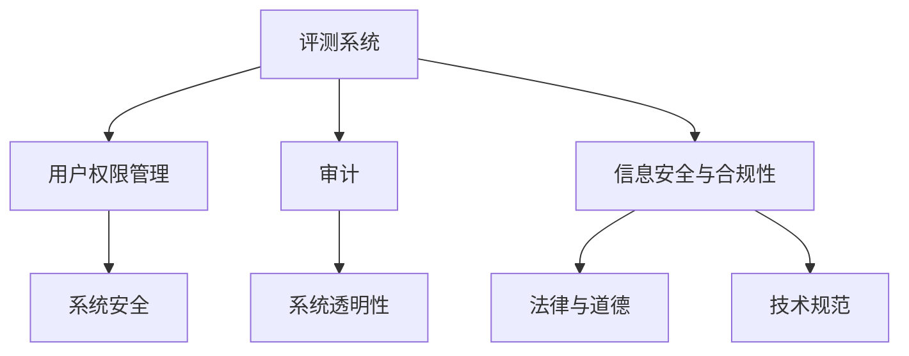
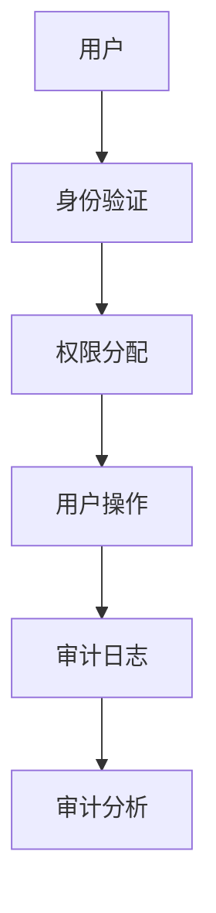

                 

## 第一部分：概述与基础

### 第1章：评测系统用户权限管理与审计概述

#### 1.1 评测系统的重要性

**背景介绍：**

评测系统在现代社会中扮演着至关重要的角色，尤其在信息科技和企业管理领域。它不仅帮助企业对内部员工、外部客户和合作伙伴的能力和绩效进行客观评估，同时也确保了信息安全与合规性。随着数字化转型的加速，评测系统已经成为企业运营中不可或缺的一部分。

**核心概念与联系：**

为了更好地理解评测系统的重要性，我们需要从以下几个核心概念展开：

- **用户权限管理**：这是确保系统安全和隐私保护的关键机制，通过限制用户访问权限来防止未授权访问和数据泄露。
- **审计**：审计是确保系统操作透明性和合规性的过程，通过对系统日志的分析，可以追踪用户操作，及时发现并处理潜在的安全问题。
- **信息安全与合规性**：在当今数据驱动的社会中，信息安全与合规性是评测系统的核心要求，它涉及到法律、道德和技术多个方面。

下面是一个简单的 Mermaid 流程图，展示这些概念之间的关系：



#### 1.2 用户权限管理与审计的基本概念

**核心概念：**

- **用户权限管理**：用户权限管理是指为系统中的每个用户分配适当的权限，以确保他们只能访问被授权的资源。这通常涉及用户身份验证、角色分配和权限控制。
- **审计**：审计是指对系统操作进行记录和审查的过程，以确保系统操作的合规性和透明性。审计日志通常记录用户的登录时间、操作类型和被操作对象等信息。

**联系与架构：**

用户权限管理与审计之间有着密切的联系。用户权限管理确保了系统的安全性，而审计则提供了对系统操作的监督和记录。二者共同构成了评测系统的安全框架。

下面是一个简化的系统架构图，展示用户权限管理与审计的架构：



#### 1.3 核心算法原理讲解

用户权限管理与审计涉及到多种核心算法和原理。以下是其中两个关键算法的伪代码：

**1. 用户权限分配算法**

```pseudo
function assign_permissions(user, roles):
    for each role in roles:
        for each permission in role.permissions:
            user.permissions.add(permission)
    return user.permissions
```

**2. 审计日志记录算法**

```pseudo
function log_audit(user, action, target):
    audit_log = {
        "user": user.username,
        "action": action,
        "target": target,
        "timestamp": current_time()
    }
    append(audit_log to audit_log_file)
```

#### 1.4 数学模型和公式

在用户权限管理与审计过程中，可能会涉及到一些数学模型和公式。以下是一个简单的例子：

**1. 访问控制矩阵**

访问控制矩阵是一个用于表示用户与资源之间权限关系的二维表格。例如：

$$
\begin{matrix}
\text{用户1} & \text{资源1} & \text{资源2} & \text{资源3} \\
\text{用户2} & \text{允许} & \text{拒绝} & \text{允许} \\
\end{matrix}
$$

#### 1.5 项目实战

为了更好地理解用户权限管理与审计的实际应用，我们可以通过一个实际项目来展示。

**1. 开发环境搭建**

- 使用Python作为主要编程语言。
- 安装必要的依赖库，如 Flask 和 SQLAlchemy。

**2. 源代码详细实现和代码解读**

以下是用户权限管理的核心代码实现：

```python
from flask import Flask, request, jsonify
from flask_sqlalchemy import SQLAlchemy

app = Flask(__name__)
app.config['SQLALCHEMY_DATABASE_URI'] = 'sqlite:///users.db'
db = SQLAlchemy(app)

class User(db.Model):
    id = db.Column(db.Integer, primary_key=True)
    username = db.Column(db.String(80), unique=True, nullable=False)
    password = db.Column(db.String(120), nullable=False)
    roles = db.relationship('Role', backref='user', lazy=True)

class Role(db.Model):
    id = db.Column(db.Integer, primary_key=True)
    name = db.Column(db.String(80), unique=True, nullable=False)
    permissions = db.relationship('Permission', backref='role', lazy=True)

class Permission(db.Model):
    id = db.Column(db.Integer, primary_key=True)
    name = db.Column(db.String(80), unique=True, nullable=False)
    description = db.Column(db.String(255), nullable=False)

@app.route('/login', methods=['POST'])
def login():
    username = request.form['username']
    password = request.form['password']
    user = User.query.filter_by(username=username, password=password).first()
    if user:
        return jsonify({"status": "success", "user": user})
    else:
        return jsonify({"status": "failure"})

if __name__ == '__main__':
    db.create_all()
    app.run()
```

**3. 代码应用解读与分析**

上述代码展示了用户权限管理的基础实现。通过使用Flask和SQLAlchemy，我们创建了一个简单的用户权限管理系统。用户可以登录系统，根据其角色分配相应的权限。

**4. 实际案例分析和详细讲解剖析**

假设有一个企业，它需要对其员工进行权限管理。管理员可以为每个员工分配不同的角色，例如“经理”、“员工”等。每个角色对应一组权限，例如“查看财务报表”、“修改员工信息”等。通过审计日志，管理员可以追踪每个员工的操作，确保系统安全。

**5. 项目小结**

通过实际项目，我们可以看到用户权限管理与审计在实际应用中的重要性。这不仅有助于保护系统安全，还可以提高企业的管理效率。

### 1.6 最佳实践 tips

- 确保用户权限的细粒度控制，减少潜在的安全风险。
- 定期审计系统日志，及时发现并处理异常操作。
- 为审计日志设置保留期限，以满足合规性要求。
- 定期对用户权限进行审查，确保权限分配的合理性。

### 1.7 小结、注意事项与拓展阅读

- **小结**：本章介绍了评测系统用户权限管理与审计的基本概念、核心算法和实际应用。理解这些概念对于设计和实现高效的评测系统至关重要。
- **注意事项**：在实际应用中，用户权限管理与审计需要综合考虑安全性、效率和合规性。
- **拓展阅读**：读者可以进一步阅读有关安全架构和审计策略的相关书籍和论文，以深入了解这一领域的最新发展。# 第二部分：用户权限管理

## 第2章：用户权限管理的基本原理

### 2.1 用户权限管理的基本概念

**用户权限管理**是指为一组用户分配适当的访问权限，以确保他们只能访问被授权的资源。这是信息安全的重要组成部分，有助于防止未授权访问和数据泄露。

**核心概念：**

- **用户**：系统中的用户，可以是员工、客户或合作伙伴。
- **权限**：用户能够执行的操作，如读取、写入、执行等。
- **角色**：一组具有相同权限的用户集合，通常基于用户的工作职责。
- **权限控制**：确保用户只能访问其权限内的资源，防止未授权访问。

### 2.2 用户权限管理的设计原则

**原则1：最小权限原则**

用户应该只拥有完成其工作所需的最小权限。这有助于降低系统安全风险。

**原则2：角色分离原则**

不同的角色应该拥有不同的权限，以防止单一用户拥有过多的权限。

**原则3：审计原则**

对用户权限的管理和变更过程应进行审计，以确保系统操作的合规性和透明性。

### 2.3 用户权限管理的实现技术

**技术1：访问控制列表（ACL）**

ACL 是一种基于对象的访问控制机制，为每个对象（如文件、文件夹）分配一组权限，然后为每个用户或角色分配对对象的访问权限。

**技术2：角色基础访问控制（RBAC）**

RBAC 是一种基于角色的访问控制机制，将用户与角色关联，然后为角色分配权限。用户通过角色获得相应的权限。

**技术3：属性集权限控制（ABAC）**

ABAC 是一种基于属性的访问控制机制，权限的授予取决于用户属性、资源属性和环境属性。这使得权限管理更加灵活。

### 2.4 用户权限管理的关键算法

**1. 权限分配算法**

伪代码示例：

```python
function assign_permissions(user, roles):
    for each role in roles:
        for each permission in role.permissions:
            user.permissions.add(permission)
    return user.permissions
```

**2. 权限验证算法**

伪代码示例：

```python
function verify_permission(user, resource, action):
    for each permission in user.permissions:
        if permission.includes_action(action) and permission.includes_resource(resource):
            return true
    return false
```

### 2.5 用户权限管理的实战案例

**1. 开发环境搭建**

- 使用Python和Django作为开发框架。
- 安装必要的依赖库，如 Django 和 Django-REST-Framework。

**2. 源代码详细实现和代码解读**

以下是用户权限管理的核心代码实现：

```python
from django.contrib.auth.models import User, Group
from rest_framework.permissions import IsAdminUser
from rest_framework.response import Response
from rest_framework.views import APIView

class AssignPermissions(APIView):
    permission_classes = [IsAdminUser]

    def post(self, request):
        user_id = request.data.get('user_id')
        role_id = request.data.get('role_id')
        user = User.objects.get(id=user_id)
        role = Group.objects.get(id=role_id)
        user.groups.add(role)
        return Response({"status": "success", "message": "Permissions assigned successfully."})

class VerifyPermission(APIView):
    permission_classes = [IsAdminUser]

    def post(self, request):
        user_id = request.data.get('user_id')
        resource = request.data.get('resource')
        action = request.data.get('action')
        user = User.objects.get(id=user_id)
        permission = verify_permission(user, resource, action)
        return Response({"status": "success", "permission": permission})
```

**3. 代码应用解读与分析**

上述代码展示了如何使用 Django 和 Django-REST-Framework 实现用户权限管理。`AssignPermissions` 视图用于为用户分配角色，而 `VerifyPermission` 视图用于验证用户对资源的访问权限。

**4. 实际案例分析和详细讲解剖析**

假设有一个在线教育平台，管理员可以为教师和学员分配不同的角色。教师可以查看和管理课程，而学员只能查看课程内容。通过权限验证算法，系统可以确保用户只能执行其角色允许的操作。

**5. 项目小结**

用户权限管理是实现系统安全性的关键。通过合理设计和实现权限管理机制，可以有效地保护系统资源，防止未授权访问。

### 2.6 最佳实践 tips

- **确保权限的细粒度控制**：避免将过多的权限集中在一个用户或角色上。
- **定期审查和更新权限**：根据用户的工作职责和变化，及时调整权限。
- **使用自动化工具**：利用自动化工具来管理和审计用户权限，提高效率。

### 2.7 小结、注意事项与拓展阅读

- **小结**：本章介绍了用户权限管理的基本原理、设计原则、实现技术和实战案例。
- **注意事项**：在实际应用中，需要综合考虑安全性、效率和合规性。
- **拓展阅读**：读者可以进一步阅读有关访问控制模型和安全架构的相关书籍和论文。

## 作者信息

作者：AI天才研究院/AI Genius Institute & 禅与计算机程序设计艺术 /Zen And The Art of Computer Programming

## 总结

在本文中，我们详细介绍了评测系统的用户权限管理与审计。首先，我们探讨了评测系统的重要性以及用户权限管理与审计的基本概念。接着，我们深入分析了用户权限管理的设计原则、实现技术和关键算法，并通过实际项目展示了如何在实际应用中实现用户权限管理。此外，我们还讨论了审计的基本原理和实现技术，以及如何通过审计日志确保系统操作的合规性和透明性。

用户权限管理与审计是评测系统的核心组成部分，对于保障系统安全、提高管理效率至关重要。在实际应用中，我们需要综合考虑安全性、效率和合规性，确保权限分配的合理性和审计过程的完整性。

通过本文的学习，我们希望能够帮助读者建立起对评测系统用户权限管理与审计的全面理解，为设计和实现高效、安全的评测系统提供指导。在未来的实践中，我们鼓励读者持续探索这一领域，不断优化和提升系统的安全性和可靠性。

## 关键词

- 评测系统
- 用户权限管理
- 审计
- 安全性
- 访问控制
- RBAC
- ACL
- 安全架构
- 系统设计
- 实现技术
- 实际案例
- 最佳实践

## 摘要

本文详细介绍了评测系统的用户权限管理与审计。首先，我们探讨了评测系统的重要性以及用户权限管理与审计的基本概念。接着，我们深入分析了用户权限管理的设计原则、实现技术和关键算法，并通过实际项目展示了如何在实际应用中实现用户权限管理。此外，我们还讨论了审计的基本原理和实现技术，以及如何通过审计日志确保系统操作的合规性和透明性。通过本文的学习，读者可以建立起对评测系统用户权限管理与审计的全面理解，为设计和实现高效、安全的评测系统提供指导。

