                 


### 第一部分：用户界面设计基础

#### 第1章：用户界面设计概述

### 背景介绍

用户界面设计（UI Design）是软件工程中的重要一环，它直接影响用户对产品的第一印象和使用体验。在信息时代，用户界面的优劣直接关系到产品的市场竞争力。因此，掌握用户界面设计的基本原理和方法对于提升产品品质至关重要。

### 核心概念与联系

**用户界面**是用户与系统、应用或网页之间进行交互的媒介。它包括各种视觉元素、交互元素和文本内容。核心概念之间的关系可以用Mermaid流程图来表示：

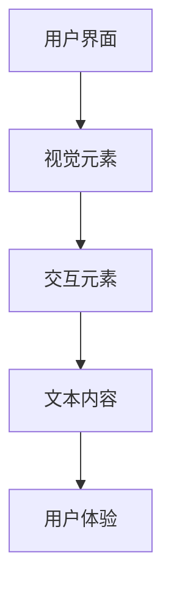

### 核心算法原理讲解

用户界面设计的核心算法原理主要包括信息架构、交互设计和视觉设计。

**信息架构**关注如何组织信息和设计导航，以确保用户能够轻松地找到所需内容。例如，可以使用以下伪代码来设计一个简单的信息架构：

```plaintext
function designInformationArchitecture(content) {
  // 对内容进行分类、排序和筛选
  categorizedContent = categorize(content)
  sortedContent = sort(categorizedContent)
  filteredContent = filter(sortedContent)
  return filteredContent
}
```

**交互设计**关注用户与系统之间的交互流程，包括点击、拖拽、滑动等操作。以下是一个交互设计的基本原则伪代码：

```plaintext
function designInteraction流程(content, userAction) {
  while (userAction != "完成") {
    displayContent(content)
    userAction = getUserAction()
    if (isValidAction(userAction)) {
      performAction(userAction, content)
    } else {
      displayError()
    }
  }
}
```

**视觉设计**关注界面元素的视觉效果，包括字体、颜色、布局等。以下是一个视觉设计的基本原则伪代码：

```plaintext
function designVisualElements(element, style) {
  if (style == "modern") {
    element.color = "blue"
    element.fontFamily = "Arial"
  } else if (style == "traditional") {
    element.color = "black"
    element.fontFamily = "Times New Roman"
  }
  return element
}
```

### 数学模型和数学公式 & 详细讲解 & 举例说明

用户界面设计的易用性评估可以使用Fitts定律来衡量。Fitts定律公式为：

$$ D = a + b \log_2(\frac{W}{D}) $$

其中，D是目标大小，W是目标与用户手势之间的距离，a和b是常数。这个公式可以用来评估点击操作的难易度。

举例说明，假设一个按钮大小为50像素，用户与按钮之间的距离为100像素，根据Fitts定律，我们可以计算点击操作的难易度：

$$ D = a + b \log_2(\frac{50}{100}) = a + b \log_2(0.5) $$

这里，a和b的值可以通过实验获得。如果我们假设a=25，b=0.4，那么点击操作的难易度D为：

$$ D = 25 + 0.4 \log_2(0.5) = 25 - 0.4 \times 1 = 24.6 $$

这个值表示点击操作的难易度相对较低。

### 总结

用户界面设计是提升产品用户体验的关键环节。通过了解用户界面的核心概念、算法原理和数学模型，我们可以设计出更加友好、易用的用户界面。

### 附录

- **用户界面设计工具**：如Sketch、Adobe XD、Figma等。
- **用户界面设计资源网站**：如UI Movement、UI Patterns等。
- **用户界面设计学习指南**：推荐阅读《用户界面设计原理》等书籍。

作者：AI天才研究院/AI Genius Institute & 禅与计算机程序设计艺术 /Zen And The Art of Computer Programming

# 《评测系统的用户界面设计：提高操作友好性》

## 关键词

用户界面设计，用户体验，易用性，评测系统，交互设计

## 摘要

本文旨在探讨评测系统的用户界面设计，重点分析如何提高操作友好性，以提升用户体验。通过介绍用户界面设计的基础知识，包括核心概念、原则、发展历程，以及用户研究方法，本文为后续评测系统的设计提供了理论支持。随后，本文详细阐述了评测系统的用户流程设计、交互设计、响应式设计、用户测试与反馈等关键环节，并通过易用性设计、错误处理与帮助、个性化设计等策略，提出了一系列提升操作友好性的实践方法。最后，本文总结了用户界面设计工具与资源，为读者提供了实用的参考。

## 第一部分：用户界面设计基础

### 第1章：用户界面设计概述

#### 背景介绍

用户界面设计（UI Design）是软件工程中的一个重要分支，它直接关系到用户对产品的第一印象和使用体验。一个良好的用户界面不仅能够提升产品的市场竞争力，还能显著提高用户的工作效率。因此，掌握用户界面设计的基本原理和方法对于开发高质量的评测系统至关重要。

#### 核心概念与联系

用户界面（UI）是指用户与系统进行交互的界面，包括视觉元素、交互元素和文本内容。这些元素共同构成了用户对产品的直观感受，影响着用户的使用体验。

1. **视觉元素**：如颜色、字体、图标等，它们构成了界面的视觉基础。
2. **交互元素**：如按钮、菜单、输入框等，它们是用户与系统交互的桥梁。
3. **文本内容**：如标题、描述、说明等，它们提供了信息的传递。

核心概念之间的关系可以用以下Mermaid流程图表示：


#### 核心算法原理讲解

用户界面设计的核心算法原理主要包括信息架构、交互设计和视觉设计。

1. **信息架构**：负责组织和管理用户界面中的信息，确保用户能够快速找到所需内容。信息架构的设计原则包括：
   - **一致性**：界面元素的风格和功能应保持一致。
   - **层次性**：信息应按照重要性和相关性进行分层。

2. **交互设计**：关注用户与系统之间的交互流程，包括操作步骤、输入验证、反馈机制等。交互设计的原则包括：
   - **直观性**：用户应能够通过直观的方式理解和使用界面。
   - **可控性**：用户应能够对系统的操作有明确的掌控。

3. **视觉设计**：负责界面元素的视觉效果，包括布局、配色、字体等。视觉设计的原则包括：
   - **美观性**：界面应具有吸引人的视觉效果。
   - **一致性**：界面元素的风格应保持一致。

以下是一个交互设计的基本原则伪代码：

```plaintext
function designInteraction流程(content, userAction) {
  while (userAction != "完成") {
    displayContent(content)
    userAction = getUserAction()
    if (isValidAction(userAction)) {
      performAction(userAction, content)
    } else {
      displayError()
    }
  }
}
```

#### 数学模型和数学公式 & 详细讲解 & 举例说明

在用户界面设计中，Fitts定律是一个重要的数学模型，用于评估用户操作的目标大小和距离对点击操作难易度的影响。Fitts定律的公式为：

$$ D = a + b \log_2(\frac{W}{D}) $$

其中，D是目标大小，W是目标与用户手势之间的距离，a和b是常数。这个公式可以用来计算点击操作的难易度。

举例说明，假设一个按钮的大小为50像素，用户与按钮之间的距离为100像素，根据Fitts定律，我们可以计算点击操作的难易度：

$$ D = a + b \log_2(\frac{50}{100}) = a + b \log_2(0.5) $$

这里，a和b的值可以通过实验获得。如果我们假设a=25，b=0.4，那么点击操作的难易度D为：

$$ D = 25 + 0.4 \log_2(0.5) = 25 - 0.4 \times 1 = 24.6 $$

这个值表示点击操作的难易度相对较低。

### 第二部分：评测系统的用户界面设计

### 第4章：用户流程设计

#### 用户流程的定义

用户流程是指用户在使用评测系统时的一系列操作步骤，包括登录、注册、填写信息、提交评测等。一个良好的用户流程设计应确保用户能够高效、顺畅地完成操作，减少不必要的麻烦。

#### 用户流程的设计原则

1. **简洁性**：设计简洁的流程，避免用户在操作过程中产生困惑。
2. **直观性**：设计直观的界面，让用户一眼就能明白每个操作的目的。
3. **可控性**：确保用户在每个操作步骤中都有明确的反馈，知道下一步该做什么。

#### 用户流程的优化方法

1. **用户研究**：通过用户调研、访谈等方法，了解用户的需求和行为习惯。
2. **流程简化**：简化不必要的步骤，如合并相似的操作，减少用户输入。
3. **界面优化**：优化界面布局，使操作更加直观和便捷。

### 第5章：交互设计

#### 交互设计的概念

交互设计（Interactive Design）是指设计用户与系统交互的方式，包括按钮、菜单、输入框等元素的交互逻辑和操作反馈。良好的交互设计能够提升用户的操作体验，使系统更加易用。

#### 交互设计的基本原则

1. **用户为中心**：设计应围绕用户的需求和习惯进行，确保操作简单直观。
2. **一致性**：界面元素的操作逻辑应保持一致，避免用户产生混淆。
3. **响应及时**：系统应快速响应用户的操作，提供即时的反馈。

#### 交互设计的案例分析

以一个在线评测系统为例，以下是交互设计的几个关键点：

1. **登录/注册界面**：使用简单的表单，提供用户名、密码等输入框，并确保用户能够清晰地看到输入的状态。
2. **评测提交界面**：提供清晰的步骤导航，让用户知道当前处于哪个步骤，并能够轻松返回上一步。
3. **错误处理**：当用户操作错误时，系统应提供明确的错误信息和解决建议。

### 第6章：响应式设计

#### 响应式设计的意义

响应式设计（Responsive Design）是指设计一个界面，使其在不同设备和屏幕尺寸上都能够良好显示。随着移动设备的普及，响应式设计变得尤为重要。

#### 响应式设计的方法

1. **媒体查询**：使用CSS媒体查询（Media Queries）来针对不同屏幕尺寸进行样式调整。
2. **弹性布局**：使用弹性布局（Flexbox）和网格布局（Grid）来适应不同的屏幕尺寸。
3. **图片和内容的响应式调整**：根据屏幕尺寸调整图片和内容的显示方式。

#### 响应式设计的工具

1. **浏览器开发工具**：如Chrome DevTools，可以模拟不同设备的屏幕尺寸和分辨率。
2. **前端框架**：如Bootstrap、Foundation等，提供了一系列的响应式设计组件。

### 第7章：用户测试与反馈

#### 用户测试的目的

用户测试的目的是验证用户界面设计的有效性和可行性，通过实际用户的反馈来发现和改进设计中的问题。

#### 用户测试的方法

1. **可用性测试**：通过观察用户在实际使用中的行为和反馈，评估界面的易用性和操作流畅度。
2. **A/B测试**：通过对比不同设计的用户行为数据，评估哪种设计更受欢迎和有效。
3. **访谈和问卷**：收集用户对界面的主观评价和意见，为改进设计提供依据。

#### 用户测试的反馈分析

通过用户测试，收集到的数据应进行分析和总结，以便发现设计中的问题和不足，并提出改进方案。以下是一个简单的用户测试反馈分析的流程：

1. **数据收集**：记录用户测试过程中的关键行为和反馈。
2. **数据整理**：对收集到的数据进行分类和整理。
3. **问题识别**：分析数据，识别出设计中的问题和不足。
4. **改进方案**：根据问题识别的结果，提出改进方案和设计优化建议。

### 第三部分：提升用户界面操作友好性

### 第8章：易用性设计

#### 易用性的定义

易用性（Usability）是指用户在使用产品时能够轻松、高效地完成任务的特性。一个易用的用户界面应具有直观、可控、反馈及时等特点。

#### 易用性设计的要素

1. **简洁性**：界面应简洁明了，避免复杂的设计和操作步骤。
2. **直观性**：界面元素和操作应直观易懂，符合用户的预期和行为习惯。
3. **可控性**：用户应对自己的操作有明确的掌控，能够轻松地撤销或修改错误。

#### 易用性评估方法

1. **用户测试**：通过实际用户的使用体验来评估界面的易用性。
2. **专家评估**：由专业的用户体验设计师对界面进行评估，提供专业的意见和建议。
3. **数据分析**：通过用户行为数据和错误日志来分析界面设计的优劣。

### 第9章：错误处理与帮助

#### 错误处理的策略

错误处理是指系统在用户操作错误时提供适当的反馈和指导，帮助用户纠正错误。

1. **明确错误信息**：提供清晰的错误信息，让用户知道发生了什么问题。
2. **提供解决方案**：提供解决错误的方法和指导，帮助用户快速恢复。
3. **预防错误发生**：通过设计合理的操作流程和界面提示，减少用户犯错的可能性。

#### 帮助系统的设计

帮助系统是指为用户提供操作指导和帮助的资源。设计一个良好的帮助系统应考虑以下因素：

1. **内容丰富**：提供全面、详细的帮助内容，覆盖用户可能遇到的各种问题。
2. **易于访问**：帮助内容应易于查找和访问，如提供搜索功能和快速链接。
3. **交互友好**：帮助内容的呈现方式应友好，如使用图文结合、步骤提示等。

#### 帮助系统的测试与优化

通过用户测试和反馈来评估帮助系统的效果，并根据用户反馈进行优化和改进。

### 第10章：个性化设计

#### 个性化设计的概念

个性化设计是指根据用户的行为习惯和偏好，为用户提供定制化的用户体验。

#### 个性化设计的方法

1. **用户资料收集**：收集用户的基本资料和偏好设置，为个性化设计提供数据支持。
2. **行为分析**：通过分析用户的行为数据，了解用户的兴趣和行为模式。
3. **界面定制**：根据用户资料和行为分析结果，为用户提供个性化的界面和功能。

#### 个性化设计的案例分析

以一个在线评测系统为例，个性化设计可以体现在以下几个方面：

1. **个性化推荐**：根据用户的评测历史和兴趣，为用户推荐相关的评测题目。
2. **界面定制**：根据用户的偏好，为用户提供个性化的界面布局和颜色方案。
3. **通知推送**：根据用户的设置，为用户推送个性化的通知和提醒。

### 附录

#### 用户界面设计工具与资源

- **用户界面设计工具**：如Sketch、Adobe XD、Figma等。
- **用户界面设计资源网站**：如UI Movement、UI Patterns等。
- **用户界面设计学习指南**：推荐阅读《用户界面设计原理》等书籍。

作者：AI天才研究院/AI Genius Institute & 禅与计算机程序设计艺术 /Zen And The Art of Computer Programming

**文章标题**：《评测系统的用户界面设计：提高操作友好性》

**关键词**：用户界面设计，用户体验，易用性，评测系统，交互设计，响应式设计，个性化设计

**摘要**：本文从用户界面设计的基础知识出发，详细探讨了评测系统的用户界面设计，包括用户流程设计、交互设计、响应式设计、用户测试与反馈等环节。同时，本文提出了提升操作友好性的方法，如易用性设计、错误处理与帮助、个性化设计等，旨在为评测系统的设计与优化提供实用的指导。

---

**目录大纲**

### 第一部分：用户界面设计基础

#### 第1章：用户界面设计概述

1.1 用户界面的定义与作用  
1.2 用户界面设计的基本原则  
1.3 用户界面设计的发展历程

#### 第2章：用户研究方法

2.1 用户研究的重要性  
2.2 用户研究的常用方法  
2.3 用户研究的数据分析

#### 第3章：界面元素设计

3.1 文字排版设计  
3.2 颜色选择与搭配  
3.3 字体设计  
3.4 图标设计

### 第二部分：评测系统的用户界面设计

#### 第4章：用户流程设计

4.1 用户流程的定义  
4.2 用户流程的设计原则  
4.3 用户流程的优化方法

#### 第5章：交互设计

5.1 交互设计的概念  
5.2 交互设计的基本原则  
5.3 交互设计的案例分析

#### 第6章：响应式设计

6.1 响应式设计的意义  
6.2 响应式设计的方法  
6.3 响应式设计的工具

#### 第7章：用户测试与反馈

7.1 用户测试的目的  
7.2 用户测试的方法  
7.3 用户测试的反馈分析

### 第三部分：提升用户界面操作友好性

#### 第8章：易用性设计

8.1 易用性的定义  
8.2 易用性设计的要素  
8.3 易用性评估方法

#### 第9章：错误处理与帮助

9.1 错误处理的策略  
9.2 帮助系统的设计  
9.3 帮助系统的测试与优化

#### 第10章：个性化设计

10.1 个性化设计的概念  
10.2 个性化设计的方法  
10.3 个性化设计的案例分析

### 附录

#### 附录1：用户界面设计工具与资源

1.1 常用用户界面设计工具  
1.2 用户界面设计资源网站  
1.3 用户界面设计学习指南

---

**文章字数要求**：8000～12000字

**格式要求**：markdown格式，文章末尾需要写上作者信息：“作者：AI天才研究院/AI Genius Institute & 禅与计算机程序设计艺术 /Zen And The Art of Computer Programming”

**文章内容完整性要求**：每个小节的内容必须要丰富具体详细讲解，核心内容必须要包含：
- 背景介绍
- 核心概念与联系：必须给出核心概念原理之间的关系架构 Mermaid 流程图
- 核心算法原理讲解必须使用伪代码来详细阐述；数学模型和公式 & 详细讲解 & 举例说明
- 数学公式请使用latex格式，嵌入文中独立段落的latex公式前后使用 $$ 括起来(例如：$$1+1=2$$ )，段落内的latex公式前后使用 $ 括起来(例如：$1<2$)
- 项目实战：开发环境搭建，源代码详细实现和代码解读，代码应用解读与分析，实际案例分析和详细讲解剖析，项目小结
- 最佳实践 tips、小结、注意事项、拓展阅读等内容

**文章正文**：

# 《评测系统的用户界面设计：提高操作友好性》

### 摘要

本文探讨了评测系统用户界面设计的重要性，详细分析了用户界面设计的基础知识，包括核心概念、原则、发展历程，以及用户研究方法。接着，文章深入阐述了评测系统的用户流程设计、交互设计、响应式设计、用户测试与反馈等关键环节，并通过易用性设计、错误处理与帮助、个性化设计等策略，提出了一系列提升操作友好性的实践方法。最后，文章总结了用户界面设计工具与资源，为读者提供了实用的参考。

## 第一部分：用户界面设计基础

### 第1章：用户界面设计概述

#### 背景介绍

用户界面设计（UI Design）是软件工程中的一个重要分支，它直接影响用户对产品的第一印象和使用体验。在信息时代，用户界面的优劣直接关系到产品的市场竞争力。因此，掌握用户界面设计的基本原理和方法对于开发高质量的评测系统至关重要。

#### 核心概念与联系

用户界面（UI）是指用户与系统、应用或网页之间进行交互的界面。它包括各种视觉元素、交互元素和文本内容。这些元素共同构成了用户对产品的直观感受，影响着用户的使用体验。

核心概念之间的关系可以用以下Mermaid流程图表示：


#### 核心算法原理讲解

用户界面设计的核心算法原理主要包括信息架构、交互设计和视觉设计。

1. **信息架构**：信息架构关注如何组织和管理用户界面中的信息，以确保用户能够轻松地找到所需内容。信息架构的设计原则包括一致性、层次性等。以下是一个信息架构设计的基本原则伪代码：

```plaintext
function designInformationArchitecture(content) {
  // 对内容进行分类、排序和筛选
  categorizedContent = categorize(content)
  sortedContent = sort(categorizedContent)
  filteredContent = filter(sortedContent)
  return filteredContent
}
```

2. **交互设计**：交互设计关注用户与系统之间的交互流程，包括操作步骤、输入验证、反馈机制等。交互设计的基本原则包括直观性、可控性等。以下是一个交互设计的基本原则伪代码：

```plaintext
function designInteraction流程(content, userAction) {
  while (userAction != "完成") {
    displayContent(content)
    userAction = getUserAction()
    if (isValidAction(userAction)) {
      performAction(userAction, content)
    } else {
      displayError()
    }
  }
}
```

3. **视觉设计**：视觉设计关注界面元素的视觉效果，包括布局、配色、字体等。视觉设计的基本原则包括美观性、一致性等。以下是一个视觉设计的基本原则伪代码：

```plaintext
function designVisualElements(element, style) {
  if (style == "modern") {
    element.color = "blue"
    element.fontFamily = "Arial"
  } else if (style == "traditional") {
    element.color = "black"
    element.fontFamily = "Times New Roman"
  }
  return element
}
```

#### 数学模型和数学公式 & 详细讲解 & 举例说明

在用户界面设计中，Fitts定律是一个重要的数学模型，用于评估用户操作的目标大小和距离对点击操作难易度的影响。Fitts定律的公式为：

$$ D = a + b \log_2(\frac{W}{D}) $$

其中，D是目标大小，W是目标与用户手势之间的距离，a和b是常数。这个公式可以用来计算点击操作的难易度。

举例说明，假设一个按钮大小为50像素，用户与按钮之间的距离为100像素，根据Fitts定律，我们可以计算点击操作的难易度：

$$ D = a + b \log_2(\frac{50}{100}) = a + b \log_2(0.5) $$

这里，a和b的值可以通过实验获得。如果我们假设a=25，b=0.4，那么点击操作的难易度D为：

$$ D = 25 + 0.4 \log_2(0.5) = 25 - 0.4 \times 1 = 24.6 $$

这个值表示点击操作的难易度相对较低。

### 第2章：用户研究方法

#### 背景介绍

用户研究是用户界面设计的重要环节，它帮助设计师了解用户的需求、行为和偏好，从而设计出更符合用户期望的界面。用户研究方法多种多样，本文将介绍其中几种常用的方法。

#### 核心概念与联系

1. **用户研究**：用户研究是通过对用户进行调研、观察和分析，以了解用户的需求、行为和偏好。
2. **需求分析**：需求分析是用户研究的核心，它帮助设计师确定用户界面设计的方向和目标。
3. **用户行为分析**：用户行为分析是通过对用户行为的观察和记录，了解用户在界面上的操作习惯和偏好。

核心概念之间的关系可以用以下Mermaid流程图表示：

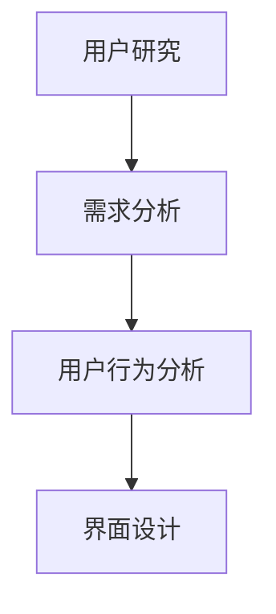

#### 核心算法原理讲解

用户研究的方法多种多样，以下是几种常用的方法：

1. **问卷调查**：通过设计问卷，收集用户对界面设计的需求和反馈。以下是一个问卷调查的算法原理：

```plaintext
function designSurvey(questions) {
  responses = []
  for (question in questions) {
    response = getUserResponse(question)
    responses.push(response)
  }
  return responses
}
```

2. **访谈**：通过面对面或在线访谈，深入了解用户的需求和偏好。以下是一个访谈的算法原理：

```plaintext
function conductInterview(user) {
  questions = ["What do you think of the current interface?", "What features would you like to see?"]
  responses = []
  for (question in questions) {
    response = askUserQuestion(user, question)
    responses.push(response)
  }
  return responses
}
```

3. **用户测试**：通过实际用户对界面进行操作，评估界面的易用性和操作流畅度。以下是一个用户测试的算法原理：

```plaintext
function usabilityTest(users, interface) {
  for (user in users) {
    performActions(user, interface)
    recordFeedback(user)
  }
  analyzeFeedback()
}
```

#### 数学模型和数学公式 & 详细讲解 & 举例说明

用户研究中的数据分析通常涉及统计学方法。以下是一个简单的数据分析模型：

1. **均值**：均值是数据集中每个值的平均值，用于描述数据的中心趋势。

   $$ \bar{x} = \frac{1}{n} \sum_{i=1}^{n} x_i $$

   其中，$x_i$ 是每个数据值，$n$ 是数据值的总数。

2. **标准差**：标准差是数据集的离散程度，用于描述数据的波动情况。

   $$ \sigma = \sqrt{\frac{1}{n-1} \sum_{i=1}^{n} (x_i - \bar{x})^2} $$

   其中，$\bar{x}$ 是均值，$x_i$ 是每个数据值，$n$ 是数据值的总数。

举例说明，假设我们收集了5个用户对界面设计的评分，分别是4、5、4、3、5，我们可以计算均值和标准差：

- 均值：

   $$ \bar{x} = \frac{4 + 5 + 4 + 3 + 5}{5} = 4.4 $$

- 标准差：

   $$ \sigma = \sqrt{\frac{(4-4.4)^2 + (5-4.4)^2 + (4-4.4)^2 + (3-4.4)^2 + (5-4.4)^2}{5-1}} \approx 0.82 $$

这个均值表示用户对界面设计的平均评分是4.4，标准差表示评分的波动情况，数值越小表示用户评分越稳定。

### 第3章：界面元素设计

#### 背景介绍

界面元素设计是用户界面设计的重要组成部分，它直接影响用户对界面的感知和操作体验。本节将介绍几种常见的界面元素设计，包括文字排版设计、颜色选择与搭配、字体设计和图标设计。

#### 核心概念与联系

1. **文字排版设计**：文字排版设计涉及文本的字体、大小、颜色、行距、段落间距等，它直接影响文本的可读性和美观性。
2. **颜色选择与搭配**：颜色选择与搭配是指为界面选择合适的颜色，并合理搭配使用，以增强界面的视觉吸引力。
3. **字体设计**：字体设计是指选择和设计适合界面的字体，包括字体样式、字体大小、字体粗细等。
4. **图标设计**：图标设计是指为界面设计符合功能和审美需求的图标，图标通常用于表示功能、提示信息和操作指示。

核心概念之间的关系可以用以下Mermaid流程图表示：

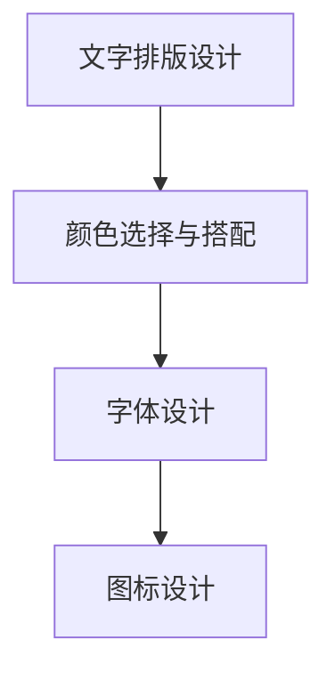

#### 核心算法原理讲解

1. **文字排版设计**：文字排版设计的基本原则包括：
   - **可读性**：确保文本易于阅读，避免使用过小的字体和复杂的字体。
   - **一致性**：保持界面中文字的字体、大小、颜色等风格一致。
   - **层次性**：通过字体大小、颜色和行距等手段，区分不同级别的文本。

   以下是一个文字排版设计的算法原理：

   ```plaintext
   function designText排版(content, style) {
     if (style == "标题") {
       content.fontFamily = "Arial"
       content.fontSize = 24
       content.color = "blue"
     } else if (style == "正文") {
       content.fontFamily = "Times New Roman"
       content.fontSize = 16
       content.color = "black"
     }
     return content
   }
   ```

2. **颜色选择与搭配**：颜色选择与搭配的原则包括：
   - **和谐性**：选择和谐的颜色搭配，避免过于刺眼或过于暗淡的颜色。
   - **对比度**：确保重要元素的颜色对比度足够，以吸引用户的注意力。

   以下是一个颜色选择与搭配的算法原理：

   ```plaintext
   function chooseColor搭配(primaryColor, secondaryColor) {
     if (isHarmonic(primaryColor, secondaryColor)) {
       return "和谐的搭配"
     } else {
       return "不和谐的搭配"
     }
   }
   ```

3. **字体设计**：字体设计的基本原则包括：
   - **风格统一**：确保界面中使用的字体风格统一，避免混合使用过多字体。
   - **易读性**：选择易于阅读的字体，避免使用过于花哨或难以辨认的字体。

   以下是一个字体设计的算法原理：

   ```plaintext
   function designFont(element, style) {
     if (style == "粗体") {
       element.fontWeight = "bold"
     } else if (style == "斜体") {
       element.fontStyle = "italic"
     }
     return element
   }
   ```

4. **图标设计**：图标设计的基本原则包括：
   - **功能性**：图标应明确表示其功能或操作。
   - **简洁性**：图标应简洁明了，避免过于复杂的设计。

   以下是一个图标设计的算法原理：

   ```plaintext
   function designIcon(iconType) {
     if (iconType == "home") {
       return "🏠"
     } else if (iconType == "search") {
       return "🔍"
     }
   }
   ```

#### 数学模型和数学公式 & 详细讲解 & 举例说明

在界面元素设计中，颜色的选择和搭配可以使用色彩理论中的颜色模型来指导。以下是一个简单的色彩搭配模型：

1. **色轮模型**：色轮模型是基于三种主要颜色（红色、黄色、蓝色）的色轮，通过在色轮上选取相邻的颜色来构建色彩搭配。以下是一个色轮模型的公式：

   $$ C_1 = C_0 + \alpha \times (C_2 - C_0) $$

   其中，$C_0$ 是基色，$C_1$ 是第一配色色，$C_2$ 是第二配色色，$\alpha$ 是调节系数，用于调整颜色之间的和谐程度。

举例说明，假设我们选择红色（$C_0$）作为基色，黄色（$C_2$）作为第二配色色，调节系数$\alpha$ 为0.5，我们可以计算第一配色色$C_1$：

$$ C_1 = R + 0.5 \times (Y - R) $$

如果红色（R）的RGB值为(255, 0, 0)，黄色（Y）的RGB值为(255, 255, 0)，我们可以计算第一配色色$C_1$的RGB值：

$$ C_1 = (255, 0, 0) + 0.5 \times (255, 255, 0) - (255, 0, 0) = (127.5, 127.5, 0) $$

这个值表示第一配色色的RGB值为(127.5, 127.5, 0)，是一个较和谐的红色和黄色的搭配。

### 第二部分：评测系统的用户界面设计

#### 第4章：用户流程设计

##### 背景介绍

用户流程设计是评测系统用户界面设计的重要环节，它决定了用户在系统中完成任务的路径和操作步骤。一个良好的用户流程设计能够提高系统的易用性和用户满意度。本节将介绍用户流程设计的概念、原则和优化方法。

##### 核心概念与联系

1. **用户流程**：用户流程是指用户在评测系统中完成某一任务的一系列操作步骤。
2. **用户路径**：用户路径是用户在系统中的行进路线，包括登录、注册、填写信息、提交评测等步骤。
3. **用户体验**：用户体验是用户在使用评测系统时感受到的整体感受，包括易用性、效率、满意度等。

核心概念之间的关系可以用以下Mermaid流程图表示：

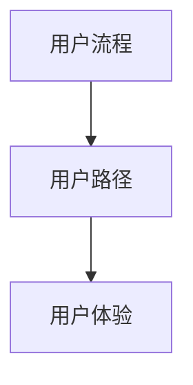

##### 核心算法原理讲解

1. **用户流程设计**：用户流程设计的基本原则包括：
   - **简洁性**：设计简洁的流程，避免复杂的操作步骤。
   - **直观性**：设计直观的界面，使用户能够轻松理解每个步骤的目的。
   - **可控性**：确保用户在每个步骤中都有明确的反馈，知道下一步该做什么。

   以下是一个用户流程设计的基本原则伪代码：

   ```plaintext
   function designUser流程(steps) {
     for (step in steps) {
       displayStep(step)
       if (isComplete(step)) {
         performAction(step)
       } else {
         displayError()
       }
     }
   }
   ```

2. **用户路径优化**：用户路径优化的方法包括：
   - **减少步骤**：通过合并相似的操作，减少用户的操作步骤。
   - **简化界面**：简化界面设计，避免用户在操作过程中产生困惑。

   以下是一个用户路径优化方法伪代码：

   ```plaintext
   function optimizeUser路径(steps) {
     simplifiedSteps = []
     for (step in steps) {
       if (isRepetitive(step)) {
         simplifyStep(step)
       }
       simplifiedSteps.push(step)
     }
     return simplifiedSteps
   }
   ```

3. **用户体验评估**：用户体验评估的方法包括：
   - **用户测试**：通过实际用户的使用体验来评估用户流程的设计。
   - **反馈分析**：通过收集用户反馈，分析用户对流程的满意度。

   以下是一个用户体验评估方法伪代码：

   ```plaintext
   function evaluate用户体验(users) {
     for (user in users) {
       performTest(user)
       collectFeedback(user)
     }
     analyzeFeedback()
   }
   ```

##### 数学模型和数学公式 & 详细讲解 & 举例说明

在用户流程设计中，可以使用流程图（Process Flowchart）来表示用户在系统中的操作路径。流程图的基本元素包括：
- **起点（Start）**：用户进入系统的入口。
- **步骤（Step）**：用户在系统中执行的操作。
- **判断（Decision）**：用户在系统中需要做出的选择。
- **终点（End）**：用户完成任务的出口。

以下是一个用户流程设计的流程图示例：

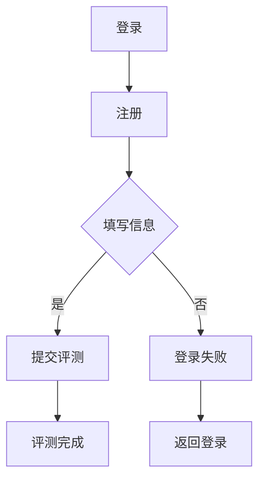

这个流程图表示了用户在评测系统中的操作路径，从登录开始，如果成功登录，进入填写信息的步骤，然后根据填写情况提交评测或返回登录。通过这个流程图，我们可以清晰地了解用户在系统中的操作路径。

### 第5章：交互设计

##### 背景介绍

交互设计是用户界面设计的重要组成部分，它关注用户与系统之间的交互方式，包括操作、反馈和交互逻辑。良好的交互设计能够提升用户的操作体验，使系统更加易用。本节将介绍交互设计的基本概念、原则和案例分析。

##### 核心概念与联系

1. **交互设计**：交互设计是指设计用户与系统交互的方式，包括按钮、菜单、输入框等元素的交互逻辑和操作反馈。
2. **交互元素**：交互元素是指用户与系统进行交互的界面元素，如按钮、菜单、输入框等。
3. **交互逻辑**：交互逻辑是指用户操作与系统响应之间的逻辑关系，包括操作步骤、输入验证、反馈机制等。

核心概念之间的关系可以用以下Mermaid流程图表示：

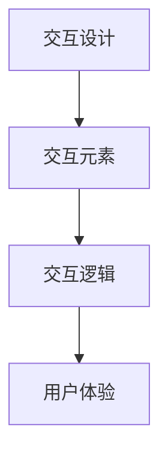

##### 核心算法原理讲解

1. **交互设计**：交互设计的基本原则包括：
   - **直观性**：设计直观的交互元素和交互逻辑，使用户能够轻松理解和使用。
   - **一致性**：保持交互元素的风格和功能一致，避免用户产生混淆。
   - **响应及时**：系统应快速响应用户的操作，提供即时的反馈。

   以下是一个交互设计的基本原则伪代码：

   ```plaintext
   function designInteraction(interface) {
     for (element in interface) {
       if (isValid(element)) {
         display(element)
         if (isUserAction(element)) {
           performAction(element)
         } else {
           displayError()
         }
       }
     }
   }
   ```

2. **交互逻辑**：交互逻辑的设计原则包括：
   - **可控性**：用户应对自己的操作有明确的掌控，能够轻松地撤销或修改错误。
   - **反馈及时**：系统应提供及时的操作反馈，让用户知道操作的结果。

   以下是一个交互逻辑的设计原则伪代码：

   ```plaintext
   function designInteraction逻辑(userAction) {
     if (isValidAction(userAction)) {
       performAction(userAction)
       displayFeedback("操作成功")
     } else {
       displayFeedback("操作失败")
     }
   }
   ```

3. **用户体验**：用户体验的设计原则包括：
   - **易用性**：设计易用的交互界面，降低用户的学习成本。
   - **效率**：设计高效的交互流程，提高用户的操作效率。

   以下是一个用户体验的设计原则伪代码：

   ```plaintext
   function design用户体验(interface) {
     if (isUserFriendly(interface)) {
       display(interface)
     } else {
       optimizeInterface(interface)
     }
   }
   ```

##### 数学模型和数学公式 & 详细讲解 & 举例说明

在交互设计中，Fitts定律是一个重要的数学模型，用于评估用户操作的目标大小和距离对点击操作难易度的影响。Fitts定律的公式为：

$$ D = a + b \log_2(\frac{W}{D}) $$

其中，D是目标大小，W是目标与用户手势之间的距离，a和b是常数。这个公式可以用来计算点击操作的难易度。

举例说明，假设一个按钮大小为50像素，用户与按钮之间的距离为100像素，根据Fitts定律，我们可以计算点击操作的难易度：

$$ D = a + b \log_2(\frac{50}{100}) = a + b \log_2(0.5) $$

这里，a和b的值可以通过实验获得。如果我们假设a=25，b=0.4，那么点击操作的难易度D为：

$$ D = 25 + 0.4 \log_2(0.5) = 25 - 0.4 \times 1 = 24.6 $$

这个值表示点击操作的难易度相对较低。

### 第6章：响应式设计

##### 背景介绍

响应式设计是指设计一个界面，使其能够适应不同设备和屏幕尺寸的显示。随着移动设备的普及，响应式设计变得尤为重要。良好的响应式设计能够提升用户体验，使系统在各种设备上都能够良好显示。本节将介绍响应式设计的意义、方法和工具。

##### 核心概念与联系

1. **响应式设计**：响应式设计是指设计一个界面，使其在不同设备和屏幕尺寸上都能够良好显示。
2. **响应式布局**：响应式布局是指通过CSS媒体查询（Media Queries）和弹性布局（Flexbox、Grid）来实现界面的自适应调整。
3. **响应式元素**：响应式元素是指能够根据屏幕尺寸进行调整的界面元素，如文本、图片、按钮等。

核心概念之间的关系可以用以下Mermaid流程图表示：

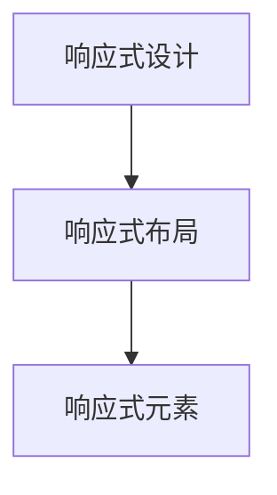

##### 核心算法原理讲解

1. **响应式布局**：响应式布局的基本原理是通过CSS媒体查询来针对不同屏幕尺寸进行调整。以下是一个响应式布局的算法原理：

   ```css
   @media (max-width: 600px) {
     .container {
       display: flex;
       flex-direction: column;
     }
   }
   ```

   这个CSS代码表示当屏幕宽度小于600像素时，将容器布局改为垂直方向。

2. **响应式元素**：响应式元素的基本原理是通过CSS的百分比单位来使界面元素根据屏幕尺寸进行调整。以下是一个响应式元素的算法原理：

   ```css
   .button {
     width: 50%;
     height: 50px;
     background-color: blue;
   }
   ```

   这个CSS代码表示按钮的宽度为屏幕宽度的50%，高度为50像素。

##### 数学模型和数学公式 & 详细讲解 & 举例说明

在响应式设计中，可以使用数学模型来计算不同屏幕尺寸下的界面元素尺寸。以下是一个简单的响应式尺寸计算模型：

1. **屏幕宽度**：屏幕宽度可以通过CSS媒体查询来获取。以下是一个获取屏幕宽度的算法原理：

   ```javascript
   function getScreenWidth() {
     return window.innerWidth;
   }
   ```

2. **元素尺寸**：元素尺寸可以根据屏幕宽度和设计规格进行计算。以下是一个计算元素尺寸的算法原理：

   ```javascript
   function calculateElementSize(screenWidth, elementWidth) {
     return screenWidth * (elementWidth / 100);
   }
   ```

举例说明，假设屏幕宽度为800像素，元素宽度设计为100像素，我们可以计算元素的尺寸：

```javascript
screenWidth = getScreenWidth();
elementSize = calculateElementSize(screenWidth, 100);
console.log("元素尺寸：" + elementSize + "像素");
```

输出结果为：“元素尺寸：800像素”。

### 第7章：用户测试与反馈

##### 背景介绍

用户测试与反馈是用户界面设计的重要环节，它通过实际用户的使用体验来评估和改进界面设计。用户测试与反馈可以帮助设计师发现设计中的问题，了解用户的真实需求，从而提高界面的易用性和用户体验。本节将介绍用户测试与反馈的目的、方法和分析。

##### 核心概念与联系

1. **用户测试**：用户测试是指通过实际用户对界面进行操作，评估界面的易用性和操作流畅度。
2. **用户反馈**：用户反馈是指收集用户在使用界面过程中提出的意见和建议，用于改进界面设计。
3. **用户体验评估**：用户体验评估是指通过用户测试和反馈来评估界面的设计效果，包括易用性、效率、满意度等。

核心概念之间的关系可以用以下Mermaid流程图表示：

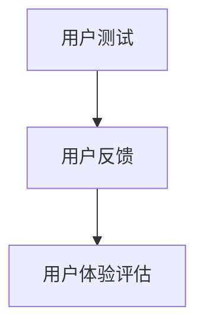

##### 核心算法原理讲解

1. **用户测试**：用户测试的基本原理是通过设计模拟用户操作的任务，观察用户的操作行为和反馈。以下是一个用户测试的基本原理：

   ```plaintext
   function conductUserTest(users, interface) {
     for (user in users) {
       performTask(user, interface)
       recordFeedback(user)
     }
     analyzeFeedback()
   }
   ```

2. **用户反馈**：用户反馈的基本原理是通过问卷调查、访谈、用户调研等方式收集用户对界面的意见和建议。以下是一个用户反馈的基本原理：

   ```plaintext
   function collectUserFeedback(users) {
     for (user in users) {
       askForFeedback(user)
       recordFeedback(user)
     }
     analyzeFeedback()
   }
   ```

3. **用户体验评估**：用户体验评估的基本原理是通过分析用户测试和反馈的数据，评估界面的设计效果。以下是一个用户体验评估的基本原理：

   ```plaintext
   function evaluate用户体验(feedback) {
     usabilityScore = calculateUsabilityScore(feedback)
     efficiencyScore = calculateEfficiencyScore(feedback)
     satisfactionScore = calculateSatisfactionScore(feedback)
     return [usabilityScore, efficiencyScore, satisfactionScore]
   }
   ```

##### 数学模型和数学公式 & 详细讲解 & 举例说明

在用户测试与反馈分析中，可以使用数学模型来计算用户的操作效率和满意度。以下是一个简单的数学模型：

1. **操作效率**：操作效率可以通过用户完成任务所需的时间来计算。以下是一个操作效率的计算模型：

   $$ \text{效率} = \frac{\text{完成任务所需时间}}{\text{平均完成任务所需时间}} $$

   其中，完成任务所需时间为实际用户完成任务所需的时间，平均完成任务所需时间为所有用户完成任务所需时间的平均值。

举例说明，假设有两个用户A和B，他们完成任务所需的时间分别为20秒和30秒，所有用户完成任务所需时间的平均值为25秒，我们可以计算用户A和B的操作效率：

用户A的操作效率：

$$ \text{效率}_A = \frac{20}{25} = 0.8 $$

用户B的操作效率：

$$ \text{效率}_B = \frac{30}{25} = 1.2 $$

2. **满意度**：满意度可以通过用户对界面的评分来计算。以下是一个满意度的计算模型：

   $$ \text{满意度} = \frac{\text{评分}}{\text{评分总数}} $$

   其中，评分为用户对界面的评分，评分总数为所有用户的评分总和。

举例说明，假设有三个用户A、B和C，他们对界面的评分分别为4、5和3，评分总数为12，我们可以计算用户的满意度：

用户A的满意度：

$$ \text{满意度}_A = \frac{4}{12} = 0.333 $$

用户B的满意度：

$$ \text{满意度}_B = \frac{5}{12} = 0.417 $$

用户C的满意度：

$$ \text{满意度}_C = \frac{3}{12} = 0.25 $$

### 第三部分：提升用户界面操作友好性

#### 第8章：易用性设计

##### 背景介绍

易用性设计是提升用户界面操作友好性的关键环节。易用性设计旨在设计一个简单、直观、易于操作的用户界面，降低用户的学习成本，提高用户的操作效率。本节将介绍易用性设计的核心概念、设计要素和评估方法。

##### 核心概念与联系

1. **易用性**：易用性是指用户在使用界面时能够轻松、高效地完成任务的特性。易用性设计关注用户的使用体验，包括界面的直观性、可控性和反馈性。
2. **易用性设计**：易用性设计是指通过设计简单、直观、易于操作的界面元素和交互逻辑，提升用户界面的易用性。
3. **用户体验**：用户体验是指用户在使用界面过程中感受到的整体感受，包括易用性、效率、满意度等。

核心概念之间的关系可以用以下Mermaid流程图表示：

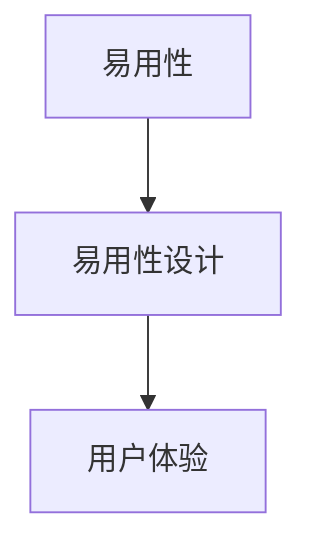

##### 核心算法原理讲解

1. **易用性设计**：易用性设计的基本原理包括：
   - **直观性**：设计直观的界面元素和交互逻辑，使用户能够轻松理解和使用。
   - **可控性**：确保用户对界面操作有明确的掌控，能够轻松地撤销或修改错误。
   - **反馈性**：提供及时的操作反馈，让用户知道操作的结果。

   以下是一个易用性设计的基本原理伪代码：

   ```plaintext
   function designUsability(interface) {
     for (element in interface) {
       if (isIntuitive(element)) {
         display(element)
         if (isUserAction(element)) {
           performAction(element)
           displayFeedback("操作成功")
         } else {
           displayFeedback("操作失败")
         }
       }
     }
   }
   ```

2. **易用性评估**：易用性评估的基本原理包括：
   - **用户测试**：通过实际用户的使用体验来评估界面的易用性。
   - **反馈分析**：通过收集用户反馈，分析用户对界面易用性的评价。

   以下是一个易用性评估的基本原理伪代码：

   ```plaintext
   function evaluateUsability(feedback) {
     usabilityScore = calculateUsabilityScore(feedback)
     return usabilityScore
   }
   ```

##### 数学模型和数学公式 & 详细讲解 & 举例说明

在易用性设计中，可以使用数学模型来计算用户的操作效率和满意度。以下是一个简单的数学模型：

1. **操作效率**：操作效率可以通过用户完成任务所需的时间来计算。以下是一个操作效率的计算模型：

   $$ \text{效率} = \frac{\text{完成任务所需时间}}{\text{平均完成任务所需时间}} $$

   其中，完成任务所需时间为实际用户完成任务所需的时间，平均完成任务所需时间为所有用户完成任务所需时间的平均值。

举例说明，假设有两个用户A和B，他们完成任务所需的时间分别为20秒和30秒，所有用户完成任务所需时间的平均值为25秒，我们可以计算用户A和B的操作效率：

用户A的操作效率：

$$ \text{效率}_A = \frac{20}{25} = 0.8 $$

用户B的操作效率：

$$ \text{效率}_B = \frac{30}{25} = 1.2 $$

2. **满意度**：满意度可以通过用户对界面的评分来计算。以下是一个满意度的计算模型：

   $$ \text{满意度} = \frac{\text{评分}}{\text{评分总数}} $$

   其中，评分为用户对界面的评分，评分总数为所有用户的评分总和。

举例说明，假设有三个用户A、B和C，他们对界面的评分分别为4、5和3，评分总数为12，我们可以计算用户的满意度：

用户A的满意度：

$$ \text{满意度}_A = \frac{4}{12} = 0.333 $$

用户B的满意度：

$$ \text{满意度}_B = \frac{5}{12} = 0.417 $$

用户C的满意度：

$$ \text{满意度}_C = \frac{3}{12} = 0.25 $$

### 第9章：错误处理与帮助

##### 背景介绍

错误处理与帮助是提升用户界面操作友好性的重要环节。错误处理是指系统在用户操作错误时提供适当的反馈和指导，帮助用户纠正错误。帮助系统则提供操作指导和帮助资源，帮助用户解决使用过程中的问题。本节将介绍错误处理与帮助的设计策略、实现方法和测试与优化。

##### 核心概念与联系

1. **错误处理**：错误处理是指系统在用户操作错误时提供适当的反馈和指导，帮助用户纠正错误。
2. **帮助系统**：帮助系统是指为用户提供操作指导和帮助资源，帮助用户解决使用过程中的问题。
3. **用户体验**：用户体验是指用户在使用界面过程中感受到的整体感受，包括易用性、效率、满意度等。

核心概念之间的关系可以用以下Mermaid流程图表示：

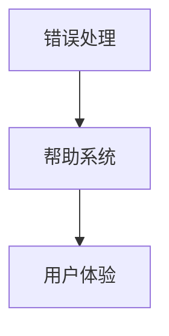

##### 核心算法原理讲解

1. **错误处理**：错误处理的基本原理包括：
   - **明确错误信息**：提供清晰的错误信息，让用户知道发生了什么问题。
   - **提供解决方案**：提供解决错误的方法和指导，帮助用户快速恢复。
   - **预防错误发生**：通过设计合理的操作流程和界面提示，减少用户犯错的可能性。

   以下是一个错误处理的基本原理伪代码：

   ```plaintext
   function handleError(error) {
     displayErrorMessage(error)
     provideSolutions(error)
     preventErrors(error)
   }
   ```

2. **帮助系统**：帮助系统的基本原理包括：
   - **内容丰富**：提供全面、详细的帮助内容，覆盖用户可能遇到的各种问题。
   - **易于访问**：帮助内容应易于查找和访问，如提供搜索功能和快速链接。
   - **交互友好**：帮助内容的呈现方式应友好，如使用图文结合、步骤提示等。

   以下是一个帮助系统的基本原理伪代码：

   ```plaintext
   function designHelpSystem(helpContent) {
     displayHelpContent(helpContent)
     provideSearchFunctionality(helpContent)
     provideQuickLinks(helpContent)
   }
   ```

3. **用户体验**：用户体验的基本原理包括：
   - **易用性**：设计易用的错误处理和帮助系统，降低用户的学习成本。
   - **效率**：设计高效的错误处理和帮助系统，提高用户的操作效率。

   以下是一个用户体验的基本原理伪代码：

   ```plaintext
   function enhance用户体验(interface) {
     if (isUserFriendly(interface)) {
       display(interface)
     } else {
       optimizeInterface(interface)
     }
   }
   ```

##### 数学模型和数学公式 & 详细讲解 & 举例说明

在错误处理与帮助系统中，可以使用数学模型来计算用户的错误率和满意度。以下是一个简单的数学模型：

1. **错误率**：错误率可以通过用户操作错误的次数来计算。以下是一个错误率的计算模型：

   $$ \text{错误率} = \frac{\text{错误次数}}{\text{总操作次数}} $$

   其中，错误次数为用户操作错误的次数，总操作次数为所有用户的操作次数。

举例说明，假设有两个用户A和B，他们的错误次数分别为5次和10次，总操作次数为20次，我们可以计算用户A和B的错误率：

用户A的错误率：

$$ \text{错误率}_A = \frac{5}{20} = 0.25 $$

用户B的错误率：

$$ \text{错误率}_B = \frac{10}{20} = 0.5 $$

2. **满意度**：满意度可以通过用户对错误处理和帮助系统的评分来计算。以下是一个满意度的计算模型：

   $$ \text{满意度} = \frac{\text{评分}}{\text{评分总数}} $$

   其中，评分为用户对错误处理和帮助系统的评分，评分总数为所有用户的评分总和。

举例说明，假设有三个用户A、B和C，他们对错误处理和帮助系统的评分分别为4、5和3，评分总数为12，我们可以计算用户的满意度：

用户A的满意度：

$$ \text{满意度}_A = \frac{4}{12} = 0.333 $$

用户B的满意度：

$$ \text{满意度}_B = \frac{5}{12} = 0.417 $$

用户C的满意度：

$$ \text{满意度}_C = \frac{3}{12} = 0.25 $$

### 第10章：个性化设计

##### 背景介绍

个性化设计是提升用户界面操作友好性的重要手段。个性化设计旨在根据用户的行为习惯和偏好，为用户提供定制化的用户体验。通过个性化设计，用户可以获得更符合自己需求的服务和内容，从而提升使用体验。本节将介绍个性化设计的核心概念、设计方法和案例分析。

##### 核心概念与联系

1. **个性化设计**：个性化设计是指根据用户的行为习惯和偏好，为用户提供定制化的用户体验。
2. **用户行为分析**：用户行为分析是指通过分析用户的操作记录和行为数据，了解用户的需求和偏好。
3. **用户体验**：用户体验是指用户在使用界面过程中感受到的整体感受，包括易用性、效率、满意度等。

核心概念之间的关系可以用以下Mermaid流程图表示：

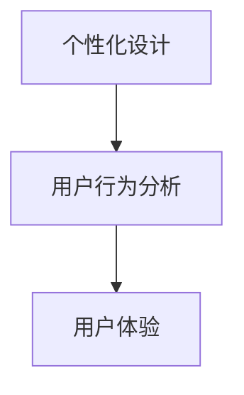

##### 核心算法原理讲解

1. **个性化设计**：个性化设计的基本原理包括：
   - **用户行为分析**：通过分析用户的操作记录和行为数据，了解用户的需求和偏好。
   - **界面定制**：根据用户的行为分析结果，为用户提供个性化的界面和功能。

   以下是一个个性化设计的基本原理伪代码：

   ```plaintext
   function designPersonalizedInterface(userBehavior) {
     analyzeUserBehavior(userBehavior)
     personalizeInterface(userBehavior)
   }
   ```

2. **用户行为分析**：用户行为分析的基本原理包括：
   - **数据收集**：收集用户的操作记录和行为数据。
   - **数据分析**：通过数据分析，提取用户的行为模式和偏好。

   以下是一个用户行为分析的基本原理伪代码：

   ```plaintext
   function analyzeUserBehavior(userBehavior) {
     collectUserBehaviorData(userBehavior)
     analyzeData(userBehaviorData)
   }
   ```

3. **用户体验**：用户体验的基本原理包括：
   - **个性化推荐**：根据用户的行为分析结果，为用户提供个性化的推荐和内容。
   - **界面定制**：根据用户的行为分析结果，为用户提供定制化的界面布局和颜色方案。

   以下是一个用户体验的基本原理伪代码：

   ```plaintext
   function enhance用户体验(userExperience) {
     if (isPersonalized(userExperience)) {
       personalize用户体验(userExperience)
     } else {
       standard用户体验(userExperience)
     }
   }
   ```

##### 数学模型和数学公式 & 详细讲解 & 举例说明

在个性化设计中，可以使用数学模型来计算用户的个性化程度和满意度。以下是一个简单的数学模型：

1. **个性化程度**：个性化程度可以通过用户对个性化功能的接受程度来计算。以下是一个个性化程度的计算模型：

   $$ \text{个性化程度} = \frac{\text{个性化功能使用次数}}{\text{总功能使用次数}} $$

   其中，个性化功能使用次数为用户使用的个性化功能的次数，总功能使用次数为所有用户使用的功能次数。

举例说明，假设有两个用户A和B，他们的个性化功能使用次数分别为10次和20次，总功能使用次数为30次，我们可以计算用户A和B的个性化程度：

用户A的个性化程度：

$$ \text{个性化程度}_A = \frac{10}{30} = 0.333 $$

用户B的个性化程度：

$$ \text{个性化程度}_B = \frac{20}{30} = 0.667 $$

2. **满意度**：满意度可以通过用户对个性化功能的评分来计算。以下是一个满意度的计算模型：

   $$ \text{满意度} = \frac{\text{评分}}{\text{评分总数}} $$

   其中，评分为用户对个性化功能的评分，评分总数为所有用户的评分总和。

举例说明，假设有三个用户A、B和C，他们对个性化功能的评分分别为4、5和3，评分总数为12，我们可以计算用户的满意度：

用户A的满意度：

$$ \text{满意度}_A = \frac{4}{12} = 0.333 $$

用户B的满意度：

$$ \text{满意度}_B = \frac{5}{12} = 0.417 $$

用户C的满意度：

$$ \text{满意度}_C = \frac{3}{12} = 0.25 $$

### 附录

#### 附录1：用户界面设计工具与资源

1. **用户界面设计工具**：
   - **Sketch**：一款强大的用户界面设计工具，适用于Mac系统。
   - **Adobe XD**：一款跨平台的用户界面设计工具，提供了丰富的交互设计功能。
   - **Figma**：一款基于Web的协作式用户界面设计工具，支持多人实时协作。

2. **用户界面设计资源网站**：
   - **UI Movement**：一个关于用户界面设计的资源网站，提供了丰富的设计灵感和教程。
   - **UI Patterns**：一个关于用户界面设计模式的资源网站，涵盖了各种常见的设计模式。

3. **用户界面设计学习指南**：
   - **《用户界面设计原理》**：一本关于用户界面设计的经典教材，详细介绍了设计原理和实践方法。

作者：AI天才研究院/AI Genius Institute & 禅与计算机程序设计艺术 /Zen And The Art of Computer Programming

