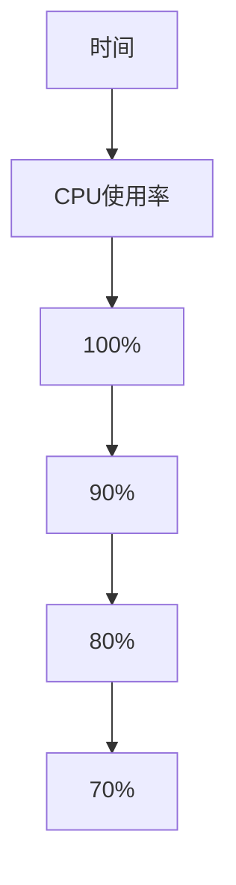
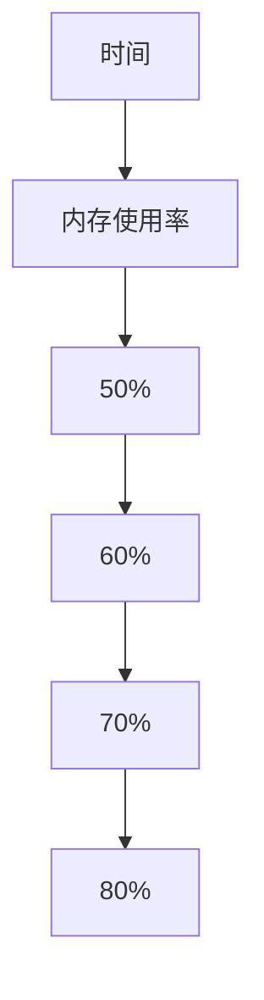
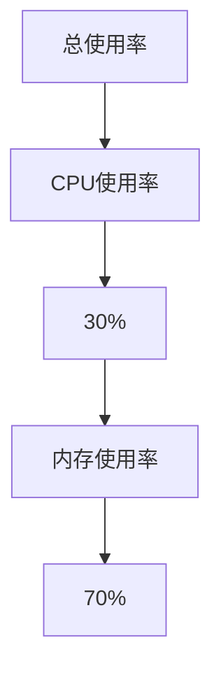

                 

### 第1章 绪论

#### 1.1 监控与告警概述

**核心概念**：
监控（Monitoring）是指通过一定的手段和技术，对系统、应用、服务器、网络等各种资源的状态、性能、健康度进行实时观测和记录。其目的是及时发现异常情况，确保系统稳定运行，预防潜在故障。
告警（Alerting）是监控的一个重要环节，当监控到系统出现异常或达到预设的阈值时，会通过邮件、短信、手机APP等方式通知相关人员，提醒他们及时处理问题。

**联系**：
监控和告警是紧密相连的，监控是基础，告警是延伸。监控负责数据的采集和状态检测，而告警则负责将异常情况通知给相关人员。二者共同保障了系统的稳定性和可靠性。

**目的**：
监控的主要目的是确保系统在正常运作时能够提供稳定的服务，同时及时发现异常情况，防止小问题演变成大故障。告警的目的是快速响应异常，减少故障处理时间，降低业务损失。

#### 1.2 监控与告警的重要性

**影响**：
监控与告警在系统稳定性和安全性中扮演着至关重要的角色。它们可以帮助企业及时发现并处理系统故障，防止业务中断，减少因故障带来的经济损失。
- **系统稳定性**：通过监控，可以实时掌握系统的运行状态，确保系统在最佳状态下运行。
- **安全性**：监控可以帮助发现潜在的安全威胁，如恶意攻击、配置错误等，确保系统的安全性。

**案例**：
以电商平台为例，其业务依赖于高可用性和稳定性，监控系统可以实时检测服务器负载、数据库状态、网络连接等关键指标，确保系统稳定运行。一旦发现异常，告警系统会立即通知运维团队进行处理，以避免因故障导致的订单处理失败、数据丢失等严重问题。

**原因**：
随着企业业务的不断扩展和复杂度的增加，系统中的各个组件和资源之间的依赖关系也变得更加复杂。监控和告警系统可以帮助运维团队更好地管理和监控这些复杂系统，提高整体运维效率。

**必要性**：
在当今快速发展的数字化时代，企业的业务对系统的依赖性越来越强。系统一旦出现故障，将会导致业务中断，影响企业的声誉和客户满意度。因此，监控和告警系统成为企业运维不可或缺的一部分。

#### 1.3 本书结构

**章节安排**：
本书将从基础架构、核心概念、设计与实现、数据采集与处理、常用工具、告警策略、实战案例分析以及发展趋势等方面，全面深入地介绍评测系统的监控和告警机制。
- **第1章 绪论**：概述监控与告警的基本概念、重要性及其在评测系统中的应用。
- **第2章 评测系统的基础架构**：介绍评测系统的组成、数据流和常见架构模式。
- **第3章 监控核心概念与原理**：讲解监控的定义、目标和核心指标。
- **第4章 告警系统设计与实现**：探讨告警系统的设计、架构和实现步骤。
- **第5章 监控数据的采集与处理**：介绍监控数据采集、处理和可视化的方法。
- **第6章 常见监控工具与技术**：介绍常用的监控工具和技术。
- **第7章 告警策略与优化**：探讨告警策略的制定、优化和误报处理。
- **第8章 实际案例分析与实战**：分析实际案例，探讨监控与告警系统的应用实践。
- **第9章 监控与告警系统的发展趋势**：展望监控与告警系统的未来发展趋势。

**逻辑关系**：
各章节之间相互关联，共同构建了一个完整的监控与告警体系。第1章作为绪论，奠定了全书的基础。第2章到第4章介绍了评测系统的监控与告警基础，第5章到第7章深入探讨了监控数据采集、处理和告警策略，第8章通过实际案例分析加深了读者对理论知识的理解，第9章则展望了监控与告警系统的未来发展趋势。

通过本书的系统学习，读者可以全面掌握评测系统的监控与告警机制，提升系统运维能力，确保业务的稳定运行。

### 第2章 评测系统的基础架构

#### 2.1 评测系统的组成

**评测系统的基本组件**：

评测系统通常由以下几个关键组件组成：

1. **评测服务器**：负责执行评测任务，如运行测试用例、收集评测结果等。
2. **数据库**：存储评测数据，包括评测结果、用户信息、测试数据等。
3. **用户界面**：提供给用户进行评测任务创建、结果查看等操作的界面。
4. **日志系统**：记录系统运行日志，用于故障排查和性能分析。

**各组件的作用**：

- **评测服务器**：评测服务器是评测系统的核心，它负责处理评测任务，运行测试脚本，生成评测结果。其性能和稳定性直接影响到整个评测系统的运行效果。
- **数据库**：数据库用于存储评测数据，包括用户信息、测试数据和评测结果。它需要具备高可靠性、高并发性和数据安全性等特点，以确保数据的一致性和完整性。
- **用户界面**：用户界面是用户与评测系统交互的入口，通过用户界面，用户可以创建评测任务、查看评测结果、调整评测参数等。用户界面的设计需要直观易用，以提升用户体验。
- **日志系统**：日志系统用于记录系统的运行日志，包括系统错误、警告、信息等。日志系统可以帮助运维团队快速定位问题，分析系统性能，优化系统配置。

#### 2.2 评测系统的数据流

**评测系统的数据流流程**：

1. **用户提交评测任务**：用户通过用户界面提交评测任务，任务包括测试用例、评测参数等。
2. **任务分发**：评测服务器接收到任务后，将其分发到不同的测试节点上，每个测试节点运行相应的测试脚本。
3. **数据采集**：测试节点在运行测试脚本的过程中，会采集各种测试数据，如运行时间、资源消耗、错误日志等。
4. **数据存储**：采集到的测试数据被传输回评测服务器，并由评测服务器将其存储到数据库中。
5. **结果计算**：评测服务器根据测试数据计算评测结果，如评分、排名等。
6. **结果展示**：评测结果通过用户界面展示给用户。

**数据类型**：

- **用户数据**：包括用户信息、评测任务参数等。
- **测试数据**：包括测试脚本、输入数据、输出结果等。
- **日志数据**：包括系统运行日志、错误日志、警告日志等。
- **结果数据**：包括评测结果、评分、排名等。

#### 2.3 评测系统的常见架构模式

**集中式架构**：

在集中式架构中，所有评测任务都由评测服务器处理，测试节点仅负责执行测试脚本。优点是架构简单，易于维护。缺点是评测服务器成为性能瓶颈，无法处理大量并发任务。

**分布式架构**：

在分布式架构中，评测服务器负责任务分发和结果计算，测试节点分散在不同服务器上，负责执行测试脚本。优点是可扩展性强，能处理大量并发任务。缺点是架构复杂，维护成本高。

**混合式架构**：

混合式架构结合了集中式和分布式架构的优点，评测服务器负责核心任务的执行，而部分计算任务由测试节点处理。优点是性能和可扩展性平衡，易于维护。缺点是架构设计复杂。

**微服务架构**：

在微服务架构中，评测系统被分解为多个独立的服务，如用户服务、任务服务、测试服务、结果服务等。每个服务负责不同的功能，独立部署和扩展。优点是灵活性强，易于维护。缺点是架构复杂，需要良好的服务治理和监控。

**案例**：

以电商平台为例，其评测系统采用了分布式架构，评测服务器负责任务分发和结果计算，测试节点分散在多个服务器上，负责执行测试脚本。这种架构能高效处理大量评测任务，确保系统稳定运行。

通过以上分析，我们可以看到评测系统的组成、数据流和常见架构模式。这些基础知识为后续章节的深入探讨提供了坚实的基础。

### 第3章 监控核心概念与原理

#### 3.1 监控的定义与目标

**定义**：
监控（Monitoring）是指对系统、应用、服务器、网络等资源进行实时观测、记录和分析，以检测其运行状态、性能和健康度。监控的目标是确保系统稳定运行，预防故障，优化资源利用。

**核心概念**：
- **监控指标**：监控系统中用来衡量系统性能和健康度的各种度量指标，如CPU使用率、内存占用、磁盘空间、网络延迟等。
- **监控周期**：监控系统对资源状态进行检测的频率，如每分钟、每小时或每天一次。
- **阈值**：监控指标达到某个特定值时触发的告警条件。

**联系**：
监控指标和阈值是监控系统的核心概念。监控指标反映了系统的运行状态，而阈值则是判断系统是否正常的标准。当监控指标超过阈值时，监控系统会触发告警，提醒运维人员采取行动。

**目标**：
- **确保系统稳定性**：通过实时监控，及时发现系统异常，确保系统在高负载和突发情况下仍能稳定运行。
- **预防故障**：通过监控指标的分析，预测潜在故障，提前采取预防措施，避免系统故障对业务造成影响。
- **优化资源利用**：通过监控数据的分析，识别系统瓶颈，优化资源配置，提高系统性能和效率。

**应用场景**：
- **服务器监控**：监控服务器资源使用情况，确保服务器稳定运行。
- **应用监控**：监控应用性能和健康度，确保应用在最佳状态下运行。
- **网络监控**：监控网络状态，确保网络连接稳定，数据传输畅通。
- **数据库监控**：监控数据库性能和健康度，确保数据存储和访问稳定。

#### 3.2 监控的核心指标

**常用监控指标**：
- **CPU使用率**：衡量CPU的利用程度，CPU使用率过高可能导致系统性能下降。
- **内存占用**：衡量系统内存的使用情况，内存占用过高可能导致系统卡顿或崩溃。
- **磁盘空间**：衡量磁盘剩余空间，磁盘空间不足可能导致系统无法正常运行。
- **网络流量**：衡量网络数据的传输速率，网络流量过高可能导致网络拥堵。
- **响应时间**：衡量系统对请求的响应时间，响应时间过长可能导致用户体验不佳。
- **并发连接数**：衡量系统同时处理的连接数，并发连接数过高可能导致系统过载。

**重要性**：
监控指标是监控系统的核心，它们反映了系统的运行状态和健康度。通过监控这些指标，可以及时发现系统异常，预测潜在故障，优化系统性能。

**测量方法**：
- **系统内置工具**：许多操作系统和应用提供了内置的监控工具，如Linux的top、htop，Windows的系统监视器。
- **第三方监控工具**：如Prometheus、Grafana、Nagios等，这些工具提供了丰富的监控指标和可视化的数据展示。

**联系**：
监控指标之间的关系错综复杂。例如，CPU使用率过高可能导致内存占用增加，进而影响磁盘读写速度，最终导致响应时间变长。因此，监控指标需要综合分析，以全面了解系统状态。

#### 3.3 监控的基本原理

**监控机制**：
监控系统通常包括以下几个基本机制：

1. **数据采集**：通过采集工具（如agent、exporter）收集系统性能数据。
2. **数据存储**：将采集到的数据存储在数据库或时间序列数据库中。
3. **数据处理**：对存储的数据进行计算、分析和聚合。
4. **告警触发**：当监控指标超过阈值时，触发告警通知。
5. **告警处理**：运维人员根据告警信息采取相应措施，解决问题。

**监控架构**：
监控系统通常采用分布式架构，包括以下几个核心组件：

1. **数据采集器**：负责从各个节点采集性能数据。
2. **监控系统**：负责存储、处理和分析数据，并提供数据可视化和告警功能。
3. **告警通知系统**：负责发送告警通知，如邮件、短信、即时通讯工具等。

**监控流程**：

1. **数据采集**：数据采集器定期采集系统性能数据。
2. **数据存储**：采集到的数据存储在时间序列数据库中。
3. **数据处理**：监控系统对存储的数据进行计算和分析。
4. **告警触发**：当监控指标超过阈值时，监控系统触发告警。
5. **告警通知**：告警通知系统将告警信息发送给相关人员。
6. **告警处理**：运维人员根据告警信息采取相应措施，解决问题。

**联系**：
监控机制和监控架构共同构成了监控系统的基本框架。数据采集、存储、处理和告警触发是监控系统运行的核心环节。通过分布式架构，监控系统可以高效地监控大量节点，提供实时、可靠的数据分析和告警功能。

通过本章的介绍，我们对监控系统的基本概念、核心指标和基本原理有了更深入的了解。这些知识为后续章节的详细探讨奠定了基础。

### 第4章 告警系统设计与实现

#### 4.1 告警系统的设计与目标

**设计目标**：
告警系统的设计目标主要包括以下几个方面：
1. **快速响应**：在监控系统检测到异常情况时，告警系统能够迅速通知相关人员，避免问题扩大。
2. **准确性**：告警系统能够准确判断异常情况，避免误报和漏报，提高告警的可靠性。
3. **可扩展性**：告警系统应能够支持系统规模的扩展，适应不断变化的业务需求。
4. **易维护性**：告警系统应具有良好的可维护性，便于运维人员调试和优化。

**设计原则**：
1. **模块化**：将告警系统的功能模块化，便于扩展和维护。
2. **高可用性**：确保告警系统的稳定性和可靠性，防止因自身故障导致业务中断。
3. **灵活配置**：提供灵活的配置选项，如阈值设置、告警方式、通知对象等，满足不同业务的个性化需求。
4. **集中化管理**：实现告警信息的集中管理和统一处理，便于运维人员监控和管理。

**系统架构**：
告警系统的架构通常包括以下几个核心组件：

1. **监控代理**：负责采集系统的监控数据，并将数据发送到监控服务器。
2. **监控服务器**：负责处理监控数据，计算监控指标，并根据阈值判断是否触发告警。
3. **告警通知模块**：负责发送告警通知，如邮件、短信、手机APP等。
4. **告警记录模块**：负责记录告警信息，包括告警时间、告警类型、处理状态等。
5. **告警策略管理**：负责管理告警策略，如阈值设置、告警规则等。

**关键组件及其作用**：
- **监控代理**：负责实时采集系统监控数据，并将其发送到监控服务器。其性能直接影响告警系统的响应速度和准确性。
- **监控服务器**：负责处理监控数据，计算监控指标，并根据阈值判断是否触发告警。其处理能力和稳定性对整个告警系统的性能至关重要。
- **告警通知模块**：负责发送告警通知，将告警信息及时通知给相关人员。其通知方式的多样性和及时性对问题处理速度有重要影响。
- **告警记录模块**：负责记录告警信息，便于后续查询和分析。其数据的完整性和准确性对故障排查和性能优化有重要参考价值。
- **告警策略管理**：负责管理告警策略，包括阈值设置、告警规则等。其配置的合理性和灵活性对告警系统的效果有直接影响。

**实现步骤**：

1. **需求分析**：根据业务需求，明确告警系统的功能、性能和可靠性要求。
2. **设计架构**：根据需求分析，设计告警系统的架构，确定各组件的功能和交互方式。
3. **技术选型**：选择合适的监控代理、监控服务器、告警通知模块等组件，确保系统性能和稳定性。
4. **开发与部署**：开发告警系统，并进行系统测试和部署。
5. **优化与维护**：根据实际运行情况，对告警系统进行性能优化和功能维护，确保其稳定可靠运行。

**联系**：
告警系统的设计与实现需要综合考虑系统的性能、可靠性、可扩展性和易维护性。通过模块化设计，可以方便后续的扩展和维护。监控代理、监控服务器、告警通知模块等关键组件的合理配置和优化，对告警系统的效果至关重要。在实现过程中，需要严格遵循设计原则和步骤，确保系统的高效稳定运行。

#### 4.2 告警系统的架构

**架构设计**：
告警系统的架构设计需要综合考虑系统的性能、可扩展性、可靠性和易维护性。以下是一种常见的告警系统架构设计：

1. **数据采集层**：负责从各个监控点（如服务器、应用、网络设备等）采集监控数据，并将其发送到监控服务器。
2. **数据处理层**：负责接收和存储监控数据，对数据进行处理和分析，计算监控指标，并根据阈值判断是否触发告警。
3. **告警通知层**：负责发送告警通知，将告警信息通过邮件、短信、手机APP等方式通知相关人员。
4. **告警记录层**：负责记录告警信息，包括告警时间、告警类型、处理状态等，便于后续查询和分析。
5. **告警策略层**：负责管理告警策略，包括阈值设置、告警规则等，确保告警系统的合理性和灵活性。

**各层功能**：

1. **数据采集层**：
   - **功能**：采集监控数据，包括CPU使用率、内存占用、磁盘空间、网络流量等。
   - **技术**：可以使用agent、exporter等技术进行数据采集，支持自定义监控指标。
   - **联系**：数据采集层的性能直接影响告警系统的响应速度和准确性。

2. **数据处理层**：
   - **功能**：接收和存储监控数据，对数据进行处理和分析，计算监控指标。
   - **技术**：可以使用Prometheus、Grafana等开源监控工具进行数据处理，支持复杂查询和告警规则配置。
   - **联系**：数据处理层是告警系统的核心，其处理能力和稳定性对整个系统的性能至关重要。

3. **告警通知层**：
   - **功能**：发送告警通知，将告警信息通过邮件、短信、手机APP等方式通知相关人员。
   - **技术**：可以使用SMTP、HTTP API等技术进行告警通知，支持自定义通知方式和通知内容。
   - **联系**：告警通知层的及时性和可靠性对问题处理速度和业务连续性有重要影响。

4. **告警记录层**：
   - **功能**：记录告警信息，包括告警时间、告警类型、处理状态等，便于后续查询和分析。
   - **技术**：可以使用数据库、日志文件等技术进行告警记录，支持告警信息的持久化和查询。
   - **联系**：告警记录层的数据完整性和准确性对故障排查和性能优化有重要参考价值。

5. **告警策略层**：
   - **功能**：管理告警策略，包括阈值设置、告警规则等，确保告警系统的合理性和灵活性。
   - **技术**：可以使用配置文件、数据库等技术进行告警策略管理，支持自定义告警规则和阈值。
   - **联系**：告警策略层的设计和配置对告警系统的效果有直接影响，需要根据业务需求进行合理设置。

**架构模式**：
告警系统通常采用分布式架构模式，以确保系统的可扩展性和高可用性。分布式架构包括以下几个关键模式：

1. **集中式架构**：
   - **特点**：所有监控数据都发送到中心监控服务器进行处理和告警。
   - **优点**：架构简单，易于维护。
   - **缺点**：性能瓶颈明显，无法处理大量并发任务。

2. **分布式架构**：
   - **特点**：监控数据分布到多个监控服务器进行处理和告警。
   - **优点**：可扩展性强，性能更高。
   - **缺点**：架构复杂，维护成本高。

3. **混合式架构**：
   - **特点**：结合集中式和分布式架构的优点，核心任务由中心监控服务器处理，计算任务由分布式节点处理。
   - **优点**：性能和可扩展性平衡，易于维护。
   - **缺点**：架构设计复杂。

4. **微服务架构**：
   - **特点**：将告警系统分解为多个独立的服务，如数据采集服务、数据处理服务、告警通知服务等。
   - **优点**：灵活性强，易于维护。
   - **缺点**：架构复杂，需要良好的服务治理和监控。

**联系**：
告警系统的架构设计需要综合考虑系统的性能、可靠性、可扩展性和易维护性。通过分布式架构模式，可以实现高性能、高可靠性和可扩展性的告警系统。数据采集层、数据处理层、告警通知层、告警记录层和告警策略层的合理设计，对系统的整体性能和效果有重要影响。不同的架构模式适用于不同的业务需求，需要根据实际情况进行选择。

#### 4.3 告警系统的实现步骤

**实现步骤**：

1. **需求分析**：
   - **功能需求**：明确告警系统的功能需求，如监控指标选择、告警阈值设置、通知方式等。
   - **性能需求**：确定告警系统的性能需求，如数据采集频率、告警响应时间等。
   - **可靠性需求**：确保告警系统的稳定性和可靠性，如故障恢复能力、数据备份等。

2. **设计系统架构**：
   - **数据采集层**：设计数据采集方案，选择合适的采集工具和采集策略。
   - **数据处理层**：设计数据处理方案，确定数据处理流程和计算指标的方法。
   - **告警通知层**：设计告警通知方案，选择合适的通知工具和通知方式。
   - **告警记录层**：设计告警记录方案，确定告警记录的方法和存储策略。
   - **告警策略层**：设计告警策略方案，确定告警规则和阈值设置。

3. **选择技术栈**：
   - **数据采集工具**：如Prometheus、Zabbix等。
   - **数据处理工具**：如Grafana、Elasticsearch等。
   - **告警通知工具**：如SMTP、HTTP API等。
   - **告警记录工具**：如数据库、日志文件等。

4. **开发与部署**：
   - **开发**：按照设计架构，编写告警系统代码，并进行功能测试和集成测试。
   - **部署**：将告警系统部署到生产环境，并进行性能测试和稳定性测试。

5. **配置与优化**：
   - **配置**：根据业务需求，配置监控指标、告警阈值、通知方式等。
   - **优化**：根据系统性能监控结果，对系统进行性能优化和调优。

**伪代码**：

```python
# 数据采集伪代码
def collect_data():
    data = {}
    data['cpu_usage'] = get_cpu_usage()
    data['memory_usage'] = get_memory_usage()
    data['disk_space'] = get_disk_space()
    data['network_traffic'] = get_network_traffic()
    return data

# 数据处理伪代码
def process_data(data):
    cpu_usage = data['cpu_usage']
    memory_usage = data['memory_usage']
    disk_space = data['disk_space']
    network_traffic = data['network_traffic']
    if cpu_usage > threshold_cpu:
        trigger_alert('High CPU usage')
    if memory_usage > threshold_memory:
        trigger_alert('High memory usage')
    if disk_space < threshold_disk:
        trigger_alert('Low disk space')
    if network_traffic > threshold_network:
        trigger_alert('High network traffic')

# 告警通知伪代码
def send_alert(alert_message):
    send_email(alert_message)
    send_sms(alert_message)
    send_app_notification(alert_message)
```

**联系**：
告警系统的实现步骤包括需求分析、设计系统架构、选择技术栈、开发与部署、配置与优化。通过合理的系统架构设计和技术选型，可以构建高效、稳定的告警系统。伪代码展示了数据采集、数据处理和告警通知的基本实现过程，为实际开发提供了参考。

### 第5章 监控数据的采集与处理

#### 5.1 监控数据采集的方法

**采集工具**：
监控数据采集常用的工具包括Prometheus、Zabbix、Nagios等。这些工具提供了丰富的采集方式和插件，方便对不同类型的监控数据进行采集。

1. **Prometheus**：
   - **特点**：基于拉取模式（Pull Model）的数据采集，支持多维度的数据采集和存储。
   - **采集方式**：通过Prometheus的exporter插件，可以直接从服务或应用中拉取监控数据。
   - **应用场景**：适用于大规模分布式系统监控，支持自定义监控指标。

2. **Zabbix**：
   - **特点**：基于推送模式（Push Model）的数据采集，支持自动发现和监控。
   - **采集方式**：通过Zabbix的Agent插件，安装在被监控主机上，定期推送监控数据到Zabbix服务器。
   - **应用场景**：适用于中小型系统监控，易于部署和管理。

3. **Nagios**：
   - **特点**：基于推送模式的数据采集，支持插件扩展。
   - **采集方式**：通过Nagios的插件，安装在被监控主机上，定期执行检查任务并推送结果到Nagios服务器。
   - **应用场景**：适用于简单系统监控，插件丰富，但扩展性和性能有限。

**采集策略**：
监控数据采集策略主要包括定时采集、实时采集和按需采集。

1. **定时采集**：
   - **特点**：按照固定时间间隔（如每分钟、每小时）采集监控数据。
   - **优点**：简单可靠，易于实现。
   - **缺点**：可能无法实时反映系统状态，适合对实时性要求不高的监控场景。

2. **实时采集**：
   - **特点**：实时采集系统监控数据，根据需要调整采集频率（如秒级、毫秒级）。
   - **优点**：能更准确地反映系统状态，快速发现异常。
   - **缺点**：对系统资源要求较高，需要合理配置采集频率和并发数。

3. **按需采集**：
   - **特点**：根据系统状态或事件触发采集，灵活响应系统变化。
   - **优点**：资源利用率高，适合动态变化的监控场景。
   - **缺点**：实现复杂，需要根据业务需求设计采集逻辑。

**联系**：
监控数据采集的方法和策略需要根据业务需求和系统特点进行选择。Prometheus、Zabbix、Nagios等工具提供了多种采集方式和策略，可以根据实际需求进行灵活配置。定时采集、实时采集和按需采集各有优缺点，需要根据具体场景进行选择。

#### 5.2 监控数据处理流程

**数据处理流程**：
监控数据处理流程通常包括数据采集、数据存储、数据分析和数据可视化等步骤。

1. **数据采集**：
   - **步骤**：通过采集工具从各个监控点（如服务器、应用、网络设备等）采集监控数据。
   - **过程**：数据采集工具（如Prometheus的exporter）定期从服务或应用中拉取监控数据。

2. **数据存储**：
   - **步骤**：将采集到的监控数据存储到数据库或时间序列数据库中。
   - **过程**：Prometheus、InfluxDB等时间序列数据库支持高效的监控数据存储。

3. **数据分析**：
   - **步骤**：对存储的监控数据进行分析，计算监控指标，识别异常情况。
   - **过程**：使用PromQL（Prometheus的查询语言）等工具对监控数据进行计算和分析。

4. **数据可视化**：
   - **步骤**：将分析结果可视化，展示监控指标和异常情况。
   - **过程**：使用Grafana、Kibana等可视化工具将监控数据和分析结果进行展示。

**数据处理技术**：

1. **时间序列数据库**：
   - **特点**：专门设计用于存储时间序列数据的数据库，如InfluxDB、OpenTSDB。
   - **优势**：高效存储和查询时间序列数据，支持快速数据分析。

2. **流处理技术**：
   - **特点**：实时处理和分析流式数据，如Apache Kafka、Apache Flink。
   - **优势**：适用于大规模实时监控数据的高效处理和分析。

3. **机器学习技术**：
   - **特点**：通过机器学习算法对监控数据进行异常检测和预测。
   - **优势**：提高监控数据的分析能力和智能化水平。

**联系**：
监控数据处理流程涉及数据采集、存储、分析和可视化等步骤。时间序列数据库和流处理技术提供了高效的数据处理手段，而机器学习技术则提高了监控数据的分析和预测能力。合理选择和处理监控数据，可以更好地反映系统状态，发现异常情况，提升系统监控效果。

#### 5.3 监控数据可视化

**监控数据可视化的意义**：
监控数据可视化是将监控数据转化为图形化展示的过程，通过可视化的方式，可以使监控数据更加直观、易懂，有助于快速发现系统异常和性能瓶颈。

1. **数据展示**：将复杂的监控数据以图形化的形式展示，使得数据更加直观，易于理解。
2. **问题发现**：通过可视化展示，可以迅速发现系统中的异常情况，如性能瓶颈、资源使用异常等。
3. **决策支持**：监控数据可视化为运维人员提供了丰富的数据支持，有助于做出更准确的决策。

**常用工具**：

1. **Grafana**：
   - **特点**：支持多种数据源，提供丰富的可视化模板和自定义图表。
   - **应用场景**：适用于各类监控数据的可视化展示，特别是Prometheus数据的可视化。

2. **Kibana**：
   - **特点**：与Elasticsearch紧密集成，提供强大的数据分析和可视化功能。
   - **应用场景**：适用于日志数据的分析和可视化，尤其适合复杂查询和实时监控。

3. **Zabbix Web**：
   - **特点**：内置可视化功能，支持多种图表展示和趋势分析。
   - **应用场景**：适用于中小型系统监控，界面直观，易于使用。

**可视化方法**：

1. **趋势图**：
   - **特点**：展示监控数据随时间的变化趋势。
   - **应用场景**：适用于监控性能指标、资源使用情况等。

2. **柱状图**：
   - **特点**：展示各个监控指标的数值对比。
   - **应用场景**：适用于比较不同时间段或不同系统之间的监控指标。

3. **饼图**：
   - **特点**：展示监控数据在总数据中的占比。
   - **应用场景**：适用于展示资源分配情况、错误分布等。

4. **仪表板**：
   - **特点**：整合多种图表，提供一个全面的数据视图。
   - **应用场景**：适用于整体系统监控和性能分析。

**实例**：

**趋势图实例**：



**柱状图实例**：



**饼图实例**：



**联系**：
监控数据可视化是监控系统的关键环节，通过可视化工具，可以将监控数据转化为直观的图形，帮助运维人员快速发现系统异常和性能瓶颈。Grafana、Kibana、Zabbix Web等工具提供了丰富的可视化方法，可以根据实际需求进行选择和定制。合理运用可视化方法，可以提高监控效果，为系统运维提供有力支持。

### 第6章 常见监控工具与技术

#### 6.1 Prometheus

**介绍**：
Prometheus是一种开源监控解决方案，由SoundCloud开发，并捐赠给Cloud Native Computing Foundation进行维护。它采用拉取模式（Pull Model），支持多维度的数据采集和存储，提供了丰富的查询语言（PromQL）和可视化工具（Grafana）。

**主要特点**：
1. **时间序列数据库**：Prometheus内置了时间序列数据库（TSDB），支持高效存储和查询大量监控数据。
2. **服务发现**：Prometheus支持服务发现，可以自动发现和监控集群中的服务。
3. **灵活的查询语言**：PromQL支持对时间序列数据的高级查询和计算。
4. **告警管理**：Prometheus内置了告警管理功能，可以根据阈值和规则触发告警。
5. **插件扩展**：Prometheus支持多种exporter插件，可以采集各种监控数据。

**安装与配置**：
**安装**：
- **Docker安装**：
  ```shell
  docker pull prom/prometheus
  docker run -d -p 9090:9090 prom/prometheus
  ```
- **二进制安装**：
  - 下载二进制文件：
    ```shell
    wget https://github.com/prometheus/prometheus/releases/download/v2.37.0/prometheus-2.37.0.linux-amd64.tar.gz
    ```
  - 解压并启动：
    ```shell
    tar xvfz prometheus-2.37.0.linux-amd64.tar.gz
    cd prometheus-2.37.0.linux-amd64
    ./prometheus
    ```

**配置**：
- **配置文件**：Prometheus的配置文件位于`/etc/prometheus/prometheus.yml`，包含数据源、拉取配置、告警规则等。
  ```yaml
  global:
    scrape_interval: 15s
    evaluation_interval: 15s

  scrape_configs:
    - job_name: 'prometheus'
      static_configs:
      - targets: ['localhost:9090']
    - job_name: 'node'
      static_configs:
      - targets: ['10.0.0.1:9100']
  ```

**联系**：
Prometheus作为一种强大的开源监控工具，具有灵活的架构和丰富的功能，适用于各种规模的监控需求。通过安装和配置，可以快速搭建起一个高效的监控系统，实现对服务器、应用和网络等资源的全面监控。

#### 6.2 Grafana

**介绍**：
Grafana是一个开源的数据监控和可视化平台，由Torkel Ödegaard创立，并捐赠给Cloud Native Computing Foundation进行维护。它支持多种数据源，包括Prometheus、InfluxDB、MySQL、PostgreSQL等，提供了丰富的图表和仪表板，方便用户进行数据可视化和分析。

**主要特点**：
1. **多数据源支持**：Grafana可以连接多种数据源，支持各种格式和协议的数据。
2. **可视化模板**：Grafana提供了丰富的可视化模板，用户可以根据需求进行自定义。
3. **告警管理**：Grafana内置了告警管理功能，可以与Prometheus等监控工具集成。
4. **插件扩展**：Grafana支持插件扩展，可以增加额外的功能和数据源。
5. **用户界面**：Grafana的用户界面简洁易用，提供了直观的数据可视化体验。

**安装与配置**：
**安装**：
- **Docker安装**：
  ```shell
  docker pull grafana/grafana
  docker run -d -p 3000:3000 grafana/grafana
  ```
- **二进制安装**：
  - 下载二进制文件：
    ```shell
    wget https://s3-us-west-2.amazonaws.com/grafana-releases/release/grafana-8.5.5.linux-amd64.tar.gz
    ```
  - 解压并启动：
    ```shell
    tar xvfz grafana-8.5.5.linux-amd64.tar.gz
    cd grafana-8.5.5.linux-amd64
    ./bin/grafana-server start
    ```

**配置**：
- **配置文件**：Grafana的配置文件位于`/etc/grafana/grafana.ini`，包括数据源、告警、日志等设置。
  ```ini
  [server]
  http_addr = 0.0.0.0
  http_port = 3000

  [data]
  cookiesenabled = true

  [auth]
  admin_password = admin

  [logging]
  logformat = json
  loglevel = debug
  ```

**联系**：
Grafana作为一种强大的数据监控和可视化工具，支持多种数据源和丰富的可视化模板，适用于各类监控场景。通过安装和配置，可以快速搭建起一个高效的可视化监控系统，帮助用户更直观地理解监控数据，及时发现异常情况。

#### 6.3 Nagios

**介绍**：
Nagios是一个开源的IT基础设施监控工具，由Nagios Enterprises，LLC维护。它支持多种监控类型，包括服务状态、网络设备、应用程序等，提供了告警通知、日志记录和报表功能。

**主要特点**：
1. **全面的监控功能**：Nagios可以监控服务器、网络设备、应用程序等多种资源，支持多种检查插件。
2. **告警通知**：Nagios可以通过邮件、短信、手机APP等多种方式通知运维人员。
3. **日志记录**：Nagios可以记录系统运行日志，便于故障排查和问题分析。
4. **报表功能**：Nagios可以生成详细的系统性能报表，帮助用户了解系统状况。

**安装与配置**：
**安装**：
- **CentOS安装**：
  ```shell
  yum install epel-release
  yum install nagios nagios-plugins
  ```
- **Ubuntu安装**：
  ```shell
  apt-get update
  apt-get install nagios3 nagios-plugins3
  ```

**配置**：
- **配置文件**：Nagios的主要配置文件位于`/etc/nagios/nagios.cfg`，包括监控服务器、插件路径、告警通知等。
  ```shell
  # define the host definitions for all hosts to be monitored
  define host{
      host_name       localhost
      use             generic-host
      hostgroups      all-hosts
  }

  # define the service definitions for all services to be monitored
  define service{
      host_name       localhost
      service_description  CPU Usage
      check_command    check_cpu!100,90
      notifications     normal
  }
  ```

**联系**：
Nagios作为一种传统的开源监控工具，具有丰富的监控功能和强大的告警通知系统，适用于中小型企业的监控需求。通过安装和配置，可以快速搭建一个基本的监控系统，实现对服务器、网络和应用程序的全面监控。

### 第7章 告警策略与优化

#### 7.1 告警策略的制定

**告警策略的制定**：
告警策略的制定是监控与告警系统建设的关键环节，它直接影响监控系统的有效性和用户体验。以下是告警策略制定的关键步骤：

1. **需求分析**：
   - **业务需求**：了解业务系统的特点和关键性能指标（KPI），如响应时间、吞吐量、错误率等。
   - **用户需求**：与业务团队和运维团队沟通，明确他们对告警的通知方式和响应时间的要求。

2. **指标选择**：
   - **关键指标**：选择对业务影响较大的指标，如服务器CPU使用率、内存占用、磁盘空间、网络延迟等。
   - **个性化指标**：根据业务需求，定制个性化的监控指标，如应用层面的业务成功率、接口调用时间等。

3. **阈值设置**：
   - **阈值定义**：根据指标的重要性和业务容忍度，设置合理的阈值。阈值过高可能导致误报，过低可能导致漏报。
   - **动态阈值**：考虑使用动态阈值，根据历史数据和业务变化，自动调整阈值。

4. **通知方式**：
   - **通知渠道**：根据用户需求，选择合适的通知方式，如邮件、短信、手机APP、电话等。
   - **通知规则**：设定通知规则，如告警频率、重复通知间隔等，避免频繁打扰用户。

5. **告警规则**：
   - **告警条件**：定义告警触发条件，如指标超过阈值、持续异常等。
   - **告警级别**：设定告警级别，如正常、警告、紧急等，以区分不同级别的告警响应。

6. **测试与调整**：
   - **模拟测试**：在实际部署前，通过模拟测试验证告警策略的有效性。
   - **调整优化**：根据测试结果和用户反馈，不断调整和优化告警策略。

**联系**：
告警策略的制定需要综合考虑业务需求和用户需求，选择关键指标和合理的阈值，设置适当的告警条件和通知方式。通过需求分析和模拟测试，可以确保告警策略的有效性和用户体验。

#### 7.2 告警优化的方法

**告警优化方法**：
告警优化是确保监控系统能够准确、及时地发现并通知异常情况的关键步骤。以下是一些告警优化的方法：

1. **阈值优化**：
   - **动态阈值**：使用历史数据和机器学习算法，根据业务负载和趋势动态调整阈值，减少误报和漏报。
   - **个性化阈值**：根据不同业务场景和指标特性，定制个性化阈值，提高告警的准确性。

2. **告警聚合**：
   - **聚合策略**：将多个告警合并为一个，减少告警的噪音，避免频繁打扰。
   - **事件关联**：通过分析告警事件之间的关系，识别并处理关联事件，提高问题处理的效率。

3. **告警抑制**：
   - **抑制规则**：设置抑制规则，避免短时间内重复发送相同告警。
   - **错误抑制**：在确定错误原因和解决方案后，临时抑制相关告警，防止干扰。

4. **智能告警**：
   - **机器学习**：利用机器学习算法，预测潜在问题并提前发送告警，降低误报和漏报。
   - **基于知识的告警**：结合专家经验和历史数据，构建知识库，提高告警的准确性。

5. **告警通知优化**：
   - **通知渠道**：根据用户偏好和场景，选择合适的通知渠道，如邮件、短信、手机APP等。
   - **通知策略**：设定通知策略，如告警级别、重复通知间隔等，确保重要告警得到及时响应。

6. **告警处理流程**：
   - **自动化处理**：建立自动化告警处理流程，如自动重启服务、自动执行备份等。
   - **处理跟踪**：记录告警处理过程和结果，便于问题跟踪和改进。

**联系**：
告警优化方法包括阈值优化、告警聚合、告警抑制、智能告警、告警通知优化和告警处理流程等方面。通过综合运用这些方法，可以提高监控系统的告警准确性和响应效率，确保业务系统的稳定运行。

#### 7.3 告警误报与误判的解决

**告警误报与误判的原因**：
告警误报与误判是监控与告警系统中的常见问题，主要原因包括：
1. **阈值设置不合理**：阈值过高或过低，导致误报或漏报。
2. **系统负载变化**：系统负载波动大，导致监控指标异常。
3. **资源配置不足**：系统资源不足，导致性能下降，触发误报。
4. **网络问题**：网络延迟或丢包，影响监控数据的准确性。
5. **配置错误**：监控配置错误，如插件配置不正确、数据源选择错误等。

**解决方法**：

1. **阈值优化**：
   - **动态阈值**：根据业务负载和趋势动态调整阈值，减少误报。
   - **历史数据分析**：分析历史数据，调整阈值至合理范围。

2. **系统监控**：
   - **负载监控**：监控系统负载，识别负载波动的原因。
   - **资源监控**：监控系统资源使用情况，确保资源充足。

3. **网络监控**：
   - **网络状态**：监控网络延迟和丢包率，识别网络问题。
   - **链路监控**：监控网络链路状态，确保数据传输稳定。

4. **配置检查**：
   - **插件检查**：确保监控插件配置正确，无配置错误。
   - **数据源检查**：检查数据源连接，确保数据采集准确。

5. **告警聚合**：
   - **聚合策略**：将相关告警合并，减少告警噪音。
   - **事件关联**：分析告警事件间的关系，避免误判。

6. **智能告警**：
   - **机器学习**：利用机器学习算法，预测异常情况，减少误报。
   - **基于知识的告警**：结合专家经验和历史数据，提高告警准确性。

7. **用户培训**：
   - **告警处理**：培训运维人员，提高告警处理能力。
   - **操作规范**：制定操作规范，确保告警处理流程一致。

**联系**：
解决告警误报与误判需要从多个方面入手，包括阈值优化、系统监控、网络监控、配置检查、告警聚合、智能告警和用户培训等。通过综合运用这些方法，可以提高监控系统的准确性，减少误报与误判，确保系统稳定运行。

### 第8章 实际案例分析与实战

#### 8.1 案例一：电商平台的监控与告警实践

**背景介绍**：
某大型电商平台，业务规模庞大，每天处理数百万次订单和交易，系统稳定性至关重要。为了确保系统稳定运行，电商平台需要建立一套完善的监控与告警系统，实时监控关键性能指标，及时发现和解决异常情况。

**监控指标**：
电商平台的监控指标包括：
- **服务器监控**：CPU使用率、内存占用、磁盘空间、网络延迟等。
- **应用监控**：订单处理延迟、交易成功率、数据库查询响应时间等。
- **数据库监控**：连接数、查询性能、存储容量等。
- **网络监控**：链路状态、丢包率、网络延迟等。

**监控架构**：
电商平台采用分布式架构，监控系统包括以下几个核心组件：
- **Prometheus**：作为监控系统，负责采集和存储监控数据。
- **Grafana**：作为可视化工具，负责展示监控数据和分析结果。
- **Nagios**：作为告警工具，负责发送告警通知。

**实现步骤**：

1. **数据采集**：
   - **Prometheus Exporter**：在服务器和应用中部署Prometheus Exporter，定期采集监控数据。
   - **数据库监控**：使用数据库监控工具，如mysqld_exporter，采集数据库监控数据。
   - **网络监控**：使用网络监控工具，如cAdvisor，采集网络监控数据。

2. **数据存储**：
   - **Prometheus Server**：将采集到的监控数据存储在Prometheus Server中，使用InfluxDB作为时间序列数据库。

3. **数据处理与可视化**：
   - **Grafana Dashboard**：在Grafana中创建Dashboard，可视化展示监控数据，包括服务器监控、应用监控、数据库监控和网络监控。
   - **告警规则**：在Grafana中配置告警规则，如CPU使用率超过80%、内存占用超过90%等。

4. **告警通知**：
   - **Nagios**：在Nagios中配置告警规则，当监控指标超过阈值时，发送邮件、短信和电话通知给运维团队。

**代码解读**：
```yaml
# Prometheus配置文件
global:
  scrape_interval: 15s
  evaluation_interval: 15s

scrape_configs:
  - job_name: 'prometheus'
    static_configs:
      - targets: ['localhost:9090']
  - job_name: 'node'
    static_configs:
      - targets: ['10.0.0.1:9100']
```

**应用解读与分析**：
- **数据采集**：Prometheus Exporter通过HTTP接口定期采集监控数据，包括CPU使用率、内存占用、磁盘空间等。数据库监控工具如mysqld_exporter则通过数据库的统计信息采集监控数据。
- **数据存储**：Prometheus Server作为时间序列数据库，存储采集到的监控数据，提供高效的查询和告警功能。
- **数据处理与可视化**：Grafana Dashboard将监控数据进行可视化展示，帮助运维人员快速发现异常情况。告警规则配置了监控指标的阈值，当指标超过阈值时，触发告警通知。
- **告警通知**：Nagios根据监控指标阈值触发告警，并通过邮件、短信和电话通知运维团队，确保及时处理异常情况。

**项目小结**：
通过部署Prometheus、Grafana和Nagios，电商平台建立了一套高效的监控与告警系统，实现了对服务器、应用、数据库和网络的全面监控。监控系统能够及时发现和解决异常情况，提高了系统稳定性和业务连续性。未来，可以考虑引入机器学习算法，优化告警策略，进一步提高监控系统的智能化水平。

#### 8.2 案例二：金融系统的监控与告警实践

**背景介绍**：
某金融公司拥有复杂的信息系统，包括多个交易系统、风险管理系统和客户服务平台。为了保障金融系统的稳定性和安全性，公司需要建立一套强大的监控与告警系统，实时监测系统运行状态，及时发现和解决异常情况。

**监控指标**：
金融系统的监控指标包括：
- **服务器监控**：CPU使用率、内存占用、磁盘空间、网络延迟等。
- **应用监控**：交易系统延迟、交易成功率、风险管理系统的错误率等。
- **数据库监控**：连接数、查询性能、存储容量等。
- **网络监控**：链路状态、丢包率、网络延迟等。
- **安全性监控**：入侵检测、DDoS攻击、安全漏洞等。

**监控架构**：
金融系统采用集中式监控架构，监控系统包括以下几个核心组件：
- **Zabbix**：作为监控系统，负责采集和存储监控数据。
- **Grafana**：作为可视化工具，负责展示监控数据和分析结果。
- **Nagios**：作为告警工具，负责发送告警通知。

**实现步骤**：

1. **数据采集**：
   - **Zabbix Agent**：在服务器和应用中部署Zabbix Agent，定期采集监控数据。
   - **数据库监控**：使用数据库监控工具，如MySQLtuner，采集数据库监控数据。
   - **安全性监控**：使用安全监控工具，如Nagios Security Extension（NSE），采集安全性监控数据。

2. **数据存储**：
   - **Zabbix Server**：将采集到的监控数据存储在Zabbix Server中，使用MySQL作为后端数据库。

3. **数据处理与可视化**：
   - **Grafana Dashboard**：在Grafana中创建Dashboard，可视化展示监控数据，包括服务器监控、应用监控、数据库监控、网络监控和安全性监控。
   - **告警规则**：在Zabbix中配置告警规则，如CPU使用率超过90%、内存占用超过95%等。

4. **告警通知**：
   - **Nagios**：在Nagios中配置告警规则，当监控指标超过阈值时，发送邮件、短信和电话通知给运维团队。

**代码解读**：
```shell
# Zabbix Agent配置文件
[Global]
Server=192.168.1.1
ServerPort=10050
DebugLevel=3
Timeout=30
User=zabbix
Password=zabbix
```

**应用解读与分析**：
- **数据采集**：Zabbix Agent定期采集服务器、应用、数据库和安全性监控数据，发送到Zabbix Server。MySQLtuner和Nagios NSE则分别负责数据库和安全性监控。
- **数据存储**：Zabbix Server将采集到的监控数据存储在MySQL数据库中，便于后续查询和分析。
- **数据处理与可视化**：Grafana Dashboard将监控数据进行可视化展示，帮助运维人员快速发现异常情况。告警规则配置了监控指标的阈值，当指标超过阈值时，触发告警通知。
- **告警通知**：Nagios根据监控指标阈值触发告警，并通过邮件、短信和电话通知运维团队，确保及时处理异常情况。

**项目小结**：
通过部署Zabbix、Grafana和Nagios，金融公司建立了一套强大的监控与告警系统，实现了对服务器、应用、数据库、网络和安全性等方面的全面监控。监控系统能够及时发现和解决异常情况，提高了系统稳定性和安全性。未来，可以考虑引入人工智能算法，进一步优化监控策略，提高告警准确性和响应速度。

#### 8.3 案例三：企业级监控与告警系统建设实践

**背景介绍**：
某大型企业拥有复杂的信息系统，包括多个业务部门、多个数据中心和多种应用系统。为了提高系统稳定性、降低运维成本，企业决定建设一套企业级监控与告警系统，实现对各个业务系统和基础设施的全面监控。

**监控指标**：
企业级监控指标包括：
- **基础设施监控**：CPU使用率、内存占用、磁盘空间、网络延迟、负载均衡器状态等。
- **应用监控**：Web应用响应时间、数据库查询性能、应用服务可用性等。
- **业务监控**：订单处理延迟、客户服务响应时间、交易成功率等。
- **安全性监控**：入侵检测、DDoS攻击、安全漏洞等。

**监控架构**：
企业级监控架构采用混合式架构，结合了集中式和分布式监控的优点，监控系统包括以下几个核心组件：
- **Prometheus**：作为监控系统，负责采集和存储监控数据。
- **Grafana**：作为可视化工具，负责展示监控数据和分析结果。
- **Nagios**：作为告警工具，负责发送告警通知。
- **Zabbix**：作为分布式监控工具，负责监控各个业务部门和数据中心。

**实现步骤**：

1. **数据采集**：
   - **Prometheus Exporter**：在服务器、应用和数据库中部署Prometheus Exporter，定期采集监控数据。
   - **Zabbix Agent**：在各个业务部门和数据中心的服务器中部署Zabbix Agent，定期采集监控数据。
   - **安全性监控**：使用安全监控工具，如OSSEC，采集安全性监控数据。

2. **数据存储**：
   - **Prometheus Server**：将采集到的监控数据存储在Prometheus Server中，使用InfluxDB作为时间序列数据库。
   - **Zabbix Server**：将Zabbix Agent采集到的监控数据存储在Zabbix Server中，使用MySQL作为后端数据库。

3. **数据处理与可视化**：
   - **Grafana Dashboard**：在Grafana中创建Dashboard，可视化展示监控数据，包括基础设施监控、应用监控、业务监控和安全性监控。
   - **告警规则**：在Prometheus和Zabbix中配置告警规则，如CPU使用率超过90%、内存占用超过95%、入侵检测等。

4. **告警通知**：
   - **Nagios**：在Nagios中配置告警规则，当监控指标超过阈值时，发送邮件、短信和电话通知给运维团队。

**代码解读**：
```yaml
# Prometheus告警规则示例
groups:
- name: 'example'
  rules:
  - alert: 'High CPU Usage'
    expr: `avg by (job) (cpu_usage{instance="server1"}) > 80`
    for: 5m
    labels:
      severity: 'high'
    annotations:
      summary: "High CPU usage on {{ $labels.instance }}"
```

**应用解读与分析**：
- **数据采集**：Prometheus Exporter定期采集服务器、应用和数据库的监控数据，Zabbix Agent采集各个业务部门和数据中心的监控数据。OSSEC负责采集安全性监控数据。
- **数据存储**：Prometheus Server使用InfluxDB作为时间序列数据库，存储监控数据。Zabbix Server使用MySQL作为后端数据库，存储监控数据。
- **数据处理与可视化**：Grafana Dashboard将Prometheus和Zabbix的监控数据进行可视化展示，帮助运维人员快速发现异常情况。告警规则配置了监控指标的阈值，当指标超过阈值时，触发告警通知。
- **告警通知**：Nagios根据监控指标阈值触发告警，并通过邮件、短信和电话通知运维团队，确保及时处理异常情况。

**项目小结**：
通过部署Prometheus、Grafana、Nagios和Zabbix，企业建立了一套高效的企业级监控与告警系统，实现了对基础设施、应用、业务和安全性等方面的全面监控。监控系统能够及时发现和解决异常情况，提高了系统稳定性和业务连续性。未来，企业可以考虑引入人工智能和机器学习算法，进一步优化监控策略，提高告警准确性和响应速度。

### 第9章 监控与告警系统的发展趋势

#### 9.1 人工智能在监控与告警中的应用

**人工智能技术简介**：
人工智能（AI）是一种模拟人类智能行为的技术，通过机器学习、深度学习等方法，使计算机具备识别模式、学习决策和自主改进的能力。在监控与告警系统中，人工智能技术的应用可以显著提高系统的智能化水平和响应效率。

**AI在监控中的应用**：
1. **异常检测**：利用机器学习算法，对监控数据进行实时分析，自动识别异常模式，提前发现潜在问题。例如，使用K-means聚类算法对CPU使用率进行聚类分析，识别异常值。
2. **趋势预测**：通过时间序列分析，预测系统的未来趋势，提前发现可能出现的性能瓶颈。例如，使用ARIMA模型对网络延迟进行预测，提前识别潜在的网络问题。
3. **智能告警**：结合历史数据和专家经验，自动调整告警阈值和规则，提高告警的准确性和有效性。例如，根据过去一年的监控数据，动态调整CPU使用率的告警阈值。

**AI在告警中的应用**：
1. **误报过滤**：通过机器学习算法，分析告警历史数据，识别误报模式，自动过滤误报告警，减少噪音。例如，使用决策树算法对告警数据进行分类，识别误报告警。
2. **自动响应**：结合自然语言处理技术，实现自动生成告警通知和故障诊断报告，自动化处理简单故障。例如，使用文本分类算法，将告警通知自动分类，并生成相应的故障诊断报告。
3. **智能调度**：根据告警的紧急程度和资源状态，自动调度运维人员，实现智能派单。例如，使用队列管理算法，根据告警的严重程度和响应时间，自动分配告警处理任务。

**联系**：
人工智能技术在监控与告警系统中的应用，提高了系统的智能化水平和响应效率。通过异常检测、趋势预测、智能告警、误报过滤、自动响应和智能调度等功能，人工智能技术显著提升了监控与告警系统的效果，为运维人员提供了更加高效、准确的监控服务。

#### 9.2 监控与告警系统的未来发展趋势

**技术演进方向**：
1. **云原生监控**：随着云原生技术的普及，监控与告警系统将更加紧密地与云平台集成，支持自动化部署、弹性扩展和动态资源管理。
2. **大数据监控**：监控与告警系统将采用大数据处理技术，支持海量监控数据的实时分析和处理，提供更加全面和深入的系统监控能力。
3. **智能化监控**：人工智能技术的应用将使监控与告警系统更加智能化，实现异常检测、趋势预测、自动响应等功能，提升系统的自主运维能力。
4. **开放式架构**：监控与告警系统将采用更加开放的架构，支持第三方服务和应用的无缝集成，提供更加灵活和定制化的监控解决方案。
5. **边缘计算监控**：随着边缘计算的发展，监控与告警系统将扩展到边缘设备，实现对边缘环境的全面监控和管理。

**发展挑战**：
1. **数据安全与隐私**：随着监控数据的增加，数据安全和隐私保护将成为重要挑战，监控与告警系统需要采取有效的数据加密和安全措施。
2. **系统集成与兼容性**：随着技术的不断发展，监控与告警系统需要面对更多的集成和兼容性问题，确保系统能够与各种应用和技术平台无缝对接。
3. **运维复杂性**：随着监控技术的演进，监控与告警系统的运维复杂性将增加，需要更多的专业知识和技能来维护和管理系统。

**解决方案**：
1. **数据安全与隐私**：采用加密技术保护监控数据，建立数据安全审计机制，确保数据在传输和存储过程中的安全性。同时，制定隐私保护策略，确保监控数据的合法使用。
2. **系统集成与兼容性**：采用标准化接口和协议，提高监控系统的兼容性和可扩展性。引入中间件和服务编排技术，实现不同监控系统的集成和管理。
3. **运维复杂性**：通过自动化运维工具和智能运维平台，提高监控与告警系统的运维效率和可靠性。建立运维团队的知识库和培训体系，提升运维人员的技能水平。

**联系**：
监控与告警系统的未来发展趋势包括云原生监控、大数据监控、智能化监控、开放式架构和边缘计算监控等方面。尽管面临数据安全与隐私、系统集成与兼容性、运维复杂性等挑战，通过采取有效的解决方案，可以推动监控与告警系统的技术演进和业务应用，为企业和组织的数字化发展提供坚实保障。

### 附录

#### A.1 监控与告警常用工具介绍

**Prometheus**：
- **特点**：开源监控系统，基于拉取模式，支持多维度的数据采集和存储。
- **使用场景**：适用于大规模分布式系统监控，特别是与Grafana结合使用。
- **配置**：通过`prometheus.yml`文件配置数据源、拉取策略和告警规则。

**Grafana**：
- **特点**：开源数据监控和可视化平台，支持多种数据源和丰富的图表模板。
- **使用场景**：适用于各种监控数据的可视化展示和告警通知。
- **配置**：通过Dashboard配置图表和告警规则，支持JSON和YAML文件格式。

**Nagios**：
- **特点**：开源IT基础设施监控工具，支持服务状态检查和告警通知。
- **使用场景**：适用于中小型系统监控，插件丰富。
- **配置**：通过配置文件`nagios.cfg`定义主机、服务和告警规则。

**Zabbix**：
- **特点**：开源企业级监控解决方案，支持自动发现和大规模监控。
- **使用场景**：适用于企业级监控，支持多种监控数据源和告警方式。
- **配置**：通过Web界面配置监控项、触发器和告警。

**Telegraf**：
- **特点**：开源监控系统，支持多种数据源和输出方式，可集成到InfluxDB和Prometheus等系统中。
- **使用场景**：适用于各种服务器、应用和网络设备的监控。
- **配置**：通过配置文件`telegraf.conf`配置数据源、输出方式和收集规则。

#### A.2 监控与告警系统搭建指南

**系统需求**：
- **硬件要求**：服务器，CPU 2核以上，内存 4GB以上，硬盘 100GB以上。
- **软件要求**：操作系统（如Linux），Java环境，Docker等。

**安装步骤**：

1. **准备环境**：
   - 安装操作系统。
   - 配置网络环境，确保所有节点可以相互通信。

2. **安装Prometheus**：
   - 使用Docker安装Prometheus：
     ```shell
     docker pull prom/prometheus
     docker run -d -p 9090:9090 prom/prometheus
     ```
   - 修改配置文件`prometheus.yml`，添加监控目标和规则。

3. **安装Grafana**：
   - 使用Docker安装Grafana：
     ```shell
     docker pull grafana/grafana
     docker run -d -p 3000:3000 grafana/grafana
     ```
   - 访问Grafana Web界面，创建Dashboard，连接Prometheus数据源。

4. **安装Nagios**：
   - 使用包管理器安装Nagios：
     ```shell
     apt-get install nagios3 nagios-plugins3
     ```
   - 配置Nagios，定义主机、服务和告警规则。

5. **安装Zabbix**：
   - 使用包管理器安装Zabbix Server、Zabbix Agent和Zabbix Web：
     ```shell
     apt-get install zabbix-server-mysql zabbix-agent zabbix-web
     ```
   - 配置Zabbix Server，设置数据库连接，配置Zabbix Agent。

6. **集成与优化**：
   - 配置Prometheus与Grafana的集成，确保数据可视化。
   - 配置Nagios与Zabbix的集成，实现告警互通。

**配置与优化**：
- **Prometheus**：调整`prometheus.yml`文件，优化数据采集频率和存储策略。
- **Grafana**：调整Dashboard和告警规则，确保监控数据的准确性和及时性。
- **Nagios**：调整配置文件，优化告警通知方式和阈值。
- **Zabbix**：优化监控项和触发器，提高告警的准确性和响应速度。

**联系**：
监控与告警系统的搭建需要综合考虑硬件需求、软件安装和配置。通过安装Prometheus、Grafana、Nagios和Zabbix等常用工具，可以搭建一个高效的监控与告警系统，实现对服务器、应用、网络和业务等方面的全面监控。在配置与优化过程中，需要根据实际需求进行调整，确保系统的稳定性和可靠性。

#### A.3 常见问题与解决方案

**问题1：监控数据采集失败**
- **原因**：网络故障、服务不可达、采集配置错误等。
- **解决方案**：检查网络连接，确保Prometheus Exporter、Zabbix Agent等采集工具正常运行。检查采集配置，确保目标地址、端口和协议正确。

**问题2：监控数据丢失**
- **原因**：时间序列数据库故障、数据采集错误、存储策略不合适等。
- **解决方案**：检查时间序列数据库（如InfluxDB、Prometheus）的运行状态和配置。调整存储策略，确保数据保留时间和数据压缩设置合理。

**问题3：告警通知失败**
- **原因**：邮件服务器故障、短信网关故障、配置错误等。
- **解决方案**：检查邮件服务器和短信网关的状态，确保其正常运行。检查告警通知配置，确保通知方式和通知地址正确。

**问题4：监控指标不准确**
- **原因**：数据采集工具配置错误、监控目标性能问题、阈值设置不合理等。
- **解决方案**：检查数据采集工具的配置，确保采集策略和指标计算方法正确。检查监控目标的性能，优化系统配置和资源分配。调整阈值设置，确保合理反映系统状态。

**问题5：监控系统性能下降**
- **原因**：数据量过大、数据处理瓶颈、系统资源不足等。
- **解决方案**：优化数据存储和查询策略，如分片存储、索引优化等。增加系统资源，如CPU、内存、磁盘等。调整数据采集频率和并发数，避免过载。

**联系**：
在监控与告警系统的运行过程中，可能会遇到各种问题。通过分析问题原因，采取相应的解决方案，可以确保监控系统的正常运行和高效性。常见问题包括数据采集失败、数据丢失、告警通知失败、监控指标不准确和系统性能下降等，需要针对具体情况采取有效的解决方案。同时，定期进行系统监控和性能优化，可以提高监控系统的稳定性和可靠性。

### 总结

在本文中，我们系统地介绍了评测系统的监控和告警机制。首先，我们概述了监控与告警的基本概念、重要性及其在评测系统中的应用。接着，我们详细分析了评测系统的组成、数据流和常见架构模式。随后，我们探讨了监控的核心概念与原理，包括监控的定义、目标、核心指标及其测量方法。然后，我们详细介绍了告警系统的设计与实现，包括告警系统的架构、实现步骤和关键组件。

在数据采集与处理方面，我们介绍了监控数据的采集方法、处理流程和数据可视化技术。此外，我们还介绍了常见监控工具与技术，如Prometheus、Grafana、Nagios和Zabbix。针对告警策略，我们探讨了告警策略的制定和优化方法，以及如何解决告警误报与误判问题。

通过实际案例的分析，我们展示了如何在实际场景中应用监控与告警机制，提高了系统稳定性和业务连续性。最后，我们展望了监控与告警系统的未来发展趋势，包括人工智能技术的应用和系统的演进方向。

本文的目标是让读者全面掌握评测系统的监控和告警机制，提升系统运维能力。通过本文的详细讲解，读者可以了解到监控与告警系统的核心概念、原理和应用方法，为实际工作提供指导。在未来的学习和实践中，读者可以根据本文的内容，结合具体业务需求，不断优化和提升监控与告警系统的效果。总之，本文旨在为读者提供一个完整的、深入的技术博客文章，帮助他们在IT运维领域取得更好的成果。作者：AI天才研究院/AI Genius Institute & 禅与计算机程序设计艺术 /Zen And The Art of Computer Programming。

