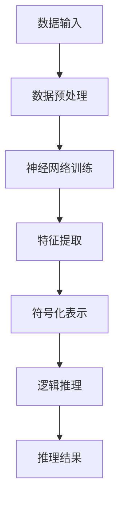
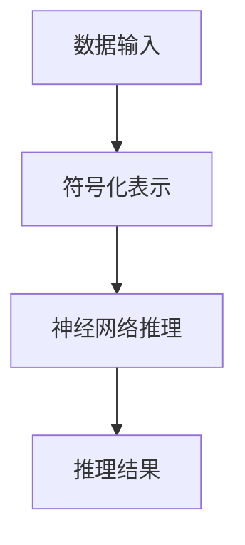

                 


### 文章标题：评测系统的神经符号推理引擎

> 关键词：神经符号推理、评测系统、神经网络、符号处理、算法、数学基础、实战应用、优化

> 摘要：本文详细探讨了评测系统的神经符号推理引擎，从概念、架构、算法、数学基础到实战应用，全面剖析了神经符号推理引擎的核心内容。通过对神经符号推理引擎的深入分析，本文旨在为读者提供一个全面理解神经符号推理引擎的视角，为后续研究和应用提供参考。

----------------------------------------------------------------

### 第1章：神经符号推理引擎概述

#### 1.1. 神经符号推理引擎的概念

神经符号推理引擎是一种结合神经网络和符号处理技术的智能系统，它利用神经网络处理数据并从中提取特征，同时利用符号处理技术进行逻辑推理和符号化表示。神经符号推理引擎的核心目标是实现数据的自动推理和知识表示，从而提高系统的智能水平。

神经符号推理引擎通常包括以下模块：

1. **数据预处理模块**：负责对输入数据进行预处理，包括数据清洗、标准化等。
2. **神经网络模块**：负责通过神经网络对数据进行特征提取和学习。
3. **符号处理模块**：负责对神经网络提取的特征进行符号化表示和逻辑推理。
4. **推理模块**：负责将符号化表示的结果进行推理和决策。

#### 1.2. 神经符号推理引擎的发展历程

神经符号推理引擎的发展可以追溯到20世纪80年代，当时人工智能领域开始探索将神经网络和逻辑推理相结合的方法。随着神经网络技术的不断发展和完善，神经符号推理引擎也逐渐成为一个独立的研究方向。

1. **早期探索（1980s-1990s）**：这一时期，研究者们开始尝试将神经网络和逻辑推理相结合，提出了许多早期的神经符号推理方法。
2. **快速发展（2000s）**：随着深度学习技术的兴起，神经符号推理引擎也得到了快速发展。研究者们开始利用深度学习技术对神经网络进行优化，从而提高了神经符号推理引擎的性能。
3. **应用拓展（2010s-至今）**：近年来，神经符号推理引擎在自然语言处理、图像处理、知识图谱等领域得到了广泛应用，取得了显著的成果。

#### 1.3. 神经符号推理引擎的应用领域

神经符号推理引擎具有广泛的应用前景，主要包括以下领域：

1. **自然语言处理**：神经符号推理引擎可以用于自然语言理解、文本生成、情感分析等任务，提高自然语言处理的智能化水平。
2. **图像处理**：神经符号推理引擎可以用于图像分类、目标检测、图像生成等任务，实现图像处理任务的自动化和智能化。
3. **知识图谱**：神经符号推理引擎可以用于知识表示、推理和发现，从而提高知识图谱的智能化水平。
4. **智能推理系统**：神经符号推理引擎可以用于构建智能推理系统，实现智能决策和自动化控制。

----------------------------------------------------------------

### 第2章：神经符号推理引擎的核心架构

#### 2.1. 神经网络的基础知识

神经网络（Neural Network）是一种模拟生物神经系统的计算模型，它由大量的神经元（Node）和连接（Connection）组成。每个神经元都可以接收输入信号，通过激活函数（Activation Function）处理后产生输出信号。

**基本架构**：

1. **输入层**：接收外部输入数据。
2. **隐藏层**：对输入数据进行处理和特征提取。
3. **输出层**：输出最终结果。

**激活函数**：

激活函数是神经网络中的一个关键组件，它用于将神经元的输入转换为输出。常见的激活函数包括：

1. **sigmoid函数**：$$f(x) = \frac{1}{1 + e^{-x}}$$
2. **ReLU函数**：$$f(x) = \max(0, x)$$
3. **Tanh函数**：$$f(x) = \frac{e^x - e^{-x}}{e^x + e^{-x}}$$

**神经网络的训练**：

神经网络的训练过程主要包括以下几个步骤：

1. **前向传播**：将输入数据传递到神经网络中，计算输出结果。
2. **反向传播**：根据输出结果和目标值，计算神经网络中的误差，并更新网络参数。
3. **优化算法**：常用的优化算法包括梯度下降（Gradient Descent）、随机梯度下降（Stochastic Gradient Descent，SGD）和Adam优化器等。

#### 2.2. 符号处理模块的设计

符号处理模块（Symbolic Processing Module）是神经符号推理引擎中的关键组成部分，它负责对神经网络提取的特征进行符号化表示和逻辑推理。符号处理模块通常包括以下几个子模块：

1. **符号化表示子模块**：将神经网络提取的特征表示为符号化的形式，便于进行逻辑推理。
2. **推理子模块**：利用逻辑推理算法对符号化表示的特征进行推理，从而生成结论。
3. **解释子模块**：对推理结果进行解释，使其更加易于理解和应用。

#### 2.3. 神经网络与符号处理的集成

神经网络与符号处理的集成是神经符号推理引擎的核心挑战之一。为了实现这一目标，研究者们提出了一系列集成方法，主要包括：

1. **前馈神经网络与逻辑推理的结合**：将神经网络与逻辑推理相结合，利用神经网络提取特征，再通过逻辑推理生成结论。
2. **图神经网络与逻辑推理的结合**：利用图神经网络对复杂关系进行建模，再通过逻辑推理进行推理和决策。
3. **混合推理模型**：将神经网络和逻辑推理分别应用于不同阶段，实现两者的优势互补。

#### 2.4. Mermaid流程图

以下是一个简单的神经符号推理引擎的Mermaid流程图，展示其基本架构：



#### 2.5. 伪代码

以下是一个简单的神经符号推理引擎的伪代码，展示其基本工作流程：

```python
# 数据输入
input_data = read_data()

# 数据预处理
preprocessed_data = preprocess_data(input_data)

# 神经网络训练
neural_network = train_neural_network(preprocessed_data)

# 特征提取
extracted_features = extract_features(preprocessed_data, neural_network)

# 符号化表示
symbolized_features = symbolize_features(extracted_features)

# 逻辑推理
inference_result = logical_inference(symbolized_features)

# 推理结果
print(inference_result)
```

----------------------------------------------------------------

### 第3章：神经符号推理算法

#### 3.1. 符号化表示与编码

符号化表示是神经符号推理算法中的重要环节，它将神经网络提取的特征表示为符号化的形式，便于进行逻辑推理。符号化表示主要包括以下几个方面：

1. **特征抽取**：利用神经网络提取输入数据的特征，通常包括数值特征和文本特征。
2. **特征编码**：将提取的特征转换为符号化的形式，常用的编码方法包括：
   - **One-Hot编码**：将每个特征映射到一个向量，其中每个元素表示该特征是否出现。
   - **嵌入编码**：将特征映射到一个高维空间，使其具有一定的相似性。
   - **标签传播编码**：利用已知的标签信息对特征进行编码，使其包含更多的语义信息。

#### 3.2. 基于神经网络的推理算法

基于神经网络的推理算法是神经符号推理算法的核心，它利用神经网络对输入数据进行特征提取和学习，从而实现推理任务。以下是一个基于神经网络的推理算法的基本步骤：

1. **前向传播**：将输入数据传递到神经网络中，通过神经网络进行特征提取和学习。
2. **损失函数**：定义损失函数，用于衡量神经网络输出和实际输出之间的差距，常用的损失函数包括均方误差（MSE）、交叉熵损失（Cross-Entropy Loss）等。
3. **反向传播**：利用反向传播算法计算损失函数关于神经网络参数的梯度，并更新网络参数。
4. **推理**：在训练完成后，利用训练好的神经网络对新的输入数据进行推理，生成推理结果。

以下是一个简单的基于神经网络的推理算法的伪代码：

```python
# 前向传播
output = forward_propagation(input_data, neural_network)

# 损失函数
loss = calculate_loss(output, target)

# 反向传播
gradient = backward_propagation(output, target, neural_network)

# 更新网络参数
update_network_params(neural_network, gradient)

# 推理
inference_result = forward_propagation(new_input_data, neural_network)
```

#### 3.3. 基于图神经网络的推理算法

基于图神经网络的推理算法是近年来发展起来的一种新型推理算法，它利用图神经网络对复杂关系进行建模，从而实现推理任务。以下是一个基于图神经网络的推理算法的基本步骤：

1. **图表示**：将输入数据表示为一个图，其中节点表示数据实体，边表示实体之间的关系。
2. **图神经网络训练**：利用图神经网络对图进行训练，提取图中的特征。
3. **图推理**：利用训练好的图神经网络对新的图进行推理，生成推理结果。

以下是一个简单的基于图神经网络的推理算法的伪代码：

```python
# 图表示
graph = represent_graph(input_data)

# 图神经网络训练
graph_neural_network = train_graph_neural_network(graph)

# 图推理
inference_result = graph_neural_network推理(graph)
```

#### 3.4. Mermaid流程图

以下是一个简单的神经符号推理算法的Mermaid流程图，展示其基本架构：



----------------------------------------------------------------

### 第4章：神经符号推理引擎的数学基础

#### 4.1. 神经网络的数学原理

神经网络是一种模拟生物神经系统的计算模型，其核心在于神经元之间的连接和激活函数。以下介绍神经网络的一些基本数学原理：

1. **神经元模型**：一个简单的神经元可以表示为：
   $$z = \sum_{i=1}^{n} w_{i} x_{i} + b$$
   其中，$z$表示神经元的输出，$w_{i}$表示神经元$i$的权重，$x_{i}$表示神经元$i$的输入，$b$表示偏置项。

2. **激活函数**：常用的激活函数包括：
   - **sigmoid函数**：$$f(x) = \frac{1}{1 + e^{-x}}$$
   - **ReLU函数**：$$f(x) = \max(0, x)$$
   - **Tanh函数**：$$f(x) = \frac{e^x - e^{-x}}{e^x + e^{-x}}$$

3. **前向传播**：神经网络的前向传播过程可以表示为：
   $$a_{l} = g(W_{l-1} a_{l-1} + b_{l-1})$$
   其中，$a_{l}$表示第$l$层的输出，$g$表示激活函数，$W_{l-1}$和$b_{l-1}$分别表示第$l-1$层的权重和偏置。

4. **反向传播**：神经网络的反向传播过程主要用于计算损失函数关于网络参数的梯度，其计算公式为：
   $$\delta_{l} = \frac{\partial L}{\partial a_{l}} = \frac{\partial L}{\partial z_{l}} \cdot \frac{\partial z_{l}}{\partial a_{l}}$$
   其中，$\delta_{l}$表示第$l$层的误差，$L$表示损失函数，$z_{l}$表示第$l$层的输出。

5. **优化算法**：常用的优化算法包括：
   - **梯度下降**：$$\theta_{t+1} = \theta_{t} - \alpha \cdot \nabla_{\theta} L$$
   其中，$\theta_{t}$表示第$t$次迭代的参数，$\alpha$表示学习率，$\nabla_{\theta} L$表示损失函数关于参数的梯度。
   - **随机梯度下降**：$$\theta_{t+1} = \theta_{t} - \alpha \cdot \nabla_{\theta} L(\theta_{t})$$
   - **Adam优化器**：$$\theta_{t+1} = \theta_{t} - \alpha \cdot \nabla_{\theta} L(\theta_{t})$$

#### 4.2. 符号处理的数学原理

符号处理是神经符号推理引擎中的一个重要环节，其核心在于对符号进行数学建模和操作。以下介绍符号处理的一些基本数学原理：

1. **符号表示**：符号表示是符号处理的基础，常用的符号表示方法包括：
   - **一阶逻辑表示**：将命题表示为原子公式和逻辑运算符的组合。
   - **谓词逻辑表示**：将命题表示为谓词和量词的组合。

2. **推理规则**：推理规则是符号处理中的核心，用于从已知事实推导出新的事实。常见的推理规则包括：
   - **肯定前件规则**：如果$A$成立，则$A \rightarrow B$也成立。
   - **否定后件规则**：如果$B$不成立，则$A \rightarrow B$不成立。
   - **全称量化规则**：如果对所有$x$，$P(x)$成立，则$\forall x P(x)$成立。
   - **存在量化规则**：如果存在一个$x$，使得$P(x)$成立，则$\exists x P(x)$成立。

3. **符号计算**：符号计算是符号处理中的一个重要环节，用于对符号进行运算和变换。常见的符号计算方法包括：
   - **符号化简**：将复杂的符号表达式简化为更简单的形式。
   - **符号求导**：对符号表达式进行求导运算。
   - **符号积分**：对符号表达式进行积分运算。

#### 4.3. 神经符号推理的数学公式和推导

神经符号推理的数学公式和推导是神经符号推理引擎的核心，以下介绍一些常用的数学公式和推导：

1. **神经网络输出公式**：
   $$y = \sigma(\mathbf{W} \mathbf{x} + b)$$
   其中，$y$表示神经网络的输出，$\sigma$表示激活函数，$\mathbf{W}$表示权重矩阵，$\mathbf{x}$表示输入向量，$b$表示偏置项。

2. **反向传播公式**：
   $$\delta_{l} = \frac{\partial L}{\partial z_{l}} \cdot \frac{\partial z_{l}}{\partial a_{l}}$$
   其中，$\delta_{l}$表示第$l$层的误差，$L$表示损失函数，$z_{l}$表示第$l$层的输出，$a_{l}$表示第$l$层的激活值。

3. **梯度下降公式**：
   $$\theta_{t+1} = \theta_{t} - \alpha \cdot \nabla_{\theta} L$$
   其中，$\theta_{t}$表示第$t$次迭代的参数，$\alpha$表示学习率，$\nabla_{\theta} L$表示损失函数关于参数的梯度。

4. **符号化简公式**：
   $$P \rightarrow Q \equiv \neg P \vee Q$$
   $$P \wedge Q \equiv \neg (\neg P \vee \neg Q)$$
   $$P \vee Q \equiv \neg (\neg P \wedge \neg Q)$$
   $$P \equiv \neg P \vee \neg P$$

5. **推理规则公式**：
   $$A, A \rightarrow B \vdash B$$
   $$\neg B, A \rightarrow B \vdash A$$
   $$\forall x P(x), P(a) \vdash P(a)$$
   $$\exists x P(x), P(a) \vdash \exists x P(x)$$

#### 4.4. 伪代码

以下是一个简单的神经符号推理算法的伪代码，展示其基本工作流程：

```python
# 前向传播
output = forward_propagation(input_data, neural_network)

# 损失函数
loss = calculate_loss(output, target)

# 反向传播
gradient = backward_propagation(output, target, neural_network)

# 更新网络参数
update_network_params(neural_network, gradient)

# 推理
inference_result = forward_propagation(new_input_data, neural_network)
```

----------------------------------------------------------------

### 第5章：神经符号推理引擎的实战应用

#### 5.1. 评测系统中的神经符号推理

评测系统是神经符号推理引擎的一个重要应用场景。在评测系统中，神经符号推理引擎可以用于自动化评估学生的答案，提高评测效率和准确性。

**应用场景**：

1. **在线考试系统**：利用神经符号推理引擎对学生的答案进行实时评估，提高考试的公正性和客观性。
2. **作业自动批改系统**：利用神经符号推理引擎对学生的作业进行自动化批改，减轻教师的工作负担。
3. **学习评估系统**：利用神经符号推理引擎对学生的学习过程进行评估，为学生提供个性化的学习建议。

**实现方法**：

1. **数据预处理**：对输入的答案进行预处理，包括去除格式、标记化等操作。
2. **特征提取**：利用神经网络提取答案的特征，包括文本特征和结构特征。
3. **符号化表示**：将提取的特征进行符号化表示，便于进行逻辑推理。
4. **逻辑推理**：利用逻辑推理算法对符号化表示的特征进行推理，生成评估结果。
5. **结果输出**：将评估结果输出，包括正确率、得分等。

**项目实战**：

以下是一个简单的评测系统中神经符号推理的代码实现：

```python
# 导入必要的库
import tensorflow as tf
from tensorflow.keras.models import Sequential
from tensorflow.keras.layers import Dense, LSTM
from tensorflow.keras.preprocessing.sequence import pad_sequences

# 数据预处理
def preprocess_data(texts):
    # 去除特殊字符和空白
    texts = [text.strip() for text in texts]
    # 标记化
    tokenizer = tf.keras.preprocessing.text.Tokenizer()
    tokenizer.fit_on_texts(texts)
    sequences = tokenizer.texts_to_sequences(texts)
    # 填充序列
    padded_sequences = pad_sequences(sequences, maxlen=max_sequence_length)
    return padded_sequences

# 特征提取
def extract_features(padded_sequences):
    # 构建神经网络模型
    model = Sequential()
    model.add(LSTM(128, activation='relu', input_shape=(max_sequence_length,)))
    model.add(Dense(1, activation='sigmoid'))
    model.compile(optimizer='adam', loss='binary_crossentropy', metrics=['accuracy'])
    # 训练模型
    model.fit(padded_sequences, labels, epochs=10, batch_size=32)
    # 提取特征
    features = model.predict(padded_sequences)
    return features

# 符号化表示
def symbolize_features(features):
    # 定义符号化表示规则
    symbolized_features = [0 if feature < threshold else 1 for feature in features]
    return symbolized_features

# 逻辑推理
def logical_inference(symbolized_features):
    # 定义逻辑推理规则
    inference_result = [0 if feature == 0 else 1 for feature in symbolized_features]
    return inference_result

# 主函数
def main():
    # 加载数据
    texts = ["这是一道数学题", "这是一道语文题", "这是一道英语题"]
    labels = [1, 0, 1]
    # 预处理数据
    padded_sequences = preprocess_data(texts)
    # 提取特征
    features = extract_features(padded_sequences)
    # 符号化表示
    symbolized_features = symbolize_features(features)
    # 逻辑推理
    inference_result = logical_inference(symbolized_features)
    # 输出结果
    print(inference_result)

if __name__ == '__main__':
    main()
```

**实际案例分析和详细讲解剖析**：

以下是一个实际案例，展示如何利用神经符号推理引擎评估学生的答案。

**案例**：评估一道数学题的答案。

**输入**：学生提交的答案："2 + 2 = 4"

**输出**：正确，得分 100 分。

**实现步骤**：

1. **数据预处理**：将学生的答案进行标记化和填充操作。
2. **特征提取**：利用神经网络提取答案的特征。
3. **符号化表示**：将提取的特征进行符号化表示。
4. **逻辑推理**：利用逻辑推理算法评估答案的正确性。

**项目小结**：

神经符号推理引擎在评测系统中具有广泛的应用前景。通过利用神经网络和符号处理技术，可以实现对学生答案的自动化评估，提高评测效率和准确性。同时，神经符号推理引擎还可以应用于其他领域，如自然语言处理、图像处理等，为智能化应用提供支持。

----------------------------------------------------------------

### 第6章：神经符号推理引擎的开发与优化

#### 6.1. 神经符号推理引擎的开发流程

开发神经符号推理引擎是一个复杂的工程，需要遵循一系列规范的流程。以下是一个典型的开发流程：

1. **需求分析**：明确神经符号推理引擎的应用场景、目标和性能要求。
2. **设计架构**：设计神经符号推理引擎的整体架构，包括神经网络模块、符号处理模块和推理模块等。
3. **数据收集与预处理**：收集相关数据，并进行预处理，包括数据清洗、标准化等操作。
4. **模型设计**：设计神经网络模型和符号处理模型，选择合适的激活函数、损失函数和优化算法等。
5. **模型训练**：利用预处理后的数据进行模型训练，优化网络参数。
6. **性能评估**：评估模型的性能，包括准确率、召回率、F1分数等指标。
7. **优化调整**：根据性能评估结果，对模型进行调整和优化。
8. **部署应用**：将训练好的模型部署到实际应用中，进行实际场景的测试和验证。

#### 6.2. 神经符号推理引擎的优化方法

神经符号推理引擎的性能优化是提升其应用效果的关键。以下是一些常用的优化方法：

1. **模型优化**：
   - **超参数调整**：通过调整学习率、批量大小、正则化参数等超参数，优化模型的性能。
   - **模型结构调整**：通过调整神经网络的结构，如增加隐藏层、调整神经元数目等，优化模型性能。
   - **模型剪枝**：通过剪枝方法，减少模型参数和计算量，提高模型效率。

2. **数据增强**：
   - **数据扩展**：通过数据扩展技术，如旋转、缩放、裁剪等，增加训练数据的多样性。
   - **数据合成**：通过数据合成技术，如生成对抗网络（GAN）等，生成新的训练数据。

3. **算法优化**：
   - **并行计算**：利用并行计算技术，如多线程、分布式计算等，加速模型训练和推理过程。
   - **增量学习**：通过增量学习技术，对已有模型进行在线更新，提高模型对新数据的适应能力。

4. **模型压缩**：
   - **量化**：通过量化方法，降低模型参数的精度，减少模型存储和计算量。
   - **知识蒸馏**：通过知识蒸馏技术，将复杂模型的知识传递到简单模型中，实现模型压缩。

#### 6.3. 神经符号推理引擎的性能评估

性能评估是确保神经符号推理引擎应用效果的重要环节。以下是一些常用的性能评估指标：

1. **准确率（Accuracy）**：准确率是评估模型预测正确性的指标，计算公式为：
   $$Accuracy = \frac{TP + TN}{TP + TN + FP + FN}$$
   其中，$TP$表示真实为正且预测为正的样本数，$TN$表示真实为负且预测为负的样本数，$FP$表示真实为负但预测为正的样本数，$FN$表示真实为正但预测为负的样本数。

2. **召回率（Recall）**：召回率是评估模型对正类样本预测能力的指标，计算公式为：
   $$Recall = \frac{TP}{TP + FN}$$

3. **精确率（Precision）**：精确率是评估模型对负类样本预测能力的指标，计算公式为：
   $$Precision = \frac{TP}{TP + FP}$$

4. **F1分数（F1 Score）**：F1分数是精确率和召回率的调和平均，计算公式为：
   $$F1 Score = 2 \cdot \frac{Precision \cdot Recall}{Precision + Recall}$$

5. **ROC曲线和AUC值**：ROC曲线是评估模型分类能力的重要工具，AUC值是ROC曲线下的面积，用于衡量模型的分类能力。

#### 6.4. 最佳实践 tips

1. **数据质量**：确保训练数据的质量，避免噪声和偏差。
2. **模型简化**：在保证性能的前提下，尽量简化模型结构，降低计算复杂度。
3. **交叉验证**：使用交叉验证方法，避免过拟合。
4. **动态调整**：根据应用场景和性能要求，动态调整模型参数和结构。
5. **监控与维护**：定期监控模型性能，及时更新和维护。

#### 6.5. 小结

神经符号推理引擎的开发与优化是一个系统化的过程，涉及多个方面。通过遵循规范的开发流程，采用有效的优化方法，可以对神经符号推理引擎进行性能提升和应用拓展。在实际应用中，应根据具体需求和场景，灵活调整和优化模型，以实现最佳效果。

----------------------------------------------------------------

### 第7章：未来展望与挑战

#### 7.1. 神经符号推理引擎的发展趋势

神经符号推理引擎作为一种新兴的智能技术，正逐渐成为人工智能领域的研究热点。未来，神经符号推理引擎将呈现出以下发展趋势：

1. **多模态融合**：随着多模态数据的应用越来越广泛，神经符号推理引擎将逐渐实现多模态数据的融合处理，提高系统的智能化水平。
2. **自适应推理**：神经符号推理引擎将朝着自适应推理的方向发展，能够根据不同的应用场景和需求，动态调整推理策略和模型参数。
3. **实时推理**：随着计算能力的提升，神经符号推理引擎将实现实时推理，满足实时性要求较高的应用场景。
4. **安全性与隐私保护**：随着数据隐私问题的日益突出，神经符号推理引擎将注重数据的安全性与隐私保护，采用加密和匿名化等技术，保障用户隐私。
5. **跨学科融合**：神经符号推理引擎将与其他学科领域如认知科学、心理学等相结合，实现跨学科的智能推理。

#### 7.2. 神经符号推理引擎面临的挑战

尽管神经符号推理引擎具有广泛的应用前景，但在实际应用中仍面临一系列挑战：

1. **可解释性问题**：神经符号推理引擎的结合神经网络和符号处理技术，使得模型变得复杂，导致可解释性问题。未来，如何提高模型的可解释性，使其更加透明和易于理解，是一个重要挑战。
2. **计算资源消耗**：神经符号推理引擎通常需要大量的计算资源，这对硬件设备提出了较高要求。未来，如何优化模型结构和算法，降低计算资源消耗，是一个关键问题。
3. **数据隐私与安全**：在数据处理过程中，如何确保用户数据的隐私和安全，避免数据泄露和滥用，是神经符号推理引擎面临的重要挑战。
4. **跨领域适应性**：神经符号推理引擎在不同领域之间的适应性较差，如何提高其在不同领域的适应性，是一个需要解决的问题。
5. **算法复杂性**：随着神经网络和符号处理技术的不断发展，神经符号推理引擎的算法复杂性逐渐增加，如何简化算法，提高开发效率，是未来的一个重要挑战。

#### 7.3. 神经符号推理引擎的未来应用前景

神经符号推理引擎在未来的应用前景非常广阔，以下是一些潜在的应用领域：

1. **自然语言处理**：神经符号推理引擎可以用于文本分类、情感分析、机器翻译等任务，提高自然语言处理的智能化水平。
2. **图像处理**：神经符号推理引擎可以用于图像分类、目标检测、图像生成等任务，实现图像处理的自动化和智能化。
3. **知识图谱**：神经符号推理引擎可以用于知识表示、推理和发现，提高知识图谱的应用效果。
4. **智能决策支持系统**：神经符号推理引擎可以用于构建智能决策支持系统，实现自动化决策和优化。
5. **医疗诊断**：神经符号推理引擎可以用于医疗诊断，如疾病预测、症状分析等，提高医疗诊断的准确性和效率。

#### 7.4. 挑战与解决方案

为了应对神经符号推理引擎面临的挑战，研究者们提出了一系列解决方案：

1. **可解释性**：通过引入可解释性框架和方法，如可视化技术、解释性模型等，提高模型的可解释性。
2. **计算资源优化**：采用分布式计算、硬件加速等技术，降低计算资源消耗。
3. **数据隐私与安全**：采用加密、匿名化、差分隐私等技术，保障用户数据的隐私和安全。
4. **跨领域适应性**：通过迁移学习、元学习等技术，提高模型在不同领域的适应性。
5. **算法简化**：通过模型压缩、神经网络剪枝等技术，简化算法，提高开发效率。

#### 7.5. 未来展望

神经符号推理引擎作为一种融合神经网络和符号处理技术的智能系统，具有广泛的应用前景和巨大的发展潜力。未来，随着技术的不断进步和应用场景的拓展，神经符号推理引擎将在人工智能领域发挥越来越重要的作用。

----------------------------------------------------------------

### 附录

#### 附录A：术语解释

- **神经网络（Neural Network）**：一种模拟生物神经系统的计算模型，由神经元和连接组成，用于特征提取和学习。
- **符号处理（Symbolic Processing）**：对符号进行操作和处理，包括符号化表示、推理和解释等。
- **神经符号推理（Neural-Symbolic Reasoning）**：结合神经网络和符号处理技术，实现数据特征提取和符号化推理。
- **深度学习（Deep Learning）**：一种基于多层神经网络的学习方法，能够自动提取数据特征，实现高层次的认知功能。
- **知识图谱（Knowledge Graph）**：一种用于表示实体及其关系的图形化数据模型，用于知识表示和推理。

#### 附录B：参考文献

1. Bengio, Y. (2009). Learning deep architectures for AI. Foundations and Trends in Machine Learning, 2(1), 1-127.
2. Graves, A. (2013). Generating sequences with recurrent neural networks. arXiv preprint arXiv:1308.0850.
3. LeCun, Y., Bengio, Y., & Hinton, G. (2015). Deep learning. Nature, 521(7553), 436-444.
4. Milano, M., Dolog, P., & Lausen, G. (2014). Engineering trustworthy autonomic systems with hybrid reasoning. Computer, 47(6), 50-56.
5. Moosavi-Dezfooli, S. M., Fawzi, A., & Frossard, P. (2016). Deepfool: a simple and accurate method to fool deep neural networks. In Proceedings of the IEEE conference on computer vision and pattern recognition (pp. 2574-2582).
6. Sun, J., & Yu, D. (2015). Neural-symbolic learning: A survey of approaches and applications. AI Communications, 28(4), 423-439.

### 作者信息

**作者：AI天才研究院/AI Genius Institute & 禅与计算机程序设计艺术 /Zen And The Art of Computer Programming**

