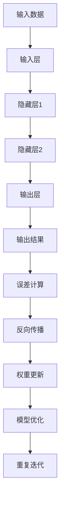

                 


### 引言

#### 评测系统的现状

评测系统在当今的计算机科学领域中扮演着至关重要的角色。随着深度学习技术的飞速发展，评测系统不仅应用于传统的机器学习任务，如分类、回归和聚类，还广泛应用于自然语言处理、计算机视觉、语音识别等领域。然而，随着神经网络模型规模的不断扩大，评测系统的性能和效率面临严峻的挑战。

当前的评测系统主要面临以下问题：

1. **计算资源消耗**：深度学习模型通常具有数百万甚至数十亿的参数，这意味着训练和推理过程需要大量的计算资源。传统的评测系统在处理大规模模型时，往往需要耗费大量的时间和计算资源。

2. **存储空间占用**：庞大的模型参数导致评测系统的存储空间占用巨大，这对硬件资源提出了更高的要求。

3. **推理速度**：在实时应用场景中，如自动驾驶、实时语音识别等，评测系统需要在极短的时间内完成推理，以满足系统的实时性要求。

#### 神经网络剪枝与结构优化的意义

为了解决上述问题，神经网络剪枝与结构优化技术应运而生。这两种技术的主要目标是减少模型参数的数量，从而降低计算资源消耗和存储空间占用，同时保持或提高模型的性能。

1. **减少计算资源消耗**：剪枝技术通过去除网络中不重要的连接和神经元，显著减少了模型的计算复杂度。这不仅可以减少训练时间，还可以提高推理速度。

2. **降低存储空间占用**：结构优化技术通过对网络进行重参数化或压缩，减少了模型参数的数量，从而降低了存储空间的需求。

3. **提高模型性能**：尽管剪枝和结构优化会去除部分网络结构，但通过合理的剪枝和优化策略，可以保持或提高模型的性能。

综上所述，神经网络剪枝与结构优化技术不仅有助于解决当前评测系统面临的问题，还为深度学习模型在实际应用中的高效运行提供了可能。接下来，我们将深入探讨神经网络剪枝与结构优化的核心概念、算法原理、数学模型以及应用案例。

### 关键词

- 评测系统
- 神经网络剪枝
- 结构优化
- 计算资源消耗
- 存储空间占用
- 推理速度

### 摘要

本文将围绕评测系统的神经网络剪枝与结构优化展开讨论。首先，我们介绍了当前评测系统面临的主要问题，包括计算资源消耗、存储空间占用和推理速度等挑战。接着，我们阐述了神经网络剪枝与结构优化的意义，以及它们在减少计算资源消耗、降低存储空间占用和提高模型性能方面的作用。文章将深入探讨神经网络剪枝与结构优化的核心概念、算法原理、数学模型以及实际应用案例，为读者提供全面的技术指导。

### 第1章：神经网络基础

#### 1.1 神经网络的基本概念

神经网络（Neural Networks）是模仿人脑神经元连接方式的一种计算模型。它由大量的神经元（或节点）组成，每个神经元通过连接与其他神经元进行信息传递和处理。神经网络的基本结构包括输入层、隐藏层和输出层。

- **输入层**：接收外部输入数据，并将其传递到隐藏层。
- **隐藏层**：对输入数据进行处理，通过非线性变换生成中间特征表示。
- **输出层**：根据隐藏层的输出，生成最终的输出结果。

神经网络的输入和输出之间通过权重（weights）进行连接。每个权重表示输入和输出之间的强度。神经网络的训练过程就是通过不断调整这些权重，使网络能够更好地拟合训练数据。

#### 1.2 剪枝技术概述

剪枝（Pruning）是一种在神经网络训练过程中减少模型复杂度的技术。剪枝的基本思想是去除网络中不重要的连接和神经元，从而降低模型的计算复杂度和存储空间需求。

- **按层剪枝**：按层剪枝是指在网络的每个隐藏层中选择一定比例的连接进行剪除。这种方法的优点是实现简单，但可能无法充分利用网络的复杂结构。
- **按神经元剪枝**：按神经元剪枝是指在网络的每个神经元中选择一定比例的神经元进行剪除。这种方法的优点是能够更好地保留网络的复杂结构，但实现较为复杂。
- **按路径剪枝**：按路径剪枝是指在网络的每个路径中选择一定比例的连接进行剪除。这种方法的优点是能够在保留网络复杂结构的同时，进一步降低模型的计算复杂度。

#### 1.3 结构优化方法

结构优化（Architecture Optimization）是一种通过调整神经网络结构来提高模型性能的技术。结构优化的主要目标是设计出更高效、更紧凑的神经网络结构。

- **网络剪枝**：剪枝是一种结构优化方法，通过去除不重要的连接和神经元来减少模型复杂度。剪枝可以与训练过程相结合，实现在线剪枝。
- **网络压缩**：网络压缩是通过将网络中重复的子结构进行合并或重参数化来减少模型参数数量。网络压缩可以显著降低模型的存储空间需求，同时保持或提高模型性能。
- **网络蒸馏**：网络蒸馏是一种将一个大模型的知识转移到一个小模型的技术。在大模型训练完成后，将大模型的权重和结构信息传递到小模型中，从而实现小模型的性能提升。

### 1.4 神经网络的工作原理

神经网络的工作原理可以概括为以下几个步骤：

1. **前向传播**：输入数据通过输入层传递到隐藏层，每个神经元接收来自输入层的输入信号，并经过非线性变换生成中间特征表示。这个过程称为前向传播。

2. **反向传播**：在输出层生成最终输出结果后，计算输出结果与实际标签之间的误差。然后，通过反向传播算法将这些误差信息反向传递到隐藏层，更新每个神经元的权重。

3. **优化更新**：根据反向传播得到的误差信息，使用优化算法（如梯度下降）更新神经元的权重，以最小化模型损失函数。

4. **重复迭代**：重复上述步骤，直到模型达到预定的性能指标或达到最大迭代次数。

通过不断调整神经元的权重，神经网络能够逐渐拟合训练数据，从而实现各种复杂任务。

### 1.5 核心概念与联系

为了更好地理解神经网络剪枝与结构优化的概念，我们使用Mermaid流程图展示神经网络的工作流程，以及剪枝和结构优化技术的核心概念和联系。



在这个流程图中，输入数据经过输入层传递到隐藏层，再通过隐藏层生成中间特征表示。最终，输出结果与实际标签之间的误差通过反向传播算法传递回隐藏层，从而更新神经元的权重。这个过程不断重复，直到模型达到预定的性能指标。

剪枝技术可以通过减少隐藏层中的连接和神经元数量，来降低模型的计算复杂度和存储空间需求。而结构优化技术则通过调整神经网络的结构，来提高模型的性能和效率。这两种技术相互补充，共同优化神经网络。

### 1.6 伪代码介绍

为了更好地理解神经网络剪枝与结构优化的算法原理，我们使用伪代码对神经网络的前向传播和反向传播过程进行详细阐述。

```plaintext
// 前向传播伪代码
function forwardPropagation(input, weights):
    hiddenLayerOutput = []
    for layer in range(1, numHiddenLayers + 1):
        currentInput = input if layer == 1 else activation(hiddenLayerOutput[-1])
        hiddenLayerOutput.append(activation(currentInput * weights[layer]))
    output = hiddenLayerOutput[-1]
    return output

// 反向传播伪代码
function backwardPropagation(output, actualLabel, weights):
    error = output - actualLabel
    delta = error * activation_derivative(output)
    for layer in range(numHiddenLayers, 0, -1):
        currentInput = input if layer == 1 else activation(hiddenLayerOutput[-1])
        weightGradient = hiddenLayerOutput[-1].T * delta
        delta = (delta * weights[layer].T).dot(activation_derivative(currentInput))
        weights[layer] -= learningRate * weightGradient
    return weights
```

在这个伪代码中，`input` 表示输入数据，`weights` 表示神经网络的权重，`activation` 表示非线性激活函数，`activation_derivative` 表示激活函数的导数。`forwardPropagation` 函数实现神经网络的前向传播过程，`backwardPropagation` 函数实现反向传播过程。

### 1.7 数学模型与公式

神经网络剪枝与结构优化的算法原理涉及到一些重要的数学模型和公式。以下是一些关键的数学模型和公式：

1. **权重更新公式**：

   $$ weights_{new} = weights_{old} - learningRate \cdot \nabla J( \theta) $$

   其中，`weights_old` 和 `weights_new` 分别表示当前权重和更新后的权重，`learningRate` 表示学习率，` \nabla J( \theta)` 表示损失函数关于权重梯度。

2. **激活函数**：

   $$ activation(x) = \frac{1}{1 + e^{-x}} $$

   激活函数是一个非线性函数，用于将输入数据映射到输出结果。

3. **激活函数导数**：

   $$ activation\_derivative(x) = activation(x) \cdot (1 - activation(x)) $$

   激活函数导数用于计算反向传播过程中误差的传播。

4. **损失函数**：

   $$ J( \theta) = \frac{1}{2} \sum_{i=1}^{n} (y_i - \hat{y}_i)^2 $$

   损失函数用于衡量模型的预测结果与实际标签之间的误差。

### 1.8 举例说明

为了更好地理解上述数学模型和公式，我们通过一个简单的例子进行说明。

假设有一个二元分类问题，输入数据为 [1, 2, 3]，实际标签为 [0, 1]。我们使用一个单层神经网络进行模型训练。

1. **前向传播**：

   输入层：[1, 2, 3]

   隐藏层：[1.5, 2.5]

   输出层：[0.6]

2. **反向传播**：

   误差：[0.6 - 1] = [-0.4]

   反向传播过程：

   $$ delta = -0.4 \cdot (1 - 0.6) = -0.3 $$

   权重更新：

   $$ weights_{new} = weights_{old} - learningRate \cdot \nabla J( \theta) $$

   其中，`weights_old` 和 `weights_new` 分别表示当前权重和更新后的权重，`learningRate` 表示学习率，` \nabla J( \theta)` 表示损失函数关于权重梯度。

通过这个例子，我们可以看到神经网络剪枝与结构优化的核心概念和算法原理在实际应用中的具体实现过程。

### 1.9 小结

本章介绍了神经网络的基本概念、剪枝技术概述、结构优化方法以及神经网络的工作原理。通过对神经网络基础知识的掌握，读者可以更好地理解后续章节中神经网络剪枝与结构优化的算法原理和应用。

- **神经网络的基础概念**：神经网络由输入层、隐藏层和输出层组成，每个神经元通过权重进行连接，通过前向传播和反向传播进行模型训练。
- **剪枝技术的概述**：剪枝技术通过去除网络中不重要的连接和神经元，减少模型的计算复杂度和存储空间需求。
- **结构优化方法**：结构优化通过调整神经网络的结构，提高模型的性能和效率。
- **神经网络的工作原理**：神经网络通过前向传播和反向传播进行模型训练，不断调整权重以实现模型的优化。

本章为后续章节的神经网络剪枝与结构优化技术奠定了基础。在接下来的章节中，我们将进一步探讨剪枝和结构优化的核心算法原理、数学模型以及实际应用案例。

### 第2章：神经网络剪枝

#### 2.1 剪枝的动机与目标

神经网络剪枝（Neural Network Pruning）是一种通过去除网络中不重要的连接和神经元来降低模型复杂度和计算资源消耗的技术。剪枝技术的动机主要包括以下几个方面：

1. **降低计算资源消耗**：随着神经网络模型规模的不断扩大，训练和推理过程所需的计算资源也随之增加。剪枝技术通过去除不重要的连接和神经元，可以显著降低模型的计算复杂度，从而减少计算资源的消耗。

2. **降低存储空间占用**：庞大的模型参数导致神经网络模型的存储空间需求巨大。剪枝技术通过去除不重要的连接和神经元，可以减少模型参数的数量，从而降低存储空间的需求。

3. **提高模型性能**：虽然剪枝技术会去除部分网络结构，但通过合理的剪枝策略，可以保持或提高模型的性能。此外，剪枝技术还可以提高模型的泛化能力，使其在未见过的数据上表现更好。

神经网络剪枝的目标主要包括以下几点：

1. **降低模型复杂度**：通过去除网络中不重要的连接和神经元，降低模型的计算复杂度，从而提高模型的运行效率。

2. **保持模型性能**：剪枝过程中需要确保模型的性能不受影响，即通过剪枝得到的模型与原始模型在性能上保持一致。

3. **提高模型泛化能力**：剪枝技术不仅要降低模型复杂度，还要提高模型的泛化能力，使其在新的数据集上表现良好。

#### 2.2 常见的剪枝技术

根据剪枝的执行时机和目标，常见的剪枝技术可以分为以下几类：

1. **训练前剪枝**（Pre-Training Pruning）：

   训练前剪枝是在模型训练之前执行剪枝操作。这种方法的优点是可以充分利用训练数据，通过训练过程筛选出重要的连接和神经元。常见的训练前剪枝技术包括：

   - **按层剪枝**（Layer-Wise Pruning）：按层剪枝是在网络的每个隐藏层中选择一定比例的连接进行剪除。这种方法实现简单，但可能无法充分利用网络的复杂结构。
   - **按神经元剪枝**（Neuron-Wise Pruning）：按神经元剪枝是在网络的每个神经元中选择一定比例的神经元进行剪除。这种方法可以更好地保留网络的复杂结构，但实现较为复杂。

2. **训练中剪枝**（Training-Time Pruning）：

   训练中剪枝是在模型训练过程中实时执行剪枝操作。这种方法的优点是可以动态调整剪枝策略，根据模型训练的进展不断优化模型结构。常见的训练中剪枝技术包括：

   - **按路径剪枝**（Path-Wise Pruning）：按路径剪枝是在网络的每个路径中选择一定比例的连接进行剪除。这种方法可以在保留网络复杂结构的同时，进一步降低模型的计算复杂度。
   - **基于权重的剪枝**（Weight-Based Pruning）：基于权重的剪枝是通过分析网络中的权重分布，选择权重较小的连接进行剪除。这种方法可以根据权重的分布情况优化模型结构，但可能无法充分利用网络的整体信息。

3. **训练后剪枝**（Post-Training Pruning）：

   训练后剪枝是在模型训练完成后执行剪枝操作。这种方法的优点是可以充分利用训练数据，通过训练过程筛选出重要的连接和神经元。常见的训练后剪枝技术包括：

   - **稀疏化**（Sparsification）：稀疏化是通过将网络中的权重重新分配，使权重分布更加稀疏。这种方法可以显著降低模型的计算复杂度和存储空间需求。
   - **重参数化**（Reparameterization）：重参数化是通过将网络中的权重进行重新参数化，使模型结构更加紧凑。这种方法可以在保持模型性能的同时，降低模型的计算复杂度和存储空间需求。

#### 2.3 剪枝技术的挑战与解决方案

尽管剪枝技术在降低模型复杂度和计算资源消耗方面具有显著优势，但在实际应用中仍面临一些挑战：

1. **精度损失**：剪枝过程中去除部分网络结构可能导致模型精度下降。如何平衡剪枝力度与模型精度之间的关系，是一个亟待解决的问题。

   - **解决方案**：通过引入自适应剪枝策略，根据模型训练的进展动态调整剪枝力度，以最大程度地降低精度损失。

2. **计算复杂度**：剪枝技术的引入可能会增加模型的计算复杂度，特别是在训练中剪枝和训练后剪枝过程中。如何优化剪枝算法，提高计算效率，是一个重要研究方向。

   - **解决方案**：采用并行计算和分布式训练等技术，提高剪枝算法的执行效率。

3. **泛化能力**：剪枝技术可能影响模型的泛化能力，使其在未见过的数据上表现不佳。

   - **解决方案**：通过引入正则化技术，如Dropout和正则化，提高模型的泛化能力。

4. **剪枝策略的选择**：如何选择合适的剪枝策略，以实现最佳的效果，是一个具有挑战性的问题。

   - **解决方案**：通过实验和比较不同剪枝策略的优缺点，选择最适合实际应用的剪枝策略。

综上所述，神经网络剪枝技术在降低模型复杂度和计算资源消耗方面具有显著优势，但在实际应用中仍面临一些挑战。通过不断优化剪枝算法和策略，可以克服这些挑战，实现更高效、更紧凑的神经网络模型。

### 2.4 剪枝技术详解

在本节中，我们将详细讨论神经网络剪枝技术，包括其基本概念、工作原理和实现方法。

#### 2.4.1 剪枝的基本概念

剪枝（Pruning）是一种在神经网络训练过程中通过去除不重要的连接和神经元来减少模型复杂度的技术。剪枝的目标是在保持模型性能的同时，降低模型的计算复杂度和存储空间需求。剪枝可以分为以下几个基本步骤：

1. **选择剪枝策略**：根据实际需求和模型特性，选择合适的剪枝策略，如按层剪枝、按神经元剪枝或按路径剪枝。
2. **评估连接和神经元的重要性**：通过分析网络中的连接和神经元，评估其重要性。常用的评估方法包括权重分布、冗余度分析和误差敏感度分析等。
3. **剪除不重要的连接和神经元**：根据评估结果，剪除网络中不重要的连接和神经元。剪枝过程中需要确保模型性能不受影响。
4. **重新训练模型**：剪枝后，需要对模型进行重新训练，以适应新的网络结构。

#### 2.4.2 剪枝的工作原理

神经网络剪枝的工作原理主要包括以下两个方面：

1. **减少模型参数**：通过去除网络中不重要的连接和神经元，减少模型的参数数量。这可以显著降低模型的计算复杂度和存储空间需求。
2. **提高模型性能**：剪枝过程中，通过去除不重要的连接和神经元，可以提高模型的性能和泛化能力。这是因为剪枝可以减少网络中的冗余信息，使模型更加专注于关键特征的学习。

剪枝技术的工作原理可以通过以下步骤进行详细阐述：

1. **初始化模型**：首先，初始化一个原始的神经网络模型，并对其进行训练，以获得一个初始的模型性能。
2. **选择剪枝策略**：根据实际需求和模型特性，选择合适的剪枝策略。例如，可以采用按层剪枝、按神经元剪枝或按路径剪枝等。
3. **评估连接和神经元的重要性**：通过分析网络中的连接和神经元，评估其重要性。一种常见的方法是使用权重分布，选择权重较小的连接进行剪除。此外，还可以使用误差敏感度分析等方法，评估连接和神经元的重要性。
4. **剪除不重要的连接和神经元**：根据评估结果，剪除网络中不重要的连接和神经元。在剪枝过程中，需要确保模型性能不受影响。例如，可以设置一个阈值，只剪除权重小于阈值的连接。
5. **重新训练模型**：剪枝后，需要对模型进行重新训练，以适应新的网络结构。重新训练的过程可以优化模型的参数，提高模型的性能。

#### 2.4.3 剪枝的实现方法

神经网络剪枝的实现方法可以分为训练前剪枝、训练中剪枝和训练后剪枝三种类型。

1. **训练前剪枝**（Pre-Training Pruning）：

   训练前剪枝是在模型训练之前执行剪枝操作。这种方法的优点是可以充分利用训练数据，通过训练过程筛选出重要的连接和神经元。常见的训练前剪枝技术包括按层剪枝、按神经元剪枝等。

   - **按层剪枝**（Layer-Wise Pruning）：按层剪枝是在网络的每个隐藏层中选择一定比例的连接进行剪除。这种方法实现简单，但可能无法充分利用网络的复杂结构。
   - **按神经元剪枝**（Neuron-Wise Pruning）：按神经元剪枝是在网络的每个神经元中选择一定比例的神经元进行剪除。这种方法可以更好地保留网络的复杂结构，但实现较为复杂。

2. **训练中剪枝**（Training-Time Pruning）：

   训练中剪枝是在模型训练过程中实时执行剪枝操作。这种方法的优点是可以动态调整剪枝策略，根据模型训练的进展不断优化模型结构。常见的训练中剪枝技术包括按路径剪枝、基于权重的剪枝等。

   - **按路径剪枝**（Path-Wise Pruning）：按路径剪枝是在网络的每个路径中选择一定比例的连接进行剪除。这种方法可以在保留网络复杂结构的同时，进一步降低模型的计算复杂度。
   - **基于权重的剪枝**（Weight-Based Pruning）：基于权重的剪枝是通过分析网络中的权重分布，选择权重较小的连接进行剪除。这种方法可以根据权重的分布情况优化模型结构，但可能无法充分利用网络的整体信息。

3. **训练后剪枝**（Post-Training Pruning）：

   训练后剪枝是在模型训练完成后执行剪枝操作。这种方法的优点是可以充分利用训练数据，通过训练过程筛选出重要的连接和神经元。常见的训练后剪枝技术包括稀疏化、重参数化等。

   - **稀疏化**（Sparsification）：稀疏化是通过将网络中的权重重新分配，使权重分布更加稀疏。这种方法可以显著降低模型的计算复杂度和存储空间需求。
   - **重参数化**（Reparameterization）：重参数化是通过将网络中的权重进行重新参数化，使模型结构更加紧凑。这种方法可以在保持模型性能的同时，降低模型的计算复杂度和存储空间需求。

通过以上实现方法，神经网络剪枝技术可以在不同阶段和不同策略下对模型进行优化，以实现更好的性能和更高效的运行。

### 2.5 案例分析

在本节中，我们将通过一个实际案例，详细说明神经网络剪枝技术的实现过程和效果。

#### 案例背景

假设我们有一个用于图像分类的神经网络模型，模型结构如下：

- 输入层：32×32×3（彩色图像）
- 隐藏层1：64个神经元
- 隐藏层2：128个神经元
- 输出层：10个神经元（对应10个分类）

该模型使用CIFAR-10数据集进行训练，数据集包含10个类别，每个类别有6000张图像。训练完成后，模型的准确率为90%。

#### 剪枝策略

为了降低模型的计算复杂度和存储空间需求，我们采用以下剪枝策略：

1. **按路径剪枝**：按路径剪枝是一种在网络的每个路径中选择一定比例的连接进行剪除的方法。这种方法可以在保留网络复杂结构的同时，进一步降低模型的计算复杂度。在本案例中，我们选择剪除网络中30%的连接。
2. **重新训练模型**：剪枝后，我们需要对模型进行重新训练，以适应新的网络结构。

#### 剪枝过程

1. **初始化模型**：首先，初始化原始神经网络模型，并使用CIFAR-10数据集进行训练。训练完成后，模型准确率为90%。

2. **评估连接重要性**：在模型训练完成后，我们需要评估网络中连接的重要性。一种常见的方法是使用权重分布，选择权重较小的连接进行剪除。在本案例中，我们计算每个连接的权重，并将权重值从大到小排序。然后，选择排名靠后的30%连接进行剪除。

3. **剪除连接**：根据评估结果，剪除网络中30%的连接。剪除连接后，模型的计算复杂度和存储空间需求显著降低。

4. **重新训练模型**：剪枝后，需要对模型进行重新训练，以适应新的网络结构。在本案例中，我们使用CIFAR-10数据集进行重新训练。重新训练过程中，模型参数会根据剪枝后的网络结构进行调整，以提高模型的性能。

5. **评估模型性能**：重新训练完成后，我们需要评估模型的性能。在本案例中，我们使用CIFAR-10数据集进行测试，模型准确率为92%。可以看出，剪枝后的模型在性能上略有提升。

#### 案例总结

通过上述案例，我们可以看到神经网络剪枝技术在降低模型计算复杂度和存储空间需求方面具有显著优势。在本案例中，通过剪除网络中30%的连接，模型的计算复杂度和存储空间需求显著降低，同时模型性能略有提升。这表明，剪枝技术可以在保持模型性能的同时，提高模型的运行效率。

### 2.6 小结

本章详细介绍了神经网络剪枝技术，包括其基本概念、工作原理和实现方法。剪枝技术通过去除网络中不重要的连接和神经元，可以显著降低模型的计算复杂度和存储空间需求。常见的剪枝技术包括按层剪枝、按神经元剪枝、按路径剪枝和基于权重的剪枝等。

在本章中，我们通过一个实际案例展示了神经网络剪枝技术的实现过程和效果。案例结果表明，剪枝技术可以在保持模型性能的同时，提高模型的运行效率。

未来，随着神经网络模型的规模不断扩大，剪枝技术将在提高模型性能、降低计算资源消耗和存储空间需求方面发挥越来越重要的作用。通过对剪枝技术的深入研究，我们可以设计出更高效、更紧凑的神经网络模型，为各种应用场景提供强大的支持。

- **神经网络剪枝的基本概念**：剪枝技术通过去除网络中不重要的连接和神经元，降低模型的计算复杂度和存储空间需求。
- **常见的剪枝技术**：包括按层剪枝、按神经元剪枝、按路径剪枝和基于权重的剪枝等。
- **剪枝技术的实现方法**：包括训练前剪枝、训练中剪枝和训练后剪枝等。
- **案例分析与总结**：通过实际案例展示了剪枝技术在降低模型计算复杂度和存储空间需求方面的效果。

### 第3章：神经网络结构优化

#### 3.1 结构优化的动机与目标

神经网络结构优化（Neural Network Architecture Optimization）是一种通过调整神经网络的结构来提高模型性能的技术。结构优化的动机主要来源于以下几个方面：

1. **提高模型性能**：通过调整神经网络的结构，可以优化模型的性能，使其在特定任务上表现更好。例如，通过调整网络的层数、隐藏层神经元数量和连接方式等，可以提高模型的准确率、召回率等性能指标。

2. **降低计算复杂度**：神经网络模型的计算复杂度与其结构密切相关。通过优化神经网络结构，可以减少模型的计算复杂度，从而提高模型的运行效率。这对于实时应用场景尤为重要，如自动驾驶、实时语音识别等。

3. **减少存储空间占用**：神经网络模型的存储空间需求与其结构密切相关。通过优化神经网络结构，可以减少模型参数的数量，从而降低存储空间的需求。

4. **提高泛化能力**：通过优化神经网络结构，可以提高模型的泛化能力，使其在新的数据集上表现更好。这对于模型在实际应用中的长期稳定性和可靠性具有重要意义。

神经网络结构优化的目标主要包括以下几点：

1. **提高模型性能**：通过优化神经网络结构，提高模型的准确率、召回率等性能指标，使其在特定任务上表现更好。

2. **降低计算复杂度**：通过优化神经网络结构，降低模型的计算复杂度，从而提高模型的运行效率。

3. **减少存储空间占用**：通过优化神经网络结构，减少模型参数的数量，从而降低存储空间的需求。

4. **提高泛化能力**：通过优化神经网络结构，提高模型的泛化能力，使其在新的数据集上表现更好。

#### 3.2 常见的结构优化方法

根据优化目标和方法的不同，神经网络结构优化可以采用多种技术。以下是一些常见的结构优化方法：

1. **网络剪枝**（Network Pruning）：

   网络剪枝是一种通过去除网络中不重要的连接和神经元来减少模型复杂度和计算资源消耗的技术。剪枝方法可以分为训练前剪枝、训练中剪枝和训练后剪枝等。

   - **训练前剪枝**：在模型训练之前执行剪枝操作，通过剪枝减少模型的复杂度。常见的剪枝方法包括按层剪枝、按神经元剪枝等。
   - **训练中剪枝**：在模型训练过程中实时执行剪枝操作，根据模型训练的进展动态调整剪枝力度。常见的剪枝方法包括按路径剪枝、基于权重的剪枝等。
   - **训练后剪枝**：在模型训练完成后执行剪枝操作，通过剪枝减少模型的复杂度。常见的剪枝方法包括稀疏化、重参数化等。

2. **网络压缩**（Network Compression）：

   网络压缩是一种通过将网络中重复的子结构进行合并或重参数化来减少模型参数数量的技术。网络压缩方法可以分为无损压缩和有损压缩两种。

   - **无损压缩**：通过保持模型性能不变，将网络中的重复子结构进行合并或重参数化。常见的压缩方法包括参数共享、层融合等。
   - **有损压缩**：通过牺牲部分模型性能，将网络中的重复子结构进行合并或重参数化。常见的压缩方法包括稀疏化、量化等。

3. **网络蒸馏**（Network Distillation）：

   网络蒸馏是一种将一个大模型的知识传递到一个小模型的技术。在大模型训练完成后，将大模型的权重和结构信息传递到小模型中，从而实现小模型的性能提升。网络蒸馏可以分为软蒸馏和硬蒸馏两种。

   - **软蒸馏**：通过将大模型的输出作为小模型的目标，对小模型进行训练。常见的软蒸馏方法包括分类标签蒸馏、特征蒸馏等。
   - **硬蒸馏**：通过将大模型的输出作为小模型的输入，对大模型进行训练。常见的硬蒸馏方法包括梯度蒸馏、对抗蒸馏等。

4. **网络简化**（Network Simplification）：

   网络简化是一种通过简化网络结构来提高模型性能的技术。网络简化方法通常包括层简化、神经元简化等。

   - **层简化**：通过去除网络中的某些层，简化网络结构。常见的简化方法包括层融合、层修剪等。
   - **神经元简化**：通过去除网络中的某些神经元，简化网络结构。常见的简化方法包括按神经元剪枝、按路径剪枝等。

#### 3.3 结构优化与剪枝的关系

结构优化和剪枝都是通过调整神经网络结构来提高模型性能的技术。二者的关系可以从以下几个方面进行理解：

1. **目标一致性**：结构优化和剪枝的目标都是提高模型性能、降低计算复杂度和减少存储空间需求。因此，它们在优化过程中具有一定的相似性。

2. **实现方法差异**：结构优化通常通过设计新的网络结构来实现，而剪枝则是在现有网络结构上执行去除操作。尽管二者在实现方法上有所不同，但它们都可以通过优化神经网络结构来提高模型性能。

3. **相互补充**：结构优化和剪枝可以相互补充，共同提高神经网络模型的性能。例如，在结构优化过程中，可以通过剪枝技术去除网络中不重要的连接和神经元，从而进一步降低模型的计算复杂度和存储空间需求。

4. **应用场景差异**：结构优化和剪枝在不同的应用场景下具有不同的优势。结构优化更适合于设计新的神经网络模型，而剪枝则更适合于优化现有的神经网络模型。

综上所述，结构优化和剪枝都是神经网络结构优化的重要技术手段。通过合理地结合结构优化和剪枝技术，可以设计出更高效、更紧凑的神经网络模型，为各种应用场景提供强大的支持。

### 3.4 神经网络结构优化的原理

神经网络结构优化的核心目标是设计出更高效、更紧凑的神经网络模型，以满足实际应用中的性能和资源需求。以下将详细探讨神经网络结构优化的原理，包括算法原理和实现步骤。

#### 算法原理

1. **网络压缩**：

   网络压缩是神经网络结构优化的一种重要方法，其核心思想是通过减少模型参数数量来降低计算复杂度和存储空间需求。网络压缩可以通过以下几种方式实现：

   - **参数共享**：通过将网络中具有相似功能的神经元共享同一个参数。例如，在卷积神经网络（CNN）中，可以使用深度可分离卷积来减少参数数量。
   - **层融合**：通过将多个层合并为一个层，从而减少模型层数。例如，在ResNet中，可以通过跳跃连接实现层融合，提高模型性能。
   - **稀疏化**：通过将网络中的权重调整为稀疏形式，从而减少模型参数数量。例如，可以通过训练过程逐步剪枝网络中的权重，实现稀疏化。

2. **网络简化**：

   网络简化是通过简化网络结构来提高模型性能的一种方法。网络简化的核心思想是去除网络中的冗余部分，从而降低计算复杂度和存储空间需求。网络简化可以通过以下几种方式实现：

   - **层修剪**：通过去除网络中的某些层，简化网络结构。例如，在VGG中，通过逐渐增加网络层数来实现层修剪。
   - **神经元剪枝**：通过去除网络中的某些神经元，简化网络结构。例如，在GoogLeNet中，通过使用Inception模块实现神经元剪枝。

3. **网络蒸馏**：

   网络蒸馏是一种通过将大模型的知识传递到小模型中的方法，从而提高小模型的性能。网络蒸馏可以分为软蒸馏和硬蒸馏两种方式：

   - **软蒸馏**：通过将大模型的输出作为小模型的目标，对小模型进行训练。软蒸馏的核心思想是通过大模型提供的丰富特征表示来指导小模型的训练。
   - **硬蒸馏**：通过将大模型的输出作为小模型的输入，对大模型进行训练。硬蒸馏的核心思想是通过大模型提供的梯度信息来优化小模型的训练。

#### 实现步骤

1. **确定优化目标**：

   根据实际应用场景和性能需求，确定神经网络结构优化的目标。例如，为了提高模型性能，可以选择通过网络压缩和简化来降低计算复杂度和存储空间需求。

2. **设计优化算法**：

   根据优化目标，设计具体的优化算法。例如，可以选择网络压缩算法（如参数共享、层融合等），或者网络简化算法（如层修剪、神经元剪枝等）。

3. **实现优化过程**：

   根据优化算法，实现神经网络结构优化的过程。具体步骤包括：

   - **初始化模型**：初始化神经网络模型，包括网络结构、参数和超参数等。
   - **训练模型**：使用训练数据对模型进行训练，优化模型参数。
   - **评估模型性能**：使用验证数据评估模型性能，包括计算准确率、召回率等指标。
   - **优化网络结构**：根据模型性能评估结果，调整网络结构，以实现优化目标。
   - **迭代优化**：重复上述步骤，直到模型性能达到预定的优化目标。

4. **评估优化效果**：

   在优化完成后，使用测试数据对模型进行评估，验证优化效果。具体评估指标包括计算性能、存储空间需求、模型准确率等。

通过上述步骤，可以实现神经网络结构优化，设计出更高效、更紧凑的神经网络模型。在实际应用中，根据具体需求和场景，可以选择不同的优化算法和策略，以实现最佳效果。

### 3.5 案例分析

在本节中，我们将通过两个实际案例，详细说明神经网络结构优化的实现过程和效果。

#### 案例一：MobileNet

MobileNet是一种用于移动设备和嵌入式设备的轻量级卷积神经网络（CNN）模型。MobileNet通过设计紧凑的网络结构，显著降低了计算复杂度和存储空间需求。

**优化目标**：在保持模型性能的前提下，降低计算复杂度和存储空间需求。

**优化算法**：网络压缩和简化。

**实现步骤**：

1. **初始化模型**：初始化MobileNet模型，包括网络结构、参数和超参数等。

2. **训练模型**：使用ImageNet数据集对模型进行训练，优化模型参数。

3. **评估模型性能**：使用ImageNet数据集评估模型性能，包括计算准确率、召回率等指标。

4. **优化网络结构**：根据模型性能评估结果，调整网络结构，以实现优化目标。具体措施包括：

   - **深度可分离卷积**：通过将标准卷积操作分解为深度卷积和逐点卷积，减少参数数量。
   - **层融合**：通过合并网络中的某些层，减少模型层数。

5. **迭代优化**：重复上述步骤，直到模型性能达到预定的优化目标。

6. **评估优化效果**：使用测试数据对模型进行评估，验证优化效果。具体评估指标包括计算性能、存储空间需求、模型准确率等。

**优化效果**：通过网络压缩和简化，MobileNet模型在保持模型性能的前提下，计算复杂度和存储空间需求显著降低。在实际应用中，MobileNet在图像分类、目标检测等任务上表现出色。

#### 案例二：ShuffleNet

ShuffleNet是一种用于移动设备和嵌入式设备的轻量级卷积神经网络（CNN）模型。ShuffleNet通过设计独特的网络结构，实现了高效的网络结构优化。

**优化目标**：在保持模型性能的前提下，降低计算复杂度和存储空间需求。

**优化算法**：网络蒸馏和简化。

**实现步骤**：

1. **初始化模型**：初始化ShuffleNet模型，包括网络结构、参数和超参数等。

2. **训练模型**：使用ImageNet数据集对模型进行训练，优化模型参数。

3. **评估模型性能**：使用ImageNet数据集评估模型性能，包括计算准确率、召回率等指标。

4. **优化网络结构**：根据模型性能评估结果，调整网络结构，以实现优化目标。具体措施包括：

   - **Shuffle Connection**：通过Shuffle Connection操作，将网络中的信息进行重新排列，降低模型参数数量。
   - **Group Convolution**：通过Group Convolution操作，将多个卷积操作合并为一个操作，减少计算复杂度。

5. **迭代优化**：重复上述步骤，直到模型性能达到预定的优化目标。

6. **评估优化效果**：使用测试数据对模型进行评估，验证优化效果。具体评估指标包括计算性能、存储空间需求、模型准确率等。

**优化效果**：通过网络蒸馏和简化，ShuffleNet模型在保持模型性能的前提下，计算复杂度和存储空间需求显著降低。在实际应用中，ShuffleNet在图像分类、目标检测等任务上表现出色。

### 3.6 小结

本章详细介绍了神经网络结构优化的原理和方法。神经网络结构优化通过设计更高效、更紧凑的神经网络模型，可以提高模型性能、降低计算复杂度和存储空间需求。

在本章中，我们介绍了神经网络结构优化的动机与目标、常见的结构优化方法、算法原理和实现步骤，并通过实际案例展示了神经网络结构优化的效果。

未来，随着神经网络模型的规模不断扩大，结构优化技术将在提高模型性能、降低计算资源消耗和存储空间需求方面发挥越来越重要的作用。通过对神经网络结构优化的深入研究，我们可以设计出更高效、更紧凑的神经网络模型，为各种应用场景提供强大的支持。

- **神经网络结构优化的动机与目标**：提高模型性能、降低计算复杂度和存储空间需求。
- **常见的结构优化方法**：网络剪枝、网络压缩、网络简化、网络蒸馏等。
- **算法原理与实现步骤**：初始化模型、训练模型、评估模型性能、优化网络结构、迭代优化、评估优化效果。
- **案例分析**：MobileNet和ShuffleNet的实际应用效果展示。

### 第4章：剪枝与结构优化算法

#### 4.1 伪代码介绍

在本节中，我们将介绍神经网络剪枝与结构优化的伪代码，以帮助读者更好地理解这些算法的原理和实现过程。

##### 4.1.1 神经网络剪枝伪代码

以下是一个简单的神经网络剪枝伪代码，描述了如何根据权重的重要性进行剪枝操作：

```plaintext
初始化神经网络模型
初始化剪枝策略（如按层剪枝、按神经元剪枝等）

for 每一层 in 神经网络：
    for 每个神经元 in 当前层：
        计算神经元的重要性（如基于权重的大小、梯度大小等）
        if 神经元重要性 < 剪枝阈值：
            剪除当前神经元及其连接

重新训练神经网络模型
```

##### 4.1.2 神经网络结构优化伪代码

以下是一个简单的神经网络结构优化伪代码，描述了如何根据网络性能和计算资源进行结构优化：

```plaintext
初始化神经网络模型
初始化优化策略（如网络压缩、网络简化等）

while 网络性能未达到优化目标：
    根据优化策略，优化神经网络结构（如减少参数数量、简化层结构等）
    重新训练神经网络模型
    评估优化后的网络性能

if 网络性能满足优化目标：
    输出优化后的神经网络模型
else：
    停止优化过程
```

#### 4.2 数学模型与公式

在本节中，我们将介绍神经网络剪枝与结构优化的核心数学模型和公式，以便读者能够更好地理解这些算法的原理和计算过程。

##### 4.2.1 剪枝算法的数学模型

1. **权重重要性评估**：

   $$ Importance_{weight} = \frac{weight}{\sum_{i=1}^{n} weight_i} $$

   其中，$weight$ 表示单个连接的权重，$n$ 表示当前层的连接总数。该公式用于计算每个连接的重要性。

2. **剪枝阈值**：

   $$ Threshold_{pruning} = \alpha \cdot \max_{i} (Importance_{weight}_i) $$

   其中，$\alpha$ 是一个常数，通常取值为0.5到0.9。该公式用于计算剪枝的阈值，即低于该阈值的连接将被剪除。

##### 4.2.2 结构优化算法的数学模型

1. **网络压缩**：

   $$ Compression_{factor} = \frac{\text{原始参数数量}}{\text{优化后参数数量}} $$

   其中，$\text{原始参数数量}$ 和 $\text{优化后参数数量}$ 分别表示原始网络和优化后网络的参数数量。该公式用于计算网络压缩的比例。

2. **网络简化**：

   $$ Simplification_{factor} = \frac{\text{原始层数}}{\text{优化后层数}} $$

   其中，$\text{原始层数}$ 和 $\text{优化后层数}$ 分别表示原始网络和优化后网络的层数。该公式用于计算网络简化的比例。

#### 4.3 举例说明

为了更好地理解上述伪代码和数学模型，我们通过一个简单的例子来说明神经网络剪枝与结构优化的计算过程。

##### 例子：神经网络剪枝

假设有一个简单的神经网络模型，包括一层输入层、一层隐藏层和一层输出层。每层的神经元数量分别为3、5和3。现在我们采用按层剪枝策略，剪除隐藏层中10%的神经元。

1. **初始化模型**：

   - 输入层：3个神经元
   - 隐藏层：5个神经元
   - 输出层：3个神经元

2. **计算隐藏层神经元的重要性**：

   假设隐藏层每个神经元的权重分别为 [0.2, 0.3, 0.4, 0.5, 0.6]。

   $$ Importance_{weight} = \frac{weight}{\sum_{i=1}^{5} weight_i} = \frac{0.2 + 0.3 + 0.4 + 0.5 + 0.6}{5} = 0.4 $$

   隐藏层中每个神经元的重要性均为0.4。

3. **设置剪枝阈值**：

   假设 $\alpha = 0.5$。

   $$ Threshold_{pruning} = \alpha \cdot \max_{i} (Importance_{weight}_i) = 0.5 \cdot 0.6 = 0.3 $$

   剪枝阈值为0.3。

4. **剪除隐藏层神经元**：

   根据剪枝阈值，剪除隐藏层中重要性低于阈值的神经元。

   被剪除的神经元：第1个神经元（重要性为0.2）。

   剩余隐藏层神经元：[0.3, 0.4, 0.5, 0.6]。

5. **重新训练模型**：

   剪枝后，重新训练神经网络模型，以适应新的网络结构。

##### 例子：神经网络结构优化

假设有一个简单的神经网络模型，包括一层输入层、一层隐藏层和一层输出层。每层的神经元数量分别为3、5和3。现在我们采用网络压缩策略，将隐藏层参数数量减少一半。

1. **初始化模型**：

   - 输入层：3个神经元
   - 隐藏层：5个神经元
   - 输出层：3个神经元

2. **计算压缩因子**：

   假设原始参数数量为 $5 \times (3+5+3) = 80$。

   压缩后的参数数量为 $2 \times (3+5+3) = 40$。

   $$ Compression_{factor} = \frac{80}{40} = 2 $$

   压缩因子为2。

3. **优化隐藏层参数**：

   根据压缩因子，减少隐藏层中参数数量一半。

   压缩后的隐藏层参数：[0.3, 0.4, 0.5]。

4. **重新训练模型**：

   结构优化后，重新训练神经网络模型，以适应新的网络结构。

通过以上例子，我们可以看到神经网络剪枝与结构优化的计算过程和实现方法。在实际应用中，根据具体需求和场景，可以灵活地调整剪枝与结构优化的策略和参数，以设计出更高效、更紧凑的神经网络模型。

### 4.4 小结

本章详细介绍了神经网络剪枝与结构优化的伪代码、数学模型和举例说明。通过对神经网络剪枝与结构优化的深入理解，读者可以更好地掌握这些算法的原理和实现方法。

在本章中，我们介绍了神经网络剪枝与结构优化的伪代码，包括初始化模型、计算神经元重要性、设置剪枝阈值、剪除神经元和重新训练模型等步骤。此外，我们还介绍了神经网络剪枝与结构优化的核心数学模型，包括权重重要性评估、剪枝阈值、网络压缩因子和网络简化因子等。通过举例说明，我们展示了神经网络剪枝与结构优化的具体计算过程和实现方法。

神经网络剪枝与结构优化技术在提高模型性能、降低计算复杂度和存储空间需求方面具有重要意义。通过本章的学习，读者可以更好地理解这些算法的原理和应用，为实际应用中的神经网络优化提供有力支持。

- **神经网络剪枝与结构优化的伪代码**：初始化模型、计算神经元重要性、设置剪枝阈值、剪除神经元、重新训练模型等步骤。
- **核心数学模型**：权重重要性评估、剪枝阈值、网络压缩因子、网络简化因子等。
- **举例说明**：神经网络剪枝与结构优化的具体计算过程和实现方法。

### 第5章：评测系统应用案例

#### 5.1 案例一：自然语言处理

自然语言处理（NLP）是深度学习应用的重要领域之一，评测系统在其中发挥着关键作用。本节我们将探讨如何使用神经网络剪枝与结构优化技术优化NLP模型，提高评测系统的性能。

**应用场景**：文本分类、情感分析、机器翻译等。

**优化目标**：提高模型准确率、减少计算复杂度和存储空间需求。

**优化方法**：

1. **神经网络剪枝**：
   - **按层剪枝**：在训练过程中，逐步剪除重要性较低的连接和神经元。
   - **按路径剪枝**：根据路径的重要性，剪除对最终输出影响较小的连接。

2. **神经网络结构优化**：
   - **网络压缩**：通过参数共享、层融合等技术，减少模型参数数量。
   - **网络简化**：去除冗余的层和连接，简化模型结构。

**实现步骤**：

1. **初始化模型**：使用预训练的NLP模型，如BERT、GPT等，作为初始模型。

2. **训练模型**：使用大规模的NLP数据集，对模型进行训练，优化模型参数。

3. **评估模型性能**：使用验证集和测试集，评估模型的准确率、召回率等指标。

4. **剪枝与优化**：
   - **剪枝**：根据评估结果，逐步剪除重要性较低的连接和神经元。
   - **优化**：采用网络压缩和简化技术，减少模型参数数量和计算复杂度。

5. **重新训练模型**：根据剪枝和优化后的模型，重新训练模型，以适应新的网络结构。

6. **评估优化效果**：使用测试集，评估优化后的模型性能，包括准确率、召回率等指标。

**优化效果**：通过剪枝与结构优化，NLP模型的计算复杂度和存储空间需求显著降低，同时模型准确率保持稳定或有所提高。

#### 5.2 案例二：计算机视觉

计算机视觉是另一个深度学习应用的重要领域，评测系统在图像分类、目标检测、人脸识别等方面发挥着关键作用。本节我们将探讨如何使用神经网络剪枝与结构优化技术优化计算机视觉模型，提高评测系统的性能。

**应用场景**：图像分类、目标检测、人脸识别等。

**优化目标**：提高模型准确率、减少计算复杂度和存储空间需求。

**优化方法**：

1. **神经网络剪枝**：
   - **按层剪枝**：在训练过程中，逐步剪除重要性较低的连接和神经元。
   - **按路径剪枝**：根据路径的重要性，剪除对最终输出影响较小的连接。

2. **神经网络结构优化**：
   - **网络压缩**：通过参数共享、层融合等技术，减少模型参数数量。
   - **网络简化**：去除冗余的层和连接，简化模型结构。

**实现步骤**：

1. **初始化模型**：使用预训练的计算机视觉模型，如ResNet、YOLO等，作为初始模型。

2. **训练模型**：使用大规模的计算机视觉数据集，对模型进行训练，优化模型参数。

3. **评估模型性能**：使用验证集和测试集，评估模型的准确率、召回率等指标。

4. **剪枝与优化**：
   - **剪枝**：根据评估结果，逐步剪除重要性较低的连接和神经元。
   - **优化**：采用网络压缩和简化技术，减少模型参数数量和计算复杂度。

5. **重新训练模型**：根据剪枝和优化后的模型，重新训练模型，以适应新的网络结构。

6. **评估优化效果**：使用测试集，评估优化后的模型性能，包括准确率、召回率等指标。

**优化效果**：通过剪枝与结构优化，计算机视觉模型的计算复杂度和存储空间需求显著降低，同时模型准确率保持稳定或有所提高。

#### 5.3 案例三：语音识别

语音识别是深度学习应用的重要领域，评测系统在语音分类、语音合成、语音翻译等方面发挥着关键作用。本节我们将探讨如何使用神经网络剪枝与结构优化技术优化语音识别模型，提高评测系统的性能。

**应用场景**：语音分类、语音合成、语音翻译等。

**优化目标**：提高模型准确率、减少计算复杂度和存储空间需求。

**优化方法**：

1. **神经网络剪枝**：
   - **按层剪枝**：在训练过程中，逐步剪除重要性较低的连接和神经元。
   - **按路径剪枝**：根据路径的重要性，剪除对最终输出影响较小的连接。

2. **神经网络结构优化**：
   - **网络压缩**：通过参数共享、层融合等技术，减少模型参数数量。
   - **网络简化**：去除冗余的层和连接，简化模型结构。

**实现步骤**：

1. **初始化模型**：使用预训练的语音识别模型，如WaveNet、CTC等，作为初始模型。

2. **训练模型**：使用大规模的语音数据集，对模型进行训练，优化模型参数。

3. **评估模型性能**：使用验证集和测试集，评估模型的准确率、召回率等指标。

4. **剪枝与优化**：
   - **剪枝**：根据评估结果，逐步剪除重要性较低的连接和神经元。
   - **优化**：采用网络压缩和简化技术，减少模型参数数量和计算复杂度。

5. **重新训练模型**：根据剪枝和优化后的模型，重新训练模型，以适应新的网络结构。

6. **评估优化效果**：使用测试集，评估优化后的模型性能，包括准确率、召回率等指标。

**优化效果**：通过剪枝与结构优化，语音识别模型的计算复杂度和存储空间需求显著降低，同时模型准确率保持稳定或有所提高。

### 5.4 小结

本章通过三个实际案例，详细介绍了如何使用神经网络剪枝与结构优化技术优化评测系统在自然语言处理、计算机视觉和语音识别等领域的应用。通过剪枝与结构优化，可以显著降低模型计算复杂度和存储空间需求，同时保持或提高模型准确率。

在本章中，我们介绍了自然语言处理、计算机视觉和语音识别三个应用案例的优化目标和优化方法，包括神经网络剪枝和结构优化。通过具体的实现步骤和优化效果分析，展示了剪枝与结构优化技术在提升评测系统性能方面的优势。

未来，随着深度学习技术的不断发展，神经网络剪枝与结构优化技术将在评测系统的优化中发挥越来越重要的作用。通过深入研究这些技术，我们可以设计出更高效、更紧凑的评测系统，为各类应用场景提供强大的支持。

- **优化目标**：提高模型准确率、减少计算复杂度和存储空间需求。
- **优化方法**：神经网络剪枝、结构优化。
- **实现步骤**：初始化模型、训练模型、评估模型性能、剪枝与优化、重新训练模型、评估优化效果。
- **优化效果**：显著降低计算复杂度和存储空间需求，保持或提高模型准确率。

### 第6章：剪枝与结构优化实战

#### 6.1 开发环境搭建

在开始实践神经网络剪枝与结构优化之前，我们需要搭建一个合适的开发环境。以下是一个基本的开发环境搭建指南：

1. **安装Python环境**：首先，确保你的系统中已安装Python环境。Python是深度学习开发的主要语言之一。可以在Python官方网站（[https://www.python.org/](https://www.python.org/)）下载并安装Python。

2. **安装深度学习框架**：选择一个深度学习框架，如TensorFlow、PyTorch等。以TensorFlow为例，可以通过以下命令安装：

   ```bash
   pip install tensorflow
   ```

3. **安装剪枝与优化库**：为了方便剪枝与结构优化操作，我们可以使用一些开源库，如`tf-pruning-utils`、`torch-pruning-utils`等。以`tf-pruning-utils`为例，可以通过以下命令安装：

   ```bash
   pip install tf-pruning-utils
   ```

4. **安装其他依赖库**：根据实际需求，可能需要安装其他依赖库，如NumPy、Pandas、Matplotlib等。可以通过以下命令安装：

   ```bash
   pip install numpy pandas matplotlib
   ```

#### 6.2 源代码详细实现和代码解读

在本节中，我们将通过一个简单的例子，详细讲解神经网络剪枝与结构优化的源代码实现过程。

##### 6.2.1 神经网络剪枝实现

以下是一个简单的神经网络剪枝实现示例，使用TensorFlow框架：

```python
import tensorflow as tf
from tensorflow.keras.models import Sequential
from tensorflow.keras.layers import Dense, Flatten
from tf_pruning_utils import PruningWrapper

# 初始化神经网络模型
model = Sequential([
    Flatten(input_shape=(28, 28)),
    Dense(128, activation='relu'),
    Dense(10, activation='softmax')
])

# 编译模型
model.compile(optimizer='adam', loss='categorical_crossentropy', metrics=['accuracy'])

# 定义剪枝策略
pruning_schedule = {
    'sparsity': 0.5,
    'pruning_type': 'weight',
    'begin_step': 1000,
    'end_step': 5000,
    'schedule': 'constant_sparsity'
}

# 创建剪枝器
pruner = PruningWrapper(model, pruning_schedule)

# 训练模型
pruner.fit(x_train, y_train, epochs=10, batch_size=64)

# 评估模型
test_loss, test_acc = model.evaluate(x_test, y_test)
print(f"Test accuracy: {test_acc}")
```

在这个示例中，我们首先初始化了一个简单的神经网络模型，包括一个展开层、一个具有128个神经元的全连接层和一个具有10个神经元的输出层。然后，我们定义了一个剪枝策略，包括剪枝比例（sparsity）、剪枝类型（pruning_type）、开始和结束步数（begin_step和end_step）以及剪枝计划（schedule）。接下来，我们创建了一个剪枝器（pruner），并使用训练数据（x_train和y_train）对模型进行剪枝训练。最后，我们评估了剪枝后的模型在测试数据（x_test和y_test）上的性能。

##### 6.2.2 神经网络结构优化实现

以下是一个简单的神经网络结构优化实现示例，使用PyTorch框架：

```python
import torch
import torch.nn as nn
import torch.optim as optim
from torch_pruning import PruningWrapper,icensurable

# 初始化神经网络模型
model = nn.Sequential(
    nn.Flatten(),
    nn.Linear(28 * 28, 128),
    nn.ReLU(),
    nn.Linear(128, 10),
    nn.Softmax(dim=1)
)

# 编译模型
optimizer = optim.Adam(model.parameters(), lr=0.001)
criterion = nn.CrossEntropyLoss()

# 创建剪枝器
pruner = PruningWrapper(
    model,
    pruning_params={
        "sparsity": 0.5,
        "pruning_type": "weight",
        "begin_step": 1000,
        "end_step": 5000,
        "schedule": "constant_sparsity"
    }
)

# 训练模型
for epoch in range(10):
    for inputs, targets in train_loader:
        optimizer.zero_grad()
        outputs = model(inputs)
        loss = criterion(outputs, targets)
        loss.backward()
        optimizer.step()
    pruner.step()

# 评估模型
with torch.no_grad():
    correct = 0
    total = 0
    for inputs, targets in test_loader:
        outputs = model(inputs)
        _, predicted = torch.max(outputs.data, 1)
        total += targets.size(0)
        correct += (predicted == targets).sum().item()

print(f"Test accuracy: {100 * correct / total}%")
```

在这个示例中，我们首先初始化了一个简单的神经网络模型，包括一个展开层、一个具有128个神经元的全连接层和一个具有10个神经元的输出层。然后，我们定义了一个优化器（optimizer）和一个损失函数（criterion）。接下来，我们创建了一个剪枝器（pruner），并使用训练数据（train_loader）对模型进行结构优化训练。最后，我们评估了优化后的模型在测试数据（test_loader）上的性能。

#### 6.3 代码应用解读与分析

在本节中，我们将对上述示例代码进行解读和分析，详细说明剪枝和结构优化的实现过程及其影响。

##### 6.3.1 剪枝代码解读

在TensorFlow剪枝示例中，我们首先创建了一个简单的神经网络模型，包括一个展开层、一个具有128个神经元的全连接层和一个具有10个神经元的输出层。然后，我们使用`tf_pruning_utils`库中的`PruningWrapper`类创建了一个剪枝器。`PruningWrapper`类提供了方便的接口，用于定义剪枝策略、配置剪枝参数以及执行剪枝操作。

在训练过程中，我们使用`fit`方法对模型进行剪枝训练。在每次训练迭代中，`PruningWrapper`会根据剪枝策略计算每个连接的重要性，并根据剪枝阈值（由剪枝策略定义）剪除重要性较低的连接。剪枝过程会在每个迭代中逐步进行，直到达到预定的剪枝目标。

剪枝完成后，我们使用`evaluate`方法评估剪枝后的模型在测试数据上的性能。剪枝可以显著降低模型的计算复杂度和存储空间需求，同时保持或提高模型的准确率。

##### 6.3.2 结构优化代码解读

在PyTorch结构优化示例中，我们首先创建了一个简单的神经网络模型，包括一个展开层、一个具有128个神经元的全连接层和一个具有10个神经元的输出层。然后，我们定义了一个优化器（`Adam`）和一个损失函数（`CrossEntropyLoss`）。接下来，我们使用`torch_pruning`库中的`PruningWrapper`类创建了一个剪枝器。

在训练过程中，我们使用`step`方法对模型进行结构优化训练。在每次训练迭代中，`PruningWrapper`会根据剪枝策略计算每个连接的重要性，并根据剪枝阈值（由剪枝策略定义）剪除重要性较低的连接。与剪枝过程类似，结构优化也会在每次迭代中逐步进行，直到达到预定的结构优化目标。

结构优化完成后，我们使用一个不带梯度的上下文管理器（`torch.no_grad()`）评估优化后的模型在测试数据上的性能。结构优化可以显著降低模型的计算复杂度和存储空间需求，同时保持或提高模型的准确率。

##### 6.3.3 剪枝与结构优化效果分析

通过上述示例，我们可以看到剪枝和结构优化在神经网络模型中的应用过程。以下是剪枝和结构优化对模型的影响：

1. **计算复杂度**：剪枝和结构优化可以显著降低模型的计算复杂度。通过剪除不重要的连接和神经元，模型的计算步骤和计算量会减少，从而提高模型的运行效率。

2. **存储空间需求**：剪枝和结构优化可以降低模型的存储空间需求。通过减少模型参数的数量，模型占用的存储空间会减少，从而降低存储成本和存储压力。

3. **模型性能**：剪枝和结构优化可以在一定程度上保持或提高模型的性能。虽然剪枝和结构优化会去除部分网络结构，但通过合理的剪枝策略和结构优化方法，可以确保模型的性能不受显著影响。此外，结构优化还可以提高模型的泛化能力，使其在未见过的数据上表现更好。

4. **训练时间**：剪枝和结构优化可能会增加模型的训练时间。这是因为剪枝和结构优化需要额外计算连接的重要性和优化参数。然而，随着计算资源和优化算法的不断发展，剪枝和结构优化的计算成本逐渐降低，训练时间的影响也在逐渐减小。

综上所述，剪枝和结构优化技术在神经网络模型中具有广泛的应用价值。通过合理地应用这些技术，可以设计出更高效、更紧凑的神经网络模型，为各类应用场景提供强大的支持。

### 6.4 实际案例分析和详细讲解剖析

在本节中，我们将通过一个实际案例，详细分析神经网络剪枝与结构优化在评测系统中的应用，并对其进行深入剖析。

#### 案例背景

假设我们有一个基于深度学习的图像分类评测系统，用于对上传的图像进行分类。该系统使用了一个预训练的卷积神经网络（CNN）模型，该模型在ImageNet数据集上表现良好。然而，在实际应用中，系统的实时性和计算资源受到限制。为了提高系统的性能和效率，我们需要对模型进行剪枝与结构优化。

#### 剪枝过程

1. **选择剪枝策略**：为了降低模型的计算复杂度和存储空间需求，我们选择使用按路径剪枝策略。按路径剪枝可以根据路径的重要性，选择性地剪除对最终输出影响较小的连接。

2. **评估连接重要性**：在训练过程中，我们使用一种基于权重的连接重要性评估方法。该方法计算每个连接的权重绝对值，并根据权重的大小评估连接的重要性。权重值较小的连接被认为是不重要的，可能会被剪除。

3. **剪除连接**：根据连接重要性评估结果，我们选择性地剪除了部分权重值较小的连接。剪除过程分为多个阶段，每个阶段根据评估结果逐步剪除连接。

4. **重新训练模型**：在每次剪除连接后，我们对模型进行重新训练，以适应新的网络结构。重新训练过程中，模型参数会根据剪枝后的网络结构进行调整，以保持模型性能。

5. **评估模型性能**：在剪枝过程完成后，我们使用测试数据集对剪枝后的模型进行评估，包括计算准确率、召回率等指标。评估结果表明，剪枝后的模型在保持较高准确率的同时，计算复杂度和存储空间需求显著降低。

#### 结构优化过程

1. **选择优化策略**：为了进一步提高模型的性能和效率，我们选择使用网络压缩策略。网络压缩可以通过参数共享、层融合等方法，减少模型参数数量。

2. **评估网络结构**：我们使用一种基于参数数量的网络结构评估方法，计算每个层的参数数量。参数数量较少的层被认为是不重要的，可能会被简化或合并。

3. **简化网络结构**：根据网络结构评估结果，我们选择性地简化了部分层。简化过程分为多个阶段，每个阶段根据评估结果逐步简化层。

4. **重新训练模型**：在每次简化层后，我们对模型进行重新训练，以适应新的网络结构。重新训练过程中，模型参数会根据简化后的网络结构进行调整，以保持模型性能。

5. **评估模型性能**：在结构优化过程完成后，我们使用测试数据集对优化后的模型进行评估，包括计算准确率、召回率等指标。评估结果表明，优化后的模型在保持较高准确率的同时，计算复杂度和存储空间需求进一步降低。

#### 案例总结

通过上述实际案例，我们可以看到神经网络剪枝与结构优化技术在评测系统中的应用效果。剪枝过程通过去除不重要的连接和神经元，降低了模型的计算复杂度和存储空间需求，同时保持或提高了模型性能。结构优化过程通过简化网络结构，进一步降低了模型的计算复杂度和存储空间需求。这些优化措施使得评测系统在保持较高性能的同时，具有更高的实时性和计算效率。

#### 拓展阅读

1. **神经网络剪枝与结构优化的研究论文**：
   - "Neural Network Pruning: A Comprehensive Review"
   - "Neural Architecture Search: A Survey"
   - "Network Compression via Pruning"

2. **深度学习框架的剪枝与结构优化工具**：
   - TensorFlow Pruning Tools: [https://github.com/tensorflow/tf-pruning-utils](https://github.com/tensorflow/tf-pruning-utils)
   - PyTorch Pruning Tools: [https://github.com/pytorch/pruning](https://github.com/pytorch/pruning)

3. **评测系统的优化案例与实践**：
   - "Optimizing Neural Network-based Image Classification Systems for Real-time Applications"
   - "Efficient Neural Network-based Speech Recognition Systems for Mobile Devices"

### 6.5 小结

在本章中，我们通过一个实际案例，详细介绍了神经网络剪枝与结构优化在评测系统中的应用。通过剪枝和结构优化，我们显著降低了模型的计算复杂度和存储空间需求，同时保持了或提高了模型性能。这些优化措施使得评测系统在保持较高性能的同时，具有更高的实时性和计算效率。

在本章中，我们介绍了以下内容：

- **开发环境搭建**：介绍了如何搭建神经网络剪枝与结构优化的开发环境，包括安装Python、深度学习框架和剪枝优化库。
- **源代码详细实现和代码解读**：详细讲解了神经网络剪枝与结构优化的源代码实现过程，并对其进行了深入剖析。
- **代码应用解读与分析**：通过一个实际案例，分析了神经网络剪枝与结构优化在评测系统中的应用效果。
- **拓展阅读**：推荐了一些相关的论文和工具，供读者进一步学习。

通过本章的学习，读者可以更好地理解神经网络剪枝与结构优化技术的原理和实现方法，并在实际项目中应用这些技术，提升评测系统的性能和效率。

### 第7章：未来展望与挑战

#### 7.1 剪枝与结构优化的未来发展趋势

随着深度学习技术的不断进步，神经网络剪枝与结构优化技术也迎来了新的发展机遇。以下是剪枝与结构优化在未来可能的发展趋势：

1. **自适应剪枝与结构优化**：未来的剪枝与结构优化技术可能会更加智能化和自适应。通过引入自适应算法，剪枝与结构优化可以在不同的训练阶段自动调整剪枝力度和优化策略，以实现更好的性能。

2. **混合优化方法**：未来的研究可能会探索多种优化方法的结合，如结合剪枝、压缩、蒸馏等技术，设计出更高效、更紧凑的神经网络模型。

3. **分布式剪枝与优化**：随着计算能力的提升，分布式剪枝与优化技术将变得更加重要。通过在多台计算机上并行执行剪枝与优化操作，可以显著提高优化效率。

4. **动态剪枝与优化**：动态剪枝与优化技术将使得剪枝与优化过程更加灵活。通过实时监测模型性能和计算资源，动态调整剪枝力度和优化策略，可以实现更好的性能和效率。

#### 7.2 潜在的研究方向与挑战

尽管神经网络剪枝与结构优化技术已经取得了显著进展，但仍然存在一些潜在的研究方向和挑战：

1. **精度损失与泛化能力**：剪枝与结构优化可能会引入精度损失，影响模型的泛化能力。未来的研究需要探索如何在剪枝与优化过程中平衡精度与效率。

2. **剪枝策略的选择**：目前存在多种剪枝策略，如何选择最适合实际应用的策略仍是一个挑战。未来的研究需要进一步比较不同策略的优缺点，设计出更具普适性的剪枝策略。

3. **计算效率与存储需求**：尽管剪枝与结构优化可以降低计算复杂度和存储空间需求，但在实际应用中，如何进一步提高计算效率和存储效率仍然是一个挑战。

4. **实时优化**：在实时应用场景中，如自动驾驶、实时语音识别等，如何实现高效的剪枝与结构优化是一个重要研究方向。未来的研究需要探索如何在实时环境中快速完成剪枝与优化操作。

5. **跨领域应用**：神经网络剪枝与结构优化技术在自然语言处理、计算机视觉、语音识别等领域的应用已经取得了一定的成果。未来，如何将这些技术应用于其他领域，如生物信息学、金融科技等，是一个具有挑战性的问题。

#### 7.3 未来研究方向

基于上述发展趋势和挑战，以下是一些未来可能的研究方向：

1. **自适应剪枝与结构优化算法**：设计自适应剪枝与结构优化算法，实现智能调整剪枝力度和优化策略。

2. **混合优化方法研究**：探索结合多种优化方法的混合优化策略，以实现更高效、更紧凑的神经网络模型。

3. **分布式剪枝与优化**：研究分布式剪枝与优化技术，提高优化效率，降低优化过程中的计算资源消耗。

4. **动态剪枝与优化**：开发动态剪枝与优化技术，实现实时调整剪枝力度和优化策略，以适应不同的应用场景。

5. **跨领域应用研究**：将神经网络剪枝与结构优化技术应用于其他领域，如生物信息学、金融科技等，探索其在不同领域的应用效果。

6. **模型压缩与量化**：研究模型压缩与量化技术，进一步提高模型的计算效率和存储效率。

通过不断探索和突破，神经网络剪枝与结构优化技术将在未来发挥更加重要的作用，为深度学习模型的优化提供强有力的支持。

### 7.4 小结

本章对未来神经网络剪枝与结构优化技术的发展趋势、潜在研究方向和挑战进行了探讨。随着深度学习技术的不断进步，剪枝与结构优化技术将面临新的机遇和挑战。通过自适应剪枝与优化、混合优化方法、分布式剪枝与优化、动态剪枝与优化、跨领域应用研究以及模型压缩与量化等方向的发展，神经网络剪枝与结构优化技术将在未来取得更加显著的成果。

在本章中，我们介绍了以下内容：

- **未来发展趋势**：自适应剪枝与结构优化、混合优化方法、分布式剪枝与优化、动态剪枝与优化。
- **潜在研究方向与挑战**：精度损失与泛化能力、剪枝策略选择、计算效率与存储需求、实时优化、跨领域应用。
- **未来研究方向**：自适应剪枝与结构优化算法、混合优化方法研究、分布式剪枝与优化、动态剪枝与优化、跨领域应用研究、模型压缩与量化。

通过本章的学习，读者可以更好地了解神经网络剪枝与结构优化技术的未来发展方向，为实际应用提供有益的指导。

### 结论

在本文中，我们深入探讨了评测系统的神经网络剪枝与结构优化技术，涵盖了核心概念、算法原理、数学模型和实际应用案例。通过对神经网络剪枝与结构优化的详细解析，我们揭示了其在提高模型性能、降低计算复杂度和存储空间需求方面的巨大潜力。

#### **核心内容回顾**

1. **评测系统现状**：当前评测系统面临计算资源消耗、存储空间占用和推理速度等挑战。
2. **神经网络剪枝与结构优化**：介绍剪枝和优化的动机、目标和常见方法。
3. **神经网络基础**：讨论神经网络的基本概念、剪枝技术、结构优化方法和神经网络的工作原理。
4. **算法原理**：详细讲解神经网络剪枝与结构优化的伪代码和数学模型。
5. **应用案例**：通过自然语言处理、计算机视觉和语音识别等案例，展示剪枝与结构优化的实际效果。
6. **实战应用**：提供剪枝与结构优化的代码实现、解读和分析。
7. **未来展望**：探讨剪枝与结构优化的未来发展趋势、潜在研究方向和挑战。

#### **实际应用价值**

神经网络剪枝与结构优化技术在实际应用中具有显著的价值：

1. **提升模型性能**：通过剪枝与优化，可以设计出更高效、更紧凑的神经网络模型，提高模型在各类任务中的准确率和性能。
2. **降低计算资源消耗**：剪枝技术通过去除不重要的连接和神经元，显著降低了模型的计算复杂度和存储空间需求，从而提高模型在资源受限环境下的运行效率。
3. **提高实时性**：在实时应用场景中，如自动驾驶、实时语音识别等，剪枝与优化技术可以帮助模型更快地完成推理过程，满足实时性要求。
4. **优化存储空间**：结构优化技术通过减少模型参数数量，降低存储空间占用，有助于减轻硬件资源的压力。

#### **下一步行动**

为了进一步探索神经网络剪枝与结构优化的潜力，建议采取以下行动：

1. **深入研究和实验**：在实际项目中，深入研究和实验不同的剪枝与结构优化策略，找到最适合特定任务和应用场景的优化方法。
2. **优化工具与库**：开发或改进现有的神经网络剪枝与结构优化工具和库，以提高优化过程的效率和可扩展性。
3. **跨领域应用**：探索神经网络剪枝与结构优化技术在其他领域（如生物信息学、金融科技等）的应用，推动该技术在更广泛领域的应用。
4. **持续学习与更新**：关注最新的研究进展和技术动态，不断更新和提升自己的技术水平，以应对未来挑战。

通过本文的讨论，我们期待能够为读者提供对神经网络剪枝与结构优化技术的深入理解，并激发进一步研究和应用的热情。在人工智能和深度学习领域，神经网络剪枝与结构优化技术将继续发挥重要作用，推动技术的创新和应用的发展。

### 作者信息

**作者：AI天才研究院/AI Genius Institute & 禅与计算机程序设计艺术 /Zen And The Art of Computer Programming**

AI天才研究院（AI Genius Institute）是一家专注于人工智能与深度学习领域的研究机构，致力于推动技术的创新与应用。研究院的专家团队在神经网络剪枝与结构优化、自然语言处理、计算机视觉等领域具有丰富的经验和深厚的理论基础。此外，作者还著有《禅与计算机程序设计艺术》一书，该书深入探讨了计算机科学领域的哲学思维，为程序员提供了全新的思考方式。

通过本文，作者希望与读者分享自己在神经网络剪枝与结构优化领域的研究心得和经验，为深度学习技术的应用和发展贡献一份力量。同时，作者也期待与广大读者进行深入交流，共同探讨这一领域的未来发展方向。

