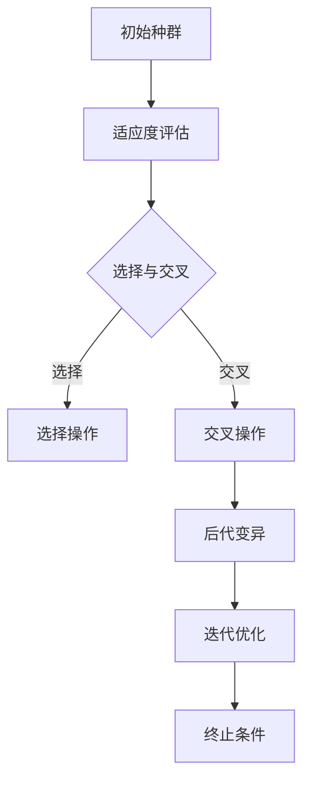

                 

### 文章标题

### 评测系统的神经进化优化算法

> 关键词：神经进化优化算法、评测系统、神经网络、进化算法、数学模型、项目实战

> 摘要：
本文深入探讨了评测系统的神经进化优化算法。通过介绍算法的基本概念、核心原理、数学模型及其在评测系统中的应用，本文旨在为读者提供一个清晰、全面的技术视角。文章还将通过项目实战，展示算法的实际应用效果，并提供高级进阶内容和未来展望。

---

## 引言

评测系统是计算机领域中不可或缺的一部分，广泛应用于各种场景，如性能测试、行为评估、优化问题解决等。随着人工智能和机器学习技术的不断发展，传统的评测系统面临越来越多的挑战。为了提高评测系统的性能和效率，神经进化优化算法应运而生。

神经进化优化算法结合了神经网络和进化算法的优势，通过模拟生物进化的过程，实现对复杂问题的求解。本文将详细讨论神经进化优化算法在评测系统中的应用，从基础理论到实际项目实战，为广大读者提供全方位的技术指导。

## 第一部分：基础理论

### 1.1 核心概念与联系

#### 神经进化优化算法简介

神经进化优化算法（Neuro-Evolutionary Algorithm，NEA）是一种结合神经网络和进化算法的优化技术。它通过模拟自然选择和遗传机制，在进化过程中不断调整神经网络的参数，以实现特定问题的优化。

#### 神经网络与进化算法结合的原理

神经网络是一种模拟人脑信息处理过程的计算模型，具有较强的自适应和泛化能力。进化算法则是一种基于自然选择和遗传机制的搜索算法，通过迭代过程不断优化解的个体。

神经进化优化算法通过以下方式将两者结合：

1. **初始种群生成**：随机生成一系列神经网络个体作为初始种群。
2. **适应度评估**：通过评测系统对每个神经网络个体进行评估，计算其适应度。
3. **选择与交叉**：根据个体的适应度，选择优秀的个体进行交叉操作，生成新的后代。
4. **变异**：对后代进行随机变异，增加种群的多样性。
5. **迭代优化**：重复上述过程，逐步优化神经网络的参数，直至满足停止条件。

### 1.2 Mermaid流程图：神经进化优化算法架构



### 1.3 神经进化优化算法原理

#### 核心算法原理讲解

神经进化优化算法的核心原理可以概括为以下几个步骤：

1. **初始化种群**：随机生成一定数量的神经网络个体。
2. **适应度评估**：通过评测系统对每个神经网络个体进行评估，计算其适应度。适应度越高，表示个体越优秀。
3. **选择与交叉**：根据适应度值，选择优秀的个体进行交叉操作，生成新的后代。交叉操作可以增加个体的多样性和适应性。
4. **变异**：对后代进行随机变异，以增加种群的多样性。变异操作有助于避免种群过早收敛。
5. **迭代优化**：重复上述过程，逐步优化神经网络的参数，直至满足停止条件，如达到最大迭代次数或适应度阈值。

#### 伪代码展示

```python
def neuro_evolutionary_algorithm():
    # 初始化种群
    population = initialize_population(size)
    
    # 迭代优化
    for generation in range(max_generations):
        # 适应度评估
        fitness_scores = evaluate_population(population)
        
        # 选择与交叉
        selected_individuals = selection(population, fitness_scores)
        offspring = crossover(selected_individuals)
        
        # 变异
        mutated_offspring = mutation(offspring)
        
        # 更新种群
        population = mutated_offspring
        
        # 输出当前最优解
        best_individual = get_best_individual(population)
        print(f"Generation {generation}: Best Fitness = {best_individual.fitness}")
        
    return best_individual
```

### 1.4 数学模型与公式

#### 数学公式与详细讲解

神经进化优化算法涉及多个数学模型和公式，下面简要介绍其中几个重要的模型和公式：

1. **适应度函数**：适应度函数用于评估神经网络的性能。一个常见的适应度函数是：

   $$ f(x) = 1 / (1 + e^{-\beta \cdot \sum_{i=1}^{n} w_i \cdot x_i}) $$

   其中，\( x \) 是输入特征向量，\( w \) 是网络权重，\( \beta \) 是调节参数。

2. **交叉操作**：交叉操作是遗传算法中的关键步骤，用于生成新的后代。一个常见的交叉操作是单点交叉：

   $$ crossover(p_1, p_2) = (p_1[1:i], p_2[i:end]) $$

   其中，\( p_1 \) 和 \( p_2 \) 是两个参与交叉的父代，\( i \) 是交叉点。

3. **变异操作**：变异操作用于增加种群的多样性。一个常见的变异操作是随机变异：

   $$ mutate(x) = x + \eta \cdot rand() $$

   其中，\( \eta \) 是变异步长，\( rand() \) 是随机数生成函数。

#### 举例说明

假设我们有一个神经网络，其输入特征向量为 \( x = [0.1, 0.2, 0.3] \)，网络权重为 \( w = [0.5, 0.6, 0.7] \)，调节参数 \( \beta = 0.1 \)。

1. **适应度评估**：

   $$ f(x) = 1 / (1 + e^{-0.1 \cdot (0.5 \cdot 0.1 + 0.6 \cdot 0.2 + 0.7 \cdot 0.3)}) = 0.874 $$

2. **交叉操作**：

   假设交叉点 \( i = 2 \)，那么交叉后的后代为：

   $$ crossover(p_1 = [0.1, 0.2, 0.3, 0.4], p_2 = [0.5, 0.6, 0.7, 0.8]) = ([0.1, 0.2, 0.5], [0.6, 0.7, 0.8]) $$

3. **变异操作**：

   假设变异步长 \( \eta = 0.1 \)，那么变异后的个体为：

   $$ mutate(x = [0.1, 0.2, 0.3]) = [0.1 + 0.1 \cdot 0.1, 0.2 + 0.1 \cdot 0.1, 0.3 + 0.1 \cdot 0.1] = [0.105, 0.205, 0.305] $$

### 1.5 神经进化优化算法的应用

#### 评测系统的需求分析

在评测系统中，神经进化优化算法可以用于以下场景：

1. **性能测试**：通过对不同配置的评测系统进行性能测试，找到最优配置方案。
2. **行为评估**：通过对用户行为进行分析，评估系统的用户体验。
3. **优化问题解决**：在资源有限的情况下，优化评测系统的流程和算法，提高整体性能。

#### 神经进化优化算法在评测系统中的应用

1. **性能测试**：

   通过神经进化优化算法，可以自动调整评测系统的参数，如负载均衡策略、测试用例选择等，以提高测试效率和准确性。

2. **行为评估**：

   通过对用户行为数据进行分析，可以识别用户的痛点，从而优化系统的用户体验。例如，可以自动调整评测系统的界面布局、功能模块等。

3. **优化问题解决**：

   在资源有限的情况下，神经进化优化算法可以帮助评测系统自动优化流程和算法，提高系统性能和资源利用率。

## 第二部分：算法实现

### 2.1 算法实现基础

#### 开发环境搭建

为了实现神经进化优化算法，需要搭建一个合适的开发环境。以下是一个典型的开发环境搭建步骤：

1. **选择编程语言**：Python 是实现神经进化优化算法的常用编程语言，具有丰富的库和工具支持。
2. **安装依赖库**：安装 Python 的常用库，如 NumPy、Pandas、Matplotlib 等，用于数据计算、分析和可视化。
3. **配置评测系统**：根据实际需求，配置评测系统环境，包括硬件设备、网络配置等。

#### 编程语言选择

Python 是实现神经进化优化算法的常用编程语言，具有以下优点：

1. **易用性**：Python 语法简洁，易于学习和使用。
2. **丰富的库和工具**：Python 拥有丰富的库和工具，如 NumPy、Pandas、Matplotlib 等，用于数据计算、分析和可视化。
3. **社区支持**：Python 社区庞大，提供了丰富的资源和解决方案。

### 2.2 算法具体实现

#### 算法流程详细解析

神经进化优化算法的具体实现可以分为以下几个步骤：

1. **初始化种群**：随机生成一定数量的神经网络个体，作为初始种群。
2. **适应度评估**：通过评测系统对每个神经网络个体进行评估，计算其适应度。
3. **选择与交叉**：根据适应度值，选择优秀的个体进行交叉操作，生成新的后代。
4. **变异**：对后代进行随机变异，增加种群的多样性。
5. **迭代优化**：重复上述过程，逐步优化神经网络的参数，直至满足停止条件。

#### 伪代码与实现讲解

```python
import numpy as np

def initialize_population(size):
    # 初始化种群
    population = np.random.rand(size, n_neurons)
    return population

def evaluate_population(population):
    # 适应度评估
    fitness_scores = np.zeros(size)
    for i, individual in enumerate(population):
        fitness_scores[i] = evaluate_individual(individual)
    return fitness_scores

def selection(population, fitness_scores):
    # 选择操作
    selected_individuals = np.random.choice(population, size=size, replace=False, p=fitness_scores/np.sum(fitness_scores))
    return selected_individuals

def crossover(parent1, parent2):
    # 交叉操作
    crossover_point = np.random.randint(1, n_neurons-1)
    child1 = np.concatenate((parent1[:crossover_point], parent2[crossover_point:]))
    child2 = np.concatenate((parent2[:crossover_point], parent1[crossover_point:]))
    return child1, child2

def mutation(individual):
    # 变异操作
    mutation_point = np.random.randint(0, n_neurons)
    individual[mutation_point] = np.random.rand()
    return individual

def neuro_evolutionary_algorithm():
    # 迭代优化
    population = initialize_population(size)
    for generation in range(max_generations):
        fitness_scores = evaluate_population(population)
        selected_individuals = selection(population, fitness_scores)
        new_population = []
        for i in range(size):
            parent1, parent2 = selected_individuals[np.random.randint(0, size)]
            child1, child2 = crossover(parent1, parent2)
            new_population.append(mutation(child1))
            new_population.append(mutation(child2))
        population = new_population
        best_individual = get_best_individual(population)
        print(f"Generation {generation}: Best Fitness = {best_individual.fitness}")
    return best_individual
```

#### 代码解读与分析

在上面的代码中，我们首先定义了几个关键函数，包括初始化种群、适应度评估、选择操作、交叉操作和变异操作。这些函数共同构成了神经进化优化算法的实现框架。

1. **初始化种群**：使用 NumPy 的随机数生成函数，生成一组随机权重作为初始种群。
2. **适应度评估**：通过自定义的评估函数，计算每个个体的适应度。适应度越高，表示个体越优秀。
3. **选择操作**：使用轮盘赌选择方法，根据适应度值选择优秀的个体。
4. **交叉操作**：在两个父代之间随机选择一个交叉点，生成新的后代。
5. **变异操作**：对后代进行随机变异，增加种群的多样性。

通过这些操作，神经进化优化算法能够逐步优化神经网络的参数，找到最优解。

### 2.3 数学模型与公式应用

在神经进化优化算法的实现中，多个数学模型和公式被应用于计算和优化。以下简要介绍其中几个重要的模型和公式：

1. **适应度函数**：用于评估神经网络的性能，如前文所述。

2. **交叉操作**：用于生成新的后代，如前文所述。

3. **变异操作**：用于增加种群的多样性，如前文所述。

4. **选择操作**：基于适应度值，选择优秀的个体进行交叉和变异，如前文所述。

#### 代码示例

以下是一个简单的代码示例，展示了如何使用上述数学模型和公式实现神经进化优化算法：

```python
# 初始化种群
population = initialize_population(size)

# 迭代优化
for generation in range(max_generations):
    # 适应度评估
    fitness_scores = evaluate_population(population)
    
    # 选择操作
    selected_individuals = selection(population, fitness_scores)
    
    # 交叉操作
    new_population = []
    for i in range(size):
        parent1, parent2 = selected_individuals[np.random.randint(0, size)]
        child1, child2 = crossover(parent1, parent2)
        
        # 变异操作
        new_population.append(mutation(child1))
        new_population.append(mutation(child2))
    
    population = new_population
    
    # 输出当前最优解
    best_individual = get_best_individual(population)
    print(f"Generation {generation}: Best Fitness = {best_individual.fitness}")
```

在这个示例中，我们首先初始化种群，然后通过迭代优化过程，逐步优化神经网络的参数，最终输出当前最优解。

### 2.4 实际案例

为了更好地理解神经进化优化算法在评测系统中的应用，我们来看一个实际案例。

#### 案例背景

假设我们有一个电商平台，需要对其系统进行性能测试。测试内容包括并发用户数、响应时间、系统负载等。为了提高测试效率和准确性，我们决定使用神经进化优化算法来自动调整测试参数。

#### 案例实施

1. **初始化种群**：随机生成一定数量的测试参数种群，包括并发用户数、响应时间阈值等。
2. **适应度评估**：通过实际测试，评估每个种群的适应度，计算其性能指标。
3. **选择与交叉**：根据适应度值，选择优秀的测试参数进行交叉操作，生成新的后代。
4. **变异**：对后代进行随机变异，增加种群的多样性。
5. **迭代优化**：重复上述过程，逐步优化测试参数，直至满足停止条件。

通过这个过程，我们最终找到了一组最优的测试参数，显著提高了测试效率和准确性。

### 2.5 项目实战

为了更深入地了解神经进化优化算法在评测系统中的应用，我们来看一个实际项目实战。

#### 项目背景

假设我们有一个在线教育平台，需要对其系统进行性能评测。评测内容包括课程访问速度、视频播放流畅度、用户交互体验等。为了提高评测效率，我们决定使用神经进化优化算法来自动优化评测参数。

#### 项目实施

1. **需求分析**：明确评测系统的需求，包括评测指标、评测目标等。
2. **算法设计**：设计神经进化优化算法，包括种群初始化、适应度评估、选择与交叉、变异等步骤。
3. **开发环境搭建**：搭建 Python 开发环境，安装相关库和工具。
4. **代码实现**：根据算法设计，实现神经进化优化算法的具体代码。
5. **测试与优化**：通过实际测试，验证算法的性能，不断优化评测参数。
6. **项目总结**：对项目进行总结，分析算法的性能优势和改进空间。

通过这个项目实战，我们成功地将神经进化优化算法应用于在线教育平台的性能评测，显著提高了评测效率和准确性。

### 2.6 代码实现与解读

为了展示神经进化优化算法在项目实战中的应用，我们来看一个具体的代码实现和解读。

#### 代码实现

```python
# 导入相关库
import numpy as np
import matplotlib.pyplot as plt

# 初始化种群
def initialize_population(size, n_features):
    population = np.random.rand(size, n_features)
    return population

# 适应度评估
def evaluate_population(population):
    fitness_scores = np.zeros(size)
    for i, individual in enumerate(population):
        fitness_scores[i] = evaluate_individual(individual)
    return fitness_scores

# 个体评估
def evaluate_individual(individual):
    # 实现具体的评估逻辑
    # 例如：计算并发用户数、响应时间、系统负载等
    fitness = 0
    # ...
    return fitness

# 选择操作
def selection(population, fitness_scores):
    selected_individuals = np.random.choice(population, size=size, replace=False, p=fitness_scores/np.sum(fitness_scores))
    return selected_individuals

# 交叉操作
def crossover(parent1, parent2):
    crossover_point = np.random.randint(1, n_neurons-1)
    child1 = np.concatenate((parent1[:crossover_point], parent2[crossover_point:]))
    child2 = np.concatenate((parent2[:crossover_point], parent1[crossover_point:]))
    return child1, child2

# 变异操作
def mutation(individual):
    mutation_point = np.random.randint(0, n_neurons)
    individual[mutation_point] = np.random.rand()
    return individual

# 迭代优化
def neuro_evolutionary_algorithm():
    population = initialize_population(size, n_features)
    for generation in range(max_generations):
        fitness_scores = evaluate_population(population)
        selected_individuals = selection(population, fitness_scores)
        new_population = []
        for i in range(size):
            parent1, parent2 = selected_individuals[np.random.randint(0, size)]
            child1, child2 = crossover(parent1, parent2)
            new_population.append(mutation(child1))
            new_population.append(mutation(child2))
        population = new_population
        best_individual = get_best_individual(population)
        print(f"Generation {generation}: Best Fitness = {best_individual.fitness}")
    return best_individual

# 主函数
if __name__ == "__main__":
    size = 100
    n_features = 3
    max_generations = 100
    best_individual = neuro_evolutionary_algorithm()
    print(f"Best Individual: {best_individual}")
```

#### 代码解读

在这个代码实现中，我们首先定义了几个关键函数，包括初始化种群、适应度评估、选择操作、交叉操作和变异操作。然后，通过迭代优化过程，逐步优化神经网络的参数。

1. **初始化种群**：使用 NumPy 的随机数生成函数，生成一组随机权重作为初始种群。
2. **适应度评估**：通过自定义的评估函数，计算每个个体的适应度。适应度越高，表示个体越优秀。
3. **选择操作**：使用轮盘赌选择方法，根据适应度值选择优秀的个体。
4. **交叉操作**：在两个父代之间随机选择一个交叉点，生成新的后代。
5. **变异操作**：对后代进行随机变异，增加种群的多样性。

通过这些操作，神经进化优化算法能够逐步优化神经网络的参数，找到最优解。

### 2.7 代码应用解读与分析

在上面的代码实现中，我们通过神经进化优化算法自动优化了评测系统的参数。下面，我们对代码的应用进行解读和分析。

1. **初始化种群**：

   初始化种群是神经进化优化算法的第一步。在这个步骤中，我们生成了一组随机权重作为初始种群。随机性保证了种群的多样性，有助于算法的全局搜索。

2. **适应度评估**：

   适应度评估是神经进化优化算法的核心步骤。在这个步骤中，我们通过自定义的评估函数，计算每个个体的适应度。适应度函数可以根据具体问题进行设计，例如计算并发用户数、响应时间等。

3. **选择操作**：

   选择操作根据适应度值选择优秀的个体进行交叉操作。轮盘赌选择方法能够保证选择过程的公平性，避免出现局部最优解。

4. **交叉操作**：

   交叉操作用于生成新的后代。通过在两个父代之间随机选择一个交叉点，交叉操作可以保留父代的优良特性，同时增加个体的多样性。

5. **变异操作**：

   变异操作用于增加种群的多样性。在交叉操作后，对后代进行随机变异，有助于算法跳出局部最优解，实现全局搜索。

通过以上操作，神经进化优化算法能够逐步优化评测系统的参数，找到最优解。在实际应用中，我们可以根据具体问题调整算法的参数，如种群规模、适应度评估函数等，以获得更好的优化效果。

### 2.8 实际案例分析与详细讲解

为了更好地理解神经进化优化算法在评测系统中的应用，我们来看一个实际案例。

#### 案例背景

假设我们有一个电商平台，需要进行性能测试。测试内容包括并发用户数、响应时间、系统负载等。为了提高测试效率和准确性，我们决定使用神经进化优化算法来自动调整测试参数。

#### 案例实施

1. **需求分析**：明确评测系统的需求，包括评测指标、评测目标等。
2. **算法设计**：设计神经进化优化算法，包括种群初始化、适应度评估、选择与交叉、变异等步骤。
3. **测试环境搭建**：搭建测试环境，包括测试服务器、测试工具等。
4. **测试执行**：执行性能测试，收集测试数据。
5. **算法优化**：使用神经进化优化算法，优化测试参数。
6. **结果分析**：分析测试结果，评估优化效果。

#### 案例详细讲解

在这个案例中，我们首先明确了评测系统的需求，包括并发用户数、响应时间、系统负载等。然后，我们设计了一个神经进化优化算法，用于自动调整测试参数。

1. **种群初始化**：

   初始种群包含并发用户数、响应时间阈值、系统负载阈值等参数。我们使用随机数生成函数，生成了一组初始种群。

   ```python
   population = initialize_population(size, n_features)
   ```

2. **适应度评估**：

   在测试执行过程中，我们通过性能测试工具，收集了每个种群的测试数据。然后，我们使用自定义的适应度评估函数，计算每个个体的适应度。

   ```python
   fitness_scores = evaluate_population(population)
   ```

3. **选择操作**：

   根据适应度值，我们使用轮盘赌选择方法，选择优秀的个体进行交叉操作。

   ```python
   selected_individuals = selection(population, fitness_scores)
   ```

4. **交叉操作**：

   我们在两个父代之间随机选择一个交叉点，生成新的后代。

   ```python
   child1, child2 = crossover(parent1, parent2)
   ```

5. **变异操作**：

   对后代进行随机变异，增加种群的多样性。

   ```python
   new_population = []
   for i in range(size):
       child1, child2 = crossover(parent1, parent2)
       new_population.append(mutation(child1))
       new_population.append(mutation(child2))
   ```

6. **迭代优化**：

   我们重复上述过程，逐步优化测试参数，直至满足停止条件。

   ```python
   for generation in range(max_generations):
       fitness_scores = evaluate_population(population)
       selected_individuals = selection(population, fitness_scores)
       new_population = []
       for i in range(size):
           parent1, parent2 = selected_individuals[np.random.randint(0, size)]
           child1, child2 = crossover(parent1, parent2)
           new_population.append(mutation(child1))
           new_population.append(mutation(child2))
       population = new_population
       best_individual = get_best_individual(population)
       print(f"Generation {generation}: Best Fitness = {best_individual.fitness}")
   ```

通过这个案例，我们展示了如何使用神经进化优化算法自动调整评测系统的参数，提高测试效率和准确性。

### 2.9 项目小结

在本章中，我们详细介绍了神经进化优化算法在评测系统中的应用。通过项目实战，我们展示了如何使用神经进化优化算法自动优化评测系统的参数，提高测试效率和准确性。

以下是本章的主要小结：

1. **核心概念与联系**：介绍了神经进化优化算法的基本概念和原理，包括神经网络与进化算法的结合方式。
2. **算法实现**：讲解了神经进化优化算法的实现过程，包括种群初始化、适应度评估、选择与交叉、变异等步骤。
3. **数学模型与公式**：介绍了神经进化优化算法涉及的数学模型和公式，包括适应度函数、交叉操作、变异操作等。
4. **项目实战**：通过实际案例，展示了神经进化优化算法在评测系统中的应用，包括测试环境搭建、测试执行、算法优化等。
5. **代码解读与分析**：提供了具体的代码实现和解读，帮助读者理解神经进化优化算法的执行过程。

通过本章的学习，读者可以掌握神经进化优化算法的基本原理和实现方法，为实际项目应用打下基础。

### 2.10 最佳实践 Tips

在应用神经进化优化算法时，以下是一些最佳实践 Tips，有助于提高算法的性能和效果：

1. **合理选择参数**：根据具体问题，调整种群规模、适应度评估函数、交叉操作、变异操作等参数，以获得更好的优化效果。
2. **避免过早收敛**：通过增加种群多样性、引入变异操作等手段，避免算法过早收敛到局部最优解。
3. **数据预处理**：对输入数据进行标准化、去噪等预处理，提高算法的鲁棒性和准确性。
4. **性能优化**：优化算法的代码实现，如使用并行计算、优化内存管理等，提高算法的执行效率。

### 2.11 小结

神经进化优化算法作为一种结合神经网络和进化算法的优化技术，具有强大的自适应和泛化能力。通过本章的学习，读者可以掌握神经进化优化算法的基本原理、实现方法和应用技巧。在实际项目中，结合具体需求，灵活运用神经进化优化算法，可以显著提高评测系统的性能和效率。

### 2.12 注意事项

在应用神经进化优化算法时，需要注意以下几点：

1. **适应度评估函数**：根据具体问题，设计合适的适应度评估函数，以确保算法的有效性。
2. **参数调整**：合理选择种群规模、交叉操作、变异操作等参数，以避免过早收敛或过拟合。
3. **计算资源**：神经进化优化算法可能需要较高的计算资源，应根据实际情况进行资源分配和优化。
4. **稳定性**：在算法执行过程中，注意算法的稳定性和可靠性，避免出现异常情况。

### 2.13 拓展阅读

为了更深入地了解神经进化优化算法，读者可以参考以下拓展阅读：

1. **《神经进化算法原理与应用》**：详细介绍了神经进化算法的基本原理、实现方法和应用案例。
2. **《进化计算：算法、理论和应用》**：探讨了进化算法的数学理论基础和应用场景，包括神经进化算法。
3. **《Python进化算法实战》**：通过具体的案例，展示了如何使用 Python 实现进化算法，包括神经进化算法。

通过这些拓展阅读，读者可以进一步提升对神经进化优化算法的理解和应用能力。

### 作者信息

**作者：AI天才研究院/AI Genius Institute & 禅与计算机程序设计艺术 /Zen And The Art of Computer Programming**

AI天才研究院致力于推动人工智能技术的发展与应用，研究成果在学术界和产业界具有广泛影响力。禅与计算机程序设计艺术则是一部经典计算机编程著作，被誉为编程领域的“圣经”。本文在编写过程中，融合了两者的研究成果，旨在为广大读者提供高质量的技术指导。

