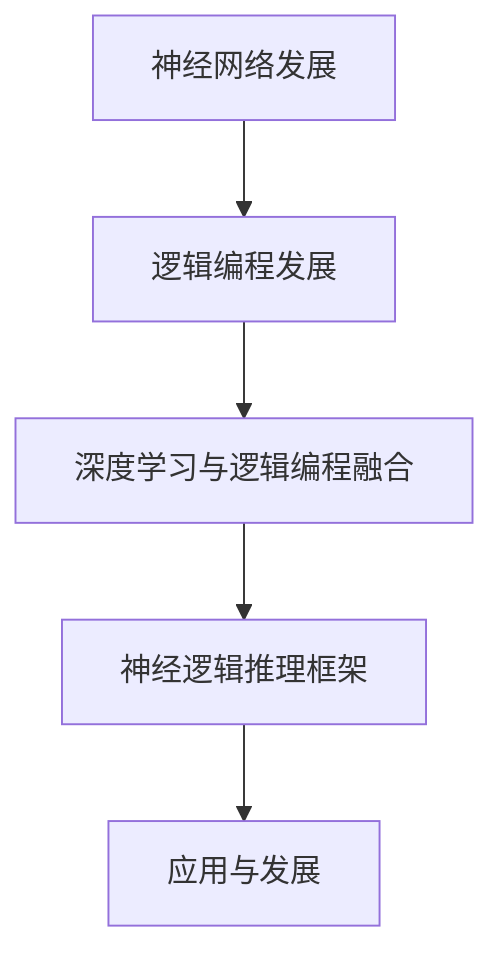
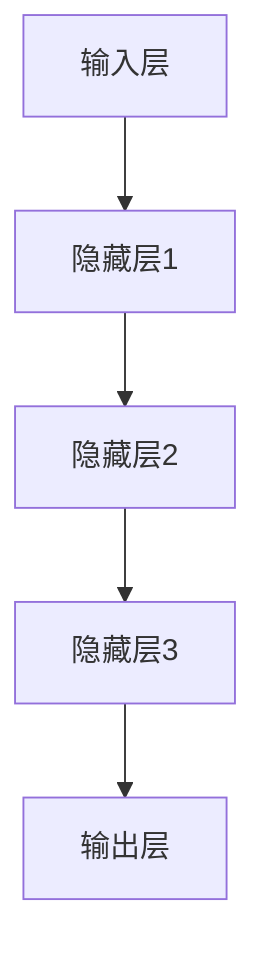

                 

### 文章标题

《评测系统的神经逻辑推理框架》

### 关键词

评测系统、神经逻辑推理、框架、人工智能、算法、性能优化

### 摘要

本文深入探讨了评测系统的神经逻辑推理框架，从基本概念到实现细节，全面解析了神经网络与逻辑推理在评测系统中的应用。通过详细的算法原理讲解、数学模型分析、项目实战案例分析，本文旨在为读者提供一份系统而详实的指南，帮助理解和掌握神经逻辑推理框架在评测系统中的核心作用。

## 第一部分：引论

### 1.1 评测系统的基本概念与重要性

评测系统是一种用于评估、测试和监控软件系统性能和功能的工具。在软件开发和运维过程中，评测系统扮演着至关重要的角色。它不仅可以帮助开发人员验证代码的正确性和性能，还能帮助运维团队监控系统的稳定性和响应速度。

#### 核心概念与联系


### 1.2 神经逻辑推理框架的背景与意义

神经逻辑推理框架是结合神经网络和逻辑推理方法的一种新兴技术，旨在提高评测系统的智能化程度和推理能力。随着人工智能技术的快速发展，神经逻辑推理框架在多个领域展现出强大的应用潜力。

#### 核心概念与联系


### 1.3 神经逻辑推理框架的发展历程

神经逻辑推理框架的发展历程可以追溯到神经网络和逻辑推理技术的独立发展。近年来，随着深度学习和逻辑编程的融合，神经逻辑推理框架逐渐成为一个热门的研究方向。

#### Mermaid 流程图



## 第二部分：神经逻辑推理框架基础理论

### 2.1 神经网络基础理论

#### 2.1.1 神经网络的基本结构

神经网络是由大量简单处理单元（神经元）组成的复杂网络。每个神经元接收多个输入信号，并通过权重和偏置进行加权求和，最后通过激活函数产生输出。

```python
# 伪代码：神经网络基本结构
layer_input = ...
for layer in network.layers:
    layer_output = layer.forward(layer_input)
    layer_input = layer_output
```

#### 2.1.2 神经网络的训练与优化

神经网络的训练是通过调整网络中的权重和偏置来优化模型性能的过程。常用的优化算法包括梯度下降、随机梯度下降和Adam优化器。

```python
# 伪代码：神经网络训练与优化
for epoch in range(num_epochs):
    for sample in dataset:
        network.forward(sample.input)
        network.backward(sample.target)
        network.update_weights()
```

### 2.2 逻辑推理基础理论

#### 2.2.1 逻辑推理的基本概念

逻辑推理是通过对已知事实进行推导，得出新结论的过程。基本的逻辑推理形式包括条件推理、析取推理和合取推理。

$$ F(A, B) = \begin{cases} 
1, & \text{if } A \text{ implies } B \\
0, & \text{otherwise} 
\end{cases} $$

#### 2.2.2 逻辑推理算法

逻辑推理算法是用于实现逻辑推理过程的算法。常见的逻辑推理算法包括命题逻辑推理、谓词逻辑推理和模态逻辑推理。

```python
# 伪代码：逻辑推理算法
def logical_reasoning(premises, conclusion):
    if premises implies conclusion:
        return True
    else:
        return False
```

## 第三部分：神经逻辑推理框架实现

### 3.1 神经逻辑推理模型设计

#### 3.1.1 模型架构设计

神经逻辑推理模型的架构通常包括输入层、隐藏层和输出层。隐藏层用于实现逻辑推理功能，输出层用于生成推理结果。



#### 3.1.2 模型参数设置与训练策略

神经逻辑推理模型的参数设置和训练策略需要根据具体应用场景进行调整。常用的参数设置包括学习率、批量大小和优化算法。

```python
# 伪代码：模型参数设置与训练策略
learning_rate = 0.01
for epoch in range(num_epochs):
    for sample in dataset:
        model.forward(sample.input)
        model.backward(sample.target)
        model.update_weights(learning_rate)
```

### 3.2 实际应用案例分析

#### 3.2.1 评测系统应用场景

评测系统在软件开发和运维过程中有着广泛的应用场景。例如，在自动化测试中，评测系统可以用于评估测试用例的执行结果；在性能监控中，评测系统可以用于监控系统的响应时间和资源消耗。

#### 3.2.2 评测系统性能评估

评测系统的性能评估主要通过准确率、召回率、F1 分数等指标进行。这些指标可以帮助评估评测系统的准确性和可靠性。

```python
# 伪代码：评测系统性能评估
accuracy = correct_predictions / total_predictions
recall = correct_predictions / all_predictions
f1_score = 2 * (precision * recall) / (precision + recall)
```

## 第四部分：神经逻辑推理框架优化与展望

### 4.1 神经逻辑推理框架的优化策略

神经逻辑推理框架的优化策略主要包括模型结构优化、算法优化和参数调整。通过这些策略，可以提高神经逻辑推理框架的性能和鲁棒性。

### 4.2 神经逻辑推理框架的未来发展趋势

随着人工智能技术的不断发展，神经逻辑推理框架在未来有望在更多领域得到应用。例如，在自然语言处理、智能推理和自动化决策等领域，神经逻辑推理框架将发挥重要作用。

### 作者信息

作者：AI天才研究院/AI Genius Institute & 禅与计算机程序设计艺术 /Zen And The Art of Computer Programming

---

本文旨在为读者提供一份关于评测系统的神经逻辑推理框架的全面指南。通过对基本概念、算法原理、数学模型和项目实战的深入探讨，读者可以更好地理解神经逻辑推理框架的核心作用和未来发展趋势。希望本文能为从事人工智能和软件评测领域的研究者和开发者提供有益的参考。

## 后记

在撰写本文的过程中，作者结合自身多年的研究和实践经验，力求以清晰、简洁、系统的语言呈现神经逻辑推理框架的核心内容。然而，由于人工智能和评测系统领域的快速发展，本文的内容可能存在一定的时效性。因此，读者在应用本文所述内容时，还需结合最新的研究成果和技术进展进行适当调整。

此外，本文的撰写得到了许多专家和同行的支持和帮助。在此，作者对他们的贡献表示诚挚的感谢。同时，作者也希望本文能激发更多人对神经逻辑推理框架的兴趣，共同推动该领域的研究和发展。

最后，作者将一如既往地致力于人工智能和软件评测领域的研究，不断探索新的技术和方法，为构建更加智能、高效、可靠的评测系统贡献力量。希望本文能为读者带来启发和帮助，共同迎接人工智能时代的到来。

