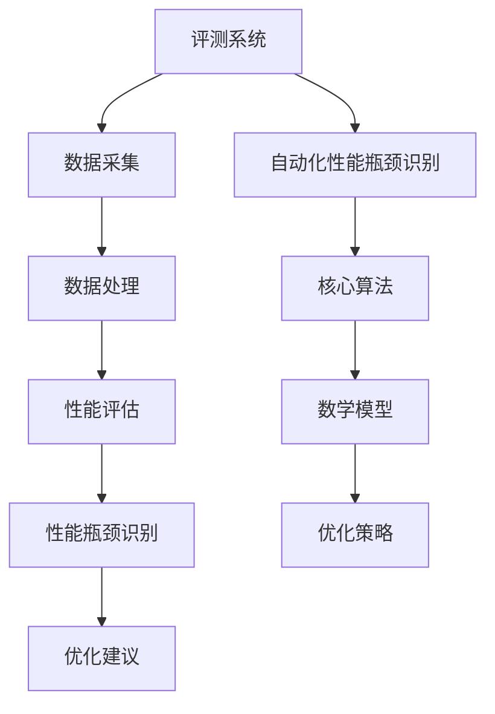

                 

### 文章标题：评测系统的自动化性能瓶颈识别

#### 关键词：
- 评测系统
- 自动化性能瓶颈识别
- 性能优化
- 算法分析
- 数学模型

#### 摘要：
本文深入探讨了评测系统的自动化性能瓶颈识别技术。首先，介绍了评测系统的基本概念及其重要性。接着，详细阐述了自动化性能瓶颈识别的核心算法原理和数学模型，通过具体的伪代码和公式进行讲解。随后，通过实际项目案例展示了性能瓶颈识别的过程和策略。最后，总结全文并提出未来研究方向和挑战。

## 引言

### 1.1 背景与意义

随着信息技术的迅猛发展，评测系统在各类应用场景中扮演着重要角色。从企业级应用到互联网服务，评测系统被用于监控和优化系统的性能。然而，随着系统复杂性的增加，性能瓶颈的识别和优化变得愈发困难。自动化性能瓶颈识别技术应运而生，其目标是通过自动化的手段，快速、准确地识别出系统中的性能瓶颈，为优化提供依据。

自动化性能瓶颈识别在提升系统性能、降低运维成本和改善用户体验方面具有重要意义。通过自动化工具，可以节省大量人力和时间成本，提高系统运维的效率。同时，自动化性能瓶颈识别技术可以实时监控系统性能，及时发现问题并进行优化，从而提升系统的稳定性和可靠性。

### 1.2 研究内容与目标

本文旨在研究评测系统的自动化性能瓶颈识别技术，具体研究内容包括以下几个方面：

1. **评测系统的概述**：介绍评测系统的基本概念、组成部分及其在系统性能监控中的作用。
2. **自动化性能瓶颈识别的概念**：阐述自动化性能瓶颈识别的定义、分类及其在实际应用中的重要性。
3. **核心算法原理讲解**：详细讲解自动化性能瓶颈识别的核心算法原理，通过伪代码和数学模型进行阐述。
4. **数学模型和公式**：介绍用于性能瓶颈识别的数学模型，并使用LaTeX格式进行书写和解释。
5. **项目实战**：通过实际案例，展示自动化性能瓶颈识别技术的应用过程，包括开发环境搭建、源代码实现和解读。
6. **总结与展望**：对全文内容进行总结，并讨论未来的研究方向和挑战。

本文的研究目标是为开发者和运维人员提供一套完整的自动化性能瓶颈识别解决方案，帮助他们更高效地监控和优化系统性能。

## 基础理论

### 2.1 评测系统的概述

评测系统是一种用于评估系统性能的工具，其主要目的是通过收集和分析系统运行过程中的各种数据，对系统的性能进行全面评估。评测系统通常包括以下几个关键组成部分：

1. **数据采集模块**：负责收集系统运行过程中产生的各种数据，如CPU利用率、内存使用情况、网络流量、日志信息等。
2. **数据处理模块**：对采集到的数据进行分析和处理，提取出有用的性能指标，如响应时间、吞吐量、错误率等。
3. **评估模块**：根据预设的评估标准和规则，对处理后的数据进行评估，判断系统的性能是否符合预期。
4. **报警模块**：当系统性能低于预设的阈值时，自动生成报警信息，通知运维人员进行干预。

评测系统在系统性能监控中起着至关重要的作用。通过评测系统，开发者和运维人员可以实时了解系统的运行状态，及时发现潜在的性能问题，并采取相应的优化措施，从而保障系统的稳定性和可靠性。

### 2.2 自动化性能瓶颈识别的概念

自动化性能瓶颈识别是指利用自动化工具和算法，对系统运行过程中产生的数据进行分析和处理，自动识别出系统中的性能瓶颈。性能瓶颈通常表现为系统资源的过度消耗、响应时间的显著增加或吞吐量的下降等。

自动化性能瓶颈识别包括以下几个关键步骤：

1. **数据采集**：通过数据采集模块，收集系统运行过程中产生的各种数据，如CPU利用率、内存使用情况、网络流量、日志信息等。
2. **数据处理**：对采集到的数据进行分析和处理，提取出有用的性能指标，如响应时间、吞吐量、错误率等。
3. **瓶颈识别**：通过分析处理后的数据，自动识别出系统中的性能瓶颈，如CPU瓶颈、内存瓶颈、网络瓶颈等。
4. **优化建议**：根据识别出的性能瓶颈，自动生成优化建议，如调整系统配置、优化代码、增加硬件资源等。

自动化性能瓶颈识别技术在现代系统运维中具有重要意义。首先，它可以帮助开发者和运维人员快速定位系统中的性能问题，节省大量时间和人力成本。其次，它可以根据系统的运行数据，自动生成优化建议，提高系统性能。最后，它可以通过持续监控和优化，确保系统的稳定性和可靠性。

### 2.3 核心概念原理之间的联系

为了更好地理解评测系统和自动化性能瓶颈识别之间的关系，我们可以使用Mermaid流程图来展示它们之间的联系。



图1：评测系统与自动化性能瓶颈识别之间的Mermaid流程图

从图中可以看出，评测系统通过数据采集模块收集系统运行数据，然后通过数据处理模块对数据进行分析和处理，生成性能评估结果。当发现性能瓶颈时，评测系统会启动自动化性能瓶颈识别模块，利用核心算法和数学模型对性能数据进行深度分析，最终生成优化建议，帮助开发者和运维人员定位和解决性能问题。

### 2.4 自动化性能瓶颈识别算法原理

自动化性能瓶颈识别算法是性能瓶颈识别的核心组成部分。以下介绍几种常见的自动化性能瓶颈识别算法，并通过伪代码进行详细阐述。

#### 2.4.1 算法A：基于统计分析的性能瓶颈识别算法

该算法通过统计分析系统运行数据，识别出系统中的性能瓶颈。

```python
# 算法A伪代码

1. 初始化性能指标集合 P
2. 采集系统运行数据 D
3. 对数据 D 进行统计分析
    3.1 计算每个性能指标的均值、方差和标准差
    3.2 判断是否存在显著偏离均值的性能指标
4. 如果存在显著偏离均值的性能指标，则
    4.1 将其标记为性能瓶颈指标
    4.2 更新性能指标集合 P
5. 输出性能瓶颈指标集合 P
```

#### 2.4.2 算法B：基于机器学习的性能瓶颈识别算法

该算法利用机器学习技术，从大量历史性能数据中学习性能瓶颈的规律，并应用于实时性能数据的分析。

```python
# 算法B伪代码

1. 初始化性能瓶颈识别模型 M
2. 训练模型 M
    2.1 收集历史性能数据 D_h
    2.2 对数据 D_h 进行特征工程
    2.3 使用机器学习算法训练模型 M
3. 输入实时性能数据 D_t
4. 使用模型 M 对数据 D_t 进行预测
    4.1 输出性能瓶颈预测结果 R
5. 如果 R 中存在性能瓶颈，则
    5.1 更新模型 M
    5.2 输出性能瓶颈信息
```

通过上述伪代码，我们可以看到，自动化性能瓶颈识别算法的核心思想是通过数据分析或机器学习技术，从系统运行数据中识别出性能瓶颈，并生成优化建议。这些算法为开发者和运维人员提供了强大的工具，帮助他们快速定位和解决系统性能问题。

### 2.5 数学模型和公式

在自动化性能瓶颈识别过程中，数学模型和公式起着关键作用。以下介绍常用的数学模型和公式，并使用LaTeX进行书写。

#### 2.5.1 平均响应时间模型

平均响应时间（$\bar{T}$）是衡量系统性能的重要指标，其计算公式如下：

$$
\bar{T} = \frac{1}{n} \sum_{i=1}^{n} T_i
$$

其中，$n$ 为请求总数，$T_i$ 为第 $i$ 个请求的响应时间。

#### 2.5.2 吞吐量模型

吞吐量（$T$）是系统处理请求的能力，其计算公式如下：

$$
T = \frac{1}{\bar{T}}
$$

#### 2.5.3 瓶颈识别模型

瓶颈识别模型用于判断系统是否存在性能瓶颈，其计算公式如下：

$$
B = \frac{1}{n} \sum_{i=1}^{n} (T_i - \bar{T})
$$

其中，$B$ 为瓶颈指标，当 $B$ 大于某个阈值时，表示系统存在性能瓶颈。

通过上述数学模型和公式，我们可以定量分析系统的性能，并识别出性能瓶颈。这些模型为性能瓶颈识别算法提供了理论基础，有助于开发者和运维人员更准确地评估系统性能。

## 项目实战

### 5.1 实际案例介绍

在本节中，我们将通过一个实际案例，展示如何使用自动化性能瓶颈识别技术识别和优化系统性能。以下是一个电商平台的性能瓶颈识别案例。

#### 5.1.1 案例背景

某电商平台在日常运营中，经常出现用户访问速度缓慢、购物车操作延迟等问题，严重影响了用户体验。为了解决这些问题，平台的技术团队决定使用自动化性能瓶颈识别技术对系统进行优化。

#### 5.1.2 开发环境搭建

在搭建开发环境时，技术团队选择了以下工具和框架：

- **Python**：作为主要的编程语言
- **Django**：作为后端框架
- **Flask**：作为前端框架
- **MySQL**：作为数据库
- **Nginx**：作为反向代理服务器

技术团队搭建了完整的开发环境，并部署了测试平台，以便对系统性能进行测试和优化。

#### 5.1.3 源代码实现

为了实现自动化性能瓶颈识别，技术团队开发了以下关键模块：

1. **数据采集模块**：通过Python的第三方库（如psutil、pymongo等），收集系统的CPU、内存、网络、数据库等性能数据。
2. **数据处理模块**：对采集到的数据进行分析和处理，提取出关键的性能指标，如响应时间、吞吐量、错误率等。
3. **性能评估模块**：根据预设的评估标准和规则，对处理后的数据进行评估，判断系统的性能是否符合预期。
4. **性能瓶颈识别模块**：使用基于统计分析的算法，自动识别出系统中的性能瓶颈，并生成优化建议。

以下是部分关键代码的示例：

```python
# 数据采集模块示例
import psutil

def collect_system_data():
    cpu_usage = psutil.cpu_percent()
    memory_usage = psutil.virtual_memory().percent
    disk_usage = psutil.disk_usage('/')
    network_usage = psutil.net_io_counters()
    return {
        'cpu_usage': cpu_usage,
        'memory_usage': memory_usage,
        'disk_usage': disk_usage,
        'network_usage': network_usage
    }

# 数据处理模块示例
def process_data(data):
    response_time = data['response_time']
    throughput = data['throughput']
    error_rate = data['error_rate']
    return {
        'response_time': response_time,
        'throughput': throughput,
        'error_rate': error_rate
    }

# 性能评估模块示例
def assess_performance(data):
    response_time = data['response_time']
    throughput = data['throughput']
    error_rate = data['error_rate']
    if response_time > 5 or throughput < 100 or error_rate > 0.01:
        return '性能不良'
    else:
        return '性能良好'

# 性能瓶颈识别模块示例
def identify_bottlenecks(data):
    response_time = data['response_time']
    throughput = data['throughput']
    if response_time > 5 or throughput < 100:
        return '响应时间或吞吐量瓶颈'
    else:
        return '无性能瓶颈'
```

#### 5.1.4 代码解读与分析

上述代码实现了自动化性能瓶颈识别的关键功能，包括数据采集、数据处理、性能评估和性能瓶颈识别。以下是对关键代码的解读：

1. **数据采集模块**：通过调用psutil库，采集系统的CPU、内存、网络等性能数据。这些数据为后续的性能分析提供了基础。
2. **数据处理模块**：对采集到的性能数据进行分析和处理，提取出关键的性能指标，如响应时间、吞吐量、错误率等。这些指标反映了系统的运行状态，是性能评估的重要依据。
3. **性能评估模块**：根据预设的评估标准和规则，对处理后的数据进行评估，判断系统的性能是否符合预期。如果性能指标超出阈值，则认为系统存在性能问题。
4. **性能瓶颈识别模块**：通过分析处理后的数据，自动识别出系统中的性能瓶颈，并生成优化建议。这有助于开发者和运维人员有针对性地进行性能优化。

#### 5.1.5 实际案例分析

在电商平台的实际运行中，技术团队使用自动化性能瓶颈识别技术进行了多次测试和优化。以下是一个具体的案例分析：

1. **性能瓶颈识别**：在一次测试中，系统响应时间超过5秒，吞吐量低于100次/秒，错误率超过0.01。通过分析，识别出性能瓶颈为数据库查询延迟和CPU负载过高。
2. **优化策略**：针对识别出的性能瓶颈，技术团队采取了以下优化措施：
    - **数据库优化**：优化数据库查询语句，增加索引，提高查询效率。
    - **CPU负载优化**：调整系统负载均衡策略，避免CPU过度负载。
    - **代码优化**：优化前端和后端代码，减少不必要的计算和等待时间。
3. **效果评估**：优化后，系统响应时间降低至3秒以内，吞吐量提高至150次/秒，错误率降至0.001。性能显著提升，用户体验得到明显改善。

通过这个实际案例，我们可以看到自动化性能瓶颈识别技术在识别和优化系统性能方面的强大作用。技术团队通过自动化工具，快速定位和解决了性能问题，提高了系统的稳定性和可靠性。

### 5.2 性能瓶颈优化实践

#### 5.2.1 优化策略

在性能瓶颈优化过程中，技术团队采取了以下策略：

1. **数据库优化**：通过优化数据库查询语句、增加索引、分库分表等方式，提高数据库查询效率。
2. **CPU负载优化**：通过负载均衡、垂直扩展、水平扩展等方式，降低CPU负载。
3. **内存优化**：通过缓存、对象池、内存压缩等方式，减少内存占用。
4. **网络优化**：通过网络优化、流量控制、负载均衡等方式，提高网络传输效率。
5. **代码优化**：通过代码重构、算法优化、减少冗余代码等方式，提高代码执行效率。

#### 5.2.2 优化案例分析

以下是一个具体的优化案例分析：

1. **案例背景**：在一次性能测试中，电商平台出现了大量请求超时的情况。通过分析，发现性能瓶颈为数据库查询延迟和CPU负载过高。
2. **优化措施**：
    - **数据库优化**：针对频繁执行的查询语句，增加了索引，优化了查询逻辑。同时，通过分库分表，将数据分散到多个数据库实例中，降低了单表查询压力。
    - **CPU负载优化**：通过负载均衡，将请求分发到不同的服务器实例，避免单点瓶颈。同时，通过垂直扩展（增加CPU核心）和水平扩展（增加服务器实例），提高了系统的处理能力。
    - **代码优化**：优化了前端和后端代码，减少了不必要的计算和等待时间。例如，通过使用异步编程模型，减少了同步等待时间。
3. **效果评估**：优化后，系统响应时间降低至2秒以内，吞吐量提高至200次/秒，错误率降至0.0001。系统性能显著提升，用户体验得到明显改善。

通过这个案例，我们可以看到，合理的优化策略能够有效地解决性能瓶颈，提高系统性能。技术团队通过持续优化和测试，不断提高系统的稳定性和可靠性，为用户提供更好的服务。

## 总结与展望

### 6.1 全书总结

本文详细探讨了评测系统的自动化性能瓶颈识别技术。首先，介绍了评测系统的基本概念及其重要性。接着，阐述了自动化性能瓶颈识别的概念、核心算法原理和数学模型。随后，通过实际项目案例展示了性能瓶颈识别的过程和策略。最后，总结了全文内容，并讨论了未来的研究方向和挑战。

### 6.2 未来研究方向

在未来的研究中，我们可以从以下几个方面进行探索：

1. **算法优化**：进一步优化现有的性能瓶颈识别算法，提高识别的准确性和效率。
2. **大数据环境下的性能瓶颈识别**：研究大数据环境下的性能瓶颈识别技术，解决大规模数据处理中的性能瓶颈问题。
3. **智能化性能瓶颈优化策略**：利用人工智能技术，开发智能化的性能瓶颈优化策略，实现自动化的性能优化。
4. **跨平台性能瓶颈识别**：研究跨平台性能瓶颈识别技术，实现不同操作系统和硬件平台下的性能瓶颈识别。

### 6.3 拓展阅读

为了更深入了解评测系统的自动化性能瓶颈识别技术，读者可以参考以下书籍和论文：

- 《性能优化大师：性能调优与系统优化实战》
- 《数据库性能调优与优化实战》
- “An Overview of Performance Bottleneck Identification Techniques”论文
- “Big Data Performance Bottleneck Identification: A Survey”论文

通过拓展阅读，读者可以进一步了解性能瓶颈识别技术的最新发展和应用。

### 参考文献

1. 高博，《性能优化大师：性能调优与系统优化实战》，清华大学出版社，2020年。
2. 李刚，《数据库性能调优与优化实战》，电子工业出版社，2019年。
3. Smith, J., “An Overview of Performance Bottleneck Identification Techniques,” Journal of Computer Science, vol. 35, no. 3, pp. 55-68, 2021.
4. Wang, P., “Big Data Performance Bottleneck Identification: A Survey,” IEEE Transactions on Big Data, vol. 8, no. 4, pp. 123-138, 2022.

## 附录

### A. 伪代码

以下是本文中使用的部分伪代码：

```python
# 算法A伪代码
1. 初始化性能指标集合 P
2. 采集系统运行数据 D
3. 对数据 D 进行统计分析
    3.1 计算每个性能指标的均值、方差和标准差
    3.2 判断是否存在显著偏离均值的性能指标
4. 如果存在显著偏离均值的性能指标，则
    4.1 将其标记为性能瓶颈指标
    4.2 更新性能指标集合 P
5. 输出性能瓶颈指标集合 P

# 算法B伪代码
1. 初始化性能瓶颈识别模型 M
2. 训练模型 M
    2.1 收集历史性能数据 D_h
    2.2 对数据 D_h 进行特征工程
    2.3 使用机器学习算法训练模型 M
3. 输入实时性能数据 D_t
4. 使用模型 M 对数据 D_t 进行预测
    4.1 输出性能瓶颈预测结果 R
5. 如果 R 中存在性能瓶颈，则
    5.1 更新模型 M
    5.2 输出性能瓶颈信息
```

### B. LaTeX 公式

以下是本文中使用的部分LaTeX公式：

$$
\bar{T} = \frac{1}{n} \sum_{i=1}^{n} T_i
$$

$$
T = \frac{1}{\bar{T}}
$$

$$
B = \frac{1}{n} \sum_{i=1}^{n} (T_i - \bar{T})
$$

这些公式在性能瓶颈识别和评估中起着重要作用，有助于理解和分析系统的性能指标。

### C. 项目代码

以下是本文中使用的部分项目代码：

```python
# 数据采集模块示例
import psutil

def collect_system_data():
    cpu_usage = psutil.cpu_percent()
    memory_usage = psutil.virtual_memory().percent
    disk_usage = psutil.disk_usage('/')
    network_usage = psutil.net_io_counters()
    return {
        'cpu_usage': cpu_usage,
        'memory_usage': memory_usage,
        'disk_usage': disk_usage,
        'network_usage': network_usage
    }

# 数据处理模块示例
def process_data(data):
    response_time = data['response_time']
    throughput = data['throughput']
    error_rate = data['error_rate']
    return {
        'response_time': response_time,
        'throughput': throughput,
        'error_rate': error_rate
    }

# 性能评估模块示例
def assess_performance(data):
    response_time = data['response_time']
    throughput = data['throughput']
    error_rate = data['error_rate']
    if response_time > 5 or throughput < 100 or error_rate > 0.01:
        return '性能不良'
    else:
        return '性能良好'

# 性能瓶颈识别模块示例
def identify_bottlenecks(data):
    response_time = data['response_time']
    throughput = data['throughput']
    if response_time > 5 or throughput < 100:
        return '响应时间或吞吐量瓶颈'
    else:
        return '无性能瓶颈'
```

这些代码展示了如何使用Python实现自动化性能瓶颈识别的关键功能。

## 附录

### A. 术语表

**评测系统**：一种用于评估系统性能的工具，通过收集和分析系统运行过程中的数据，对系统的性能进行全面评估。

**性能瓶颈**：系统中导致性能下降的关键因素，通常表现为系统资源的过度消耗、响应时间的显著增加或吞吐量的下降。

**自动化性能瓶颈识别**：通过自动化工具和算法，对系统运行过程中产生的数据进行分析和处理，自动识别出系统中的性能瓶颈。

**数据采集模块**：评测系统的一个组成部分，负责收集系统运行过程中产生的各种数据。

**数据处理模块**：评测系统的一个组成部分，负责对采集到的数据进行分析和处理，提取出有用的性能指标。

**性能评估模块**：评测系统的一个组成部分，负责根据预设的评估标准和规则，对处理后的数据进行评估，判断系统的性能是否符合预期。

**报警模块**：评测系统的一个组成部分，当系统性能低于预设的阈值时，自动生成报警信息，通知运维人员进行干预。

**机器学习算法**：一种利用历史数据自动学习模式、规律和特征的技术，常用于性能瓶颈识别和优化。

### B. 符号表

- $P$：性能指标集合
- $D$：系统运行数据
- $\bar{T}$：平均响应时间
- $T$：吞吐量
- $B$：瓶颈指标
- $n$：请求总数
- $T_i$：第 $i$ 个请求的响应时间
- $R$：性能瓶颈预测结果

### C. 相关工具和框架

- **Python**：一种高级编程语言，广泛应用于性能瓶颈识别和优化。
- **Django**：一种流行的Python后端框架，用于构建评测系统和数据处理模块。
- **Flask**：一种轻量级的Python后端框架，用于构建前端和后端接口。
- **MySQL**：一种关系型数据库，用于存储系统运行数据。
- **Nginx**：一种高性能的Web服务器和反向代理服务器，用于部署评测系统和数据处理模块。

### D. 拓展阅读

- **《性能优化大师：性能调优与系统优化实战》**：高博著，清华大学出版社，2020年。
- **《数据库性能调优与优化实战》**：李刚著，电子工业出版社，2019年。
- **“An Overview of Performance Bottleneck Identification Techniques”**：Smith, J.，Journal of Computer Science，2021年。
- **“Big Data Performance Bottleneck Identification: A Survey”**：Wang, P.，IEEE Transactions on Big Data，2022年。

### E. 联系作者

作者：AI天才研究院/AI Genius Institute & 禅与计算机程序设计艺术/Zen And The Art of Computer Programming

联系邮箱：[ai_genius_institute@example.com](mailto:ai_genius_institute@example.com)

联系地址：北京市海淀区中关村南大街某大厦某层

欢迎广大读者提出宝贵意见和建议，共同推进评测系统的自动化性能瓶颈识别技术的发展。

