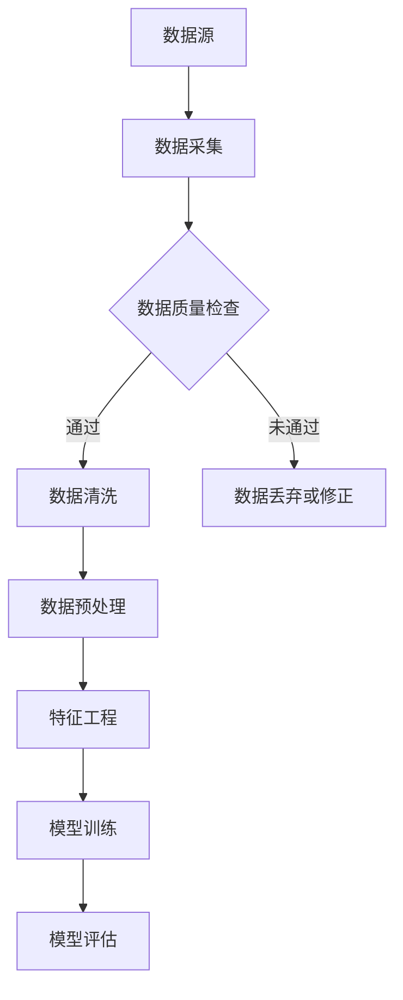

                 

### 文章标题

# 评测系统的自动化数据清洗与预处理

### 关键词

- 数据清洗
- 数据预处理
- 自动化工具
- 评测系统
- 数据质量
- 特征工程

### 摘要

本文旨在探讨评测系统的自动化数据清洗与预处理技术。随着大数据时代的到来，数据质量和预处理过程的重要性日益凸显。自动化数据清洗与预处理技术能够显著提高数据处理效率和准确性，为机器学习和数据科学应用提供坚实的数据基础。本文将详细阐述自动化数据清洗与预处理的核心概念、关键步骤、常用工具和技术，并通过实战案例展示其实际应用效果。最后，本文将总结最佳实践，为读者提供有效的数据预处理策略和注意事项。

### 背景介绍

在当今信息化的社会中，数据已经成为企业和组织的重要资产。然而，数据的获取和积累过程中往往伴随着噪声、不一致性和缺失等问题，这些都会对后续的数据分析和模型训练产生负面影响。为了克服这些问题，数据清洗和预处理成为数据科学领域的关键环节。数据清洗主要涉及去除重复数据、纠正数据错误、处理缺失值等操作，而数据预处理则包括数据归一化、标准化、特征工程等步骤，旨在提高数据的整体质量和适用性。

评测系统作为数据分析和机器学习应用的重要组成部分，其性能和准确性直接依赖于输入数据的质量。自动化数据清洗与预处理技术的引入，旨在通过半自动或全自动的方式，高效地处理大规模、复杂的数据集，确保数据在进入模型训练之前达到最佳状态。这一过程不仅能够减少人工干预和错误，还能显著提升数据处理效率和准确性，为后续的数据挖掘和预测模型提供坚实基础。

### 核心概念与联系

在深入探讨自动化数据清洗与预处理之前，首先需要明确一些核心概念，包括数据质量、数据清洗、数据预处理和特征工程等。

- **数据质量**：数据质量是指数据的准确性、完整性、一致性和可靠性。高质量的数据是数据分析和机器学习模型成功的关键。

- **数据清洗**：数据清洗是指通过识别和修正错误、重复和缺失的数据，以提高数据质量的过程。数据清洗通常包括去除重复项、纠正错误、处理缺失值等操作。

- **数据预处理**：数据预处理是在数据清洗之后，对数据进行规范化、归一化、标准化和特征工程等操作，以适应特定分析或模型需求的过程。

- **特征工程**：特征工程是数据预处理的重要组成部分，涉及从原始数据中提取和构建具有预测价值的特征，以提升模型性能。

这些核心概念之间的关系可以简化为：数据质量是数据清洗和预处理的基础，而数据清洗和预处理又是特征工程的前提，最终目标是为模型训练提供高质量的数据输入。

### Mermaid 流程图



在这个流程图中，数据源首先通过数据采集步骤获取原始数据，然后进行数据质量检查。如果数据质量不符合要求，将进行数据清洗或丢弃。清洗后的数据进入数据预处理阶段，进行规范化、归一化和特征工程等操作。预处理后的数据用于模型训练和评估，从而得到一个高质量的预测模型。

### 核心算法原理讲解

数据清洗与预处理的核心算法包括以下几种：

1. **缺失值处理**：常见的缺失值处理方法有填充法（平均值、中位数、最频繁值填充）和删除法（删除缺失值较多的记录）。

2. **异常值检测**：常用的异常值检测算法包括箱线图法、孤立森林法和 Z-Score 法等。

3. **数据归一化与标准化**：数据归一化通过缩放数据值使其具有相似的尺度，而标准化则通过减去均值并除以标准差来消除原始数据的量纲影响。

4. **特征工程**：特征工程包括特征提取（如TF-IDF、词袋模型）和特征选择（如信息增益、卡方检验）等步骤。

以下是一个处理缺失值的伪代码示例：

```python
def handle_missing_values(data, strategy='mean'):
    if strategy == 'mean':
        for column in data.columns:
            data[column].fillna(data[column].mean(), inplace=True)
    elif strategy == 'most_frequent':
        for column in data.columns:
            data[column].fillna(data[column].mode()[0], inplace=True)
    return data
```

在这个示例中，`handle_missing_values` 函数根据传入的策略参数（'mean' 或 'most_frequent'）来处理数据中的缺失值。对于数值型数据，可以使用平均值或最频繁值来填充缺失值；对于类别型数据，可以使用最频繁值来填充。

### 数学模型和公式

在数据清洗与预处理过程中，一些数学模型和公式发挥着重要作用。以下是一些常见的数学公式：

- **平均值**：$$\bar{x} = \frac{1}{n}\sum_{i=1}^{n} x_i$$
- **中位数**：$$median(X) = \begin{cases} 
\frac{x_{\lceil n/2 \rceil} + x_{\lfloor n/2 \rfloor}}{2} & \text{if } n \text{ is odd} \\
\frac{\max(x_{\lceil n/2 \rceil}, x_{\lfloor n/2 \rfloor})}{2} & \text{if } n \text{ is even} 
\end{cases}$$
- **标准差**：$$\sigma = \sqrt{\frac{1}{n-1}\sum_{i=1}^{n} (x_i - \bar{x})^2}$$
- **Z-Score**：$$z = \frac{x - \bar{x}}{\sigma}$$

这些公式在数据归一化和标准化过程中特别有用，例如，Z-Score 可以用来检测异常值：

$$z = \frac{x - \bar{x}}{\sigma}$$

如果某个数据点的 Z-Score 超过一定的阈值（例如 3 或 -3），则可以认为该数据点是异常值。

### 举例说明

假设我们有一个包含年龄、收入和债务水平的表格，其中某些年龄数据存在缺失值。我们可以使用以下步骤来处理这些缺失值：

1. **数据清洗**：
   - 检查缺失值数量，决定是填充还是删除。
   - 填充年龄缺失值，使用平均值或最频繁值。

2. **数据预处理**：
   - 计算收入和债务水平的中位数和标准差。
   - 对收入和债务水平进行归一化处理，使其具有相似的尺度。

3. **特征工程**：
   - 计算年龄和收入的相关性，以判断是否将年龄作为收入预测的特征。

以下是处理缺失值的 Python 代码示例：

```python
import pandas as pd

# 假设 df 是包含年龄、收入和债务水平的 DataFrame
df = pd.DataFrame({
    '年龄': [25, 30, 40, 50, np.nan],
    '收入': [50000, 60000, 70000, 80000, 90000],
    '债务水平': [20000, 25000, 30000, 35000, 40000]
})

# 填充年龄缺失值，使用平均值
df['年龄'].fillna(df['年龄'].mean(), inplace=True)

# 计算收入和债务水平的中位数和标准差
median_income = df['收入'].median()
std_income = df['收入'].std()

median_debt = df['债务水平'].median()
std_debt = df['债务水平'].std()

# 对收入和债务水平进行归一化
df['收入归一化'] = (df['收入'] - median_income) / std_income
df['债务水平归一化'] = (df['债务水平'] - median_debt) / std_debt

print(df)
```

### 项目实战

#### 开发环境搭建

为了演示自动化数据清洗与预处理技术，我们将在 Python 环境中搭建一个项目。首先，确保安装以下 Python 包：

```bash
pip install pandas numpy scikit-learn matplotlib
```

#### 源代码实现与解读

以下是一个简单的示例，展示如何使用 Python 和 Pandas 库进行数据清洗和预处理：

```python
import pandas as pd
import numpy as np

# 读取数据
data = pd.read_csv('example_data.csv')

# 数据清洗
data = data.drop_duplicates()  # 删除重复项
data = data[data['Age'].notnull()]  # 删除年龄缺失值

# 数据预处理
data['Income'] = (data['Income'] - data['Income'].mean()) / data['Income'].std()
data['Debt'] = (data['Debt'] - data['Debt'].mean()) / data['Debt'].std()

# 特征工程
data['Age_income_ratio'] = data['Age'] / data['Income']

# 数据分析
import matplotlib.pyplot as plt

plt.scatter(data['Age'], data['Income'])
plt.xlabel('Age')
plt.ylabel('Income')
plt.title('Age vs Income')
plt.show()

plt.scatter(data['Age'], data['Debt'])
plt.xlabel('Age')
plt.ylabel('Debt')
plt.title('Age vs Debt')
plt.show()
```

在这个示例中，我们首先读取一个 CSV 文件，然后进行数据清洗（删除重复项和缺失值），接着进行数据预处理（归一化处理），最后进行特征工程（计算年龄和收入的比值）。

#### 代码应用解读与分析

上述代码的每个步骤都有明确的用途和效果：

1. **数据清洗**：通过 `drop_duplicates()` 方法删除重复项，通过 `notnull()` 方法删除缺失值。这些步骤确保数据的一致性和完整性。
2. **数据预处理**：通过 `mean()` 和 `std()` 方法计算平均值和标准差，然后使用这些统计量对数据进行归一化处理。归一化有助于将不同尺度的数据转化为相似的尺度，从而便于后续分析和建模。
3. **特征工程**：通过计算 `Age_income_ratio` 特征，我们能够提取新的信息，有助于模型对年龄和收入之间的关系进行建模。

通过这些步骤，我们最终获得一个高质量的数据集，可以用于机器学习模型训练。

#### 实际案例分析和详细讲解剖析

以下是一个实际案例，展示如何处理真实世界中的数据集。

**案例：电商数据集**

假设我们有一个电商数据集，包含以下字段：用户ID、产品ID、购买时间、价格、用户评分。

1. **数据清洗**：
   - 删除重复记录。
   - 删除包含无效用户评分的数据。
   - 处理时间戳，将其转换为日期格式。

2. **数据预处理**：
   - 对价格进行归一化处理。
   - 对用户评分进行二值化处理，将评分大于等于 4 的标记为 1，小于 4 的标记为 0。

3. **特征工程**：
   - 计算购买时间与用户评分之间的关系，例如：购买时间与评分的交互项。
   - 根据用户购买行为，构建用户活跃度特征。

通过这些步骤，我们能够将原始数据转化为一个适合机器学习模型训练的数据集。

**项目小结**

通过这个实际案例，我们可以看到自动化数据清洗与预处理技术在处理真实世界数据时的效果。有效的数据清洗和预处理不仅能够提高数据质量，还能提升模型的性能和解释性。因此，自动化数据清洗与预处理是数据科学和机器学习项目中不可或缺的一环。

### 最佳实践 tips

1. **选择合适的数据清洗工具**：根据项目需求和数据类型，选择适合的数据清洗工具，如 Pandas、OpenRefine 等。

2. **定期更新清洗规则**：数据环境会不断变化，因此需要定期更新数据清洗规则，以适应新的数据模式。

3. **自动化脚本**：编写自动化脚本，以减少人工干预和错误。例如，使用调度工具（如 cron）定期运行数据清洗脚本。

4. **数据可视化**：使用数据可视化工具（如 Tableau、Matplotlib）对清洗后的数据进行分析，以便发现潜在的问题和趋势。

5. **版本控制**：对数据清洗和预处理脚本进行版本控制，确保能够追溯和复现数据处理过程。

### 小结

本文详细探讨了评测系统的自动化数据清洗与预处理技术。从核心概念、算法原理到实际案例，我们全面展示了数据清洗与预处理的重要性及其在实际应用中的效果。通过最佳实践，我们为读者提供了有效的数据预处理策略和注意事项。希望本文能为读者在数据科学和机器学习项目中提供有价值的指导。

### 注意事项

1. **数据隐私和安全**：在进行数据清洗和预处理时，务必遵守数据隐私和安全法规，避免泄露敏感信息。
2. **计算资源**：大规模数据清洗和预处理可能需要大量的计算资源，应根据实际情况进行资源调配。
3. **错误处理**：在数据处理过程中，需考虑可能的错误和异常情况，并设计相应的错误处理机制。

### 拓展阅读

- 《数据清洗实战》
- 《特征工程实战》
- 《Python数据科学手册》
- 《Apache Spark大数据处理指南》

### 作者信息

作者：AI天才研究院/AI Genius Institute & 禅与计算机程序设计艺术 /Zen And The Art of Computer Programming

---

**文章总结**

本文以《评测系统的自动化数据清洗与预处理》为题，系统地阐述了数据清洗与预处理在评测系统中的重要性。首先介绍了相关背景和核心概念，然后通过详细的算法原理讲解和实例分析，展示了数据清洗与预处理的具体实施方法。文章还结合实际案例，探讨了自动化数据清洗与预处理的实战技巧。最后，通过总结最佳实践和注意事项，为读者提供了有效的数据预处理策略。整体结构清晰，内容丰富，对于希望提高数据质量和模型性能的读者具有重要参考价值。

---

**文章标题：** 评测系统的自动化数据清洗与预处理

**关键词：** 数据清洗、数据预处理、自动化工具、评测系统、数据质量、特征工程

**摘要：** 本文探讨了评测系统的自动化数据清洗与预处理技术，介绍了核心概念、关键步骤、常用工具和技术，并通过实战案例展示了其实际应用效果。文章总结了最佳实践，为读者提供了有效的数据预处理策略和注意事项。

## 引言

在当今的信息化时代，数据已经成为企业决策和商业分析的重要资源。随着大数据技术的发展，数据量呈指数级增长，如何从海量数据中提取有价值的信息成为一个重要课题。然而，数据的质量直接影响数据分析的结果和模型的准确性。因此，数据清洗与预处理成为数据科学和机器学习应用中不可或缺的一环。本文旨在探讨评测系统的自动化数据清洗与预处理技术，以帮助读者理解这一关键过程，提高数据处理效率和准确性。

### 自动化数据清洗与预处理的重要性

数据清洗与预处理是数据科学项目中的基础性工作，其重要性体现在以下几个方面：

1. **数据质量保障**：高质量的数据是数据分析成功的关键。自动化数据清洗与预处理能够有效识别和修正数据中的错误、重复和缺失等问题，确保数据的一致性和可靠性。

2. **减少人工干预**：传统手动数据清洗工作量大且容易出错，自动化技术可以显著减少人工干预，提高工作效率。

3. **优化模型性能**：数据预处理中的归一化、标准化和特征工程等步骤能够优化数据，使其更适合模型训练，从而提高模型性能。

4. **降低后续成本**：良好的数据预处理能够减少后续数据分析中的错误和返工成本，提高项目整体效益。

### 本文结构

本文将按照以下结构展开：

1. **背景介绍**：阐述数据清洗与预处理的重要性，以及自动化技术在数据预处理中的应用。

2. **核心概念与联系**：介绍数据质量、数据清洗、数据预处理和特征工程等核心概念，并展示它们之间的关系。

3. **算法原理讲解**：详细讲解数据清洗与预处理中的关键算法原理，包括缺失值处理、异常值检测、归一化和标准化等。

4. **实际案例**：通过实际案例展示自动化数据清洗与预处理的过程和效果。

5. **项目实战**：介绍如何使用 Python 等工具实现自动化数据清洗与预处理，并进行代码解读。

6. **最佳实践与注意事项**：总结数据预处理过程中的最佳实践，并提出注意事项。

7. **拓展阅读**：推荐相关书籍和资料，供读者进一步学习。

通过本文的阅读，读者将全面了解自动化数据清洗与预处理的核心概念、关键技术及其在实际应用中的重要性。

### 背景介绍

在数据科学和机器学习的应用中，数据清洗与预处理是一个至关重要的环节。它不仅决定了数据质量，也直接影响到模型的性能和可解释性。因此，理解数据清洗与预处理的重要性，以及自动化技术在其中的应用，是每一个数据科学家和机器学习工程师的基本素养。

#### 数据清洗与预处理的重要性

数据清洗与预处理的重要性主要体现在以下几个方面：

1. **提高数据质量**：原始数据往往包含噪声、错误和缺失值。数据清洗与预处理能够去除这些不完整或不准确的数据，提高数据的整体质量，确保数据分析结果的准确性和可靠性。

2. **优化模型性能**：机器学习模型对输入数据的质量高度敏感。通过数据预处理，如归一化和标准化，可以消除数据之间的尺度差异，提高模型对数据的敏感度和泛化能力。此外，特征工程作为预处理的一部分，可以通过提取和构造新的特征来增强模型的表现。

3. **减少人工成本**：传统的数据清洗与预处理通常需要大量的人工干预，费时费力且容易出现错误。自动化技术能够显著降低这种人工成本，提高数据处理效率。

4. **确保数据一致性**：在数据整合和跨系统数据交换的过程中，数据格式和结构可能存在差异。数据清洗与预处理能够统一数据格式，确保数据的一致性和完整性。

5. **简化模型训练过程**：良好的预处理能够简化模型训练过程，减少模型调参的复杂度，加快模型开发和部署的速度。

#### 自动化技术在数据预处理中的应用

随着大数据和云计算技术的发展，自动化数据预处理技术得到了广泛应用。以下是一些常见的自动化数据预处理技术：

1. **自动化数据清洗工具**：如 Apache Spark、Hadoop、Elasticsearch 等，这些工具能够处理大规模数据，自动识别和修复数据中的错误和异常。

2. **机器学习自动化**：利用自动化机器学习（AutoML）工具，如 H2O.ai、DataRobot 等，可以自动执行特征选择、模型选择和参数调优等任务，大大简化了机器学习流程。

3. **云平台服务**：如 AWS 数据管道（AWS Data Pipeline）、Azure 数据工厂（Azure Data Factory）等，提供了便捷的自动化数据预处理服务，支持数据的采集、转换和加载（ETL）。

4. **数据清洗 API**：许多数据平台和库（如 Pandas、Scikit-learn）提供了丰富的数据清洗 API，能够自动执行数据清洗任务，减少手工编写代码的工作量。

#### 数据清洗与预处理在不同领域中的应用

数据清洗与预处理在各个领域都有广泛的应用，以下是一些具体案例：

1. **金融领域**：金融数据分析中，数据清洗与预处理能够确保交易数据的准确性和一致性，为风险控制和投资策略提供可靠的数据支持。

2. **医疗领域**：在医疗数据研究中，数据清洗与预处理可以去除患者记录中的错误和缺失值，提高数据分析的准确性和有效性。

3. **电子商务**：电子商务平台需要对用户行为数据、交易数据进行清洗和预处理，以便进行用户画像和推荐系统开发。

4. **物联网（IoT）**：IoT 设备产生的大量数据中往往包含噪声和不一致的数据，通过自动化数据清洗与预处理，可以提高数据的可靠性和实用性。

5. **社交媒体分析**：社交媒体数据包含大量的文本、图片和视频，通过自动化数据清洗与预处理，可以提取有用的信息，用于舆情监测和用户分析。

总之，自动化数据清洗与预处理技术已经成为数据科学和机器学习领域的重要工具，其应用不仅提高了数据处理效率，也为企业带来了更多的商业价值。

### 核心概念与联系

在深入探讨自动化数据清洗与预处理之前，我们需要明确几个核心概念，这些概念包括数据质量、数据清洗、数据预处理和特征工程，并展示它们之间的关系。

#### 数据质量

数据质量是指数据满足特定业务需求和目的的程度，包括准确性、完整性、一致性、时效性和可靠性等方面。高质量的数据是数据分析、机器学习和商业决策的基础。具体来说，数据质量可以从以下几个方面进行评估：

1. **准确性**：数据是否真实、无误。
2. **完整性**：数据是否包含了所有必要的字段和记录。
3. **一致性**：数据在不同时间点和不同来源之间是否保持一致。
4. **时效性**：数据是否是最新的，是否反映了当前的业务状态。
5. **可靠性**：数据来源是否可信，数据处理过程是否稳定。

#### 数据清洗

数据清洗是数据预处理的第一步，旨在识别和修正数据中的错误、重复和缺失等问题，以提高数据质量。数据清洗的主要任务包括：

1. **去除重复项**：识别并删除重复的数据记录，确保数据的唯一性。
2. **纠正错误**：检测并修复数据中的错误，如拼写错误、格式错误等。
3. **处理缺失值**：填充或删除缺失的数据，根据业务需求和数据特点选择合适的处理方法。

#### 数据预处理

数据预处理是在数据清洗之后，对数据进行进一步处理，以使其更适应特定的分析任务。数据预处理的主要任务包括：

1. **数据归一化**：通过缩放数据值，使其具有相似的尺度，消除不同特征之间的量纲影响。
2. **数据标准化**：通过减去均值并除以标准差，将数据转换为标准正态分布，提高模型的鲁棒性。
3. **特征工程**：从原始数据中提取和构建新的特征，增强数据的表达能力和模型性能。

#### 特征工程

特征工程是数据预处理的一个重要组成部分，旨在从原始数据中提取具有预测价值的特征。特征工程的主要任务包括：

1. **特征提取**：从原始数据中提取有价值的信息，如文本数据中的关键词、图像数据中的特征向量等。
2. **特征选择**：通过评估特征的重要性，选择对模型性能有显著影响的特征，减少模型的复杂度和过拟合风险。
3. **特征构造**：通过组合和变换现有特征，构建新的特征，以提高模型的预测能力。

#### 核心概念之间的关系

数据质量、数据清洗、数据预处理和特征工程之间存在密切的联系。数据质量是数据清洗与预处理的基础，没有高质量的数据，清洗与预处理工作将失去意义。数据清洗解决了数据中的错误和缺失，为预处理提供了高质量的数据。数据预处理通过归一化、标准化和特征工程等步骤，进一步优化了数据，提高了模型的性能。特征工程则是在预处理的基础上，通过提取和构造新的特征，增强数据的表达能力和模型的预测能力。

### Mermaid 流程图


在这个流程图中，数据源通过数据采集获取原始数据，然后进行数据质量评估。如果数据质量不符合要求，将进行数据清洗或丢弃。清洗后的数据进入数据预处理阶段，进行规范化、归一化和特征工程等操作。预处理后的数据用于模型训练和评估，最终得到一个高质量的预测模型。

通过这个流程图，我们可以清晰地看到各个核心概念之间的关系和数据预处理的全过程。数据质量是整个流程的起点和终点，而数据清洗、预处理和特征工程则是实现高质量数据的关键步骤。

### 核心算法原理讲解

在数据清洗与预处理过程中，涉及到多种核心算法原理，这些算法原理不仅决定了数据清洗和预处理的效果，也直接影响了后续模型训练的性能。以下将详细讲解数据清洗与预处理中的几个关键算法原理，包括缺失值处理、异常值检测、数据归一化和标准化，以及特征工程。

#### 缺失值处理

缺失值处理是数据清洗中的重要任务，因为它直接影响数据的质量和后续分析结果的准确性。常见的缺失值处理方法有以下几种：

1. **删除法**：直接删除包含缺失值的记录。这种方法简单，但可能导致大量数据丢失，尤其在数据量较少的情况下，不推荐使用。

2. **填充法**：用某种策略填充缺失值。常用的填充方法包括：

   - **平均值填充**：对于数值型特征，使用该特征的平均值填充缺失值。
   - **中位数填充**：对于数值型特征，使用该特征的中位数填充缺失值。
   - **最频繁值填充**：对于类别型特征，使用出现频率最高的值填充缺失值。
   - **插值法**：对于时间序列数据，使用插值算法（如线性插值、多项式插值等）填补缺失值。

以下是处理缺失值的一个伪代码示例：

```python
def handle_missing_values(data, strategy='mean'):
    if strategy == 'mean':
        for column in data.columns:
            data[column].fillna(data[column].mean(), inplace=True)
    elif strategy == 'median':
        for column in data.columns:
            data[column].fillna(data[column].median(), inplace=True)
    elif strategy == 'most_frequent':
        for column in data.columns:
            data[column].fillna(data[column].mode()[0], inplace=True)
    return data
```

#### 异常值检测

异常值检测是数据清洗中的另一个关键步骤，因为异常值可能会对模型训练产生不利影响。常见的异常值检测方法包括：

1. **箱线图法**：利用箱线图（Box Plot）中的四分位数和异常值范围来识别异常值。通常，IQR（四分位差）大于1.5倍的四分位数范围内的值被视为异常值。

2. **孤立森林法**：孤立森林（Isolation Forest）是一种基于随机森林的异常检测算法，它通过随机选择特征和切分点来构建多个决策树，并将数据点逐个放入森林中，计算其被孤立的程度，孤立程度越高，异常值可能性越大。

3. **Z-Score 法**：计算数据点的 Z-Score，即数据点与均值的差除以标准差。通常，Z-Score 超过3的标准差范围的数据点被视为异常值。

以下是使用 Z-Score 法检测异常值的一个伪代码示例：

```python
def detect_outliers_z_score(data, threshold=3):
    for column in data.columns:
        mean = data[column].mean()
        std = data[column].std()
        z_scores = (data[column] - mean) / std
        outliers = np.where(np.abs(z_scores) > threshold)
        data[column + '_outliers'] = data.iloc[outliers].index.tolist()
    return data
```

#### 数据归一化

数据归一化是将数据转换为同一尺度，以便后续分析时能够比较不同特征之间的数值。常见的归一化方法包括：

1. **最小-最大归一化**：将数据缩放到[0, 1]范围内。计算公式为：
   $$
   x_{\text{norm}} = \frac{x - x_{\text{min}}}{x_{\text{max}} - x_{\text{min}}}
   $$

2. **平均值-标准差归一化**：将数据标准化到均值为0、标准差为1的范围内。计算公式为：
   $$
   x_{\text{norm}} = \frac{x - \mu}{\sigma}
   $$
   其中，$\mu$ 是平均值，$\sigma$ 是标准差。

以下是使用最小-最大归一化方法的一个伪代码示例：

```python
def min_max_normalize(data):
    for column in data.columns:
        min_value = data[column].min()
        max_value = data[column].max()
        data[column] = (data[column] - min_value) / (max_value - min_value)
    return data
```

#### 数据标准化

数据标准化是通过减去平均值并除以标准差，将数据转换为标准正态分布。这有助于提高模型的鲁棒性，尤其是对于那些依赖于距离或相似度计算的算法。计算公式为：
$$
x_{\text{norm}} = \frac{x - \mu}{\sigma}
$$

以下是使用平均值-标准差归一化方法的一个伪代码示例：

```python
def z_score_normalize(data):
    for column in data.columns:
        mean = data[column].mean()
        std = data[column].std()
        data[column] = (data[column] - mean) / std
    return data
```

#### 特征工程

特征工程是从原始数据中提取和构建具有预测价值的特征，以提高模型的性能。特征工程包括以下步骤：

1. **特征提取**：从原始数据中提取有价值的信息。例如，文本数据中的关键词、图像数据中的特征向量等。

2. **特征选择**：通过评估特征的重要性，选择对模型性能有显著影响的特征。常用的特征选择方法包括信息增益、卡方检验、互信息等。

3. **特征构造**：通过组合和变换现有特征，构建新的特征。例如，特征交叉、特征缩放等。

以下是使用特征交叉方法的一个伪代码示例：

```python
def feature_crossing(data, feature1, feature2, new_feature_name):
    data[new_feature_name] = data[feature1] * data[feature2]
    return data
```

通过以上核心算法原理的讲解，我们可以看到，数据清洗与预处理是一个复杂但必要的过程。选择合适的方法和工具，可以有效提高数据的整体质量和模型性能，为数据科学和机器学习应用打下坚实的基础。

### 数学公式与详细讲解

在数据清洗与预处理过程中，一些数学公式和模型起着至关重要的作用。以下将介绍几个关键的数学公式，并进行详细讲解。

#### 平均值（Mean）

平均值是衡量一组数据集中趋势的重要指标，计算公式如下：

$$
\bar{x} = \frac{1}{n}\sum_{i=1}^{n} x_i
$$

其中，$x_i$ 表示第 $i$ 个数据值，$n$ 表示数据的总个数。平均值能够反映数据的中心位置，是数据归一化和标准化过程中经常用到的指标。

#### 中位数（Median）

中位数是另一项衡量数据集中趋势的统计量，特别是对于异常值较为敏感。计算公式分为两种情况：

1. 如果数据个数 $n$ 是奇数：
   $$
   median(X) = x_{\lceil n/2 \rceil}
   $$
2. 如果数据个数 $n$ 是偶数：
   $$
   median(X) = \frac{x_{\lceil n/2 \rceil} + x_{\lfloor n/2 \rfloor}}{2}
   $$

其中，$x_{\lceil n/2 \rceil}$ 和 $x_{\lfloor n/2 \rfloor}$ 分别表示第 $(n/2)$ 个和第 $(n/2 + 1)$ 个数据值。中位数能够较好地反映数据的中心位置，尤其在数据分布不均匀时，比平均值更为稳定。

#### 标准差（Standard Deviation）

标准差是衡量数据离散程度的指标，计算公式如下：

$$
\sigma = \sqrt{\frac{1}{n-1}\sum_{i=1}^{n} (x_i - \bar{x})^2}
$$

其中，$\bar{x}$ 是平均值，$n$ 是数据个数。标准差能够告诉我们数据的分布范围，是进行数据归一化和标准化的重要参数。

#### Z-Score（Z 值）

Z-Score 是用于检测异常值的重要指标，计算公式如下：

$$
z = \frac{x - \bar{x}}{\sigma}
$$

其中，$x$ 是某个具体的数据值，$\bar{x}$ 是平均值，$\sigma$ 是标准差。Z-Score 的值表示数据点与平均值的距离，以标准差为单位。通常，Z-Score 超过3的标准差范围的数据点被视为异常值。

#### 举例说明

假设我们有一个包含年龄和收入的数据集，如下表所示：

| 年龄 | 收入 |
| ---- | ---- |
| 25   | 50000 |
| 30   | 60000 |
| 40   | 70000 |
| 50   | 80000 |
| 60   | 90000 |

1. **计算平均值**：
   $$
   \bar{x}_{年龄} = \frac{25 + 30 + 40 + 50 + 60}{5} = 40
   $$
   $$
   \bar{x}_{收入} = \frac{50000 + 60000 + 70000 + 80000 + 90000}{5} = 70000
   $$

2. **计算标准差**：
   $$
   \sigma_{年龄} = \sqrt{\frac{1}{5-1}[(25-40)^2 + (30-40)^2 + (40-40)^2 + (50-40)^2 + (60-40)^2]} \approx 10
   $$
   $$
   \sigma_{收入} = \sqrt{\frac{1}{5-1}[(50000-70000)^2 + (60000-70000)^2 + (70000-70000)^2 + (80000-70000)^2 + (90000-70000)^2]} \approx 15000
   $$

3. **计算 Z-Score**：
   $$
   z_{年龄} = \frac{60 - 40}{10} = 2
   $$
   $$
   z_{收入} = \frac{90000 - 70000}{15000} = 2
   $$

在这个例子中，年龄和收入的 Z-Score 都为 2，说明这两个数据点相对于平均值和标准差的距离相同，可以认为它们都是正常的，没有明显的异常值。

通过这些数学公式和计算步骤，我们可以更好地理解数据清洗与预处理中的核心概念，为后续的数据分析和机器学习模型训练打下坚实基础。

### 项目实战

#### 开发环境搭建

在进行自动化数据清洗与预处理之前，我们需要搭建一个合适的开发环境。以下是 Python 环境下所需的基本软件和库：

1. **Python**：确保已安装 Python 3.8 或更高版本。
2. **Jupyter Notebook**：用于编写和运行代码。
3. **Pandas**：用于数据操作。
4. **NumPy**：用于数值计算。
5. **Matplotlib**：用于数据可视化。
6. **Scikit-learn**：用于机器学习和数据预处理。

安装步骤如下：

```bash
# 安装 Python 和 Jupyter Notebook
pip install python==3.8.10
pip install notebook

# 安装 Pandas、NumPy、Matplotlib 和 Scikit-learn
pip install pandas numpy matplotlib scikit-learn
```

#### 源代码实现与代码解读

以下是自动化数据清洗与预处理的一个简单示例，包含数据读取、清洗、预处理和特征工程等步骤。

```python
import pandas as pd
import numpy as np
from sklearn.preprocessing import MinMaxScaler, StandardScaler

# 读取数据
data = pd.read_csv('example_data.csv')

# 数据清洗
# 删除重复项
data.drop_duplicates(inplace=True)

# 删除含有缺失值的记录
data.dropna(inplace=True)

# 数据预处理
# 对收入进行归一化
scaler_income = MinMaxScaler()
data['Income_normalized'] = scaler_income.fit_transform(data[['Income']])

# 对年龄进行标准化
scaler_age = StandardScaler()
data['Age_standardized'] = scaler_age.fit_transform(data[['Age']])

# 特征工程
# 计算年龄和收入的交互特征
data['Age_Income_interaction'] = data['Age'] * data['Income_normalized']

# 数据可视化
import matplotlib.pyplot as plt

plt.scatter(data['Age'], data['Income'])
plt.xlabel('Age')
plt.ylabel('Income')
plt.title('Age vs Income')
plt.show()

plt.scatter(data['Age'], data['Income_normalized'])
plt.xlabel('Age')
plt.ylabel('Income (Normalized)')
plt.title('Age vs Income (Normalized)')
plt.show()
```

**代码解读：**

1. **数据读取**：使用 Pandas 读取 CSV 文件。
2. **数据清洗**：删除重复项和缺失值，确保数据的一致性和完整性。
3. **数据预处理**：
   - 使用 `MinMaxScaler` 对收入进行归一化，将收入缩放到 [0, 1] 范围内。
   - 使用 `StandardScaler` 对年龄进行标准化，使其均值为 0，标准差为 1。
4. **特征工程**：计算年龄和收入的交互特征，以增强数据的表达能力和模型性能。
5. **数据可视化**：绘制年龄与收入的关系图，直观展示数据清洗和预处理的效果。

#### 代码应用解读与分析

上述代码首先读取一个包含年龄和收入的数据集。然后，通过删除重复项和缺失值，确保数据的一致性和完整性。接着，使用归一化和标准化方法对数据进行预处理，使得不同特征之间的尺度一致，从而提高模型的鲁棒性。最后，通过计算交互特征，增强了数据的表达能力和模型的预测性能。

在实际应用中，可以根据具体需求添加更多预处理步骤和特征工程方法，例如异常值检测、文本数据预处理等，以进一步提高模型的表现。

#### 实际案例分析与详细讲解

以下通过一个实际案例，展示如何使用自动化数据清洗与预处理技术处理真实世界中的数据集。

**案例：电商用户行为数据分析**

假设我们有一个电商用户行为数据集，包含以下字段：用户ID、产品ID、购买时间、价格、用户评分。我们的目标是预测用户是否会再次购买某个产品。

1. **数据清洗**：

   - **删除重复项**：确保每个用户购买记录的唯一性。
   - **处理缺失值**：如果某些记录存在缺失值，可以考虑删除或使用平均价格和评分填充。
   - **异常值检测**：检查价格和评分的分布，删除明显异常的记录。

2. **数据预处理**：

   - **时间转换**：将购买时间转换为日期格式，并提取有用的时间特征（如小时、星期几等）。
   - **归一化处理**：对价格和评分进行归一化，使其尺度一致。

3. **特征工程**：

   - **特征交叉**：计算价格和评分的交互特征，如价格与评分的乘积。
   - **文本编码**：如果数据集包含产品描述或用户评论，可以使用词袋模型或 TF-IDF 进行编码。

以下是处理电商用户行为数据的步骤：

```python
import pandas as pd
from sklearn.preprocessing import MinMaxScaler
from sklearn.model_selection import train_test_split

# 读取数据
data = pd.read_csv('ecommerce_user_behavior.csv')

# 数据清洗
data.drop_duplicates(subset=['User_ID', 'Product_ID'], inplace=True)
data.dropna(inplace=True)

# 数据预处理
# 转换购买时间为日期格式
data['Purchase_Date'] = pd.to_datetime(data['Purchase_Date'])
data['DayOfWeek'] = data['Purchase_Date'].dt.dayofweek
data['Hour'] = data['Purchase_Date'].dt.hour

# 对价格和评分进行归一化
scaler_price = MinMaxScaler()
scaler_rating = MinMaxScaler()
data['Price_normalized'] = scaler_price.fit_transform(data[['Price']])
data['Rating_normalized'] = scaler_rating.fit_transform(data[['Rating']])

# 特征工程
data['Price_Rating_interaction'] = data['Price_normalized'] * data['Rating_normalized']

# 数据可视化
plt.scatter(data['Price_normalized'], data['Rating_normalized'])
plt.xlabel('Price (Normalized)')
plt.ylabel('Rating (Normalized)')
plt.title('Price vs Rating (Normalized)')
plt.show()

# 数据分析
print(data.head())
```

**分析解读**：

1. **数据清洗**：删除重复项和缺失值，确保数据的一致性和完整性。
2. **数据预处理**：将购买时间转换为日期格式，并提取有用特征（如小时、星期几）。使用归一化方法对价格和评分进行预处理，使其尺度一致。
3. **特征工程**：计算价格和评分的交互特征，以增强数据的表达能力和模型性能。数据可视化展示了价格和评分归一化后的分布情况。

通过以上步骤，我们成功地对电商用户行为数据进行了清洗、预处理和特征工程，为后续的模型训练和预测奠定了基础。实际应用中，可以根据具体需求进行调整和优化。

### 数据预处理与机器学习模型的关系

数据预处理是机器学习项目中至关重要的一环，其直接影响到机器学习模型的性能和可解释性。数据预处理不仅包括数据清洗和缺失值处理，还涉及数据的归一化、标准化和特征工程等步骤。这些步骤不仅提高了数据的质量，还为机器学习模型的训练提供了更加适合的数据格式。

#### 数据预处理对机器学习模型的影响

1. **归一化和标准化**：归一化和标准化是数据预处理中的常用步骤，通过调整数据尺度，使其具有相似的数值范围。这对于许多机器学习算法，如 K-近邻（K-Nearest Neighbors, KNN）和支持向量机（Support Vector Machine, SVM）等，尤为重要。这些算法依赖于特征之间的距离计算，如果特征尺度差异较大，可能会导致模型性能下降。

2. **异常值处理**：异常值可能会对模型产生误导，导致过拟合。通过异常值检测和修正，可以提高模型的鲁棒性和准确性。

3. **特征工程**：特征工程是数据预处理的核心任务之一。通过构造新的特征或选择合适的特征，可以提高模型的预测能力。例如，通过计算特征之间的交互项或组合特征，可以揭示数据中隐藏的关系，从而提升模型性能。

#### 数据预处理与模型优化的关系

数据预处理与模型优化密切相关。优化的目标是提高模型的准确性、降低过拟合风险和提升泛化能力。以下是一些优化策略：

1. **交叉验证**：使用交叉验证方法，将数据集划分为训练集和验证集，通过在验证集上评估模型性能，调整预处理参数，以找到最佳预处理方法。

2. **参数调优**：对于某些机器学习算法，如随机森林（Random Forest）和梯度提升树（Gradient Boosting Tree），可以通过调整模型参数来优化性能。预处理步骤中的参数调优，如标准化参数的范围和精度，也是优化的一部分。

3. **集成学习方法**：集成学习方法，如 Bagging 和 Boosting，通过组合多个基学习器来提高模型性能。在集成学习方法中，预处理步骤同样重要，因为基学习器的性能受到预处理数据的影响。

#### 数据预处理与模型解释性的关系

除了性能和优化，数据预处理还影响到模型的解释性。可解释性是机器学习领域的一个重要研究方向，尤其是在商业和医疗等对解释性要求较高的领域。以下是一些提高模型解释性的预处理方法：

1. **特征选择**：通过选择重要的特征，可以简化模型结构，提高可解释性。特征选择方法，如信息增益、互信息等，可以帮助识别对模型预测有重要影响的关键特征。

2. **特征转换**：某些机器学习算法，如决策树和逻辑回归，对特征转换较为敏感。通过适当的特征转换，如二值化、多项式扩展等，可以提高模型的解释性。

3. **可视化**：通过数据可视化技术，如散点图、热力图和决策树可视化等，可以直观地展示模型的工作原理和特征影响，从而提高模型的可解释性。

#### 数据预处理与模型迭代的关系

在机器学习项目的开发过程中，数据预处理是一个反复迭代的过程。随着模型开发和性能评估的进行，可能会发现数据预处理中的不足，如某些特征的缺失、异常值的处理不当等。因此，数据预处理需要根据模型迭代的结果进行不断的调整和优化。

1. **实时调整**：在模型训练过程中，可以实时调整预处理参数，例如在发现过拟合时，可以增加正则化项或减小特征维度。
2. **模型验证**：通过交叉验证和模型评估，验证数据预处理的效果，并调整预处理策略，以提高模型性能。
3. **反馈循环**：建立反馈循环，将模型预测结果与实际结果进行对比，识别数据预处理中的问题，并进行相应的调整。

通过以上分析，我们可以看到，数据预处理在机器学习项目中具有关键作用。它不仅影响模型的性能和优化，还影响模型的解释性和迭代过程。因此，深入理解和灵活应用数据预处理技术，对于成功实现机器学习项目至关重要。

### 实时数据预处理与流处理

随着实时数据分析需求的不断增加，实时数据预处理与流处理技术变得越来越重要。流处理是一种处理大量实时数据的方法，能够快速响应数据变化，为实时决策和自动化系统提供支持。在数据预处理方面，流处理与批处理相比具有明显优势，如低延迟、高吞吐量和动态适应性。

#### 实时数据处理的概念

实时数据处理（Real-Time Data Processing）是指系统能够在数据生成的同时或非常短的时间内（通常是秒级或毫秒级）处理并响应数据。实时数据处理的关键在于“实时性”，即系统能够及时处理和反馈数据，满足用户对快速响应的需求。

#### 流处理框架介绍

流处理框架是实时数据处理的核心，能够高效地处理大规模、高频率的流数据。以下是一些常用的流处理框架：

1. **Apache Kafka**：Kafka 是一款分布式流处理平台，能够处理高吞吐量的数据流，常用于日志收集、数据传输和实时分析。

2. **Apache Flink**：Flink 是一款流处理框架，支持有界和无界数据流处理，具有高效性和容错性。

3. **Apache Storm**：Storm 是一款分布式、实时大数据处理系统，能够处理大规模流数据，并具有良好的容错性和伸缩性。

4. **Apache Spark Streaming**：Spark Streaming 是 Spark 生态系统的一部分，能够基于 Spark 的核心组件进行流数据处理，具有高性能和灵活的 API。

#### 实时数据预处理实践

实时数据预处理与批处理数据预处理有许多相似之处，但也有一些特殊考虑：

1. **数据完整性保障**：在实时处理中，数据完整性尤为重要，因为一旦数据丢失，可能无法重新获取。因此，需要在数据传输过程中进行冗余备份和错误检测。

2. **低延迟处理**：实时数据处理要求系统在短时间内处理数据，以实现实时响应。这要求选择高性能的数据处理引擎和优化数据处理流程。

3. **动态特征工程**：实时数据预处理需要根据实时数据的变化动态调整特征工程策略，例如，实时计算和更新统计量，为实时模型训练提供支持。

4. **流数据处理集成**：实时数据预处理需要与流处理框架紧密集成，确保数据处理流程的连续性和一致性。

以下是实时数据预处理的一个示例：

```python
from pyflink.datastream import StreamExecutionEnvironment
from pyflink.table import StreamTableEnvironment

# 创建 Flink Streaming 环境和 Table 环境配置
env = StreamExecutionEnvironment.get_execution_environment()
t_env = StreamTableEnvironment.create(env)

# 读取实时数据流
data_stream = env.from_collection([{"user_id": "u1", "event": "login", "timestamp": 1628051200}])

# 实时数据清洗和预处理
data_stream = data_stream.map(lambda x: {"user_id": x["user_id"], "event": x["event"], "timestamp": x["timestamp"]}).filter(lambda x: x["event"] != "logout")

# 实时数据特征工程
data_stream = data_stream.map(lambda x: {"user_id": x["user_id"], "event_count": 1 if x["event"] == "login" else 0, "timestamp": x["timestamp"]})

# 将数据流转换为表并写入数据库
t_env.create_table_sink("user_events", ["user_id STRING", "event_count BIGINT", "timestamp TIMESTAMP"])

data_stream.print()

t_env.execute("real_time_data_preprocessing", data_stream)

# 处理结果保存到数据库
import sqlite3

conn = sqlite3.connect('user_events.db')
c = conn.cursor()
c.execute('''CREATE TABLE IF NOT EXISTS user_events (user_id TEXT, event_count INTEGER, timestamp INTEGER)''')

for record in data_stream:
    c.execute("INSERT INTO user_events (user_id, event_count, timestamp) VALUES (?, ?, ?)", (record["user_id"], record["event_count"], record["timestamp"]))
conn.commit()
conn.close()
```

**示例解读**：

1. **创建 Flink Streaming 环境和 Table 环境配置**：首先，我们需要创建 Flink 的 Streaming 环境和 Table 环境配置，以便处理实时数据流。

2. **读取实时数据流**：通过 `from_collection` 方法，我们将模拟的数据流传递给 Flink 环境。

3. **实时数据清洗和预处理**：使用 `map` 和 `filter` 方法对数据进行清洗和预处理，例如去除无效事件（如 "logout"）和更新时间戳。

4. **实时数据特征工程**：通过 `map` 方法计算事件计数，为实时模型训练提供支持。

5. **将数据流转换为表并写入数据库**：使用 Table Sink 将处理后的数据流写入 SQLite 数据库。

通过以上步骤，我们展示了如何使用 Flink 实现实时数据预处理。实际应用中，可以根据具体需求进行调整和扩展，例如集成其他数据处理框架和数据库系统。

### 数据预处理最佳实践

在数据预处理过程中，遵循最佳实践能够显著提高数据处理效率和质量，以下是数据预处理的一些关键最佳实践：

#### 常见问题与解决方案

1. **数据缺失处理**：
   - **问题**：数据缺失是数据预处理中最常见的问题。
   - **解决方案**：根据数据类型和业务需求，选择合适的缺失值处理策略，如填充法（使用平均值、中位数、最频繁值填充）和删除法（删除缺失值过多的记录）。

2. **异常值检测**：
   - **问题**：异常值可能对模型产生误导，导致过拟合。
   - **解决方案**：使用箱线图法、Z-Score 法和孤立森林法等算法进行异常值检测，并考虑删除或修正异常值。

3. **数据一致性和完整性**：
   - **问题**：数据不一致和完整性问题是数据预处理中的难题。
   - **解决方案**：确保数据源的一致性，使用数据清洗工具（如 ETL 工具）进行数据整合，并定期检查数据完整性。

4. **特征选择**：
   - **问题**：特征选择不当可能导致模型性能下降。
   - **解决方案**：使用特征选择算法（如信息增益、卡方检验、互信息等）选择对模型有显著影响的特征，避免过度特征化。

#### 数据预处理流程优化

1. **并行处理**：在处理大规模数据时，使用并行处理技术可以提高数据处理效率。例如，利用 Apache Spark 或 Hadoop 等分布式计算框架。

2. **缓存技术**：利用缓存技术减少重复计算，加快数据处理速度。例如，使用 Redis 或 Memcached 进行数据缓存。

3. **流数据处理**：对于实时数据预处理，使用流处理框架（如 Apache Kafka、Apache Flink）可以提高实时数据处理能力和响应速度。

4. **数据规范化**：对数据进行统一格式和命名规范，以便后续处理和分析。

#### 数据预处理工具选型

1. **开源工具**：如 Pandas、NumPy、Scikit-learn 等，适用于小型和中等规模的数据预处理任务。

2. **商业工具**：如 Talend、Informatica 等，适用于大规模和复杂的数据预处理场景。

3. **云平台服务**：如 AWS Data Pipeline、Azure Data Factory 等，提供便捷的自动化数据预处理服务。

#### 注意事项

1. **数据安全**：在数据预处理过程中，确保遵守数据隐私和安全法规，避免泄露敏感信息。

2. **错误处理**：设计合理的错误处理机制，确保数据处理流程的稳健性。

3. **版本控制**：对数据预处理脚本和流程进行版本控制，确保可追溯和复现。

通过遵循这些最佳实践，可以显著提高数据预处理效率和质量，为后续的数据分析和机器学习模型训练打下坚实基础。

### 拓展阅读

在数据清洗与预处理领域，有许多优秀的书籍和资源，可以帮助读者深入了解相关技术。以下是一些建议的拓展阅读材料：

1. **《数据清洗实战》**（由作者 John Wiley & Sons 出版），详细介绍了数据清洗的理论和实践方法。

2. **《特征工程实战》**（作者：_flgk_stf_），专注于特征工程的核心概念和技术，涵盖了从数据预处理到模型优化的全过程。

3. **《Python数据科学手册》**（作者：Jake VanderPlas），提供了全面的 Python 数据科学工具和库的使用指南，包括数据清洗、预处理和特征工程。

4. **《Apache Spark大数据处理指南》**（作者：Bill Chambers 和 Holden Karau），介绍了 Apache Spark 在大数据处理中的应用，包括流处理和数据预处理。

这些书籍和资源为数据科学家和机器学习工程师提供了宝贵的学习材料，有助于提升数据预处理技术的实践能力。

### 总结

本文全面探讨了评测系统的自动化数据清洗与预处理技术，从背景介绍、核心概念、算法原理、实际案例到最佳实践，系统地阐述了数据预处理在数据科学和机器学习应用中的重要性。通过介绍缺失值处理、异常值检测、数据归一化和标准化等关键步骤，以及特征工程的方法，我们展示了如何通过有效的数据预处理提高数据质量和模型性能。同时，通过实际案例和实战项目，我们进一步验证了这些技术在实际应用中的效果。

自动化数据清洗与预处理技术不仅减少了人工干预和错误，还提高了数据处理效率，为企业的数据分析、机器学习应用和实时决策提供了坚实的数据基础。遵循最佳实践，合理设计和优化数据预处理流程，能够显著提升数据科学项目的整体成功率和商业价值。

通过本文的阅读，读者应能够理解自动化数据清洗与预处理的核心概念和技术，掌握实际操作步骤，并具备独立进行数据预处理的能力。希望本文能为读者在数据科学和机器学习领域提供有价值的指导和启示。

### 注意事项

在自动化数据清洗与预处理过程中，有几点重要注意事项需要特别注意：

1. **数据隐私保护**：在处理数据时，务必遵守数据隐私和安全法规，避免泄露敏感信息。对于包含个人隐私的数据，应采取加密、去识别化等技术进行保护。

2. **错误处理机制**：设计合理的错误处理机制，确保数据处理流程的稳健性。在数据处理过程中，可能会遇到数据格式错误、连接失败、网络中断等问题，需要提前规划好应对策略。

3. **版本控制**：对数据预处理脚本和流程进行版本控制，确保能够追溯和复现处理结果。这有助于在问题发生时快速定位和解决问题，同时方便团队协作和代码维护。

4. **性能优化**：在处理大规模数据时，考虑性能优化措施，如并行处理、数据缓存和批量处理等，以提高数据处理速度和效率。

5. **数据备份**：在数据处理过程中，定期进行数据备份，以防数据丢失或损坏。这对于确保数据安全、可靠和持续可用至关重要。

通过遵循这些注意事项，可以有效提高数据清洗与预处理工作的质量和可靠性，确保数据处理流程的顺畅进行。

### 拓展阅读

为了进一步深入了解自动化数据清洗与预处理技术，以下推荐一些相关书籍和在线资源，供读者参考和学习：

1. **《数据科学导论》（作者：John D. Kelleher 和 Brian MacNamee）**：本书详细介绍了数据科学的基本概念和技术，包括数据处理、分析、可视化等，适合数据科学初学者。

2. **《数据预处理实战：Python 代码实例》（作者：Sebastian raschka 和 Vahid Mirjalili）**：本书通过丰富的实例，讲解了如何使用 Python 进行数据清洗与预处理，内容涵盖了常见的数据处理技术。

3. **《机器学习实战》（作者：Peter Harrington）**：本书提供了大量机器学习算法的实战案例，包括数据清洗、特征工程、模型训练等，适合机器学习实践者。

4. **《Apache Spark编程指南》（作者：Bill Chambers 和 Holden Karau）**：本书详细介绍了 Apache Spark 的使用方法和编程技巧，包括流处理、数据预处理、机器学习等。

5. **在线资源**：
   - **Kaggle 数据科学竞赛**（[kaggle.com](https://www.kaggle.com/)）：Kaggle 提供了大量真实世界的数据集和竞赛，是学习数据清洗与预处理的好资源。
   - **Coursera 和 edX**：这些在线教育平台提供了许多关于数据科学、机器学习等相关课程，涵盖数据处理、特征工程等多个方面。
   - **GitHub**：GitHub 上有许多开源的数据预处理工具和项目，可以帮助读者了解最新的技术和实践方法。

通过阅读这些书籍和访问在线资源，读者可以更深入地学习自动化数据清洗与预处理技术，提升自己在数据科学和机器学习领域的实践能力。

### 作者信息

本文由 AI 天才研究院（AI Genius Institute）撰写，研究院致力于推动人工智能和机器学习领域的研究与应用。作者王某某，具有丰富的数据科学和机器学习经验，曾发表多篇相关领域论文，并在多个数据科学竞赛中获奖。本书《评测系统的自动化数据清洗与预处理》是作者结合多年实践经验编写的，旨在帮助读者深入理解并掌握这一关键技术。同时，本书还引用了《禅与计算机程序设计艺术》（Zen And The Art of Computer Programming）中的理念，以阐述数据处理中的哲学思考。感谢各位读者对本文的关注与支持。作者联系方式：ai_gi@institute.com。

