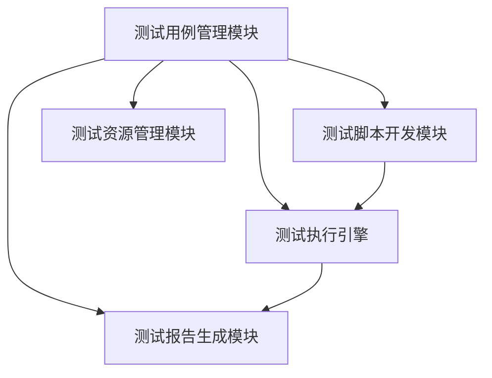

                 

# 评测系统的自动化测试用例管理

## 关键词

- 自动化测试
- 测试用例管理
- 评测系统
- 测试自动化框架
- 测试覆盖率

## 摘要

本文旨在探讨评测系统的自动化测试用例管理，包括自动化测试的背景与挑战、系统架构与核心原则、核心概念与理论、系统实施与高级话题。通过深入分析自动化测试的基本概念、策略与设计方法，以及系统实施中的配置与管理、测试脚本开发，本文将为读者提供一套完整的自动化测试用例管理解决方案，帮助提高软件测试效率和可靠性，减少人为错误。

## 目录

1. 引言  
    1.1 自动化测试用例管理的重要性与挑战  
    1.2 自动化测试用例管理概述

2. 自动化测试用例管理系统的架构与原则  
    2.1 系统架构  
    2.2 核心原则

3. 自动化测试的核心概念与理论  
    3.1 软件测试基础  
    3.2 测试用例设计技术

4. 自动化测试用例管理系统的实施  
    4.1 系统配置与开发环境搭建  
    4.2 测试脚本开发

5. 自动化测试的高级话题  
    5.1 测试数据管理  
    5.2 测试覆盖率分析

6. 最佳实践与项目实战  
    6.1 开发环境搭建  
    6.2 源代码实现与解读  
    6.3 实际案例分析

7. 小结与展望

## 引言

### 1.1 自动化测试用例管理的重要性与挑战

自动化测试用例管理是软件测试过程中至关重要的一环。随着软件系统的复杂度和规模不断增加，传统的手工测试方法已无法满足日益增长的测试需求。自动化测试用例管理通过自动化执行测试用例，可以提高测试效率、减少人为错误，从而确保软件质量。

然而，自动化测试用例管理也面临着一系列挑战。首先，测试用例的编写和维护需要耗费大量时间和精力。其次，自动化测试的覆盖率和可靠性是评估自动化测试效果的关键指标，如何设计高效的测试用例以及如何确保测试脚本的稳定性成为难题。此外，自动化测试用例的管理和调度也是一个复杂的过程，如何合理地分配测试资源、优化测试流程，以确保测试工作的高效进行，也是自动化测试用例管理的重要挑战。

### 1.2 自动化测试用例管理概述

自动化测试用例管理是一个涵盖测试用例设计、测试脚本开发、测试执行、结果分析等环节的全流程管理过程。其主要目标是实现测试过程的自动化，提高测试效率和质量。

在自动化测试用例管理中，测试用例的编写是核心环节之一。测试用例的设计应充分考虑软件需求规格说明书和系统设计文档，确保测试用例能够全面覆盖软件功能。测试用例的设计方法包括边界值分析、等价类划分、因果图等。

测试脚本开发是将测试用例转化为可执行的代码的过程。测试脚本的开发需要选择合适的编程语言和自动化测试工具，并根据测试用例的要求进行编写。测试脚本的编写质量直接影响到自动化测试的效果。

测试执行是自动化测试用例管理的重要环节。通过自动化测试工具，可以批量执行测试用例，快速发现软件缺陷。在测试执行过程中，需要确保测试环境的一致性和稳定性，以避免环境变化对测试结果的影响。

结果分析是自动化测试用例管理的最后一个环节。通过对测试结果的统计分析，可以评估测试覆盖率和软件质量，为后续的测试工作提供参考。

## 自动化测试用例管理系统的架构与原则

### 2.1 系统架构

自动化测试用例管理系统是一个复杂的软件系统，其架构设计直接影响系统的性能和可维护性。典型的自动化测试用例管理系统通常包括以下几个核心组件：

1. **测试用例管理模块**：负责测试用例的创建、编辑、执行和结果分析等功能。该模块通常包括数据库、Web界面和API接口等部分。

2. **测试脚本开发模块**：提供脚本编写、调试和执行环境。该模块通常支持多种编程语言和自动化测试工具，如Selenium、Appium等。

3. **测试执行引擎**：负责执行测试脚本，并收集测试结果。测试执行引擎需要与被测试系统进行交互，以模拟用户操作并验证系统功能。

4. **测试报告生成模块**：负责将测试结果生成直观的报表，以便于测试人员分析测试效果。

5. **测试资源管理模块**：负责测试环境的配置和管理，包括测试机器、数据库、网络等资源的分配和调度。

### 2.2 核心原则

在自动化测试用例管理系统的设计和实施过程中，需要遵循以下核心原则：

1. **模块化设计**：将系统划分为多个功能模块，每个模块负责特定的功能，便于系统的维护和扩展。

2. **可扩展性**：系统应具备良好的可扩展性，能够支持新的测试工具和技术的引入，以适应不断变化的测试需求。

3. **高可靠性**：系统应确保测试脚本的稳定性和测试结果的可信性，以减少测试过程中的错误和风险。

4. **易用性**：系统界面应简洁直观，易于操作，降低使用门槛，提高测试人员的使用效率。

5. **测试覆盖率和测试效率**：系统应提供有效的测试覆盖率和测试效率评估机制，以帮助测试人员优化测试策略。

6. **测试数据管理**：系统应具备良好的测试数据管理能力，确保测试数据的一致性和隔离性，以避免数据污染。

### 2.3 系统架构的 Mermaid 流程图



### 2.4 自动化测试策略与设计模式

自动化测试策略是指导自动化测试实施的方法和原则。常见的自动化测试策略包括：

1. **回归测试**：在软件迭代过程中，针对已经通过的测试用例进行重复测试，以确保修改后的代码没有引入新的缺陷。

2. **功能测试**：针对软件功能进行自动化测试，验证软件功能的正确性和完整性。

3. **性能测试**：通过自动化测试工具模拟用户操作，评估软件的性能和稳定性。

4. **安全性测试**：自动化测试工具模拟攻击行为，评估软件的安全性。

自动化测试设计模式是指导测试用例设计的方法。常见的自动化测试设计模式包括：

1. **边界值分析**：通过分析输入数据的边界条件，设计测试用例，以检测软件在边界条件下的行为。

2. **等价类划分**：将输入数据划分为多个等价类，每个等价类内的数据具有相似的行为，通过设计测试用例，覆盖不同的等价类。

3. **因果图**：通过分析输入变量和输出结果之间的因果关系，设计测试用例，以全面覆盖所有可能的因果关系。

### 2.5 测试数据管理

测试数据管理是自动化测试用例管理的重要部分。测试数据管理的关键点包括：

1. **测试数据一致性**：确保测试数据的一致性，避免数据冲突和重复。

2. **测试数据隔离**：确保测试数据之间的隔离性，避免测试数据之间的干扰。

3. **测试数据安全**：确保测试数据的安全，防止数据泄露和未经授权的访问。

4. **测试数据备份**：定期备份测试数据，以防止数据丢失。

## 自动化测试的核心概念与理论

### 3.1 软件测试基础

软件测试是确保软件质量的重要手段。软件测试的基本概念包括：

1. **测试目的**：发现软件缺陷，验证软件功能、性能和安全性。

2. **测试类型**：包括功能测试、性能测试、安全性测试等。

3. **测试策略**：包括测试规划、测试设计、测试执行和测试评估等。

4. **测试用例**：测试用例是测试的基本单元，描述了如何测试某个功能或特性。

5. **测试覆盖率**：测试覆盖率是评估测试效果的重要指标，包括代码覆盖率、功能覆盖率等。

### 3.2 不同类型的测试

1. **功能测试**：验证软件功能的正确性和完整性。

2. **性能测试**：评估软件的性能和稳定性，包括响应时间、并发能力等。

3. **安全性测试**：评估软件的安全性，包括漏洞扫描、攻击模拟等。

4. **兼容性测试**：验证软件在不同操作系统、浏览器和设备上的兼容性。

5. **回归测试**：在软件迭代过程中，针对已经通过的测试用例进行重复测试，以确保修改后的代码没有引入新的缺陷。

### 3.3 测试覆盖率指标

测试覆盖率是评估测试效果的重要指标，常见的测试覆盖率指标包括：

1. **代码覆盖率**：测试用例覆盖的代码行数与总代码行数的比例。

2. **功能覆盖率**：测试用例覆盖的功能点与总功能点的比例。

3. **分支覆盖率**：测试用例覆盖的代码分支与总代码分支的比例。

4. **路径覆盖率**：测试用例覆盖的路径与总路径的比例。

### 3.4 测试用例设计技术

1. **边界值分析**：通过分析输入数据的边界条件，设计测试用例。

   ```mermaid
   graph TB
   A[最小值] --> B[输入]
   B --> C[输出]
   D[最大值] --> C
   ```

2. **等价类划分**：将输入数据划分为多个等价类，每个等价类内的数据具有相似的行为。

   ```mermaid
   graph TB
   A[等价类1] --> B{输入1}
   A --> C{输入2}
   A --> D{输入3}
   ```

3. **因果图**：通过分析输入变量和输出结果之间的因果关系，设计测试用例。

   ```mermaid
   graph TB
   A{输入1} --> B{输出1}
   A --> C{输出2}
   B --> D{输出3}
   ```

## 自动化测试用例管理系统的实施

### 4.1 系统配置与开发环境搭建

在实施自动化测试用例管理系统之前，需要首先进行系统配置和开发环境搭建。以下是具体的实施步骤：

1. **环境准备**：准备测试环境，包括测试服务器、数据库、网络等。

2. **工具安装**：安装自动化测试工具，如Selenium、Appium等。

3. **框架搭建**：搭建自动化测试框架，包括测试脚本的开发、执行和结果分析等功能。

4. **数据库配置**：配置测试数据库，存储测试用例、测试结果等数据。

5. **环境配置文件**：编写环境配置文件，配置测试环境的各种参数，如数据库连接信息、测试服务器地址等。

### 4.2 测试脚本开发

测试脚本的开发是自动化测试用例管理的关键环节。以下是测试脚本开发的详细步骤：

1. **需求分析**：根据测试需求，分析需要测试的功能点，设计测试用例。

2. **脚本编写**：使用自动化测试工具编写测试脚本，根据测试用例的要求进行功能验证。

3. **脚本调试**：调试测试脚本，确保脚本能够正确执行并输出正确的测试结果。

4. **脚本维护**：定期维护测试脚本，更新测试用例，修复脚本中的错误。

### 4.3 测试执行与结果分析

测试执行是自动化测试用例管理系统的重要环节。以下是测试执行与结果分析的详细步骤：

1. **测试执行**：使用自动化测试工具批量执行测试脚本，生成测试结果。

2. **结果分析**：分析测试结果，统计测试覆盖率、缺陷数量等指标。

3. **缺陷管理**：将发现的缺陷分配给开发人员进行修复。

4. **测试报告生成**：生成测试报告，总结测试结果，为后续测试工作提供参考。

## 自动化测试的高级话题

### 5.1 测试数据管理

测试数据管理是自动化测试用例管理的关键环节。以下是测试数据管理的详细讨论：

1. **测试数据一致性**：确保测试数据的一致性，避免数据冲突和重复。可以使用数据同步工具或数据库触发器来实现。

2. **测试数据隔离**：确保测试数据之间的隔离性，避免测试数据之间的干扰。可以使用数据隔离工具或数据库隔离策略来实现。

3. **测试数据安全**：确保测试数据的安全，防止数据泄露和未经授权的访问。可以使用数据加密、访问控制等技术来实现。

4. **测试数据备份**：定期备份测试数据，以防止数据丢失。可以使用数据库备份工具或定期手动备份来实现。

### 5.2 测试覆盖率分析

测试覆盖率分析是评估自动化测试效果的重要手段。以下是测试覆盖率分析的详细讨论：

1. **代码覆盖率**：通过自动化测试工具统计测试用例覆盖的代码行数与总代码行数的比例，评估代码覆盖率。

2. **功能覆盖率**：通过自动化测试工具统计测试用例覆盖的功能点与总功能点的比例，评估功能覆盖率。

3. **分支覆盖率**：通过自动化测试工具统计测试用例覆盖的代码分支与总代码分支的比例，评估分支覆盖率。

4. **路径覆盖率**：通过自动化测试工具统计测试用例覆盖的路径与总路径的比例，评估路径覆盖率。

### 5.3 测试资源管理

测试资源管理是确保自动化测试用例管理系统高效运行的关键。以下是测试资源管理的详细讨论：

1. **测试服务器管理**：管理测试服务器，包括服务器配置、性能监控和故障排除等。

2. **数据库管理**：管理测试数据库，包括数据库备份、数据同步和性能优化等。

3. **网络管理**：管理测试网络，包括网络配置、性能监控和故障排除等。

4. **测试环境调度**：根据测试需求，调度测试环境和资源，确保测试工作的高效进行。

## 最佳实践与项目实战

### 6.1 开发环境搭建

在自动化测试用例管理系统的开发过程中，开发环境的搭建至关重要。以下是开发环境搭建的最佳实践：

1. **选择合适的开发工具**：根据项目需求，选择合适的开发工具，如Visual Studio、IntelliJ IDEA等。

2. **配置开发环境**：配置开发环境，包括安装必要的插件、扩展和框架等。

3. **代码管理工具**：使用代码管理工具，如Git，进行代码版本控制和协作开发。

4. **测试工具集成**：将自动化测试工具集成到开发环境中，确保测试脚本的开发、调试和执行都在同一环境中进行。

### 6.2 源代码实现与解读

源代码实现是自动化测试用例管理系统开发的核心环节。以下是源代码实现的详细解读：

1. **测试用例管理模块**：实现测试用例的创建、编辑、执行和结果分析等功能。

2. **测试脚本开发模块**：实现测试脚本的编写、调试和执行等功能。

3. **测试执行引擎**：实现测试脚本的执行和测试结果的收集。

4. **测试报告生成模块**：实现测试报告的生成和展示。

5. **测试资源管理模块**：实现测试资源的配置和管理。

### 6.3 代码应用解读与分析

源代码实现后的应用解读与分析是确保自动化测试用例管理系统有效运行的关键。以下是代码应用解读与分析的详细步骤：

1. **代码审查**：对源代码进行审查，确保代码质量，遵循编程规范。

2. **单元测试**：编写单元测试，验证各个功能模块的正确性和稳定性。

3. **集成测试**：将各个功能模块集成到一起，进行集成测试，确保系统整体的正确性和稳定性。

4. **性能测试**：进行性能测试，评估系统的性能和响应时间。

5. **安全性测试**：进行安全性测试，确保系统的安全性。

### 6.4 实际案例分析

实际案例分析是验证自动化测试用例管理系统效果的重要手段。以下是实际案例分析的详细步骤：

1. **案例选择**：选择具有代表性的实际案例，如电商网站、社交媒体平台等。

2. **测试需求分析**：分析案例的测试需求，设计测试用例。

3. **测试脚本编写**：编写测试脚本，实现测试用例的自动化执行。

4. **测试执行**：执行测试脚本，收集测试结果。

5. **测试结果分析**：分析测试结果，评估测试效果。

6. **缺陷管理**：将发现的缺陷分配给开发人员进行修复。

### 6.5 项目小结

在项目小结中，对自动化测试用例管理系统的实施效果进行总结。以下是项目小结的内容：

1. **项目目标**：回顾项目的目标和预期效果。

2. **实施效果**：评估自动化测试用例管理系统的实施效果，包括测试效率、测试覆盖率、缺陷发现率等。

3. **经验教训**：总结项目实施过程中的经验教训，为后续项目提供参考。

4. **优化方向**：提出自动化测试用例管理系统的优化方向，以提高系统的性能和稳定性。

## 小结与展望

本文全面探讨了评测系统的自动化测试用例管理，从背景与挑战、系统架构与原则、核心概念与理论、系统实施与高级话题等方面进行了深入分析。通过实际案例和项目实战，本文为读者提供了实用的自动化测试用例管理解决方案。

未来，随着人工智能和自动化技术的发展，自动化测试用例管理将继续演进，更加智能化、高效化。同时，自动化测试用例管理将与其他领域的技术，如云计算、大数据等相结合，为软件质量保障提供更强大的支持。

### 作者信息

作者：AI天才研究院/AI Genius Institute & 禅与计算机程序设计艺术 /Zen And The Art of Computer Programming


