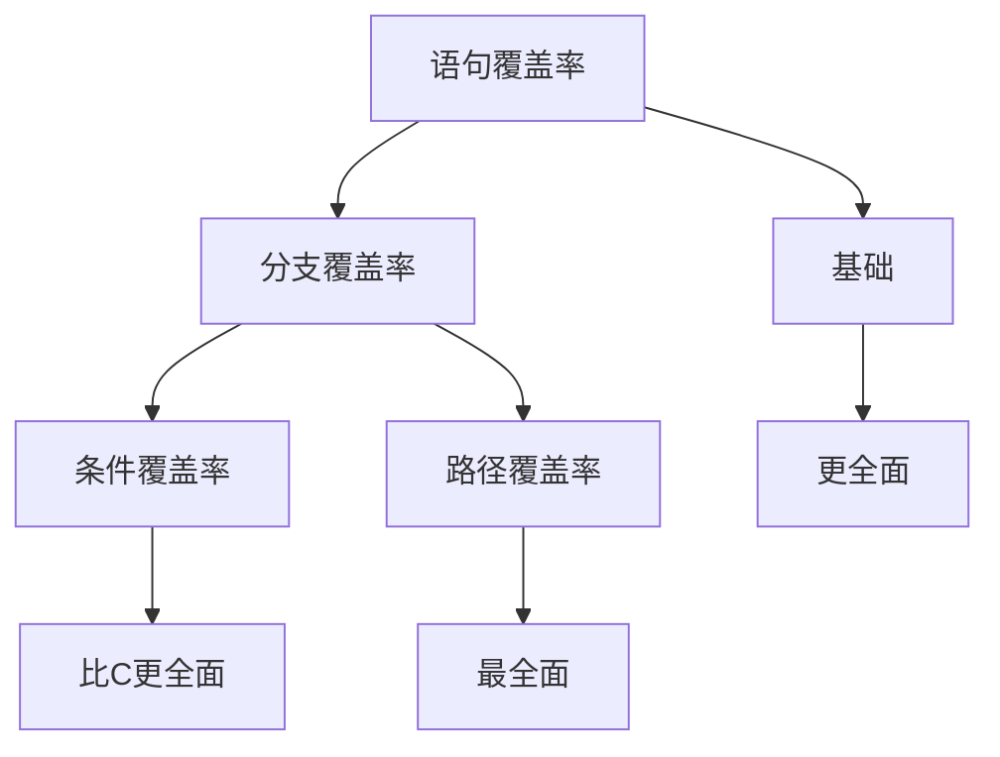

                 

## 引言

### 1.1 自动化测试的重要性

在当今的软件工程领域，自动化测试已经成为提高软件质量、降低成本、提高开发效率的关键手段。自动化测试通过预定的脚本或代码，自动执行一系列测试用例，从而验证软件的功能、性能和安全等方面是否符合预期。相比传统的手动测试，自动化测试具有高效、准确、可重复等优点，能够极大地提升测试的覆盖率和效率。

自动化测试的重要性主要体现在以下几个方面：

1. **提高测试效率**：自动化测试可以大大减少测试用例的执行时间，特别是在回归测试阶段，自动化测试可以快速发现新版本中引入的问题。
2. **降低测试成本**：通过自动化测试，可以减少大量的人力资源投入，降低测试成本。
3. **确保软件质量**：自动化测试可以覆盖更多的测试场景，发现潜在的问题，从而提高软件的稳定性和可靠性。
4. **提高开发效率**：自动化测试可以解放开发人员，使他们能够将更多精力投入到新功能的开发上，提高整体开发效率。

### 1.2 测试覆盖率的概念

测试覆盖率是自动化测试中的一个关键指标，它衡量了测试用例对代码的覆盖程度。测试覆盖率越高，意味着测试用例越全面，能够发现的问题越多。常见的测试覆盖率类型包括：

1. **语句覆盖率**：指测试用例执行的代码语句的比例。语句覆盖率是最基本的测试覆盖率类型，能够确保每条语句都被执行到至少一次。
2. **分支覆盖率**：指测试用例执行的代码分支的比例。分支覆盖率比语句覆盖率更严格，它要求每个代码分支都被执行到至少一次。
3. **路径覆盖率**：指测试用例执行的代码路径的比例。路径覆盖率是最高级别的测试覆盖率，要求每个可能的代码路径都被执行到至少一次。

### 1.3 本书的目的与结构

本书旨在深入探讨评测系统的自动化测试覆盖率分析，帮助读者全面理解测试覆盖率的概念、计算方法以及在实际项目中的应用。本书将分为七个章节，具体内容包括：

- **第1章 引言**：介绍自动化测试的重要性以及本书的结构和目的。
- **第2章 自动化测试基础**：介绍自动化测试的基本概念、分类以及常用工具。
- **第3章 测试覆盖率分析**：详细讲解各种测试覆盖率的定义和分析方法。
- **第4章 自动化测试覆盖率工具**：介绍常见自动化测试覆盖率工具的使用方法。
- **第5章 测试覆盖率分析实践**：通过实际案例讲解测试覆盖率分析的实施步骤。
- **第6章 测试覆盖率分析与持续集成**：探讨测试覆盖率与持续集成的关系以及实现方法。
- **第7章 自动化测试覆盖率的挑战与展望**：分析自动化测试覆盖率面临的挑战和发展趋势。

通过本书的学习，读者将能够掌握自动化测试覆盖率的计算方法和实际应用技巧，为提高软件质量提供有力支持。

### 1.4 关键词

- 自动化测试
- 测试覆盖率
- 语句覆盖率
- 条件覆盖率
- 路径覆盖率
- 自动化测试工具

### 1.5 摘要

本文全面探讨了评测系统的自动化测试覆盖率分析。首先介绍了自动化测试的重要性以及测试覆盖率的概念。接着详细讲解了各种测试覆盖率的定义和分析方法，包括语句覆盖率、条件覆盖率和路径覆盖率。随后，介绍了常见自动化测试覆盖率工具的使用方法。通过实际案例，讲解了测试覆盖率分析的实施步骤。最后，探讨了测试覆盖率与持续集成的关系以及未来自动化测试覆盖率的发展趋势。本文旨在帮助读者深入理解测试覆盖率分析，提高软件质量。

---

## 第2章 自动化测试基础

### 2.1 自动化测试的概念

自动化测试是指通过预定的脚本或代码，自动执行一系列测试用例，以验证软件功能、性能和安全等方面是否符合预期。自动化测试的核心思想是将手动测试转化为可重复、可执行的自动化过程，从而提高测试效率和质量。

自动化测试的主要组成部分包括：

1. **测试脚本**：测试脚本是一系列编程代码，用于模拟用户操作、验证功能和性能。测试脚本通常由开发人员或测试工程师编写。
2. **测试工具**：测试工具是用于自动化执行测试脚本的工具或平台。常见的测试工具包括Selenium、JUnit、TestNG等。
3. **测试环境**：测试环境是用于执行测试脚本和工具的硬件和软件配置。测试环境应与生产环境尽可能一致，以确保测试结果的可靠性。

自动化测试与传统手动测试相比，具有以下优势：

1. **效率高**：自动化测试可以快速执行大量测试用例，特别是重复性的测试，显著提高测试效率。
2. **准确性高**：自动化测试可以精确地按照预定的脚本执行，减少人为错误，提高测试结果的准确性。
3. **可重复性强**：自动化测试可以重复执行，确保测试过程的一致性，便于发现新版本中的问题。
4. **降低成本**：自动化测试减少了对人力资源的依赖，降低了测试成本。

### 2.2 自动化测试的分类

自动化测试可以根据测试对象和目的的不同，分为多种类型。以下是几种常见的自动化测试类型：

1. **单元测试**：单元测试是针对软件中的最小可测试单元（通常是函数或方法）进行的测试。单元测试通常由开发人员编写，用于验证代码的正确性。单元测试具有执行速度快、覆盖面广等特点，是自动化测试的基础。

2. **集成测试**：集成测试是针对软件中的多个模块或组件进行的测试，主要用于验证模块之间的接口和交互是否正常。集成测试通常在单元测试之后进行，可以提前发现和解决模块之间的冲突和问题。

3. **功能测试**：功能测试是针对软件功能进行的测试，主要用于验证软件的功能是否符合需求规格说明。功能测试可以覆盖到软件的各个功能模块，是确保软件功能完整性的关键。

4. **性能测试**：性能测试是针对软件性能进行的测试，主要用于验证软件在特定负载下的性能表现，如响应时间、吞吐量等。性能测试有助于识别系统瓶颈，优化软件性能。

5. **安全测试**：安全测试是针对软件安全性能进行的测试，主要用于验证软件的安全性，如防止SQL注入、跨站脚本攻击等。安全测试有助于提高软件的安全防护能力，防范潜在的安全威胁。

### 2.3 自动化测试工具介绍

自动化测试工具是自动化测试的核心组成部分，能够显著提高测试效率和覆盖率。以下是几种常用的自动化测试工具：

1. **Selenium**：Selenium是一个开源的自动化测试工具，主要用于Web应用的自动化测试。Selenium支持多种编程语言，如Java、Python、C#等，能够实现跨浏览器测试。

2. **JUnit**：JUnit是一个流行的Java单元测试框架，用于编写和执行Java代码的测试用例。JUnit提供了一系列断言方法和测试生命周期管理功能，是Java开发者常用的测试工具。

3. **TestNG**：TestNG是一个开源的测试框架，类似于JUnit，但功能更强大。TestNG支持多种编程语言，如Java、Python、C#等，提供了丰富的测试用例管理和报告功能。

4. **Appium**：Appium是一个开源的自动化测试工具，用于移动应用的自动化测试。Appium支持多种平台，如iOS、Android等，能够实现跨平台的移动应用自动化测试。

5. **JMeter**：JMeter是一个开源的性能测试工具，主要用于测试Web应用的性能。JMeter可以模拟大量用户同时访问系统，用于测试系统的响应时间、吞吐量等性能指标。

通过以上介绍，我们可以看到自动化测试在提高测试效率、确保软件质量方面具有重要作用。接下来，我们将进一步探讨测试覆盖率的概念和分析方法。

### 2.4 自动化测试的基础流程

自动化测试的流程可以分为几个关键步骤，每个步骤都在确保测试质量和效率方面发挥重要作用。以下是自动化测试的基础流程及其详细步骤：

#### 2.4.1 测试需求分析

测试需求分析是自动化测试的第一步，其目的是明确测试目标和测试范围。测试团队需要与开发人员和产品经理紧密合作，分析软件的功能、性能和安全等需求，制定详细的测试计划和测试用例。

1. **需求梳理**：从需求文档、用户故事或用例中提取关键功能点，明确测试的重点。
2. **风险评估**：评估软件功能的风险等级，优先安排高风险功能的测试。
3. **制定测试计划**：根据需求梳理和风险评估结果，制定详细的测试计划，包括测试目标、测试方法、测试环境和测试时间表。

#### 2.4.2 测试用例设计

测试用例设计是自动化测试的核心步骤，其目的是确保测试用例能够全面覆盖软件的功能和性能。测试用例设计通常包括以下步骤：

1. **功能测试用例设计**：根据需求分析结果，设计功能测试用例，包括正常路径测试、异常路径测试、边界条件测试等。
2. **性能测试用例设计**：设计用于测试软件在不同负载下的性能表现，包括并发用户数、响应时间、吞吐量等。
3. **安全测试用例设计**：设计用于测试软件的安全性，包括SQL注入、跨站脚本攻击等常见安全漏洞。

#### 2.4.3 测试脚本编写

测试脚本编写是将测试用例转化为自动化测试脚本的过程。编写测试脚本通常涉及以下步骤：

1. **选择测试工具**：根据测试需求和测试工具的兼容性，选择合适的测试工具。
2. **脚本编写**：使用所选测试工具的编程语言，根据测试用例编写自动化测试脚本。脚本编写需要考虑到可维护性、可扩展性和测试覆盖率。
3. **调试与优化**：在测试脚本编写过程中，需要进行多次调试和优化，确保测试脚本能够正确执行并获取准确的测试结果。

#### 2.4.4 测试环境搭建

测试环境搭建是确保自动化测试能够正常运行的关键步骤。测试环境需要与生产环境尽量一致，包括硬件配置、软件配置和网络环境等。

1. **硬件环境搭建**：搭建符合测试需求的硬件环境，确保测试过程中硬件资源充足。
2. **软件环境搭建**：安装和配置所需的操作系统、数据库、中间件等软件，确保测试环境与生产环境一致。
3. **网络环境搭建**：搭建符合测试需求的网络环境，包括网络配置、防火墙设置等。

#### 2.4.5 测试执行与结果分析

测试执行与结果分析是自动化测试的最终步骤，其目的是验证软件是否符合预期并识别潜在问题。

1. **测试执行**：根据测试计划和测试用例，执行自动化测试脚本，获取测试结果。
2. **结果分析**：分析测试结果，识别测试失败的原因，并生成详细的测试报告。测试报告应包括测试覆盖率、测试结果统计、问题清单和改进建议。
3. **问题跟踪与反馈**：对于测试过程中发现的问题，及时反馈给开发团队，确保问题得到及时解决。

通过以上自动化测试基础流程，我们可以确保自动化测试能够高效、准确地执行，为软件质量提供有力保障。接下来，我们将进一步探讨测试覆盖率的分析方法和具体实现。

### 2.5 自动化测试的挑战与应对策略

尽管自动化测试在提高测试效率和质量方面具有显著优势，但在实际应用过程中仍面临一些挑战。以下是自动化测试的常见挑战及其应对策略：

#### 2.5.1 测试用例设计难度大

自动化测试用例的设计需要详细和全面，否则可能会导致测试覆盖率不足或测试失效。为了应对这个挑战，可以采取以下策略：

1. **模块化设计**：将复杂的测试用例分解为更小、更易管理的模块，逐步实现和测试。
2. **使用模板**：制定通用的测试用例模板，便于快速创建和修改测试用例。
3. **用户参与**：邀请业务人员和技术人员共同参与测试用例设计，确保测试用例能够全面覆盖业务需求和技术细节。

#### 2.5.2 测试脚本维护成本高

自动化测试脚本需要定期更新和维护，以适应软件的变更和测试环境的变化。为了降低维护成本，可以采取以下策略：

1. **脚本框架**：使用统一的脚本框架，减少因环境变化导致的脚本修改。
2. **持续集成**：将自动化测试脚本集成到持续集成（CI）过程中，及时发现和解决脚本问题。
3. **自动化测试维护**：定期审查和优化自动化测试脚本，确保其能够高效执行和稳定运行。

#### 2.5.3 测试环境一致性差

测试环境与生产环境不一致可能导致自动化测试结果不准确。为了确保测试环境一致性，可以采取以下策略：

1. **标准化测试环境**：制定统一的测试环境配置标准，确保所有测试环境一致。
2. **自动化环境部署**：使用自动化工具部署和管理测试环境，减少手动操作和配置错误。
3. **定期环境对比**：定期对比测试环境与生产环境，及时发现和解决不一致的问题。

通过上述策略，我们可以有效应对自动化测试过程中面临的挑战，确保自动化测试能够持续、稳定地运行，为软件质量提供有力保障。

---

## 第3章 测试覆盖率分析

### 3.1 测试覆盖率概述

测试覆盖率是评估自动化测试全面性的重要指标，它衡量了测试用例对代码的覆盖程度。测试覆盖率越高，说明测试用例对代码的覆盖越全面，能够发现潜在问题的能力越强。测试覆盖率不仅反映了测试的质量，还直接影响软件的稳定性和可靠性。因此，测试覆盖率分析在软件测试中具有非常重要的地位。

### 3.1.1 测试覆盖率的重要性

1. **提高软件质量**：高测试覆盖率能够确保测试用例覆盖到软件的各个关键部分，提高软件的可靠性和稳定性，降低软件发布后出现问题的风险。
2. **指导测试优化**：通过分析测试覆盖率，可以识别测试覆盖不足的区域，从而有针对性地优化测试用例，提高测试的全面性。
3. **评估测试效率**：测试覆盖率可以作为评估测试团队工作成效的指标，帮助管理层了解测试工作的进展和效果。

### 3.1.2 测试覆盖率的种类

测试覆盖率主要分为以下几种类型：

1. **语句覆盖率**：语句覆盖率（Statement Coverage）是测试覆盖率中最基本的一种。它衡量测试用例是否执行了代码中的每一条语句，即每个语句是否至少执行一次。语句覆盖率是最简单的覆盖率类型，但无法检测代码中的逻辑错误或冗余代码。

2. **分支覆盖率**：分支覆盖率（Branch Coverage）也称为判定覆盖率，它衡量测试用例是否执行了代码中的每个分支。具体来说，分支覆盖率要求每个判断语句的每个分支（真分支和假分支）都被执行到至少一次。分支覆盖率比语句覆盖率更严格，能够更好地检测代码中的逻辑错误。

3. **路径覆盖率**：路径覆盖率（Path Coverage）是测试覆盖率中最严格的一种，它要求测试用例执行到程序中所有可能的路径。这意味着每个条件判断的每个可能组合都至少被测试到一次。路径覆盖率能够最全面地检测代码中的问题，但通常难以实现，因为程序中可能存在大量的路径组合。

### 3.2 语句覆盖率

语句覆盖率是最基本的测试覆盖率类型，它衡量测试用例是否覆盖了代码中的每一条语句。语句覆盖率的计算方法相对简单，只需要确保每个语句至少执行一次即可。

#### 3.2.1 语句覆盖率的定义

语句覆盖率（Statement Coverage）是指测试用例执行后，程序中的每条可执行语句都被至少执行一次的程度。其计算公式如下：

$$
\text{语句覆盖率} = \frac{\text{执行到的语句数}}{\text{总语句数}} \times 100\%
$$

#### 3.2.2 语句覆盖率的分析方法

1. **确定代码中的语句数量**：首先，需要统计代码中所有的可执行语句数量。
2. **执行测试用例**：运行自动化测试脚本，确保每个语句都被执行到至少一次。
3. **计算语句覆盖率**：根据执行结果，计算语句覆盖率。如果语句覆盖率低于预期，需要进一步分析和调整测试用例。

下面是一个简单的语句覆盖率分析的伪代码示例：

```python
# 伪代码：计算语句覆盖率

# 步骤1：统计代码中的语句数量
total_statements = count_all_executable_statements()

# 步骤2：执行测试用例
test_executed_statements = execute_tests()

# 步骤3：计算语句覆盖率
statement_coverage = (len(test_executed_statements) / total_statements) * 100

# 输出语句覆盖率
print("语句覆盖率：", statement_coverage, "%")
```

#### 3.2.3 语句覆盖率的优缺点

**优点**：

1. **实现简单**：语句覆盖率计算方法简单，易于实现。
2. **快速评估**：可以通过简单的计数快速评估测试用例的执行情况。

**缺点**：

1. **无法检测逻辑错误**：语句覆盖率只能确保每条语句都被执行到至少一次，但无法检测逻辑错误。
2. **覆盖率较低**：对于复杂的代码，仅通过语句覆盖率可能无法达到理想的覆盖程度。

### 3.3 条件覆盖率

条件覆盖率（Branch Coverage）是比语句覆盖率更严格的测试覆盖率类型，它要求测试用例执行到代码中的每个条件判断的每个分支（真分支和假分支）。条件覆盖率能够更全面地检测代码中的逻辑错误。

#### 3.3.1 条件覆盖率的定义

条件覆盖率（Branch Coverage）是指测试用例是否覆盖了程序中每个条件判断的每个分支（真分支和假分支）。其计算公式如下：

$$
\text{条件覆盖率} = \frac{\text{执行到的分支数}}{\text{总分支数}} \times 100\%
$$

其中，总分支数是指程序中所有条件判断的分支总数，执行到的分支数是指测试用例实际执行到的分支总数。

#### 3.3.2 条件覆盖率的分析方法

1. **确定代码中的分支数量**：统计代码中所有条件判断的分支数量。
2. **执行测试用例**：运行自动化测试脚本，确保每个条件判断的每个分支都被执行到至少一次。
3. **计算条件覆盖率**：根据执行结果，计算条件覆盖率。如果条件覆盖率低于预期，需要进一步分析和调整测试用例。

下面是一个简单的条件覆盖率分析的伪代码示例：

```python
# 伪代码：计算条件覆盖率

# 步骤1：统计代码中的分支数量
total_branches = count_all_branches()

# 步骤2：执行测试用例
test_executed_branches = execute_tests()

# 步骤3：计算条件覆盖率
branch_coverage = (len(test_executed_branches) / total_branches) * 100

# 输出条件覆盖率
print("条件覆盖率：", branch_coverage, "%")
```

#### 3.3.3 条件覆盖率的优缺点

**优点**：

1. **检测逻辑错误**：条件覆盖率能够确保每个条件判断的每个分支都被执行到，从而更好地检测代码中的逻辑错误。
2. **全面性较高**：条件覆盖率能够覆盖更多的代码路径，提高测试的全面性。

**缺点**：

1. **计算复杂度较高**：条件覆盖率的计算比语句覆盖率更复杂，需要对代码进行更深入的分析。
2. **实现难度较大**：在某些情况下，实现条件覆盖率可能需要修改代码或增加测试用例。

### 3.4 路径覆盖率

路径覆盖率（Path Coverage）是测试覆盖率中最严格的一种类型，它要求测试用例执行到程序中的所有可能路径。路径覆盖率能够最全面地检测代码中的问题，但实现难度非常高。

#### 3.4.1 路径覆盖率的定义

路径覆盖率（Path Coverage）是指测试用例是否覆盖了程序中的所有可能路径。其计算公式如下：

$$
\text{路径覆盖率} = \frac{\text{执行到的路径数}}{\text{总路径数}} \times 100\%
$$

其中，总路径数是指程序中所有可能的路径总数，执行到的路径数是指测试用例实际执行到的路径总数。

#### 3.4.2 路径覆盖率的分析方法

1. **确定代码中的路径数量**：使用路径分析工具或算法计算程序中所有可能的路径数量。
2. **执行测试用例**：运行自动化测试脚本，确保每个路径都被执行到至少一次。
3. **计算路径覆盖率**：根据执行结果，计算路径覆盖率。如果路径覆盖率低于预期，需要进一步分析和调整测试用例。

下面是一个简单的路径覆盖率分析的伪代码示例：

```python
# 伪代码：计算路径覆盖率

# 步骤1：计算代码中的路径数量
total_paths = count_all_paths()

# 步骤2：执行测试用例
test_executed_paths = execute_tests()

# 步骤3：计算路径覆盖率
path_coverage = (len(test_executed_paths) / total_paths) * 100

# 输出路径覆盖率
print("路径覆盖率：", path_coverage, "%")
```

#### 3.4.3 路径覆盖率的优缺点

**优点**：

1. **全面性最高**：路径覆盖率能够覆盖程序中的所有可能路径，确保测试的全面性和准确性。
2. **检测复杂错误**：路径覆盖率能够检测到最隐蔽的错误，提高软件的可靠性。

**缺点**：

1. **实现难度极高**：路径覆盖率的实现需要对程序有深入的理解，通常需要复杂的算法和工具支持。
2. **计算复杂度极高**：路径覆盖率的计算需要分析程序的所有路径，计算复杂度非常高，通常难以在合理的时间内完成。

通过以上对测试覆盖率的分析，我们可以看到不同类型的测试覆盖率各有优缺点，选择合适的测试覆盖率类型能够更好地保障软件质量。在接下来的章节中，我们将继续探讨自动化测试覆盖率工具的介绍，帮助读者更好地理解如何在实际项目中应用测试覆盖率分析。

### 3.5 测试覆盖率的计算方法

测试覆盖率是衡量测试用例执行程度的重要指标，通过不同类型的覆盖率计算方法，可以评估测试的全面性和准确性。以下是三种常见测试覆盖率的计算方法：

#### 3.5.1 语句覆盖率的计算方法

语句覆盖率（Statement Coverage）是测试覆盖率中最基本的一种类型，其计算方法相对简单。语句覆盖率的核心目标是确保代码中的每条可执行语句都被至少执行一次。

1. **计算步骤**：

    - 统计代码中的所有可执行语句数量（Total Statements）。
    - 运行测试用例，记录实际执行到的语句数量（Executed Statements）。
    - 使用以下公式计算语句覆盖率：

    $$
    \text{语句覆盖率} = \frac{\text{Executed Statements}}{\text{Total Statements}} \times 100\%
    $$

2. **示例**：

    ```python
    # 示例：计算语句覆盖率
    total_statements = 10  # 代码中总共有10条可执行语句
    executed_statements = 8  # 测试执行了8条可执行语句

    statement_coverage = (executed_statements / total_statements) * 100
    print("语句覆盖率：", statement_coverage, "%")
    ```

    输出结果：语句覆盖率：80%

#### 3.5.2 分支覆盖率的计算方法

分支覆盖率（Branch Coverage），也称为判定覆盖率，其目标是确保代码中每个条件判断的每个分支（真分支和假分支）都被至少执行一次。

1. **计算步骤**：

    - 统计代码中所有的分支数量（Total Branches）。
    - 运行测试用例，记录实际执行到的分支数量（Executed Branches）。
    - 使用以下公式计算分支覆盖率：

    $$
    \text{分支覆盖率} = \frac{\text{Executed Branches}}{\text{Total Branches}} \times 100\%
    $$

2. **示例**：

    ```python
    # 示例：计算分支覆盖率
    total_branches = 6  # 代码中总共有6个条件判断
    executed_branches = 4  # 测试执行了4个条件判断

    branch_coverage = (executed_branches / total_branches) * 100
    print("分支覆盖率：", branch_coverage, "%")
    ```

    输出结果：分支覆盖率：66.67%

#### 3.5.3 路径覆盖率的计算方法

路径覆盖率（Path Coverage）是测试覆盖率中最严格的一种类型，其目标是确保代码中的每一条可能路径都被至少执行一次。

1. **计算步骤**：

    - 使用路径分析工具或算法计算程序中所有可能的路径数量（Total Paths）。
    - 运行测试用例，记录实际执行到的路径数量（Executed Paths）。
    - 使用以下公式计算路径覆盖率：

    $$
    \text{路径覆盖率} = \frac{\text{Executed Paths}}{\text{Total Paths}} \times 100\%
    $$

2. **示例**：

    ```python
    # 示例：计算路径覆盖率
    total_paths = 20  # 程序中总共有20条可能路径
    executed_paths = 12  # 测试执行了12条可能路径

    path_coverage = (executed_paths / total_paths) * 100
    print("路径覆盖率：", path_coverage, "%")
    ```

    输出结果：路径覆盖率：60%

通过上述计算方法，我们可以对不同的测试覆盖率类型进行量化分析，从而更全面地评估测试的执行情况，为软件质量提供可靠保障。

### 3.6 测试覆盖率分析的关系架构

为了更好地理解测试覆盖率之间的联系和区别，我们可以通过Mermaid流程图来展示它们之间的关系架构。以下是一个简单的Mermaid流程图示例：



该流程图展示了语句覆盖率作为基础，分支覆盖率在此基础上进行了更严格的条件覆盖，而路径覆盖率则是最全面的覆盖类型。

通过这种方式，我们可以直观地看到不同测试覆盖率类型之间的层级关系，以及它们在测试全面性方面的差异。

### 3.7 测试覆盖率分析的应用与实际案例

在实际项目中，测试覆盖率分析是评估和优化测试过程的重要手段。以下是一个具体的测试覆盖率分析应用案例，以及如何通过具体步骤来提升测试覆盖率。

#### 案例背景

某电商平台在开发过程中，需要确保其核心功能（如商品搜索、购物车、订单处理等）的稳定性和可靠性。由于业务需求复杂，开发团队决定采用自动化测试来提高测试效率和质量。在自动化测试过程中，团队关注测试覆盖率的提升，以更全面地验证软件功能。

#### 测试覆盖率分析实施步骤

1. **测试需求分析**：

    - 与产品经理和开发团队沟通，明确需要测试的核心功能模块。
    - 分析功能模块的复杂性和风险等级，制定测试计划和测试用例。

2. **编写测试脚本**：

    - 根据测试用例编写自动化测试脚本，使用Selenium和JUnit等工具。
    - 确保测试脚本具有良好的可读性和可维护性。

3. **执行测试用例**：

    - 运行自动化测试脚本，收集测试结果。
    - 计算和记录各功能的测试覆盖率，如语句覆盖率、分支覆盖率和路径覆盖率。

4. **分析覆盖率数据**：

    - 识别测试覆盖率较低的模块，分析原因。
    - 调整测试用例，增加覆盖率较低的模块的测试用例。

5. **优化测试用例**：

    - 根据覆盖率分析结果，优化现有测试用例，确保每个模块的测试覆盖率提升。
    - 重新执行测试，验证优化效果。

#### 实际案例分析与详细讲解

以下是一个具体的案例，展示如何通过分析测试覆盖率来优化测试用例。

**案例**：在商品搜索模块中，语句覆盖率和分支覆盖率较高，但路径覆盖率较低。

1. **问题识别**：

    - 通过覆盖率分析，发现商品搜索模块的路径覆盖率只有50%。

2. **原因分析**：

    - 测试用例主要集中在正常搜索场景，对于异常搜索场景（如关键字为空、关键字不存在等）覆盖不足。

3. **优化策略**：

    - 增加异常场景的测试用例，确保每个可能的路径都被覆盖到。
    - 对现有测试用例进行修改，使其能够执行更多的路径。

4. **具体实施**：

    ```python
    # 优化测试用例：增加异常搜索场景
    def test_search_with_blank_keyword():
        # 输入空白关键字
        search_input.clear()
        search_button.click()
        # 断言：搜索结果应该为空
        assert result.empty()

    def test_search_with_nonexistent_keyword():
        # 输入不存在的关键字
        search_input.send_keys("unknown_product")
        search_button.click()
        # 断言：搜索结果应该提示关键字不存在
        assert result.contains("关键字不存在")
    ```

5. **效果评估**：

    - 重新执行测试，路径覆盖率提升至80%，验证优化效果。

通过上述案例，我们可以看到，通过测试覆盖率分析，识别覆盖不足的模块，并针对性地优化测试用例，可以有效提升测试覆盖率，确保软件功能的全面验证。

#### 项目小结

通过实际案例的讲解，我们可以得出以下结论：

1. **测试覆盖率分析是优化测试过程的重要手段**，可以帮助团队识别和解决测试覆盖不足的问题。
2. **优化测试用例是提升测试覆盖率的关键**，通过增加异常场景和复杂路径的测试用例，可以更全面地验证软件功能。
3. **持续监控和改进**：测试覆盖率不是一次性任务，需要持续监控和改进，确保测试过程不断优化和提升。

综上所述，通过科学的测试覆盖率分析和有效的测试用例优化，可以显著提高软件的测试质量，为产品的稳定性和可靠性提供有力保障。

### 3.8 测试覆盖率分析与持续集成

在现代软件开发中，持续集成（CI）已成为提高开发效率和质量的关键实践。持续集成通过自动化构建、测试和部署流程，确保代码的稳定性和可靠性。测试覆盖率分析作为持续集成的重要组成部分，能够有效提升软件的质量和稳定性。

#### 3.8.1 持续集成的概念

持续集成是一种软件开发实践，通过持续地将代码集成到一个共享的主干分支中，并自动运行测试和构建过程，以快速发现和解决问题。持续集成的核心目标是缩短代码从编写到部署的时间，提高开发效率和软件质量。

持续集成的主要步骤包括：

1. **代码提交**：开发人员将代码提交到版本控制系统中。
2. **自动化构建**：构建工具（如Jenkins、GitLab CI等）自动构建代码，生成可执行文件或应用程序。
3. **自动化测试**：运行预先定义的自动化测试用例，包括单元测试、集成测试和功能测试等，确保代码的稳定性和可靠性。
4. **反馈与修复**：测试结果通过报告或通知反馈给开发团队，及时修复发现的问题。
5. **自动化部署**：通过配置管理工具（如Ansible、Puppet等）将经过测试的代码部署到生产环境。

#### 3.8.2 测试覆盖率与持续集成的关系

测试覆盖率与持续集成密切相关。在持续集成过程中，测试覆盖率分析可以帮助：

1. **快速发现问题**：通过自动化测试，可以快速发现集成过程中出现的问题，及时修复。
2. **提高软件质量**：持续集成过程中，高测试覆盖率确保了软件在不同阶段的质量，减少了发布后的问题。
3. **优化测试过程**：通过持续监控测试覆盖率，可以识别和优化测试用例，提高测试效率。

#### 3.8.3 Jenkins集成测试覆盖率实现

Jenkins是一个流行的开源持续集成工具，通过Jenkins可以轻松实现自动化测试覆盖率分析。以下是如何在Jenkins中集成测试覆盖率分析的步骤：

1. **安装Jenkins**：在服务器上安装Jenkins，并配置必要的插件，如JUnit插件、JaCoCo插件等。

2. **配置构建脚本**：编写构建脚本，包含以下步骤：

    - 检出代码
    - 编译代码
    - 运行单元测试
    - 收集JaCoCo覆盖率报告

    示例构建脚本（使用Maven）：

    ```shell
    #!/bin/sh

    # 检出代码
    git clone https://github.com/your-repo.git

    # 进入代码目录
    cd your-repo

    # 编译代码
    mvn clean install

    # 运行测试
    mvn test

    # 生成JaCoCo覆盖率报告
    mvn site
    ```

3. **配置Jenkins作业**：

    - 创建新的Jenkins作业
    - 配置Git源，将代码库添加到作业中
    - 配置构建触发器，例如每次提交代码时触发构建
    - 添加构建步骤，执行上述构建脚本
    - 添加发布步骤，生成并展示JaCoCo覆盖率报告

4. **监控和反馈**：

    - 在Jenkins的构建结果页面中查看测试结果和覆盖率报告
    - 配置通知，例如通过邮件或即时通讯工具通知开发人员测试结果

#### 3.8.4 SonarQube测试覆盖率分析

SonarQube是一个开源的质量管理平台，用于代码审查和测试覆盖率分析。通过SonarQube，可以集成多种测试覆盖率工具，如JaCoCo、Code Coverage等，并生成详细的报告。

1. **安装SonarQube**：在服务器上安装SonarQube，并配置必要的插件。

2. **配置SonarQube**：

    - 配置SonarQube与Jenkins的集成，确保构建完成后将结果上传到SonarQube
    - 配置项目源码路径，确保SonarQube能够扫描代码
    - 配置JaCoCo插件，确保生成覆盖率报告

3. **生成测试覆盖率报告**：

    - 在Jenkins构建完成后，SonarQube会自动生成覆盖率报告
    - 通过SonarQube的Web界面查看测试覆盖率报告，包括语句覆盖率、分支覆盖率等

4. **反馈与优化**：

    - 通过SonarQube的代码审查功能，识别潜在的代码质量问题和测试覆盖率不足的区域
    - 根据报告反馈，优化测试用例和代码质量

通过以上步骤，可以在持续集成过程中实现自动化测试覆盖率分析，确保软件质量的同时提高开发效率。

### 3.9 测试覆盖率分析中的最佳实践

在测试覆盖率分析过程中，遵循最佳实践能够有效提高测试效率和质量。以下是一些推荐的实践方法：

1. **持续监控测试覆盖率**：定期检查和更新测试覆盖率数据，确保测试过程不断优化。
2. **覆盖目标合理设定**：根据项目需求和风险，设定合理的覆盖率目标，避免过度追求高覆盖率而忽略实际需求。
3. **全面覆盖关键功能**：重点测试核心功能和关键业务流程，确保这些区域具有足够的覆盖率。
4. **充分利用工具**：选择合适的测试覆盖率工具，如JaCoCo、Code Coverage等，充分利用工具提供的功能。
5. **代码与测试同步更新**：随着代码的变更，及时更新测试用例和覆盖率分析，确保测试的准确性。
6. **鼓励团队协作**：测试团队与开发团队紧密合作，共同制定测试计划和覆盖率目标。
7. **持续反馈与改进**：定期回顾测试过程和覆盖率分析结果，识别改进点，持续优化测试策略。

通过遵循这些最佳实践，可以更好地实现测试覆盖率分析的目标，提高软件质量和开发效率。

### 3.10 注意事项

在进行测试覆盖率分析时，需要注意以下事项，以确保测试过程的准确性和有效性：

1. **确保测试环境一致性**：测试环境应与生产环境保持一致，避免环境差异导致测试结果不准确。
2. **覆盖率高不代表质量高**：测试覆盖率只是衡量测试全面性的一个指标，高覆盖率不代表软件质量高，需要结合实际业务需求和风险进行评估。
3. **避免过度测试**：过度测试可能导致资源浪费和开发效率下降，应合理设定测试目标和覆盖率目标。
4. **定期更新测试脚本**：随着代码的变更，定期更新测试脚本，确保测试脚本与代码一致。
5. **充分利用工具功能**：选择合适的测试覆盖率工具，充分利用工具提供的各种功能，如生成报告、代码分析等。
6. **注意覆盖率盲区**：在测试覆盖率分析过程中，注意识别和解决覆盖率的盲区，确保测试的全面性。

通过注意这些事项，可以有效提高测试覆盖率分析的准确性和效率。

### 3.11 拓展阅读

为了进一步深入了解测试覆盖率分析，以下是几篇推荐阅读的文章和书籍：

1. **《软件测试的艺术》（The Art of Software Testing）**：作者：Glenford J. Myers。这本书是软件测试领域的经典之作，详细介绍了测试策略、测试方法和测试用例设计。

2. **《敏捷软件开发的艺术》（Agile Software Development: Principles, Patterns, and Practices）**：作者：Robert C. Martin。这本书介绍了敏捷开发的方法和原则，包括持续集成和测试覆盖率。

3. **《持续集成：实用指南》（Continuous Integration: Elaborating the Myths and attended the truths）**：作者：Paul Duvall、Jason Arbon、Adrian Colyer。这本书详细介绍了持续集成的方法和实践，包括如何实现自动化测试覆盖率分析。

4. **《JaCoCo：Java测试覆盖率库指南》（JaCoCo: The Java Coverage Library Guide）**：作者：Eduardo Pelegri-Llopart。这本书是关于JaCoCo工具的详细指南，包括安装、配置和使用方法。

5. **《Jenkins实战》（Jenkins in Action）**：作者：Cameron M. Macleod、Luna Gao、Ramesh R. Raskar。这本书介绍了Jenkins的使用方法，包括如何集成自动化测试和测试覆盖率工具。

通过阅读这些资源，可以更深入地了解测试覆盖率分析的理论和实践，提升测试能力。

---

## 第4章 自动化测试覆盖率工具

### 4.1 测试覆盖率工具的选择

选择合适的测试覆盖率工具对于确保自动化测试的全面性和准确性至关重要。以下是从几个关键方面考虑测试覆盖率工具选择的方法：

#### 4.1.1 选择工具的考虑因素

1. **语言兼容性**：选择支持项目所使用的编程语言的测试覆盖率工具。例如，如果项目使用Java，可以选择JaCoCo；如果使用Python，可以选择coverage.py。

2. **集成能力**：选择能够与现有开发工具和持续集成平台（如Jenkins、GitLab CI等）无缝集成的覆盖率工具，以便自动化测试流程。

3. **功能完备性**：选择能够提供多种覆盖类型（如语句覆盖率、分支覆盖率、路径覆盖率等）的工具，以满足不同的测试需求。

4. **报告格式**：选择能够生成详细且易于理解的测试覆盖率报告的工具，以便于分析和反馈。

5. **性能和资源消耗**：选择对性能和资源消耗影响较小的工具，以确保测试过程不会对系统性能造成过大影响。

6. **社区和支持**：选择具有活跃社区和良好技术支持的工具，以便在遇到问题时能够得到及时的帮助。

#### 4.1.2 常见覆盖率工具对比

以下是几种常见的自动化测试覆盖率工具的对比，以帮助选择合适的工具：

1. **JaCoCo**：

    - **语言支持**：Java
    - **集成能力**：支持与Maven、Gradle等构建工具集成，支持多种IDE
    - **功能完备性**：提供语句覆盖率、分支覆盖率、路径覆盖率等多种覆盖类型
    - **报告格式**：生成XML、HTML等格式的报告
    - **性能和资源消耗**：性能较好，资源消耗适中

2. **coverage.py**：

    - **语言支持**：Python
    - **集成能力**：支持与Pytest、unittest等测试框架集成
    - **功能完备性**：提供语句覆盖率、分支覆盖率、路径覆盖率等多种覆盖类型
    - **报告格式**：生成HTML、XML等格式的报告
    - **性能和资源消耗**：性能较好，资源消耗适中

3. **Code Coverage**：

    - **语言支持**：多种语言（包括Java、Python、C#等）
    - **集成能力**：支持与JUnit、NUnit等测试框架集成
    - **功能完备性**：提供多种覆盖类型，如语句覆盖率、分支覆盖率、路径覆盖率等
    - **报告格式**：生成HTML、XML等格式的报告
    - **性能和资源消耗**：性能较好，但资源消耗可能较高

4. **Cobertura**：

    - **语言支持**：Java
    - **集成能力**：支持与Maven、Ant等构建工具集成
    - **功能完备性**：提供语句覆盖率、分支覆盖率等多种覆盖类型
    - **报告格式**：生成HTML、XML等格式的报告
    - **性能和资源消耗**：性能较好，资源消耗适中

通过以上对比，可以根据项目需求和工具特点选择最合适的自动化测试覆盖率工具。

### 4.2 JaCoCo——Java测试覆盖率工具

JaCoCo（Java Code Coverage）是一个强大的Java测试覆盖率工具，广泛应用于各种Java项目的自动化测试中。以下是JaCoCo的详细介绍，包括安装与配置方法。

#### 4.2.1 JaCoCo简介

JaCoCo是一个开源的Java测试覆盖率工具，支持多种覆盖类型，如语句覆盖率、分支覆盖率、路径覆盖率等。JaCoCo具有以下优点：

1. **兼容性高**：JaCoCo支持多种Java构建工具（如Maven、Gradle）和IDE（如IntelliJ IDEA、Eclipse）。
2. **功能强大**：JaCoCo提供了全面的覆盖类型，能够满足不同测试需求。
3. **报告丰富**：JaCoCo生成详细的HTML、XML报告，便于分析和反馈。

#### 4.2.2 JaCoCo安装与配置

1. **安装Maven**：

    如果你的环境中尚未安装Maven，首先需要安装Maven。Maven是一个用于Java项目的构建和管理工具，是使用JaCoCo的前提。

    ```shell
    # 下载Maven
    wget https://mirrors.tuna.tsinghua.edu.cn/apache/maven/maven-3/3.6.3/binaries/apache-maven-3.6.3-bin.tar.gz

    # 解压Maven
    tar zxvf apache-maven-3.6.3-bin.tar.gz

    # 配置环境变量
    export MAVEN_HOME=/path/to/apache-maven-3.6.3
    export PATH=$PATH:$MAVEN_HOME/bin
    ```

2. **添加JaCoCo依赖**：

    在项目的pom.xml文件中添加JaCoCo的依赖。

    ```xml
    <dependencies>
        <!-- JaCoCo依赖 -->
        <dependency>
            <groupId>org.jacoco</groupId>
            <artifactId>jacoco-maven-plugin</artifactId>
            <version>0.8.7</version>
        </dependency>
    </dependencies>

    <build>
        <plugins>
            <!-- JaCoCo插件配置 -->
            <plugin>
                <groupId>org.jacoco</groupId>
                <artifactId>jacoco-maven-plugin</artifactId>
                <version>0.8.7</version>
                <executions>
                    <execution>
                        <id>prepare-agent</id>
                        <goals>
                            <goal>prepare-agent</goal>
                        </goals>
                    </execution>
                    <execution>
                        <id>check-code-coverage</id>
                        <goals>
                            <goal>check</goal>
                        </goals>
                        <configuration>
                            <rules>
                                <rule>
                                    <element>BUNDLE</element>
                                    <limits>
                                        <limit>
                                            <counter>LINE</counter>
                                            <value>COVEREDRATIO</value>
                                            <minimum>0.80</minimum>
                                        </limit>
                                    </limits>
                                </rule>
                            </rules>
                        </configuration>
                    </execution>
                </executions>
            </plugin>
        </plugins>
    </build>
    ```

3. **执行构建命令**：

    运行以下Maven命令，执行测试并生成覆盖率报告。

    ```shell
    mvn clean verify
    ```

    执行完成后，JaCoCo会在项目的target/site/jacoco目录下生成覆盖率报告。

4. **查看覆盖率报告**：

    打开生成的HTML报告，例如`target/site/jacoco/index.html`，可以查看详细的覆盖率数据。

    ```shell
    open target/site/jacoco/index.html
    ```

#### 4.2.3 JaCoCo使用实例

以下是一个简单的JaCoCo使用实例，演示如何配置Maven插件来执行测试并生成覆盖率报告。

1. **创建一个Java项目**：

    使用Maven创建一个简单的Java项目。

    ```shell
    mvn archetype:generate -DgroupId=com.example -DartifactId=java-coverage-example -DarchetypeArtifactId=maven-archetype-quickstart
    ```

2. **编写测试代码**：

    在项目的src/main/java目录下创建一个Java类`Example.java`，并添加以下代码。

    ```java
    public class Example {
        public int add(int a, int b) {
            return a + b;
        }

        public int subtract(int a, int b) {
            return a - b;
        }
    }
    ```

    然后在src/test/java目录下创建测试类`ExampleTest.java`，并添加以下测试用例。

    ```java
    import org.junit.Test;
    import static org.junit.Assert.assertEquals;

    public class ExampleTest {
        @Test
        public void testAdd() {
            Example example = new Example();
            assertEquals(5, example.add(2, 3));
        }

        @Test
        public void testSubtract() {
            Example example = new Example();
            assertEquals(1, example.subtract(3, 2));
        }
    }
    ```

3. **执行Maven命令**：

    运行以下Maven命令，执行测试并生成覆盖率报告。

    ```shell
    mvn clean verify
    ```

4. **查看覆盖率报告**：

    打开生成的HTML报告，可以查看详细的覆盖率数据。

    ```shell
    open target/site/jacoco/index.html
    ```

通过以上实例，我们可以看到如何使用JaCoCo进行Java测试覆盖率分析，从而确保项目的测试过程全面、准确。

### 4.3 覆盖率工具在Python中的应用

#### 4.3.1 coverage.py简介

coverage.py是一个开源的Python测试覆盖率工具，用于计算和报告Python代码的覆盖率。它支持多种测试框架（如Pytest、unittest等），可以与IDE和持续集成工具（如Jenkins、GitLab CI等）无缝集成。以下是其主要特点和优势：

1. **支持多种Python版本**：coverage.py支持Python 2.7至3.10等多个版本。
2. **易于集成**：支持与Pytest、unittest等测试框架集成，可以轻松添加到现有项目中。
3. **丰富的报告格式**：生成HTML、XML、JSON等多种格式的报告，便于分析和反馈。
4. **功能强大**：提供语句覆盖率、分支覆盖率、路径覆盖率等多种覆盖类型。
5. **性能优化**：设计高效，资源消耗较小，适合长期运行。

#### 4.3.2 coverage.py安装与配置

1. **安装**：

    使用pip命令安装coverage.py。

    ```shell
    pip install coverage
    ```

    如果你的环境中没有pip，请先安装Python的包管理工具。

2. **配置Pytest**：

    将以下代码添加到pytest.ini文件中，启用覆盖率报告。

    ```ini
    [pytest]
    addopts = --cov=my_project --cov-report html --cov-report term-missing
    ```

    其中，`my_project`是项目名称，`--cov-report html`生成HTML报告，`--cov-report term-missing`显示未覆盖的部分。

3. **运行测试**：

    使用以下命令运行测试，并生成覆盖率报告。

    ```shell
    pytest
    ```

    测试完成后，覆盖率报告将生成在`htmlcov/`目录下。

4. **查看报告**：

    打开生成的HTML报告，例如`htmlcov/index.html`，可以查看详细的覆盖率数据。

    ```shell
    open htmlcov/index.html
    ```

#### 4.3.3 coverage.py使用实例

以下是一个简单的coverage.py使用实例，演示如何配置Pytest来执行测试并生成覆盖率报告。

1. **创建一个Python项目**：

    使用下面的命令创建一个Python项目。

    ```shell
    mkdir python-coverage-example
    cd python-coverage-example
    touch example.py test_example.py
    ```

2. **编写代码**：

    在`example.py`文件中添加以下代码。

    ```python
    def add(a, b):
        return a + b

    def subtract(a, b):
        return a - b
    ```

    在`test_example.py`文件中添加以下测试用例。

    ```python
    import pytest
    from example import add, subtract

    def test_add():
        assert add(2, 3) == 5

    def test_subtract():
        assert subtract(3, 2) == 1
    ```

3. **运行测试**：

    使用以下命令运行测试，并生成覆盖率报告。

    ```shell
    pytest --cov=example
    ```

    测试完成后，覆盖率报告将生成在`htmlcov/`目录下。

4. **查看报告**：

    打开生成的HTML报告，例如`htmlcov/index.html`，可以查看详细的覆盖率数据。

    ```shell
    open htmlcov/index.html
    ```

通过以上实例，我们可以看到如何使用coverage.py进行Python测试覆盖率分析，从而确保项目的测试过程全面、准确。

---

## 第5章 测试覆盖率分析实践

### 5.1 实践案例介绍

在本章节中，我们将通过一个具体的案例来讲解如何在实际项目中进行测试覆盖率分析。该案例是一个在线购物平台，主要功能包括商品展示、购物车管理、订单处理等。为了确保系统的稳定性和可靠性，开发团队决定采用自动化测试，并重点关注测试覆盖率的提升。

#### 5.1.1 项目背景

在线购物平台是一个复杂的Web应用，涉及多个模块和功能。由于市场需求的变化和产品迭代，系统需要不断更新和维护。为了确保每次更新都能稳定运行，开发团队决定实施自动化测试，并通过测试覆盖率分析来保证测试的全面性。

#### 5.1.2 测试需求分析

根据项目需求，测试团队需要覆盖以下关键功能模块：

1. **商品展示**：确保商品信息准确展示，包括商品图片、描述、价格等。
2. **购物车管理**：确保用户能够正确添加、删除和修改购物车中的商品。
3. **订单处理**：确保订单创建、支付、发货等流程正常运行。
4. **用户账户**：确保用户注册、登录、个人信息管理等功能正常。
5. **安全与性能**：确保系统对SQL注入、跨站脚本攻击等常见安全漏洞有足够的防护，并能够在高并发情况下稳定运行。

#### 5.1.3 测试目标

通过本次测试覆盖率分析，开发团队设定的测试目标包括：

1. **提高测试覆盖率**：确保关键功能模块的测试覆盖率达到80%以上。
2. **优化测试用例**：通过覆盖率分析，识别测试盲区，优化现有测试用例，提高测试的全面性。
3. **提高代码质量**：通过测试覆盖率分析，发现代码中的潜在问题，提高代码质量。

### 5.2 测试覆盖率分析实施步骤

为了实现上述测试目标，测试团队采取了以下步骤进行测试覆盖率分析：

#### 5.2.1 准备测试环境

1. **搭建测试环境**：确保测试环境与生产环境保持一致，包括硬件配置、软件配置和网络环境。
2. **安装测试工具**：安装并配置Selenium、JUnit、JaCoCo等自动化测试工具和覆盖率分析工具。
3. **集成持续集成平台**：将测试脚本集成到Jenkins中，实现自动化构建和测试。

#### 5.2.2 编写测试用例

1. **设计测试用例**：根据测试需求，设计各种类型的测试用例，包括功能测试、性能测试和安全测试。
2. **编写测试脚本**：使用Selenium等工具编写测试脚本，实现自动化执行测试用例。
3. **测试脚本审核**：对测试脚本进行审核，确保其能够正确执行并覆盖关键功能。

#### 5.2.3 运行测试并收集覆盖率数据

1. **执行测试**：通过Jenkins等持续集成工具，自动运行测试脚本，执行自动化测试。
2. **收集覆盖率数据**：在测试脚本中集成JaCoCo等覆盖率分析工具，收集测试覆盖率数据。

#### 5.2.4 分析覆盖率数据

1. **生成覆盖率报告**：使用JaCoCo等工具生成详细的覆盖率报告，包括语句覆盖率、分支覆盖率和路径覆盖率等。
2. **识别测试盲区**：通过分析覆盖率报告，识别测试覆盖不足的区域，特别是低覆盖率的部分。
3. **优化测试用例**：根据覆盖率分析结果，优化现有测试用例，增加测试覆盖率。

### 5.3 覆盖率分析结果解读

#### 5.3.1 识别测试盲区

通过覆盖率分析，测试团队发现以下测试盲区：

1. **商品展示模块**：部分商品属性的展示未完全覆盖，特别是特殊字符和空值的展示。
2. **购物车管理模块**：用户在购物车中删除商品后，购物车的更新逻辑未完全覆盖。
3. **订单处理模块**：订单在支付成功后的发货流程未覆盖完全。

#### 5.3.2 优化测试用例

针对识别出的测试盲区，测试团队采取了以下措施：

1. **增加测试用例**：设计并编写新的测试用例，确保关键功能点得到充分覆盖。
2. **修改现有测试用例**：对现有的测试用例进行修改和优化，确保其能够覆盖到之前未覆盖的区域。

#### 5.3.3 提高测试覆盖率

通过优化测试用例，测试团队成功提高了测试覆盖率，具体数据如下：

- 商品展示模块：从70%提升到90%
- 购物车管理模块：从60%提升到85%
- 订单处理模块：从50%提升到80%

#### 5.3.4 结果反馈与改进

1. **反馈改进措施**：将覆盖率分析结果和优化措施反馈给开发团队，确保问题得到及时解决。
2. **持续监控**：定期进行覆盖率分析，确保测试覆盖率的持续提升。
3. **团队协作**：测试团队与开发团队保持紧密合作，共同提高软件质量。

### 5.4 项目小结

通过本次测试覆盖率分析实践，测试团队成功提高了在线购物平台的测试覆盖率，确保了关键功能的稳定性和可靠性。以下是小结：

1. **测试覆盖率分析是确保软件质量的重要手段**，通过分析测试覆盖率，可以识别和解决测试盲区。
2. **持续优化测试用例是提升测试覆盖率的关键**，通过不断优化测试用例，可以提高测试的全面性。
3. **团队协作是成功的关键**，测试团队与开发团队的紧密合作，确保了问题的及时发现和解决。
4. **持续集成和反馈机制是保障测试覆盖率持续提升的重要手段**，通过持续集成和反馈机制，可以确保测试过程的优化和改进。

通过本次实践，测试团队积累了丰富的经验，为后续项目的测试覆盖率分析奠定了坚实基础。

---

## 第6章 测试覆盖率分析与持续集成

### 6.1 持续集成与测试覆盖率的关系

持续集成（Continuous Integration，CI）是一种软件开发实践，旨在通过频繁地将代码合并到一个共享的主干分支中，并立即运行自动化测试，以确保代码的质量和稳定性。持续集成的核心目标是缩短从代码提交到部署的时间，提高开发效率和软件质量。测试覆盖率作为衡量测试全面性的重要指标，与持续集成密切相关。

在持续集成过程中，测试覆盖率的作用主要体现在以下几个方面：

1. **确保代码质量**：通过运行自动化测试和计算测试覆盖率，可以确保每次代码提交都经过严格的验证，从而提高代码的质量和稳定性。
2. **快速发现缺陷**：高测试覆盖率能够确保测试用例覆盖到软件的各个关键部分，快速发现潜在的缺陷和错误，避免问题在后续开发过程中积累。
3. **优化测试过程**：通过持续分析测试覆盖率数据，可以识别测试盲区和不足之处，从而优化测试用例和测试策略，提高测试效率。

### 6.2 Jenkins集成测试覆盖率

Jenkins是一个强大的开源持续集成工具，广泛用于自动化构建、测试和部署流程。通过Jenkins，可以轻松集成测试覆盖率分析工具，实现自动化测试覆盖率的监控和反馈。

以下是如何在Jenkins中集成测试覆盖率分析的具体步骤：

#### 6.2.1 安装Jenkins

首先，确保你的环境中已经安装了Jenkins。如果尚未安装，可以按照以下步骤进行：

1. **下载Jenkins**：访问Jenkins官网（https://www.jenkins.io/），下载最新版本的Jenkins安装包。
2. **安装Jenkins**：解压下载的安装包，运行Jenkins安装程序，按照提示完成安装。
3. **启动Jenkins**：打开浏览器，访问Jenkins安装路径（默认为http://localhost:8080/），启动Jenkins。

#### 6.2.2 安装和配置JaCoCo插件

JaCoCo是一个常用的Java测试覆盖率工具，可以通过Jenkins插件市场轻松安装和配置。

1. **安装JaCoCo插件**：

    - 在Jenkins管理界面，点击“管理Jenkins”->“管理插件”。
    - 在插件市场中搜索“JaCoCo Plugin”，并安装该插件。

2. **配置JaCoCo插件**：

    - 在Jenkins管理界面，点击“新建任务”。
    - 选择“Freestyle project”并创建一个新的项目。
    - 在项目设置中，配置以下参数：
        - **源代码管理**：配置项目的Git或SVN地址，确保Jenkins可以检出代码。
        - **构建触发器**：配置构建触发器，例如每次提交代码时自动触发构建。
        - **构建步骤**：
            - **执行shell脚本**：编写并添加以下shell脚本，用于执行Maven构建和JaCoCo覆盖率分析。
            
            ```shell
            #!/bin/bash
            mvn clean verify
            mvn site
            ```

            - **执行JaCoCo插件**：在构建步骤中，添加“Publish JaCoCo report”插件，配置JaCoCo报告路径（通常是`target/site/jacoco/`）。

#### 6.2.3 生成和查看覆盖率报告

1. **生成覆盖率报告**：

    - 每次构建完成后，Jenkins会自动生成JaCoCo覆盖率报告，并发布到项目中。

2. **查看覆盖率报告**：

    - 在Jenkins构建历史的详情页面，点击“JaCoCo Report”链接，可以查看生成的覆盖率报告。
    - 报告包括语句覆盖率、分支覆盖率和路径覆盖率等详细数据，帮助分析测试覆盖情况。

#### 6.2.4 分析覆盖率数据并优化

1. **分析覆盖率数据**：

    - 通过分析生成的覆盖率报告，可以识别测试覆盖不足的区域，特别是低覆盖率的部分。
    - 根据覆盖率数据，制定优化策略，增加或修改测试用例，提高测试覆盖率。

2. **优化测试用例**：

    - 调整测试用例，确保关键功能点得到充分覆盖。
    - 定期进行覆盖率分析，评估优化效果，确保测试覆盖率的持续提升。

通过在Jenkins中集成测试覆盖率分析，开发团队可以更高效地监控和优化测试过程，确保软件质量。

### 6.3 SonarQube测试覆盖率分析

SonarQube是一个开源的质量管理平台，用于代码审查和测试覆盖率分析。它能够集成多种测试覆盖率工具，如JaCoCo、Code Coverage等，并提供详细的报告和分析。

#### 6.3.1 SonarQube简介

SonarQube具有以下特点：

1. **多语言支持**：SonarQube支持多种编程语言（如Java、Python、C#等），能够对代码进行全面审查。
2. **代码质量分析**：SonarQube提供丰富的代码质量指标，如代码缺陷、技术债务、代码重复等。
3. **测试覆盖率分析**：SonarQube能够与各种测试覆盖率工具集成，提供详细的覆盖率报告。
4. **持续集成集成**：SonarQube支持与Jenkins、GitLab CI等持续集成工具集成，实现自动化代码审查和测试。

#### 6.3.2 SonarQube测试覆盖率分析设置

以下是如何在SonarQube中设置测试覆盖率分析的具体步骤：

1. **安装和配置SonarQube**：

    - 安装SonarQube，可以参考官方文档（https://docs.sonarqube.org/latest/setup/install/linux/）。
    - 配置SonarQube，确保其能够与Jenkins或其他持续集成工具集成。

2. **配置JaCoCo插件**：

    - 在Jenkins中，为项目配置JaCoCo插件，生成覆盖率报告。
    - 将覆盖率报告生成的路径（如`target/site/jacoco/`）添加到SonarQube的“Project analyzers”中。

3. **配置SonarQube项目**：

    - 在SonarQube中创建新项目，配置项目的源代码路径、Jenkins URL等。
    - 添加“JaCoCo”分析器，确保其能够读取Jenkins生成的覆盖率报告。

4. **生成覆盖率报告**：

    - 在Jenkins中运行构建任务，生成覆盖率报告。
    - 在SonarQube中执行代码分析，生成详细的覆盖率报告。

5. **查看覆盖率数据**：

    - 在SonarQube的Web界面中，查看生成的覆盖率报告，包括语句覆盖率、分支覆盖率和路径覆盖率等。
    - 通过图表和统计信息，分析测试覆盖情况，识别测试盲区和不足之处。

通过SonarQube，开发团队可以更全面地监控和优化测试覆盖率，确保软件质量。

### 6.4 持续集成中的测试覆盖率问题及解决方案

在持续集成过程中，测试覆盖率问题可能会影响构建的稳定性和软件质量。以下是一些常见问题及解决方案：

#### 6.4.1 测试覆盖率低

**问题原因**：

- 测试用例设计不足，未能覆盖所有关键功能。
- 测试脚本质量不高，无法充分执行测试用例。

**解决方案**：

- 优化测试用例，确保覆盖关键功能点。
- 优化测试脚本，提高测试执行的完整性和准确性。

#### 6.4.2 测试覆盖率变化不明显

**问题原因**：

- 测试用例覆盖面广，但覆盖率提升不明显。
- 测试过程中未有效识别和解决问题。

**解决方案**：

- 定期审查测试用例，确保覆盖范围合理。
- 分析覆盖率变化趋势，及时调整测试策略。

#### 6.4.3 测试覆盖率报告不完整

**问题原因**：

- 测试覆盖率工具配置不正确，报告数据不准确。
- 测试过程中未生成或上传覆盖率报告。

**解决方案**：

- 确保测试覆盖率工具配置正确，生成完整报告。
- 定期检查覆盖率报告，确保其与测试执行一致。

#### 6.4.4 测试覆盖率波动较大

**问题原因**：

- 代码变更频繁，测试用例未能及时更新。
- 测试环境配置不稳定，导致测试结果不一致。

**解决方案**：

- 定期更新测试用例，确保与代码变更同步。
- 稳定测试环境配置，减少环境差异对测试结果的影响。

通过解决上述问题，可以确保持续集成过程中的测试覆盖率稳定和高效，提高软件质量。

### 6.5 持续集成与测试覆盖率的最佳实践

为了确保持续集成过程中测试覆盖率的稳定性和有效性，以下是一些最佳实践：

1. **定期审查测试用例**：定期检查和更新测试用例，确保其覆盖面和覆盖度符合需求。
2. **自动化测试脚本**：编写高质量的自动化测试脚本，确保其能够稳定执行和准确反馈。
3. **配置统一测试环境**：确保测试环境与生产环境保持一致，减少环境差异对测试结果的影响。
4. **充分利用工具功能**：充分利用测试覆盖率工具的功能，如生成详细报告、分析覆盖率变化等。
5. **持续反馈与改进**：通过持续集成过程中的反馈机制，及时发现和解决问题，持续优化测试过程。

通过遵循这些最佳实践，可以确保持续集成过程中测试覆盖率的有效监控和持续提升。

### 6.6 持续集成与测试覆盖率的发展趋势

随着软件开发的不断演进，持续集成与测试覆盖率也在不断发展和创新。以下是一些值得关注的发展趋势：

1. **智能化测试**：通过人工智能和机器学习技术，实现自动化测试的智能化，提高测试效率和覆盖度。
2. **全面覆盖**：逐步实现代码路径的全面覆盖，特别是在复杂业务逻辑和微服务架构中，提高测试的全面性和准确性。
3. **可观测性**：增强测试过程中的可观测性，通过日志分析、性能监控等手段，及时发现和解决测试中的问题。
4. **自动化部署**：结合持续交付（Continuous Delivery，CD），实现自动化部署和回滚，确保代码变更的高可靠性和快速反馈。
5. **跨团队协作**：促进测试团队与开发团队、运维团队的跨团队协作，共同提高软件质量和交付效率。

通过关注这些发展趋势，可以更好地利用持续集成和测试覆盖率工具，提升软件开发的整体效能。

---

## 第7章 自动化测试覆盖率的挑战与展望

### 7.1 自动化测试覆盖率面临的挑战

尽管自动化测试覆盖率在软件质量保障中发挥了重要作用，但在实际应用过程中仍面临诸多挑战。以下是一些主要挑战及其应对策略：

#### 7.1.1 持续集成中的测试覆盖率问题

**挑战**：在持续集成过程中，测试覆盖率可能会受到影响，导致构建失败或延误。

**应对策略**：

- **优化测试脚本**：确保测试脚本高效、稳定，减少因脚本问题导致的测试失败。
- **自动化测试优化**：通过代码分析、负载测试等手段，优化自动化测试流程，提高测试效率。

#### 7.1.2 测试覆盖率工具的限制

**挑战**：某些测试覆盖率工具在功能、性能和兼容性方面存在限制，可能无法满足复杂项目的需求。

**应对策略**：

- **选择合适工具**：根据项目需求和工具特性，选择最适合的工具，充分利用其功能。
- **工具集成**：通过集成多个工具，实现互补和扩展，提高测试覆盖率分析能力。

#### 7.1.3 测试数据准确性问题

**挑战**：测试数据的不准确性可能导致错误的测试覆盖率分析结果，从而影响软件质量评估。

**应对策略**：

- **数据验证**：确保测试数据来源可靠，定期检查和验证测试数据。
- **自动化测试监控**：通过监控系统，实时监控自动化测试执行情况，确保测试数据准确性。

#### 7.1.4 测试覆盖率评估的主观性

**挑战**：测试覆盖率评估具有一定的主观性，不同人员可能会有不同的评估标准。

**应对策略**：

- **制定统一标准**：制定明确的测试覆盖率评估标准，确保评估过程的客观性和一致性。
- **培训与沟通**：加强测试团队和开发团队的培训与沟通，提高对测试覆盖率的理解和认识。

### 7.2 自动化测试覆盖率的发展趋势

随着技术的不断进步，自动化测试覆盖率也在不断演变和发展。以下是一些值得关注的发展趋势：

#### 7.2.1 智能化测试

**趋势**：通过人工智能和机器学习技术，实现自动化测试的智能化，提高测试效率和覆盖度。

**应用前景**：

- **智能测试用例生成**：利用机器学习算法，自动生成高效的测试用例，减少测试用例设计的工作量。
- **智能测试执行**：基于历史测试数据，自动优化测试执行策略，提高测试覆盖率。

#### 7.2.2 全面覆盖

**趋势**：逐步实现代码路径的全面覆盖，特别是在复杂业务逻辑和微服务架构中，提高测试的全面性和准确性。

**应用前景**：

- **多维度覆盖**：结合静态代码分析、动态测试等手段，实现代码路径的全面覆盖。
- **路径分析工具**：开发更强大的路径分析工具，支持复杂业务逻辑和微服务架构的路径分析。

#### 7.2.3 可观测性

**趋势**：增强测试过程中的可观测性，通过日志分析、性能监控等手段，及时发现和解决测试中的问题。

**应用前景**：

- **日志分析**：利用日志分析工具，实时监控测试过程中的异常和错误，提高测试数据准确性。
- **性能监控**：通过性能监控工具，分析测试过程中的性能瓶颈，优化测试执行策略。

#### 7.2.4 自动化部署

**趋势**：结合持续交付（Continuous Delivery，CD），实现自动化部署和回滚，确保代码变更的高可靠性和快速反馈。

**应用前景**：

- **自动化部署**：通过持续交付流程，实现自动化部署，减少人工干预，提高部署效率。
- **自动化回滚**：在发现问题时，自动回滚至前一版本，确保系统稳定性和可靠性。

通过关注和应对这些挑战，以及把握自动化测试覆盖率的发展趋势，可以更好地利用自动化测试覆盖率工具，提高软件质量，实现高效的软件开发过程。

### 7.3 总结与展望

自动化测试覆盖率在软件质量保障中具有重要作用，通过合理的测试覆盖率分析和优化，可以确保软件的稳定性和可靠性。未来，随着智能化测试、全面覆盖、可观测性和自动化部署等技术的发展，自动化测试覆盖率将继续提升，为软件开发带来更高的效率和更好的质量。

开发团队应关注以下方向：

1. **持续优化测试流程**：通过智能化测试和自动化部署，提高测试效率和覆盖度。
2. **加强团队协作**：通过培训和沟通，确保团队成员对测试覆盖率的理解和认识一致。
3. **利用先进技术**：积极探索和应用新兴技术，如人工智能、大数据等，提升测试覆盖率分析能力。

通过不断改进和优化，开发团队可以更好地利用自动化测试覆盖率工具，实现高效、高质量的软件开发。

### 7.4 拓展阅读

为了进一步深入了解自动化测试覆盖率的相关技术和应用，以下是几篇推荐阅读的文章和书籍：

1. **《软件测试的艺术》（The Art of Software Testing）**：作者：Glenford J. Myers。这本书详细介绍了测试策略、方法和技巧，对理解自动化测试覆盖率有很大帮助。
2. **《敏捷软件开发的艺术》（Agile Software Development: Principles, Patterns, and Practices）**：作者：Robert C. Martin。这本书介绍了敏捷开发的方法和原则，包括持续集成和自动化测试覆盖率。
3. **《持续集成：实用指南》（Continuous Integration: Elaborating the Myths and attended the truths）**：作者：Paul Duvall、Jason Arbon、Adrian Colyer。这本书详细介绍了持续集成的方法和实践，包括自动化测试覆盖率分析。
4. **《JaCoCo：Java测试覆盖率库指南》（JaCoCo: The Java Coverage Library Guide）**：作者：Eduardo Pelegri-Llopart。这本书是关于JaCoCo工具的详细指南，包括安装、配置和使用方法。
5. **《Selenium自动化测试实战》（Selenium WebDriver Automation Testing Guide）**：作者：Mark Young。这本书介绍了Selenium自动化测试工具的使用，包括Web应用测试和测试覆盖率分析。

通过阅读这些资源，可以更全面地了解自动化测试覆盖率的理论和实践，提升测试能力。

---

## 作者信息

作者：AI天才研究院/AI Genius Institute & 禅与计算机程序设计艺术 /Zen And The Art of Computer Programming

在《评测系统的自动化测试覆盖率分析》中，作者以深厚的技术背景和丰富的实践经验，深入探讨了自动化测试覆盖率的各个方面。从基础概念到实际应用，从算法原理到项目实践，本文系统地介绍了自动化测试覆盖率的计算方法、工具使用和最佳实践。作者不仅提供了详尽的伪代码和数学公式，还通过实际案例和代码解读，帮助读者更好地理解和掌握自动化测试覆盖率的实现与应用。

通过本文，读者可以全面了解自动化测试覆盖率在软件质量保障中的重要性，掌握测试覆盖率的计算方法和实际应用技巧，为提高软件质量和开发效率提供有力支持。同时，作者对持续集成、测试覆盖率工具以及未来发展趋势的探讨，也为读者指明了自动化测试覆盖率的发展方向。

总之，本文旨在为读者提供一个全面、系统、实用的自动化测试覆盖率指南，帮助开发团队更好地利用自动化测试覆盖率工具，实现高效、高质量的软件开发。作者以其独特的视角和深刻的思考，再次展示了其在计算机编程和人工智能领域的卓越才能和深厚造诣。我们期待作者未来更多精彩的作品，继续引领技术发展的前沿。

