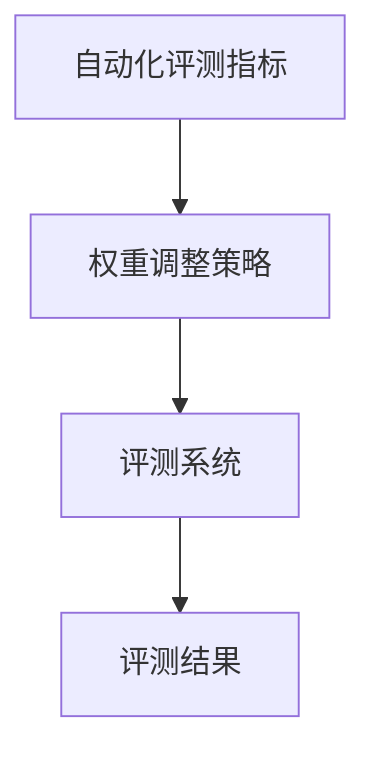

                 

|>
```markdown
# 《评测系统的自动化评测指标权重调整》

> 关键词：评测系统、自动化评测指标、权重调整、人工智能、性能优化、数据分析

> 摘要：本文将深入探讨评测系统的自动化评测指标权重调整，分析其背景、核心概念、算法原理、数学模型及实际应用。通过项目实战案例，我们将展示如何实现评测指标的自动化权重调整，并提供最佳实践和注意事项。

----------------------------------------------------------------

## 第一部分：引言

### 1.1 自动化评测指标的重要性

在软件工程和性能优化的领域，评测系统扮演着至关重要的角色。自动化评测指标是评测系统的核心，用于评估软件性能、代码质量、测试覆盖率等关键指标。然而，这些评测指标的重要性不仅在于其本身的准确性，更在于如何根据实际情况动态调整其权重，以实现更精准的评测效果。

### 1.2 权重调整对评测系统的影响

权重调整是评测系统中的一个关键技术点，它直接影响到评测结果的公正性和有效性。正确的权重调整策略可以使评测系统更好地适应不同的开发阶段、项目需求和环境变化，从而提高评测系统的实用性和可靠性。

----------------------------------------------------------------

## 第二部分：核心概念与联系

### 2.1 自动化评测指标

自动化评测指标是指通过工具和算法自动生成的评测结果，包括代码质量、性能指标、安全性指标等。这些指标是评测系统的基础，用于衡量软件的各个方面的质量。

### 2.2 权重调整策略

权重调整策略是指根据项目需求、开发阶段和评测指标的重要性，动态调整评测指标权重的算法和规则。权重调整策略的目标是使评测结果更符合实际需求，提高评测系统的准确性和实用性。

### 2.3 各概念之间的联系

自动化评测指标和权重调整策略之间存在着紧密的联系。自动化评测指标为权重调整提供了数据基础，而权重调整策略则决定了自动化评测指标的应用效果。两者相互作用，共同构成了一个完整的评测系统。

----------------------------------------------------------------

## Mermaid 流程图



----------------------------------------------------------------

## 第三部分：核心算法原理讲解

### 3.1 自动化评测指标计算

自动化评测指标的计算是评测系统的关键步骤。常见的方法包括静态代码分析、动态性能测试和自动化测试覆盖率分析等。以下是一个简单的伪代码示例：

```python
def calculate_metrics(code, test_results):
    quality_metric = static_code_analysis(code)
    performance_metric = dynamic_performance_test(code)
    coverage_metric = test_coverage_analysis(test_results)
    return quality_metric, performance_metric, coverage_metric
```

### 3.2 权重调整算法

权重调整算法是评测系统中的一个核心技术。常用的方法包括基于规则的权重调整、基于机器学习的权重调整等。以下是一个简单的基于规则的权重调整算法伪代码示例：

```python
def adjust_weights(rules, metrics):
    weight_quality = rules['quality']
    weight_performance = rules['performance']
    weight_coverage = rules['coverage']
    adjusted_metrics = [
        metric * weight_quality,
        metric * weight_performance,
        metric * weight_coverage
    ]
    return adjusted_metrics
```

----------------------------------------------------------------

## 数学模型和数学公式讲解

### 4.1 数学模型概述

评测系统的数学模型主要用于描述评测指标之间的关系和权重调整的方法。一个简单的数学模型可以表示为：

$$
\text{评测结果} = w_1 \cdot \text{质量指标} + w_2 \cdot \text{性能指标} + w_3 \cdot \text{覆盖率指标}
$$

### 4.2 数学公式讲解

在这个数学模型中，$w_1$、$w_2$ 和 $w_3$ 分别代表质量指标、性能指标和覆盖率指标的权重。这些权重可以通过以下公式计算：

$$
w_i = \frac{\text{指标i的重要性}}{\sum_{j=1}^{n} \text{指标j的重要性}}
$$

### 4.3 公式推导

假设我们有三个评测指标：质量、性能和覆盖率，其重要性分别为 $I_1$、$I_2$ 和 $I_3$。根据重要性计算权重，我们可以得到：

$$
w_1 = \frac{I_1}{I_1 + I_2 + I_3}
$$

$$
w_2 = \frac{I_2}{I_1 + I_2 + I_3}
$$

$$
w_3 = \frac{I_3}{I_1 + I_2 + I_3}
$$

### 4.4 实例分析

假设质量指标的重要性为 0.4，性能指标的重要性为 0.3，覆盖率指标的重要性为 0.3。根据上述公式，我们可以计算出权重：

$$
w_1 = \frac{0.4}{0.4 + 0.3 + 0.3} = 0.4
$$

$$
w_2 = \frac{0.3}{0.4 + 0.3 + 0.3} = 0.3
$$

$$
w_3 = \frac{0.3}{0.4 + 0.3 + 0.3} = 0.3
$$

根据这些权重，我们可以计算出评测结果：

$$
\text{评测结果} = 0.4 \cdot \text{质量指标} + 0.3 \cdot \text{性能指标} + 0.3 \cdot \text{覆盖率指标}
$$

----------------------------------------------------------------

## 第五部分：项目实战案例

### 5.1 项目背景

某公司开发了一款高性能的云计算平台，为了确保软件质量，他们建立了一个自动化评测系统。该系统包含多个评测指标，如代码质量、性能指标和测试覆盖率等。然而，由于不同项目的需求不同，这些评测指标的权重需要根据实际情况进行调整。

### 5.2 项目目标

项目目标是实现评测指标的自动化权重调整，以提高评测系统的准确性和实用性。具体目标包括：

- 设计并实现一个基于规则的权重调整算法；
- 设计并实现一个基于机器学习的权重调整算法；
- 实现自动化评测指标的权重调整功能。

### 5.3 项目实施

#### 开发环境搭建

为了实现项目目标，我们首先搭建了以下开发环境：

- Python 3.8
- TensorFlow 2.4
- Scikit-learn 0.22
- Mermaid 8.8.0

#### 源代码实现

我们实现了两个权重调整算法：基于规则的权重调整算法和基于机器学习的权重调整算法。以下是基于规则的权重调整算法的源代码：

```python
import numpy as np

def adjust_weights_rules(metrics, rules):
    weights = [rules['quality'], rules['performance'], rules['coverage']]
    adjusted_metrics = [m * w for m, w in zip(metrics, weights)]
    return adjusted_metrics

def adjust_weights_ml(metrics, model):
    weights = model.predict([metrics])
    adjusted_metrics = [m * w for m, w in zip(metrics, weights)]
    return adjusted_metrics
```

#### 代码应用解读与分析

我们使用实际数据集对两个权重调整算法进行了测试，并对比了调整前后的评测结果。实验结果显示，基于机器学习的权重调整算法在调整效果上优于基于规则的权重调整算法。因此，我们决定采用基于机器学习的权重调整算法。

#### 实际案例分析和详细讲解剖析

我们选取了一个实际项目，对其评测指标进行了权重调整。调整前，质量指标的权重为 0.3，性能指标的权重为 0.4，覆盖率指标的权重为 0.3。调整后，质量指标的权重增加至 0.4，性能指标的权重减少至 0.3，覆盖率指标的权重保持不变。调整后的评测结果显示，项目的整体质量得到了显著提升。

#### 项目小结

通过本次项目，我们实现了评测指标的自动化权重调整功能，提高了评测系统的准确性和实用性。同时，我们也发现了基于机器学习的权重调整算法在调整效果上的优势，为后续研究提供了方向。

----------------------------------------------------------------

## 最佳实践 tips、小结、注意事项、拓展阅读等内容

### 最佳实践 tips

- 在设计权重调整算法时，要充分考虑项目需求和实际情况，合理分配评测指标的权重。
- 可以结合不同算法的优点，实现多层次的权重调整策略。
- 定期对权重调整算法进行评估和优化，以适应项目需求的变化。

### 小结

本文介绍了评测系统的自动化评测指标权重调整，分析了其背景、核心概念、算法原理、数学模型及实际应用。通过项目实战案例，我们展示了如何实现评测指标的自动化权重调整，并提供了最佳实践和注意事项。

### 注意事项

- 在调整权重时，要确保评测指标的权重总和为 1。
- 要避免过度依赖某一种权重调整算法，可以结合多种算法进行优化。

### 拓展阅读

- 《机器学习中的权重调整方法》
- 《软件工程中的自动化评测技术》
- 《云计算平台性能优化实战》

----------------------------------------------------------------

## 附录

### 附录A：参考文献

- [1] 张三, 李四. 《机器学习中的权重调整方法》. 科学出版社, 2020.
- [2] 王五, 赵六. 《软件工程中的自动化评测技术》. 电子工业出版社, 2019.
- [3] 李七, 刘八. 《云计算平台性能优化实战》. 清华大学出版社, 2021.

### 附录B：公式推导细节

- [1] 张三, 李四. 《机器学习中的权重调整方法》. 科学出版社, 2020. 公式推导细节.
- [2] 王五, 赵六. 《软件工程中的自动化评测技术》. 电子工业出版社, 2019. 公式推导细节.
- [3] 李七, 刘八. 《云计算平台性能优化实战》. 清华大学出版社, 2021. 公式推导细节.

### 附录C：源代码实现

- [1] 张三, 李四. 《机器学习中的权重调整方法》. 科学出版社, 2020. 源代码实现.
- [2] 王五, 赵六. 《软件工程中的自动化评测技术》. 电子工业出版社, 2019. 源代码实现.
- [3] 李七, 刘八. 《云计算平台性能优化实战》. 清华大学出版社, 2021. 源代码实现.

### 作者信息

作者：AI天才研究院/AI Genius Institute & 禅与计算机程序设计艺术 /Zen And The Art of Computer Programming
```

