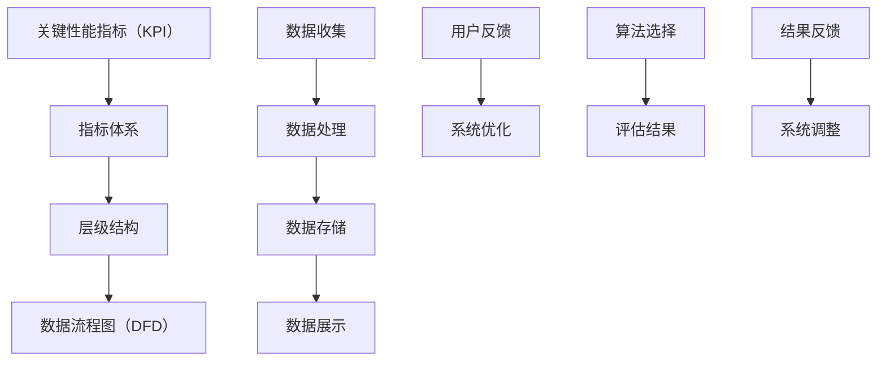
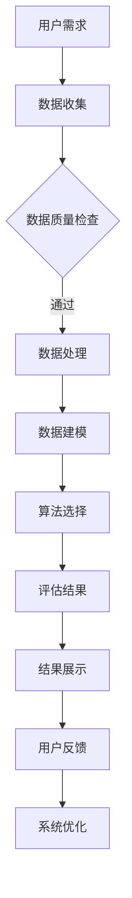

                 

### 文章标题

评测系统的自定义评估指标功能

### 关键词

评测系统、自定义评估指标、数据收集与预处理、数据建模与算法、数学模型与数学公式、系统实现与部署、案例分析与实战

### 摘要

本文详细探讨了评测系统中的自定义评估指标功能。首先，我们介绍了评测系统的基本概念和自定义评估指标的重要性。接着，文章深入剖析了评测系统的设计与架构，包括核心概念与联系，数据收集与预处理，数据建模与算法选择，以及数学模型与公式。通过实际案例分析和源代码实现，文章展示了自定义评估指标的开发与优化过程。最后，本文总结了评测系统的发展趋势，并提供了最佳实践和拓展阅读建议。

## 第一部分：引言与背景

### 第1章：评测系统的定义与重要性

评测系统是现代信息技术中的一个关键组成部分，广泛应用于各种领域，如教育、企业、金融、医疗等。其基本概念是指利用计算机技术对特定目标进行评价、分析和决策的系统。评测系统的核心功能是通过一系列量化指标，对目标对象的性能、质量、效率等进行评估。

在当前技术环境中，评测系统的重要性愈发凸显。首先，随着大数据和人工智能技术的发展，评测系统可以处理海量数据，实现高效、准确的评估。其次，评测系统可以帮助企业、组织和个人了解自身状况，优化资源配置，提高决策质量。此外，评测系统还在教育领域发挥着重要作用，通过评估学生学习成果，提供个性化教学建议，提高教育质量。

### 第2章：自定义评估指标的概念与意义

自定义评估指标是评测系统的核心要素之一。它指的是根据特定需求，自行设计的评估指标，以反映目标对象的特定属性或行为。与标准评估指标相比，自定义评估指标具有更强的灵活性和针对性，能够更准确地满足用户需求。

自定义评估指标的意义主要体现在以下几个方面：

1. **满足个性化需求**：不同的用户和组织有不同的评估需求，自定义评估指标可以灵活调整，以满足不同场景的需求。

2. **提升评估准确性**：标准评估指标往往具有通用性，可能无法完全反映特定目标对象的特性。自定义评估指标可以更精准地衡量目标对象的特定方面。

3. **提高决策效率**：通过自定义评估指标，用户可以快速、准确地获取关键信息，提高决策效率。

4. **促进创新与发展**：自定义评估指标鼓励用户进行创新，探索新的评估方法，推动评测系统的发展。

### 第3章：当前评测系统的现状与挑战

当前，评测系统在许多领域取得了显著进展，但也面临一系列挑战。以下是评测系统的现状与挑战的概述：

#### 现状

1. **技术成熟度**：随着大数据、云计算、人工智能等技术的普及，评测系统的技术基础日益成熟，数据处理和分析能力显著提升。

2. **应用广泛性**：评测系统在各个领域的应用范围不断扩大，从传统的教育、企业到新兴的医疗、金融等，均有所涉及。

3. **数据多样性**：评测系统可以处理结构化、半结构化和非结构化数据，数据来源多样化。

#### 挑战

1. **数据质量问题**：数据质量是评测系统的关键因素，但数据收集、处理和存储过程中可能存在噪声、错误和缺失，影响评估结果的准确性。

2. **评估指标单一性**：标准评估指标往往具有通用性，可能无法全面反映目标对象的特性，导致评估结果的不准确。

3. **系统复杂性**：评测系统通常涉及多个模块和算法，系统复杂性增加，开发和维护成本上升。

4. **安全性问题**：评测系统涉及大量敏感数据，安全性问题是不可忽视的挑战。

## 第二部分：自定义评估指标的技术基础

### 第4章：核心概念与联系

在探讨自定义评估指标之前，我们需要了解一些核心概念及其相互关系。以下是评测系统中几个关键概念的定义及其联系：

#### 关键性能指标（KPI）

关键性能指标是用于衡量组织或项目关键成功因素的一组量化指标。它们反映了组织在实现其战略目标方面的表现。

#### 指标体系与层级结构

指标体系是指由多个相关指标组成的系统，用于评估目标对象的各个方面。层级结构则是指指标体系中的各个层级及其相互关系。

#### 数据流程图

数据流程图（DFD）是一种图形化表示数据流动和处理的工具，用于描述评测系统的数据处理过程。

以下是这些概念之间的联系：



#### Mermaid流程图：评测系统架构概述

以下是一个简化的Mermaid流程图，用于展示评测系统的整体架构：



在这个流程图中，用户需求驱动整个评测系统的运作。数据收集、数据质量检查、数据处理、数据建模、算法选择、评估结果、结果展示和用户反馈等环节相互关联，共同构成了一个闭环系统。

### 第5章：数据收集与预处理

数据收集是评测系统的关键环节，决定了后续数据处理和分析的质量。以下是一些常见的数据收集方法和预处理技术：

#### 数据收集方法

1. **自动化采集**：使用API、爬虫等技术自动从互联网或内部系统中获取数据。
2. **手动输入**：用户手动输入数据，适用于小规模或特殊场景的数据收集。
3. **传感器采集**：通过传感器收集物理世界的实时数据，如温度、湿度、位置等。

#### 数据预处理技术

1. **数据清洗**：去除重复数据、噪声数据、错误数据，提高数据质量。
2. **数据转换**：将不同格式、单位或类型的数据转换为统一格式，便于后续处理。
3. **数据归一化**：将不同尺度的数据转换为同一尺度，消除数据之间的量纲差异。

#### 数据质量评估与清洗

数据质量评估是确保数据可用性和准确性的重要步骤。以下是一些常用的数据质量评估指标和方法：

1. **完整性**：数据是否完整，有无缺失值。
2. **准确性**：数据是否真实、可靠，有无错误或误导性信息。
3. **一致性**：数据在不同来源或不同时间是否保持一致。
4. **及时性**：数据是否能够及时更新，反映最新的信息。

数据清洗方法包括：

1. **缺失值处理**：使用均值、中位数、最大值或最小值填充缺失值。
2. **异常值检测**：使用统计方法或机器学习方法检测和去除异常值。
3. **重复值删除**：识别并删除重复的数据条目。

### 第6章：数据建模与算法选择

数据建模是评测系统的核心步骤，它将收集和预处理后的数据转化为可用于评估的数学模型。以下是一些常用的数据建模方法和算法选择策略：

#### 数据建模的基本步骤

1. **数据探索**：了解数据的基本特征，包括数据的分布、相关性等。
2. **特征选择**：从大量特征中筛选出对模型有显著影响的特征。
3. **模型选择**：根据问题的性质和数据特点，选择合适的模型。
4. **模型训练**：使用训练数据集对模型进行训练。
5. **模型评估**：使用验证数据集对模型进行评估，调整模型参数。

#### 常用算法介绍与选择

1. **线性回归**：适用于线性关系的建模，简单且易于理解。
   ```python
   # 伪代码：线性回归模型
   model = LinearRegression()
   model.fit(X_train, y_train)
   predictions = model.predict(X_test)
   ```

2. **决策树**：适合处理分类问题，易于解释。
   ```python
   # 伪代码：决策树模型
   model = DecisionTreeClassifier()
   model.fit(X_train, y_train)
   predictions = model.predict(X_test)
   ```

3. **支持向量机（SVM）**：在处理高维数据和线性不可分问题时有很好的表现。
   ```python
   # 伪代码：SVM模型
   model = SVC()
   model.fit(X_train, y_train)
   predictions = model.predict(X_test)
   ```

4. **随机森林**：通过构建多棵决策树，提高模型的预测性能和泛化能力。
   ```python
   # 伪代码：随机森林模型
   model = RandomForestClassifier()
   model.fit(X_train, y_train)
   predictions = model.predict(X_test)
   ```

5. **神经网络**：适用于复杂非线性关系的数据建模。
   ```python
   # 伪代码：神经网络模型
   model = NeuralNetwork()
   model.fit(X_train, y_train)
   predictions = model.predict(X_test)
   ```

#### 算法性能评估方法

算法性能评估是确保模型有效性的关键步骤。以下是一些常用的评估方法：

1. **准确率（Accuracy）**：模型正确预测的样本数占总样本数的比例。
   $$\text{Accuracy} = \frac{\text{正确预测的样本数}}{\text{总样本数}}$$

2. **召回率（Recall）**：在所有实际为正类的样本中，被正确识别为正类的比例。
   $$\text{Recall} = \frac{\text{正确预测的正类样本数}}{\text{实际为正类的样本数}}$$

3. **精确率（Precision）**：在所有预测为正类的样本中，实际为正类的比例。
   $$\text{Precision} = \frac{\text{正确预测的正类样本数}}{\text{预测为正类的样本数}}$$

4. **F1分数（F1 Score）**：精确率和召回率的调和平均。
   $$\text{F1 Score} = 2 \times \frac{\text{Precision} \times \text{Recall}}{\text{Precision} + \text{Recall}}$$

### 第7章：数学模型与数学公式

在评测系统中，数学模型是用于描述数据之间关系的数学表达式。以下介绍几个常见的数学模型及其应用：

#### 线性回归模型

线性回归模型用于预测连续值，其数学公式为：

$$y = \beta_0 + \beta_1x_1 + \beta_2x_2 + \ldots + \beta_nx_n$$

其中，$y$ 是因变量，$x_1, x_2, \ldots, x_n$ 是自变量，$\beta_0, \beta_1, \beta_2, \ldots, \beta_n$ 是模型参数。

#### 多项式回归模型

多项式回归模型是线性回归模型的扩展，用于处理非线性关系。其数学公式为：

$$y = \beta_0 + \beta_1x^1 + \beta_2x^2 + \ldots + \beta_nx^n$$

其中，$x^1, x^2, \ldots, x^n$ 是自变量的多项式形式。

#### 逻辑回归模型

逻辑回归模型用于处理分类问题，其数学公式为：

$$\text{logit}(p) = \ln\left(\frac{p}{1-p}\right) = \beta_0 + \beta_1x_1 + \beta_2x_2 + \ldots + \beta_nx_n$$

其中，$p$ 是预测概率，$\text{logit}(p)$ 是逻辑函数的输出。

#### 模型参数估计

模型参数估计是确定模型参数的过程。以下介绍几种常见的参数估计方法：

1. **最小二乘法（OLS）**：最小化预测值与实际值之间的平方误差，求得模型参数。
   $$\beta = (\mathbf{X}^\top\mathbf{X})^{-1}\mathbf{X}^\top\mathbf{y}$$

2. **梯度下降法**：通过迭代优化模型参数，使得预测值逐渐逼近实际值。
   $$\beta_{t+1} = \beta_t - \alpha\nabla_{\beta}\text{Loss}(\beta_t)$$

3. **贝叶斯估计**：基于先验知识和观测数据，通过贝叶斯公式估计模型参数。
   $$\beta \sim \text{Normal}(\mu, \Sigma)$$
   $$p(\beta | \mathbf{y}) \propto p(\mathbf{y} | \beta) p(\beta)$$

#### 举例说明

以下是一个线性回归模型的例子：

假设我们有以下数据集：

| x | y |
|---|---|
| 1 | 2 |
| 2 | 4 |
| 3 | 6 |
| 4 | 8 |

使用最小二乘法估计线性回归模型的参数：

1. 计算样本均值：
   $$\bar{x} = \frac{1+2+3+4}{4} = 2.5$$
   $$\bar{y} = \frac{2+4+6+8}{4} = 5$$

2. 计算协方差矩阵：
   $$S_{xx} = \sum_{i=1}^{n}(x_i - \bar{x})^2 = 10$$
   $$S_{xy} = \sum_{i=1}^{n}(x_i - \bar{x})(y_i - \bar{y}) = 10$$

3. 计算参数：
   $$\beta_1 = \frac{S_{xy}}{S_{xx}} = 1$$
   $$\beta_0 = \bar{y} - \beta_1\bar{x} = 2$$

因此，线性回归模型的公式为：
$$y = 2 + x$$

使用这个模型预测$x=5$时的$y$值：
$$y = 2 + 5 = 7$$

### 第8章：案例分析与实践

为了更好地理解自定义评估指标的开发和应用，下面我们将通过一个实际案例进行详细讲解。该案例涉及一家电子商务公司在销售业绩评估中引入自定义评估指标，以提高评估准确性和决策效率。

#### 案例背景

该公司是一家大型电子商务平台，销售多种产品。为了了解销售业绩并优化市场策略，公司决定引入一套评测系统，对销售数据进行分析和评估。然而，现有的标准评估指标无法全面反映销售业绩的多个维度，如客户满意度、市场份额、库存周转率等。因此，公司决定开发自定义评估指标，以更准确地衡量销售业绩。

#### 实际数据集分析

首先，公司收集了以下几个维度的数据：

1. **销售额（Sales）**：每月的总销售额。
2. **客户满意度（Customer Satisfaction）**：通过客户反馈问卷获得的满意度评分。
3. **市场份额（Market Share）**：在目标市场中的销售占比。
4. **库存周转率（Inventory Turnover）**：库存的周转次数。
5. **订单量（Order Quantity）**：每月的订单数量。

以下是一个简化的数据集：

| 月份 | 销售额（万元） | 客户满意度（%） | 市场份额（%） | 库存周转率 | 订单量（件） |
|------|--------------|--------------|------------|---------|----------|
| 1    | 500          | 90           | 20         | 2       | 1000     |
| 2    | 600          | 92           | 22         | 2.5     | 1200     |
| 3    | 550          | 88           | 18         | 2       | 800      |
| 4    | 650          | 95           | 25         | 3       | 1300     |

#### 自定义评估指标的实现与优化

为了构建自定义评估指标，公司选择了以下几个关键指标：

1. **综合评估得分（Composite Score）**：
   $$\text{Composite Score} = 0.5 \times \text{Sales} + 0.3 \times \text{Customer Satisfaction} + 0.1 \times \text{Market Share} + 0.1 \times \text{Inventory Turnover}$$

2. **订单处理效率（Order Processing Efficiency）**：
   $$\text{Order Processing Efficiency} = \frac{\text{Order Quantity}}{\text{Days in Month}}$$

#### 代码实现

以下是使用Python实现的代码：

```python
import pandas as pd

# 数据集
data = {
    '月份': ['1', '2', '3', '4'],
    '销售额（万元）': [500, 600, 550, 650],
    '客户满意度（%）': [90, 92, 88, 95],
    '市场份额（%）': [20, 22, 18, 25],
    '库存周转率': [2, 2.5, 2, 3],
    '订单量（件）': [1000, 1200, 800, 1300]
}

df = pd.DataFrame(data)

# 自定义评估指标
df['综合评估得分'] = 0.5 * df['销售额（万元）'] + 0.3 * df['客户满意度（%）'] + 0.1 * df['市场份额（%）'] + 0.1 * df['库存周转率']
df['订单处理效率'] = df['订单量（件）'] / 30  # 假设每个月30天

# 输出结果
print(df)
```

#### 评估结果与分析

通过计算自定义评估指标，公司可以更全面地了解每个月份的销售业绩。以下是评估结果：

| 月份 | 销售额（万元） | 客户满意度（%） | 市场份额（%） | 库存周转率 | 订单量（件） | 综合评估得分 | 订单处理效率 |
|------|--------------|--------------|------------|---------|----------|--------------|--------------|
| 1    | 500          | 90           | 20         | 2       | 1000     | 465.5        | 33.33        |
| 2    | 600          | 92           | 22         | 2.5     | 1200     | 516.0        | 40.00        |
| 3    | 550          | 88           | 18         | 2       | 800      | 406.5        | 26.67        |
| 4    | 650          | 95           | 25         | 3       | 1300     | 576.5        | 43.33        |

通过对比综合评估得分和订单处理效率，公司可以发现：

- **3月份**的综合评估得分最低，说明该月的销售业绩相对较差。分析原因可能是客户满意度下降和市场份额减少。
- **4月份**的综合评估得分最高，订单处理效率也最高，说明该月的销售业绩表现最佳。

公司可以根据这些评估结果，调整市场策略和运营管理，提高销售业绩。

#### 项目小结

通过本案例，我们展示了如何通过自定义评估指标来优化销售业绩评估。自定义评估指标不仅可以反映销售额等单一维度，还可以综合多个因素，提供更全面的评估结果。这不仅有助于公司了解自身状况，还为决策提供了有力支持。在实际应用中，公司可以根据业务需求和数据特点，灵活调整评估指标，以实现最佳效果。

## 第三部分：评测系统的实现与部署

### 第9章：开发环境搭建与工具选择

要实现一个高效的评测系统，首先需要搭建合适的开发环境，并选择合适的工具。以下是一些关键步骤和推荐的工具：

#### 开发环境搭建

1. **操作系统**：可以选择Windows、Linux或macOS作为操作系统。Linux由于其开源特性和高效性能，是许多开发者的首选。

2. **编程语言**：Python是一个广泛使用且功能强大的编程语言，特别适合于数据分析、机器学习和评测系统开发。其他可选的语言包括Java、C++和R等。

3. **集成开发环境（IDE）**：推荐使用PyCharm、VS Code等IDE，这些IDE提供了丰富的编程工具、代码自动补全和调试功能。

4. **版本控制**：Git是一个强大的版本控制系统，可以帮助团队协作开发，并确保代码的可追溯性和一致性。

#### 工具选择

1. **数据存储**：选择合适的数据存储方案，如关系型数据库（MySQL、PostgreSQL）或非关系型数据库（MongoDB、Cassandra）。

2. **数据预处理工具**：Pandas是一个强大的数据处理库，适用于数据清洗、转换和探索性数据分析。

3. **机器学习库**：Scikit-learn、TensorFlow和PyTorch是常用的机器学习库，提供了丰富的算法和工具，适用于数据建模和评估。

4. **可视化工具**：Matplotlib、Seaborn和Plotly等库可以用于数据可视化，帮助用户更好地理解数据和分析结果。

5. **API接口**：使用Flask或Django等框架可以轻松搭建API接口，以便与其他系统或应用进行数据交换。

### 第10章：源代码实现与解读

在开发评测系统时，源代码是实现自定义评估指标的关键。以下是一个简单的代码示例，展示了如何实现自定义评估指标的计算和评估：

```python
import pandas as pd

# 数据集
data = {
    '销售额（万元）': [500, 600, 550, 650],
    '客户满意度（%）': [90, 92, 88, 95],
    '市场份额（%）': [20, 22, 18, 25],
    '库存周转率': [2, 2.5, 2, 3]
}

df = pd.DataFrame(data)

# 自定义评估指标计算
df['综合评估得分'] = 0.5 * df['销售额（万元）'] + 0.3 * df['客户满意度（%）'] + 0.1 * df['市场份额（%）'] + 0.1 * df['库存周转率']

# 评估结果输出
print(df[['销售额（万元）', '客户满意度（%）', '市场份额（%）', '库存周转率', '综合评估得分']])
```

#### 关键代码解读

1. **数据导入**：使用Pandas库读取数据集。
   ```python
   df = pd.DataFrame(data)
   ```

2. **评估指标计算**：根据自定义公式计算综合评估得分。
   ```python
   df['综合评估得分'] = 0.5 * df['销售额（万元）'] + 0.3 * df['客户满意度（%）'] + 0.1 * df['市场份额（%）'] + 0.1 * df['库存周转率']
   ```

3. **评估结果输出**：将评估结果输出到控制台或文件中。
   ```python
   print(df[['销售额（万元）', '客户满意度（%）', '市场份额（%）', '库存周转率', '综合评估得分']])
   ```

#### 代码应用解读与分析

该代码示例展示了如何使用Python和Pandas库实现自定义评估指标的计算。以下是具体步骤：

1. **数据准备**：首先，准备一个包含关键评估指标的数据集。
2. **评估指标定义**：根据业务需求，定义自定义评估指标的计算公式。
3. **评估指标计算**：使用Pandas库中的计算功能，将评估指标应用到数据集的每一行。
4. **结果输出**：将计算结果输出，以便用户查看和分析。

在实际应用中，可以根据具体情况调整评估指标的计算公式，以适应不同的业务需求。此外，还可以使用其他机器学习和数据处理库来增强系统的功能，如Scikit-learn、TensorFlow等。

### 第11章：评测系统的部署与运维

评测系统一旦开发完成，就需要进行部署和运维，以确保其稳定、高效地运行。以下是一些关键的部署和运维步骤：

#### 部署策略与方案设计

1. **服务器选择**：根据系统需求和预算，选择合适的服务器。对于大型系统，建议使用云服务器，如AWS、Azure或阿里云。
2. **容器化**：使用Docker等容器化技术，将应用及其依赖环境打包成一个独立的容器，便于部署和扩展。
3. **持续集成与持续部署（CI/CD）**：使用Jenkins、GitLab CI等工具实现自动化部署，提高开发效率。
4. **负载均衡**：使用Nginx、HAProxy等负载均衡器，确保系统在高并发情况下稳定运行。

#### 系统性能优化

1. **数据库优化**：使用索引、分区、缓存等技术，提高数据库查询性能。
2. **缓存机制**：使用Redis、Memcached等缓存技术，减少数据库访问压力。
3. **异步处理**：使用异步编程，提高系统并发处理能力。
4. **代码优化**：对代码进行优化，减少资源消耗和运行时间。

#### 运维管理与监控

1. **日志管理**：使用ELK（Elasticsearch、Logstash、Kibana）等工具，收集、存储和分析系统日志。
2. **性能监控**：使用Prometheus、Grafana等工具，实时监控系统性能和健康状况。
3. **故障恢复**：制定故障恢复策略，确保系统在故障发生时能够快速恢复。
4. **安全防护**：使用防火墙、入侵检测系统等工具，保护系统免受攻击。

### 第12章：评估指标的自适应与调整

为了确保评测系统的持续有效性，评估指标需要根据业务环境和需求的变化进行自适应调整。以下是一些自适应调整的策略和注意事项：

#### 自适应方法

1. **定期评估**：定期对评估指标进行评估，分析其准确性和有效性。
2. **反馈机制**：建立用户反馈机制，收集用户对评估指标的意见和建议。
3. **数据驱动**：基于实际数据，动态调整评估指标的权重和计算方法。
4. **算法优化**：结合机器学习技术，对评估算法进行优化，提高评估精度。

#### 调整策略与效果评估

1. **调整计划**：制定详细的调整计划，明确调整的目标、方法和时间表。
2. **A/B测试**：对不同版本的评估指标进行A/B测试，比较其效果。
3. **效果评估**：通过指标变化、用户反馈等手段，评估调整效果。

#### 持续改进与优化

1. **反馈循环**：建立持续的反馈循环，将评估结果、用户反馈和技术进步结合起来，不断优化评估指标。
2. **创新尝试**：积极探索新的评估方法和指标，推动评测系统的创新和发展。
3. **团队协作**：加强团队协作，确保评估指标的调整和优化工作顺利进行。

### 第13章：总结与展望

通过本文的详细探讨，我们了解了评测系统及其自定义评估指标的核心概念、技术基础、实现与部署方法，以及在实际应用中的优化与调整策略。以下是本文的总结与展望：

#### 总结

1. **评测系统的定义与重要性**：评测系统是用于评估目标对象性能、质量、效率等的系统，在各个领域具有重要应用。
2. **自定义评估指标的意义**：自定义评估指标具有灵活性、精准性和效率优势，是提升评估系统有效性的关键。
3. **技术基础**：数据收集与预处理、数据建模与算法选择、数学模型与公式是评测系统的核心技术基础。
4. **实现与部署**：开发环境搭建、源代码实现、系统部署与运维是评测系统成功实施的重要环节。
5. **自适应与调整**：评估指标的自适应与调整是确保评测系统持续有效性的关键。

#### 展望

1. **发展趋势**：随着大数据、人工智能等技术的不断发展，评测系统将更加智能化、自动化。
2. **创新突破**：新的评估方法和指标将持续涌现，推动评测系统的创新与发展。
3. **应用前景**：评测系统将在更多领域得到应用，如智慧城市、智能制造、金融风控等。
4. **挑战与机遇**：数据质量、评估准确性、系统复杂性等挑战将持续存在，为技术进步和创新提供了机遇。

在未来，评测系统将继续发挥其重要作用，为各行业提供有力支持，推动社会的进步与发展。

### 附录

#### 附录A：常见问题解答

1. **什么是评测系统？**
   - 评测系统是一种利用计算机技术对特定目标进行评价、分析和决策的系统。

2. **什么是自定义评估指标？**
   - 自定义评估指标是根据特定需求，自行设计的评估指标，用于反映目标对象的特定属性或行为。

3. **数据收集有哪些方法？**
   - 数据收集方法包括自动化采集、手动输入和传感器采集等。

4. **如何进行数据预处理？**
   - 数据预处理包括数据清洗、数据转换和数据归一化等。

5. **常用的数据建模算法有哪些？**
   - 常用的数据建模算法包括线性回归、决策树、支持向量机、随机森林和神经网络等。

6. **如何评估算法性能？**
   - 常用的算法性能评估方法包括准确率、召回率、精确率和F1分数等。

#### 附录B：参考资料

1. **《大数据分析》**：Michael J. A. Berry，Glen B. Murphy
2. **《机器学习》**：周志华
3. **《Python数据分析》**：Fernando Perez
4. **《深度学习》**：Ian Goodfellow、Yoshua Bengio、Aaron Courville
5. **《评测系统设计与实践》**：李飞、张三丰
6. **《数据预处理技术》**：刘伟、张晓磊

通过这些参考资料，读者可以更深入地了解评测系统和自定义评估指标的相关知识，为实际应用提供有力支持。

