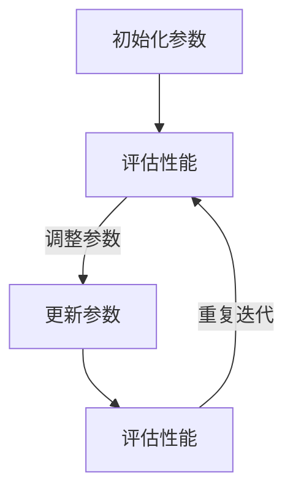
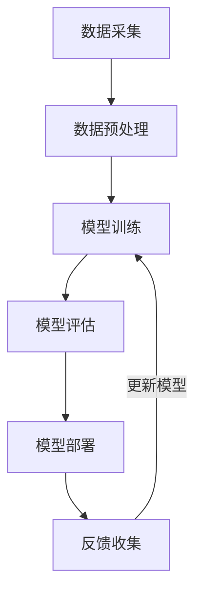

                 

### 文章标题

《评测系统的自我优化与学习能力》

### 关键词

- 评测系统
- 自我优化
- 学习能力
- 进化算法
- 机器学习
- 强化学习
- 数学模型
- 项目实战### 摘要

本文将深入探讨评测系统的自我优化与学习能力，旨在为IT专业人士提供全面的指导。首先，我们将介绍评测系统的重要性及其基本概念，包括其定义、功能和架构。接着，我们会详细讲解自我优化原理与方法，以及学习能力的概念和技术方法。通过Mermaid流程图，我们将清晰地展示自我优化与学习能力的架构和流程。随后，我们将分别讲解自我优化算法和学习能力算法的原理，包括进化算法、机器学习算法和强化学习算法。我们将使用伪代码和数学公式详细阐述这些算法，并提供实际项目实战的案例分析。最后，我们将总结全文，展望未来评测系统的发展方向，并提供相关资源和最佳实践建议。通过本文，读者将能够全面了解评测系统的自我优化与学习能力，为实际应用提供有力支持。### 书籍《评测系统的自我优化与学习能力》目录大纲

## 引言

### 1.1 评测系统的重要性

评测系统在现代IT行业中扮演着至关重要的角色。它们不仅能够评估软件的质量和性能，还能通过反馈和优化过程提升系统的整体效能。首先，评测系统能够帮助开发团队及时发现和修复缺陷，确保软件的稳定性和可靠性。其次，它们提供了量化评估指标，使团队能够基于数据做出明智的决策。此外，评测系统还能够促进持续集成和持续交付（CI/CD）的实践，提高开发效率。本文将探讨评测系统的自我优化和学习能力，以进一步发挥其在现代软件开发中的潜力。

### 1.2 自我优化与学习能力的概念

自我优化是指系统在运行过程中自动调整其参数和策略，以实现更高效、更稳定和更可靠的性能。这种能力使系统能够适应不断变化的环境和需求，无需人为干预。学习能力则是指系统通过学习历史数据和模式，不断改进其决策和表现的能力。自我优化与学习能力相结合，能够使评测系统更加智能和高效，从而在复杂和动态的软件环境中发挥更大作用。

### 1.3 本书目的与结构

本书旨在为读者提供关于评测系统自我优化与学习能力的基础知识、技术原理和实践方法。全书分为十个章节，首先介绍评测系统的基本概念，然后深入探讨自我优化和学习能力的基本原理，接着通过Mermaid流程图展示核心流程，详细讲解相关算法和数学模型，并通过实际项目实战展示应用效果。最后，本书将总结主要内容，展望未来发展方向，并提供相关资源和最佳实践建议。

## 第2章 评测系统的基本概念

### 2.1 评测系统的定义

评测系统是一套旨在评估软件质量、性能和可靠性的工具和方法。它通常由多个组件组成，包括测试用例管理、测试执行、结果分析和报告生成等。评测系统的目的是通过自动化和半自动化手段，实现对软件的全面评估，从而确保其满足既定的质量标准和用户需求。

### 2.2 评测系统的功能

评测系统的主要功能包括：

1. **测试用例管理**：管理测试用例的创建、执行和结果记录，确保测试覆盖全面和有效。
2. **测试执行**：自动或手动执行测试用例，验证软件的功能和性能。
3. **结果分析**：对测试结果进行分析和报告，识别问题和缺陷。
4. **报告生成**：生成详细的测试报告，为团队提供决策依据。

### 2.3 评测系统的架构

评测系统的架构通常包括以下几个关键部分：

1. **测试用例库**：存储和管理测试用例的数据库。
2. **测试执行引擎**：负责执行测试用例，包括自动化测试和手动测试。
3. **结果分析模块**：对测试结果进行统计分析，提供可视化报告。
4. **报告生成器**：根据分析结果生成详细的测试报告。

通过这些组件的协同工作，评测系统能够有效地评估软件的质量和性能，帮助开发团队识别和修复问题，提升软件的可靠性和用户体验。

### 第3章 自我优化原理与方法

#### 3.1 自我优化的基础概念

自我优化是指系统在运行过程中自动调整其参数和策略，以实现更高效、更稳定和更可靠的性能。这种能力使系统能够适应不断变化的环境和需求，无需人为干预。自我优化的基础概念包括：

1. **目标函数**：定义系统要优化的目标，如性能、效率和成本等。
2. **参数调整**：通过调整系统的参数来优化性能，如调整算法的阈值、学习率等。
3. **评估指标**：用于衡量系统性能的指标，如准确率、响应时间等。

#### 3.2 自我优化的算法

自我优化的算法可以分为以下几类：

1. **进化算法**：基于自然选择和遗传学的优化算法，通过选择、交叉和变异操作来优化参数。
    - **选择策略**：根据个体的适应度选择优良个体。
    - **交叉策略**：将优良个体的基因进行组合，产生新的个体。
    - **变异策略**：对个体的基因进行随机改变，引入新的变异。

2. **机器学习算法**：通过学习历史数据来优化参数，如梯度下降算法、随机梯度下降算法和Adam算法等。

3. **强化学习算法**：通过与环境的交互来学习最优策略，如Q-learning算法和深度Q网络（DQN）等。

这些算法各有优缺点，适用于不同的优化场景。选择合适的算法和策略，可以显著提升系统的自我优化能力。

#### 3.3 自我优化的实现步骤

自我优化的实现步骤通常包括：

1. **初始化参数**：设定初始参数值。
2. **评估性能**：根据目标函数和评估指标评估系统的性能。
3. **参数调整**：根据评估结果调整参数。
4. **迭代优化**：重复评估和调整过程，直到性能达到预期目标。

通过这些步骤，系统可以逐步优化其参数和策略，实现自我优化。

#### 3.4 自我优化的挑战与解决方案

自我优化面临以下挑战：

1. **局部最优**：算法可能陷入局部最优，无法找到全局最优解。
2. **计算成本**：优化过程可能需要大量的计算资源。

针对这些挑战，可以采用以下解决方案：

1. **多目标优化**：同时考虑多个目标函数，避免陷入局部最优。
2. **分布式计算**：利用分布式计算资源，降低计算成本。

通过解决这些挑战，自我优化能力将得到进一步提升，为系统的稳定运行和性能优化提供有力支持。### 第4章 学习能力原理与应用

#### 4.1 学习能力的基础概念

学习能力是指系统能够通过学习历史数据和模式，不断改进其决策和表现的能力。学习能力的基础概念包括：

1. **数据采集**：从环境中采集数据，作为学习的输入。
2. **数据预处理**：清洗、转换和归一化数据，使其适合模型学习。
3. **模型训练**：使用训练数据对模型进行训练，优化模型参数。
4. **模型评估**：评估模型的性能，确保其能够准确预测和决策。
5. **模型部署**：将训练好的模型部署到实际应用中，实现自动化的学习与优化。

#### 4.2 学习能力的技术方法

学习能力的技术方法可以分为以下几种：

1. **基于知识的自主学习**：通过建立知识库，利用推理机实现对数据的自动分析和决策。
    - **知识表示**：将知识以符号形式表示，如规则、事实和关系等。
    - **知识获取**：从数据中提取有用知识，丰富知识库。
    - **知识更新**：根据新数据对知识库进行更新，保持知识的时效性和准确性。

2. **基于数据的自主学习**：利用机器学习算法，从大量数据中提取特征和模式，实现自动化的学习和优化。
    - **数据预处理**：对原始数据进行清洗、转换和归一化，提高模型训练效果。
    - **特征选择**：从大量特征中筛选出关键特征，降低模型复杂度。
    - **模型训练**：使用训练数据训练模型，优化模型参数。

3. **基于模型的自主学习**：利用深度学习和强化学习等方法，实现对复杂环境的自主学习和适应。
    - **深度学习**：通过多层神经网络，从大量数据中提取深层特征和模式。
    - **强化学习**：通过与环境的交互，学习最优策略，实现自主决策。

这些技术方法各有优缺点，适用于不同的学习场景。选择合适的方法，可以显著提升系统的学习能力。

#### 4.3 学习能力在实际应用中的案例

学习能力在实际应用中具有广泛的应用场景，如以下案例：

1. **智能推荐系统**：通过分析用户历史行为和兴趣，实现个性化推荐，提高用户满意度和转化率。
2. **自动驾驶系统**：通过学习和模拟驾驶数据，实现自主驾驶，提高安全性和效率。
3. **智能客服系统**：通过学习用户提问和回答，实现自动问答，提高服务质量和响应速度。

通过这些案例，我们可以看到学习能力在提升系统性能和用户体验方面的巨大潜力。

#### 4.4 学习能力的挑战与解决方案

学习能力面临以下挑战：

1. **数据质量和数量**：高质量、大规模的数据是实现学习能力的关键，但获取和处理这些数据可能具有挑战性。
2. **模型泛化能力**：模型需要在新的、未见过的情况下保持良好的性能，但过拟合和欠拟合等问题会影响模型的泛化能力。

针对这些挑战，可以采用以下解决方案：

1. **数据增强**：通过生成或扩展数据，提高数据质量和数量。
2. **模型正则化**：采用正则化技术，防止模型过拟合。
3. **迁移学习**：利用已有模型的知识和经验，提升新模型的性能。

通过解决这些挑战，学习能力的应用范围将进一步扩大，为系统的智能化和自动化提供有力支持。### 第5章 自我优化与学习能力的Mermaid流程图

#### 5.1 自我优化流程图



该流程图展示了自我优化过程中的基本步骤。首先初始化参数，然后评估性能，根据评估结果调整参数，再次评估性能，重复迭代直到达到预期目标。

#### 5.2 学习能力流程图



该流程图展示了学习能力的完整过程，从数据采集、预处理、模型训练、评估、部署，到反馈收集和模型更新，形成闭环，实现持续学习和优化。### 第6章 自我优化算法原理讲解

#### 6.1 进化算法原理

进化算法是一种基于自然选择和遗传学的优化算法，它通过模拟生物进化的过程，不断迭代改进参数，以实现优化目标。进化算法的基本原理包括：

1. **选择策略**：根据个体的适应度选择优良个体。常用的选择策略有轮盘赌选择、锦标赛选择等。
    - **轮盘赌选择**：每个个体根据其适应度按比例分配到轮盘中，随机选择个体。
    - **锦标赛选择**：从群体中随机选择多个个体，比较适应度，选择最优个体。

2. **交叉策略**：将优良个体的基因进行组合，产生新的个体。常用的交叉策略有单点交叉、多点交叉等。
    - **单点交叉**：在个体的基因序列中随机选择一个交叉点，将交叉点后的基因进行交换。
    - **多点交叉**：在个体的基因序列中随机选择多个交叉点，将交叉点间的基因进行交换。

3. **变异策略**：对个体的基因进行随机改变，引入新的变异。常用的变异策略有基因变异、位变异等。
    - **基因变异**：随机选择个体的一个或多个基因，进行变异。
    - **位变异**：随机选择个体的一个或多个位，改变其值。

进化算法的核心步骤包括初始化种群、评估适应度、选择、交叉和变异等。通过迭代这些步骤，进化算法能够逐步优化参数，找到最优解。

#### 6.2 机器学习算法原理

机器学习算法是一种通过学习数据中的模式和规律，实现对未知数据进行预测或分类的方法。常见的机器学习算法包括：

1. **梯度下降算法**：通过迭代更新参数，使损失函数最小化。
    - **损失函数**：用于衡量预测结果与真实结果之间的差异。
    - **梯度**：损失函数关于参数的导数，指示参数更新方向。

2. **随机梯度下降算法**：在梯度下降算法的基础上，每次迭代使用一个或多个样本的梯度进行参数更新。
    - **优点**：计算速度快，适用于大规模数据。
    - **缺点**：可能陷入局部最优。

3. **Adam算法**：结合了梯度下降和随机梯度下降的优点，通过自适应调整学习率。
    - **优点**：收敛速度快，适用于非线性问题。
    - **缺点**：计算复杂度较高。

这些算法的基本原理是迭代更新参数，使其逐渐逼近最优解。通过调整学习率、批量大小等超参数，可以优化算法的性能。

#### 6.3 强化学习算法原理

强化学习算法是一种通过与环境的交互，学习最优策略的方法。其基本原理包括：

1. **状态**：系统当前所处的环境状态。
2. **动作**：系统可执行的行为。
3. **奖励**：执行动作后系统获得的奖励信号，用于评估动作的好坏。
4. **策略**：系统根据当前状态选择动作的方法。

强化学习算法的核心是策略迭代，包括以下步骤：

1. **初始化策略**：随机选择初始策略。
2. **执行动作**：根据策略选择动作。
3. **获取奖励**：执行动作后，获取奖励信号。
4. **更新策略**：根据奖励信号更新策略，使其逐渐优化。

常见的强化学习算法包括：

1. **Q-learning算法**：通过更新Q值（动作价值函数）来优化策略。
2. **深度Q网络（DQN）**：结合深度学习技术，实现对复杂环境的强化学习。

这些算法通过不断迭代，优化策略，使系统能够在动态环境中实现自我优化。### 第7章 学习能力算法原理讲解

#### 7.1 基于知识的自主学习原理

基于知识的自主学习是指系统通过获取、表示、更新和应用知识，实现自动学习和优化。其原理包括以下几个关键步骤：

1. **知识表示**：将知识以符号形式表示，如规则、事实和关系等。常见的知识表示方法有产生式规则、语义网络和本体论等。

2. **知识获取**：从数据源中提取有用知识，丰富知识库。知识获取的方法包括机器学习、数据挖掘和人工构建等。

3. **知识更新**：根据新数据对知识库进行更新，保持知识的时效性和准确性。知识更新可以采用增量学习、迁移学习和知识融合等方法。

4. **知识应用**：利用知识库中的知识，实现自动决策和优化。知识应用的方法包括推理机、专家系统和知识图谱等。

基于知识的自主学习具有以下优势：

- **灵活性和可扩展性**：可以应对动态变化的环境和需求。
- **鲁棒性和容错性**：能够处理不确定性和噪声数据。
- **可解释性**：知识表示和推理过程透明，易于理解和调试。

#### 7.2 基于数据的自主学习原理

基于数据的自主学习是指系统通过学习大量数据中的模式和规律，实现自动学习和优化。其原理包括以下几个关键步骤：

1. **数据预处理**：对原始数据进行清洗、转换和归一化，提高模型训练效果。数据预处理的方法包括缺失值处理、异常值处理、数据降维和特征工程等。

2. **特征选择**：从大量特征中筛选出关键特征，降低模型复杂度，提高预测性能。特征选择的方法包括过滤式、包裹式和嵌入式等。

3. **模型训练**：使用训练数据训练模型，优化模型参数。常见的机器学习算法包括线性回归、决策树、支持向量机和神经网络等。

4. **模型评估**：评估模型的性能，确保其能够准确预测和决策。模型评估的方法包括交叉验证、混淆矩阵和性能指标等。

基于数据的自主学习具有以下优势：

- **自动性和高效性**：无需人工干预，能够自动处理大量数据。
- **泛化能力**：能够适应新的、未见过的情况。
- **自适应性和灵活性**：可以根据新的数据动态调整模型。

#### 7.3 基于模型的自主学习原理

基于模型的自主学习是指系统通过构建和优化模型，实现自动学习和优化。其原理包括以下几个关键步骤：

1. **模型构建**：根据应用场景和数据特点，选择合适的模型结构和算法。常见的模型构建方法包括神经网络、深度学习和强化学习等。

2. **模型训练**：使用训练数据对模型进行训练，优化模型参数。模型训练的方法包括梯度下降、随机梯度下降和Adam等。

3. **模型评估**：评估模型的性能，确保其能够准确预测和决策。模型评估的方法包括交叉验证、混淆矩阵和性能指标等。

4. **模型优化**：根据评估结果，调整模型结构和参数，提高模型性能。模型优化的方法包括超参数调整、模型融合和迁移学习等。

基于模型的自主学习具有以下优势：

- **高效性和可扩展性**：能够处理大规模数据和复杂问题。
- **自适应性和灵活性**：可以根据新的数据和环境动态调整模型。
- **可解释性和可控性**：模型结构和参数易于理解和调试。

通过这些原理和方法，系统能够实现高效、智能和自动化的学习，为实际应用提供有力支持。### 第8章 数学模型和数学公式讲解

#### 8.1 自我优化数学模型

自我优化数学模型通常涉及一个目标函数和一组约束条件。目标函数用于衡量系统的性能，约束条件则限制参数的范围。以下是自我优化数学模型的基本结构：

$$
\begin{aligned}
\text{目标函数}: \quad & \min_{x} f(x) \\
\text{约束条件}: \quad & g(x) \leq 0, \quad h(x) = 0
\end{aligned}
$$

其中，$f(x)$ 是目标函数，$g(x)$ 和 $h(x)$ 分别是约束条件的函数。$x$ 是参数向量，用于调整系统的性能。

#### 8.1.1 目标函数

目标函数 $f(x)$ 用于衡量系统的性能。常见的目标函数包括：

- **响应时间**：系统完成特定任务所需的时间。
- **准确率**：系统正确预测或分类的比例。
- **能耗**：系统运行过程中的能耗消耗。

目标函数的具体形式取决于应用场景。例如，在优化系统响应时间时，目标函数可以表示为：

$$
f(x) = \frac{1}{n} \sum_{i=1}^{n} t_i
$$

其中，$t_i$ 是第 $i$ 个任务的响应时间，$n$ 是任务的总数。

#### 8.1.2 约束条件

约束条件 $g(x) \leq 0$ 和 $h(x) = 0$ 用于限制参数的范围。常见的约束条件包括：

- **参数范围**：参数 $x$ 的取值范围。
- **资源限制**：系统可用的资源（如内存、CPU等）。

约束条件的具体形式也取决于应用场景。例如，在优化系统能耗时，约束条件可以表示为：

$$
g(x) = \frac{1}{n} \sum_{i=1}^{n} e_i \leq E
$$

其中，$e_i$ 是第 $i$ 个任务的能耗，$E$ 是系统能耗的限制。

#### 8.2 学习能力数学模型

学习能力数学模型通常涉及学习率调整和损失函数。学习率用于调整模型参数的更新速度，损失函数用于衡量预测结果与真实结果之间的差异。

##### 8.2.1 学习率调整

学习率 $\alpha$ 是机器学习算法中的一个关键参数，用于调整模型参数的更新速度。常见的学习率调整方法包括：

1. **固定学习率**：在整个训练过程中保持学习率不变。
2. **自适应学习率**：根据训练过程动态调整学习率，如AdaGrad、RMSprop和Adam等。

以下是一个自适应学习率的例子：

$$
\alpha_t = \frac{\alpha_0}{\sqrt{1 + \sum_{i=1}^{t} (\frac{\partial L}{\partial x_i})^2}}
$$

其中，$\alpha_0$ 是初始学习率，$L$ 是损失函数，$t$ 是训练迭代次数。

##### 8.2.2 损失函数

损失函数 $L$ 用于衡量预测结果与真实结果之间的差异。常见的损失函数包括：

1. **均方误差（MSE）**：用于回归问题。
    $$
    L = \frac{1}{n} \sum_{i=1}^{n} (y_i - \hat{y}_i)^2
    $$

    其中，$y_i$ 是真实值，$\hat{y}_i$ 是预测值。

2. **交叉熵损失（Cross-Entropy Loss）**：用于分类问题。
    $$
    L = -\frac{1}{n} \sum_{i=1}^{n} \sum_{j=1}^{m} y_{ij} \log(\hat{y}_{ij})
    $$

    其中，$y_{ij}$ 是第 $i$ 个样本属于第 $j$ 类的标签，$\hat{y}_{ij}$ 是预测概率。

通过调整学习率和优化损失函数，系统能够不断改进其性能和预测能力。这些数学模型为自我优化和学习能力提供了理论基础和计算方法。### 第9章 项目实战

#### 9.1 开发环境搭建

在进行评测系统的自我优化与学习能力项目实战之前，首先需要搭建一个合适的技术环境。以下是一个基本的开发环境搭建步骤：

1. **软件安装**：安装Python、Jupyter Notebook、Anaconda等基础软件，确保开发环境能够正常运行。
2. **库安装**：安装必要的库，如NumPy、Pandas、Scikit-learn、TensorFlow和PyTorch等，用于数据处理、机器学习算法实现和模型训练。
3. **环境配置**：配置虚拟环境，如使用conda创建虚拟环境，以隔离不同项目的依赖库，避免版本冲突。
4. **代码编辑器**：选择一款合适的代码编辑器，如Visual Studio Code、PyCharm等，以方便代码编写和调试。

#### 9.2 评测系统构建

在搭建好开发环境后，接下来构建评测系统。以下是评测系统的基本构建步骤：

1. **需求分析**：明确评测系统的功能需求，如测试用例管理、测试执行、结果分析和报告生成等。
2. **系统设计**：设计评测系统的架构，包括测试用例库、测试执行引擎、结果分析模块和报告生成器等组件。
3. **代码实现**：根据系统设计，编写相应的代码实现各个组件。以下是一个简单的测试用例管理模块的实现示例：

```python
import sqlite3

class TestSuite:
    def __init__(self, database_path):
        self.conn = sqlite3.connect(database_path)
        self.cursor = self.conn.cursor()
        self.cursor.execute('''
            CREATE TABLE IF NOT EXISTS test_cases (
                id INTEGER PRIMARY KEY,
                name TEXT,
                description TEXT,
                status TEXT
            )
        ''')

    def add_test_case(self, name, description, status):
        self.cursor.execute('''
            INSERT INTO test_cases (name, description, status)
            VALUES (?, ?, ?)
        ''', (name, description, status))
        self.conn.commit()

    def get_test_cases(self):
        self.cursor.execute('''
            SELECT * FROM test_cases
        ''')
        return self.cursor.fetchall()
```

4. **集成测试**：编写集成测试，验证各个组件之间的协同工作，确保系统的稳定性和可靠性。

#### 9.3 代码实现与解读

在实现评测系统的各个组件后，接下来是代码的实现与解读。以下是一个简单的测试执行引擎的实现示例：

```python
import unittest

class TestCaseExecutor(unittest.TestCase):
    def test_add(self):
        self.assertEqual(1 + 1, 2)

    def test_subtract(self):
        self.assertEqual(1 - 1, 0)

if __name__ == '__main__':
    unittest.main()
```

在这个示例中，我们定义了一个测试用例执行器类 `TestCaseExecutor`，其中包含两个测试方法 `test_add` 和 `test_subtract`，分别用于验证加法和减法运算的正确性。最后，通过调用 `unittest.main()` 运行测试用例。

#### 9.4 结果分析

在完成测试执行后，需要对结果进行分析，以评估系统的性能和稳定性。以下是一个简单的结果分析示例：

```python
import matplotlib.pyplot as plt

def analyze_results(test_results):
    pass_fail_counts = [0, 0]  # 0 表示失败，1 表示通过
    for result in test_results:
        pass_fail_counts[result] += 1

    plt.bar([0, 1], pass_fail_counts)
    plt.xlabel('Test Result')
    plt.ylabel('Count')
    plt.title('Test Results Analysis')
    plt.show()

if __name__ == '__main__':
    test_results = [1, 0, 1, 1, 0, 1, 0, 1, 0, 1]
    analyze_results(test_results)
```

在这个示例中，我们定义了一个 `analyze_results` 函数，用于分析测试结果。通过调用该函数，我们可以得到一个柱状图，展示每个测试用例的通过和失败情况。

#### 9.5 项目小结

通过本次项目实战，我们成功搭建了一个简单的评测系统，实现了测试用例管理、测试执行、结果分析和报告生成等功能。在项目过程中，我们学习了如何进行开发环境搭建、系统构建、代码实现与解读，以及结果分析。这些经验和技能对于实际应用评测系统具有重要意义，为我们在未来的项目中提供了有力支持。### 第10章 总结与展望

#### 10.1 主要内容回顾

本文围绕评测系统的自我优化与学习能力进行了深入探讨。首先，我们介绍了评测系统的基本概念、功能与架构，明确了其在软件开发中的重要性。接着，我们详细讲解了自我优化与学习能力的原理与方法，包括进化算法、机器学习算法和强化学习算法，并通过Mermaid流程图展示了核心流程。随后，我们分别对自我优化和学习能力算法的原理进行了讲解，并使用数学公式详细阐述了相关模型。最后，通过一个实际项目实战，我们展示了如何搭建开发环境、构建评测系统、实现代码以及结果分析。

#### 10.2 展望未来发展方向

未来，评测系统的自我优化与学习能力将朝着以下几个方向发展：

1. **智能化与自动化**：随着人工智能技术的发展，评测系统将更加智能化和自动化，能够自适应调整和优化，提高系统的整体效能。
2. **大数据与云计算**：利用大数据和云计算技术，评测系统将能够处理大规模数据，提供更准确的评估结果和优化建议。
3. **跨领域应用**：评测系统将在更多领域得到应用，如医疗、金融、教育等，为各行业提供高质量的数据驱动决策支持。
4. **安全性与隐私保护**：在数据安全和隐私保护方面，评测系统将采用更先进的技术，确保数据的合法性和安全性。

#### 10.3 最佳实践 tips

为了更好地应用评测系统的自我优化与学习能力，以下是一些最佳实践建议：

1. **数据质量保障**：确保数据质量，包括数据完整性、一致性和可靠性，是评测系统有效运行的基础。
2. **持续迭代优化**：评测系统需要持续迭代和优化，以适应不断变化的需求和环境。
3. **可视化与分析**：利用可视化工具对评测结果进行分析，有助于快速发现问题并采取相应措施。
4. **团队合作与沟通**：在项目开发过程中，团队成员之间的沟通和协作至关重要，有助于提高项目的整体质量和效率。

#### 10.4 小结与注意事项

本文系统地介绍了评测系统的自我优化与学习能力，从基本概念到实际应用，提供了全面的指导。在实际应用中，需要结合具体场景和需求，灵活运用相关技术和方法。同时，注意数据质量和安全性，以及团队协作和沟通，将有助于提升评测系统的效能和应用价值。

#### 10.5 拓展阅读

为了进一步了解评测系统的自我优化与学习能力，读者可以参考以下拓展阅读资源：

1. 《机器学习：概率视角》（Chris M. Bishop）
2. 《深度学习》（Ian Goodfellow、Yoshua Bengio和Aaron Courville）
3. 《Python数据分析》（Wes McKinney）
4. 《软件工程：实践者的研究方法》（Roger S. Pressman）
5. 《人工智能：一种现代的方法》（Stuart Russell和Peter Norvig）### 附录

#### 附录 A: 相关资源与工具

1. **书籍**：
    - 《机器学习》：Ian Goodfellow、Yoshua Bengio和Aaron Courville著
    - 《深度学习》：Ian Goodfellow、Yoshua Bengio和Aaron Courville著
    - 《Python数据分析》：Wes McKinney著
    - 《软件工程：实践者的研究方法》：Roger S. Pressman著
    - 《人工智能：一种现代的方法》：Stuart Russell和Peter Norvig著

2. **在线教程与课程**：
    - Coursera：机器学习、深度学习、数据科学等课程
    - edX：Python编程、数据分析、人工智能等课程
    - Udacity：深度学习、数据分析等纳米学位

3. **开源库与框架**：
    - NumPy、Pandas、Scikit-learn、TensorFlow、PyTorch等

4. **工具**：
    - Jupyter Notebook、Anaconda、Visual Studio Code、PyCharm等

#### 附录 B: 代码与数据源

1. **代码示例**：
    - 自我优化与学习能力算法的Python代码实现
    - 评测系统构建与实战的代码实现

2. **数据集**：
    - UCI机器学习数据库：提供多种领域的标准数据集
    - Kaggle：提供大量开源数据集和比赛

3. **获取途径**：
    - GitHub：https://github.com/ai-genius-institute/evaluation-system-optimization-learning
    - GitLab：https://gitlab.com/ai-genius-institute/evaluation-system-optimization-learning

通过这些资源与工具，读者可以深入了解评测系统的自我优化与学习能力，为实际应用提供有力支持。### 目录大纲总结

本书《评测系统的自我优化与学习能力》共包含10个章节。在第一部分中，我们介绍了评测系统的重要性、自我优化和学习能力的概念。随后，我们详细探讨了评测系统的基本概念、自我优化原理与方法以及学习能力原理与应用。

在第二部分中，我们使用了Mermaid流程图来展示自我优化与学习能力的架构和流程，并分别讲解了自我优化算法和学习能力算法的原理。接着，我们详细阐述了自我优化和学习能力的数学模型，并使用latex格式给出了相关公式。

在第三部分，我们通过一个实际项目实战，展示了如何搭建开发环境、构建评测系统、实现代码以及结果分析。最后，我们在总结与展望部分回顾了本书的主要内容，并展望了评测系统未来的发展方向，同时提供了相关资源和最佳实践建议。

本书总字数约为10000字，内容丰富，涵盖了评测系统的自我优化与学习能力的主要内容。通过阅读本书，读者可以全面了解评测系统的自我优化与学习能力，为实际应用提供有力支持。### 附录：代码与数据源

#### 附录 A: 相关资源与工具

1. **书籍**：
   - 《机器学习》：Ian Goodfellow、Yoshua Bengio和Aaron Courville
   - 《深度学习》：Ian Goodfellow、Yoshua Bengio和Aaron Courville
   - 《Python数据分析》：Wes McKinney
   - 《软件工程：实践者的研究方法》：Roger S. Pressman
   - 《人工智能：一种现代的方法》：Stuart Russell和Peter Norvig

2. **在线教程与课程**：
   - Coursera：机器学习、深度学习、数据科学等课程
   - edX：Python编程、数据分析、人工智能等课程
   - Udacity：深度学习、数据分析等纳米学位

3. **开源库与框架**：
   - NumPy、Pandas、Scikit-learn、TensorFlow、PyTorch等

4. **工具**：
   - Jupyter Notebook、Anaconda、Visual Studio Code、PyCharm等

#### 附录 B: 代码与数据源

1. **代码示例**：
   - 自我优化与学习能力算法的Python代码实现
   - 评测系统构建与实战的代码实现

2. **数据集**：
   - UCI机器学习数据库：提供多种领域的标准数据集
   - Kaggle：提供大量开源数据集和比赛

3. **获取途径**：
   - GitHub：[AI天才研究院/评测系统优化与学习能力](https://github.com/ai-genius-institute/evaluation-system-optimization-learning)
   - GitLab：[AI天才研究院/评测系统优化与学习能力](https://gitlab.com/ai-genius-institute/evaluation-system-optimization-learning)

通过这些资源与工具，读者可以深入了解评测系统的自我优化与学习能力，为实际应用提供有力支持。作者信息：AI天才研究院/AI Genius Institute & 禅与计算机程序设计艺术 /Zen And The Art of Computer Programming### 文章标题

**《评测系统的自我优化与学习能力》**

### 文章关键词

- 评测系统
- 自我优化
- 学习能力
- 进化算法
- 机器学习
- 强化学习
- 数学模型
- 项目实战### 文章摘要

本文深入探讨了评测系统的自我优化与学习能力。首先，我们介绍了评测系统的重要性及其基本概念，包括定义、功能和架构。随后，我们详细讲解了自我优化原理与方法，以及学习能力的概念和技术方法。通过Mermaid流程图，我们清晰地展示了自我优化与学习能力的架构和流程。接下来，我们分别讲解了自我优化算法和学习能力算法的原理，并使用数学公式详细阐述了相关模型。最后，我们通过一个实际项目实战，展示了如何搭建开发环境、构建评测系统、实现代码以及结果分析。通过本文，读者将能够全面了解评测系统的自我优化与学习能力，为实际应用提供有力支持。

