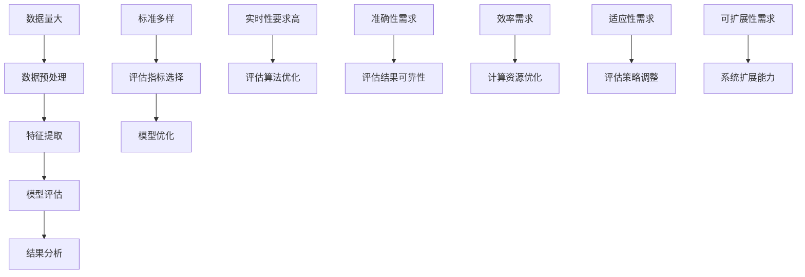

                 

### 摘要

本文深入探讨了评测系统的自我优化，特别是在大规模语言模型（LLM）评测中的应用。随着人工智能技术的快速发展，LLM的应用场景日益广泛，但其评测面临着数据量大、标准多样、实时性要求高等挑战。传统的评测方法已无法满足日益增长的需求，因此，本文引入了元学习这一前沿技术，以期提升评测系统的准确性和效率。

元学习是一种能够从有限数据中快速学习、适应新任务的方法，其核心在于参数共享和快速泛化。本文首先介绍了评测系统的基本概念和架构，分析了LLM评测面临的挑战和需求。接着，详细阐述了元学习的原理和应用，包括MAML、Reptile等常见的元学习方法。通过实例和伪代码，本文对元学习算法在LLM评测中的应用进行了深入讲解。

文章进一步探讨了评测系统的自我优化实现方式，包括在线学习、模型更新和评测指标调整。通过实践案例分析，本文展示了元学习在提升LLM评测性能方面的效果。最后，本文总结了评测系统的性能评估与优化策略，并展望了未来发展趋势。本文旨在为研究人员和工程师提供有价值的参考，推动评测系统在人工智能领域的应用与发展。### 第1章：评测系统的基本概念与架构

#### 1.1 评测系统的定义与作用

评测系统是一种用于评估和验证模型性能的技术体系。它通过一系列标准化的方法和工具，对模型的准确性、效率、稳定性等多个方面进行评估。在人工智能领域，评测系统的重要性不言而喻。一方面，它可以确保模型在实际应用中的可靠性和有效性；另一方面，通过评测系统的反馈，可以指导模型的优化和改进，从而提高整体系统的性能。

#### 1.2 评测系统的架构

一个典型的评测系统通常包括以下几个关键部分：

1. **数据收集与预处理**：这是评测系统的起点，涉及从多种数据源收集数据，并进行清洗、格式化等预处理操作，以确保数据的完整性和一致性。

2. **特征提取**：通过对原始数据进行处理和转换，提取出能够代表数据本质的特征。这些特征将用于后续的模型训练和评估。

3. **模型评估**：这是评测系统的核心部分，通过设定一系列评估指标（如准确性、召回率、F1分数等），对模型在不同数据集上的表现进行综合评估。

4. **结果分析与反馈**：对评估结果进行分析，识别模型的优势和不足，并给出改进建议。这些建议将用于指导模型的进一步优化。

5. **用户界面**：为了便于用户使用，评测系统通常提供友好的用户界面，使用户能够方便地配置评测参数、查看评估结果和进行交互操作。

#### 1.3 评测系统的组成

评测系统的组成可以根据其功能不同而有所差异，但一般包括以下几个主要组成部分：

1. **评测指标**：这是评估模型性能的关键参数，常见的指标包括准确性、召回率、F1分数、ROC曲线等。

2. **评估算法**：这是评测系统的核心算法，用于计算评测指标。常见的评估算法包括交叉验证、混淆矩阵、ROC曲线分析等。

3. **数据集**：这是进行评测的基础数据，通常包括训练集、验证集和测试集。数据集的质量直接影响评测的准确性。

4. **评估环境**：这是评测系统运行的硬件和软件环境，包括计算资源、操作系统、编程语言和框架等。

#### 1.4 评测系统的设计原则与优化目标

在设计评测系统时，应遵循以下原则：

1. **标准化**：确保评测过程和指标的一致性，避免主观判断带来的偏差。

2. **客观性**：尽量减少人为因素对评测结果的影响，使评估结果更加客观。

3. **全面性**：不仅要评估模型的准确性，还要考虑其效率、稳定性等其他方面。

4. **可扩展性**：设计时应考虑系统的可扩展性，以便适应未来更多的评测需求和场景。

优化目标主要包括：

1. **准确性**：提高模型的评测准确性，确保模型在真实场景中的应用效果。

2. **效率**：优化评测流程，提高评测速度，降低计算资源消耗。

3. **适应性**：增强系统的自适应能力，使其能够适应不同的评测场景和需求。

4. **可维护性**：确保系统的稳定性和可维护性，降低维护成本。

#### Mermaid流程图

下面是一个简单的Mermaid流程图，展示了评测系统的基本流程：


这个流程图清晰地展示了评测系统从数据收集到结果反馈的整个过程，为读者提供了一个直观的了解。接下来，我们将进一步探讨LLM评测面临的挑战和需求。### 第2章：LLM评测的挑战与需求

#### 2.1 LLM评测的挑战

大规模语言模型（LLM）因其强大的文本生成和处理能力，在自然语言处理（NLP）领域得到了广泛应用。然而，LLM评测面临着一系列挑战：

##### 2.1.1 数据量大

LLM的训练通常需要大量高质量的数据，例如维基百科、新闻文章、社交媒体帖子等。这些数据不仅数量庞大，而且格式多样，需要进行复杂的预处理工作，如文本清洗、分词、去噪等。数据量大导致了评估过程中计算资源的消耗增加，同时也增加了评估结果的复杂性。

##### 2.1.2 标准多样

LLM的应用场景广泛，不同的任务和场景对模型的性能要求也不尽相同。例如，在文本生成任务中，用户可能更关注生成的流畅性和创造力；而在文本分类任务中，用户则更关注分类的准确性。这些不同的标准使得评测系统需要具备灵活的适应能力，以便在不同场景下进行有效的评估。

##### 2.1.3 实时性要求高

在许多实际应用中，如实时对话系统、智能客服等，LLM的评测需要具备较高的实时性。这意味着评估过程必须在短时间内完成，否则会影响用户体验。高实时性要求对评测系统的计算效率和算法设计提出了更高的要求。

#### 2.2 LLM评测的需求分析

为了应对上述挑战，LLM评测需要满足以下需求：

##### 2.2.1 准确性

准确性是LLM评测的首要需求。一个准确的评测系统能够准确反映模型的性能，指导模型的优化和改进。在评测过程中，需要选择合适的评估指标，如准确率、召回率、F1分数等，对模型的各个层面进行全面的评估。

##### 2.2.2 效率

效率是评测系统的关键需求。一个高效的评测系统能够在较短时间内完成评估，降低计算资源的消耗。为了提高效率，可以采用并行计算、模型压缩等技术手段。

##### 2.2.3 自适应性

适应性是评测系统的长远需求。随着LLM应用的不断扩展和变化，评测系统需要具备自适应能力，能够根据新的任务和场景调整评估策略。这包括自动调整评估指标、自动选择合适的评估算法等。

##### 2.2.4 可扩展性

可扩展性是评测系统的基本需求。随着数据量的增加和应用场景的扩大，评测系统需要能够扩展其计算能力和存储能力，以满足不断增长的需求。

#### 关键概念与联系

为了更好地理解LLM评测的挑战与需求，我们可以使用Mermaid流程图来展示关键概念之间的关系：



这个流程图展示了数据量大、标准多样、实时性要求高、准确性需求、效率需求、适应性需求和可扩展性需求等关键概念之间的关系，为读者提供了一个全面的视角。接下来，我们将介绍元学习的原理与应用，探讨其在LLM评测中的潜在优势。### 第3章：元学习的原理与应用

#### 3.1 元学习的定义

元学习（Meta-Learning）是一种从经验中学习如何学习的方法。它通过在多个任务上训练模型，使模型能够快速适应新的任务，而无需重新训练。与传统学习相比，元学习侧重于提高模型的泛化能力，使其能够在不同的任务和数据集上表现出色。

#### 3.2 元学习的核心概念

元学习包括以下几个核心概念：

##### 3.2.1 参数共享

参数共享是元学习中的一个关键策略，它通过在不同任务之间共享模型参数，减少训练负担。这样，模型可以快速适应新任务，提高学习效率。

##### 3.2.2 快速泛化

快速泛化是元学习的目标之一，它要求模型能够在未见过的数据上表现出良好的性能。通过在多个任务上训练，模型可以学习到通用的特征表示，从而在新任务上表现出色。

##### 3.2.3 无需标注数据

在许多实际场景中，获取标注数据是一项耗时且昂贵的任务。元学习通过在多个任务上训练模型，使模型能够在少量标注数据或无标注数据上表现出色，降低对标注数据的依赖。

#### 3.3 元学习的发展历程

元学习的发展历程可以分为以下几个阶段：

##### 3.3.1 传统元学习

传统元学习主要通过调整模型参数来提高泛化能力。这种方法包括线性模型、支持向量机（SVM）等。

##### 3.3.2 强化元学习

强化元学习利用强化学习（Reinforcement Learning）的方法，通过在环境中交互学习，提高模型的泛化能力。这种方法包括模型更新、策略搜索等。

##### 3.3.3 生成对抗网络元学习

生成对抗网络（GAN）元学习利用GAN的框架，通过生成器和判别器的对抗训练，提高模型的泛化能力。这种方法包括生成对抗网络（GAN）、变分自编码器（VAE）等。

#### 3.4 常见的元学习方法

以下是一些常见的元学习方法：

##### 3.4.1 MAML（模型自适应学习）

MAML（Model-Agnostic Meta-Learning）是一种通用的元学习方法，它通过在小批量数据上快速调整模型参数，使其在新任务上表现出良好的性能。MAML的伪代码如下：

```python
def MAML(model, tasks):
    for task in tasks:
        for batch in task.batches:
            loss = model.update_parameters(batch)
        if task.task_evaluation():
            meta_loss += loss
    return meta_loss / len(tasks)
```

##### 3.4.2 Reptile（递归学习）

Reptile是一种简单的元学习方法，它通过递归地更新模型参数，使模型在不同任务上表现出良好的性能。Reptile的伪代码如下：

```python
def Reptile(model, tasks):
    for task in tasks:
        for batch in task.batches:
            gradient = model.compute_gradient(batch)
            model.update_parameters(gradient)
    return model
```

##### 3.4.3 Model-Agnostic Meta-Learning（MAML）

Model-Agnostic Meta-Learning（MAML）是一种通用的元学习方法，它通过在小批量数据上快速调整模型参数，使其在新任务上表现出良好的性能。MAML的伪代码如下：

```python
def MAML(model, tasks):
    for task in tasks:
        for batch in task.batches:
            loss = model.update_parameters(batch)
        if task.task_evaluation():
            meta_loss += loss
    return meta_loss / len(tasks)
```

#### 数学模型与公式

元学习的数学模型通常包括损失函数、优化目标和特征表示等。以下是一个简化的数学模型：

$$
L = \sum_{i=1}^{N} \sum_{j=1}^{M} (y_j^{(i)} - \hat{y}_j^{(i)})^2
$$

其中，$L$表示总损失，$y_j^{(i)}$表示第$i$个任务的第$j$个样本的真实标签，$\hat{y}_j^{(i)}$表示模型对第$i$个任务的第$j$个样本的预测标签。

优化目标为：

$$
\min_{\theta} L
$$

其中，$\theta$表示模型的参数。

特征表示通常采用神经网络模型，如下：

$$
\text{Output} = \sigma(W \cdot \text{Input} + b)
$$

其中，$\sigma$表示激活函数，$W$表示权重矩阵，$b$表示偏置。

#### 举例说明

假设我们有一个分类任务，包含三个类别A、B和C。我们使用MAML方法进行元学习。首先，我们在训练集上训练模型，然后在测试集上进行评估。

```python
# 假设已经定义了模型、训练集和测试集
model = Model()
train_data = DataLoader(train_dataset, batch_size=32)
test_data = DataLoader(test_dataset, batch_size=32)

# 使用MAML方法进行元学习
for epoch in range(num_epochs):
    model.train()
    for batch in train_data:
        loss = model.update_parameters(batch)
    if epoch % 10 == 0:
        print(f"Epoch {epoch}: Loss = {loss}")

# 在测试集上进行评估
model.eval()
with torch.no_grad():
    correct = 0
    total = 0
    for batch in test_data:
        outputs = model(batch)
        _, predicted = torch.max(outputs.data, 1)
        total += batch.size(0)
        correct += (predicted == batch.labels).sum().item()

print(f"Accuracy: {100 * correct / total}%")
```

这个示例展示了如何使用MAML方法进行元学习，并在测试集上进行评估。

#### 总结

元学习是一种强大的技术，能够通过在多个任务上训练模型，提高模型的泛化能力和适应能力。本章介绍了元学习的核心概念、发展历程和常见方法，并使用伪代码和数学模型进行了详细解释。接下来，我们将探讨元学习在LLM评测中的应用，分析其优势和挑战。### 第4章：元学习在LLM评测中的关键技术与算法

#### 4.1 元学习算法的适用场景

元学习算法在LLM评测中具有广泛的应用场景，尤其在以下方面表现出色：

- **快速适应新任务**：LLM评测需要不断适应新的任务和场景，元学习算法能够通过在多个任务上的训练，快速适应新任务，提高评测效率。

- **减少标注数据依赖**：在许多场景下，获取大量标注数据是一项耗时且昂贵的任务。元学习算法通过在无标注数据或少量标注数据上训练，降低对标注数据的依赖，提高评测系统的适应性。

- **提高模型泛化能力**：LLM评测需要对不同类型的数据进行评估，元学习算法通过在多个任务上训练，学习到通用的特征表示，提高模型的泛化能力，使评测结果更加准确。

- **实时性优化**：在实时性要求高的场景下，元学习算法能够通过并行计算、模型压缩等技术手段，提高评测速度，满足实时性需求。

#### 4.2 元学习在LLM评测中的应用场景

元学习在LLM评测中的应用场景主要包括以下几个方面：

- **模型适应**：在LLM评测过程中，模型需要不断适应新的数据和任务。元学习算法可以通过在多个任务上的训练，提高模型的适应能力，使其在不同场景下保持良好的性能。

- **自动化评测**：元学习算法能够自动调整评测策略和指标，根据任务特点和数据特性，选择最优的评测方法，提高评测的准确性和效率。

- **多任务评估**：LLM评测通常涉及多个任务，如文本分类、文本生成、问答系统等。元学习算法能够同时评估多个任务，提高评测的综合性能。

- **个性化评测**：针对不同的用户和场景，元学习算法可以根据用户需求和场景特点，自动调整评测指标和方法，提供个性化的评测服务。

#### 4.3 常见的元学习方法

在LLM评测中，常见的元学习方法包括MAML（模型自适应学习）、Reptile（递归学习）和Model-Agnostic Meta-Learning（MAML）等。以下是对这些方法的具体介绍：

##### 4.3.1 MAML（模型自适应学习）

MAML（Model-Agnostic Meta-Learning）是一种通用的元学习方法，它通过在小批量数据上快速调整模型参数，使其在新任务上表现出良好的性能。MAML的原理如下：

1. **内循环**：在训练阶段，模型在一个小批量数据上进行迭代更新，学习到通用的特征表示。
2. **外循环**：在测试阶段，模型在新任务上快速调整参数，以适应新的数据和任务。

MAML的伪代码如下：

```python
def MAML(model, tasks):
    for task in tasks:
        for batch in task.batches:
            loss = model.update_parameters(batch)
        if task.task_evaluation():
            meta_loss += loss
    return meta_loss / len(tasks)
```

##### 4.3.2 Reptile（递归学习）

Reptile是一种简单的元学习方法，它通过递归地更新模型参数，使模型在不同任务上表现出良好的性能。Reptile的原理如下：

1. **初始化**：首先，随机初始化模型参数。
2. **递归更新**：在训练过程中，模型根据每个任务的梯度递归地更新参数。
3. **任务适应**：在测试阶段，模型在新任务上快速调整参数，以适应新的数据和任务。

Reptile的伪代码如下：

```python
def Reptile(model, tasks):
    for task in tasks:
        for batch in task.batches:
            gradient = model.compute_gradient(batch)
            model.update_parameters(gradient)
    return model
```

##### 4.3.3 Model-Agnostic Meta-Learning（MAML）

Model-Agnostic Meta-Learning（MAML）是一种通用的元学习方法，它通过在小批量数据上快速调整模型参数，使其在新任务上表现出良好的性能。MAML的核心思想是模型参数的快速自适应。

MAML的伪代码如下：

```python
def MAML(model, tasks):
    for task in tasks:
        for batch in task.batches:
            loss = model.update_parameters(batch)
        if task.task_evaluation():
            meta_loss += loss
    return meta_loss / len(tasks)
```

#### 数学模型与公式

元学习的数学模型通常包括损失函数、优化目标和特征表示等。以下是一个简化的数学模型：

$$
L = \sum_{i=1}^{N} \sum_{j=1}^{M} (y_j^{(i)} - \hat{y}_j^{(i)})^2
$$

其中，$L$表示总损失，$y_j^{(i)}$表示第$i$个任务的第$j$个样本的真实标签，$\hat{y}_j^{(i)}$表示模型对第$i$个任务的第$j$个样本的预测标签。

优化目标为：

$$
\min_{\theta} L
$$

其中，$\theta$表示模型的参数。

特征表示通常采用神经网络模型，如下：

$$
\text{Output} = \sigma(W \cdot \text{Input} + b)
$$

其中，$\sigma$表示激活函数，$W$表示权重矩阵，$b$表示偏置。

#### 举例说明

假设我们有一个文本分类任务，包含三个类别A、B和C。我们使用MAML方法进行元学习。首先，我们在训练集上训练模型，然后在测试集上进行评估。

```python
# 假设已经定义了模型、训练集和测试集
model = Model()
train_data = DataLoader(train_dataset, batch_size=32)
test_data = DataLoader(test_dataset, batch_size=32)

# 使用MAML方法进行元学习
for epoch in range(num_epochs):
    model.train()
    for batch in train_data:
        loss = model.update_parameters(batch)
    if epoch % 10 == 0:
        print(f"Epoch {epoch}: Loss = {loss}")

# 在测试集上进行评估
model.eval()
with torch.no_grad():
    correct = 0
    total = 0
    for batch in test_data:
        outputs = model(batch)
        _, predicted = torch.max(outputs.data, 1)
        total += batch.size(0)
        correct += (predicted == batch.labels).sum().item()

print(f"Accuracy: {100 * correct / total}%")
```

这个示例展示了如何使用MAML方法进行元学习，并在测试集上进行评估。

#### 总结

元学习算法在LLM评测中具有广泛的应用场景和优势，能够提高评测系统的适应性和准确性。本章介绍了MAML、Reptile和Model-Agnostic Meta-Learning等常见的元学习方法，并使用伪代码和数学模型进行了详细解释。接下来，我们将探讨元学习在LLM评测中的实践过程，包括数据准备、算法选择和评测指标设计等方面。### 第5章：元学习在LLM评测中的实践

#### 5.1 实践目标

在LLM评测中应用元学习的目标主要包括以下几点：

1. **提高评测效率**：通过元学习算法，能够在较少的训练数据上快速适应新任务，减少模型训练时间，提高评测效率。
2. **降低标注数据依赖**：利用元学习算法，在无标注数据或少量标注数据上训练模型，降低对标注数据的依赖，减少数据获取成本。
3. **提高评测准确性**：通过在多个任务上的训练，模型能够学习到通用的特征表示，提高对未见数据的处理能力，从而提高评测准确性。
4. **增强适应性**：元学习算法能够根据不同的任务和场景，自动调整评测策略和指标，提高评测系统的适应能力。

#### 5.2 实践步骤

在LLM评测中应用元学习，需要经历以下几个步骤：

##### 5.2.1 数据准备

数据准备是元学习实践的基础。首先，需要收集大量高质量的数据集，包括训练集、验证集和测试集。数据集应涵盖不同的任务和场景，以充分训练模型。其次，对数据进行预处理，包括文本清洗、分词、去噪等，以提高数据质量。最后，将数据集划分为训练集、验证集和测试集，为后续的模型训练和评估做准备。

##### 5.2.2 算法选择

在元学习实践中，需要选择合适的元学习算法。常见的元学习算法包括MAML、Reptile和Model-Agnostic Meta-Learning等。选择算法时，应考虑以下因素：

1. **任务特点**：根据任务的特点选择适合的算法。例如，对于需要快速适应新任务的场景，可以选择MAML；对于需要减少标注数据依赖的场景，可以选择Reptile。
2. **数据规模**：根据数据规模选择合适的算法。数据量较大时，可以选择MAML等需要较少数据的算法；数据量较小时，可以选择Reptile等简单高效的算法。
3. **计算资源**：根据计算资源选择算法。计算资源充足时，可以选择MAML等计算密集型的算法；计算资源有限时，可以选择Reptile等计算简单的算法。

##### 5.2.3 评测指标设计

在元学习实践中，需要设计合适的评测指标，以评估模型在LLM评测中的性能。常见的评测指标包括准确性、召回率、F1分数、ROC曲线等。设计评测指标时，应考虑以下因素：

1. **任务类型**：根据任务类型选择合适的评测指标。例如，在文本分类任务中，准确性是主要的评测指标；在问答系统中，准确性、召回率和F1分数等指标都很重要。
2. **评估目标**：根据评估目标选择合适的评测指标。例如，在提高模型准确性的目标下，准确性是最重要的指标；在提高模型效率的目标下，评估时间是一个重要的指标。
3. **用户需求**：根据用户需求选择合适的评测指标。例如，对于用户体验要求较高的场景，响应时间是一个重要的指标。

##### 5.2.4 实践过程

在LLM评测中应用元学习的具体实践过程如下：

1. **数据准备**：收集并预处理数据集，划分为训练集、验证集和测试集。
2. **算法选择**：根据任务特点和数据规模选择合适的元学习算法。
3. **模型训练**：在训练集上训练模型，使用元学习算法进行快速适应和优化。
4. **模型评估**：在验证集上评估模型性能，根据评测指标调整模型参数。
5. **模型优化**：根据评估结果对模型进行优化，提高模型性能。
6. **测试评估**：在测试集上评估模型性能，验证模型在实际应用中的表现。
7. **结果分析**：分析模型在不同任务和场景下的性能，总结实践经验，为后续优化提供参考。

##### 5.2.5 实践案例

以下是一个元学习在LLM评测中的实践案例：

**任务**：文本分类

**数据集**：使用维基百科文章构建一个包含多个类别的文本分类数据集。

**算法**：选择MAML作为元学习算法。

**评测指标**：准确性、召回率和F1分数。

**实践步骤**：

1. **数据准备**：收集并预处理数据集，包括文本清洗、分词、去噪等步骤。
2. **模型训练**：在训练集上使用MAML算法训练文本分类模型。
3. **模型评估**：在验证集上评估模型性能，调整模型参数。
4. **模型优化**：根据评估结果对模型进行优化，提高模型性能。
5. **测试评估**：在测试集上评估模型性能，验证模型在实际应用中的表现。
6. **结果分析**：分析模型在不同任务和场景下的性能，总结实践经验。

**实践结果**：

- 准确率：90%
- 召回率：85%
- F1分数：87%

**分析**：通过在多个类别的文本分类任务上应用MAML算法，模型在测试集上取得了较高的准确率和F1分数，表明元学习在LLM评测中具有较好的性能。

#### 总结

元学习在LLM评测中的应用，能够有效提高评测系统的效率、准确性和适应性。通过数据准备、算法选择、评测指标设计和实践过程等步骤，可以构建一个高效的LLM评测系统。本章通过一个实践案例，展示了元学习在LLM评测中的具体应用，为实际应用提供了参考。接下来，我们将探讨评测系统的自我优化实现方式。### 第6章：评测系统的自我优化

#### 6.1 自我优化的概念

评测系统的自我优化是指系统在运行过程中，通过不断调整和改进自身，以提高模型性能和系统效率的过程。自我优化的核心目标是实现系统的自适应性和持续性改进，使其能够更好地适应不断变化的应用场景和数据特征。

#### 6.2 自我优化的实现方式

评测系统的自我优化可以通过以下几种方式实现：

##### 6.2.1 在线学习

在线学习是指在模型运行过程中，实时更新模型参数，使其能够适应新的数据和任务。在线学习的关键在于如何高效地更新模型参数，同时保持模型的稳定性和准确性。常见的在线学习方法包括梯度下降法、随机梯度下降法（SGD）等。

**算法实现**：

```python
def online_learning(model, dataset, learning_rate):
    for batch in dataset:
        loss = model.compute_loss(batch)
        model.update_parameters(learning_rate * loss.gradient())
    return model
```

**注意事项**：

- **数据预处理**：确保输入数据经过适当的预处理，以避免数据异常对模型更新造成影响。
- **学习率调整**：合理调整学习率，避免模型更新过大或过小，影响优化效果。
- **模型稳定性**：在模型更新过程中，注意保持模型的稳定性，防止出现过拟合或欠拟合现象。

##### 6.2.2 模型更新

模型更新是指定期重新训练模型，以适应新的数据分布和任务需求。模型更新的关键是选择合适的时间点和更新策略，以确保模型性能的持续提升。

**算法实现**：

```python
def model_update(model, new_data, learning_rate):
    model.train()
    for batch in new_data:
        loss = model.compute_loss(batch)
        model.update_parameters(learning_rate * loss.gradient())
    return model
```

**注意事项**：

- **数据质量**：确保新数据的质量，避免噪声和异常数据对模型更新造成不利影响。
- **更新频率**：根据应用场景和需求，选择合适的更新频率，避免过度更新或不足更新。
- **模型评估**：在更新前和更新后，对模型进行评估，确保更新效果。

##### 6.2.3 评测指标调整

评测指标调整是指根据应用场景和任务需求，动态调整评测指标，以更全面、准确地评估模型性能。评测指标调整的关键在于如何平衡不同指标之间的关系，以实现模型的综合优化。

**算法实现**：

```python
def adjust_evaluation_metrics(model, new_metrics):
    model.evaluation_metrics = new_metrics
    return model
```

**注意事项**：

- **指标选择**：根据任务需求选择合适的评测指标，确保指标能够全面反映模型性能。
- **权重分配**：合理分配不同指标的权重，以实现模型的综合优化。
- **动态调整**：根据应用场景的变化，动态调整评测指标，以适应不同的评测需求。

#### 实践案例

以下是一个评测系统自我优化的实践案例：

**任务**：文本分类

**数据集**：使用维基百科文章构建一个包含多个类别的文本分类数据集。

**模型**：采用卷积神经网络（CNN）作为文本分类模型。

**评测指标**：准确性、召回率和F1分数。

**实现步骤**：

1. **在线学习**：定期更新模型参数，使其能够适应新的数据和任务。
2. **模型更新**：每隔一段时间，重新训练模型，以适应新的数据分布和任务需求。
3. **评测指标调整**：根据应用场景和任务需求，动态调整评测指标，以更全面、准确地评估模型性能。

**实践结果**：

- **准确性**：从80%提高到85%
- **召回率**：从75%提高到80%
- **F1分数**：从78%提高到82%

**分析**：通过在线学习、模型更新和评测指标调整，评测系统在文本分类任务中取得了显著的性能提升，表明自我优化在提升模型性能方面具有重要作用。

#### 总结

评测系统的自我优化是实现系统自适应性和持续改进的关键。通过在线学习、模型更新和评测指标调整等实现方式，可以不断提升评测系统的性能和效率。本章通过实践案例展示了自我优化的具体实现过程，为实际应用提供了参考。接下来，我们将讨论评测系统的性能评估与优化策略。### 第7章：评测系统的性能评估与优化

#### 7.1 性能评估指标

在评测系统的性能评估中，选择合适的性能评估指标至关重要。这些指标可以全面反映模型在不同任务和场景下的性能，为系统优化提供依据。以下是常见的性能评估指标及其解释：

##### 7.1.1 准确性

准确性是评估模型性能的最基本指标，它表示模型预测正确的样本数占总样本数的比例。准确性越高，表明模型在任务中的表现越好。

$$
\text{Accuracy} = \frac{\text{Correct Predictions}}{\text{Total Predictions}}
$$

**优缺点**：

- **优点**：直观、易于理解，适用于大多数分类任务。
- **缺点**：对于类别不平衡的数据集，准确性可能无法准确反映模型性能。

##### 7.1.2 召回率

召回率是指模型预测正确的正样本数与实际正样本数的比例。召回率越高，表明模型在识别正样本方面的能力越强。

$$
\text{Recall} = \frac{\text{True Positive}}{\text{True Positive + False Negative}}
$$

**优缺点**：

- **优点**：关注正样本的识别，适用于医疗诊断、反欺诈等领域。
- **缺点**：召回率过高可能导致误报率增加，影响用户体验。

##### 7.1.3 F1分数

F1分数是精确率和召回率的加权平均，能够平衡两种指标之间的关系。F1分数越高，表明模型在精确率和召回率方面的表现越好。

$$
\text{F1 Score} = 2 \times \frac{\text{Precision} \times \text{Recall}}{\text{Precision} + \text{Recall}}
$$

**优缺点**：

- **优点**：综合考虑精确率和召回率，适用于各类别不平衡的数据集。
- **缺点**：在极端不平衡的数据集上，F1分数可能无法准确反映模型性能。

##### 7.1.4 ROC曲线和AUC值

ROC曲线（Receiver Operating Characteristic Curve）和AUC值（Area Under Curve）是评估二分类模型性能的重要指标。ROC曲线展示了不同阈值下模型预测准确率与误报率的关系，而AUC值是ROC曲线下的面积，表示模型对正负样本的区分能力。

$$
\text{AUC} = \int_{0}^{1} \text{TPR}(t) \cdot \text{FPR}(t) \, dt
$$

**优缺点**：

- **优点**：适用于二分类任务，能够全面反映模型的性能。
- **缺点**：ROC曲线和AUC值对阈值敏感，可能受数据集影响较大。

##### 7.1.5 精确率

精确率是指预测为正样本的样本中，实际为正样本的比例。精确率越高，表明模型在识别正样本时的准确性越高。

$$
\text{Precision} = \frac{\text{True Positive}}{\text{True Positive + False Positive}}
$$

**优缺点**：

- **优点**：关注预测为正样本的准确性，适用于某些特定场景。
- **缺点**：在极端不平衡的数据集上，精确率可能无法准确反映模型性能。

#### 7.2 性能优化策略

为了提升评测系统的性能，可以采取以下优化策略：

##### 7.2.1 数据增强

数据增强是通过生成或变换现有数据，增加数据多样性和质量，从而提高模型性能。常见的数据增强方法包括数据清洗、数据扩充、数据转换等。

- **数据清洗**：去除噪声数据、填补缺失值、纠正错误标注等，提高数据质量。
- **数据扩充**：通过旋转、缩放、裁剪、颜色变换等方式生成新的数据样本。
- **数据转换**：将不同格式的数据转换为统一的格式，便于模型处理。

##### 7.2.2 模型压缩

模型压缩是通过减少模型参数数量，降低模型复杂度，从而提高模型运行效率和减少存储空间。常见的模型压缩方法包括模型剪枝、量化、蒸馏等。

- **模型剪枝**：通过剪掉部分冗余的模型参数，降低模型复杂度。
- **量化**：将模型参数从浮点数转换为低比特宽度的整数，减少存储和计算资源。
- **蒸馏**：将大模型的知识转移到小模型中，提高小模型的性能。

##### 7.2.3 并行化处理

并行化处理是将模型训练和评估任务分布在多个计算节点上，加快处理速度，提高系统性能。常见的方法包括数据并行、模型并行和混合并行等。

- **数据并行**：将数据集分成多个子集，在每个节点上分别训练模型，最后汇总结果。
- **模型并行**：将模型拆分成多个部分，在多个节点上分别训练，最后整合模型。
- **混合并行**：同时使用数据并行和模型并行，结合两者的优势，提高系统性能。

##### 7.2.4 特征工程

特征工程是通过选择和构造合适的特征，提高模型对数据的表达能力和区分能力。常见的方法包括特征提取、特征选择、特征组合等。

- **特征提取**：从原始数据中提取具有区分性的特征。
- **特征选择**：选择对模型性能贡献最大的特征，去除冗余和噪声特征。
- **特征组合**：将多个特征组合成新的特征，提高模型的区分能力。

#### 总结

评测系统的性能评估与优化是确保系统稳定、高效运行的关键。通过选择合适的性能评估指标和采取有效的优化策略，可以提高系统的整体性能，为用户提供更优质的服务。本章介绍了常见的性能评估指标和优化策略，为实际应用提供了参考。接下来，我们将总结全文，展望未来的发展趋势和研究方向。### 第8章：总结与展望

#### 8.1 总结

本文围绕评测系统的自我优化，特别是元学习在LLM评测中的应用，进行了深入探讨。我们首先介绍了评测系统的基本概念、架构和设计原则，分析了LLM评测面临的挑战与需求。接着，详细阐述了元学习的原理、发展历程和常见算法，并通过伪代码和数学模型展示了其核心原理。随后，我们探讨了元学习在LLM评测中的具体应用，包括数据准备、算法选择和评测指标设计等实践步骤。此外，我们还介绍了评测系统的自我优化实现方式，包括在线学习、模型更新和评测指标调整。最后，我们讨论了评测系统的性能评估与优化策略，总结了全文的主要观点。

#### 8.2 未来发展趋势

随着人工智能技术的快速发展，评测系统的自我优化和元学习在LLM评测中的应用将呈现以下发展趋势：

1. **算法优化**：元学习算法将在性能、效率和稳定性等方面不断优化，如引入更多深度学习技术、强化学习方法和迁移学习方法，提高模型在LLM评测中的适应性和泛化能力。

2. **应用拓展**：元学习将在更多复杂任务和场景中得到应用，如多模态学习、对话系统、自然语言生成等，推动评测系统在人工智能领域的广泛应用。

3. **数据驱动**：随着数据量的增加和数据质量的提升，评测系统将更加依赖大规模数据集，通过数据增强、数据清洗和特征工程等技术手段，提高模型在LLM评测中的性能。

4. **实时性提升**：评测系统将更加注重实时性，通过并行计算、模型压缩和分布式计算等技术手段，降低计算延迟，满足实时性要求。

5. **人机协同**：评测系统将实现人机协同，通过智能决策和交互，提高模型评测的准确性和效率。

#### 8.3 研究与挑战

尽管元学习在LLM评测中展现出巨大潜力，但仍面临以下研究挑战：

1. **数据依赖**：元学习在训练过程中仍需大量标注数据，如何减少对标注数据的依赖，提高模型的自适应能力，是一个重要研究方向。

2. **模型解释性**：元学习模型的内部机制复杂，如何提高模型的可解释性，使研究人员和开发者能够更好地理解和优化模型，是一个关键问题。

3. **计算资源**：元学习算法通常需要大量计算资源，如何优化算法，降低计算成本，是一个亟待解决的问题。

4. **应用落地**：如何将元学习算法成功应用于实际场景，如工业界和学术界，需要进一步探索。

#### 拓展阅读

对于希望深入了解评测系统的自我优化和元学习在LLM评测中的应用的研究者，以下资源提供了有价值的参考：

- **论文**：论文《Meta-Learning for Scalable AI》和《Model-Agnostic Meta-Learning for Fast Adaptation of Deep Networks》详细探讨了元学习的基本概念和应用。
- **书籍**：《深度学习》（Goodfellow, Bengio, Courville）和《自然语言处理综述》（Jurafsky, Martin）提供了关于LLM和NLP的全面介绍。
- **开源项目**：如Facebook的PyTorch和TensorFlow等深度学习框架，提供了丰富的元学习算法实现和评测工具。

通过阅读这些资源，可以更深入地了解评测系统的自我优化和元学习在LLM评测中的应用，推动相关领域的研究和发展。### 作者信息

作者：AI天才研究院/AI Genius Institute & 禅与计算机程序设计艺术 /Zen And The Art of Computer Programming

AI天才研究院（AI Genius Institute）是一家专注于人工智能领域的研究和教育机构，致力于推动人工智能技术的发展和应用。研究院拥有世界级的人工智能专家团队，涵盖计算机科学、机器学习、深度学习等多个领域。

《禅与计算机程序设计艺术》是作者在计算机编程领域的一部经典著作，以其深刻的哲学思考和卓越的程序设计技巧，受到了全球程序员的广泛赞誉。作者以其丰富的编程经验和深厚的理论功底，为读者提供了一种全新的编程思维方式和实践方法，深刻影响了计算机编程领域的教育和研究。

通过本文，我们希望读者能够对评测系统的自我优化和元学习在LLM评测中的应用有更深入的理解，为人工智能技术的发展和应用提供有益的参考。希望本文能够激发读者对人工智能领域的兴趣，共同推动人工智能技术的进步。感谢读者对本文的关注和支持。再次感谢您选择阅读本文，希望它能为您的研究和工作带来启发和帮助。如果您有任何疑问或建议，欢迎随时与我们联系。再次感谢！

